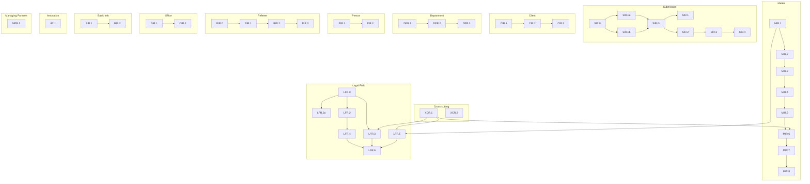

# 43 User Stories Developed in One-Shot: From Validation to Implementation

**Fabricio Ceolin**

*Principal Engineer, The Edge Agent Project*

fabricio@rankellix.com

---

## Abstract

This article documents the execution of 12 epics with 43 user stories using The Edge Agent (TEA) DOT orchestration in two phases: validation and development. Using the methodology described in [Writing TEA with TEA](./writing-tea-with-tea.md), Phase 1 validated all stories with QA workflows, and Phase 2 implemented 43 stories with full development cycles. The development phase completed in approximately 6 hours with zero human intervention.

**Keywords:** TEA, BMad, DOT Workflows, Parallel Execution, Story Development, One-Shot Development

---

## 1. Introduction

A few weeks ago, I documented [how I am using TEA with TEA development](./writing-tea-with-tea.md) — the methodology of using TEA to orchestrate its own development.

With the same approach, I executed 12 epics simultaneously in two phases:

1. **Validation Phase** — All stories validated with QA workflows
2. **Development Phase** — 43 stories across 12 epics implemented autonomously in ~6 hours

## 2. The Approach: Stories as an Executable Graph

Stories are modeled as a **DAG (Directed Acyclic Graph)**:



Each node represents a story. Each edge represents a dependency. TEA respects the dependency order while maximizing parallelism.

## 3. TEA Features That Enabled This

### 3.1 DOT Graph Executor

The DOT graph becomes an executable workflow. Each node is a story, each edge is a dependency. TEA parses the graph, determines execution order, and runs nodes in parallel where dependencies allow.

### 3.2 One Command to Run Everything

```bash
TEA_SHELL_VERBOSE=1 tea run --from-dot development-all-43.dot --verbose --parallel-max 3
```

The `TEA_SHELL_VERBOSE=1` environment variable streams the LLM output to the terminal in real-time.

| Parameter | Purpose |
|-----------|---------|
| `--from-dot` | Execute DOT file as workflow |
| `--verbose` | Show detailed execution progress |
| `--parallel-max 3` | Limit concurrent processes |

### 3.3 Parallel Fan-out/Fan-in

Up to 3 stories run concurrently (limited by local machine resources, not TEA). Stories without dependencies execute in parallel, maximizing throughput while respecting the dependency graph.

### 3.4 Declarative YAML Workflows

The `bmad-story-development.yaml` workflow orchestrates each story execution:

1. Read story specification
2. Analyze existing code
3. Implement changes
4. Run tests
5. Commit code

## 4. The Execution

### 4.1 Story Distribution

```
12 Epics | 43 Stories | ~6 hours

XCR: 2    MIR: 8    LFR: 7    SIR: 8
CIR: 3    DPR: 3    PIR: 2    RIR: 4
OIR: 2    BIR: 2    IIR: 1    MPR: 1
```

### 4.2 Epic Breakdown

| Epic | Domain | Stories |
|------|--------|---------|
| XCR | Cross-cutting (Foundation) | 2 |
| MIR | Matter Import Resolution | 8 |
| LFR | Legal Field Resolution | 7 |
| SIR | Submission Import Resolution | 8 |
| CIR | Client Import Resolution | 3 |
| DPR | Department Resolution | 3 |
| PIR | Person Import Resolution | 2 |
| RIR | Referee Import Resolution | 4 |
| OIR | Office Import Resolution | 2 |
| BIR | Basic Info Resolution | 2 |
| IIR | Innovative Initiatives | 1 |
| MPR | Managing Partners | 1 |

## 5. The Two-Phase Execution

I executed the epic in two distinct phases:

### Phase 1: Validation

```bash
TEA_SHELL_VERBOSE=1 tea run --from-dot validation-all-46.dot --verbose --parallel-max 3
```

Using `bmad-story-validation.yaml`, each story goes through:
- **Risk Profile** — Identify technical and business risks
- **NFR Assessment** — Non-functional requirements analysis
- **Test Design** — QA defines test cases before implementation
- **SM Checklist** — Scrum Master validates Definition of Ready

**Result:** 46 stories across 12 epics validated, ready for development.

### Phase 2: Development

```bash
TEA_SHELL_VERBOSE=1 tea run --from-dot development-all-43.dot --verbose --parallel-max 3
```

Using `bmad-story-development.yaml`, each story goes through:
- **Dev Implementation** — Code changes based on story spec
- **Test Execution** — Run designed tests
- **QA Review** — Validate acceptance criteria
- **Commit** — Incremental commits per story

**Result:** 43 stories implemented in ~6 hours.

### Summary

| Phase | Workflow | Stories | Purpose |
|-------|----------|---------|---------|
| 1 | `bmad-story-validation.yaml` | 46 | QA: risk-profile, NFR, test design |
| 2 | `bmad-story-development.yaml` | 43 | Dev: implement, test, commit |

## 6. Results

- **43 stories developed**
- **Zero human intervention** during execution
- **Code committed incrementally** as each story completed
- **~6 hours** total execution time

## 7. Key Takeaway

Backlogs aren't lists — they're **dependency graphs**. When you model this explicitly:

- Execution becomes **deterministic**
- Parallelization becomes **safe**
- Progress becomes **measurable**

The developer's role shifts: from executor to **work graph architect**.

## 8. References

- [Writing TEA with TEA: A Meta-Development Approach](./writing-tea-with-tea.md) - Phase 1: Validation
- [DOT Workflow Orchestration](./dot-workflow-orchestration.md) - Complete DOT orchestration guide
- [BMad Method v4](https://github.com/bmad-code-org/BMAD-METHOD) - Story creation methodology
- [TEA Documentation](https://fabceolin.github.io/the_edge_agent/) - The Edge Agent official docs
