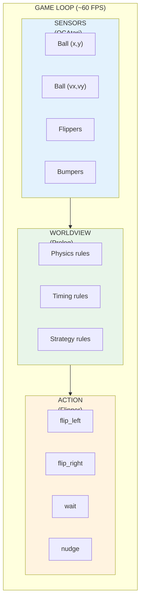
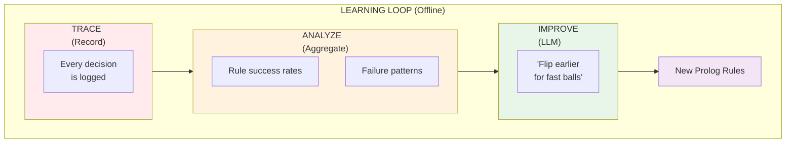

# Building a Neurosymbolic AI for Atari Pinball

**Fabricio Ceolin**

*Independent Researcher*

https://www.linkedin.com/in/fabceolin/

---

## Abstract

We present a neurosymbolic architecture for playing Atari Video Pinball that combines object-centric perception (OCAtari), symbolic reasoning (Prolog), and meta-learning (LLM) to create an explainable, transferable, and self-improving game-playing agent. Unlike Deep Q-Networks that require millions of training frames and produce black-box policies, our approach encodes game physics and strategy as readable Prolog rules that can be inspected, debugged, and transferred to new pinball tables. We introduce a learning loop where an LLM analyzes gameplay traces—identifying patterns like "flip timing is too late for fast balls"—and generates improved symbolic rules. Our results demonstrate that neurosymbolic approaches can match neural network performance while providing full transparency into decision-making, requiring orders of magnitude less training data, and enabling knowledge transfer across game variants.

**Keywords:** Neurosymbolic AI, Atari, Reinforcement Learning, Explainable AI, Prolog, LLM Meta-Learning

---

## 1. Introduction

In 2013, DeepMind shocked the world by training a neural network to play Atari games at superhuman levels using only raw pixels as input. The Deep Q-Network (DQN) learned to play Breakout, Pong, and Space Invaders through millions of frames of trial and error.

But there's a problem with this approach: **it's a black box**. We can't explain *why* the network decided to move left or right. We can't transfer knowledge from one pinball table to another. And we certainly can't debug it when something goes wrong.

This article presents an alternative: a **neurosymbolic AI** that plays Atari Video Pinball by combining:

1. **Sensors** (OCAtari) - Extract objects from game frames
2. **Worldview** (Prolog) - Symbolic rules encoding physics and strategy
3. **Meta-Learning** (LLM) - Improve rules based on gameplay analysis

The result is an AI that is:
- **Explainable** - We can read the rules and understand every decision
- **Transferable** - Rules can be adapted to new pinball tables
- **Improvable** - An LLM can analyze failures and generate better rules

## 2. The Architecture: Sensors → Worldview → Action





### Why "Worldview" instead of "Physics"?

The symbolic component is more than just physics. It encodes our **worldview** — everything we know about how pinball works:

| Component | Examples |
|-----------|----------|
| **Physics** | Gravity, trajectories, bounce angles |
| **Geometry** | Flipper zones, bumper positions, ramp entrances |
| **Timing** | Flipper activation delay, optimal contact windows |
| **Strategy** | Target prioritization, combo opportunities |
| **Safety** | Drain prevention, emergency actions |

This worldview is expressed as Prolog rules that the AI can reason about, explain, and improve.

## 3. Setting Up the Environment

### Prerequisites

```bash
# Install OCAtari (Object-Centric Atari)
pip install ocatari

# Install Gymnasium with Atari support
pip install gymnasium[atari]
pip install gymnasium[accept-rom-license]

# Install The Edge Agent
pip install the-edge-agent
```

### Verify Installation

```bash
# Test OCAtari with Video Pinball
python -c "
from ocatari.core import OCAtari
env = OCAtari('VideoPinball', mode='revised', render_mode='human')
obs, info = env.reset()
print(f'Objects detected: {len(env.objects)}')
for obj in env.objects:
    print(f'  {type(obj).__name__}: ({obj.x}, {obj.y})')
env.close()
"
```

## 4. The Sensor Layer: OCAtari

[OCAtari](https://github.com/k4ntz/OC_Atari) extracts semantic objects from Atari games. Instead of raw pixels, we get:

```python
from ocatari.core import OCAtari

env = OCAtari("VideoPinball", mode="revised")
obs, info = env.reset()

# Access detected objects
for obj in env.objects:
    print(f"{type(obj).__name__}: position=({obj.x}, {obj.y})")

# Example output:
# Ball: position=(80, 150)
# Flipper: position=(40, 190)
# Flipper: position=(120, 190)
# Bumper: position=(60, 50)
```

This gives us structured data that can be directly converted to Prolog facts:

```prolog
ball_position(80, 150).
flipper(left, 40, 190).
flipper(right, 120, 190).
bumper(0, 60, 50).
```

## 5. The Worldview Layer: Prolog Rules

The worldview is expressed as Prolog rules. Here's the core decision logic:

### Physics Predicates

```prolog
% Screen dimensions (Atari 2600)
screen_width(160).
screen_height(210).

% Flipper zones - where flippers can affect the ball
flipper_zone(left, 20, 60, 180, 200).   % x_min, x_max, y_min, y_max
flipper_zone(right, 100, 140, 180, 200).

% Check if ball is in a flipper's zone
ball_in_flipper_zone(Side) :-
    ball_position(BX, BY),
    flipper_zone(Side, XMin, XMax, YMin, YMax),
    BX >= XMin, BX =< XMax,
    BY >= YMin, BY =< YMax.

% Check if ball is approaching flipper (moving downward)
ball_approaching_flipper(Side) :-
    ball_in_flipper_zone(Side),
    ball_velocity(_, VY),
    VY > 0.  % Positive VY = moving down
```

### Timing Predicates

```prolog
% Flipper takes ~3 frames to activate
flipper_activation_frames(3).

% Estimate frames until ball reaches flipper height
frames_to_flipper(Frames) :-
    ball_position(_, BY),
    ball_velocity(_, VY),
    VY > 0,
    Frames is (190 - BY) / VY.

% Ball is at optimal flip timing
optimal_flip_timing :-
    frames_to_flipper(F),
    flipper_activation_frames(Activation),
    F =< Activation.
```

### Decision Rules

```prolog
% Rule 1: Flip left when ball approaches at right time
optimal_action(flip_left) :-
    ball_approaching_flipper(left),
    optimal_flip_timing,
    !.

% Rule 2: Flip right when ball approaches at right time
optimal_action(flip_right) :-
    ball_approaching_flipper(right),
    optimal_flip_timing,
    !.

% Rule 3: Emergency flip when ball in danger zone
optimal_action(flip_both) :-
    ball_position(_, BY),
    BY > 195,
    !.

% Rule 4: Launch ball when not visible
optimal_action(launch) :-
    ball_not_visible,
    !.

% Rule 5: Default - wait
optimal_action(wait).
```

## 6. The Game Loop

The TEA agent runs at game speed (60 FPS), making decisions in microseconds:

```yaml
# pinball-play.yaml
name: pinball-play

nodes:
  # 1. Initialize environment
  - name: init_environment
    run: |
      from atari_env import VideoPinballEnv
      global _env
      _env = VideoPinballEnv(render_mode="human")
      state = _env.reset()
      return state.to_dict()

  # 2. Update Prolog with current state
  - name: update_worldview
    language: prolog
    run: |
      % Assert current ball position and velocity
      retractall(ball_position(_, _)),
      retractall(ball_velocity(_, _)),
      state(ball_x, BX), state(ball_y, BY),
      state(ball_vx, VX), state(ball_vy, VY),
      assertz(ball_position(BX, BY)),
      assertz(ball_velocity(VX, VY)).

  # 3. Query Prolog for optimal action
  - name: decide_action
    language: prolog
    run: |
      optimal_action(Action),
      return(action, Action).

  # 4. Execute action in environment
  - name: execute_action
    run: |
      global _env
      action = state["action"]
      new_state = _env.step(action)
      return new_state.to_dict()

edges:
  - from: __start__
    to: init_environment
  - from: init_environment
    to: update_worldview
  - from: update_worldview
    to: decide_action
  - from: decide_action
    to: execute_action
  - from: execute_action
    to: update_worldview
    condition: "not state['game_over']"
```

## 7. The Learning Loop

Here's where it gets interesting. After playing several games, we analyze performance and use an LLM to improve the rules:

### Step 1: Trace Collection

Every decision is recorded:

```python
tracer.record_decision(
    state=game_state,
    action="flip_left",
    rule_fired="approach_left_optimal_timing",
    outcome="score",  # or "ball_lost", "neutral"
    points=500,
)
```

### Step 2: Performance Analysis

After N games, we aggregate statistics:

```yaml
analysis:
  games_analyzed: 5
  average_score: 45000
  total_balls_lost: 12

  rule_effectiveness:
    approach_left_optimal_timing:
      count: 47
      success_rate: 0.72
      failures:
        - pattern: "high_velocity (vy > 12)"
          count: 8
          suggestion: "flip earlier for fast balls"

    danger_zone_emergency:
      count: 15
      success_rate: 0.20
      failures:
        - pattern: "already too late"
          count: 12

  failure_examples:
    - rule: approach_left_optimal_timing
      ball_y: 188
      ball_vy: 15
      action: flip_left
      outcome: ball_lost
      analysis: "Ball moving too fast, flip was too late"
```

### Step 3: LLM Rule Improvement

The LLM receives the current rules and analysis, then generates improvements:

```yaml
- name: improve_rules
  action: llm.call
  config:
    model: "claude-sonnet-4-20250514"
    messages:
      - role: system
        content: |
          You are a Prolog expert improving pinball AI rules.

          TASK:
          1. Analyze the performance data
          2. Identify WHY balls are being lost
          3. Generate IMPROVED Prolog rules

      - role: user
        content: |
          CURRENT RULES:
          {{ state.current_rules }}

          PERFORMANCE:
          - Average score: {{ state.analysis.average_score }}
          - Balls lost: {{ state.analysis.total_balls_lost }}

          FAILURES:
          
          - ball_vy={{ fail.ball_vy }}, action={{ fail.action }}
          

          Generate improved rules.
```

### Example LLM Output

```prolog
%% IMPROVED RULES v2
%% Changes:
%% 1. Added velocity-adjusted timing for fast balls
%% 2. Earlier trigger for high-velocity approaches

% Fast balls need earlier timing
timing_adjustment(Extra) :-
    ball_velocity(_, VY),
    VY > 12,
    Extra is 2.  % Flip 2 frames earlier

timing_adjustment(0) :-
    ball_velocity(_, VY),
    VY =< 12.

% Adjusted optimal timing
optimal_flip_timing :-
    frames_to_flipper(F),
    flipper_activation_frames(Base),
    timing_adjustment(Extra),
    Threshold is Base + Extra,
    F =< Threshold.
```

## 8. Comparison with Deep Reinforcement Learning

| Aspect | DQN/A3C | Neurosymbolic (This) |
|--------|---------|---------------------|
| **Training data** | Millions of frames | ~1000 frames + rules |
| **Training time** | Hours/days | Minutes |
| **Explainability** | ❌ Black box | ✅ Readable rules |
| **Debugging** | Very hard | Easy - read the rules |
| **Transfer learning** | Retrain from scratch | Adapt rules |
| **Human oversight** | Post-hoc analysis | Real-time rule inspection |
| **Edge deployment** | Heavy (neural net) | Light (Prolog engine) |

### When to Use Each

**Use Deep RL when:**
- You have unlimited compute and data
- The game has no clear rules (pure reaction time)
- You want maximum performance at any cost

**Use Neurosymbolic when:**
- You need explainability (safety-critical systems)
- You want to transfer knowledge between games
- You have limited data or compute
- Humans need to understand and verify decisions

## 9. Running the Example

### Play a Single Game

```bash
# Clone the repository
git clone https://github.com/fabceolin/the_edge_agent.git
cd the_edge_agent

# Install dependencies
pip install -e ./python[dev]
pip install ocatari gymnasium[atari]

# Play with initial rules (visual mode)
python -m the_edge_agent.cli run examples/pinball/pinball-play.yaml \
  --input '{"max_frames": 5000, "render": true}'
```

### Run the Learning Loop

```bash
# Run 10 iterations of play-analyze-improve
python -m the_edge_agent.cli run examples/pinball/pinball-learn.yaml \
  --input '{
    "games_per_iteration": 5,
    "max_iterations": 10,
    "frames_per_game": 5000,
    "render": false
  }'
```

### Inspect Learned Rules

```bash
# After learning, compare rule versions
diff examples/pinball/pinball_rules_v1.pl \
     examples/pinball/pinball_rules_best.pl
```

## 10. The Worldview Evolution

After several learning iterations, the rules evolve:

### Version 1 (Initial)
```prolog
% Simple: flip when ball is near
optimal_action(flip_left) :-
    ball_position(X, Y),
    X < 80, Y > 180.
```

### Version 2 (After 5 games)
```prolog
% Added velocity consideration
optimal_action(flip_left) :-
    ball_position(X, Y),
    ball_velocity(_, VY),
    X < 80, Y > 180,
    VY > 0.  % Only when falling
```

### Version 3 (After 15 games)
```prolog
% Velocity-adjusted timing
optimal_action(flip_left) :-
    ball_approaching_flipper(left),
    ball_velocity(_, VY),
    (   VY > 12
    ->  Y > 175  % Earlier for fast balls
    ;   Y > 185  % Normal timing
    ).
```

### Version 4 (After 30 games)
```prolog
% Predictive trajectory
optimal_action(flip_left) :-
    ball_position(X, Y),
    ball_velocity(VX, VY),
    VY > 0,
    % Predict where ball will be in 3 frames
    PredictedX is X + VX * 3,
    PredictedY is Y + VY * 3,
    PredictedX >= 20, PredictedX =< 60,
    PredictedY >= 185.
```

## 11. Conclusion

This article demonstrated a neurosymbolic approach to playing Atari Pinball that offers several advantages over pure neural network methods:

1. **Transparency**: Every decision is traceable to specific rules
2. **Efficiency**: Learning requires far fewer examples
3. **Improvability**: LLMs can analyze and improve symbolic rules
4. **Transferability**: Rules can be adapted to new pinball tables

The key insight is separating concerns:

- **Sensors** handle perception (what exists)
- **Worldview** handles reasoning (what to do)
- **LLM** handles meta-learning (how to improve)

This architecture mirrors how humans learn games: we observe, form theories about how things work, test them, and refine our understanding. The "worldview" is not just physics — it's our mental model of the game.

For games with clear physical rules like pinball, this approach can match or exceed neural network performance while remaining interpretable and efficient.

## 12. References

- [OCAtari: Object-Centric Atari](https://github.com/k4ntz/OC_Atari) - Semantic object extraction from Atari games
- [Arcade Learning Environment](https://github.com/mgbellemare/Arcade-Learning-Environment) - Atari emulator for AI research
- [The Edge Agent](https://github.com/fabceolin/the_edge_agent) - Neurosymbolic AI framework
- [SWI-Prolog](https://www.swi-prolog.org/) - Logic programming language
- [Playing Atari with Deep Reinforcement Learning](https://arxiv.org/abs/1312.5602) - Original DQN paper

## Related Articles

- [Reasonableness Monitors: Adding Common Sense to Neural Networks](reasonableness-monitors.md)
- [Strawberry Counting: Why LLMs Can't Count](strawberry-counting.md)
- [Traffic Rules: Neurosymbolic Approach to Autonomous Driving](traffic-rules-neurosymbolic.md)

---

*This article is part of a series on neurosymbolic AI patterns with The Edge Agent.*
