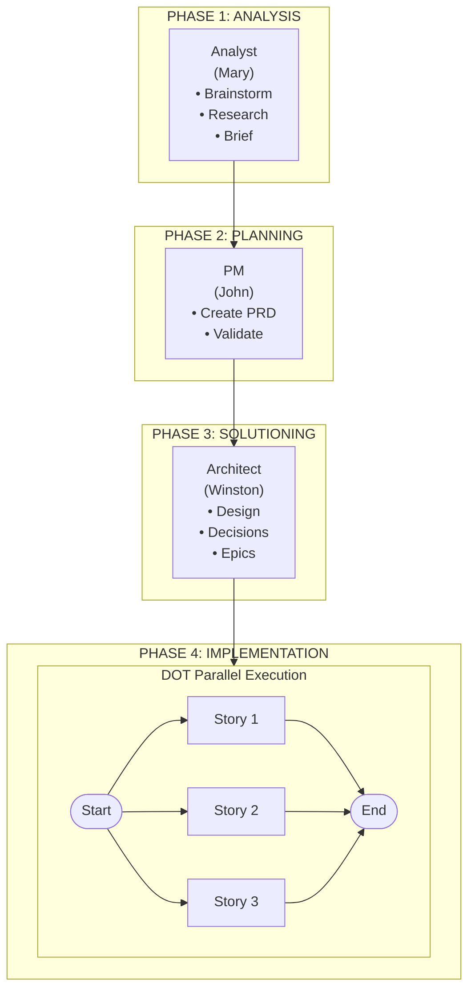
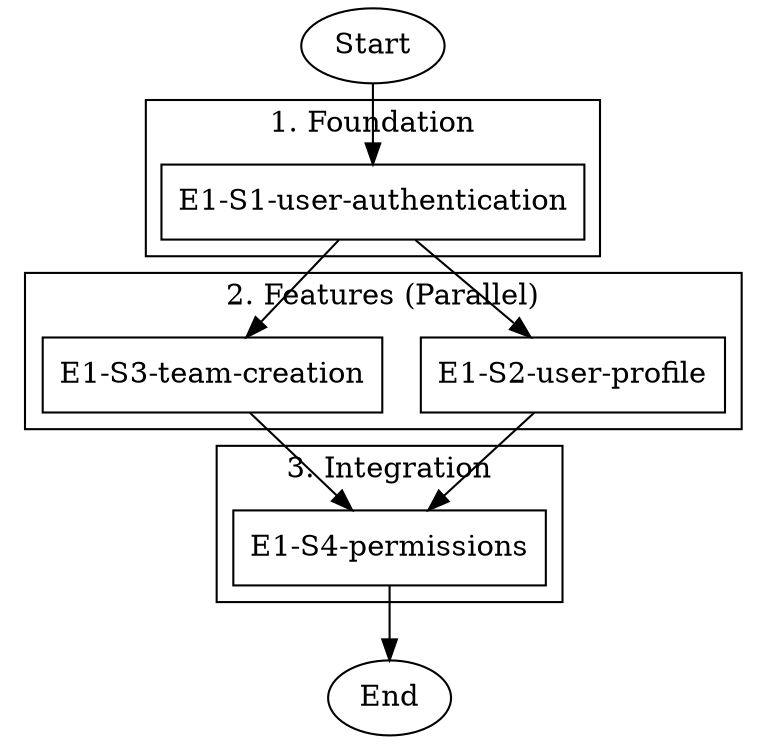
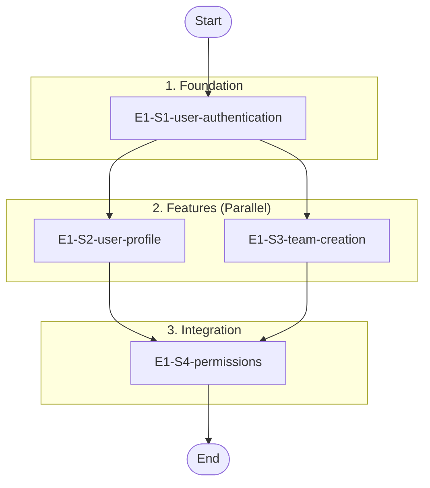

# From Business Idea to Parallel Story Execution: A Complete BMAD + TEA Workflow

**Fabricio Ceolin**

*Principal Engineer, The Edge Agent Project*

https://www.linkedin.com/in/fabceolin/

---

## Abstract

Taking a business idea from conception to production code requires disciplined processes that balance thoroughness with efficiency. This article presents a complete end-to-end workflow combining the BMAD Method (Breakthrough Method of Agile AI Driven Development) with The Edge Agent's DOT workflow orchestration. We demonstrate how to progress from initial brainstorming with an AI Business Analyst through PRD creation, architecture design, and epic/story generation, culminating in parallel story execution that reduces implementation time by 25-70%. The integration of structured AI agent workflows with dependency-aware parallel execution provides a reproducible, scalable approach to software development.

**Keywords:** BMAD, DOT, Workflow Orchestration, AI Agents, Agile Development, Parallel Execution

---

## 1. Introduction

Modern software development faces a paradox: AI tools can accelerate individual tasks dramatically, but coordinating the complete journey from idea to implementation remains challenging. Teams often struggle with:

- **Incomplete requirements** - Starting development without sufficient problem definition
- **Misaligned artifacts** - PRDs that don't match architecture, stories that don't trace to requirements
- **Sequential bottlenecks** - Executing independent stories one at a time
- **Lost context** - Critical decisions scattered across conversations

This article presents a solution: combining BMAD's structured AI agent workflows with TEA's parallel execution capabilities. The result is a reproducible pipeline from business conception to parallel story execution.

### 1.1 The Complete Journey

```
┌─────────────────────────────────────────────────────────────────────────┐
│                         IDEA TO EXECUTION PIPELINE                      │
├─────────────────────────────────────────────────────────────────────────┤
│                                                                         │
│   PHASE 1: ANALYSIS        PHASE 2: PLANNING      PHASE 3: SOLUTIONING │
│   ┌──────────────┐         ┌──────────────┐       ┌──────────────┐     │
│   │   Analyst    │────────▶│     PM       │──────▶│  Architect   │     │
│   │  (Mary)      │         │   (John)     │       │  (Winston)   │     │
│   │              │         │              │       │              │     │
│   │ • Brainstorm │         │ • Create PRD │       │ • Design     │     │
│   │ • Research   │         │ • Validate   │       │ • Decisions  │     │
│   │ • Brief      │         │              │       │ • Epics      │     │
│   └──────────────┘         └──────────────┘       └──────────────┘     │
│                                                            │            │
│   PHASE 4: IMPLEMENTATION                                  ▼            │
│   ┌─────────────────────────────────────────────────────────────────┐  │
│   │                    DOT Parallel Execution                        │  │
│   │  ┌─────┐   ┌─────────┬─────────┬─────────┐   ┌─────┐            │  │
│   │  │Start│──▶│ Story 1 │ Story 2 │ Story 3 │──▶│ End │            │  │
│   │  └─────┘   └─────────┴─────────┴─────────┘   └─────┘            │  │
│   │            (parallel via tmux)                                   │  │
│   └─────────────────────────────────────────────────────────────────┘  │
│                                                                         │
└─────────────────────────────────────────────────────────────────────────┘
```



## 2. Prerequisites

Before starting, ensure you have:

### 2.1 BMAD-METHOD Installation

```bash
# Install BMAD via npm (recommended)
npx bmad-method install

# Follow the installer prompts
```

The installer will set up the `_bmad/` directory with all agents and workflows.

### 2.2 TEA Installation

```bash
# Install The Edge Agent from GitHub
pip install "git+https://github.com/fabceolin/the_edge_agent.git#subdirectory=python"

# Verify installation
tea --version
```

### 2.3 Remote Workflow Support (TEA-CLI-001)

TEA supports loading workflows directly from remote URLs:

| Protocol | Example | Use Case |
|----------|---------|----------|
| `github://` | `github://user/repo@main/path/file.yaml` | GitHub repositories |
| `gitlab://` | `gitlab://user/repo@main/path/file.yaml` | GitLab repositories |
| `s3://` | `s3://bucket/path/file.yaml` | AWS S3 storage |
| `gs://` | `gs://bucket/path/file.yaml` | Google Cloud Storage |

**Caching:** Remote files are cached locally in `~/.cache/tea/remote/` with automatic TTL management.

```bash
# View cached files
tea cache list

# Force fresh fetch (bypass cache)
tea run --from-dot workflow.dot --dot-workflow github://... --no-cache

# Offline mode (cache only)
tea run --from-dot workflow.dot --dot-workflow github://... --cache-only
```

### 2.4 Command Naming Convention

BMAD commands vary based on installation. Common patterns:

| Workflow Command | Agent Command (if enabled) |
|------------------|---------------------------|
| `/product-brief` | `/bmad-agent-bmm-analyst` |
| `/create-prd` | `/bmad-agent-bmm-pm` |
| `/create-architecture` | `/bmad-agent-bmm-architect` |
| `/sprint-planning` | `/bmad-agent-bmm-sm` |
| `/dev-story` | `/bmad-agent-bmm-dev` |

:::{tip}
Run `/bmad-help` to see all available commands in your installation.
:::

### 2.5 Directory Structure

```
your-project/
├── .bmad/                      # BMAD-METHOD (submodule or copy)
│   ├── agents/
│   ├── workflows/
│   └── templates/
├── _bmad-output/
│   ├── planning-artifacts/     # PRD, Architecture, Epics
│   └── implementation-artifacts/ # Stories, Sprint Status
├── examples/
│   ├── dot/                    # DOT workflow files
│   └── workflows/              # TEA workflow YAMLs
└── src/                        # Your source code
```

## 3. Phase 1: Analysis with Business Analyst

The journey begins with the Business Analyst agent (Mary) who helps discover and define the problem space.

### 3.1 Get Help First

```bash
# Start by asking BMAD for guidance
/bmad-help

# Or ask specific questions
/bmad-help How should I start planning a new web application?
```

### 3.2 Brainstorm Session (Optional)

For complex projects, start with brainstorming:

```bash
# Start brainstorming workflow
/brainstorm-project
```

**User prompt:**
```
I want to explore a real-time collaboration platform for distributed teams.
```

Mary (the Analyst) will guide you through structured brainstorming techniques:
- Six Thinking Hats
- SCAMPER analysis
- Mind mapping
- Affinity diagrams

### 3.3 Market/Domain Research (Optional)

After brainstorming, conduct research if needed:

```bash
# Market research
/market-research

# Domain research (for specialized fields)
/domain-research

# Technical research (feasibility)
/technical-research
```

### 3.4 Create Product Brief

The Product Brief captures essential problem definition:

```bash
/product-brief
```

Follow the guided workflow to define:
- Problem statement
- Target users
- Success criteria
- MVP scope

**Output location:** `_bmad-output/planning-artifacts/product-brief.md`

### 3.5 Validate Brief

Before proceeding, validate the brief:

```bash
/validate-brief
```

This checks for:
- Problem clarity
- User definition
- Success criteria
- Scope boundaries

## 4. Phase 2: Planning with Product Manager

With a validated brief, the Product Manager (John) creates the detailed PRD.

### 4.1 Create PRD

```bash
# Start the PRD creation workflow
/create-prd
```

John (the PM) guides you through 12 collaborative discovery steps:
1. Problem statement refinement
2. User personas definition
3. Success metrics (OKRs)
4. User journeys
5. Domain compliance requirements
6. Innovation considerations
7. Project type classification
8. Scope definition
9. Functional requirements
10. Non-functional requirements
11. Constraints and assumptions
12. Final review

**Output location:** `_bmad-output/planning-artifacts/prd.md`

### 4.2 Validate PRD

The PRD validation includes 13 quality checks:

```bash
# Validate the PRD
/validate-prd
```

Validation covers:
- Format correctness
- Density (sufficient detail)
- Brief coverage (traceability)
- Measurability (quantifiable metrics)
- No implementation leakage
- Domain compliance
- Completeness

:::{warning}
Do NOT proceed to architecture until the PRD passes validation.
Incomplete PRDs cause cascading issues in later phases.
:::

## 5. Phase 3: Solutioning with Architect

The Architect (Winston) translates requirements into technical design.

### 5.1 Create Architecture

```bash
# Start the architecture workflow
/create-architecture
```

Winston (the Architect) guides you through 8-step collaborative discovery:
1. Initialize and gather inputs
2. Context gathering (constraints, existing systems)
3. Starter patterns selection
4. Technical decisions (database, API, auth, etc.)
5. Architectural patterns (microservices, monolith, etc.)
6. Structure definition (components, boundaries)
7. Validation against requirements
8. Completion and handoff

**Output location:** `_bmad-output/planning-artifacts/architecture.md`

### 5.2 Validate Architecture (Optional)

```bash
# Validate architecture completeness
/validate-architecture
```

### 5.3 Create Epics and Stories

With architecture defined, break down into epics and stories:

```bash
# Create epics and stories from PRD and architecture
/create-epics-and-stories
```

This produces:
- Prioritized epics (E1, E2, E3...)
- User stories with BDD acceptance criteria
- Dependency relationships between stories

**Output location:** `_bmad-output/planning-artifacts/epics-and-stories.md`

### 5.4 Implementation Readiness Check

**CRITICAL GATE**: Before any development, verify alignment:

```bash
# Check all artifacts are aligned
/implementation-readiness
```

This check ensures:
- ✅ PRD → Epics traceability
- ✅ Epics → Stories breakdown complete
- ✅ Architecture → Stories alignment
- ✅ Story dependencies mapped

## 6. Phase 4: Sprint Planning

The Scrum Master (Bob) prepares stories for development.

### 6.1 Initialize Sprint

```bash
# Initialize sprint tracking
/sprint-planning
```

This creates the sprint status tracking file:

**Output location:** `_bmad-output/implementation-artifacts/sprint-status.yaml`

```yaml
sprint:
  name: "Epic 1 - Foundation"
  start_date: "2024-01-15"
  stories:
    - id: "E1-S1"
      title: "User Authentication"
      status: pending
      dependencies: []
    - id: "E1-S2"
      title: "User Profile Management"
      status: pending
      dependencies: ["E1-S1"]
    - id: "E1-S3"
      title: "Team Creation"
      status: pending
      dependencies: ["E1-S1"]
```

### 6.2 Create Individual Stories

For each story in the sprint:

```bash
# Create detailed story file
/create-story

# Follow the prompts to select which story to create
# Example: E1-S1 (User Authentication)
```

This produces a complete story file with:
- User story (As a... I want... so that...)
- Acceptance criteria (Given/When/Then)
- Ordered tasks and subtasks
- Implementation notes
- Test requirements

**Output location:** `_bmad-output/implementation-artifacts/E1-S1-user-authentication.md`

### 6.3 Validate Story (Optional)

```bash
# Validate story before development
/validate-story
```

## 7. Generating DOT Files for Parallel Execution

With stories created, generate a DOT file for parallel execution.

### 7.1 Analyze Dependencies

First, understand story dependencies from the sprint status:

```bash
# Example dependency graph
E1-S1 (Auth) ─────┬──▶ E1-S2 (Profile)
                  │
                  └──▶ E1-S3 (Team)
                            │
E1-S4 (Permissions) ◀───────┘
```

### 7.2 Create DOT File

Create a DOT file representing the workflow:



**Mermaid Equivalent:**



The DOT graph shows a diamond dependency pattern where:
- **E1-S1** (authentication) must complete first
- **E1-S2** and **E1-S3** can run in parallel after E1-S1
- **E1-S4** (permissions) waits for both E1-S2 and E1-S3 to complete

### 7.3 Critical: Label Matching

Labels MUST match actual story file names. Verify:

```bash
# List actual story files
ls _bmad-output/implementation-artifacts/*.md | xargs -I{} basename {} .md

# Output:
# E1-S1-user-authentication
# E1-S2-user-profile
# E1-S3-team-creation
# E1-S4-permissions
```

Use these exact basenames as labels in your DOT file.

## 8. Executing Stories in Parallel

### 8.1 Choose the Right Workflow

| Workflow | Purpose | When to Use |
|----------|---------|-------------|
| `bmad-story-v6-validation.yaml` | Validate story quality (QA checks) | Before development |
| `bmad-story-v6-development.yaml` | Implement stories (Dev cycle) | During development |
| `bmad-story-v6-standard-cycle.yaml` | Dev → QA → SM cycle | Standard development |
| `bmad-story-v6-full-with-qa-cycle.yaml` | Complete validation + development | End-to-end |

**TEA-CLI-001:** Workflows can be loaded directly from GitHub using `github://` URLs:

### 8.2 Validation Run (Recommended First)

Before development, validate all stories:

```bash
# Using GitHub URL (recommended - always gets latest workflow)
tea run --from-dot examples/dot/epic-1-development.dot \
    --dot-workflow github://fabceolin/the_edge_agent@main/examples/workflows/bmad-story-v6-validation.yaml \
    --dot-max-parallel 3 \
    --dot-session epic1-validation

# Or using local workflow file
tea run --from-dot examples/dot/epic-1-development.dot \
    --dot-workflow examples/workflows/bmad-story-v6-validation.yaml \
    --dot-max-parallel 3 \
    --dot-session epic1-validation
```

### 8.3 Development Run

Execute story development in parallel:

```bash
# Using GitHub URL with verbose output for debugging
TEA_SHELL_VERBOSE=1 tea run --from-dot examples/dot/epic-1-development.dot \
    --dot-workflow github://fabceolin/the_edge_agent@main/examples/workflows/bmad-story-v6-development.yaml \
    --dot-max-parallel 2 \
    --dot-session epic1-dev

# Or use the standard cycle (Dev → QA → SM)
TEA_SHELL_VERBOSE=1 tea run --from-dot examples/dot/epic-1-development.dot \
    --dot-workflow github://fabceolin/the_edge_agent@main/examples/workflows/bmad-story-v6-standard-cycle.yaml \
    --dot-max-parallel 2 \
    --dot-session epic1-dev
```

### 8.4 Monitor Progress

```bash
# Attach to tmux session
tmux attach -t epic1-dev

# List all windows (stories)
tmux list-windows -t epic1-dev

# View specific story progress
tmux select-window -t epic1-dev:E1-S2-user-profile
```

### 8.5 Expected Output

```
Graph loaded: 4 nodes in 3 phases

=== Execution Plan ===
Phase 1 (sequential): E1-S1-user-authentication
Phase 2 (parallel): E1-S2-user-profile, E1-S3-team-creation
Phase 3 (sequential): E1-S4-permissions

>>> Phase 1/3: 1 node(s)...
  Starting: E1-S1-user-authentication
  ✓ Completed: E1-S1-user-authentication (423.7s)

>>> Phase 2/3: 2 node(s)...
  Starting: E1-S2-user-profile
  Starting: E1-S3-team-creation
  ✓ Completed: E1-S3-team-creation (312.4s)
  ✓ Completed: E1-S2-user-profile (389.1s)

>>> Phase 3/3: 1 node(s)...
  Starting: E1-S4-permissions
  ✓ Completed: E1-S4-permissions (278.6s)

=== Execution Complete ===
Total time: 1403.8s (vs sequential: 1803.8s)
Parallelization savings: 22%
```

## 9. Complete Workflow Example

Here's a complete example from idea to parallel execution:

### 9.1 Day 1: Analysis

```bash
# Get oriented
/bmad-help How should I start a new project?

# Optional: Brainstorm ideas
/brainstorm-project
# "Let's explore a task management app for remote teams"

# Optional: Research if needed
/market-research

# Create product brief (REQUIRED)
/product-brief

# Validate the brief
/validate-brief
```

### 9.2 Day 2: Planning

```bash
# Create PRD (REQUIRED)
/create-prd

# Validate PRD
/validate-prd
```

### 9.3 Day 3: Architecture

```bash
# Create Architecture (REQUIRED)
/create-architecture

# Validate architecture
/validate-architecture

# Create Epics and Stories (REQUIRED)
/create-epics-and-stories

# CRITICAL: Check alignment
/implementation-readiness
```

### 9.4 Day 4: Sprint Setup

```bash
# Initialize sprint (REQUIRED)
/sprint-planning

# Create each story
/create-story  # Select E1-S1
/create-story  # Select E1-S2
/create-story  # Select E1-S3
/create-story  # Select E1-S4

# Optional: Validate stories
/validate-story
```

### 9.5 Day 5: Generate DOT and Execute

```bash
# Create DOT file (see Section 7)
vim examples/dot/epic-1-development.dot

# Validate stories first (using GitHub URL)
tea run --from-dot examples/dot/epic-1-development.dot \
    --dot-workflow github://fabceolin/the_edge_agent@main/examples/workflows/bmad-story-v6-validation.yaml \
    --dot-max-parallel 3

# Execute development (using GitHub URL)
tea run --from-dot examples/dot/epic-1-development.dot \
    --dot-workflow github://fabceolin/the_edge_agent@main/examples/workflows/bmad-story-v6-development.yaml \
    --dot-max-parallel 2

# Or run the full cycle (validation + development)
tea run --from-dot examples/dot/epic-1-development.dot \
    --dot-workflow github://fabceolin/the_edge_agent@main/examples/workflows/bmad-story-v6-full-with-qa-cycle.yaml \
    --dot-max-parallel 2
```

## 10. Best Practices

### 10.1 Artifact Traceability

Maintain clear traceability through all phases:

```
Brief → PRD → Architecture → Epic → Story → Code
```

Each document should reference its predecessors.

### 10.2 Validation Gates

Never skip validation steps:

| Gate | Check | Consequence of Skipping |
|------|-------|------------------------|
| Brief Validation | Problem clarity | Vague PRD |
| PRD Validation | Requirements completeness | Missing features |
| Architecture Validation | Technical feasibility | Rework during dev |
| Implementation Readiness | Alignment | Blocked stories |
| Story Validation | Clarity | Developer confusion |

### 10.3 Parallel Execution Guidelines

| Scenario | Recommended `--dot-max-parallel` |
|----------|----------------------------------|
| LLM-heavy (Claude Code) | 2-3 |
| Simple validation | 4-5 |
| Resource-constrained machine | 1-2 |

### 10.4 DOT File Management

- Store DOT files in version control
- Use meaningful names: `epic-1-validation.dot`, `sprint-3-development.dot`
- Include comments explaining dependencies
- Update DOT files when story dependencies change

## 11. Troubleshooting

### 11.1 Story File Not Found

```
Error: Could not resolve story path for label 'E1-S1'
```

**Solution:** Ensure label matches exact file basename:
```bash
ls _bmad-output/implementation-artifacts/ | grep -i E1-S1
```

### 11.2 Circular Dependency Detected

```
Error: Circular dependency: E1-S2 -> E1-S3 -> E1-S2
```

**Solution:** Review story dependencies and remove the cycle:
```dot
// Wrong: Creates cycle
E1_S2 -> E1_S3;
E1_S3 -> E1_S2;

// Correct: Linear dependency
E1_S2 -> E1_S3;
```

### 11.3 Stories Execute Sequentially Despite Parallel Config

Check that stories have proper Start dependencies:
```dot
// Wrong: Sequential chain
Start -> E1_S1 -> E1_S2 -> E1_S3;

// Correct: Parallel from Start
Start -> E1_S1;
Start -> E1_S2;
Start -> E1_S3;
```

## 12. Conclusion

The combination of BMAD's structured AI workflows with TEA's DOT parallel execution provides:

1. **Disciplined discovery** - Brainstorming through deployment with quality gates
2. **Artifact alignment** - Traceability from brief to code
3. **Efficient execution** - 25-70% time savings through parallelization
4. **Reproducibility** - Version-controlled workflows and DOT files
5. **Visibility** - Real-time monitoring via tmux

By following this workflow, teams can transform vague ideas into production code with confidence, leveraging AI agents for analysis and planning while using parallel execution for implementation efficiency.

## 13. Quick Reference

### BMAD Workflow Commands

| Phase | Command | Purpose |
|-------|---------|---------|
| Help | `/bmad-help` | Get guidance on next steps |
| Analysis | `/brainstorm-project` | Facilitated brainstorming |
| Analysis | `/product-brief` | Create product brief |
| Analysis | `/validate-brief` | Validate brief quality |
| Planning | `/create-prd` | Create PRD |
| Planning | `/validate-prd` | Validate PRD quality |
| Solutioning | `/create-architecture` | Technical design |
| Solutioning | `/validate-architecture` | Validate architecture |
| Solutioning | `/create-epics-and-stories` | Break down work |
| Solutioning | `/implementation-readiness` | **CRITICAL** alignment check |
| Implementation | `/sprint-planning` | Initialize sprint |
| Implementation | `/create-story` | Create individual story |
| Implementation | `/dev-story` | Implement story |
| Implementation | `/code-review` | Review code quality |

### Quick Flow (Simple Projects)

```bash
/quick-spec    # Analyze and create tech spec
/quick-dev     # Implement
/code-review   # Validate
```

### Phase Summary

| Phase | Agent | Key Output | Next Step |
|-------|-------|------------|-----------|
| 1. Analysis | Analyst (Mary) | Product Brief | Create PRD |
| 2. Planning | PM (John) | PRD | Create Architecture |
| 3. Solutioning | Architect (Winston) | Architecture, Epics | Sprint Planning |
| 4. Implementation | SM (Bob) + Dev (Amelia) | Stories, Code | Review + Deploy |

### TEA Commands

```bash
# Validate stories (GitHub URL - recommended)
tea run --from-dot workflow.dot \
    --dot-workflow github://fabceolin/the_edge_agent@main/examples/workflows/bmad-story-v6-validation.yaml

# Develop stories (GitHub URL)
tea run --from-dot workflow.dot \
    --dot-workflow github://fabceolin/the_edge_agent@main/examples/workflows/bmad-story-v6-development.yaml

# Standard cycle: Dev → QA → SM (GitHub URL)
tea run --from-dot workflow.dot \
    --dot-workflow github://fabceolin/the_edge_agent@main/examples/workflows/bmad-story-v6-standard-cycle.yaml

# Full cycle with QA validation (GitHub URL)
tea run --from-dot workflow.dot \
    --dot-workflow github://fabceolin/the_edge_agent@main/examples/workflows/bmad-story-v6-full-with-qa-cycle.yaml

# Dry run (preview plan)
tea run --from-dot workflow.dot --dot-dry-run

# Monitor
tmux attach -t tea-dot

# Cache management (for remote workflows)
tea cache list    # Show cached files
tea cache clear   # Clear cache
tea cache info    # Cache statistics
```

## 14. References

- [BMAD-METHOD Repository](https://github.com/bmad-code-org/BMAD-METHOD) - Complete BMAD framework
- [BMAD Documentation](http://docs.bmad-method.org) - Official BMAD documentation
- [DOT Workflow Orchestration](./dot-workflow-orchestration.md) - TEA DOT execution details
- [YAML Reference](../shared/YAML_REFERENCE.md) - TEA workflow syntax
- [TEA Documentation](https://fabceolin.github.io/the_edge_agent/) - Official documentation
- [Graphviz DOT Language](https://graphviz.org/doc/info/lang.html) - DOT syntax reference
