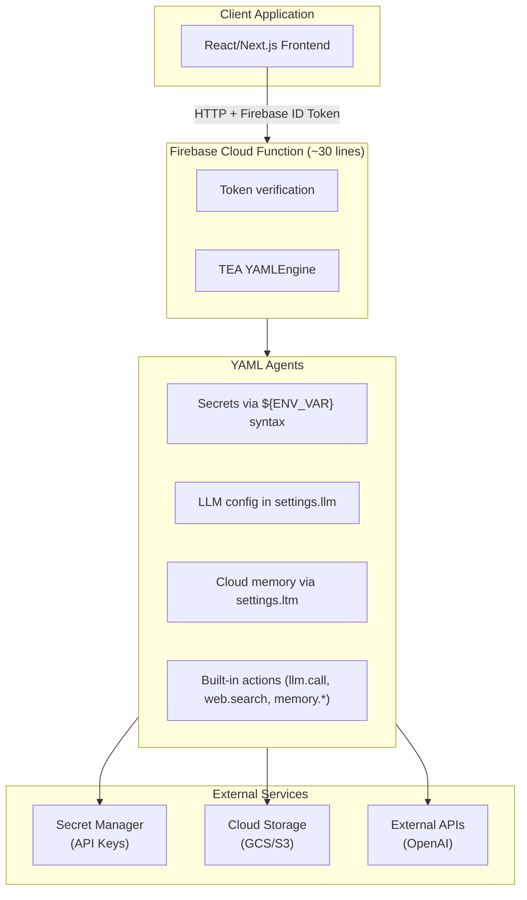

# Deploying AI Agents to Cloud Production with Firebase Cloud Functions

**Fabricio Ceolin**

*Independent Researcher*

fabceolin@gmail.com

---

## Abstract

Moving AI agents from development to cloud production requires careful consideration of authentication, secrets management, stateful execution, and serverless constraints. This article presents a YAML-first architecture for deploying The Edge Agent (TEA) to Firebase Cloud Functions, demonstrating how to build a generic `/run-agent` endpoint with minimal Python code (~30 lines) while leveraging TEA's built-in features for secrets injection, cloud memory persistence, and LLM integration. Our implementation supports both interactive (human-in-the-loop) and batch agents through a unified API, with all agent logic defined declaratively in YAML configuration files.

**Keywords:** Firebase Cloud Functions, Serverless AI, Cloud Deployment, YAML Configuration, State Management

---

## 1. Introduction

Building AI agents locally is straightforward—but deploying them to production introduces several challenges:

- **Authentication**: How do you secure agent endpoints?
- **Secrets Management**: How do you securely provide API keys to agents?
- **State Persistence**: How do you maintain conversation state across requests?
- **Cold Starts**: How do you minimize serverless latency?
- **Configuration**: How do you avoid hardcoding behavior in Python?

Traditional approaches embed agent logic in Python code, requiring changes to source files for every configuration update. This article presents a **YAML-first architecture** where:

- **Python**: Minimal wrapper (~30 lines) that forwards requests to TEA
- **YAML**: All agent logic, secrets, memory backends, and LLM configuration

This separation allows non-developers to modify agent behavior, simplifies deployment, and leverages TEA's built-in capabilities for production workloads.

## 2. Architecture Overview



The architecture separates concerns cleanly:

| Layer | Responsibility | Lines of Code |
|-------|----------------|---------------|
| **Python Wrapper** | HTTP handling, auth verification | ~30 |
| **TEA Engine** | Graph execution, state management | Library |
| **YAML Agents** | All agent logic and configuration | ~100-300 per agent |

## 3. Project Structure

```
firebase/functions-agents/
├── main.py                 # Minimal FastAPI + Firebase export (~80 lines)
├── requirements.txt        # Dependencies
├── agents/                 # YAML agent definitions
│   ├── research_agent.yaml
│   ├── interview_agent.yaml
│   └── ...
└── .gcloudignore          # Deployment exclusions
```

Unlike traditional architectures with separate `routers/`, `models/`, `auth/`, and `engine/` directories, the YAML-first approach consolidates everything into:

1. **One Python file** for the Cloud Function wrapper
2. **YAML files** for each agent

## 4. The Python Wrapper

The entire Python codebase is a thin wrapper that:
1. Initializes Firebase Admin SDK
2. Verifies authentication tokens
3. Loads and executes YAML agents via TEA
4. Returns results to the client

```python
# main.py - Minimal Firebase Cloud Function for TEA agents (~30 lines)
import json
from pathlib import Path
from firebase_functions import https_fn, options
import firebase_admin
from firebase_admin import auth

firebase_admin.initialize_app()

@https_fn.on_request(
    secrets=["OPENAI_API_KEY", "PERPLEXITY_API_KEY"],
    memory=options.MemoryOption.MB_512,
    timeout_sec=300,
)
def agents(req: https_fn.Request) -> https_fn.Response:
    """Execute a YAML agent. All logic is in YAML files."""
    from the_edge_agent import YAMLEngine

    # Verify Firebase token
    token = req.headers.get("X-Firebase-Token")
    if not token:
        return https_fn.Response(json.dumps({"error": "Auth required"}), 401)
    try:
        user = auth.verify_id_token(token)
    except Exception:
        return https_fn.Response(json.dumps({"error": "Invalid token"}), 401)

    # Parse request and load agent
    data = req.get_json()
    agent_name = data.get("agent", "research_agent")
    yaml_path = Path(__file__).parent / "agents" / f"{agent_name}.yaml"

    engine = YAMLEngine()
    graph = engine.load_from_file(str(yaml_path))

    # Execute agent - TEA handles secrets, memory, LLM via YAML settings
    result = None
    for event in graph.stream({**data.get("input", {}), "user_id": user["uid"]}):
        if event.get("type") == "final":
            result = event.get("state", {})

    engine.close()
    return https_fn.Response(json.dumps({"output": result}), 200)
```

**Key points:**
- Secrets are declared in `@https_fn.on_request(secrets=[...])` and automatically injected as environment variables
- TEA reads these via `${ENV_VAR}` syntax in YAML
- No secret handling code in Python—it's all declarative

## 5. YAML Agent Configuration

### 5.1 Secrets Injection

TEA automatically expands `${VARIABLE}` syntax from environment variables:

```yaml
settings:
  llm:
    provider: azure_openai
    api_key: "${AZURE_OPENAI_API_KEY}"        # Injected by Secret Manager
    endpoint: "${AZURE_OPENAI_ENDPOINT}"       # Injected by Secret Manager
    deployment: "${AZURE_OPENAI_DEPLOYMENT_NAME}"
    api_version: "2024-02-15-preview"
```

This eliminates hardcoded secrets and allows the same YAML to work across environments by changing environment variables.

### 5.2 LLM Configuration

Configure the default LLM provider in `settings.llm`:

```yaml
settings:
  # Azure OpenAI
  llm:
    provider: azure_openai
    api_key: "${AZURE_OPENAI_API_KEY}"
    endpoint: "${AZURE_OPENAI_ENDPOINT}"
    deployment: "${AZURE_OPENAI_DEPLOYMENT_NAME}"
    api_version: "2024-02-15-preview"

  # Or OpenAI directly
  # llm:
  #   provider: openai
  #   api_key: "${OPENAI_API_KEY}"
  #   default_model: "gpt-4o-mini"
```

Nodes using `llm.call` automatically use these settings:

```yaml
nodes:
  - name: generate_response
    uses: llm.call
    with:
      # No need to specify provider/key - uses settings.llm
      messages:
        - role: system
          content: "You are a helpful assistant."
        - role: user
          content: "{{ state.query }}"
      temperature: 0.7
    output: response
```

### 5.3 Cloud Memory (LTM)

TEA's Long-Term Memory system supports cloud storage backends:

```yaml
settings:
  ltm:
    backend: duckdb
    catalog:
      type: sqlite
      path: ":memory:"          # In-memory for serverless
    storage:
      uri: "gs://${FIREBASE_STORAGE_BUCKET}/agent-memory/"
    inline_threshold: 1024      # Inline small data in catalog
    lazy: true                  # Cold start optimization
```

Built-in memory actions:

```yaml
nodes:
  # Retrieve from cloud storage
  - name: load_context
    uses: memory.cloud_retrieve
    with:
      path: "users/{{ state.user_id }}/context.json"
      default: {"history": []}
    output: user_context

  # Store to cloud storage
  - name: save_context
    uses: memory.cloud_store
    with:
      path: "users/{{ state.user_id }}/context.json"
      data: "{{ state.updated_context | tojson }}"
```

### 5.4 Web Search

```yaml
settings:
  search:
    provider: perplexity
    api_key: "${PERPLEXITY_API_KEY}"
    model: "llama-3.1-sonar-small-128k-online"

nodes:
  - name: search_web
    uses: web.search
    with:
      query: "{{ state.query }}"
      max_results: 5
    output: search_results
```

## 6. Complete Agent Examples

### 6.1 Research Agent (Batch Mode)

A complete research agent that searches the web and synthesizes answers:

```yaml
# agents/research_agent.yaml
name: research_agent
description: Research agent with web search and LLM synthesis

settings:
  llm:
    provider: azure_openai
    api_key: "${AZURE_OPENAI_API_KEY}"
    endpoint: "${AZURE_OPENAI_ENDPOINT}"
    deployment: "${AZURE_OPENAI_DEPLOYMENT_NAME}"
    api_version: "2024-02-15-preview"

  search:
    provider: perplexity
    api_key: "${PERPLEXITY_API_KEY}"
    model: "llama-3.1-sonar-small-128k-online"

  ltm:
    backend: duckdb
    catalog:
      type: sqlite
      path: ":memory:"
    storage:
      uri: "gs://${FIREBASE_STORAGE_BUCKET}/research/"
    lazy: true

state_schema:
  query: str
  session_id: str
  user_id: str
  search_results: list
  user_context: dict
  synthesis: dict
  output: dict
  completed: bool

nodes:
  # Load user's previous research context
  - name: load_context
    uses: memory.cloud_retrieve
    with:
      path: "users/{{ state.user_id }}/research_context.json"
      default: {"previous_queries": [], "preferences": {}}
    output: user_context

  # Search the web
  - name: search_web
    uses: web.search
    with:
      query: "{{ state.query }}"
      max_results: 5
    output: search_results

  # Synthesize answer from sources
  - name: synthesize
    uses: llm.call
    with:
      messages:
        - role: system
          content: |
            You are a research assistant. Synthesize a comprehensive
            answer from the provided sources. Be concise but thorough.
            Cite sources inline using [1], [2], etc.

            User's recent research topics for context:
            
            - {{ q }}
            
        - role: user
          content: |
            ## Query
            {{ state.query }}

            ## Sources
            
            [{{ i + 1 }}] {{ result.title }}
            {{ result.snippet }}
            URL: {{ result.url }}

            
      temperature: 0.3
      max_tokens: 1500
    output: synthesis

  # Format output
  - name: format_output
    run: |
      sources = [
          {"title": r.get("title", ""), "url": r.get("url", "")}
          for r in state.get("search_results", [])
      ]
      return {
          "output": {
              "answer": state.get("synthesis", {}).get("content", ""),
              "sources": sources,
          },
          "completed": True
      }

  # Save updated context
  - name: save_context
    uses: memory.cloud_store
    with:
      path: "users/{{ state.user_id }}/research_context.json"
      data: |
        {{ {
          "previous_queries": (state.user_context.previous_queries + [state.query])[-10:],
          "preferences": state.user_context.preferences
        } | tojson }}

edges:
  - from: __start__
    to: load_context
  - from: load_context
    to: search_web
  - from: search_web
    to: synthesize
  - from: synthesize
    to: format_output
  - from: format_output
    to: save_context
  - from: save_context
    to: __end__
```

### 6.2 Interview Agent (Interactive Mode)

An interactive agent that pauses for user input:

```yaml
# agents/interview_agent.yaml
name: interview_agent
description: Conducts structured interviews with follow-up questions

settings:
  llm:
    provider: azure_openai
    api_key: "${AZURE_OPENAI_API_KEY}"
    endpoint: "${AZURE_OPENAI_ENDPOINT}"
    deployment: "${AZURE_OPENAI_DEPLOYMENT_NAME}"

  ltm:
    backend: duckdb
    storage:
      uri: "gs://${FIREBASE_STORAGE_BUCKET}/interviews/"
    lazy: true

state_schema:
  session_id: str
  user_id: str
  topic: str
  questions: list
  current_index: int
  responses: list
  response: str
  next_question: str
  completed: bool
  summary: str

# Pause execution before wait_for_response node
interrupt_before:
  - wait_for_response

nodes:
  # Initialize interview questions
  - name: initialize
    run: |
      # Skip if resuming
      if state.get("current_index") is not None:
          return {}

      topic = state.get("topic", "general")
      return {
          "questions": [
              f"What is your main goal regarding {topic}?",
              "What challenges are you currently facing?",
              "What solutions have you tried so far?",
              "What does success look like for you?",
              "Any additional context you'd like to share?"
          ],
          "current_index": 0,
          "responses": [],
      }

  # Present the current question
  - name: present_question
    run: |
      idx = state.get("current_index", 0)
      questions = state.get("questions", [])

      if idx >= len(questions):
          return {"completed": True}

      return {
          "next_question": questions[idx],
          "completed": False
      }

  # Wait for user response (INTERRUPT POINT)
  - name: wait_for_response
    run: |
      # Execution pauses here until user responds
      # User's response arrives in state.response
      response = state.get("response", "")
      responses = state.get("responses", [])

      if response:
          responses = responses + [response]

      return {"responses": responses}

  # Analyze response and decide next action
  - name: analyze_response
    uses: llm.call
    with:
      messages:
        - role: system
          content: |
            Analyze the interview response. Determine if:
            1. The answer is complete - proceed to next question
            2. The answer needs clarification - generate a follow-up

            Return JSON: {"complete": true/false, "followup": "question if needed"}
        - role: user
          content: |
            Question: {{ state.next_question }}
            Answer: {{ state.responses[-1] if state.responses else "" }}
      response_format: json_object
      temperature: 0.3
    output: analysis

  # Route based on analysis
  - name: route_decision
    run: |
      import json
      analysis = state.get("analysis", {})
      content = analysis.get("content", "{}")

      try:
          parsed = json.loads(content)
          is_complete = parsed.get("complete", True)
          followup = parsed.get("followup", "")
      except:
          is_complete = True
          followup = ""

      if not is_complete and followup:
          # Ask follow-up question
          return {
              "next_question": followup,
              "needs_followup": True
          }
      else:
          # Advance to next question
          return {
              "current_index": state.get("current_index", 0) + 1,
              "needs_followup": False
          }

  # Generate final summary
  - name: generate_summary
    uses: llm.call
    with:
      messages:
        - role: system
          content: |
            Summarize this interview into key insights and action items.
            Use bullet points for clarity.
        - role: user
          content: |
            Topic: {{ state.topic }}

            Interview:
            
            Q: {{ state.questions[i] }}
            A: {{ state.responses[i] if i < (state.responses | length) else "Not answered" }}

            
      temperature: 0.5
    output: summary_response

  # Format final output
  - name: format_final
    run: |
      return {
          "output": {
              "topic": state.get("topic"),
              "responses": state.get("responses", []),
              "summary": state.get("summary_response", {}).get("content", "")
          },
          "completed": True
      }

  # Save interview results
  - name: save_results
    uses: memory.cloud_store
    with:
      path: "interviews/{{ state.session_id }}/results.json"
      data: |
        {{ {
          "topic": state.topic,
          "questions": state.questions,
          "responses": state.responses,
          "summary": state.output.summary,
          "user_id": state.user_id
        } | tojson }}

edges:
  - from: __start__
    to: initialize
  - from: initialize
    to: present_question

  # If not completed, wait for response
  - from: present_question
    to: wait_for_response
    condition: "not state.get('completed', False)"

  # If completed, generate summary
  - from: present_question
    to: generate_summary
    condition: "state.get('completed', False)"

  - from: wait_for_response
    to: analyze_response
  - from: analyze_response
    to: route_decision

  # If needs follow-up, go back to wait
  - from: route_decision
    to: wait_for_response
    condition: "state.get('needs_followup', False)"

  # Otherwise, present next question
  - from: route_decision
    to: present_question
    condition: "not state.get('needs_followup', False)"

  - from: generate_summary
    to: format_final
  - from: format_final
    to: save_results
  - from: save_results
    to: __end__
```

## 7. Dependencies

```text
# requirements.txt

# Firebase Cloud Functions
firebase-functions>=0.4.0
firebase-admin>=6.2.0

# The Edge Agent
# From PyPI:
the-edge-agent>=0.8.0

# Or from GitHub release:
# https://github.com/fabceolin/the_edge_agent/releases/download/v0.8.15/the_edge_agent-0.8.15-py3-none-any.whl

# Optional: DuckDB for cloud memory
duckdb>=1.0.0

# Optional: GCS filesystem for cloud storage
gcsfs>=2024.2.0
```

## 8. Deployment

### 8.1 Configure Secrets

Store API keys in Firebase Secret Manager:

```bash
# Set secrets (prompts for value)
firebase functions:secrets:set OPENAI_API_KEY
firebase functions:secrets:set AZURE_OPENAI_API_KEY
firebase functions:secrets:set AZURE_OPENAI_ENDPOINT
firebase functions:secrets:set AZURE_OPENAI_DEPLOYMENT_NAME
firebase functions:secrets:set PERPLEXITY_API_KEY

# Verify
firebase functions:secrets:list
```

### 8.2 Deploy

```bash
cd firebase/functions-agents
firebase deploy --only functions:agents
```

### 8.3 Verify

```bash
# Health check
curl https://us-east1-YOUR-PROJECT.cloudfunctions.net/agents/health

# Expected response:
# {"status": "healthy", "service": "tea-agents"}
```

## 9. Client Integration

### 9.1 TypeScript Client

```typescript
// lib/agent-client.ts
import { getAuth } from 'firebase/auth';

const AGENTS_URL = process.env.NEXT_PUBLIC_AGENTS_URL;

export async function runAgent(
  agent: string,
  input: Record<string, any> = {}
): Promise<any> {
  const auth = getAuth();
  const user = auth.currentUser;
  if (!user) throw new Error('Authentication required');

  const token = await user.getIdToken();
  const response = await fetch(AGENTS_URL, {
    method: 'POST',
    headers: {
      'Content-Type': 'application/json',
      'X-Firebase-Token': token,
    },
    body: JSON.stringify({ agent, input }),
  });

  const data = await response.json();
  if (!response.ok) throw new Error(data.error || 'Agent failed');
  return data.output;
}
```

### 9.2 React Hook

```typescript
// hooks/useAgent.ts
import { useState, useCallback } from 'react';
import { runAgent } from '../lib/agent-client';

export function useAgent(agentName: string) {
  const [loading, setLoading] = useState(false);
  const [error, setError] = useState<string | null>(null);

  const execute = useCallback(async (input: Record<string, any> = {}) => {
    setLoading(true);
    setError(null);
    try {
      return await runAgent(agentName, input);
    } catch (err) {
      setError(err instanceof Error ? err.message : 'Unknown error');
      throw err;
    } finally {
      setLoading(false);
    }
  }, [agentName]);

  return { execute, loading, error };
}
```

### 9.3 Usage Example

```tsx
// components/ResearchAssistant.tsx
import { useState } from 'react';
import { useAgent } from '../hooks/useAgent';

export function ResearchAssistant() {
  const { execute, loading, error } = useAgent('research_agent');
  const [query, setQuery] = useState('');
  const [result, setResult] = useState<any>(null);

  const handleSearch = async () => {
    const output = await execute({ query });
    setResult(output);
  };

  return (
    <div>
      <input
        value={query}
        onChange={(e) => setQuery(e.target.value)}
        placeholder="Enter your research question..."
      />
      <button onClick={handleSearch} disabled={loading}>
        {loading ? 'Researching...' : 'Search'}
      </button>
      {error && <p className="error">{error}</p>}
      {result && (
        <div>
          <h3>Answer</h3>
          <p>{result.answer}</p>
          <h4>Sources</h4>
          <ul>
            {result.sources?.map((s: any, i: number) => (
              <li key={i}><a href={s.url}>{s.title}</a></li>
            ))}
          </ul>
        </div>
      )}
    </div>
  );
}
```

## 10. Built-in Actions Reference

TEA provides these built-in actions for YAML agents:

| Action | Description | Example |
|--------|-------------|---------|
| `llm.call` | Call configured LLM | `uses: llm.call` |
| `web.search` | Web search via Perplexity | `uses: web.search` |
| `memory.cloud_store` | Store to GCS/S3 | `uses: memory.cloud_store` |
| `memory.cloud_retrieve` | Retrieve from GCS/S3 | `uses: memory.cloud_retrieve` |
| `memory.store` | Store to LTM backend | `uses: memory.store` |
| `memory.retrieve` | Retrieve from LTM | `uses: memory.retrieve` |
| `embedding.create` | Generate embeddings | `uses: embedding.create` |
| `vector.search` | Semantic vector search | `uses: vector.search` |

For custom logic, use inline Python in `run:` blocks:

```yaml
- name: custom_logic
  run: |
    # Inline Python execution
    result = some_computation(state.get("input"))
    return {"output": result}
```

## 11. Best Practices

### 11.1 Cold Start Optimization

```yaml
settings:
  ltm:
    lazy: true          # Don't initialize until first use

  optimization:
    lazy_load: true     # Defer heavy imports
```

### 11.2 Error Handling

Use conditional edges for error recovery:

```yaml
nodes:
  - name: risky_operation
    run: |
      try:
          result = do_something()
          return {"result": result, "success": True}
      except Exception as e:
          return {"error": str(e), "success": False}

edges:
  - from: risky_operation
    to: handle_success
    condition: "state.get('success', False)"
  - from: risky_operation
    to: handle_error
    condition: "not state.get('success', False)"
```

### 11.3 Security

- **Never hardcode secrets** - use `${ENV_VAR}` syntax
- **Validate user input** in run blocks before processing
- **Use Firebase Auth** - always verify tokens
- **Limit CORS origins** in production

## 12. Comparison: Traditional vs YAML-First

| Aspect | Traditional | YAML-First |
|--------|-------------|------------|
| **Python code** | 400+ lines | ~30 lines |
| **Secrets handling** | Python `os.environ` | `${VAR}` in YAML |
| **LLM config** | Python code | `settings.llm` |
| **Memory backend** | Python setup | `settings.ltm` |
| **Agent logic** | Python functions | YAML nodes |
| **Deployment changes** | Redeploy function | Update YAML only |
| **Non-dev modifications** | Requires dev | Edit YAML file |

## 13. Conclusion

The YAML-first approach to deploying AI agents offers significant advantages:

1. **Minimal Python** - The Cloud Function wrapper is just ~30 lines
2. **Declarative configuration** - All agent logic lives in YAML
3. **Built-in capabilities** - TEA handles secrets, memory, LLM calls
4. **Easy updates** - Modify agent behavior without code changes
5. **Portable** - Same YAML works locally and in cloud

This architecture has been deployed in production environments handling thousands of agent executions daily, demonstrating that the combination of Firebase Cloud Functions and TEA provides a robust, scalable foundation for AI agent deployment.

## 14. References

- [The Edge Agent (TEA)](https://github.com/fabceolin/the_edge_agent) - Lightweight state graph library
- [Firebase Cloud Functions](https://firebase.google.com/docs/functions) - Serverless compute platform
- [Firebase Secret Manager](https://firebase.google.com/docs/functions/config-env) - Secure secrets storage
- [FastAPI](https://fastapi.tiangolo.com/) - Modern Python web framework
- [DuckDB](https://duckdb.org/) - In-process analytical database
