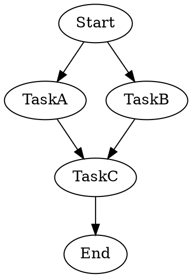
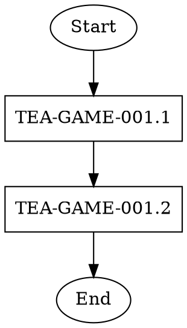
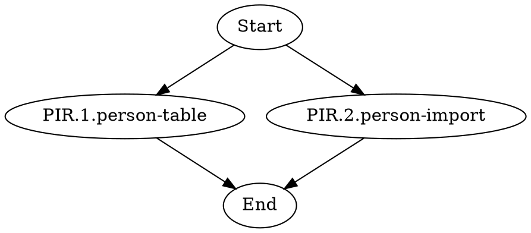
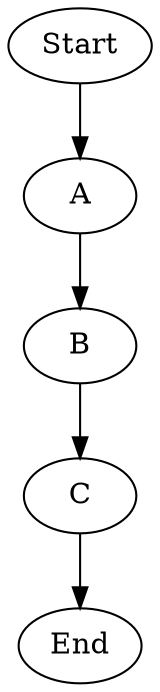
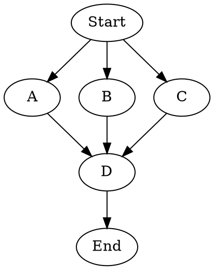
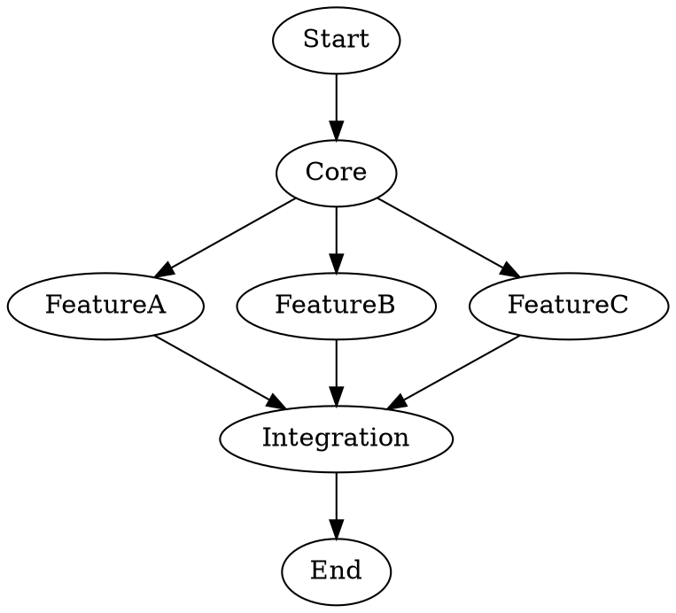
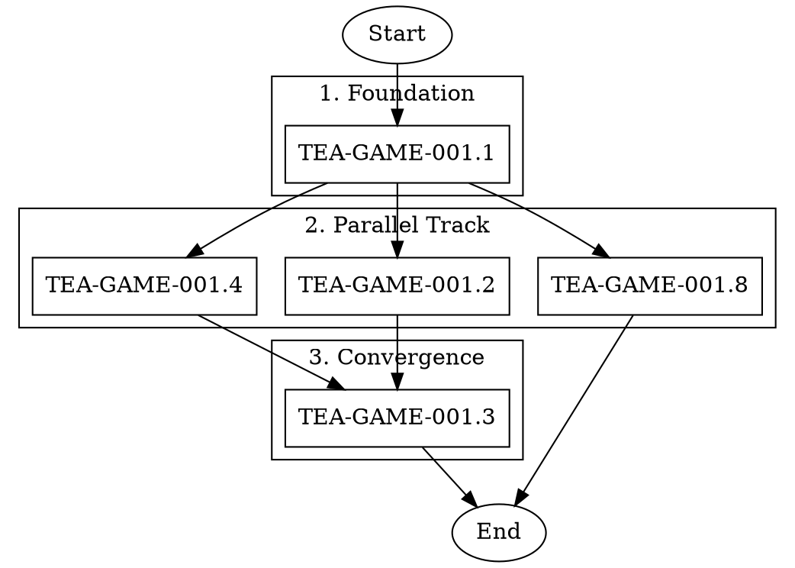

# DOT Workflow Orchestration for AI Agent Pipelines

**Fabricio Ceolin**

*Principal Engineer, The Edge Agent Project*

https://www.linkedin.com/in/fabceolin/

---

## Abstract

Orchestrating complex AI agent workflows with dependencies presents challenges in execution order, parallelization, and monitoring. This article introduces The Edge Agent's DOT (Graphviz) workflow orchestration system—a visual approach to defining and executing multi-agent pipelines. We demonstrate how dependency graphs enable intelligent parallel execution, reducing total execution time by 25-70% depending on workflow topology. The system supports both Command Mode (embedded shell commands) and Workflow Mode (template-based execution), with tmux-based monitoring for real-time visibility into parallel processes.

**Keywords:** DOT, Graphviz, Workflow Orchestration, Parallel Execution, tmux, AI Pipelines

---

## 1. Introduction

When developing complex AI-driven projects—whether implementing an epic with multiple stories, running validation across dozens of test cases, or orchestrating multi-stage data pipelines—execution order and dependency management become critical concerns.

The traditional approach is manual:

```
Human: "Run Story 1, wait, then run Story 2, wait..."
```

This is error-prone, ignores parallelization opportunities, and lacks reproducibility.

What if we could define workflows visually and execute them automatically?

```
DOT Graph: Define dependencies
TEA:       Analyze for parallel opportunities
tmux:      Execute with real-time monitoring
```

This article introduces DOT workflow orchestration in TEA, enabling:

1. **Visual workflow definition** using standard Graphviz DOT syntax
2. **Automatic dependency resolution** via topological sorting
3. **Intelligent parallelization** with configurable concurrency limits
4. **Real-time monitoring** through tmux session management

### 1.1 Why DOT?

DOT (Graphviz) provides several advantages:

| Benefit | Description |
|---------|-------------|
| **Ubiquitous** | Standard format supported by hundreds of tools |
| **Visual** | Renders to diagrams for documentation and review |
| **Declarative** | Describes "what", not "how" |
| **Version-controllable** | Plain text files work with git |

A simple DOT workflow:



This automatically parallelizes TaskA and TaskB, then runs TaskC after both complete.

## 2. Workflow Selection (Critical First Step)

Before creating a DOT file, determine which workflow to use:

### 2.1 Available Workflows

| Workflow | Purpose | When to Use |
|----------|---------|-------------|
| `bmad-story-validation.yaml` | Validate story quality (risk-profile, NFR, test-design, review) | **Before development** - ensure stories are well-written |
| `bmad-story-development.yaml` | Implement code based on story requirements (Dev → QA → SM cycle) | **During development** - implement features |

### 2.2 Decision Matrix

| User Request | Workflow |
|--------------|----------|
| "validate stories", "check stories", "review stories" | `bmad-story-validation.yaml` |
| "develop stories", "implement stories", "build features" | `bmad-story-development.yaml` |
| "run stories" (ambiguous) | Ask for clarification |
| Documentation/spec stories | Ask - may need validation or custom workflow |

**Key principle:** Never assume the workflow. Make it explicit in DOT files and execution commands.

## 3. Execution Modes

TEA supports two execution modes for DOT workflows:

### 3.1 Command Mode

Each node contains an embedded `command` attribute specifying what to execute:



**Best for:** Self-contained workflows where each node has distinct execution requirements.

### 3.2 Workflow Mode (Recommended)

Nodes represent items (stories, tasks, documents), and a single workflow is applied to each:



Execute with:

```bash
tea run --from-dot stories.dot --dot-workflow bmad-story-validation.yaml
```

The node label is passed as `{"arg": "<label>"}` to the workflow.

**Best for:** Homogeneous operations (validation, development, testing) across multiple items.

## 4. CLI Reference

```bash
tea run --from-dot workflow.dot [OPTIONS]
```

| Option | Default | Description |
|--------|---------|-------------|
| `--dot-workflow` | None | Workflow YAML to run for each node |
| `--dot-max-parallel` | 3 | Maximum parallel tmux windows |
| `--dot-session` | `tea-dot` | Tmux session name |
| `--dot-input` | None | Additional JSON input to merge |
| `--dot-exec` | `tea` | Executable for running workflows |
| `--dot-timeout` | 54000 | Command timeout in seconds (15h) |
| `--dot-dry-run` | false | Show plan without executing |

### 4.1 Examples

```bash
# Command Mode: Execute embedded commands
tea run --from-dot workflow.dot --dot-session my-workflow --dot-max-parallel 4

# Workflow Mode: Run a workflow for each node
tea run --from-dot stories.dot --dot-workflow bmad-story-validation.yaml --dot-max-parallel 3

# With additional input merged into each execution
tea run --from-dot stories.dot --dot-workflow dev.yaml --dot-input '{"mode": "sequential"}'

# Preview execution plan
tea run --from-dot workflow.dot --dot-dry-run
```

## 5. DOT File Structure

### 5.1 Required Elements

| Element | Purpose | Example |
|---------|---------|---------|
| `digraph name` | Graph container | `digraph story_workflow {}` |
| `Start` node | Entry point (ellipse) | `Start [label="Start", shape=ellipse];` |
| `End` node | Exit point (ellipse) | `End [label="End", shape=ellipse];` |
| `subgraph cluster_*` | Phase grouping | `subgraph cluster_phase1 {}` |
| Edges | Execution order | `task_a -> task_b;` |

### 5.2 Node Attributes

```dot
node_id [
    label="Display Name",        // Required: shown in output and tmux
    command="shell command"      // Required in Command Mode only
];
```

### 5.3 Escaping Rules

- Use `\"` for quotes inside command strings
- Commands are wrapped in double quotes in DOT format
- Avoid special characters in labels (see Best Practices)

## 6. Parallel Execution Patterns

### 6.1 Pattern 1: Sequential

All nodes execute one after another.



**Execution phases:** A, B, C (3 phases)

### 6.2 Pattern 2: Parallel Within Phases

Nodes without dependencies run simultaneously.



**Execution phases:**
1. Phase 1: A, B, C (parallel)
2. Phase 2: D

### 6.3 Pattern 3: Mixed Dependencies

Some nodes depend on specific predecessors.



**Execution phases:**
1. Phase 1: Core
2. Phase 2: FeatureA, FeatureB, FeatureC (parallel)
3. Phase 3: Integration

### 6.4 Efficiency Analysis

| Topology | Sequential Time | Parallel Time | Improvement |
|----------|-----------------|---------------|-------------|
| 3 independent nodes | 3x | 1x | 67% reduction |
| Diamond (1→2→1) | 4x | 3x | 25% reduction |
| Wide fan-out (1→5→1) | 7x | 3x | 57% reduction |

## 7. Verbose Mode for LLM Shell Providers

When workflows call `llm.call` with shell providers (e.g., Claude Code), output is captured but not displayed by default. Use `TEA_SHELL_VERBOSE=1` to see LLM output in real-time:

```bash
# See Claude Code output while running
TEA_SHELL_VERBOSE=1 tea run --from-dot stories.dot --dot-workflow dev.yaml

# Export for all commands in session
export TEA_SHELL_VERBOSE=1
tea run --from-dot stories.dot --dot-workflow bmad-story-validation.yaml --dot-max-parallel 3
```

This is particularly useful when:
- Debugging workflow failures
- Monitoring LLM reasoning in real-time
- Understanding why a particular node takes longer than expected

## 8. Generating DOT Files

### 8.1 Path Discovery (Critical)

Before generating a DOT file, discover actual paths using Glob tools:

```bash
# Find workflow files
glob_pattern: "**/bmad-story-development.yaml"
# Result: /home/user/project/examples/workflows/bmad-story-development.yaml

# Find story files
glob_pattern: "**/docs/stories/*.md"
# Result: /home/user/project/docs/stories/...
```

**Store discovered paths for use in all commands.**

### 8.2 Label Best Practices

Labels are used as:
- Dictionary keys in execution tracking
- tmux window names (truncated to ~30 chars)
- `state.arg` values in Workflow Mode

| DO | DON'T |
|----|-------|
| `PIR.1.person-table` | `/home/user/docs/stories/PIR.1.person-table-row-level-accept-reject.md` |
| `TEA-GAME-001.1` | `TEA-GAME-001.1-rust-game-engine-core-with-duckdb` |
| `story_1_core` | `Story 1: Core Implementation (Phase 1)` |

**Why this matters:** tmux truncates window names. Two labels starting with the same 30 characters will collide, causing execution tracking failures.

### 8.3 Complete Example



### 8.4 Output Commands

After generating a DOT file, always provide execution commands:

```bash
# Workflow Mode (recommended for story orchestration)
tea run --from-dot examples/dot/tea-game-validation.dot \
    --dot-workflow examples/workflows/bmad-story-validation.yaml \
    --dot-max-parallel 4

# With verbose LLM output
TEA_SHELL_VERBOSE=1 tea run --from-dot stories.dot \
    --dot-workflow bmad-story-validation.yaml --dot-max-parallel 3

# Monitor progress
tmux attach -t tea-dot
```

## 9. Monitoring and Debugging

### 9.1 tmux Session Management

```bash
# Attach to execution session
tmux attach -t tea-dot

# List all windows
tmux list-windows -t tea-dot

# View specific window
tmux select-window -t tea-dot:window-name
```

### 9.2 Execution Output

The orchestrator provides progress updates:

```
Graph loaded: 46 nodes in 6 phases

=== Execution Plan ===
Phase 1 (parallel): 13 nodes
Phase 2 (parallel): 11 nodes
...

>>> Phase 1/6: 13 node(s)...
  Starting: MPR.1.managing-partners
  Starting: RIR.0.referee-import
  Starting: MIR.1.matter-deduplication
  Waiting for 3 window(s)...
  ✓ Completed: RIR.0.referee-import (388.3s)
  ✓ Completed: MIR.1.matter-deduplication (433.1s)
```

### 9.3 Troubleshooting

| Issue | Cause | Solution |
|-------|-------|----------|
| `Missing command attribute` | Node lacks `command` in Command Mode | Add `command="..."` or use Workflow Mode |
| Window name collision | Labels too long/similar | Use short, unique labels (see 7.2) |
| `Circular dependency` | A → B → A | Redesign to remove cycle |
| `File not found` | Wrong path in command | Discover paths dynamically |

## 10. Integration with BMad Workflows

TEA provides pre-built BMad workflows for story development:

| Workflow | Purpose | Use Case |
|----------|---------|----------|
| `bmad-story-validation.yaml` | QA validation: risk-profile, NFR, test-design | Before development |
| `bmad-story-development.yaml` | Full cycle: Dev → QA → SM | Implementation phase |

Example with short labels and path resolution:

```bash
# The workflow resolves short labels to full story paths
tea run --from-dot stories.dot \
    --dot-workflow bmad-story-validation.yaml \
    --dot-max-parallel 3
```

The workflow's `resolve_story_path` node handles label → path conversion.

## 11. Best Practices

### 11.1 File Organization

```
project/
├── examples/
│   ├── dot/                    # DOT workflow files
│   │   ├── epic-validation.dot
│   │   └── sprint-development.dot
│   └── workflows/              # TEA workflow YAMLs
│       ├── bmad-story-validation.yaml
│       └── bmad-story-development.yaml
└── docs/
    └── stories/                # Story files
        └── *.md
```

### 11.2 Naming Conventions

| File Type | Convention | Example |
|-----------|------------|---------|
| DOT files | `<purpose>-<scope>.dot` | `tea-game-001-validation.dot` |
| Workflows | `<action>-<type>.yaml` | `bmad-story-development.yaml` |
| Sessions | lowercase, hyphenated | `tea-dot`, `epic-impl` |

### 11.3 Concurrency Guidelines

| Workflow Type | Recommended `--dot-max-parallel` | Rationale |
|---------------|----------------------------------|-----------|
| LLM-heavy (Claude Code) | 2-3 | API rate limits, context switching |
| Compute-bound | CPU cores - 1 | Avoid oversubscription |
| I/O-bound | 5-10 | Network latency dominates |

### 11.4 Timeout Planning

| Workflow Complexity | Recommended Timeout | Flag |
|--------------------|---------------------|------|
| Simple validation | 10 min | `--dot-timeout 600` |
| Story development | 1 hour | `--dot-timeout 3600` |
| Complex epic | 15 hours | `--dot-timeout 54000` (default) |

## 12. Conclusion

DOT workflow orchestration in TEA provides a powerful, visual approach to managing complex AI agent pipelines. Key benefits include:

1. **Visual clarity** - Graphviz diagrams make dependencies explicit
2. **Automatic parallelization** - Topological sort identifies parallel opportunities
3. **Flexible execution** - Command Mode or Workflow Mode for different needs
4. **Real-time monitoring** - tmux sessions provide visibility into parallel processes
5. **Reproducibility** - DOT files are version-controlled and shareable

The combination of DOT's declarative syntax with TEA's execution engine enables teams to orchestrate complex workflows—from multi-story epics to batch validation pipelines—with minimal manual intervention.

## 13. References

- [Graphviz DOT Language](https://graphviz.org/doc/info/lang.html) - Official DOT syntax reference
- [Writing TEA with TEA](./writing-tea-with-tea.md) - Meta-development methodology using DOT orchestration
- [YAML Reference](../shared/YAML_REFERENCE.md) - TEA YAML workflow syntax
- [TEA Documentation](https://fabceolin.github.io/the_edge_agent/) - Official documentation
