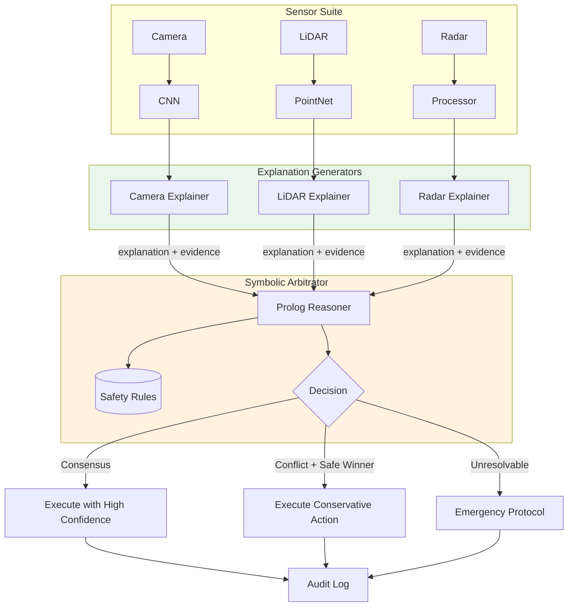
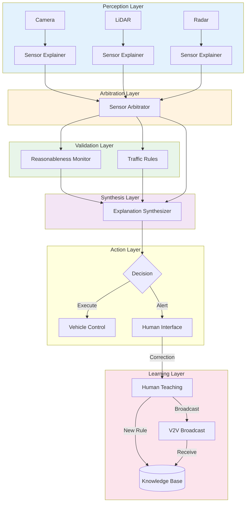

# Explanation Synthesis: The Missing Link in Autonomous Vehicle Safety

**Fabricio Ceolin**

*Independent Researcher*

fabceolin@gmail.com

---

## Abstract

Autonomous vehicles face a critical challenge: when multiple perception systems disagree—camera sees clear road, LiDAR detects obstacle, radar shows moving object—how does the vehicle decide which to trust, and how can it explain that decision to regulators, investigators, or human operators? Traditional sensor fusion operates on confidence scores, providing no insight into why one sensor's interpretation prevailed. This article introduces **Explanation Synthesis**, a neurosymbolic architecture where every subsystem produces structured justifications that are arbitrated symbolically. Using The Edge Agent (TEA) framework, we demonstrate how Prolog-based arbitration can evaluate competing explanations, produce human-readable audit trails, and enable humans to teach the system through natural language corrections. This approach completes the neurosymbolic autonomous vehicle stack: reasonableness monitors catch impossible perceptions, traffic rules encode jurisdiction-specific laws, and explanation synthesis provides the common language for debugging, redundancy verification, and human-machine collaboration.

**Keywords:** Autonomous Vehicles, Explainable AI, Sensor Fusion, Neurosymbolic AI, Safety-Critical Systems

---

## 1. Introduction

In the previous articles of this series, we explored two critical components of neurosymbolic autonomous vehicles:

1. **[Reasonableness Monitors](reasonableness-monitors.md)**: Catching physically impossible perceptions (like mistaking the moon for a traffic light)
2. **[Traffic Rules Encoding](traffic-rules-neurosymbolic.md)**: Formal codification of traffic laws that can be swapped between jurisdictions

But there's a missing piece: **What happens when these systems disagree?**

Consider this scenario:
- The **camera** sees nothing ahead
- The **LiDAR** detects an obstacle at 15 meters
- The **reasonableness monitor** says "no known object matches this signature"
- The **traffic rules** say "proceed at current speed is legal"

Which system do we trust? How do we decide? And critically — **how do we explain that decision** to regulators, investigators, or the human operator?

This article introduces **Explanation Synthesis** — a neurosymbolic approach where:
1. Every subsystem produces a **structured justification** for its output
2. A **symbolic arbitrator** evaluates the strength of competing explanations
3. The winning explanation becomes a **human-readable audit trail**
4. Humans can **teach the system** by providing corrections in natural language

This is the third pillar of Leilani Gilpin's vision for safe autonomous vehicles: **explanations as a common language for debugging, redundancy, and human-machine collaboration**.

## 2. The Problem: Multi-Sensor Disagreement

Modern autonomous vehicles use sensor fusion, but fusion algorithms typically operate on **confidence scores**, not **reasons**:

```
Traditional Fusion:
  Camera: 0.2 confidence "clear road"
  LiDAR:  0.8 confidence "obstacle"
  Radar:  0.6 confidence "moving object"

  Result: Weighted average → "probably obstacle"
```

This approach has critical flaws:

| Problem | Example | Consequence |
|---------|---------|-------------|
| **No explanation** | Why did LiDAR win? | Can't debug failures |
| **Confidence ≠ Correctness** | High confidence on wrong answer | Overrides correct low-confidence sensor |
| **No physical grounding** | Numbers without meaning | Can't verify against reality |
| **Black box fusion** | Learned weights | Can't audit decision process |

### Real-World Failure: Uber ATG Crash (2018)

The fatal Uber autonomous vehicle crash in Arizona illustrates this perfectly:

1. **LiDAR** detected the pedestrian 6 seconds before impact
2. **Perception system** classified her as "unknown object" → "vehicle" → "bicycle" (oscillating)
3. **Planner** ignored her because the classification kept changing
4. **No system explained** why the oscillation was happening or why it should trigger caution

A proper explanation synthesis system would have said:
> "Object detected at 40m with unstable classification (3 label changes in 2 seconds). Regardless of final classification, instability indicates perception uncertainty. Recommend: reduce speed and prepare for emergency stop."

## 3. The Solution: Explanation-First Architecture

Instead of fusing confidence scores, we fuse **explanations**:



### Key Insight

> Every sensor output must come with a **structured justification** that can be:
> 1. **Compared** against other justifications
> 2. **Verified** against physical constraints
> 3. **Recorded** for post-hoc analysis
> 4. **Understood** by humans

## 4. Implementation with TEA

### Agent 1: Sensor Explainer

Each sensor produces not just a detection, but an **explanation structure**:

```yaml
# examples/safety/sensor-explainer.yaml
name: sensor-explainer

state_schema:
  # Raw sensor data
  sensor_type: str            # "camera", "lidar", "radar"
  raw_detection: object       # Sensor-specific data

  # Output: Structured explanation
  explained_detection:
    type: object
    properties:
      sensor: str
      detection: object
      confidence: float
      evidence: list          # List of supporting facts
      explanation: str        # Human-readable justification
      physical_constraints: list  # Verified physical properties
      uncertainty_sources: list   # Known limitations

settings:
  prolog:
    preload: |
      % Physical constraints for validation
      valid_distance(camera, D) :- D > 0, D < 200.    % meters
      valid_distance(lidar, D) :- D > 0, D < 120.
      valid_distance(radar, D) :- D > 0, D < 250.

      % Sensor reliability by condition
      reliability(camera, clear, 0.95).
      reliability(camera, rain, 0.7).
      reliability(camera, fog, 0.4).
      reliability(camera, night, 0.6).

      reliability(lidar, clear, 0.98).
      reliability(lidar, rain, 0.85).
      reliability(lidar, fog, 0.5).
      reliability(lidar, night, 0.98).  % LiDAR unaffected by light

      reliability(radar, clear, 0.9).
      reliability(radar, rain, 0.88).
      reliability(radar, fog, 0.88).
      reliability(radar, night, 0.9).

      % Evidence strength rules
      strong_evidence(E) :-
          member(type, E, physical_measurement),
          member(verified, E, true).

      weak_evidence(E) :-
          member(type, E, inference),
          member(verified, E, false).

nodes:
  # Generate evidence list from raw detection
  - name: extract_evidence
    run: |
      sensor = state["sensor_type"]
      detection = state["raw_detection"]
      weather = state.get("weather", "clear")

      evidence = []

      if sensor == "camera":
          # Camera evidence based on visual features
          if detection.get("bbox_area", 0) > 1000:
              evidence.append({
                  "type": "physical_measurement",
                  "fact": "large_visual_signature",
                  "value": detection.get("bbox_area"),
                  "verified": True
              })
          if detection.get("confidence", 0) > 0.9:
              evidence.append({
                  "type": "statistical",
                  "fact": "high_classification_confidence",
                  "value": detection.get("confidence"),
                  "verified": False  # Statistical, not physical
              })
          # Add uncertainty for adverse conditions
          if weather in ["rain", "fog", "night"]:
              evidence.append({
                  "type": "limitation",
                  "fact": f"reduced_reliability_{weather}",
                  "value": weather,
                  "verified": True
              })

      elif sensor == "lidar":
          # LiDAR evidence based on point cloud
          points = detection.get("point_count", 0)
          if points > 100:
              evidence.append({
                  "type": "physical_measurement",
                  "fact": "substantial_point_cloud",
                  "value": points,
                  "verified": True
              })
          if detection.get("surface_normal"):
              evidence.append({
                  "type": "physical_measurement",
                  "fact": "3d_surface_detected",
                  "value": detection.get("surface_normal"),
                  "verified": True
              })

      elif sensor == "radar":
          # Radar evidence based on doppler
          if detection.get("doppler_velocity") is not None:
              evidence.append({
                  "type": "physical_measurement",
                  "fact": "velocity_measured",
                  "value": detection.get("doppler_velocity"),
                  "verified": True
              })
          if detection.get("rcs", 0) > 1.0:  # Radar cross-section
              evidence.append({
                  "type": "physical_measurement",
                  "fact": "significant_radar_return",
                  "value": detection.get("rcs"),
                  "verified": True
              })

      return {"evidence_list": evidence}

  # Validate physical constraints
  - name: validate_physics
    language: prolog
    run: |
      state(sensor_type, Sensor),
      state(raw_detection, Detection),

      % Extract distance
      (get_dict(distance, Detection, Distance) -> true ; Distance = -1),

      % Check physical validity
      (valid_distance(Sensor, Distance) ->
          DistanceValid = true
      ;
          DistanceValid = false
      ),

      % Get weather-adjusted reliability
      state(weather, Weather),
      (reliability(Sensor, Weather, Rel) -> true ; Rel = 0.5),

      % Build constraint verification
      Constraints = [
          constraint(distance_valid, DistanceValid),
          constraint(base_reliability, Rel)
      ],

      return(physical_constraints, Constraints),
      return(adjusted_reliability, Rel).

  # Generate human-readable explanation
  - name: generate_explanation
    run: |
      sensor = state["sensor_type"]
      detection = state["raw_detection"]
      evidence = state.get("evidence_list", [])
      constraints = state.get("physical_constraints", [])
      reliability = state.get("adjusted_reliability", 0.5)

      # Count strong vs weak evidence
      strong = sum(1 for e in evidence if e.get("type") == "physical_measurement")
      weak = sum(1 for e in evidence if e.get("type") != "physical_measurement")

      # Build explanation
      label = detection.get("label", "unknown")
      distance = detection.get("distance", "unknown")
      confidence = detection.get("confidence", 0)

      explanation_parts = [
          f"{sensor.upper()} detected '{label}' at {distance}m",
          f"with {confidence:.0%} confidence.",
      ]

      if strong > 0:
          explanation_parts.append(
              f"Supported by {strong} physical measurement(s)."
          )

      if weak > 0:
          explanation_parts.append(
              f"{weak} statistical inference(s) also support this."
          )

      # Note limitations
      limitations = [e for e in evidence if e.get("type") == "limitation"]
      if limitations:
          lim_facts = [e["fact"] for e in limitations]
          explanation_parts.append(
              f"Limitations: {', '.join(lim_facts)}."
          )

      explanation = " ".join(explanation_parts)

      # Build final explained detection
      explained = {
          "sensor": sensor,
          "detection": detection,
          "confidence": confidence * reliability,  # Adjusted confidence
          "evidence": evidence,
          "explanation": explanation,
          "physical_constraints": constraints,
          "uncertainty_sources": limitations,
          "evidence_strength": {
              "physical": strong,
              "statistical": weak,
              "total": strong + weak
          }
      }

      return {"explained_detection": explained}

edges:
  - from: __start__
    to: extract_evidence
  - from: extract_evidence
    to: validate_physics
  - from: validate_physics
    to: generate_explanation
  - from: generate_explanation
    to: __end__
```

### Agent 2: Sensor Arbitrator

The arbitrator compares explanations and decides which to trust:

```yaml
# examples/safety/sensor-arbitrator.yaml
name: sensor-arbitrator

state_schema:
  # Inputs: Explained detections from each sensor
  camera_explained: object
  lidar_explained: object
  radar_explained: object

  # Context
  weather: str
  driving_context: str        # "highway", "urban", "parking"

  # Output
  arbitration_result:
    type: object
    properties:
      consensus: bool
      winning_sensor: str
      final_detection: object
      reasoning_chain: list
      confidence_level: str   # "high", "medium", "low", "conflict"
      recommended_action: str

settings:
  prolog:
    preload: |
      % Sensor priority by context and weather
      % Format: sensor_priority(Sensor, Context, Weather, Priority)

      % Clear weather priorities
      sensor_priority(lidar, highway, clear, 0.95).
      sensor_priority(camera, highway, clear, 0.85).
      sensor_priority(radar, highway, clear, 0.80).

      sensor_priority(camera, urban, clear, 0.90).  % Better at signs/signals
      sensor_priority(lidar, urban, clear, 0.88).
      sensor_priority(radar, urban, clear, 0.70).

      sensor_priority(lidar, parking, clear, 0.95). % Best for close objects
      sensor_priority(camera, parking, clear, 0.85).
      sensor_priority(radar, parking, clear, 0.60).

      % Adverse weather adjustments
      sensor_priority(lidar, _, fog, 0.50).     % LiDAR degrades in fog
      sensor_priority(camera, _, fog, 0.40).    % Camera degrades more
      sensor_priority(radar, _, fog, 0.90).     % Radar unaffected

      sensor_priority(lidar, _, rain, 0.75).
      sensor_priority(camera, _, rain, 0.60).
      sensor_priority(radar, _, rain, 0.88).

      sensor_priority(lidar, _, night, 0.95).   % LiDAR unaffected by light
      sensor_priority(camera, _, night, 0.50).  % Camera needs light
      sensor_priority(radar, _, night, 0.90).

      % Default
      sensor_priority(_, _, _, 0.5).

      % Agreement rules
      sensors_agree(D1, D2) :-
          get_dict(label, D1, L1),
          get_dict(label, D2, L2),
          L1 = L2,
          get_dict(distance, D1, Dist1),
          get_dict(distance, D2, Dist2),
          abs(Dist1 - Dist2) < 5.  % Within 5 meters

      % Physical evidence strength
      evidence_strength(Explained, Strength) :-
          get_dict(evidence_strength, Explained, ES),
          get_dict(physical, ES, Physical),
          get_dict(total, ES, Total),
          (Total > 0 -> Strength is Physical / Total ; Strength = 0).

      % Safety-first rule: if any sensor detects obstacle, trust it
      safety_override(Detection) :-
          get_dict(label, Detection, Label),
          member(Label, [pedestrian, cyclist, vehicle, obstacle, unknown_moving]),
          get_dict(distance, Detection, D),
          D < 30.  % Close obstacle = always trust

nodes:
  # Check for consensus among sensors
  - name: check_consensus
    language: prolog
    run: |
      state(camera_explained, CamExp),
      state(lidar_explained, LidExp),
      state(radar_explained, RadExp),

      get_dict(detection, CamExp, CamDet),
      get_dict(detection, LidExp, LidDet),
      get_dict(detection, RadExp, RadDet),

      % Check pairwise agreement
      (sensors_agree(CamDet, LidDet) -> CamLid = true ; CamLid = false),
      (sensors_agree(LidDet, RadDet) -> LidRad = true ; LidRad = false),
      (sensors_agree(CamDet, RadDet) -> CamRad = true ; CamRad = false),

      % Full consensus = all three agree
      (CamLid = true, LidRad = true ->
          Consensus = full
      ; (CamLid = true ; LidRad = true ; CamRad = true) ->
          Consensus = partial
      ;
          Consensus = none
      ),

      return(consensus_level, Consensus),
      return(agreements, [cam_lid-CamLid, lid_rad-LidRad, cam_rad-CamRad]).

  # Evaluate explanation strength for each sensor
  - name: evaluate_explanations
    language: prolog
    run: |
      state(camera_explained, CamExp),
      state(lidar_explained, LidExp),
      state(radar_explained, RadExp),
      state(weather, Weather),
      state(driving_context, Context),

      % Get context-adjusted priorities
      sensor_priority(camera, Context, Weather, CamPriority),
      sensor_priority(lidar, Context, Weather, LidPriority),
      sensor_priority(radar, Context, Weather, RadPriority),

      % Get evidence strength
      evidence_strength(CamExp, CamEvidence),
      evidence_strength(LidExp, LidEvidence),
      evidence_strength(RadExp, RadEvidence),

      % Get adjusted confidence from each sensor
      get_dict(confidence, CamExp, CamConf),
      get_dict(confidence, LidExp, LidConf),
      get_dict(confidence, RadExp, RadConf),

      % Calculate combined scores
      CamScore is CamPriority * CamEvidence * CamConf,
      LidScore is LidPriority * LidEvidence * LidConf,
      RadScore is RadPriority * RadEvidence * RadConf,

      % Find winner
      max_list([CamScore, LidScore, RadScore], MaxScore),
      (MaxScore = CamScore -> Winner = camera
      ; MaxScore = LidScore -> Winner = lidar
      ; Winner = radar),

      return(scores, [camera-CamScore, lidar-LidScore, radar-RadScore]),
      return(preliminary_winner, Winner),
      return(max_score, MaxScore).

  # Apply safety overrides
  - name: safety_check
    language: prolog
    run: |
      state(camera_explained, CamExp),
      state(lidar_explained, LidExp),
      state(radar_explained, RadExp),
      state(preliminary_winner, PrelimWinner),

      get_dict(detection, CamExp, CamDet),
      get_dict(detection, LidExp, LidDet),
      get_dict(detection, RadExp, RadDet),

      % Check for safety overrides
      (safety_override(LidDet) ->
          (SafetyOverride = true, OverrideSensor = lidar, OverrideReason = "LiDAR detected close obstacle - safety override")
      ; safety_override(RadDet) ->
          (SafetyOverride = true, OverrideSensor = radar, OverrideReason = "Radar detected close moving object - safety override")
      ; safety_override(CamDet) ->
          (SafetyOverride = true, OverrideSensor = camera, OverrideReason = "Camera detected close obstacle - safety override")
      ;
          (SafetyOverride = false, OverrideSensor = PrelimWinner, OverrideReason = "No safety override needed")
      ),

      return(safety_override, SafetyOverride),
      return(final_winner, OverrideSensor),
      return(override_reason, OverrideReason).

  # Build reasoning chain and final output
  - name: build_result
    run: |
      consensus = state.get("consensus_level", "none")
      agreements = state.get("agreements", [])
      scores = state.get("scores", [])
      winner = state.get("final_winner", "unknown")
      safety_override = state.get("safety_override", False)
      override_reason = state.get("override_reason", "")
      max_score = state.get("max_score", 0)

      # Get winning sensor's explained detection
      winner_key = f"{winner}_explained"
      winner_explained = state.get(winner_key, {})
      final_detection = winner_explained.get("detection", {})

      # Build reasoning chain
      reasoning_chain = []

      # Step 1: Consensus analysis
      reasoning_chain.append({
          "step": 1,
          "action": "consensus_check",
          "result": consensus,
          "details": f"Sensor agreement level: {consensus}"
      })

      # Step 2: Score comparison
      score_details = ", ".join([f"{s[0]}={s[1]:.3f}" for s in scores])
      reasoning_chain.append({
          "step": 2,
          "action": "score_evaluation",
          "result": f"winner={winner}",
          "details": f"Scores: {score_details}"
      })

      # Step 3: Safety override
      reasoning_chain.append({
          "step": 3,
          "action": "safety_check",
          "result": "override" if safety_override else "no_override",
          "details": override_reason
      })

      # Step 4: Final decision
      reasoning_chain.append({
          "step": 4,
          "action": "final_decision",
          "result": winner,
          "details": winner_explained.get("explanation", "No explanation available")
      })

      # Determine confidence level
      if consensus == "full" and max_score > 0.7:
          confidence_level = "high"
          recommended_action = "proceed_normal"
      elif consensus == "partial" and max_score > 0.5:
          confidence_level = "medium"
          recommended_action = "proceed_cautious"
      elif safety_override:
          confidence_level = "safety_critical"
          recommended_action = "emergency_response"
      else:
          confidence_level = "low"
          recommended_action = "slow_and_verify"

      result = {
          "consensus": consensus == "full",
          "winning_sensor": winner,
          "final_detection": final_detection,
          "reasoning_chain": reasoning_chain,
          "confidence_level": confidence_level,
          "recommended_action": recommended_action
      }

      return {"arbitration_result": result}

edges:
  - from: __start__
    to: check_consensus
  - from: check_consensus
    to: evaluate_explanations
  - from: evaluate_explanations
    to: safety_check
  - from: safety_check
    to: build_result
  - from: build_result
    to: __end__
```

### Agent 3: Explanation Synthesizer

This agent combines reasonableness monitoring, traffic rules, and sensor arbitration into a unified explanation:

```yaml
# examples/safety/explanation-synthesizer.yaml
name: explanation-synthesizer

state_schema:
  # Inputs from other agents
  arbitration_result: object      # From sensor-arbitrator
  reasonableness_check: object    # From reasonableness-monitor
  traffic_rule_check: object      # From traffic-rules validator

  # Context
  timestamp: str
  vehicle_id: str
  location: object

  # Output
  synthesized_explanation:
    type: object
    properties:
      decision: str
      confidence: str
      primary_justification: str
      supporting_evidence: list
      dissenting_opinions: list
      audit_record: object

settings:
  prolog:
    preload: |
      % Decision priority rules
      % Safety concerns override legal concerns override efficiency

      priority(safety_critical, 1).
      priority(legal_violation, 2).
      priority(reasonableness_concern, 3).
      priority(normal_operation, 4).

      % Conflict resolution
      resolve_conflict(safety_critical, _, safety_critical).
      resolve_conflict(_, safety_critical, safety_critical).
      resolve_conflict(legal_violation, reasonableness_concern, legal_violation).
      resolve_conflict(reasonableness_concern, legal_violation, legal_violation).
      resolve_conflict(X, X, X).
      resolve_conflict(X, normal_operation, X).
      resolve_conflict(normal_operation, X, X).

nodes:
  # Analyze inputs from all subsystems
  - name: analyze_inputs
    run: |
      arb = state.get("arbitration_result", {})
      reason = state.get("reasonableness_check", {})
      traffic = state.get("traffic_rule_check", {})

      # Extract key signals
      analysis = {
          "arbitration": {
              "confidence": arb.get("confidence_level", "unknown"),
              "action": arb.get("recommended_action", "unknown"),
              "sensor": arb.get("winning_sensor", "unknown"),
              "detection": arb.get("final_detection", {})
          },
          "reasonableness": {
              "is_reasonable": reason.get("is_reasonable", True),
              "explanation": reason.get("explanation", ""),
              "action": reason.get("action", "PROCEED")
          },
          "traffic": {
              "is_legal": traffic.get("is_legal", True),
              "violation": traffic.get("violation", "none"),
              "recommendation": traffic.get("recommendation", "")
          }
      }

      # Identify conflicts
      conflicts = []

      # Conflict: Sensors say go, reasonableness says stop
      if (arb.get("recommended_action") == "proceed_normal" and
          not reason.get("is_reasonable", True)):
          conflicts.append({
              "type": "sensor_vs_reasonableness",
              "description": "Sensor fusion recommends proceed, but detection failed reasonableness check",
              "resolution": "Trust reasonableness monitor (common sense override)"
          })

      # Conflict: All clear, but traffic rules say stop
      if (arb.get("recommended_action") in ["proceed_normal", "proceed_cautious"] and
          not traffic.get("is_legal", True)):
          conflicts.append({
              "type": "perception_vs_rules",
              "description": f"Perception indicates clear path, but action violates: {traffic.get('violation')}",
              "resolution": "Traffic rules take precedence"
          })

      return {
          "input_analysis": analysis,
          "detected_conflicts": conflicts
      }

  # Resolve conflicts using Prolog
  - name: resolve_conflicts
    language: prolog
    run: |
      state(input_analysis, Analysis),
      state(detected_conflicts, Conflicts),

      % Determine category for each subsystem
      get_dict(arbitration, Analysis, Arb),
      get_dict(action, Arb, ArbAction),
      (ArbAction = emergency_response -> ArbCategory = safety_critical
      ; ArbAction = slow_and_verify -> ArbCategory = reasonableness_concern
      ; ArbCategory = normal_operation),

      get_dict(reasonableness, Analysis, Reason),
      get_dict(is_reasonable, Reason, IsReasonable),
      (IsReasonable = false -> ReasonCategory = reasonableness_concern
      ; ReasonCategory = normal_operation),

      get_dict(traffic, Analysis, Traffic),
      get_dict(is_legal, Traffic, IsLegal),
      (IsLegal = false -> TrafficCategory = legal_violation
      ; TrafficCategory = normal_operation),

      % Resolve three-way
      resolve_conflict(ArbCategory, ReasonCategory, Temp),
      resolve_conflict(Temp, TrafficCategory, FinalCategory),

      % Determine final decision based on category
      (FinalCategory = safety_critical ->
          Decision = "EMERGENCY_STOP"
      ; FinalCategory = legal_violation ->
          Decision = "STOP_LEGAL_REQUIREMENT"
      ; FinalCategory = reasonableness_concern ->
          Decision = "CAUTION_VERIFY"
      ;
          Decision = "PROCEED"
      ),

      return(decision_category, FinalCategory),
      return(final_decision, Decision).

  # Generate human-readable synthesis
  - name: synthesize_explanation
    uses: llm.call
    with:
      provider: "ollama"
      model: "llama3.2:3b"
      messages:
        - role: system
          content: |
            You are an autonomous vehicle decision explainer. Generate clear,
            concise explanations for driving decisions. Use simple language
            that regulators and investigators can understand.

            Structure your response as:
            1. DECISION: [action]
            2. PRIMARY REASON: [one sentence]
            3. SUPPORTING FACTORS: [bullet list]
            4. CONFIDENCE: [high/medium/low]
        - role: user
          content: |
            Sensor Arbitration:
            - Winning sensor: {{ state.input_analysis.arbitration.sensor }}
            - Detection: {{ state.input_analysis.arbitration.detection | tojson }}
            - Confidence: {{ state.input_analysis.arbitration.confidence }}

            Reasonableness Check:
            - Reasonable: {{ state.input_analysis.reasonableness.is_reasonable }}
            - Explanation: {{ state.input_analysis.reasonableness.explanation }}

            Traffic Rules:
            - Legal: {{ state.input_analysis.traffic.is_legal }}
            - Violation: {{ state.input_analysis.traffic.violation }}

            Conflicts Detected: {{ state.detected_conflicts | tojson }}

            Final Decision: {{ state.final_decision }}

            Generate the explanation.
    output: llm_explanation

  # Build final structured output
  - name: build_output
    run: |
      from datetime import datetime

      arb = state.get("arbitration_result", {})
      reason = state.get("reasonableness_check", {})
      traffic = state.get("traffic_rule_check", {})
      analysis = state.get("input_analysis", {})
      conflicts = state.get("detected_conflicts", [])
      decision = state.get("final_decision", "UNKNOWN")
      category = state.get("decision_category", "unknown")
      llm_response = state.get("llm_explanation", {})

      # Build audit record
      audit_record = {
          "timestamp": state.get("timestamp", datetime.utcnow().isoformat()),
          "vehicle_id": state.get("vehicle_id", "unknown"),
          "location": state.get("location", {}),
          "decision": decision,
          "decision_category": category,
          "inputs": {
              "arbitration": arb,
              "reasonableness": reason,
              "traffic": traffic
          },
          "conflicts": conflicts,
          "reasoning_chains": arb.get("reasoning_chain", [])
      }

      # Build dissenting opinions (subsystems that disagreed with final decision)
      dissenting = []
      if decision in ["EMERGENCY_STOP", "STOP_LEGAL_REQUIREMENT", "CAUTION_VERIFY"]:
          if arb.get("recommended_action") == "proceed_normal":
              dissenting.append({
                  "source": "sensor_arbitration",
                  "opinion": "Sensors indicated clear path",
                  "overridden_by": category
              })
      if decision == "PROCEED":
          if not reason.get("is_reasonable", True):
              dissenting.append({
                  "source": "reasonableness_monitor",
                  "opinion": reason.get("explanation", ""),
                  "overridden_by": "consensus_override"
              })

      # Build supporting evidence
      supporting = []
      if decision != "PROCEED":
          if not traffic.get("is_legal", True):
              supporting.append({
                  "source": "traffic_rules",
                  "evidence": f"Violation: {traffic.get('violation')}"
              })
          if not reason.get("is_reasonable", True):
              supporting.append({
                  "source": "reasonableness_monitor",
                  "evidence": reason.get("explanation", "")
              })
          if arb.get("confidence_level") == "safety_critical":
              supporting.append({
                  "source": "sensor_arbitration",
                  "evidence": f"Safety-critical detection by {arb.get('winning_sensor')}"
              })

      # Confidence mapping
      confidence_map = {
          "safety_critical": "high",      # We're very sure we need to stop
          "legal_violation": "high",       # Rules are clear
          "reasonableness_concern": "medium",
          "normal_operation": "high" if arb.get("confidence_level") == "high" else "medium"
      }

      synthesized = {
          "decision": decision,
          "confidence": confidence_map.get(category, "low"),
          "primary_justification": llm_response.get("content", f"Decision based on {category}"),
          "supporting_evidence": supporting,
          "dissenting_opinions": dissenting,
          "audit_record": audit_record
      }

      return {"synthesized_explanation": synthesized}

edges:
  - from: __start__
    to: analyze_inputs
  - from: analyze_inputs
    to: resolve_conflicts
  - from: resolve_conflicts
    to: synthesize_explanation
  - from: synthesize_explanation
    to: build_output
  - from: build_output
    to: __end__
```

### Agent 4: Human Teaching Interface

This agent allows humans to correct decisions and teach the system new rules:

```yaml
# examples/safety/human-teaching.yaml
name: human-teaching-interface

state_schema:
  # The decision that was made
  original_decision: object       # Full synthesized explanation

  # Human feedback
  human_correction: str           # Natural language correction
  correction_type: str            # "wrong_detection", "wrong_rule", "new_situation"

  # Output
  extracted_rule: str             # New Prolog rule
  updated_knowledge: object       # What was learned
  confirmation_needed: bool

settings:
  prolog:
    preload: |
      % Template rules for common corrections

      % Object misclassification template
      rule_template(misclassification,
        "correct_classification(WrongLabel, Context, CorrectLabel) :- detected_as(WrongLabel), context(Context).").

      % Missing rule template
      rule_template(missing_rule,
        "must_stop :- CONDITION.").

      % Exception template
      rule_template(exception,
        "exception(RuleName) :- CONDITION.").

nodes:
  # Analyze the human's correction
  - name: analyze_correction
    uses: llm.call
    with:
      provider: "ollama"
      model: "llama3.2:3b"
      messages:
        - role: system
          content: |
            You are a traffic rule extraction system. Analyze the human's
            correction and extract structured information.

            Output JSON with:
            {
              "correction_type": "misclassification|missing_rule|exception|context_error",
              "original_problem": "what the system did wrong",
              "correct_behavior": "what should have happened",
              "key_entities": ["list", "of", "relevant", "objects"],
              "conditions": ["list", "of", "conditions", "for", "rule"],
              "suggested_rule_name": "snake_case_name"
            }
        - role: user
          content: |
            Original Decision:
            {{ state.original_decision | tojson }}

            Human Correction:
            "{{ state.human_correction }}"

            Extract the structured correction information.
    output: correction_analysis

  # Generate Prolog rule from analysis
  - name: generate_rule
    uses: llm.call
    with:
      provider: "ollama"
      model: "llama3.2:3b"
      messages:
        - role: system
          content: |
            You are a Prolog rule generator for autonomous vehicles.
            Generate a valid Prolog rule based on the correction analysis.

            Available predicates:
            - detected(Object, Distance) - object detected at distance
            - speed(Current) - current speed in km/h
            - zone(Type) - current zone type
            - weather(Condition) - weather condition
            - signal(Color) - traffic signal state
            - time_of_day(Period) - morning/afternoon/evening/night
            - context(Situation) - driving context

            Output ONLY the Prolog rule, no explanation.
            Format: rule_name(Args) :- condition1, condition2.
        - role: user
          content: |
            Correction Analysis:
            {{ state.correction_analysis.content }}

            Generate the Prolog rule.
    output: generated_rule

  # Validate the generated rule
  - name: validate_rule
    language: prolog
    run: |
      state(generated_rule, RuleResponse),

      % Extract rule text from LLM response
      get_dict(content, RuleResponse, RuleText),

      % Try to parse the rule
      (catch(
          (atom_string(RuleAtom, RuleText),
           term_to_atom(Rule, RuleAtom)),
          _Error,
          fail
      ) ->
          (Valid = true, ParsedRule = Rule)
      ;
          (Valid = false, ParsedRule = null)
      ),

      return(rule_valid, Valid),
      return(parsed_rule, ParsedRule).

  # Build confirmation request
  - name: build_confirmation
    run: |
      correction_analysis = state.get("correction_analysis", {}).get("content", "{}")
      generated_rule = state.get("generated_rule", {}).get("content", "")
      rule_valid = state.get("rule_valid", False)

      import json
      try:
          analysis = json.loads(correction_analysis)
      except:
          analysis = {"correction_type": "unknown"}

      if rule_valid:
          confirmation_message = f"""
          I understood your correction:

          Problem: {analysis.get('original_problem', 'Unknown')}
          Correct behavior: {analysis.get('correct_behavior', 'Unknown')}

          I've generated this rule:
          ```prolog
          {generated_rule}
          ```

          Should I add this rule to the knowledge base?
          """
          confirmation_needed = True
      else:
          confirmation_message = f"""
          I understood your correction but couldn't generate a valid rule.

          Problem: {analysis.get('original_problem', 'Unknown')}
          Correct behavior: {analysis.get('correct_behavior', 'Unknown')}

          Please rephrase or provide more details.
          """
          confirmation_needed = False

      updated_knowledge = {
          "type": analysis.get("correction_type", "unknown"),
          "rule_name": analysis.get("suggested_rule_name", "unnamed_rule"),
          "conditions": analysis.get("conditions", []),
          "rule_text": generated_rule if rule_valid else None,
          "status": "pending_confirmation" if confirmation_needed else "failed_generation"
      }

      return {
          "extracted_rule": generated_rule if rule_valid else "",
          "updated_knowledge": updated_knowledge,
          "confirmation_needed": confirmation_needed,
          "confirmation_message": confirmation_message
      }

edges:
  - from: __start__
    to: analyze_correction
  - from: analyze_correction
    to: generate_rule
  - from: generate_rule
    to: validate_rule
  - from: validate_rule
    to: build_confirmation
  - from: build_confirmation
    to: __end__
```

### Agent 5: V2V Rule Broadcast

Vehicles can share learned rules with nearby vehicles:

```yaml
# examples/safety/v2v-broadcast.yaml
name: v2v-rule-broadcast

state_schema:
  # Event that triggered the broadcast
  trigger_event: object

  # Location and context
  vehicle_id: str
  location: object              # {lat, lon, heading}
  timestamp: str

  # The rule to broadcast
  learned_rule: str             # Prolog rule
  rule_metadata: object

  # Output
  broadcast_message: object
  geofence: object

settings:
  prolog:
    preload: |
      % Rule categories and their broadcast radii
      broadcast_radius(safety_hazard, 2000).     % 2km for safety issues
      broadcast_radius(traffic_condition, 1000). % 1km for traffic
      broadcast_radius(road_condition, 500).     % 500m for road issues
      broadcast_radius(temporary_rule, 300).     % 300m for temp rules

      % TTL based on category
      rule_ttl(safety_hazard, 3600).      % 1 hour
      rule_ttl(traffic_condition, 1800).  % 30 minutes
      rule_ttl(road_condition, 7200).     % 2 hours
      rule_ttl(temporary_rule, 900).      % 15 minutes

      % Priority for rule conflicts
      rule_priority(safety_hazard, 1).
      rule_priority(traffic_condition, 2).
      rule_priority(road_condition, 3).
      rule_priority(temporary_rule, 4).

nodes:
  # Classify the rule for broadcast parameters
  - name: classify_rule
    language: prolog
    run: |
      state(trigger_event, Event),
      state(rule_metadata, Metadata),

      % Determine category from event type
      get_dict(type, Event, EventType),
      (EventType = obstacle_detected -> Category = safety_hazard
      ; EventType = traffic_jam -> Category = traffic_condition
      ; EventType = road_damage -> Category = road_condition
      ; EventType = construction_zone -> Category = temporary_rule
      ; EventType = weather_hazard -> Category = safety_hazard
      ; Category = temporary_rule),

      % Get broadcast parameters
      broadcast_radius(Category, Radius),
      rule_ttl(Category, TTL),
      rule_priority(Category, Priority),

      return(category, Category),
      return(radius_meters, Radius),
      return(ttl_seconds, TTL),
      return(priority, Priority).

  # Build geofence from current location
  - name: build_geofence
    run: |
      import math

      location = state.get("location", {})
      lat = location.get("lat", 0)
      lon = location.get("lon", 0)
      heading = location.get("heading", 0)
      radius = state.get("radius_meters", 500)

      # Simple circular geofence
      # For production, use proper geodesic calculations
      # 1 degree latitude ≈ 111km
      lat_delta = radius / 111000
      # 1 degree longitude varies by latitude
      lon_delta = radius / (111000 * math.cos(math.radians(lat)))

      geofence = {
          "type": "circle",
          "center": {"lat": lat, "lon": lon},
          "radius_meters": radius,
          "bounding_box": {
              "north": lat + lat_delta,
              "south": lat - lat_delta,
              "east": lon + lon_delta,
              "west": lon - lon_delta
          },
          # Directional bias: extend more in direction of travel
          "heading": heading,
          "forward_extension": radius * 1.5
      }

      return {"geofence": geofence}

  # Build the broadcast message
  - name: build_message
    run: |
      from datetime import datetime, timedelta

      vehicle_id = state.get("vehicle_id", "unknown")
      timestamp = state.get("timestamp", datetime.utcnow().isoformat())
      location = state.get("location", {})
      learned_rule = state.get("learned_rule", "")
      metadata = state.get("rule_metadata", {})
      category = state.get("category", "temporary_rule")
      ttl = state.get("ttl_seconds", 900)
      priority = state.get("priority", 4)
      geofence = state.get("geofence", {})
      trigger = state.get("trigger_event", {})

      # Calculate expiration
      try:
          ts = datetime.fromisoformat(timestamp.replace('Z', '+00:00'))
      except:
          ts = datetime.utcnow()
      expires = (ts + timedelta(seconds=ttl)).isoformat()

      # Build V2V message following a standard format
      broadcast_message = {
          "protocol": "V2V-RULE-SHARE-1.0",
          "message_id": f"{vehicle_id}-{timestamp}",
          "sender": {
              "vehicle_id": vehicle_id,
              "location": location,
              "timestamp": timestamp
          },
          "rule": {
              "category": category,
              "priority": priority,
              "prolog_code": learned_rule,
              "human_description": metadata.get("description", ""),
              "trigger_event": trigger
          },
          "validity": {
              "geofence": geofence,
              "expires": expires,
              "ttl_seconds": ttl
          },
          "verification": {
              "source_confidence": metadata.get("confidence", 0.8),
              "human_verified": metadata.get("human_verified", False),
              "corroborating_vehicles": []
          }
      }

      return {"broadcast_message": broadcast_message}

  # Simulate broadcast (in real system, this would use DSRC/C-V2X)
  - name: simulate_broadcast
    run: |
      message = state.get("broadcast_message", {})
      geofence = state.get("geofence", {})

      # In a real system, this would:
      # 1. Encode message for DSRC (Dedicated Short Range Communication)
      # 2. Or use C-V2X (Cellular Vehicle-to-Everything)
      # 3. Sign with vehicle's certificate
      # 4. Broadcast on appropriate channel

      # For demo, we just log the broadcast
      broadcast_log = {
          "status": "broadcast_simulated",
          "message_id": message.get("message_id"),
          "category": message.get("rule", {}).get("category"),
          "geofence_radius": geofence.get("radius_meters"),
          "ttl": message.get("validity", {}).get("ttl_seconds"),
          "rule_preview": message.get("rule", {}).get("prolog_code", "")[:100] + "..."
      }

      return {"broadcast_log": broadcast_log}

edges:
  - from: __start__
    to: classify_rule
  - from: classify_rule
    to: build_geofence
  - from: build_geofence
    to: build_message
  - from: build_message
    to: simulate_broadcast
  - from: simulate_broadcast
    to: __end__
```

## 5. Running the Examples

### Example 1: Sensor Disagreement Resolution

```bash
# Camera sees nothing, LiDAR detects obstacle
./tea run examples/safety/sensor-arbitrator.yaml --input '{
  "camera_explained": {
    "sensor": "camera",
    "detection": {"label": "clear", "distance": null, "confidence": 0.85},
    "confidence": 0.68,
    "evidence": [
      {"type": "statistical", "fact": "high_classification_confidence", "verified": false}
    ],
    "explanation": "Camera sees clear road ahead with 85% confidence.",
    "evidence_strength": {"physical": 0, "statistical": 1, "total": 1}
  },
  "lidar_explained": {
    "sensor": "lidar",
    "detection": {"label": "obstacle", "distance": 25, "confidence": 0.92},
    "confidence": 0.90,
    "evidence": [
      {"type": "physical_measurement", "fact": "substantial_point_cloud", "value": 450, "verified": true},
      {"type": "physical_measurement", "fact": "3d_surface_detected", "verified": true}
    ],
    "explanation": "LiDAR detected obstacle at 25m with 450 points. 3D surface confirmed.",
    "evidence_strength": {"physical": 2, "statistical": 0, "total": 2}
  },
  "radar_explained": {
    "sensor": "radar",
    "detection": {"label": "stationary_object", "distance": 24, "confidence": 0.78},
    "confidence": 0.70,
    "evidence": [
      {"type": "physical_measurement", "fact": "significant_radar_return", "value": 2.1, "verified": true}
    ],
    "explanation": "Radar detected stationary object at 24m with RCS 2.1.",
    "evidence_strength": {"physical": 1, "statistical": 0, "total": 1}
  },
  "weather": "clear",
  "driving_context": "highway"
}'
```

**Expected Result:**
```json
{
  "arbitration_result": {
    "consensus": false,
    "winning_sensor": "lidar",
    "final_detection": {"label": "obstacle", "distance": 25},
    "reasoning_chain": [
      {"step": 1, "action": "consensus_check", "result": "partial"},
      {"step": 2, "action": "score_evaluation", "result": "winner=lidar"},
      {"step": 3, "action": "safety_check", "result": "override",
       "details": "LiDAR detected close obstacle - safety override"},
      {"step": 4, "action": "final_decision", "result": "lidar"}
    ],
    "confidence_level": "safety_critical",
    "recommended_action": "emergency_response"
  }
}
```

### Example 2: Full Explanation Synthesis

```bash
./tea run examples/safety/explanation-synthesizer.yaml --input '{
  "arbitration_result": {
    "consensus": false,
    "winning_sensor": "lidar",
    "final_detection": {"label": "pedestrian", "distance": 15},
    "reasoning_chain": [
      {"step": 1, "action": "consensus_check", "result": "none"},
      {"step": 4, "action": "final_decision", "result": "lidar"}
    ],
    "confidence_level": "safety_critical",
    "recommended_action": "emergency_response"
  },
  "reasonableness_check": {
    "is_reasonable": true,
    "explanation": "Detection consistent with pedestrian physical properties",
    "action": "CAUTION"
  },
  "traffic_rule_check": {
    "is_legal": true,
    "violation": "none",
    "recommendation": "Pedestrian has right of way"
  },
  "timestamp": "2024-12-20T14:30:00Z",
  "vehicle_id": "AV-001",
  "location": {"lat": -23.5505, "lon": -46.6333}
}'
```

### Example 3: Human Teaching

```bash
./tea run examples/safety/human-teaching.yaml --input '{
  "original_decision": {
    "decision": "PROCEED",
    "confidence": "high",
    "primary_justification": "Road clear, no obstacles detected"
  },
  "human_correction": "You should have stopped! In Brazil, when there is a funeral procession passing, all vehicles must stop out of respect, even if they have right of way.",
  "correction_type": "missing_rule"
}'
```

**Expected Output:**
```
I understood your correction:

Problem: System proceeded when a funeral procession was passing
Correct behavior: Stop for funeral processions out of respect

I've generated this rule:
```prolog
must_stop :- detected(funeral_procession, _), zone(urban).
cultural_rule(brazil, funeral_respect).
```

Should I add this rule to the knowledge base?
```

### Example 4: V2V Rule Broadcast

```bash
./tea run examples/safety/v2v-broadcast.yaml --input '{
  "trigger_event": {
    "type": "road_damage",
    "description": "Large pothole detected",
    "severity": "high"
  },
  "vehicle_id": "AV-042",
  "location": {"lat": -23.5610, "lon": -46.6558, "heading": 45},
  "timestamp": "2024-12-20T15:45:00Z",
  "learned_rule": "caution_zone(pothole) :- location_within(lat(-23.5610), lon(-46.6558), radius(50)), speed_limit_override(30).",
  "rule_metadata": {
    "description": "Reduce speed to 30 km/h due to large pothole",
    "confidence": 0.95,
    "human_verified": false
  }
}'
```

**Expected Output:**
```json
{
  "broadcast_message": {
    "protocol": "V2V-RULE-SHARE-1.0",
    "message_id": "AV-042-2024-12-20T15:45:00Z",
    "rule": {
      "category": "road_condition",
      "priority": 3,
      "prolog_code": "caution_zone(pothole) :- location_within(...)"
    },
    "validity": {
      "geofence": {"radius_meters": 500},
      "ttl_seconds": 7200
    }
  }
}
```

## 6. Architecture Integration

Here's how all the agents work together:



## 7. The Complete Pipeline

```yaml
# examples/safety/full-pipeline.yaml
name: av-safety-pipeline

state_schema:
  # Raw sensor inputs
  camera_raw: object
  lidar_raw: object
  radar_raw: object

  # Context
  weather: str
  location: object
  current_zone: str
  jurisdiction: str

  # Intermediate results
  camera_explained: object
  lidar_explained: object
  radar_explained: object
  arbitration_result: object
  reasonableness_check: object
  traffic_rule_check: object

  # Final output
  synthesized_explanation: object
  vehicle_command: object

nodes:
  # Run sensor explainers in parallel
  - name: explain_camera
    uses: agent.call
    with:
      agent: "examples/safety/sensor-explainer.yaml"
      input:
        sensor_type: "camera"
        raw_detection: "{{ state.camera_raw }}"
        weather: "{{ state.weather }}"
    output: camera_explained

  - name: explain_lidar
    uses: agent.call
    with:
      agent: "examples/safety/sensor-explainer.yaml"
      input:
        sensor_type: "lidar"
        raw_detection: "{{ state.lidar_raw }}"
        weather: "{{ state.weather }}"
    output: lidar_explained

  - name: explain_radar
    uses: agent.call
    with:
      agent: "examples/safety/sensor-explainer.yaml"
      input:
        sensor_type: "radar"
        raw_detection: "{{ state.radar_raw }}"
        weather: "{{ state.weather }}"
    output: radar_explained

  # Arbitrate between sensors
  - name: arbitrate
    uses: agent.call
    with:
      agent: "examples/safety/sensor-arbitrator.yaml"
      input:
        camera_explained: "{{ state.camera_explained }}"
        lidar_explained: "{{ state.lidar_explained }}"
        radar_explained: "{{ state.radar_explained }}"
        weather: "{{ state.weather }}"
        driving_context: "{{ state.current_zone }}"
    output: arbitration_result

  # Run validation checks in parallel
  - name: check_reasonableness
    uses: agent.call
    with:
      agent: "examples/safety/reasonableness-monitor.yaml"
      input:
        detection: "{{ state.arbitration_result.final_detection }}"
        current_zone: "{{ state.current_zone }}"
    output: reasonableness_check

  - name: check_traffic_rules
    uses: agent.call
    with:
      agent: "examples/traffic-rules/validate-maneuver.yaml"
      input:
        detected_objects: ["{{ state.arbitration_result.final_detection }}"]
        jurisdiction: "{{ state.jurisdiction }}"
    output: traffic_rule_check

  # Synthesize final explanation
  - name: synthesize
    uses: agent.call
    with:
      agent: "examples/safety/explanation-synthesizer.yaml"
      input:
        arbitration_result: "{{ state.arbitration_result }}"
        reasonableness_check: "{{ state.reasonableness_check }}"
        traffic_rule_check: "{{ state.traffic_rule_check }}"
        location: "{{ state.location }}"
    output: synthesized_explanation

  # Generate vehicle command
  - name: generate_command
    run: |
      synth = state.get("synthesized_explanation", {})
      decision = synth.get("decision", "STOP")  # Default to safe action

      command_map = {
          "PROCEED": {"action": "continue", "speed_factor": 1.0},
          "CAUTION_VERIFY": {"action": "slow", "speed_factor": 0.5},
          "STOP_LEGAL_REQUIREMENT": {"action": "stop", "speed_factor": 0.0},
          "EMERGENCY_STOP": {"action": "emergency_brake", "speed_factor": 0.0}
      }

      command = command_map.get(decision, {"action": "stop", "speed_factor": 0.0})
      command["explanation"] = synth.get("primary_justification", "Safety stop")
      command["audit_id"] = synth.get("audit_record", {}).get("timestamp", "unknown")

      return {"vehicle_command": command}

edges:
  # Parallel sensor explanation
  - from: __start__
    to:
      - explain_camera
      - explain_lidar
      - explain_radar

  # Fan-in to arbitration
  - from: [explain_camera, explain_lidar, explain_radar]
    to: arbitrate
    fan_in: true

  # Parallel validation
  - from: arbitrate
    to:
      - check_reasonableness
      - check_traffic_rules

  # Fan-in to synthesis
  - from: [check_reasonableness, check_traffic_rules]
    to: synthesize
    fan_in: true

  - from: synthesize
    to: generate_command

  - from: generate_command
    to: __end__
```

## 8. Why Explanation Synthesis Matters

### For Safety

| Without Explanation Synthesis | With Explanation Synthesis |
|------------------------------|---------------------------|
| Sensor conflict → undefined behavior | Sensor conflict → documented resolution |
| Silent failures | Explained failures with audit trail |
| "The AI decided" | "The AI decided because..." |
| Post-hoc guessing | Real-time reasoning chain |

### For Regulation

Regulators increasingly require explainability. The EU AI Act classifies autonomous vehicles as "high-risk AI systems" requiring:

1. **Transparency**: Users must understand how decisions are made
2. **Traceability**: Decisions must be logged and auditable
3. **Human oversight**: Humans must be able to intervene and correct

Explanation synthesis provides all three.

### For Improvement

When an AV makes a mistake, explanation synthesis tells engineers:

1. **Which sensor was trusted** and why
2. **What rules were applied** and in what order
3. **What the alternatives were** and why they were rejected
4. **How to add a rule** to prevent the same mistake

## 9. The Instructor Analogy

Remember Gilpin's analogy:

> The neural network is like a **student driver** with fast reflexes but sometimes poor judgment. The reasonableness monitor is the **instructor** checking for common sense. The traffic rules are the **driver's manual** the instructor carries.

Explanation synthesis adds the crucial third element:

> **Explanation synthesis is the instructor's voice** — the running commentary that says "I'm overriding you here because the manual says X, and common sense says Y, and I've seen this before so I know Z."

Without that voice, we have a student driver and a silent instructor. The car might drive correctly, but we have no idea why — and no way to improve.

## 10. Conclusion

The three pillars of safe autonomous vehicles are:

1. **Reasonableness Monitors**: Catch physically impossible perceptions
2. **Formal Traffic Rules**: Explicit, swappable legal requirements
3. **Explanation Synthesis**: Unite all subsystems into auditable decisions

Together, they create a system where:

- Every decision has a **traceable justification**
- Sensor conflicts are resolved by **strength of evidence**, not arbitrary weights
- Humans can **teach the system** in natural language
- Vehicles can **share knowledge** via V2V communication
- Regulators can **audit decisions** after the fact

This is the vision of neurosymbolic AI for safety-critical systems: not replacing human judgment, but **making machine judgment transparent, accountable, and improvable**.

## 11. Try It Yourself

```bash
# Clone the repository
git clone https://github.com/fabceolin/the_edge_agent.git
cd the_edge_agent

# Download TEA
wget https://github.com/fabceolin/the_edge_agent/releases/latest/download/tea-linux-x86_64.AppImage -O tea
chmod +x tea

# Pull the model
ollama pull llama3.2:3b

# Run the full pipeline
./tea run examples/safety/full-pipeline.yaml \
  --input '{
    "camera_raw": {"label": "clear", "confidence": 0.8},
    "lidar_raw": {"label": "obstacle", "distance": 20, "point_count": 500},
    "radar_raw": {"label": "moving_object", "distance": 22, "doppler_velocity": 0},
    "weather": "clear",
    "location": {"lat": -23.55, "lon": -46.63},
    "current_zone": "urban",
    "jurisdiction": "BR"
  }'
```

## 12. References

- [Explanation as a Common Language](https://www.youtube.com/watch?v=NESI_2024) - Leilani Gilpin, NESI Conference
- [Reasonableness Monitors](reasonableness-monitors.md) - TEA Article
- [Traffic Rules Neurosymbolic](traffic-rules-neurosymbolic.md) - TEA Article
- [The Edge Agent (TEA)](https://github.com/fabceolin/the_edge_agent) - Neurosymbolic AI Framework
- [EU AI Act](https://artificialintelligenceact.eu/) - European Regulation on AI
- [V2V Communication Standards](https://www.sae.org/standards/content/j2735_202007/) - SAE J2735
- [DSRC vs C-V2X](https://www.its.dot.gov/research_areas/emerging_tech/htm/V2X_summary.htm) - US DOT

---

*This is the third article in a series on neurosymbolic AI for autonomous vehicles. See also: [Reasonableness Monitors](reasonableness-monitors.md), [Traffic Rules](traffic-rules-neurosymbolic.md).*
