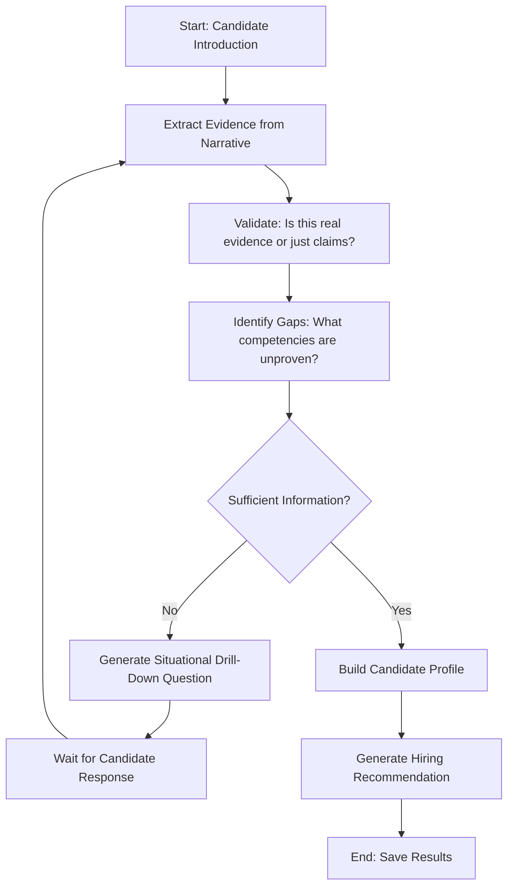
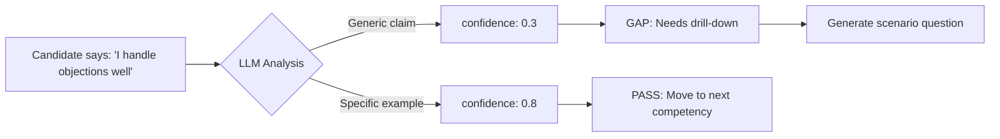

# Building an Intelligent Interview Bot with Dynamic LLM-Generated Questions

**Fabricio Ceolin**

*Principal Engineer, Rankellix*

https://www.linkedin.com/in/fabceolin/

---

## Abstract

This article demonstrates how to build an autonomous interview agent that generates intelligent, context-aware questions using Large Language Models. Unlike traditional rule-based systems with fixed question trees, this approach dynamically adapts based on candidate responses, drilling down when answers are superficial and moving forward when competencies are demonstrated. We use a retail sales job interview as our example—a universally understood scenario that showcases the LLM's ability to probe soft skills, detect evasive answers, and build a structured candidate profile.

**Keywords:** TEA, Interview Agent, Dynamic Questions, LLM, Retail Sales, Behavioral Assessment

---

## 1. Introduction

Traditional interview systems follow rigid decision trees: if the candidate says X, ask Y. This approach fails to capture the nuance of human conversation and misses opportunities to probe deeper when answers are vague.

What if the interviewer could think?

```
Candidate: "I'm good at handling difficult customers."
Bot (Thinking): That's a claim, not evidence. Let me test it.
Bot: "A customer throws a shirt at you and demands a refund for an
     item purchased 6 months ago. Other shoppers are watching.
     Walk me through exactly what you do in the first 30 seconds."
```

This is the power of LLM-driven interviews: the system identifies **gaps** between what it knows and what it needs to know, then generates targeted scenarios to fill those gaps.

### 1.1 Why Retail Sales?

We chose a retail sales position for this tutorial because:

| Reason | Benefit |
|--------|---------|
| **Zero technical barrier** | Every reader has been a customer; they understand good vs. bad service |
| **Soft skill focus** | Tests the LLM's ability to evaluate communication, not just facts |
| **Clear drill-down scenarios** | Easy to see if the bot is being "intelligent" |
| **Universal experience** | The "sell me this pen" scenario is instantly recognizable |

## 2. Architecture Overview

The interview bot follows a cyclical workflow:



### 2.1 Key Concepts

**Gap Analysis**: The system maintains a list of competencies it needs to verify. After each response, it re-evaluates which gaps remain.

**STAR Evidence**: The LLM looks for Situation-Task-Action-Result patterns. Generic claims ("I'm resilient") score low; specific examples ("When a customer threw coffee at me, I...") score high.

**Drill-Down Generation**: When a gap exists, the LLM creates a situational scenario that forces the candidate to demonstrate the competency, not just claim it.

## 3. The Information We Want to Extract

Before building the bot, we must define what "success" looks like. For a retail sales position, we need to assess:

### 3.1 Sales Competencies (Technical)

| Competency | What We're Looking For |
|------------|------------------------|
| **Probing** | Does the candidate ask open questions to understand customer needs? |
| **Objection Handling** | How do they respond to "it's too expensive"? |
| **Closing** | Do they ask for the sale or wait passively? |
| **Upselling** | Do they suggest complementary products? |

### 3.2 Emotional Intelligence

| Competency | What We're Looking For |
|------------|------------------------|
| **Rejection Resilience** | How do they handle hearing "no" repeatedly? |
| **Conflict Management** | How do they de-escalate an angry customer? |
| **Empathy** | Can they read customer signals (rushed, indecisive, browsing)? |

### 3.3 Ethics & Teamwork

| Competency | What We're Looking For |
|------------|------------------------|
| **Commission Disputes** | What if a colleague "steals" their sale? |
| **Honesty vs. Targets** | Would they sell an unsuitable product to hit quota? |

### 3.4 Target State (JSON Schema)

The bot aims to fill this profile:

```json
{
  "candidate_profile": {
    "sales_technique": "null | weak | strong",
    "resilience": "null | low | high",
    "ethics": "null | questionable | solid",
    "availability": "null | incompatible | full"
  },
  "recommendation": "HIRE | NO_HIRE | NEEDS_REVIEW",
  "justification": "string"
}
```

**Logic**: While any field is `null`, the LLM generates questions targeting that competency.

## 4. The Complete YAML Agent

The full agent is available at `examples/retail_sales_interviewer.yaml`. Here are the key components:

### 4.1 State Schema

```yaml
state_schema:
  # Candidate info
  candidate_id: str
  candidate_name: str

  # Knowledge base
  question_bank: dict
  selected_competencies: list

  # Interview state
  initial_narrative: str
  accumulated_narrative: str
  follow_up_responses: list

  # Extraction results
  extracted_responses: list
  gaps: list

  # Final Output
  profile_sales_tech: str
  profile_resilience: str
  profile_ethics: str
  profile_logistics: str
  hiring_recommendation: str
  justification: str
  interview_complete: bool
```

### 4.2 Embedded Question Bank

```python
question_bank = {
    "competencies": {
        "sales_technique": {
            "name": "Sales Technique",
            "questions": [
                {"id": "V1", "text": "How do you approach a customer who is just browsing?", "criteria": "Probing", "weight": 3},
                {"id": "V2", "text": "The customer says 'it's too expensive'. How do you respond?", "criteria": "Objection Handling", "weight": 3},
                {"id": "V3", "text": "How do you close a sale without seeming pushy?", "criteria": "Closing", "weight": 3},
                {"id": "V4", "text": "The customer is buying a phone. What else do you offer?", "criteria": "Upselling", "weight": 2}
            ]
        },
        "emotional_intelligence": {
            "name": "Emotional Intelligence",
            "questions": [
                {"id": "E1", "text": "A customer starts yelling at you in front of other shoppers. What do you do?", "criteria": "Conflict Management", "weight": 3},
                {"id": "E2", "text": "You spent the entire day without closing a single sale. How do you feel and what do you do?", "criteria": "Resilience", "weight": 3}
            ]
        },
        "ethics": {
            "name": "Ethics and Teamwork",
            "questions": [
                {"id": "ET1", "text": "You helped a customer for 20 minutes, but another salesperson closes the sale. What do you do?", "criteria": "Commission Disputes", "weight": 2},
                {"id": "ET2", "text": "End of month, you need one sale to hit target. A customer wants a product you know isn't ideal for them. What do you do?", "criteria": "Honesty vs Quota", "weight": 3}
            ]
        }
    }
}
```

### 4.3 Evidence Extraction (LLM Node)

```yaml
- name: extract_answers_from_narrative
  uses: llm.call
  with:
    model: "gpt-4o"
    temperature: 0.2
    messages:
      - role: system
        content: |
          You are a Retail Recruitment Specialist. Extract BEHAVIORAL EVIDENCE from candidate responses.

          CRITICAL RULES:
          1. Look for STAR evidence (Situation, Task, Action, Result).
          2. GENERIC responses ("I'm good at sales") = LOW confidence (0.2-0.4).
          3. Responses with SPECIFIC EXAMPLES = HIGH confidence (0.7-1.0).
          4. If there's no information about a competency, mark as "EMPTY".
          5. Quote the EXACT text where the candidate demonstrated the competency.

          Return JSON:
          {
            "responses": [
              {
                "question_id": "V1",
                "answer": "evidence summary" OR "EMPTY",
                "confidence": 0.0-1.0,
                "source": "exact quote from candidate",
                "assessment": "strong | weak | empty"
              }
            ]
          }
```

### 4.4 Dynamic Question Generation

```yaml
- name: generate_drill_down
  uses: llm.call
  with:
    model: "gpt-4o"
    temperature: 0.7
    messages:
      - role: system
        content: |
          You are an experienced Store Manager conducting an interview.
          Your goal is to TEST the candidate using a SITUATIONAL SCENARIO.

          RULES:
          1. Do NOT ask generic questions ("Are you resilient?").
          2. CREATE a realistic scenario that forces the candidate to demonstrate the competency.
          3. Be conversational and professional.

          EXAMPLES OF GOOD QUESTIONS:
          - "A customer throws a shirt at you and demands a refund for a 6-month-old purchase. Other customers are watching. What do you do in the first 30 seconds?"
          - "You offered a 5% discount, but the customer still thinks it's expensive. What's your next move?"
          - "It's 9:50pm on a Sunday, you're exhausted, and a customer walks in wanting to see 10 shoe models. How do you serve them?"

          Return JSON: {"question": "your situational question here"}
```

## 5. Running the Interview Bot

### 5.1 Prerequisites

Ensure you have the TEA Python runtime installed and Azure OpenAI configured:

```bash
# Install tea-python (see Installation Tutorial)
tea-python --version

# Set environment variables
export AZURE_OPENAI_API_KEY="your-key-here"
export AZURE_OPENAI_ENDPOINT="https://your-resource.openai.azure.com/"
export AZURE_OPENAI_DEPLOYMENT_NAME="gpt-4o"
```

### 5.2 Start an Interview

```bash
tea-python run --interactive \
  examples/retail_sales_interviewer.yaml \
  --input '{
    "candidate_name": "Maria Santos",
    "candidate_id": "cand_maria_001"
  }'
```

### 5.3 Sample Interaction

```
============================================================
   TEA - retail_sales_interviewer (Interactive Mode)
============================================================

[INFO] Loaded 11 competency questions

Hello Maria Santos! Welcome to the interview for Sales Associate
at TechStore. To start, tell me about yourself: your experience
with sales and why you want to work with us?

> I worked 2 years at Gap selling clothes. I like dealing with
> people and always hit my targets.

[INFO] Extracted 3/11 competencies with evidence
[INFO] Identified 8 competency gaps to explore

A customer walks in, looks at an iPhone for 5 minutes but doesn't
ask for help. You notice they're comparing prices on their phone.
How do you approach this situation?

> I walk over and ask if I can help with any questions about
> the product.

[INFO] Low confidence: generic response, no specific technique

Interesting. But they respond "just looking" and go back to their
phone. What do you do next?

> Then I mention any promotions or ask if they already know the
> advantages of iPhone compared to Android.

[INFO] Extracted evidence for V1 (Probing): confidence 0.7

Great. Now imagine: you spent 30 minutes explaining everything
about a MacBook to a customer. When it's time to close, she says
"I'll think about it and come back later." What do you do?

> I ask if there are any questions I can clarify now and offer
> my card so she can contact me later.

...

============================================================
                    INTERVIEW COMPLETE
============================================================

Recommendation: HIRE

Profile:
  - Sales Technique: STRONG
  - Resilience: STRONG
  - Ethics: INCONCLUSIVE
  - Availability: COMPATIBLE

Justification: Candidate demonstrated solid probing and objection
handling techniques with specific examples. Showed resilience when
describing how she handled difficult days. Recommend second
conversation to explore ethical scenarios.

Result saved to: /tmp/retail_interviews/result_cand_maria_001.json
```

## 6. Understanding the Output

### 6.1 The Result JSON

```json
{
  "candidate_id": "cand_maria_001",
  "candidate_name": "Maria Santos",
  "interview_date": "2024-01-15T14:30:00Z",
  "total_questions": 6,
  "profile": {
    "sales_technique": "STRONG",
    "resilience": "STRONG",
    "ethics": "INCONCLUSIVE",
    "availability": "COMPATIBLE"
  },
  "recommendation": "HIRE",
  "justification": "Candidate demonstrated solid techniques...",
  "strengths": [
    "Prior retail experience",
    "Probing technique with open questions",
    "Goal-oriented mindset"
  ],
  "concerns": [
    "Ethics scenarios not tested"
  ],
  "transcript": "..."
}
```

### 6.2 Key Metrics

| Field | Meaning |
|-------|---------|
| `total_questions` | How many drill-down questions were needed |
| `profile.*` | Assessment of each competency area |
| `strengths` | Positive evidence found |
| `concerns` | Areas needing further exploration |

## 7. How the LLM "Thinks"

The magic happens in the gap analysis and drill-down generation:



The system doesn't just accept claims—it demands evidence. This is what makes it "intelligent" compared to a simple questionnaire.

## 8. Extending the System

### 8.1 Adding New Competencies

Edit the `question_bank` in `load_question_bank` node:

```python
"new_category": {
    "name": "New Category",
    "questions": [
        {
            "id": "NC1",
            "text": "Your base question here",
            "criteria": "What you want to evaluate",
            "weight": 3  # 1-3, higher = more important
        }
    ]
}
```

### 8.2 Changing the Interview Persona

Modify the system prompt in `generate_drill_down`:

```yaml
# From friendly manager to tough interviewer:
content: |
  You are a demanding Regional Director who has seen
  thousands of candidates. You don't accept vague answers
  and push for specific details...
```

### 8.3 Adding Context Switch Detection

For longer interviews, add a node to detect topic changes:

```yaml
- name: detect_context_switch
  uses: llm.call
  with:
    model: "gpt-4o"
    messages:
      - role: system
        content: |
          Detect if the candidate suddenly changed topics.
          Return {"switched": true/false, "new_topic": "..."}
```

## 9. Conclusion

We've built a complete intelligent interview system that:

1. **Dynamically generates questions** based on information gaps
2. **Validates behavioral evidence** using STAR methodology
3. **Drills down** when answers are superficial
4. **Produces structured profiles** for hiring decisions

The retail sales example demonstrates the core principle: LLMs excel at natural language understanding and can probe nuances that rule-based systems miss.

This architecture can be adapted for:
- Technical job interviews (assess coding knowledge)
- Medical intake (symptom assessment)
- Requirements gathering (product discovery)
- Customer support (issue diagnosis)

The key insight: define what you **have** (resume, symptoms, initial description) and what you **want** (competencies, diagnosis, requirements), then let the LLM bridge the gap through intelligent questioning.

## 10. References

- [The Edge Agent Documentation](https://fabceolin.github.io/the_edge_agent/)
- [The Edge Agent GitHub](https://github.com/fabceolin/the_edge_agent)
- [STAR Interview Method](https://www.themuse.com/advice/star-interview-method)
- [Azure OpenAI Service](https://learn.microsoft.com/en-us/azure/ai-services/openai/)
