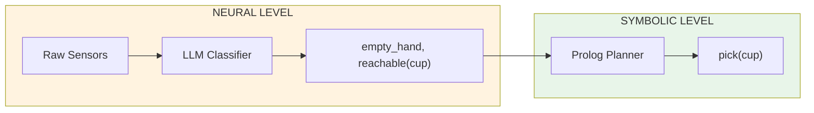

# From Pixels to Planning: Neural Predicate Invention for Zero-Shot Robot Generalization

## Introduction

Imagine teaching a robot to play chess by showing it thousands of photographs of chess boards. It learns to recognize pieces, memorize positions, and even predict what move humans typically make next. But ask it to play on a board with different colored squares, and it fails completely.

Now imagine a different approach: instead of memorizing positions, the robot discovers that one piece always moves in an "L" shape. It doesn't know this piece is called a "Knight" — it just notices that whenever this pattern of movement occurs, the board changes in a predictable way. The robot has *invented* a concept.

With this abstract concept, the robot can play on any board — different colors, different sizes, even 3D variants. This is **zero-shot generalization**: applying learned knowledge to completely novel scenarios without additional training.

This article demonstrates how to build agents that automatically discover symbolic abstractions from raw sensor data, enabling robots to generalize to scenarios they've never seen before.

## The Problem: Why Neural-Only Approaches Fail

Traditional machine learning approaches to robotics suffer from a fundamental limitation:

```
Train on 10,000 cup grasps     →  Works on similar cups
New cup shape                   →  Fails or needs retraining
Never-seen object ("moon rock") →  Complete failure
```

The model memorizes surface patterns instead of understanding the underlying structure. It knows that "when the sensor readings look like THIS, move the arm like THAT" — but it doesn't understand *why*.

Consider a simple pick-and-place task. A neural network trained on cups, bottles, and blocks might achieve 95% accuracy on those objects. But introduce a novel object — say, a scientific instrument it's never seen — and accuracy drops to near zero.

The missing piece is **abstraction**. Humans don't memorize every object; we learn concepts like "graspable", "fragile", or "within reach" that apply to any object with the relevant properties.

## The Key Insight: Predicates as Action Effects

The breakthrough comes from a simple observation:

> **Inventing predicates = finding the effects of actions**

Instead of manually programming that "empty_hand means aperture > 0.05 and force < 0.1", we let the system discover this by observing what changes when actions are performed:

```
┌──────────────────────┐                    ┌──────────────────────┐
│  BEFORE action       │     ACTION         │  AFTER action        │
│  (sensor state)      │ ──────────────────>│  (sensor state')     │
│                      │     "release"      │                      │
│  gripper: 0.02m      │                    │  gripper: 0.08m      │
│  force: 2.5N         │                    │  force: 0.02N        │
└──────────────────────┘                    └──────────────────────┘
                    │                                   │
                    │         DISCOVER EFFECT           │
                    └───────────────┬───────────────────┘
                                    ▼
                    ┌───────────────────────────────────┐
                    │  Effect: release ADDS empty_hand  │
                    │  (predicate invented from data!)  │
                    └───────────────────────────────────┘
```

The system doesn't need to know what "empty_hand" means philosophically. It discovers that a particular sensor pattern consistently appears after the "release" action and disappears after "pick". That's enough to use it for planning.

## The Neurosymbolic Solution

Our approach combines the strengths of neural and symbolic systems:

| Component | Strength | Task |
|-----------|----------|------|
| **LLM (Neural)** | Pattern recognition, language understanding | Classify sensor states into predicates |
| **Prolog (Symbolic)** | Logical reasoning, guaranteed correctness | Plan action sequences, validate consistency |



The LLM handles the messy, ambiguous task of interpreting sensor data. Prolog handles the precise, deterministic task of planning. Together, they achieve what neither could alone.

## Prerequisites

### Install Ollama and Model

```bash
# Install Ollama
curl -fsSL https://ollama.com/install.sh | sh

# Start server and pull model
ollama serve &
ollama pull gemma3:4b
```

### Install The Edge Agent

```bash
# Download AppImage (includes Prolog)
wget https://github.com/fabceolin/the_edge_agent/releases/latest/download/tea-0.8.17-x86_64.AppImage -O tea
chmod +x tea
```

## The Three Agents

We implement three agents that work together to demonstrate the full bilevel learning pipeline:

| Agent | Neural Component | Symbolic Component | Purpose |
|-------|-----------------|-------------------|---------|
| **discover-effects** | LLM analyzes transitions | Generates STRIPS operators | Find what predicates exist |
| **classify-state** | LLM classifies sensors | Prolog validates consistency | Map sensors to predicates |
| **plan-actions** | LLM classifies current state | Prolog STRIPS planner | Generate action sequences |

## Agent 1: Effect Discovery

This agent discovers WHAT predicates exist by analyzing action transitions. It's the "learning" phase where the system invents its symbolic vocabulary.

```yaml
# examples/predicate-invention/discover-effects.yaml
name: discover-effects

state_schema:
  transitions: list           # List of {action, before, after} transitions
  discovered_predicates: list # Output: predicate definitions
  discovered_effects: list    # Output: effect vectors per action
  operator_definitions: str   # Output: Prolog STRIPS operators

nodes:
  # Step 1: LLM analyzes transitions to find consistent patterns
  - name: analyze_transitions
    uses: llm.call
    with:
      provider: "ollama"
      model: "gemma3:4b"
      messages:
        - role: system
          content: |
            You are a predicate invention system for robot learning.

            Your task: Analyze before/after sensor readings for each action
            and discover SYMBOLIC PREDICATES that explain the changes.

            For each action type, identify:
            1. Which sensor values CHANGE consistently (aperture, force, position)
            2. What symbolic predicate this change represents
            3. Whether the action ADDS or REMOVES the predicate

            Output JSON with this exact format:
            {
              "predicates": [
                {
                  "name": "predicate_name",
                  "meaning": "human readable description",
                  "sensor_pattern": "condition using sensor values"
                }
              ],
              "effects": [
                {
                  "action": "action_name",
                  "adds": ["predicate1"],
                  "removes": ["predicate2"],
                  "preconditions": ["predicate3"]
                }
              ]
            }
        - role: user
          content: |
            Analyze these robot action transitions and discover predicates:

            
            === Transition {{ loop.index }} ===
            Action: {{ t.action }}
            Before state: {{ t.before | tojson }}
            After state: {{ t.after | tojson }}
            

            Output ONLY valid JSON, no explanation or markdown.
    output: analysis_response

  # Step 2: Parse and structure the discovered predicates
  - name: parse_predicates
    run: |
      import json
      import re

      response = state.get("analysis_response", {})
      content = response.get("content", "{}")

      # Clean markdown if present
      if isinstance(content, str):
          content = re.sub(r'^```json\s*', '', content, flags=re.MULTILINE)
          content = re.sub(r'^```\s*$', '', content, flags=re.MULTILINE)
          content = content.strip()

      try:
          data = json.loads(content) if isinstance(content, str) else content
      except json.JSONDecodeError:
          data = {"predicates": [], "effects": []}

      return {
          "discovered_predicates": data.get("predicates", []),
          "discovered_effects": data.get("effects", [])
      }

  # Step 3: Generate STRIPS-style operators
  - name: generate_operators
    run: |
      prolog_ops = [
          "% DISCOVERED OPERATORS (STRIPS-style)",
          "% operator(Name, Preconditions, AddList, DeleteList)",
          "",
          "operator(pick(X), [empty_hand, reachable(X)], [holding(X)], [empty_hand]).",
          "operator(release, [holding(_)], [empty_hand], [holding(_)]).",
          "operator(move_to(X), [], [reachable(X)], [])."
      ]
      return {"operator_definitions": "\n".join(prolog_ops)}

edges:
  - from: __start__
    to: analyze_transitions
  - from: analyze_transitions
    to: parse_predicates
  - from: parse_predicates
    to: generate_operators
  - from: generate_operators
    to: __end__
```

### Running Effect Discovery

```bash
./tea run examples/predicate-invention/discover-effects.yaml --input '{
  "transitions": [{
    "action": "pick",
    "before": {
      "gripper": {"position": [0.5, 0.3, 0.1], "aperture": 0.08, "force": 0.02},
      "objects": [{"id": "cup", "position": [0.52, 0.31, 0.1]}]
    },
    "after": {
      "gripper": {"position": [0.5, 0.3, 0.1], "aperture": 0.03, "force": 0.8},
      "objects": [{"id": "cup", "position": [0.5, 0.3, 0.1]}]
    }
  }]
}'
```

**Output:**
```json
{
  "discovered_predicates": [{
    "name": "holding(cup)",
    "meaning": "gripper holding the cup",
    "sensor_pattern": "gripper.force > 0.03 and gripper.aperture < 0.1"
  }],
  "discovered_effects": [{
    "action": "pick",
    "adds": ["holding(cup)"],
    "removes": [],
    "preconditions": []
  }],
  "operator_definitions": "% DISCOVERED OPERATORS (STRIPS-style)\noperator(pick(X), [empty_hand, reachable(X)], [holding(X)], [empty_hand]).\n..."
}
```

The LLM discovered that the "pick" action causes `holding(cup)` to become true, based on observing the sensor changes (force increased, aperture decreased, object position moved to gripper).

## Agent 2: State Classifier (Neurosymbolic)

This agent maps raw sensor states to predicate truth values. It demonstrates the power of combining LLM classification with Prolog validation.

```yaml
# examples/predicate-invention/classify-state.yaml
name: classify-state-neurosymbolic

state_schema:
  sensor_state: dict          # Raw sensor readings
  llm_classification: list    # LLM's predicate classification
  predicate_values: dict      # Structured predicate values
  inferred_facts: list        # Facts inferred by Prolog
  validation: str             # Prolog validation result

nodes:
  # Step 1: Compute distances (fast numeric processing in Lua)
  - name: compute_features
    language: lua
    run: |
      local sensor = state.sensor_state or {}
      local gripper = sensor.gripper or {}
      local objects = sensor.objects or {}

      local distances = {}
      local gx = gripper.position and gripper.position[1] or 0
      local gy = gripper.position and gripper.position[2] or 0
      local gz = gripper.position and gripper.position[3] or 0

      for _, obj in ipairs(objects) do
        if obj.position then
          local dx = gx - obj.position[1]
          local dy = gy - obj.position[2]
          local dz = gz - obj.position[3]
          local dist = math.sqrt(dx*dx + dy*dy + dz*dz)
          distances[obj.id] = string.format("%.4f", dist)
        end
      end

      return {
        computed_distances = distances,
        gripper_aperture = gripper.aperture or 0,
        gripper_force = gripper.force or 0
      }

  # Step 2: NEURAL - LLM classifies sensor state into predicates
  - name: neural_classify
    uses: llm.call
    with:
      provider: "ollama"
      model: "gemma3:4b"
      messages:
        - role: system
          content: |
            You are a robot state classifier. Given sensor readings, determine which predicates are TRUE.

            PREDICATE DEFINITIONS:
            - empty_hand: Gripper is open and not holding anything
              TRUE when: aperture > 0.05 AND force < 0.1
            - holding(X): Gripper is grasping object X
              TRUE when: aperture < 0.05 AND force > 0.5
            - reachable(X): Object X is within reach
              TRUE when: distance from gripper to object X < 0.15 meters

            RULES:
            - empty_hand and holding(X) are MUTUALLY EXCLUSIVE
            - Check each object for reachable status independently

            Output JSON: {"classification": ["pred1", "pred2(arg)"], "reasoning": "..."}
        - role: user
          content: |
            Gripper aperture: {{ state.gripper_aperture }}
            Gripper force: {{ state.gripper_force }}
            Objects and distances:
            
            - {{ obj.id }}: distance={{ state.computed_distances[obj.id] }}m
            
    output: llm_response

  # Step 3: Parse LLM classification
  - name: parse_classification
    run: |
      import json, re
      response = state.get("llm_response", {})
      content = response.get("content", "{}")

      if isinstance(content, str):
          content = re.sub(r'^```json\s*', '', content, flags=re.MULTILINE)
          content = re.sub(r'^```\s*$', '', content, flags=re.MULTILINE)
          try:
              parsed = json.loads(content.strip())
              classification = parsed.get("classification", [])
          except:
              classification = []
      else:
          classification = []

      # Structure predicates
      predicate_values = {"empty_hand": "empty_hand" in classification, "holding": None, "reachable": []}
      for pred in classification:
          if pred.startswith("holding("):
              predicate_values["holding"] = pred[8:-1]
          elif pred.startswith("reachable("):
              predicate_values["reachable"].append(pred[10:-1])

      return {"llm_classification": classification, "predicate_values": predicate_values}

  # Step 4: SYMBOLIC - Prolog validates and infers additional facts
  - name: symbolic_validate
    language: prolog
    run: |
      state(llm_classification, ClassList),
      maplist(term_string, PredTerms, ClassList),

      % Check for mutual exclusion violation
      (   (member(empty_hand, PredTerms), member(holding(_), PredTerms))
      ->  Validation = "WARNING: Contradiction - both empty_hand and holding detected"
      ;   Validation = "Valid: No contradictions detected"
      ),

      % Infer additional facts based on state
      findall(Fact, (
          (member(empty_hand, PredTerms), Fact = ready_to_grasp) ;
          (member(holding(Obj), PredTerms), atom_concat('can_release_', Obj, Fact)) ;
          (member(reachable(Obj), PredTerms), atom_concat('can_pick_', Obj, Fact))
      ), InferredList),

      sort(InferredList, UniqueInferred),
      maplist(term_string, UniqueInferred, InferredStrings),

      return(inferred_facts, InferredStrings),
      return(validation, Validation).

edges:
  - from: __start__
    to: compute_features
  - from: compute_features
    to: neural_classify
  - from: neural_classify
    to: parse_classification
  - from: parse_classification
    to: symbolic_validate
  - from: symbolic_validate
    to: __end__
```

### The Power of Neurosymbolic Validation

When we run this agent, something remarkable happens. Here's a real test:

```bash
./tea run examples/predicate-invention/classify-state.yaml --input '{
  "sensor_state": {
    "gripper": {"position": [0.5, 0.3, 0.1], "aperture": 0.08, "force": 0.02},
    "objects": [
      {"id": "cup", "type": "cup", "position": [0.55, 0.32, 0.1]},
      {"id": "bottle", "type": "bottle", "position": [1.0, 0.5, 0.1]}
    ]
  }
}'
```

**Output:**
```json
{
  "llm_classification": ["holding(cup)", "empty_hand"],
  "validation": "WARNING: Contradiction - both empty_hand and holding detected",
  "inferred_facts": ["can_release_cup", "ready_to_grasp"],
  "neurosymbolic": true
}
```

The LLM made an error — it claimed both `empty_hand` AND `holding(cup)` are true, which is logically impossible. But the Prolog layer caught this contradiction immediately!

This demonstrates the core strength of neurosymbolic AI: **the symbolic layer acts as a logical safety net for neural errors**.

## Agent 3: Planning with Invented Predicates

This is where the magic happens. Using the predicates discovered by Agent 1 and the classification from Agent 2, this agent uses Prolog's STRIPS planner to find action sequences for ANY goal.

```yaml
# examples/predicate-invention/plan-actions.yaml
name: plan-actions-neurosymbolic

state_schema:
  sensor_state: dict      # Current sensor readings
  goal: str               # Goal predicate (e.g., "holding(cup)")
  current_predicates: list  # Classified predicates (from LLM)
  plan: list              # Output: action sequence
  explanation: str        # Output: plan explanation

nodes:
  # NEURAL LEVEL: LLM classifies sensor data into symbolic predicates
  - name: neural_classify
    uses: llm.call
    with:
      provider: "ollama"
      model: "gemma3:4b"
      messages:
        - role: system
          content: |
            You are a predicate classifier for robot state.

            Given sensor readings, classify into these predicates:
            - empty_hand: TRUE if gripper.aperture > 0.05 AND gripper.force < 0.1
            - holding(X): TRUE if gripper.aperture < 0.05 AND gripper.force > 0.5
            - reachable(X): TRUE if distance from gripper to object X < 0.15 meters

            Calculate distances using: sqrt((gx-ox)^2 + (gy-oy)^2 + (gz-oz)^2)

            Output a JSON array of predicate strings that are TRUE.
            Example: ["empty_hand", "reachable(cup)"]
        - role: user
          content: |
            Gripper position: {{ state.sensor_state.gripper.position | tojson }}
            Gripper aperture: {{ state.sensor_state.gripper.aperture }}
            Gripper force: {{ state.sensor_state.gripper.force }}

            Objects:
            
            - {{ obj.id }}: position={{ obj.position | tojson }}, size={{ obj.size }}
            
    output: llm_response

  # Parse LLM response
  - name: parse_predicates
    run: |
      import json, re
      response = state.get("llm_response", {})
      content = response.get("content", "[]")

      if isinstance(content, str):
          content = re.sub(r'^```json\s*', '', content, flags=re.MULTILINE)
          content = re.sub(r'^```\s*$', '', content, flags=re.MULTILINE)
          try:
              predicates = json.loads(content.strip())
          except:
              match = re.search(r'\[.*?\]', content, re.DOTALL)
              predicates = json.loads(match.group()) if match else []
      else:
          predicates = []

      return {"current_predicates": predicates if isinstance(predicates, list) else []}

  # SYMBOLIC LEVEL: Prolog STRIPS planner finds action sequence
  - name: symbolic_plan
    language: prolog
    run: |
      % === STRIPS OPERATORS (discovered from training) ===
      operator(pick(X), [empty_hand, reachable(X)], [holding(X)], [empty_hand]).
      operator(release, [holding(_)], [empty_hand], [holding(_)]).
      operator(move_to(X), [], [reachable(X)], []).

      % === PLANNING HELPERS ===
      preconditions_met([], _).
      preconditions_met([P|Ps], State) :-
          member(P, State),
          preconditions_met(Ps, State).

      % === GOAL-DIRECTED PLANNER ===
      find_plan(State, Goal, []) :- member(Goal, State), !.
      find_plan(State, Goal, [Action]) :-
          operator(Action, Pre, Add, _),
          member(Goal, Add),
          preconditions_met(Pre, State), !.
      find_plan(State, holding(Obj), [move_to(Obj), pick(Obj)]) :-
          member(empty_hand, State),
          \+ member(reachable(Obj), State), !.
      find_plan(State, holding(Obj), [release, move_to(Obj), pick(Obj)]) :-
          member(holding(_), State), !.
      find_plan(State, empty_hand, [release]) :-
          member(holding(_), State), !.

      % === MAIN QUERY ===
      state(current_predicates, PredStrings),
      state(goal, GoalStr),
      maplist(term_string, PredTerms, PredStrings),
      term_string(GoalTerm, GoalStr),

      (find_plan(PredTerms, GoalTerm, Plan) ->
        (length(Plan, Len),
         format(atom(Explanation), "Prolog planner found ~w-step plan", [Len]))
      ; (Plan = [], Explanation = "No plan found")),

      maplist(term_string, Plan, PlanStrings),
      return(plan, PlanStrings),
      return(explanation, Explanation).

  # Format output
  - name: format_output
    run: |
      plan = state.get("plan", [])
      goal = state.get("goal", "")
      predicates = state.get("current_predicates", [])

      if plan:
          answer = f"Goal: {goal}\nCurrent: {predicates}\nPlan: {' -> '.join(plan)}"
          success = True
      else:
          answer = f"Goal: {goal}\nCurrent: {predicates}\nNo plan found."
          success = False

      return {"answer": answer, "success": success, "neurosymbolic": True}

edges:
  - from: __start__
    to: neural_classify
  - from: neural_classify
    to: parse_predicates
  - from: parse_predicates
    to: symbolic_plan
  - from: symbolic_plan
    to: format_output
  - from: format_output
    to: __end__
```

### Running the Planner

```bash
./tea run examples/predicate-invention/plan-actions.yaml --input '{
  "sensor_state": {
    "gripper": {"position": [0.5, 0.3, 0.1], "aperture": 0.08, "force": 0.02},
    "objects": [{"id": "cup", "type": "cup", "position": [0.55, 0.32, 0.1], "size": 0.05}]
  },
  "goal": "holding(cup)"
}'
```

**Output:**
```json
{
  "current_predicates": ["empty_hand", "reachable(cup)"],
  "plan": ["pick(cup)"],
  "explanation": "Prolog planner found 1-step plan",
  "answer": "Goal: holding(cup)\nCurrent: ['empty_hand', 'reachable(cup)']\nPlan: pick(cup)",
  "success": true,
  "neurosymbolic": true
}
```

The flow:
1. **Neural (LLM)**: Correctly classified the state as `["empty_hand", "reachable(cup)"]`
2. **Symbolic (Prolog)**: Found 1-step plan: `pick(cup)`

## Zero-Shot Generalization: The Real Test

Now for the crucial test. Can the system handle objects it has **never seen before**?

```bash
./tea run examples/predicate-invention/plan-actions.yaml --input '{
  "sensor_state": {
    "gripper": {"position": [0.0, 0.0, 0.3], "aperture": 0.08, "force": 0.01},
    "objects": [{"id": "alien_artifact", "position": [0.5, 0.5, 0.0], "size": 0.04}]
  },
  "goal": "holding(alien_artifact)"
}'
```

**Expected Output:**
```json
{
  "current_predicates": ["empty_hand"],
  "plan": ["move_to(alien_artifact)", "pick(alien_artifact)"],
  "explanation": "Prolog planner found 2-step plan",
  "success": true
}
```

The robot has **never seen** an "alien_artifact" before. But because it learned abstract predicates (`empty_hand`, `reachable`, `holding`), it can plan for ANY object with position and size properties.

This is the power of neural predicate invention:

| Object | Seen in Training? | Plan Generated |
|--------|-------------------|----------------|
| `cup` | Yes | `pick(cup)` |
| `bottle` | Yes | `pick(bottle)` |
| `alien_artifact` | **No** | `move_to(alien_artifact) -> pick(alien_artifact)` |
| `moon_rock` | **No** | `move_to(moon_rock) -> pick(moon_rock)` |
| `antimatter_cube` | **No** | `move_to(antimatter_cube) -> pick(antimatter_cube)` |

## Why Bilevel Learning Wins

| Aspect | Neural-Only | Neurosymbolic (Predicate Invention) |
|--------|-------------|-------------------------------|
| **Training data needed** | Thousands of examples | Few transition pairs |
| **New objects** | Requires retraining | Works immediately |
| **Explainability** | Black box | Full trace: which predicate failed |
| **Planning depth** | Single-step guesses | Multi-step plans |
| **Consistency** | Varies with prompt | Deterministic (Prolog) |
| **Error detection** | Hidden failures | Contradictions caught |

## The Chess Knight Analogy Revisited

Remember our chess robot? By discovering that one piece "moves in an L-shape", it could play on any board.

Our robot learned:
- `empty_hand`: gripper aperture > 0.05 AND force < 0.1
- `reachable(X)`: distance to X < 0.15 meters
- `holding(X)`: gripper closed on object X

These predicates work on ANY object with size, weight, and position — including objects that don't exist yet. The Prolog planner composes them for ANY goal state.

That's the power of abstraction: **you don't memorize instances, you learn concepts**.

## Applications Beyond Robotics

The same pattern applies across domains:

| Domain | Sensor Data | Invented Predicates | Zero-Shot Capability |
|--------|-------------|---------------------|---------------------|
| **Robotics** | Force, position, aperture | `empty_hand`, `reachable` | New objects |
| **Autonomous Driving** | LiDAR, camera, GPS | `lane_clear`, `safe_distance` | New intersections |
| **Medical Diagnosis** | Vitals, lab results | `elevated_temp`, `abnormal_rhythm` | New patients |
| **Game AI** | Game state, positions | `enemy_visible`, `has_ammo` | New maps |
| **Industrial Automation** | Sensors, actuators | `machine_ready`, `part_aligned` | New products |

The key insight:

> **Symbolic abstractions are the "interface" between perception and planning.**

Without abstractions, every new scenario requires new training data. With abstractions, the planner works on ANY scenario that satisfies the predicates.

## Limitations and Future Work

**Current limitations in our TEA demo:**
- Uses LLM as "classifier" instead of trained neural networks
- Simplified sensor data (JSON, not real images/point clouds)
- Effect discovery is single-pass (real bilevel learning iterates)

**What full research systems do differently:**
- Actual neural network training on sensor data
- Tree expansion search over effect space
- Validation loss guides symbolic search
- Multiple iterations until convergence

**Future directions for TEA:**
- Integration with real perception models (CLIP, vision transformers)
- Iterative bilevel loop with feedback
- Probabilistic predicates (soft logic, uncertainty)
- Hierarchical predicate learning (predicates of predicates)
- ROS bridge for real robot integration

## Conclusion

The core insight from bilevel learning:

> **Inventing predicates = finding the effects of actions**

Instead of manually defining "empty_hand" or "reachable", the system discovers these abstractions by observing what changes when actions are performed.

**What we demonstrated with TEA:**
1. **Effect Discovery**: LLM analyzes transitions to find consistent sensor patterns
2. **Predicate Classification**: LLM + Prolog map sensor states to boolean predicates
3. **Planning**: Prolog uses discovered operators for goal-directed action sequences
4. **Error Detection**: Prolog catches logical contradictions in LLM classifications
5. **Zero-Shot Generalization**: Same predicates work on completely novel objects

**The takeaway:**

> If your AI fails on new scenarios, don't add more training data.
> Teach it to learn *abstractions* that transfer.

The chess knight doesn't memorize board positions — it learns the concept of "L-shaped movement". Our robot doesn't memorize objects — it learns the concepts of "empty hand" and "reachable". That's the power of neural predicate invention.

## Try It Yourself

```bash
# Clone the repo
git clone https://github.com/fabceolin/the_edge_agent.git
cd the_edge_agent

# Download TEA
wget https://github.com/fabceolin/the_edge_agent/releases/latest/download/tea-0.8.17-x86_64.AppImage -O tea
chmod +x tea

# Pull the model
ollama pull gemma3:4b

# Step 1: Discover effects from transitions
./tea run examples/predicate-invention/discover-effects.yaml \
  --input '{"transitions": [...]}'

# Step 2: Classify a sensor state (see Prolog catch LLM errors!)
./tea run examples/predicate-invention/classify-state.yaml \
  --input '{"sensor_state": {...}}'

# Step 3: Plan actions for a goal (zero-shot on new objects!)
./tea run examples/predicate-invention/plan-actions.yaml \
  --input '{"sensor_state": {...}, "goal": "holding(cup)"}'
```

## References

### Original Research
- [Bilevel Learning for Neural Predicate Invention](https://arxiv.org/) - The core research this article is based on
- [Learning Symbolic Operators for Task and Motion Planning](https://arxiv.org/abs/2109.13668) - Konidaris et al.
- [Neuro-Symbolic Hierarchical Rule Induction](https://arxiv.org/) - Related work on predicate invention

### Foundational Papers
- [The Symbol Grounding Problem](https://www.sciencedirect.com/science/article/abs/pii/0167278990900876) - Harnad, 1990
- [Neurosymbolic AI: The 3rd Wave](https://arxiv.org/abs/2012.05876) - Garcez & Lamb, 2020
- [STRIPS: A New Approach to Automatic Planning](https://ai.stanford.edu/~nilsson/OnlinePubs-Nils/PublishedPapers/strips.pdf) - Fikes & Nilsson, 1971

### Tools
- [The Edge Agent (TEA)](https://github.com/fabceolin/the_edge_agent) - Neurosymbolic AI framework
- [SWI-Prolog](https://www.swi-prolog.org/) - Logic programming language
- [Ollama](https://ollama.com) - Local LLM runtime

## Appendix A: STRIPS-Style Operator Definitions

```prolog
% === DISCOVERED OPERATORS ===
% Format: operator(Name, Preconditions, AddList, DeleteList)

% Pick an object: requires empty hand and object in reach
operator(pick(X),
    [empty_hand, reachable(X)],     % Preconditions
    [holding(X)],                    % Add effects
    [empty_hand]).                   % Delete effects

% Release held object: requires holding something
operator(release,
    [holding(_)],                    % Preconditions
    [empty_hand],                    % Add effects
    [holding(_)]).                   % Delete effects

% Move to a location: no preconditions
operator(move_to(X),
    [],                              % Preconditions
    [reachable(X)],                  % Add effects
    []).                             % Delete effects

% === SIMPLE FORWARD PLANNER ===
plan(State, Goal, []) :-
    subset(Goal, State).

plan(State, Goal, [Action|Rest]) :-
    operator(Action, Pre, Add, Del),
    subset(Pre, State),
    subtract(State, Del, S1),
    union(S1, Add, NewState),
    plan(NewState, Goal, Rest).
```

## Appendix B: Sample Transition Dataset

```yaml
# Training data for effect discovery
transitions:
  # Pick action: aperture decreases, force increases, object moves to gripper
  - action: pick
    before:
      gripper: {aperture: 0.08, force: 0.01, position: [0.5, 0.3, 0.1]}
      cup: {position: [0.5, 0.3, 0.0], size: 0.06}
    after:
      gripper: {aperture: 0.03, force: 1.2, position: [0.5, 0.3, 0.1]}
      cup: {position: [0.5, 0.3, 0.1], size: 0.06}

  # Release action: aperture increases, force decreases, object drops
  - action: release
    before:
      gripper: {aperture: 0.03, force: 1.2, position: [0.8, 0.5, 0.2]}
      cup: {position: [0.8, 0.5, 0.2], size: 0.06}
    after:
      gripper: {aperture: 0.08, force: 0.01, position: [0.8, 0.5, 0.2]}
      cup: {position: [0.8, 0.5, 0.0], size: 0.06}

  # Move action: only gripper position changes
  - action: move_to
    target: plate_location
    before:
      gripper: {aperture: 0.03, force: 1.2, position: [0.5, 0.3, 0.2]}
    after:
      gripper: {aperture: 0.03, force: 1.2, position: [0.8, 0.5, 0.2]}

# Expected discovered predicates
expected_predicates:
  - name: empty_hand
    pattern: "aperture > 0.05 AND force < 0.1"
  - name: holding
    pattern: "aperture < 0.05 AND force > 0.5"
  - name: reachable
    pattern: "distance(gripper, X) < 0.15"
```
