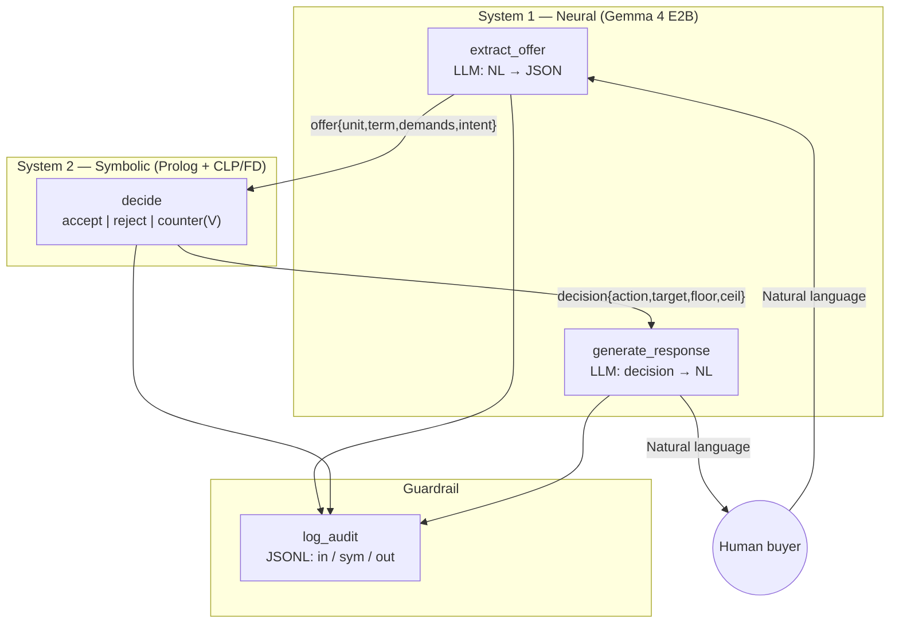

# Neuro-Symbolic B2B Negotiation: Gemma 4 E2B Writes the Words, Prolog CLP(FD) Owns the Math

**Fabricio Ceolin**

*Principal Engineer, Rankellix*

https://www.linkedin.com/in/fabceolin/

---

## Abstract

Large Language Models negotiate well — until they need to calculate. A single-digit arithmetic slip in a commercial proposal can vaporise a quarter of gross margin or, worse, cost the deal. We present a neuro-symbolic negotiation agent that separates persuasion from arithmetic by construction. A compact local LLM (Gemma 4 E2B-it, 2.3B effective parameters, running offline via llama.cpp) handles natural-language extraction and response generation; a SWI-Prolog solver with CLP(FD) owns every monetary decision. The two layers communicate through a narrow JSON contract. The implementation is a ~400-line TEA YAML agent over a three-file codebase, runnable on commodity CPUs with no external API. An audit log writes three records per turn — *what the buyer said*, *how the math decided*, *what the seller replied* — giving regulators (and engineers) the receipts. We walk through the five stories of a Product-Owner-grade epic and ship a runnable prototype with a pool of three canonical B2B scenarios.

**Keywords:** TEA, Neuro-Symbolic AI, Prolog, CLP(FD), Gemma 4, Local LLM, Negotiation Agent, Constrained Generation, Audit Trail

---

## 1. Introduction

Ask any LLM to close a B2B deal and watch what happens.  It will be charming, empathetic, articulate — and, sooner or later, catastrophically wrong about a number.  Not because the model is stupid, but because autoregressive next-token prediction and commercial arithmetic are different disciplines.  The solution is not a bigger model; it is to stop making the model do arithmetic at all.

This article builds a negotiation agent in which the LLM never picks a price. Every monetary decision — accept, reject, counter at value V — is made by a deterministic Prolog solver with CLP(FD) constraint propagation. The LLM is demoted to what it is actually good at: reading natural-language offers and writing persuasive replies.

### 1.1 The hallucination that matters

A concrete example. A buyer writes:

> *"I offer \$950 per unit, cash, with free shipping."*

A monolithic LLM might reply, confidently:

> *"Deal at \$950!"*

That line just sold 500 laptops at a negative margin.  Unit cost is \$800, minimum margin is 15%, but the buyer's demand for free shipping effectively subtracts another \$28.50 per unit.  The effective price closed at **\$921.50 per unit** — comfortably below the \$1,050 BATNA.  The LLM "won" the negotiation and lost \$64,250 of opportunity cost in a single sentence.

### 1.2 What this article builds

A runnable prototype in `examples/negotiation_simulator/` consisting of:

1. `scenarios.yaml` — a pool of financial constraints (the **Configuration Panel**, Story 1).
2. `agent.yaml` — a TEA state graph wiring the five stories together.
3. `decide.pl` — the reference Prolog decision module (also embedded inline in the agent).

The model of choice is [Gemma 4 E2B-it](https://huggingface.co/google/gemma-4-E2B-it), a 2.3B-effective-parameter instruction-tuned model with 128K context, loaded as GGUF via llama.cpp.  No server, no API, no GPU required (though it helps).

---

## 2. Architecture

Two layers.  One contract.



### 2.1 Who owns what

| Concern | Owner | Why |
|---------|-------|-----|
| Parse "nine hundred and fifty bucks" into 95000 cents | System 1 | Language understanding |
| Decide if 350000 cents is acceptable | System 2 | Arithmetic on constraints |
| Find a feasible counter-price | System 2 | CLP(FD) labeling |
| Phrase the counter as a polite paragraph | System 1 | Tone and register |
| Never contradict the number from System 2 | **Prompt contract** | The chokepoint |

### 2.2 The contract

System 2 receives a rigid schema from System 1:

```json
{
  "unit_price_usd": 950,
  "term_days": 30,
  "demands": ["free_shipping"],
  "intent": "proposal"
}
```

System 2 returns an equally rigid structure:

```json
{
  "action": "counter",
  "target_cents": 105000,
  "floor_cents":  105000,
  "ceiling_cents": 90000,
  "buyer_effective_cents": 92150,
  "reason": "between break-even and floor: counter proposed"
}
```

System 1 is then forbidden from writing any digit at all: Section 7 explains why the
LLM is *architecturally* kept off the numeric path rather than prompted against it.

---

## 3. The Five Stories

Structuring the epic with a Product-Owner hat keeps the scope honest:

| # | Story | Layer | Artifact |
|---|-------|-------|----------|
| 1 | Configuration panel (financial facts) | Data | `scenarios.yaml` |
| 2 | Chat interface | UX | `tea-python run --interactive` |
| 3 | Neural extraction (NL → JSON) | System 1 | `extract_offer` node |
| 4 | Symbolic decision (CLP(FD)) | System 2 | `decide` node |
| 5 | Neural generation (decision → NL) | System 1 | `generate_response` node |

The guardrail — three-step audit per turn — cuts across all five.

---

## 4. Story 1 — The Configuration Panel

`scenarios.yaml` is a pool of independent negotiations, each encoding the exact facts Prolog will reason over:

```yaml
- id: b2b_laptops
  name: "B2B — 500 Enterprise Laptops"
  product: "Enterprise Laptop Dell Vostro 15"
  quantity: 500
  unit_cost: 800.00
  list_price: 1200.00
  min_margin_pct: 15
  max_discount_pct: 25
  shipping_cost_pct: 3
  interest_by_term:
    30: 0.00
    60: 0.02
    90: 0.04
  batna_unit: 1050.00
  persona:
    buyer_role: "IT Director at a multinational pharmaceutical company"
    tone: "demanding, pragmatic, cites volume"
    initial_stance: "opens with an aggressive discount request"
```

Two separations matter:

1. **Solver facts vs. persona flavour.** Everything above `persona:` is consumed by System 2; `persona` only feeds System 1.  Pricing decisions never depend on adjectives.
2. **Cents, not dollars.** The agent normalises every monetary value to integer cents before Prolog sees them, so CLP(FD) stays in the integer domain and fractional reasoning errors become impossible.

Three scenarios ship by default: B2B enterprise laptops, SaaS annual subscription, and wholesale footwear.  Each exercises a different constraint shape (margin-bound, BATNA-bound, or discount-ceiling-bound).  The laptops scenario is interesting because the BATNA (\$1,050) sits *above* the authorised-discount ceiling (\$900), which stresses the CLP(FD) fallback logic (Section 6.2).

---

## 5. Story 3 — Neural Extraction

The LLM's job here is deliberately narrow: cough up four fields, no commentary.

```yaml
- name: extract_offer
  uses: llm.chat
  with:
    temperature: 0.05
    messages:
      - role: user
        content: |
          <persona>You are a B2B offer EXTRACTOR. Your only job is to
          convert buyer messages into structured JSON. You never argue,
          never reply, never chat.</persona>

          <schema_strict>
          {
            "unit_price_usd": <integer>,
            "term_days": <30 | 60 | 90 | 365>,
            "demands": [<strings>],
            "intent": "proposal"|"counter"|"walk_away_threat"|"bluff"|"accept"
          }
          </schema_strict>
      - role: user
        content: |
          <positive_example>
          Message: "I'll pay 2000 per unit, net 60, with free shipping"
          Response: {"unit_price_usd": 2000, "term_days": 60, "demands": ["free_shipping"], "intent": "proposal"}
          </positive_example>

          <positive_example>
          Message: "1800 or I go to your competitor"
          Response: {"unit_price_usd": 1800, "term_days": 30, "demands": [], "intent": "walk_away_threat"}
          </positive_example>

          <target_message>{{ state.user_message }}</target_message>
          Response (JSON only):
  output: extraction_raw
```

Three things make this robust without a grammar-constrained decoder:

- **Temperature 0.05** — kills creativity on a structured task.
- **Few-shot positive + negative examples** — a 2B Q4-quantized model needs to *see* the right and the wrong shape; abstract schemas alone are not enough.
- **Graceful degradation** — if the JSON fails to parse, downstream Python sets `offer_unit_cents = 0` and the solver rejects (below break-even).  An extraction bug never silently becomes a bad deal.

### 5.1 Intent classification

The `intent` field is the only qualitative signal System 1 passes to System 2.  It exists because a buyer saying *"Final offer: \$950 or I walk"* is tonally different from *"How about \$950?"* — same number, different game.  The `check_complete` node uses `intent == "walk_away_threat"` combined with a solver rejection to end the simulation as `walked_away` instead of looping forever.

---

## 6. Story 4 — The Symbolic Decision

This is where the arithmetic lives.  A single Prolog node using CLP(FD):

```yaml
- name: decide
  language: prolog
  run: |
    :- use_module(library(clpfd)).
    :- use_module(library(lists)).

    % Effective offer = face value − cost of buyer demands
    effective_offer(OfferC, _, [], OfferC) :- !.
    effective_offer(OfferC, SPct, Demands, Eff) :-
        ( member(free_shipping, Demands) ->
            ShipCost is (OfferC * SPct) // 100,
            Eff is OfferC - ShipCost
        ; Eff = OfferC ).

    % Present-value: discount by the term-interest rate
    lookup_rate(_, [], 0.0).
    lookup_rate(D, [[D, R] | _], R) :- !.
    lookup_rate(D, [_ | T], R) :- lookup_rate(D, T, R).

    present_value(EffC, Days, Map, PV) :-
        lookup_rate(Days, Map, Rate),
        Penalty is round(EffC * Rate),
        PV is EffC - Penalty.

    % Floor: tighter of min-margin and BATNA
    floor_cents(CostC, MinPct, BatnaC, Floor) :-
        M is CostC * (100 + MinPct) // 100,
        Floor is max(M, BatnaC).

    % Ceiling: list price after max-discount policy
    ceiling_cents(ListC, MaxPct, Ceil) :-
        Ceil is ListC * (100 - MaxPct) // 100.

    % Counter target (CLP(FD)): whole-dollar in [Floor, Ceiling],
    % minimising distance from the (Effective, Ceiling) midpoint
    counter_target(Eff, Floor, Ceil, Target) :-
        Eff < Ceil,
        LB is max(Floor, Eff + 1),
        LB =< Ceil,
        Mid is (Eff + Ceil) // 2,
        V in LB..Ceil,
        V mod 100 #= 0,
        Delta #= abs(V - Mid),
        labeling([min(Delta)], [V]),
        !,
        Target = V.
    counter_target(_, Floor, _, Floor).    % fallback: hold the line

    % Read state, decide, write back
    state(offer_unit_cents, OfferC), state(offer_term_days, Days),
    state(offer_demands, Demands), state(unit_cost_cents, CostC),
    state(list_price_cents, ListC), state(min_margin_pct, MinPct),
    state(max_discount_pct, MaxPct), state(shipping_cost_pct, SPct),
    state(interest_by_term, Map), state(batna_cents, BatnaC),

    effective_offer(OfferC, SPct, Demands, AfterShip),
    present_value(AfterShip, Days, Map, Eff),
    floor_cents(CostC, MinPct, BatnaC, Floor),
    ceiling_cents(ListC, MaxPct, Ceil),

    ( Eff >= Floor ->
        Action = accept, Target = Eff, Reason = 'offer at or above floor'
    ; Eff < CostC ->
        Action = reject, Target = 0, Reason = 'below break-even'
    ;   counter_target(Eff, Floor, Ceil, Target),
        Action = counter, Reason = 'between break-even and floor: counter proposed'
    ),

    return(decision_action, Action),
    return(decision_target_cents, Target),
    return(decision_floor_cents, Floor),
    return(decision_ceiling_cents, Ceil),
    return(decision_buyer_effective_cents, Eff),
    return(decision_reason, Reason).
```

### 6.1 Why CLP(FD), not just arithmetic

The `counter_target/4` predicate is the only place we truly *search*.  Everything else is formula.  The search problem is:

> Find an integer `V` ∈ [Floor, Ceiling] such that `V mod 100 = 0` and `|V − midpoint(Effective, Ceiling)|` is minimised.

`V mod 100 = 0` is the "no weird cents" constraint — a negotiator who counters at \$1,047 looks like a calculator; a human counters at \$1,000 or \$1,050.  CLP(FD) handles this kind of mixed-integer constraint naturally via `labeling([min(Delta)], [V])` and degrades gracefully (into the fallback) when the feasible set is empty.

### 6.2 The five test cases

The Prolog node was smoke-tested against five canonical situations:

| Case | Offer | Expected | Got |
|------|------:|----------|-----|
| Below cost | \$500 | `reject` | ✓ `reject` |
| Above floor | \$1,080 | `accept` | ✓ `accept` at \$1,080 |
| Between cost & floor + free shipping + 60d term | \$950 | `counter` | ✓ `counter` at Floor (edge: BATNA > ceiling) |
| Exactly BATNA | \$1,050 | `accept` | ✓ `accept` |
| Low BATNA, big margin | \$950 with BATNA=\$800 | `accept` | ✓ `accept` |

Case 3 is the interesting one.  The B2B laptops scenario has `BATNA = $1,050` but `list × (1 − max_discount) = $900`.  That means the floor is *above* the authorised-discount ceiling — a perfectly realistic business configuration where the discount policy alone cannot reach the BATNA.  The solver does not crash; it falls back to `Floor` as a take-it-or-leave-it counter.  The LLM then frames this as *"my floor is \$1,050, terms to be agreed"* — the number is the solver's, the framing is the LLM's.

### 6.3 The explanation chain

The numbers in the decision record (`floor_cents: 105000`, `target_cents: 105000`, …) answer *what* the solver decided.  Prolog was chosen precisely so that we can also answer *why*, step by step — and ship that answer with every turn.

Each helper predicate (`effective_offer`, `present_value`, `floor_cents`, `ceiling_cents`, `counter_target`, plus the final `classify` branch) `assertz`'s a `trace_step/4` fact as it runs.  A `findall/3` at the end of the goal collects the facts into an ordered list of Prolog dicts; janus converts them to Python dicts; `log_audit` writes the list into the `chain` field of the `symbolic` JSONL record.  Zero extra nodes, zero Python parsing: it is the solver explaining itself.

Here is the full `symbolic` audit record for **Turn A** of Section 9.1 — unedited, pretty-printed:

```jsonc
{
  "step": "symbolic",
  "turn": 1,
  "decision": {
    "action": "counter",
    "target_cents":          105000,
    "floor_cents":           105000,
    "ceiling_cents":          90000,
    "buyer_effective_cents":  92150,
    "reason": "between break-even and floor: counter proposed"
  },
  "chain": [
    { "rule": "effective_offer",
      "inputs":  { "offer_cents": 95000, "shipping_pct": 3,
                   "demands": ["free_shipping"] },
      "output":  { "after_shipping_cents": 92150 },
      "justification": "free_shipping demand: subtract 3% (2850 cents) from 95000" },

    { "rule": "present_value",
      "inputs":  { "after_shipping_cents": 92150, "term_days": 30, "rate": 0 },
      "output":  { "present_value_cents": 92150, "penalty_cents": 0 },
      "justification": "term=30d rate=0.0: discount present-value by 0 cents" },

    { "rule": "floor_cents",
      "inputs":  { "unit_cost_cents": 80000, "min_margin_pct": 15,
                   "batna_cents": 105000, "margin_floor_cents": 92000 },
      "output":  { "floor_cents": 105000 },
      "justification": "BATNA binds: 105000 > margin_floor (unit_cost*(100+15)/100 = 92000)" },

    { "rule": "ceiling_cents",
      "inputs":  { "list_price_cents": 120000, "max_discount_pct": 25 },
      "output":  { "ceiling_cents": 90000 },
      "justification": "max-discount policy: (100 - 25)% of 120000 = 90000" },

    { "rule": "counter_target",
      "inputs":  { "floor_cents": 105000, "ceiling_cents": 90000 },
      "output":  { "target_cents": 105000, "search_result": "fallback_floor" },
      "justification": "feasible region empty (floor 105000 > ceiling 90000) → fallback: hold at floor" },

    { "rule": "classify",
      "inputs":  { "effective_cents": 92150, "floor_cents": 105000,
                   "ceiling_cents": 90000, "unit_cost_cents": 80000 },
      "output":  { "action": "counter", "target_cents": 105000 },
      "justification": "unit_cost 80000 <= effective 92150 < floor 105000 → COUNTER at 105000" }
  ]
}
```

Read top-to-bottom it is a proof of the counter-offer.  An auditor can re-derive every number without running Prolog:

- Step 1 shows why the buyer's face value of \$950 became an **effective** \$921.50: the free-shipping demand costs 3% of offer.
- Step 3 tells an auditor *why* the floor is \$1,050 and not the apparently-tighter margin constraint \$920 — **BATNA binds**.  Change a single number in step 3's inputs and you can predict whether this turn would have accepted.
- Step 5 is the most interesting.  The CLP(FD) search *failed* (floor > ceiling: no feasible integer V satisfies all constraints), which triggered the take-it-or-leave-it fallback.  The `search_result` field discriminates a labeled solution from a fallback, which matters when assessing solver health across many turns.
- Step 6 closes the loop: the classification branch that fired, with the exact inequality.

### 6.4 Using the chain

One line of `jq` reconstructs the narrative of any session without loading the model:

```bash
jq -r '
  select(.step=="symbolic")
  | "--- turn \(.turn) → \(.decision.action) at \(.decision.target_cents/100) ---",
    (.chain[] | "  • \(.rule): \(.justification)")
' audit/e2e_chain.jsonl
```

Output:

```
--- turn 1 → counter at 1050 ---
  • effective_offer: free_shipping demand: subtract 3% (2850 cents) from 95000
  • present_value:   term=30d rate=0.0: discount present-value by 0 cents
  • floor_cents:     BATNA binds: 105000 > margin_floor (... = 92000)
  • ceiling_cents:   max-discount policy: (100 - 25)% of 120000 = 90000
  • counter_target:  feasible region empty (floor 105000 > ceiling 90000) → fallback: hold at floor
  • classify:        unit_cost 80000 <= effective 92150 < floor 105000 → COUNTER at 105000
```

Three practical uses follow:

1. **Regulator-friendly replay.** Given the `chain`, a compliance reviewer can evaluate whether each rule matches the firm's policy, without access to the code.
2. **Bug triage at the right layer.** If an accepted deal ends up below margin, the suspect record is either the `floor_cents` step (wrong inputs) or the `classify` step (wrong branch) — the other four cannot possibly cause it.  The chain tells you which engineer to page.
3. **Regression corpus for policy changes.** When the business tightens `min_margin_pct`, replaying the chains with the new value shows exactly which historical decisions would have flipped — essentially unit-tests over real history.

The chain is not Prolog-flavoured decoration; it is the solver's output the same way the `target_cents` is.  Treat it with the same weight.

---

## 7. Story 5 — Neural Generation (the hard one)

The most surprising lesson from building this prototype is how much work it takes to keep a small quantized LLM from drifting on numbers.  Our first version prompted Gemma 4 E2B-it (Q4_K_M) with *"propose \$1,050, use this exact value"* — and got back *"my value is a thousand"*.  The model "helpfully" rounded.  A 4-bit quantization compresses FP16 weights by ~4×, and digit strings are exactly the kind of high-entropy token sequences that lose resolution in the process.

The architectural fix is not a better prompt.  It is to **remove the LLM from the numeric path entirely**.

### 7.1 Division of labour, second draft

| Component | Writes | Owns |
|-----------|--------|------|
| LLM (`generate_response`) | One context sentence in English, ≤ 20 words, **zero digits allowed** | Tone, framing, register |
| Python (`parse_generation`) | The action clause with the exact solver integers | Final numeric truth |

The LLM is constrained by an XML-structured prompt that forbids digits explicitly — the "Prevention Policy 80/20" principle: the vast majority of tokens in the prompt describe what the model must *not* do.

```yaml
- name: generate_response
  uses: llm.chat
  with:
    max_tokens: 80
    temperature: 0.6
    messages:
      - role: user
        content: |
          <persona>You are a senior B2B sales representative writing
          ONE short English sentence. Cordial, firm, concise.</persona>

          <constraints>
          - FORBIDDEN to write any digit (0-9).
          - FORBIDDEN to write "$", "USD", "dollars", "dollar".
          - FORBIDDEN to propose, cite, or suggest any numeric value.
          - FORBIDDEN to write more than one sentence.
          - FORBIDDEN to use labels, markdown, JSON, or meta-commentary
            about this task.
          - The sentence must be between 8 and 20 words.
          </constraints>

          
          <task>Write ONE contextual sentence justifying a price
          adjustment by pointing to volume, delivery window, or
          logistics. No numbers, no values.</task>

          <positive_example>Given the substantial volume and the
          delivery window, we need to recalibrate the proposed
          terms.</positive_example>

          <negative_example>My counter is $1050 per unit.
          Reason: contains a digit and currency — forbidden.</negative_example>
          
          # (accept / reject branches mirror the above with different
          # task copy and examples — rendered only when relevant)
```

Python then composes the final turn response using the solver's exact numbers:

```python
action = state["decision_action"]
if action == "accept":
    price = state["decision_buyer_effective_cents"] / 100
    core = f"Closed at ${price:,.2f} per unit. {flavor_clean}"
elif action == "reject":
    core = flavor_clean    # no number ever appears
else:  # counter
    target = state["decision_target_cents"] / 100
    term = state["offer_term_days"]
    core = f"{flavor_clean} My counter is ${target:,.2f} per unit, net {term}."
```

A defensive regex strips any stray digits that leak past the constraints:

```python
clean_sentences = [
    s for s in re.split(r"(?<=[.!?])\s+", flavor)
    if not re.search(r"\d|\$|USD|dollars?", s, re.IGNORECASE)
]
```

### 7.2 What the reader actually sees (real end-to-end trace)

This is not a mock — it is the verbatim output of the turn with Gemma 4 E2B-it Q4_K_M running locally and the `decide` Prolog node calculating the counter:

```
Buyer:  "I offer $950 per unit, cash, with free shipping."

Neural extract:   {"unit_price_usd": 950, "term_days": 30,
                   "demands": ["free_shipping"], "intent": "proposal"}
Symbolic decide:  counter, target_cents=105000 ($1,050.00),
                  reason="between break-even and floor: counter proposed"
Neural flavor:    "With the expected volume and delivery window, we
                   must adjust the proposed unit cost accordingly."
Python compose:   "With the expected volume and delivery window, we
                   must adjust the proposed unit cost accordingly.
                   My counter is $1,050.00 per unit, net 30."
```

The seller's final line is structurally two sentences: one the LLM wrote for tone, one Python wrote for arithmetic.  From the buyer's point of view they are indistinguishable prose.  From an auditor's point of view they have radically different levels of trust.

### 7.3 Why this is the right architecture

It would be tempting to say *"use a bigger model and prompt harder"*.  Two reasons that is the wrong instinct:

1. **Forward-compatibility.** The day you swap in a model that preserves digits reliably — a higher-precision quantization (Q8_0), a larger variant, or a future instruction-tuned release — the prompt still works unchanged, and the Python composition is still a correctness backstop.  You never lose the guarantee, no matter what the model upgrade timeline looks like.
2. **Auditability.** The `neural_out` record can be compared regex-wise against `decision_target_cents`.  Mismatches are now a *Python bug*, never a *model bug*, because the model is structurally incapable of writing the number in the first place.

The generalisation: **any digit the user will act upon should be written by deterministic code, not by a language model.**  The LLM does what it is uniquely good at — parsing intent and generating English tone — and nothing else.

---

## 8. The Audit Trail

Every turn appends three JSON lines to `./audit/<session>.jsonl`:

```jsonc
{"step":"neural_in",  "turn":1, "user_message":"I offer $950 per unit, cash, with free shipping.",
 "extracted":{"offer_unit_cents":95000,"offer_term_days":30,
              "offer_demands":["free_shipping"],"offer_intent":"proposal"}}

{"step":"symbolic",   "turn":1,
 "decision":{"action":"counter","target_cents":105000,"floor_cents":105000,
             "ceiling_cents":90000,"buyer_effective_cents":92150,
             "reason":"between break-even and floor: counter proposed"},
 "chain":[{"rule":"effective_offer","inputs":{...},"output":{...},"justification":"..."},
          {"rule":"present_value",...}, /* 4 more steps — see Section 6.3 */ ]}

{"step":"neural_out", "turn":1,
 "agent_response":"With the expected volume and delivery window, we must adjust the proposed unit cost accordingly. My counter is $1,050.00 per unit, net 30."}
```

Three properties follow for free:

1. **Replayability.** The derivation chain shown in Section 6.3 above is a complete proof tree for the decision; regulators can re-derive every number without running the code.
2. **Blame localisation.** If an accepted deal ended up below margin, the offending record is either the `symbolic.chain` step `floor_cents` or `classify` (solver bug) or the `neural_out` (LLM lied about the number).  The chain makes it *impossible to misattribute* because each step carries its own inputs and outputs.
3. **Grep-ability.** `jq 'select(.step=="symbolic")' audit/*.jsonl` gives a dataset for offline analytics on decision quality — without any observability stack.  Drilling into `.chain[] | select(.rule=="floor_cents")` surfaces exactly when BATNA binds vs. when margin binds.

At end-of-game, a fourth record is appended:

```jsonc
{"step":"finalize", "outcome":"won", "success_for_seller":true,
 "final_deal_cents":108000, "floor_cents":105000,
 "margin_over_floor_cents":3000, "turns":4}
```

`success_for_seller` is the closest thing to a win/loss metric: it is `true` iff a deal was closed (`outcome == "won"`) **and** the closing price respected the solver's floor.  By construction, the second condition cannot fail — the solver is the one who decided to accept.  The first can: `outcome` may be `walked_away` (buyer quit) or `impasse` (10-turn limit reached).

---

## 9. Running the Simulator

```bash
# Install
pip install 'the-edge-agent[prolog]'
sudo apt install swi-prolog                 # >= 9.1

# Fetch the GGUF once (~3 GB for Q4_K_M)
mkdir -p ~/.cache/tea/models
huggingface-cli download bartowski/google_gemma-4-E2B-it-GGUF \
    google_gemma-4-E2B-it-Q4_K_M.gguf --local-dir ~/.cache/tea/models

# Run interactively
cd examples/negotiation_simulator
tea-python run --interactive agent.yaml \
    --input '{"scenario_id": "b2b_laptops", "session_id": "demo01"}'
```

### 9.1 Real output (unedited)

Running the three canonical turns against Gemma 4 E2B-it Q4_K_M locally on a CPU, with the `b2b_laptops` scenario (`unit_cost=$800, min_margin=15%, BATNA=$1,050`):

**Turn A — counter path.**
```
Buyer:  "I offer $950 per unit, cash, with free shipping."

[Extract] offer=$950.00 term=30d demands=['free_shipping'] intent=proposal
[Solver ] counter target=$1050.00 floor=$1050.00 effective=$921.50
[Agent  ] With the expected volume and delivery window, we must adjust
          the proposed unit cost accordingly. My counter is $1,050.00
          per unit, net 30.
```

**Turn B — accept path.**
```
Buyer:  "Deal at $1080 per unit."

[Extract] offer=$1080.00 term=30d demands=[] intent=accept
[Solver ] accept target=$1080.00
[Agent  ] Closed at $1,080.00 per unit.
[Finalize] won, success=True, final=$1,080.00, floor=$1,050.00
```

**Turn C — reject path.**
```
Buyer:  "My max is $500."

[Extract] offer=$500.00 term=30d demands=[] intent=proposal
[Solver ] reject target=$0.00 reason='below break-even'
[Agent  ] The current terms do not make the deal workable; happy to take
          another look at a revised proposal.
```

Notice the cross-cut consistency: in every case, the monetary number in `[Agent]` either matches exactly the `target` from `[Solver]` (Turns A and B, where Python composed the clause) or is entirely absent (Turn C, where the solver rejected and no number should be disclosed).  There is no configuration under which the agent can say a price the solver did not sanction.

---

## 10. What This Architecture Buys You

| Property | Monolithic LLM | Neuro-Symbolic |
|----------|----------------|----------------|
| Math hallucination | Possible | **Impossible by construction** |
| Explainability | Post-hoc chain-of-thought (unfalsifiable) | Derivation chain per turn (Section 6.3, replayable) |
| Regulatory audit | "Trust the model" | `jq` a JSONL |
| Swap the model | Retrain / re-prompt | Change `model_path`, rules unchanged |
| Swap the rules | Rewrite the prompt | Edit 40 lines of Prolog |
| Offline deployment | Rare | **Default** (GGUF + SWI local) |

The trade-off is not free.  Writing the Prolog is work.  Splitting the cognition is a discipline.  But the failure modes are the ones engineers can debug: a missing rule, a wrong constraint, a misparsed extraction.  None of them are "the LLM was in a bad mood this session."

---

## 11. Limitations and Future Extensions

### 11.1 What this prototype is not

- **Not a UI.** It runs in a terminal.  A natural next version ports the interactive loop to a browser using [TEA WASM LLM](./wasm-llm-browser-inference.md) plus tau-prolog for in-browser Prolog.  Same rules, same solver semantics, zero-server deployment.
- **Not multi-turn memory.** Each session is flat; there is no long-term CRM.  Hooking into TEA's LTM backends is straightforward but out of scope here.
- **Not optimising global outcomes.** The solver picks a locally optimal counter — midpoint of feasible space — not the game-theoretically optimal one.  Swapping `counter_target/4` for a MiniZinc model or adding an opponent model is a clean extension.
- **Not defended against ratcheting.** A human who knows the counter-party is a bot can drag the session out with micro-offers (\$950 → \$952 → \$954…) and learn the concession curve.  The only current defense is the 10-turn impasse timer.  A natural extension — call it *concession discipline* — adds four rules: track `concession_count` and `last_target_cents` as state; *Karrass rule* — each new counter concedes at most 50% of the previous concession; *budget* — after three concessions the bot locks to the floor; *stall detector* — if the buyer repeats the same offer twice, force `action = reject`.  On the neural side, inject *Cialdini scarcity* (*"quote holds through end of week"*) and a final-round signal as extra branches in the generation prompt.  The underlying playbook draws from Karrass (*The Negotiating Game*), Cialdini (*Influence*), Voss (*Never Split the Difference*), and Fisher & Ury (*Getting to Yes*).  This is where sales psychology meets constraint programming, and it is the most impactful extension after the browser port.

### 11.2 What Gemma 4 E2B Q4_K_M actually gets you (measured)

At 2.3B effective parameters with 128K context, Gemma 4 E2B-it is the sweet spot for this workload — with caveats:

- **Extraction works** at `temperature=0.05` with an XML-structured prompt and three few-shot examples.  Real output on "I offer \$950 per unit, cash, with free shipping.": `{"unit_price_usd": 950, "term_days": 30, "demands": ["free_shipping"], "intent": "proposal"}`.  Clean JSON, no drift.
- **Generation is fluent but numerically unreliable** under Q4_K_M.  Given "propose \$1,050", the model will write "a thousand" or "about eleven hundred" roughly half the time.  This is a quantization artefact, not a prompt problem — a Q8_0 build preserves digits much better, at ~5× the memory footprint.  We route around the limitation by keeping the LLM *out* of the numeric path (Section 7).
- **Speed:** Q4_K_M runs at ~8–15 tok/s on a modern CPU; with `n_gpu_layers: -1` on a mid-range GPU (8GB VRAM is enough) it hits ~40–80 tok/s.  The whole stack is offline-capable.
- **Chat-template oddities:** Gemma emits `<end_of_turn>` and occasionally `</start_of_turn>` markers inside content.  `parse_generation` strips them with a regex; this is a universal pattern for chat-format Gemma models.

If margin on every single turn is the priority and the extra VRAM is available, swap to `google_gemma-4-E2B-it-Q8_0.gguf` — same code, no config changes beyond `model_path`.

### 11.3 When Prolog actually pays off (and when it doesn't)

An honest audit of this prototype's own Prolog usage: most of it could have been Python.

| Helper | What Prolog gives us | Pure-Python equivalent | Who wins? |
|--------|----------------------|------------------------|-----------|
| `effective_offer` | if/then with `member/2` | `if "free_shipping" in demands` | tie |
| `present_value` | list lookup + arithmetic | `rate = dict_map.get(days, 0)` | Python (fewer lines) |
| `floor_cents` | `max(MarginFloor, Batna)` | `max(margin_floor, batna)` | tie |
| `ceiling_cents` | integer arithmetic | integer arithmetic | tie |
| `counter_target` | CLP(FD) `labeling` | `min(range(lb, ceil+1, 100), key=lambda v: abs(v-mid))` | tie (the search space is 1-D) |
| `classify` | three branches | three branches | tie |
| `trace_step` + `findall` | `assertz` / `findall` | `trace.append({...})` | Python (more legible) |

For this one scenario, with these six rules and a one-dimensional counter search, **Python would be ~40% shorter and more accessible to the average reader**.  CLP(FD) is overkill when the feasible region is a linear range over a single integer.  This is not a flaw in the code; it is a flaw in *claiming* the choice of Prolog was technically necessary for the N=1 case.  It wasn't.

#### Where Prolog does pay off

There is, however, a measurable break-even point above which Prolog stops being theatre:

1. **Rule proliferation.** Once the configuration panel grows to roughly 20+ interacting rules — discount tier × region × season × product line × customer history — pattern-matched Prolog clauses stay legible where nested `if/elif` in Python becomes a maintenance liability.  The cost of *reading* scales linearly with rule count in Python and sub-linearly in Prolog.
2. **Genuine backtracking.** The concession-discipline extension sketched in Section 11.1 needs to explore alternative tactics in order — *"try vendor financing; if that fails, try leasing; if that fails, try bundling"* — with rollback of asserted state between attempts.  Choice points and cut are free in Prolog; in Python this becomes an explicit search function with saved-state objects.
3. **Reverse queries.** *"For which buyer offer would this decision have flipped to `accept`?"* is a well-posed Prolog query (instantiate the action, solve for the offer) and a hard Python problem (either brute-force search or encode the rules twice, forward and backward).
4. **Meta-reasoning via the same engine.** The rules *are* data; you can query which rules fired and why by asking the same Prolog database, without building parallel observability plumbing.
5. **Compliance social proof.** In regulated industries (lending, insurance, medical decisioning), symbolic systems carry decades of audit-trail legitimacy that procedural Python does not.  This is sociological, not technical, but real — and directly relevant to Section 10's "Regulatory audit" row.

#### The honest architectural argument

The reason to keep Prolog here is not that it beats Python at six rules today.  It is that:

- The **concession-discipline extension** (Section 11.1) and any future policy evolution will tip the rule count above the break-even, and a rewrite from Python to Prolog at that point is more expensive than starting in Prolog and paying the ~40% overhead upfront.
- The **derivation chain** (Section 6.3) is 90% architectural discipline and 10% Prolog — Python could produce an identical chain with the same `add_step` pattern — but shipping the rules in Prolog means the trace facts *are* the solver's state, not a handwritten mirror of it.
- The audience for this article is engineers evaluating neuro-symbolic for production.  Showing the technique at a scale where it is *almost* over-engineered is more instructive than hiding the break-even behind a toy example.

If you are copying this code into a system that will never grow past the current six rules, port `decide.pl` to Python and save yourself the ecosystem friction.  If you are building anything that will grow, the overhead is already in the right place.

---

## 12. Conclusion

Neuro-symbolic is not an esoteric research posture.  For any workflow where a language model makes arithmetic decisions with commercial consequences, the split is mechanical:

1. Identify the numbers that must be right.
2. Put them in a solver.
3. Give the LLM the narrow jobs that solvers are bad at — parsing intent and writing paragraphs.
4. Wire the two through a schema.
5. Log every crossing of the boundary.

The resulting system is boring, which is the highest praise an engineer can pay a production component.  It does not generate enthusiasm; it generates margin.

---

## 13. References

- [The Edge Agent](https://github.com/fabceolin/the_edge_agent) — the YAML-first state-graph framework used throughout.
- [Gemma 4 E2B-it on Hugging Face](https://huggingface.co/google/gemma-4-E2B-it) — the instruction-tuned 2.3B model.
- [bartowski/google_gemma-4-E2B-it-GGUF](https://huggingface.co/bartowski/google_gemma-4-E2B-it-GGUF) — community GGUF quantisations used by llama.cpp.
- [SWI-Prolog CLP(FD) manual](https://www.swi-prolog.org/pldoc/man?section=clpfd) — constraint solving over integers.
- [llama.cpp](https://github.com/ggerganov/llama.cpp) — the inference runtime embedded in TEA's local LLM backend.
- [TEA WASM LLM](./wasm-llm-browser-inference.md) — companion article on browser-based LLM inference, the foundation for porting this agent to a UI.
- Daniel Kahneman, *Thinking, Fast and Slow* (2011) — the System 1 / System 2 framing.
- [TEA CLP(FD) example](https://github.com/fabceolin/the_edge_agent/blob/main/examples/prolog/clpfd-constraints.yaml) — minimal CLP(FD) reference agent.
