# Reasonableness Monitors: Adding Common Sense to Neural Networks

## Introduction

In 2021, a Tesla vehicle mistook the full moon for a yellow traffic light. In 2018, an Uber autonomous vehicle failed to recognize a pedestrian pushing a bicycle across the road — because its training data didn't include that specific scenario. These aren't rare edge cases; they're symptoms of a fundamental limitation: **neural networks lack common sense**.

A human would never confuse the moon with a traffic light. Why? Because we know that traffic lights are attached to poles at intersections, not floating in the sky at astronomical distances. This knowledge isn't learned from millions of images — it's basic physics and spatial reasoning.

This article introduces **Reasonableness Monitors** — neurosymbolic components that act as a common-sense sanity check on neural network outputs. Using The Edge Agent (TEA), we'll build monitors that:

1. Validate perceptions against physical laws and common sense
2. Catch impossible or implausible detections before they cause harm
3. Provide human-readable explanations for why a perception was rejected

## The Problem: Neural Networks Are Confidently Wrong

Neural networks are powerful pattern matchers, but they fail in ways that humans find baffling:

```mermaid
flowchart LR
    subgraph "Neural Network Failures"
        A[🌙 Moon] -->|"Classified as"| B[🚦 Yellow Light]
        C[🦃 Turkey] -->|"Not in training"| D[❓ Unknown]
        E[📋 Sticker on Sign] -->|"Adversarial"| F[🚫 Wrong Speed Limit]
    end
```



| Failure Type | Example | Consequence |
|--------------|---------|-------------|
| **Perceptual Confusion** | Moon → Yellow traffic light | Car brakes unnecessarily |
| **Out-of-Distribution** | Turkey crossing road → Unknown | Car doesn't stop |
| **Adversarial Attack** | Sticker on stop sign → Speed limit 100 | Car accelerates dangerously |
| **Scale Misestimation** | Human-sized cone → Traffic cone | Wrong object classification |

The core issue is that neural networks are **opaque statistical models**. They learn correlations, not causation. They don't understand that:

- Traffic lights are fixed to poles, not floating in space
- Objects have consistent physical dimensions
- Moving objects on roads require caution regardless of classification
- Context matters (a 100 km/h sign makes no sense in a school zone)

## The Solution: Reasonableness Monitors

A Reasonableness Monitor treats the neural network as a **black box** and validates its outputs against symbolic knowledge:

```mermaid
flowchart TB
    subgraph "Perception Pipeline"
        CAM[📷 Camera] --> NN[Neural Network]
        NN --> |"label: traffic_light<br/>confidence: 0.87<br/>position: sky"| RM
    end

    subgraph "Reasonableness Monitor"
        RM[Symbolic Validator] --> KB[(Knowledge Base)]
        KB --> |"traffic_light:<br/>- attached_to: pole<br/>- location: intersection<br/>- height: 3-6m"| RM
        RM --> Decision{Reasonable?}
    end

    Decision -->|✅ Yes| Action[Execute Action]
    Decision -->|❌ No| Alert[Alert + Explanation]

    style RM fill:#90EE90
    style KB fill:#87CEEB
```



### Architecture Overview

The monitor operates in three phases:

1. **Capture**: Receive neural network output (label, confidence, bounding box, position)
2. **Validate**: Query knowledge base for expected properties
3. **Decide**: Apply logical rules to accept, reject, or flag for review

## Knowledge Representation

### Conceptual Dependency Theory

We represent objects using **Conceptual Dependency (CD)** primitives — a symbolic language that decomposes objects into verifiable properties:

```prolog
% Object physical properties
object_property(traffic_light, typical_height, range(3, 6)).      % meters
object_property(traffic_light, attached_to, pole).
object_property(traffic_light, location, intersection).
object_property(traffic_light, distance_from_ground, range(2, 8)).

object_property(traffic_cone, typical_height, range(0.3, 1.0)).   % meters
object_property(traffic_cone, typical_width, range(0.2, 0.5)).
object_property(traffic_cone, location, road_surface).
object_property(traffic_cone, material, plastic).

object_property(pedestrian, typical_height, range(0.5, 2.1)).     % child to tall adult
object_property(pedestrian, movement, dynamic).
object_property(pedestrian, threat_level, high).

object_property(moon, distance_from_ground, astronomical).
object_property(moon, location, sky).
object_property(moon, movement, celestial).
```

### Common Sense Rules

```prolog
% Rule: Traffic lights cannot be in the sky at astronomical distances
unreasonable(Detection) :-
    detection_label(Detection, traffic_light),
    detection_position(Detection, Position),
    position_in_sky(Position),
    position_distance(Position, Distance),
    Distance > 100,  % meters - way too far for a traffic light
    assert_explanation("Traffic lights are mounted on poles at intersections, not floating in the sky").

% Rule: Traffic cones cannot be human-sized
unreasonable(Detection) :-
    detection_label(Detection, traffic_cone),
    detection_height(Detection, Height),
    Height > 1.5,  % meters
    assert_explanation("Traffic cones are typically 30-100cm tall, not human-sized").

% Rule: Any moving object on the road requires caution
requires_caution(Detection) :-
    detection_position(Detection, Position),
    position_on_road(Position),
    detection_velocity(Detection, Velocity),
    Velocity > 0,
    assert_explanation("Moving object detected on road - caution required regardless of classification").

% Rule: Speed limits must match road context
unreasonable(Detection) :-
    detection_label(Detection, speed_sign),
    detection_value(Detection, SpeedLimit),
    current_zone(Zone),
    zone_max_reasonable_speed(Zone, MaxReasonable),
    SpeedLimit > MaxReasonable,
    format(atom(Msg), "Speed limit ~w km/h is unreasonable for ~w zone", [SpeedLimit, Zone]),
    assert_explanation(Msg).

% Zone-specific speed limits
zone_max_reasonable_speed(school_zone, 30).
zone_max_reasonable_speed(residential, 50).
zone_max_reasonable_speed(urban, 70).
zone_max_reasonable_speed(highway, 130).
```

## Implementation with TEA

### The Reasonableness Monitor Agent

```yaml
# examples/safety/reasonableness-monitor.yaml
name: reasonableness-monitor

state_schema:
  # Input from neural network
  detection:
    type: object
    properties:
      label: str
      confidence: float
      bbox: list  # [x, y, width, height]
      position_3d: list  # [x, y, z] in meters
      velocity: float  # m/s

  # Context
  current_zone: str
  sensor_data:
    type: object
    properties:
      lidar_confirms: bool
      radar_distance: float

  # Output
  is_reasonable: bool
  explanation: str
  action: str
  confidence_adjusted: float

settings:
  prolog:
    preload: |
      % Knowledge base: Object properties
      object_property(traffic_light, typical_height, range(3, 6)).
      object_property(traffic_light, attached_to, pole).
      object_property(traffic_light, max_distance, 50).
      object_property(traffic_light, location_type, intersection).

      object_property(traffic_cone, typical_height, range(0.3, 1.0)).
      object_property(traffic_cone, max_height, 1.5).
      object_property(traffic_cone, location_type, road_surface).

      object_property(pedestrian, typical_height, range(0.5, 2.1)).
      object_property(pedestrian, threat_level, critical).

      object_property(stop_sign, typical_height, range(2, 3)).
      object_property(stop_sign, location_type, intersection).

      % Zone speed limits
      zone_max_speed(school_zone, 30).
      zone_max_speed(residential, 50).
      zone_max_speed(urban, 70).
      zone_max_speed(highway, 130).

      % Helper predicates
      in_range(Value, range(Min, Max)) :- Value >= Min, Value =< Max.

      sky_position([_, _, Z]) :- Z > 20.  % More than 20m up is "sky"
      road_position([_, _, Z]) :- Z < 2.  % Less than 2m is road level

nodes:
  # Node 1: Parse detection into Prolog facts
  - name: load_detection
    language: prolog
    run: |
      % Get detection data from state
      state(detection, Detection),

      % Extract fields
      get_dict(label, Detection, Label),
      get_dict(confidence, Detection, Confidence),
      get_dict(position_3d, Detection, Position),
      get_dict(velocity, Detection, Velocity),

      % Get bounding box for size estimation
      get_dict(bbox, Detection, BBox),
      nth0(2, BBox, Width),
      nth0(3, BBox, Height),

      % Assert as facts for rule evaluation
      assertz(current_detection(Label, Confidence, Position, Velocity, Width, Height)),

      % Store for later use
      return(detection_loaded, true).

  # Node 2: Apply reasonableness rules
  - name: check_reasonableness
    language: prolog
    run: |
      % Get current detection
      current_detection(Label, Confidence, Position, Velocity, Width, Height),

      % Get context
      state(current_zone, Zone),
      state(sensor_data, SensorData),

      % Initialize result
      Reasonable = true,
      Explanations = [],

      % Check 1: Sky position for ground objects
      (   object_property(Label, location_type, road_surface),
          sky_position(Position)
      ->  Reasonable1 = false,
          Exp1 = "Object classified as ground-level but detected in sky position"
      ;   Reasonable1 = Reasonable,
          Exp1 = ""
      ),

      % Check 2: Size consistency
      (   object_property(Label, max_height, MaxH),
          Height > MaxH
      ->  Reasonable2 = false,
          format(atom(Exp2), "Object height ~2fm exceeds maximum ~2fm for ~w", [Height, MaxH, Label])
      ;   Reasonable2 = Reasonable1,
          Exp2 = ""
      ),

      % Check 3: Traffic light at astronomical distance (moon case)
      (   Label = traffic_light,
          Position = [_, _, Z],
          Z > 100
      ->  Reasonable3 = false,
          Exp3 = "Traffic light detected at astronomical distance - likely celestial object (moon)"
      ;   Reasonable3 = Reasonable2,
          Exp3 = ""
      ),

      % Check 4: Multi-sensor disagreement
      (   get_dict(lidar_confirms, SensorData, false),
          Confidence < 0.95
      ->  Reasonable4 = false,
          Exp4 = "LiDAR does not confirm visual detection - possible phantom object"
      ;   Reasonable4 = Reasonable3,
          Exp4 = ""
      ),

      % Combine results
      FinalReasonable = Reasonable4,
      findall(E, (member(E, [Exp1, Exp2, Exp3, Exp4]), E \= ""), AllExplanations),
      atomic_list_concat(AllExplanations, "; ", FinalExplanation),

      % Return results
      return(is_reasonable, FinalReasonable),
      return(explanation, FinalExplanation).

  # Node 3: Determine action based on reasonableness
  - name: decide_action
    run: |
      is_reasonable = state.get("is_reasonable", True)
      explanation = state.get("explanation", "")
      detection = state.get("detection", {})
      original_confidence = detection.get("confidence", 0.0)
      label = detection.get("label", "unknown")

      if is_reasonable:
          action = "PROCEED"
          adjusted_confidence = original_confidence
      else:
          # Unreasonable detection - reduce confidence and alert
          adjusted_confidence = original_confidence * 0.1  # Drastically reduce

          # Determine safety action
          velocity = detection.get("velocity", 0)
          if velocity > 0:
              action = "CAUTION_SLOW"  # Moving object - be careful anyway
          else:
              action = "IGNORE_PHANTOM"  # Likely false positive

      return {
          "action": action,
          "confidence_adjusted": adjusted_confidence
      }

  # Node 4: Generate human-readable report
  - name: generate_report
    uses: llm.call
    with:
      provider: "ollama"
      model: "llama3.2:3b"
      messages:
        - role: system
          content: |
            You are a safety system explaining perception decisions.
            Generate a brief, clear explanation for operators.
        - role: user
          content: |
            Detection: {{ state.detection.label }} (confidence: {{ state.detection.confidence }})
            Position: {{ state.detection.position_3d }}
            Reasonable: {{ state.is_reasonable }}
            Explanation: {{ state.explanation }}
            Action: {{ state.action }}

            Generate a one-sentence safety report.
    output: safety_report

edges:
  - from: __start__
    to: load_detection
  - from: load_detection
    to: check_reasonableness
  - from: check_reasonableness
    to: decide_action
  - from: decide_action
    to: generate_report
  - from: generate_report
    to: __end__
```

## Case Studies

### Case 1: The Moon vs Traffic Light

**Scenario**: Neural network detects "yellow traffic light" with 87% confidence, but it's actually the full moon.

**Input**:
```json
{
  "detection": {
    "label": "traffic_light",
    "confidence": 0.87,
    "bbox": [450, 120, 30, 45],
    "position_3d": [0, 0, 384400000],
    "velocity": 0
  },
  "current_zone": "highway",
  "sensor_data": {
    "lidar_confirms": false,
    "radar_distance": null
  }
}
```

**Monitor Output**:
```json
{
  "is_reasonable": false,
  "explanation": "Traffic light detected at astronomical distance - likely celestial object (moon); LiDAR does not confirm visual detection - possible phantom object",
  "action": "IGNORE_PHANTOM",
  "confidence_adjusted": 0.087,
  "safety_report": "Rejecting traffic light detection: object is at astronomical distance (384,400 km) inconsistent with traffic infrastructure. LiDAR confirms no physical object. Continuing normal operation."
}
```

### Case 2: Human-Sized Traffic Cone

**Scenario**: Neural network misclassifies a person wearing an orange safety vest as a traffic cone.

**Input**:
```json
{
  "detection": {
    "label": "traffic_cone",
    "confidence": 0.72,
    "bbox": [320, 200, 60, 180],
    "position_3d": [5, 2, 0],
    "velocity": 1.2
  },
  "current_zone": "urban",
  "sensor_data": {
    "lidar_confirms": true,
    "radar_distance": 5.1
  }
}
```

**Monitor Output**:
```json
{
  "is_reasonable": false,
  "explanation": "Object height 1.80m exceeds maximum 1.50m for traffic_cone",
  "action": "CAUTION_SLOW",
  "confidence_adjusted": 0.072,
  "safety_report": "Rejecting traffic cone classification: detected object is 1.8m tall with 1.2 m/s velocity, inconsistent with static road marker. Treating as potential pedestrian - initiating cautionary slowdown."
}
```

### Case 3: Out-of-Distribution Object (Turkey)

**Scenario**: A wild turkey crosses the highway. The neural network has never seen a turkey and outputs "unknown_object".

**Input**:
```json
{
  "detection": {
    "label": "unknown_object",
    "confidence": 0.45,
    "bbox": [280, 350, 80, 60],
    "position_3d": [8, 0, 0.5],
    "velocity": 2.0
  },
  "current_zone": "highway",
  "sensor_data": {
    "lidar_confirms": true,
    "radar_distance": 8.2
  }
}
```

**Monitor Output**:
```json
{
  "is_reasonable": true,
  "explanation": "",
  "action": "CAUTION_SLOW",
  "confidence_adjusted": 0.45,
  "safety_report": "Unknown moving object detected on highway. LiDAR confirms physical presence at 8.2m. Regardless of classification, initiating evasive slowdown for road safety."
}
```

The monitor doesn't need to identify the turkey — it applies the **universal rule** that any moving object on the road requires caution.

## Multi-Sensor Fusion

In real systems, reasonableness monitors integrate data from multiple sensors:


### Sensor Disagreement Rules

```prolog
% Rule: Camera says clear, LiDAR says obstacle - trust LiDAR
sensor_conflict_resolution(Action) :-
    camera_detection(clear),
    lidar_detection(obstacle, Distance),
    Distance < 20,
    Action = emergency_stop,
    assert_explanation("LiDAR detects obstacle not seen by camera - stopping for safety").

% Rule: Camera says obstacle, LiDAR says clear - investigate
sensor_conflict_resolution(Action) :-
    camera_detection(obstacle, Label, Confidence),
    lidar_detection(clear),
    Confidence < 0.9,
    Action = slow_and_verify,
    assert_explanation("Camera-only detection without LiDAR confirmation - reducing speed to verify").

% Rule: Radar velocity doesn't match visual motion estimation
sensor_conflict_resolution(Action) :-
    camera_motion_estimate(VisualVelocity),
    radar_velocity(RadarVelocity),
    abs(VisualVelocity - RadarVelocity) > 5,  % m/s difference
    Action = recalibrate_sensors,
    assert_explanation("Significant velocity disagreement between camera and radar - sensor calibration needed").
```

## Adversarial Attack Defense

Reasonableness monitors provide natural defense against adversarial attacks:

```yaml
# examples/safety/adversarial-defense.yaml
name: adversarial-defense-monitor

nodes:
  - name: check_adversarial
    language: prolog
    run: |
      % Get detection
      state(detection, Detection),
      get_dict(label, Detection, Label),
      get_dict(confidence, Detection, Confidence),

      % Get geographic context
      state(gps_location, GPS),
      state(map_data, MapData),

      % Check: Does this sign make sense here?
      (   Label = speed_sign,
          get_dict(value, Detection, SpeedLimit),
          get_dict(road_type, MapData, RoadType),
          \+ valid_speed_for_road(SpeedLimit, RoadType)
      ->  Reasonable = false,
          format(atom(Exp), "Speed limit ~w km/h invalid for ~w road type", [SpeedLimit, RoadType])
      ;   Reasonable = true,
          Exp = ""
      ),

      % Check: Sudden sign appearance without map data
      (   Label = stop_sign,
          \+ get_dict(stop_sign_expected, MapData, true),
          Confidence < 0.95
      ->  Reasonable2 = false,
          Exp2 = "Stop sign detected but not in map data - possible adversarial sticker"
      ;   Reasonable2 = Reasonable,
          Exp2 = Exp
      ),

      return(is_reasonable, Reasonable2),
      return(explanation, Exp2).
```

### Attack Scenarios and Defenses

| Attack | Neural Network Response | Monitor Defense |
|--------|------------------------|-----------------|
| Sticker on stop sign → "Speed Limit 100" | Misclassifies sign | Context check: speed limits match road type |
| Projected image on road | Detects phantom obstacle | LiDAR doesn't confirm physical object |
| Adversarial patch on shirt | Person → "traffic light" | Size/position inconsistent with traffic light |
| Printed image of person | Detects "pedestrian" | LiDAR shows flat 2D surface, not 3D human |

## Performance Considerations

Reasonableness monitors must operate in **real-time** (< 50ms latency for autonomous vehicles):

```yaml
settings:
  prolog:
    # Limit inference depth to prevent runaway queries
    max_inference_depth: 100

    # Timeout for rule evaluation
    timeout_ms: 20

    # Pre-compile common queries
    precompile:
      - "unreasonable(Detection)"
      - "requires_caution(Detection)"
      - "sensor_conflict_resolution(Action)"
```

### Optimization Strategies

1. **Rule Ordering**: Put most common/likely rules first
2. **Indexing**: Index knowledge base by object label
3. **Caching**: Cache geographic/map lookups
4. **Parallel Evaluation**: Check independent rules concurrently
5. **Tiered Checking**: Quick checks first, deep analysis if needed


## Integration Patterns

### Pattern 1: Inline Monitor (Synchronous)

```yaml
# Every perception must pass the monitor before action
edges:
  - from: neural_network
    to: reasonableness_monitor
  - from: reasonableness_monitor
    to: action_planner
    condition: "state.is_reasonable == True"
  - from: reasonableness_monitor
    to: safety_fallback
    condition: "state.is_reasonable == False"
```

### Pattern 2: Parallel Monitor (Asynchronous)

```yaml
# Monitor runs in parallel, can interrupt action
edges:
  - from: neural_network
    to:
      - action_planner      # Optimistic path
      - reasonableness_monitor  # Validation path
  - from: reasonableness_monitor
    to: action_planner
    condition: "state.is_reasonable == False"
    interrupt: true  # Can halt ongoing action
```

### Pattern 3: Ensemble Monitor (Multiple Validators)

```yaml
# Multiple specialized monitors vote
edges:
  - from: neural_network
    to:
      - physics_monitor
      - context_monitor
      - historical_monitor
  - from: [physics_monitor, context_monitor, historical_monitor]
    to: consensus_node
    fan_in: true
```

## The Broader Vision

Reasonableness monitors embody a key insight of neurosymbolic AI: **neural networks and symbolic systems have complementary strengths**.

| Capability | Neural Network | Symbolic Monitor |
|------------|----------------|------------------|
| Pattern recognition | Excellent | Poor |
| Novel inputs | Good (interpolation) | Poor |
| Common sense | Poor | Excellent |
| Explainability | Poor | Excellent |
| Adversarial robustness | Poor | Good |
| Out-of-distribution | Poor | Good |
| Real-time speed | Good | Excellent |

By combining them, we get systems that are:

- **More robust**: Catch failures before they cause harm
- **More explainable**: Know why a decision was made
- **More trustworthy**: Verifiable safety guarantees
- **More adaptable**: Handle novel situations safely

## Conclusion

The question isn't whether neural networks will make mistakes — they will. The question is whether we'll catch those mistakes before they matter.

Reasonableness monitors provide a **safety net of common sense**. They don't try to understand the billions of parameters inside a neural network. Instead, they ask simple questions that any human would ask:

- "Can a traffic light be floating in the sky?"
- "Can a traffic cone be 6 feet tall?"
- "Should we trust a detection that no other sensor confirms?"

These questions have obvious answers — to humans. By encoding that obvious knowledge in symbolic rules, we can catch the "obviously wrong" outputs that neural networks confidently produce.

The future of safe AI isn't about making neural networks smarter. It's about making them **humble** — aware of their own limitations, and willing to defer to common sense when their statistical patterns fail.

## Try It Yourself

```bash
# Clone the examples
git clone https://github.com/fabceolin/the_edge_agent.git
cd the_edge_agent

# Download TEA
wget https://github.com/fabceolin/the_edge_agent/releases/latest/download/tea-0.8.17-x86_64.AppImage -O tea
chmod +x tea

# Run the reasonableness monitor
./tea run examples/safety/reasonableness-monitor.yaml \
  --input '{
    "detection": {
      "label": "traffic_light",
      "confidence": 0.87,
      "bbox": [450, 120, 30, 45],
      "position_3d": [0, 0, 384400000],
      "velocity": 0
    },
    "current_zone": "highway",
    "sensor_data": {
      "lidar_confirms": false,
      "radar_distance": null
    }
  }'
```

## References

- [The Edge Agent (TEA)](https://github.com/fabceolin/the_edge_agent) - Neurosymbolic AI framework
- [Conceptual Dependency Theory](https://en.wikipedia.org/wiki/Conceptual_dependency_theory) - Roger Schank's knowledge representation
- [ConceptNet](https://conceptnet.io/) - Common sense knowledge graph
- [Tesla Moon Incident](https://www.thedrive.com/news/42139/tesla-autopilot-keeps-confusing-the-moon-for-a-yellow-traffic-light) - Real-world perception failure
- [Adversarial Attacks on Autonomous Vehicles](https://arxiv.org/abs/1707.08945) - Research on neural network vulnerabilities
- [SWI-Prolog](https://www.swi-prolog.org/) - Logic programming language

---

*This article is part of a series on neurosymbolic AI patterns. See also: [Strawberry Counting](strawberry-counting.md), [Traffic Rules](traffic-rules-neurosymbolic.md).*
