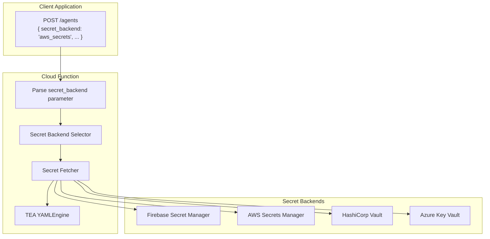

# Runtime Secret Backend Selection for Cloud Functions

**Fabricio Ceolin**

*Independent Researcher*

fabceolin@gmail.com

---

## Abstract

When deploying AI agents to production, organizations often need to manage secrets across multiple environments or secret providers. This article extends the Firebase Cloud Functions deployment pattern to support runtime secret backend selection, allowing clients to specify which secret source (Firebase Secret Manager, AWS Secrets Manager, HashiCorp Vault, etc.) should provide the API credentials for their requests. We present implementation patterns that enable multi-tenant deployments where different customers use different secret backends.

**Keywords:** Firebase Cloud Functions, Secrets Management, AWS Secrets Manager, Multi-Tenant, Runtime Configuration

---

## 1. Introduction

The article "Cloud Production with Firebase" demonstrated how to deploy TEA agents using Firebase Secret Manager. However, enterprise deployments often require:

- **Multi-tenant isolation**: Different customers store secrets in different backends
- **Hybrid cloud**: Some secrets in AWS, others in GCP, others in Azure Key Vault
- **Migration support**: Gradual migration from one secret provider to another
- **Compliance**: Certain data must be stored in specific regions/providers

This article shows how to modify the Cloud Function to accept a `secret_backend` parameter and dynamically fetch secrets from the appropriate source.

## 2. Architecture



The key insight is that the Cloud Function acts as a broker, fetching secrets from the appropriate backend based on the runtime parameter, then injecting them as environment variables for the TEA agent.

## 3. Implementation

### 3.1 Project Structure

```
firebase/functions-agents/
├── main.py                 # Cloud Function with secret backend selection
├── secret_backends.py      # Secret backend implementations
├── requirements.txt
└── agents/
    └── research_agent.yaml # Uses generic ${LLM_*} variables
```

### 3.2 Secret Backend Registry

Create a registry with implementations for each secret provider:

```python
# secret_backends.py - Secret backend implementations

import os
import json
from abc import ABC, abstractmethod
from typing import Optional
from functools import lru_cache

class SecretBackend(ABC):
    """Base class for secret backends."""

    @abstractmethod
    def get_secret(self, secret_name: str) -> Optional[str]:
        """Fetch a secret by name."""
        pass

    def get_llm_secrets(self) -> dict[str, str]:
        """Fetch all LLM-related secrets and return as dict."""
        return {
            "LLM_API_KEY": self.get_secret("LLM_API_KEY") or "",
            "LLM_ENDPOINT": self.get_secret("LLM_ENDPOINT") or "",
            "LLM_DEPLOYMENT": self.get_secret("LLM_DEPLOYMENT") or "",
            "LLM_MODEL": self.get_secret("LLM_MODEL") or "",
            "PERPLEXITY_API_KEY": self.get_secret("PERPLEXITY_API_KEY") or "",
        }


class FirebaseSecretBackend(SecretBackend):
    """
    Firebase Secret Manager backend.
    Secrets are automatically injected as environment variables
    when declared in @https_fn.on_request(secrets=[...])
    """

    def get_secret(self, secret_name: str) -> Optional[str]:
        # Firebase secrets are already in environment variables
        return os.environ.get(secret_name)


class AWSSecretBackend(SecretBackend):
    """
    AWS Secrets Manager backend.
    Requires: pip install boto3
    """

    def __init__(self, region: str = "us-east-1", secret_prefix: str = "tea/"):
        self.region = region
        self.secret_prefix = secret_prefix
        self._client = None

    @property
    def client(self):
        if self._client is None:
            import boto3
            self._client = boto3.client(
                "secretsmanager",
                region_name=self.region
            )
        return self._client

    def get_secret(self, secret_name: str) -> Optional[str]:
        try:
            # AWS secrets can be stored as individual secrets
            # or as a JSON object with multiple keys
            full_name = f"{self.secret_prefix}{secret_name}"
            response = self.client.get_secret_value(SecretId=full_name)
            return response.get("SecretString")
        except Exception as e:
            print(f"AWS secret fetch failed for {secret_name}: {e}")
            return None

    def get_llm_secrets(self) -> dict[str, str]:
        """
        AWS typically stores related secrets as a single JSON secret.
        Example: tea/llm-config = {"api_key": "...", "endpoint": "..."}
        """
        try:
            response = self.client.get_secret_value(
                SecretId=f"{self.secret_prefix}llm-config"
            )
            secret_data = json.loads(response.get("SecretString", "{}"))
            return {
                "LLM_API_KEY": secret_data.get("api_key", ""),
                "LLM_ENDPOINT": secret_data.get("endpoint", ""),
                "LLM_DEPLOYMENT": secret_data.get("deployment", ""),
                "LLM_MODEL": secret_data.get("model", ""),
                "PERPLEXITY_API_KEY": secret_data.get("perplexity_api_key", ""),
            }
        except Exception as e:
            print(f"AWS secret fetch failed: {e}")
            # Fallback to individual secrets
            return super().get_llm_secrets()


class AzureKeyVaultBackend(SecretBackend):
    """
    Azure Key Vault backend.
    Requires: pip install azure-identity azure-keyvault-secrets
    """

    def __init__(self, vault_url: str):
        self.vault_url = vault_url
        self._client = None

    @property
    def client(self):
        if self._client is None:
            from azure.identity import DefaultAzureCredential
            from azure.keyvault.secrets import SecretClient
            credential = DefaultAzureCredential()
            self._client = SecretClient(
                vault_url=self.vault_url,
                credential=credential
            )
        return self._client

    def get_secret(self, secret_name: str) -> Optional[str]:
        try:
            # Azure Key Vault doesn't allow underscores in names
            azure_name = secret_name.replace("_", "-").lower()
            secret = self.client.get_secret(azure_name)
            return secret.value
        except Exception as e:
            print(f"Azure Key Vault fetch failed for {secret_name}: {e}")
            return None


class HashiCorpVaultBackend(SecretBackend):
    """
    HashiCorp Vault backend.
    Requires: pip install hvac
    """

    def __init__(self, vault_addr: str, token: str, mount_point: str = "secret"):
        self.vault_addr = vault_addr
        self.token = token
        self.mount_point = mount_point
        self._client = None

    @property
    def client(self):
        if self._client is None:
            import hvac
            self._client = hvac.Client(url=self.vault_addr, token=self.token)
        return self._client

    def get_secret(self, secret_name: str) -> Optional[str]:
        try:
            response = self.client.secrets.kv.v2.read_secret_version(
                path=f"tea/{secret_name}",
                mount_point=self.mount_point
            )
            return response["data"]["data"].get("value")
        except Exception as e:
            print(f"Vault fetch failed for {secret_name}: {e}")
            return None

    def get_llm_secrets(self) -> dict[str, str]:
        """Vault typically stores secrets at a single path."""
        try:
            response = self.client.secrets.kv.v2.read_secret_version(
                path="tea/llm-config",
                mount_point=self.mount_point
            )
            data = response["data"]["data"]
            return {
                "LLM_API_KEY": data.get("api_key", ""),
                "LLM_ENDPOINT": data.get("endpoint", ""),
                "LLM_DEPLOYMENT": data.get("deployment", ""),
                "LLM_MODEL": data.get("model", ""),
                "PERPLEXITY_API_KEY": data.get("perplexity_api_key", ""),
            }
        except Exception as e:
            print(f"Vault fetch failed: {e}")
            return super().get_llm_secrets()


# Registry of available backends
BACKEND_REGISTRY: dict[str, type[SecretBackend]] = {
    "firebase_secrets": FirebaseSecretBackend,
    "aws_secrets": AWSSecretBackend,
    "azure_keyvault": AzureKeyVaultBackend,
    "hashicorp_vault": HashiCorpVaultBackend,
}


def create_secret_backend(
    backend_name: str,
    config: Optional[dict] = None
) -> SecretBackend:
    """
    Factory function to create a secret backend instance.

    Args:
        backend_name: Name of the backend (firebase_secrets, aws_secrets, etc.)
        config: Backend-specific configuration

    Returns:
        Configured SecretBackend instance
    """
    config = config or {}

    if backend_name not in BACKEND_REGISTRY:
        raise ValueError(
            f"Unknown secret backend: {backend_name}. "
            f"Available: {list(BACKEND_REGISTRY.keys())}"
        )

    backend_class = BACKEND_REGISTRY[backend_name]

    if backend_name == "firebase_secrets":
        return backend_class()

    elif backend_name == "aws_secrets":
        return backend_class(
            region=config.get("region", os.environ.get("AWS_REGION", "us-east-1")),
            secret_prefix=config.get("secret_prefix", "tea/")
        )

    elif backend_name == "azure_keyvault":
        vault_url = config.get("vault_url") or os.environ.get("AZURE_KEYVAULT_URL")
        if not vault_url:
            raise ValueError("Azure Key Vault requires vault_url in config")
        return backend_class(vault_url=vault_url)

    elif backend_name == "hashicorp_vault":
        return backend_class(
            vault_addr=config.get("vault_addr") or os.environ.get("VAULT_ADDR", ""),
            token=config.get("token") or os.environ.get("VAULT_TOKEN", ""),
            mount_point=config.get("mount_point", "secret")
        )

    return backend_class()


def inject_secrets_to_env(secrets: dict[str, str]) -> None:
    """Inject secrets into environment variables for TEA to use."""
    for key, value in secrets.items():
        if value:  # Only set non-empty values
            os.environ[key] = value


def list_available_backends() -> list[str]:
    """Return list of available secret backend names."""
    return list(BACKEND_REGISTRY.keys())
```

### 3.3 Cloud Function with Secret Backend Selection

```python
# main.py - Cloud Function with runtime secret backend selection

import json
import os
from pathlib import Path
from firebase_functions import https_fn, options
import firebase_admin
from firebase_admin import auth

from secret_backends import (
    create_secret_backend,
    inject_secrets_to_env,
    list_available_backends,
)

firebase_admin.initialize_app()

# Firebase secrets are declared here as a baseline/fallback
# Other backends (AWS, Vault, etc.) fetch secrets at runtime
FIREBASE_SECRETS = [
    "LLM_API_KEY",
    "LLM_ENDPOINT",
    "LLM_DEPLOYMENT",
    "LLM_MODEL",
    "PERPLEXITY_API_KEY",
    # AWS credentials for cross-account secret fetching
    "AWS_ACCESS_KEY_ID",
    "AWS_SECRET_ACCESS_KEY",
    # Vault token for HashiCorp Vault
    "VAULT_TOKEN",
]

@https_fn.on_request(
    secrets=FIREBASE_SECRETS,
    memory=options.MemoryOption.MB_512,
    timeout_sec=300,
)
def agents(req: https_fn.Request) -> https_fn.Response:
    """
    Execute a YAML agent with runtime secret backend selection.

    Request body:
    {
        "agent": "research_agent",
        "secret_backend": "aws_secrets",    # Which secret backend to use
        "backend_config": {                  # Optional backend-specific config
            "region": "us-west-2",
            "secret_prefix": "myapp/"
        },
        "input": { ... }
    }
    """
    from the_edge_agent import YAMLEngine

    # Handle CORS preflight
    if req.method == "OPTIONS":
        headers = {
            "Access-Control-Allow-Origin": "*",
            "Access-Control-Allow-Methods": "POST",
            "Access-Control-Allow-Headers": "Content-Type, X-Firebase-Token",
        }
        return https_fn.Response("", 204, headers)

    headers = {"Access-Control-Allow-Origin": "*"}

    # Verify Firebase token
    token = req.headers.get("X-Firebase-Token")
    if not token:
        return https_fn.Response(
            json.dumps({"error": "Authentication required"}),
            401,
            headers
        )

    try:
        user = auth.verify_id_token(token)
    except Exception as e:
        return https_fn.Response(
            json.dumps({"error": "Invalid token", "details": str(e)}),
            401,
            headers
        )

    # Parse request
    try:
        data = req.get_json()
    except Exception:
        return https_fn.Response(
            json.dumps({"error": "Invalid JSON body"}),
            400,
            headers
        )

    agent_name = data.get("agent", "research_agent")
    secret_backend = data.get("secret_backend", "firebase_secrets")
    backend_config = data.get("backend_config", {})
    agent_input = data.get("input", {})

    # Validate secret backend
    available = list_available_backends()
    if secret_backend not in available:
        return https_fn.Response(
            json.dumps({
                "error": f"Unknown secret backend: {secret_backend}",
                "available_backends": available
            }),
            400,
            headers
        )

    # Create secret backend and fetch secrets
    try:
        backend = create_secret_backend(secret_backend, backend_config)
        secrets = backend.get_llm_secrets()
        inject_secrets_to_env(secrets)
    except Exception as e:
        return https_fn.Response(
            json.dumps({
                "error": "Failed to fetch secrets",
                "details": str(e),
                "backend": secret_backend
            }),
            500,
            headers
        )

    # Load and execute agent
    yaml_path = Path(__file__).parent / "agents" / f"{agent_name}.yaml"
    if not yaml_path.exists():
        return https_fn.Response(
            json.dumps({"error": f"Agent not found: {agent_name}"}),
            404,
            headers
        )

    try:
        engine = YAMLEngine()
        graph = engine.load_from_file(str(yaml_path))

        # Execute with user context
        result = None
        for event in graph.stream({
            **agent_input,
            "user_id": user["uid"],
            "secret_backend": secret_backend,
        }):
            if event.get("type") == "final":
                result = event.get("state", {})

        engine.close()

        return https_fn.Response(
            json.dumps({
                "output": result,
                "secret_backend_used": secret_backend,
            }),
            200,
            headers
        )

    except Exception as e:
        return https_fn.Response(
            json.dumps({"error": "Agent execution failed", "details": str(e)}),
            500,
            headers
        )


@https_fn.on_request()
def secret_backends_info(req: https_fn.Request) -> https_fn.Response:
    """List available secret backends (public endpoint, no auth required)."""
    headers = {"Access-Control-Allow-Origin": "*"}

    backends = {
        "firebase_secrets": {
            "description": "Firebase Secret Manager (default)",
            "config_options": []
        },
        "aws_secrets": {
            "description": "AWS Secrets Manager",
            "config_options": ["region", "secret_prefix"]
        },
        "azure_keyvault": {
            "description": "Azure Key Vault",
            "config_options": ["vault_url"]
        },
        "hashicorp_vault": {
            "description": "HashiCorp Vault",
            "config_options": ["vault_addr", "token", "mount_point"]
        },
    }

    return https_fn.Response(
        json.dumps({"secret_backends": backends}),
        200,
        headers
    )
```

### 3.4 Generic YAML Agent

The YAML agent uses generic `${LLM_*}` variables that get populated from any secret backend:

```yaml
# agents/research_agent.yaml
name: research_agent
description: Research agent with runtime secret backend selection

settings:
  llm:
    # These variables are injected by the Cloud Function
    # from whichever secret backend is selected at runtime
    provider: openai
    api_key: "${LLM_API_KEY}"
    endpoint: "${LLM_ENDPOINT}"
    default_model: "${LLM_MODEL}"

  search:
    provider: perplexity
    api_key: "${PERPLEXITY_API_KEY}"

state_schema:
  query: str
  user_id: str
  secret_backend: str
  search_results: list
  synthesis: dict
  output: dict

nodes:
  - name: search_web
    uses: web.search
    with:
      query: "{{ state.query }}"
      max_results: 5
    output: search_results

  - name: synthesize
    uses: llm.call
    with:
      messages:
        - role: system
          content: |
            You are a research assistant. Synthesize a comprehensive
            answer from the provided sources. Cite sources inline.
        - role: user
          content: |
            ## Query
            {{ state.query }}

            ## Sources
            
            [{{ i + 1 }}] {{ result.title }}
            {{ result.snippet }}
            
      temperature: 0.3
    output: synthesis

  - name: format_output
    run: |
      return {
          "output": {
              "answer": state.get("synthesis", {}).get("content", ""),
              "secret_backend": state.get("secret_backend", "unknown"),
          }
      }

edges:
  - from: __start__
    to: search_web
  - from: search_web
    to: synthesize
  - from: synthesize
    to: format_output
  - from: format_output
    to: __end__
```

## 4. Setting Up Secret Backends

### 4.1 AWS Secrets Manager

```bash
# Create the secret in AWS
aws secretsmanager create-secret \
  --name "tea/llm-config" \
  --secret-string '{
    "api_key": "sk-your-openai-key",
    "endpoint": "",
    "deployment": "",
    "model": "gpt-4o-mini",
    "perplexity_api_key": "pplx-your-key"
  }'

# Grant Cloud Function access (via service account)
# Option 1: Use AWS credentials stored in Firebase Secret Manager
firebase functions:secrets:set AWS_ACCESS_KEY_ID
firebase functions:secrets:set AWS_SECRET_ACCESS_KEY

# Option 2: Use Workload Identity Federation (recommended for production)
# See: https://cloud.google.com/iam/docs/workload-identity-federation-with-other-clouds
```

### 4.2 Azure Key Vault

```bash
# Create Key Vault
az keyvault create --name "tea-secrets" --resource-group "mygroup"

# Add secrets (note: Azure doesn't allow underscores)
az keyvault secret set --vault-name "tea-secrets" --name "llm-api-key" --value "sk-your-key"
az keyvault secret set --vault-name "tea-secrets" --name "llm-model" --value "gpt-4o-mini"
az keyvault secret set --vault-name "tea-secrets" --name "perplexity-api-key" --value "pplx-your-key"

# Store vault URL in Firebase
firebase functions:secrets:set AZURE_KEYVAULT_URL
# Value: https://tea-secrets.vault.azure.net/
```

### 4.3 HashiCorp Vault

```bash
# Enable KV secrets engine
vault secrets enable -path=secret kv-v2

# Store secrets
vault kv put secret/tea/llm-config \
  api_key="sk-your-openai-key" \
  model="gpt-4o-mini" \
  perplexity_api_key="pplx-your-key"

# Create a token for the Cloud Function
vault token create -policy=tea-read -ttl=720h

# Store Vault address and token in Firebase
firebase functions:secrets:set VAULT_ADDR
# Value: https://vault.yourcompany.com:8200
firebase functions:secrets:set VAULT_TOKEN
```

## 5. Client Integration

### 5.1 TypeScript Client

```typescript
// lib/agent-client.ts
import { getAuth } from 'firebase/auth';

const AGENTS_URL = process.env.NEXT_PUBLIC_AGENTS_URL;

export type SecretBackend =
  | 'firebase_secrets'
  | 'aws_secrets'
  | 'azure_keyvault'
  | 'hashicorp_vault';

export interface BackendConfig {
  region?: string;           // For AWS
  secret_prefix?: string;    // For AWS
  vault_url?: string;        // For Azure
  vault_addr?: string;       // For HashiCorp
  mount_point?: string;      // For HashiCorp
}

export interface AgentRequest {
  agent: string;
  secret_backend?: SecretBackend;
  backend_config?: BackendConfig;
  input?: Record<string, any>;
}

export async function runAgent<T = any>(
  request: AgentRequest
): Promise<{ output: T; secret_backend_used: string }> {
  const auth = getAuth();
  const user = auth.currentUser;
  if (!user) throw new Error('Authentication required');

  const token = await user.getIdToken();
  const response = await fetch(AGENTS_URL, {
    method: 'POST',
    headers: {
      'Content-Type': 'application/json',
      'X-Firebase-Token': token,
    },
    body: JSON.stringify({
      agent: request.agent,
      secret_backend: request.secret_backend || 'firebase_secrets',
      backend_config: request.backend_config || {},
      input: request.input || {},
    }),
  });

  const data = await response.json();
  if (!response.ok) {
    throw new Error(data.error || 'Agent failed');
  }
  return data;
}
```

### 5.2 Usage Examples

```typescript
// Using Firebase secrets (default)
const result1 = await runAgent({
  agent: 'research_agent',
  input: { query: 'What is TEA?' }
});

// Using AWS Secrets Manager
const result2 = await runAgent({
  agent: 'research_agent',
  secret_backend: 'aws_secrets',
  backend_config: {
    region: 'us-west-2',
    secret_prefix: 'myapp/prod/'
  },
  input: { query: 'What is TEA?' }
});

// Using Azure Key Vault
const result3 = await runAgent({
  agent: 'research_agent',
  secret_backend: 'azure_keyvault',
  backend_config: {
    vault_url: 'https://myapp-secrets.vault.azure.net/'
  },
  input: { query: 'What is TEA?' }
});

// Using HashiCorp Vault
const result4 = await runAgent({
  agent: 'research_agent',
  secret_backend: 'hashicorp_vault',
  backend_config: {
    mount_point: 'kv'
  },
  input: { query: 'What is TEA?' }
});
```

### 5.3 React Component with Backend Selector

```tsx
// components/ResearchAssistant.tsx
import { useState } from 'react';
import { runAgent, SecretBackend } from '../lib/agent-client';

const SECRET_BACKENDS: { value: SecretBackend; label: string }[] = [
  { value: 'firebase_secrets', label: 'Firebase (Default)' },
  { value: 'aws_secrets', label: 'AWS Secrets Manager' },
  { value: 'azure_keyvault', label: 'Azure Key Vault' },
  { value: 'hashicorp_vault', label: 'HashiCorp Vault' },
];

export function ResearchAssistant() {
  const [query, setQuery] = useState('');
  const [secretBackend, setSecretBackend] = useState<SecretBackend>('firebase_secrets');
  const [awsRegion, setAwsRegion] = useState('us-east-1');
  const [loading, setLoading] = useState(false);
  const [result, setResult] = useState<any>(null);
  const [error, setError] = useState<string | null>(null);

  const handleSearch = async () => {
    setLoading(true);
    setError(null);

    try {
      const response = await runAgent({
        agent: 'research_agent',
        secret_backend: secretBackend,
        backend_config: secretBackend === 'aws_secrets'
          ? { region: awsRegion }
          : {},
        input: { query }
      });
      setResult(response);
    } catch (e) {
      setError(e instanceof Error ? e.message : 'Unknown error');
    } finally {
      setLoading(false);
    }
  };

  return (
    <div className="research-assistant">
      <div className="controls">
        <input
          value={query}
          onChange={(e) => setQuery(e.target.value)}
          placeholder="Enter your research question..."
        />

        <select
          value={secretBackend}
          onChange={(e) => setSecretBackend(e.target.value as SecretBackend)}
        >
          {SECRET_BACKENDS.map(b => (
            <option key={b.value} value={b.value}>{b.label}</option>
          ))}
        </select>

        {secretBackend === 'aws_secrets' && (
          <select value={awsRegion} onChange={(e) => setAwsRegion(e.target.value)}>
            <option value="us-east-1">US East (N. Virginia)</option>
            <option value="us-west-2">US West (Oregon)</option>
            <option value="eu-west-1">EU (Ireland)</option>
            <option value="ap-southeast-1">Asia Pacific (Singapore)</option>
          </select>
        )}

        <button onClick={handleSearch} disabled={loading || !query}>
          {loading ? 'Searching...' : 'Search'}
        </button>
      </div>

      {error && <p className="error">{error}</p>}

      {result && (
        <div className="results">
          <p className="backend-info">
            Secrets from: {result.secret_backend_used}
          </p>
          <h3>Answer</h3>
          <p>{result.output?.answer}</p>
        </div>
      )}
    </div>
  );
}
```

## 6. Multi-Tenant Pattern

For multi-tenant applications where each customer has their own secret backend:

```python
# tenant_config.py - Tenant to secret backend mapping

from dataclasses import dataclass
from typing import Optional

@dataclass
class TenantConfig:
    secret_backend: str
    backend_config: dict

# Could be stored in Firestore, Redis, or a config file
TENANT_CONFIGS: dict[str, TenantConfig] = {
    "acme-corp": TenantConfig(
        secret_backend="aws_secrets",
        backend_config={"region": "us-east-1", "secret_prefix": "acme/"}
    ),
    "globex": TenantConfig(
        secret_backend="azure_keyvault",
        backend_config={"vault_url": "https://globex-secrets.vault.azure.net/"}
    ),
    "initech": TenantConfig(
        secret_backend="hashicorp_vault",
        backend_config={"mount_point": "initech"}
    ),
}

def get_tenant_config(tenant_id: str) -> Optional[TenantConfig]:
    return TENANT_CONFIGS.get(tenant_id)
```

Usage in Cloud Function:

```python
# In main.py

from tenant_config import get_tenant_config

# Inside the agents function...
tenant_id = data.get("tenant_id") or user.get("tenant_id")

if tenant_id:
    tenant_config = get_tenant_config(tenant_id)
    if tenant_config:
        secret_backend = tenant_config.secret_backend
        backend_config = tenant_config.backend_config
```

## 7. Dependencies

```text
# requirements.txt

# Firebase
firebase-functions>=0.4.0
firebase-admin>=6.2.0

# TEA
the-edge-agent>=0.8.0

# Optional: AWS Secrets Manager
boto3>=1.34.0

# Optional: Azure Key Vault
azure-identity>=1.15.0
azure-keyvault-secrets>=4.8.0

# Optional: HashiCorp Vault
hvac>=2.1.0
```

## 8. Security Considerations

1. **Credential isolation**: Each secret backend should have minimal permissions - only read access to the specific secrets needed.

2. **Cross-cloud authentication**:
   - For AWS: Use Workload Identity Federation instead of long-lived credentials when possible
   - For Azure: Use Managed Identity
   - For Vault: Use short-lived tokens with limited scope

3. **Audit logging**: Log which secret backend was used for each request:

```python
import logging
logging.info(f"Agent execution: user={user['uid']}, backend={secret_backend}")
```

4. **Input validation**: Always validate the `secret_backend` parameter against a whitelist.

5. **Tenant isolation**: In multi-tenant setups, ensure tenants can only access their own secret backends.

## 9. Conclusion

Runtime secret backend selection enables flexible, multi-cloud, and multi-tenant AI agent deployments. Key takeaways:

1. **Abstract secret fetching** behind a common interface (`SecretBackend`)
2. **Use generic environment variables** (`LLM_*`) in YAML agents
3. **Inject secrets at runtime** based on the request parameter
4. **Store cross-cloud credentials** securely (prefer Workload Identity Federation)
5. **Support tenant-specific backends** for multi-tenant applications

This pattern allows organizations to gradually migrate between secret providers, support customers with different cloud preferences, and maintain compliance with data residency requirements.

## 10. References

- [Cloud Production with Firebase](cloud-production-firebase.md) - Base deployment pattern
- [AWS Secrets Manager](https://aws.amazon.com/secrets-manager/) - AWS secret management
- [Azure Key Vault](https://azure.microsoft.com/services/key-vault/) - Azure secret management
- [HashiCorp Vault](https://www.vaultproject.io/) - Multi-cloud secret management
- [Workload Identity Federation](https://cloud.google.com/iam/docs/workload-identity-federation) - Cross-cloud authentication
