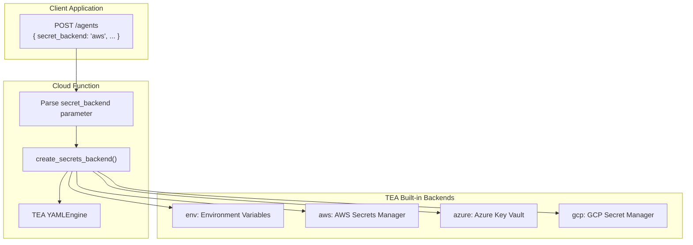

# Runtime Secret Backend Selection for Cloud Functions

**Fabricio Ceolin**

*Independent Researcher*

https://www.linkedin.com/in/fabceolin/

---

## Abstract

When deploying AI agents to production, organizations often need to manage secrets across multiple environments or providers. This article shows how to enable runtime secret backend selection in Firebase Cloud Functions, allowing clients to specify which secret source (environment variables, AWS Secrets Manager, Azure Key Vault, or GCP Secret Manager) should provide the API credentials for their requests. TEA provides built-in backends for all major cloud providers, making this pattern straightforward to implement.

**Keywords:** Firebase Cloud Functions, Secrets Management, Multi-Tenant, Runtime Configuration

---

## 1. Introduction

TEA includes built-in secret backends for:

| Backend | Description | Install |
|---------|-------------|---------|
| `env` | Environment variables (default) | Built-in |
| `aws` | AWS Secrets Manager | `pip install the-edge-agent[aws]` |
| `azure` | Azure Key Vault | `pip install the-edge-agent[azure]` |
| `gcp` | Google Cloud Secret Manager | `pip install the-edge-agent[gcp]` |

While YAML agents typically use static secret configuration, enterprise deployments often need:

- **Multi-tenant isolation**: Different customers use different secret backends
- **Hybrid cloud**: Some secrets in AWS, others in GCP or Azure
- **Migration support**: Gradual migration from one provider to another

This article shows how to accept a `secret_backend` parameter at runtime and dynamically configure TEA to fetch secrets from the appropriate source.

## 2. Architecture



## 3. Implementation

### 3.1 Project Structure

```
firebase/functions-agents/
├── main.py                 # Cloud Function with runtime selection
├── requirements.txt
└── agents/
    └── research_agent.yaml
```

### 3.2 Cloud Function

```python
# main.py - Cloud Function with runtime secret backend selection

import json
import os
from pathlib import Path
from firebase_functions import https_fn, options
import firebase_admin
from firebase_admin import auth

from the_edge_agent import YAMLEngine
from the_edge_agent.secrets import create_secrets_backend, get_registered_backends

firebase_admin.initialize_app()

# Backend-specific configuration templates
BACKEND_CONFIGS = {
    "env": lambda cfg: {"prefix": cfg.get("prefix", "")},
    "aws": lambda cfg: {
        "region": cfg.get("region", os.environ.get("AWS_REGION", "us-east-1")),
        "secret_name": cfg.get("secret_name"),
        "secret_prefix": cfg.get("secret_prefix"),
    },
    "azure": lambda cfg: {
        "vault_url": cfg.get("vault_url") or os.environ.get("AZURE_KEYVAULT_URL"),
    },
    "gcp": lambda cfg: {
        "project_id": cfg.get("project_id") or os.environ.get("GCP_PROJECT_ID"),
        "secret_prefix": cfg.get("secret_prefix"),
    },
}


def build_backend_kwargs(backend_type: str, config: dict) -> dict:
    """Build kwargs for create_secrets_backend from request config."""
    builder = BACKEND_CONFIGS.get(backend_type)
    if not builder:
        return {}
    kwargs = builder(config)
    # Remove None values
    return {k: v for k, v in kwargs.items() if v is not None}


@https_fn.on_request(
    memory=options.MemoryOption.MB_512,
    timeout_sec=300,
)
def agents(req: https_fn.Request) -> https_fn.Response:
    """
    Execute a YAML agent with runtime secret backend selection.

    Request body:
    {
        "agent": "research_agent",
        "secret_backend": "aws",
        "backend_config": {
            "region": "us-west-2",
            "secret_name": "myapp/llm-secrets"
        },
        "input": { ... }
    }
    """
    # Handle CORS preflight
    if req.method == "OPTIONS":
        headers = {
            "Access-Control-Allow-Origin": "*",
            "Access-Control-Allow-Methods": "POST",
            "Access-Control-Allow-Headers": "Content-Type, X-Firebase-Token",
        }
        return https_fn.Response("", 204, headers)

    headers = {"Access-Control-Allow-Origin": "*"}

    # Verify Firebase token
    token = req.headers.get("X-Firebase-Token")
    if not token:
        return https_fn.Response(
            json.dumps({"error": "Authentication required"}),
            401,
            headers
        )

    try:
        user = auth.verify_id_token(token)
    except Exception as e:
        return https_fn.Response(
            json.dumps({"error": "Invalid token", "details": str(e)}),
            401,
            headers
        )

    # Parse request
    try:
        data = req.get_json()
    except Exception:
        return https_fn.Response(
            json.dumps({"error": "Invalid JSON body"}),
            400,
            headers
        )

    agent_name = data.get("agent", "research_agent")
    secret_backend = data.get("secret_backend", "env")
    backend_config = data.get("backend_config", {})
    agent_input = data.get("input", {})

    # Validate secret backend
    available = get_registered_backends()
    if secret_backend not in available:
        return https_fn.Response(
            json.dumps({
                "error": f"Unknown secret backend: {secret_backend}",
                "available_backends": available
            }),
            400,
            headers
        )

    # Create secrets backend using TEA's built-in factory
    try:
        kwargs = build_backend_kwargs(secret_backend, backend_config)
        secrets = create_secrets_backend(secret_backend, **kwargs)
    except ImportError as e:
        return https_fn.Response(
            json.dumps({
                "error": f"Backend '{secret_backend}' dependencies not installed",
                "details": str(e)
            }),
            500,
            headers
        )
    except Exception as e:
        return https_fn.Response(
            json.dumps({
                "error": "Failed to create secrets backend",
                "details": str(e),
                "backend": secret_backend
            }),
            500,
            headers
        )

    # Load and execute agent
    yaml_path = Path(__file__).parent / "agents" / f"{agent_name}.yaml"
    if not yaml_path.exists():
        return https_fn.Response(
            json.dumps({"error": f"Agent not found: {agent_name}"}),
            404,
            headers
        )

    try:
        # Create engine and inject runtime-selected secrets backend
        engine = YAMLEngine()
        engine._secrets_backend = secrets
        engine.secrets = secrets.get_all()
        graph = engine.load_from_file(str(yaml_path))

        # Execute with user context
        result = None
        for event in graph.stream({
            **agent_input,
            "user_id": user["uid"],
            "secret_backend": secret_backend,
        }):
            if event.get("type") == "final":
                result = event.get("state", {})

        engine.close()

        return https_fn.Response(
            json.dumps({
                "output": result,
                "secret_backend_used": secret_backend,
            }),
            200,
            headers
        )

    except Exception as e:
        return https_fn.Response(
            json.dumps({"error": "Agent execution failed", "details": str(e)}),
            500,
            headers
        )


@https_fn.on_request()
def secret_backends_info(req: https_fn.Request) -> https_fn.Response:
    """List available secret backends."""
    headers = {"Access-Control-Allow-Origin": "*"}

    backends = {
        "env": {
            "description": "Environment variables",
            "config_options": ["prefix"]
        },
        "aws": {
            "description": "AWS Secrets Manager",
            "config_options": ["region", "secret_name", "secret_prefix"]
        },
        "azure": {
            "description": "Azure Key Vault",
            "config_options": ["vault_url"]
        },
        "gcp": {
            "description": "Google Cloud Secret Manager",
            "config_options": ["project_id", "secret_prefix"]
        },
    }

    return https_fn.Response(
        json.dumps({"secret_backends": backends}),
        200,
        headers
    )
```

### 3.3 YAML Agent

The agent uses `{{ secrets.KEY }}` syntax - TEA injects secrets from whichever backend was selected at runtime:

```yaml
# agents/research_agent.yaml
name: research_agent
description: Research agent with runtime secret backend selection

state_schema:
  query: str
  user_id: str
  secret_backend: str
  search_results: list
  synthesis: dict
  output: dict

nodes:
  - name: search_web
    uses: web.search
    with:
      query: "{{ state.query }}"
      api_key: "{{ secrets.PERPLEXITY_API_KEY }}"
      max_results: 5
    output: search_results

  - name: synthesize
    uses: llm.call
    with:
      provider: openai
      api_key: "{{ secrets.LLM_API_KEY }}"
      model: "{{ secrets.LLM_MODEL | default('gpt-4o-mini') }}"
      messages:
        - role: system
          content: Synthesize a comprehensive answer from the sources.
        - role: user
          content: |
            ## Query
            {{ state.query }}

            ## Sources
            
            - {{ result.title }}: {{ result.snippet }}
            
    output: synthesis

  - name: format_output
    run: |
      return {
          "output": {
              "answer": state.get("synthesis", {}).get("content", ""),
              "secret_backend": state.get("secret_backend", "unknown"),
          }
      }

edges:
  - from: __start__
    to: search_web
  - from: search_web
    to: synthesize
  - from: synthesize
    to: format_output
  - from: format_output
    to: __end__
```

### 3.4 Dependencies

```text
# requirements.txt

firebase-functions>=0.4.0
firebase-admin>=6.2.0
the-edge-agent[aws,azure,gcp]>=0.9.0
```

## 4. Setting Up Secret Backends

### 4.1 Environment Variables (Default)

No setup required. Set environment variables in Firebase:

```bash
firebase functions:config:set llm.api_key="sk-your-key"
```

Or use Firebase Secret Manager for sensitive values.

### 4.2 AWS Secrets Manager

```bash
# Create the secret
aws secretsmanager create-secret \
  --name "myapp/llm-secrets" \
  --secret-string '{
    "LLM_API_KEY": "sk-your-openai-key",
    "LLM_MODEL": "gpt-4o-mini",
    "PERPLEXITY_API_KEY": "pplx-your-key"
  }'
```

TEA's AWS backend uses boto3's default credential chain. For Cloud Functions, use Workload Identity Federation or store AWS credentials in Firebase secrets.

### 4.3 Azure Key Vault

```bash
az keyvault create --name "myapp-secrets" --resource-group "mygroup"
az keyvault secret set --vault-name "myapp-secrets" --name "LLM-API-KEY" --value "sk-your-key"
```

TEA's Azure backend uses `DefaultAzureCredential` which supports managed identity, environment variables, and Azure CLI credentials.

### 4.4 GCP Secret Manager

```bash
echo -n "sk-your-key" | gcloud secrets create LLM_API_KEY --data-file=-
```

TEA's GCP backend uses Application Default Credentials. In Cloud Functions, this works automatically with the function's service account.

## 5. Client Usage

### 5.1 TypeScript Client

```typescript
type SecretBackend = 'env' | 'aws' | 'azure' | 'gcp';

interface AgentRequest {
  agent: string;
  secret_backend?: SecretBackend;
  backend_config?: Record<string, string>;
  input?: Record<string, any>;
}

async function runAgent(request: AgentRequest) {
  const token = await getAuth().currentUser?.getIdToken();
  const response = await fetch(AGENTS_URL, {
    method: 'POST',
    headers: {
      'Content-Type': 'application/json',
      'X-Firebase-Token': token!,
    },
    body: JSON.stringify({
      agent: request.agent,
      secret_backend: request.secret_backend || 'env',
      backend_config: request.backend_config || {},
      input: request.input || {},
    }),
  });
  return response.json();
}

// Examples
await runAgent({
  agent: 'research_agent',
  secret_backend: 'aws',
  backend_config: { region: 'us-west-2', secret_name: 'myapp/llm-secrets' },
  input: { query: 'What is TEA?' }
});

await runAgent({
  agent: 'research_agent',
  secret_backend: 'gcp',
  backend_config: { project_id: 'my-project' },
  input: { query: 'What is TEA?' }
});
```

## 6. Multi-Tenant Pattern

For multi-tenant applications where each tenant uses a different backend:

```python
# In main.py - lookup tenant config from Firestore
from google.cloud import firestore

db = firestore.Client()

def get_tenant_secrets_config(tenant_id: str) -> tuple[str, dict]:
    """Get tenant's secret backend configuration."""
    doc = db.collection("tenants").document(tenant_id).get()
    if not doc.exists:
        return "env", {}

    data = doc.to_dict()
    return data.get("secret_backend", "env"), data.get("backend_config", {})

# Usage in agents function:
tenant_id = data.get("tenant_id") or user.get("tenant_id")
if tenant_id:
    secret_backend, backend_config = get_tenant_secrets_config(tenant_id)
```

## 7. Conclusion

TEA's built-in secret backends make runtime selection straightforward:

1. Use `create_secrets_backend(backend_type, **kwargs)` to create any backend
2. Inject it into the engine: `engine._secrets_backend = backend; engine.secrets = backend.get_all()`
3. Access secrets in YAML via `{{ secrets.KEY }}`

This enables multi-tenant deployments where different customers use different cloud providers without any custom backend code.

## 8. References

- [TEA Secrets Module](https://github.com/fabceolin/the_edge_agent) - Built-in backends documentation
- [AWS Secrets Manager](https://aws.amazon.com/secrets-manager/)
- [Azure Key Vault](https://azure.microsoft.com/services/key-vault/)
- [GCP Secret Manager](https://cloud.google.com/secret-manager)
