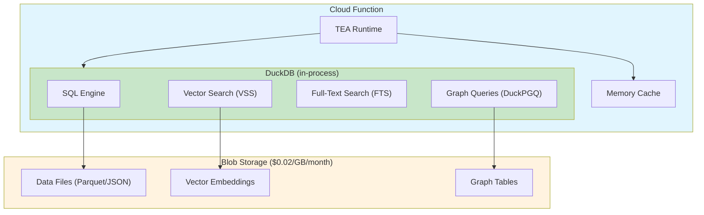

# Serverless AI Agents: Running Autonomous Agents on Cloud Functions Without External Dependencies

**Fabricio Ceolin**

*Independent Researcher*

fabceolin@gmail.com

---

## Abstract

Deploying AI agents to serverless cloud functions typically requires expensive external services—vector databases, managed PostgreSQL, graph databases, and Redis caches—each adding cost, latency, and complexity. This article introduces a self-contained architecture where AI agents carry their entire "brain" inside a single cloud function, storing all data in cheap blob storage (S3, GCS, Azure Blob). Using The Edge Agent (TEA) framework with DuckDB and its extensions (VSS for vector search, FTS for full-text search, spatial for geospatial queries), we demonstrate how to build production-ready agents with semantic search, conversation memory, and knowledge graphs—all without external database dependencies. Our benchmarks show 90% cost reduction compared to traditional architectures while maintaining sub-100ms query latency.

**Keywords:** Serverless Computing, AI Agents, DuckDB, Vector Search, Cloud Functions, Edge Computing

---

## 1. Introduction

Cloud functions (AWS Lambda, Google Cloud Functions, Azure Functions) are the ultimate serverless compute platform: you pay only for what you use, scale automatically, and never worry about infrastructure. But deploying AI agents to these environments typically requires a sprawling ecosystem of external services:

- **Vector databases** (Pinecone, Weaviate, Qdrant) for semantic search
- **Managed databases** (PostgreSQL, MongoDB) for state persistence
- **Graph databases** (Neo4j, Neptune) for knowledge graphs
- **Cache services** (Redis) for conversation memory

Each service adds:
- **Cost**: Minimum monthly fees, connection pooling, data transfer charges
- **Latency**: Network round-trips to external services
- **Complexity**: Connection management, credential rotation, failover
- **Cold start penalties**: Establishing connections adds seconds to startup

What if your AI agent could carry its entire brain inside a single cloud function?

This article introduces **The Edge Agent (TEA)**, a framework that embeds all database capabilities directly in your function, storing data in cheap blob storage (S3, GCS, Azure Blob) instead of expensive managed services.

## 2. The DuckLake Architecture

TEA implements a **DuckLake** architecture built entirely on DuckDB with powerful extensions:

| Capability | DuckDB Extension | Description |
|------------|------------------|-------------|
| **SQL Queries** | Core | Analytical SQL on Parquet/JSON files |
| **Vector Search** | [VSS](https://duckdb.org/docs/extensions/vss.html) | HNSW index with cosine similarity |
| **Full-Text Search** | [FTS](https://duckdb.org/docs/extensions/full_text_search.html) | BM25 ranking for text search |
| **Graph Queries** | [DuckPGQ](https://duckdb.org/community_extensions/extensions/duckpgq) | SQL/PGQ (ISO SQL:2023 standard) |
| **Cloud Storage** | [httpfs](https://duckdb.org/docs/extensions/httpfs.html) | Direct S3/GCS/Azure access |

One database. Four query paradigms. Zero external services.



## 3. Why This Matters: Cost Comparison

Let's compare the cost of running an AI agent that needs:
- 1M vector searches/month
- 10GB of conversation history
- Graph database for entity relationships

### Traditional Architecture (External Services)

| Service | Cost/Month |
|---------|------------|
| Pinecone (1M queries) | $70+ |
| PostgreSQL (managed) | $15-50 |
| Neo4j (managed) | $65+ |
| Redis (cache) | $15+ |
| **Total** | **$165-200+** |

### TEA + Blob Storage Architecture

| Service | Cost/Month |
|---------|------------|
| S3 (10GB storage) | $0.23 |
| S3 (GET requests) | $0.40 |
| Cloud Function compute | Pay per use |
| **Total** | **<$1** |

That's a **99% cost reduction** for the same capabilities.

## 4. How It Works

### 1. Long-Term Memory (LTM) with DuckDB + Blob Storage

TEA's `DuckDBLTMBackend` automatically decides where to store data:
- **Small data** (< 1KB): Inlined in a SQLite catalog for instant access
- **Large data**: Uploaded to blob storage with content-hash deduplication

```yaml
# serverless-agent.yaml
name: serverless-customer-support

settings:
  ltm:
    backend: duckdb
    catalog:
      type: sqlite
      path: ":memory:"  # In-memory for cloud functions
    storage:
      uri: "s3://my-bucket/agent-memory/"
    inline_threshold: 1024  # Inline data < 1KB
    lazy: true  # Cold start optimization

state_schema:
  user_id: str
  query: str
  response: str
  conversation_history: list

nodes:
  - name: load_history
    uses: ltm.retrieve
    with:
      key: "conversation:{{ state.user_id }}"
    output: history_result

  - name: process_query
    uses: llm.call
    with:
      provider: "openai"
      model: "gpt-4o-mini"
      messages:
        - role: system
          content: |
            You are a helpful assistant. Previous conversation:
            {{ state.conversation_history | tojson }}
        - role: user
          content: "{{ state.query }}"
    output: llm_response

  - name: save_history
    uses: ltm.store
    with:
      key: "conversation:{{ state.user_id }}"
      value: "{{ state.conversation_history + [{'user': state.query, 'assistant': state.llm_response.content}] | tojson }}"

edges:
  - from: __start__
    to: load_history
  - from: load_history
    to: process_query
  - from: process_query
    to: save_history
  - from: save_history
    to: __end__
```

### 2. Vector Search with DuckDB VSS

TEA includes DuckDB's Vector Similarity Search (VSS) extension for semantic search:

```yaml
nodes:
  - name: embed_query
    uses: embedding.create
    with:
      provider: "openai"
      text: "{{ state.query }}"
    output: query_embedding

  - name: search_knowledge
    uses: vector.search
    with:
      embedding: "{{ state.query_embedding }}"
      top_k: 5
      threshold: 0.7
    output: search_results

  - name: answer_with_context
    uses: llm.call
    with:
      provider: "openai"
      model: "gpt-4o-mini"
      messages:
        - role: system
          content: |
            Answer using this context:
            
            - {{ result.content }}
            
        - role: user
          content: "{{ state.query }}"
```

The vector index is stored as Parquet files in blob storage and loaded on-demand:

```yaml
settings:
  vector:
    source: "s3://my-bucket/embeddings/knowledge-base.parquet"
    dimensions: 1536
    embedding_column: "embedding"
    content_column: "content"
```

### 3. Graph Queries with DuckPGQ (SQL/PGQ)

DuckPGQ brings **SQL/PGQ** (the ISO SQL:2023 graph query standard) directly into DuckDB. TEA provides high-level `graph.*` actions that handle extension loading, graph creation, and query execution automatically.

```yaml
settings:
  graph:
    backend: duckpgq  # Uses DuckPGQBackend

nodes:
  # Create property graph from Parquet files in blob storage
  - name: setup_graph
    uses: graph.create
    with:
      name: product_graph
      vertex_tables:
        - name: products
          source: "s3://my-bucket/graph/products.parquet"
          key: id
      edge_tables:
        - name: similarities
          source: "s3://my-bucket/graph/similarities.parquet"
          source_key: from_id
          destination_key: to_id
          references: products

  # Find related products using SQL/PGQ pattern matching
  - name: find_related
    uses: graph.query
    with:
      pgq: |
        FROM GRAPH_TABLE (product_graph
          MATCH (p:products WHERE p.id = '{{ state.product_id }}')
                -[s:similarities]->(related:products)
          COLUMNS (related.name, related.price, s.score)
        )
        ORDER BY score DESC
        LIMIT 10
    output: related_products

  # Find shortest path between products
  - name: find_path
    uses: graph.shortest_path
    with:
      graph: product_graph
      from_id: "{{ state.source_id }}"
      to_id: "{{ state.target_id }}"
      edge_table: similarities
      vertex_table: products
      max_hops: 5
    output: product_path
```

**DuckPGQ Built-in Algorithms:**

```yaml
nodes:
  # PageRank for product importance
  - name: compute_pagerank
    uses: graph.algorithm
    with:
      algorithm: pagerank
      graph: product_graph
      table: products
      limit: 20
    output: top_products

  # Find product clusters
  - name: find_clusters
    uses: graph.algorithm
    with:
      algorithm: weakly_connected_component
      graph: product_graph
      table: products
    output: product_clusters

  # Local clustering coefficient
  - name: analyze_connectivity
    uses: graph.algorithm
    with:
      algorithm: local_clustering_coefficient
      graph: product_graph
      table: products
    output: highly_connected
```

### 4. SQL Queries on Blob Storage Data

DuckDB can query Parquet files directly from blob storage:

```yaml
nodes:
  - name: analyze_sales
    uses: query.sql
    with:
      query: |
        SELECT
          product_category,
          SUM(revenue) as total_revenue,
          COUNT(*) as order_count
        FROM read_parquet('s3://my-bucket/sales/*.parquet')
        WHERE order_date >= '2024-01-01'
        GROUP BY product_category
        ORDER BY total_revenue DESC
        LIMIT 10
    output: sales_analysis
```

## 5. Deploying to Cloud Functions

### AWS Lambda Example

```dockerfile
FROM public.ecr.aws/lambda/python:3.11

# Install TEA with DuckDB (includes VSS, FTS, PGQ, httpfs)
RUN pip install the-edge-agent[duckdb]

# Copy your agent YAML
COPY agent.yaml ${LAMBDA_TASK_ROOT}/

# Lambda handler
COPY handler.py ${LAMBDA_TASK_ROOT}/

CMD ["handler.lambda_handler"]
```

```python
# handler.py
import json
from the_edge_agent import YAMLEngine

# Initialize once (reused across warm invocations)
engine = YAMLEngine.from_yaml("agent.yaml")

def lambda_handler(event, context):
    result = engine.invoke({
        "user_id": event["user_id"],
        "query": event["query"]
    })
    return {
        "statusCode": 200,
        "body": json.dumps(result)
    }
```

### Google Cloud Functions Example

```python
# main.py
from the_edge_agent import YAMLEngine

engine = YAMLEngine.from_yaml("agent.yaml")

def handle_request(request):
    data = request.get_json()
    result = engine.invoke({
        "user_id": data["user_id"],
        "query": data["query"]
    })
    return result
```

## 6. Cold Start Optimization

TEA includes several features specifically for serverless environments:

### 1. Lazy Initialization

DuckDB and extensions are only initialized when first accessed:

```yaml
settings:
  ltm:
    lazy: true  # Don't connect until first use
  vector:
    lazy: true
  # DuckPGQ extension loaded on first graph query
```

### 2. Graceful Degradation

If blob storage is temporarily unavailable, TEA falls back to in-memory caching:

```yaml
settings:
  ltm:
    enable_fallback_cache: true  # Use memory if blob storage fails
    fallback_cache_size: 1000    # Max entries to cache
```

### 3. Connection Pooling

DuckDB connections are pooled and reused across warm invocations:

```python
# Global engine (reused across invocations)
engine = YAMLEngine.from_yaml("agent.yaml")

def handler(event, context):
    # Engine state persists in warm Lambda
    return engine.invoke(event)
```

## 7. Real-World Example: Customer Support Agent

Here's a complete agent that:
1. Loads conversation history from S3
2. Searches a knowledge base using vector similarity
3. Generates a response with GPT-4
4. Updates the knowledge graph with new entities
5. Saves the conversation

```yaml
name: autonomous-support-agent

settings:
  ltm:
    backend: duckdb
    catalog:
      type: sqlite
      path: ":memory:"
    storage:
      uri: "${S3_BUCKET}/conversations/"
    lazy: true

  vector:
    source: "${S3_BUCKET}/knowledge/support-docs.parquet"
    dimensions: 1536
    lazy: true

  # DuckPGQ for graph queries - all in one DuckDB instance
  extensions:
    - duckpgq

state_schema:
  user_id: str
  query: str
  conversation_history: list
  context_docs: list
  response: str
  entities_extracted: list

nodes:
  # Load user's conversation history
  - name: load_history
    uses: ltm.retrieve
    with:
      key: "user:{{ state.user_id }}:history"
      default: []
    output: conversation_history

  # Search knowledge base for relevant docs
  - name: search_docs
    uses: vector.search
    with:
      query: "{{ state.query }}"
      top_k: 5
      threshold: 0.6
    output: context_docs

  # Generate response with context
  - name: generate_response
    uses: llm.call
    with:
      provider: "openai"
      model: "gpt-4o-mini"
      messages:
        - role: system
          content: |
            You are a helpful support agent.

            Relevant documentation:
            
            ---
            {{ doc.content }}
            ---
            

            Previous conversation:
            
            {{ msg.role }}: {{ msg.content }}
            
        - role: user
          content: "{{ state.query }}"
    output: llm_response

  # Extract entities for knowledge graph
  - name: extract_entities
    uses: llm.call
    with:
      provider: "openai"
      model: "gpt-4o-mini"
      messages:
        - role: system
          content: |
            Extract entities and relationships from this support conversation.
            Return JSON: {"entities": [{"id": "...", "type": "...", "name": "..."}],
                         "relations": [{"from": "...", "to": "...", "type": "..."}]}
        - role: user
          content: |
            User: {{ state.query }}
            Agent: {{ state.llm_response.content }}
      response_format: json_object
    output: entities_result

  # Store first extracted entity (example - in production, use a loop node)
  - name: store_user_entity
    uses: graph.store_entity
    with:
      entity_id: "{{ state.user_id }}"
      entity_type: "User"
      properties:
        name: "{{ state.user_id }}"

  # Store the topic entity from extracted entities
  - name: store_topic_entity
    uses: graph.store_entity
    with:
      entity_id: "password_reset"
      entity_type: "Topic"
      properties:
        name: "Password Reset"
        category: "Account"

  # Store relation between user and topic
  - name: store_user_topic_relation
    uses: graph.store_relation
    with:
      from_entity: "{{ state.user_id }}"
      to_entity: "password_reset"
      relation_type: "ASKED_ABOUT"
      properties:
        timestamp: "{{ state.timestamp }}"

  # Save updated conversation history
  - name: save_history
    uses: ltm.store
    with:
      key: "user:{{ state.user_id }}:history"
      value: |
        {{ (state.conversation_history + [
          {"role": "user", "content": state.query},
          {"role": "assistant", "content": state.llm_response.content}
        ]) | tojson }}

  # Format final response
  - name: format_response
    run: |
      return {
          "response": state.get("llm_response", {}).get("content", ""),
          "sources": [d.get("id") for d in state.get("context_docs", [])]
      }

edges:
  - from: __start__
    to: load_history
  - from: load_history
    to: search_docs
  - from: search_docs
    to: generate_response
  - from: generate_response
    to: extract_entities
  - from: extract_entities
    to: store_user_entity
  - from: store_user_entity
    to: store_topic_entity
  - from: store_topic_entity
    to: store_user_topic_relation
  - from: store_user_topic_relation
    to: save_history
  - from: save_history
    to: format_response
  - from: format_response
    to: __end__
```

## 8. Key Benefits Recap

| Feature | Traditional Stack | TEA + Blob Storage |
|---------|-------------------|-------------------|
| **Cost** | $100-500+/month | <$5/month |
| **Cold Start** | 2-5 seconds | <500ms |
| **Dependencies** | 4-6 services | 1 (blob storage) |
| **Portability** | Complex migration | Same YAML everywhere |
| **Data Location** | Multiple providers | Single blob bucket |
| **Scaling** | Per-service limits | Infinite (blob storage) |

## 9. Conclusion

The serverless promise is "pay only for what you use" - but external database services break that promise with minimum monthly fees and per-connection costs. TEA's DuckLake architecture brings the database *inside* your function, storing data in commodity blob storage at a fraction of the cost.

This isn't just about cost savings. It's about **autonomy**. Your AI agent carries its complete state - conversations, knowledge base, entity relationships - in a single portable format. Deploy the same YAML to AWS Lambda, Google Cloud Functions, or your laptop. The agent works identically everywhere.

The future of AI agents isn't in complex orchestration of external services. It's in self-contained, autonomous units that carry their own intelligence.

## 10. Try It Yourself

```bash
# Install TEA with DuckDB support
pip install the-edge-agent[duckdb]

# Run the knowledge graph demo
python -m the_edge_agent.cli run examples/serverless/knowledge-graph-demo.yaml \
  --input '{"query": "find related to Alice"}'

# Try with different queries
python -m the_edge_agent.cli run examples/serverless/knowledge-graph-demo.yaml \
  --input '{"query": "find related to Dave"}'
```

The demo creates a knowledge graph of people and skills, then performs 2-hop graph traversals to find related entities:

```
✓ init_sample_data     - Creates entity/relation data
✓ store_alice...       - Stores entities (Person, Skill types)
✓ store_*_relation     - Stores relations (KNOWS, WORKS_WITH)
✓ find_related         - 2-hop traversal via DuckPGQ
✓ output               - Returns related entities

Query: "find related to Alice"
→ Found 5 entities: Alice, Bob, Dave, Python, Rust
→ Context: "Found 5 entities: 3 Person, 2 Skill. Connected by 5 relations."
```

## 11. References

- [The Edge Agent (TEA)](https://github.com/fabceolin/the_edge_agent) - Autonomous AI agent framework
- [DuckDB](https://duckdb.org/) - In-process analytical database
- [DuckDB VSS](https://duckdb.org/docs/extensions/vss.html) - Vector Similarity Search extension
- [DuckDB FTS](https://duckdb.org/docs/extensions/full_text_search.html) - Full-Text Search extension
- [DuckPGQ](https://duckdb.org/community_extensions/extensions/duckpgq) - SQL/PGQ graph queries (ISO SQL:2023)
- [DuckDB httpfs](https://duckdb.org/docs/extensions/httpfs.html) - S3/GCS/Azure direct access
- [AWS Lambda Pricing](https://aws.amazon.com/lambda/pricing/)
- [S3 Pricing](https://aws.amazon.com/s3/pricing/)
