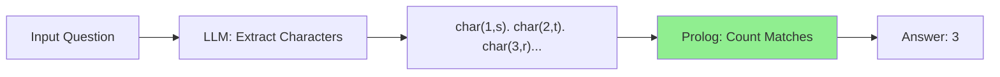

# How Many R's in Strawberry? Solving the LLM Counting Problem with Neurosymbolic AI

## Introduction

"How many R's are in the word strawberry?"

This simple question has become the internet's favorite way to expose the limitations of Large Language Models. Despite their impressive capabilities in reasoning, coding, and conversation, LLMs consistently fail at this elementary character-counting task — often answering "2" or even "10" when the correct answer is **3**.

This article demonstrates how **neurosymbolic AI** solves this problem by combining the natural language understanding of LLMs with the precise symbolic computation of Prolog. Using The Edge Agent (TEA), we'll build an agent that:

1. Uses an LLM to parse the question and extract the word as individual characters
2. Uses Prolog to count character occurrences with mathematical certainty

## The Problem: Why Can't LLMs Count Letters?

Let's test this with a small LLM (llama3.2:1b):

```
Q: How many times does the letter "r" appear in "strawberry"?

llama3.2:1b: "10" ❌
Correct:     "3"  ✓
```

The word "strawberry" contains: **s-t-r-a-w-b-e-r-r-y**

The letter "r" appears at positions 3, 8, and 9 — that's **three times**.

Why do LLMs get this wrong? Because they don't process text character-by-character. Instead, they use **tokenization**, which groups characters into subword units:

```
"strawberry" → ["straw", "berry"]  (typical tokenization)
```

The model never "sees" individual letters — it sees tokens. Asking an LLM to count characters is like asking someone to count individual bricks in a photograph of a wall: they can estimate, but they can't reliably count.

## The Neurosymbolic Solution

Our approach separates the task into what each system does best:

| Component | Strength | Task |
|-----------|----------|------|
| **LLM** | Language understanding | Parse the question, extract word as character list |
| **Prolog** | Symbolic computation | Count exact character occurrences |



## Prerequisites

### Install Ollama and Model

```bash
# Install Ollama
curl -fsSL https://ollama.com/install.sh | sh

# Start server and pull model
ollama serve &
ollama pull llama3.2:1b
```

### Install The Edge Agent

```bash
# Download AppImage (includes Prolog)
wget https://github.com/fabceolin/the_edge_agent/releases/latest/download/tea-0.8.17-x86_64.AppImage -O tea
chmod +x tea
```

## The Agents

### Agent 1: LLM-Only Approach

First, let's see how an LLM-only solution fails:

```yaml
# examples/strawberry/count-llm-nothink.yaml
name: count-letters-llm-nothink

state_schema:
  word: str
  letter: str
  answer: str

nodes:
  - name: count
    uses: llm.call
    with:
      provider: "ollama"
      model: "llama3.2:1b"
      messages:
        - role: user
          content: |
            How many times does the letter "{{ state.letter }}" appear in the word "{{ state.word }}"?
            Answer with just the number.
    output: llm_response

  - name: format
    run: |
      llm_resp = state.get("llm_response", {})
      if isinstance(llm_resp, dict):
          content = llm_resp.get("content", "unknown")
      else:
          content = str(llm_resp)
      return {
          "answer": f"The letter '{state['letter']}' appears {content.strip()} time(s) in '{state['word']}'"
      }

edges:
  - from: __start__
    to: count
  - from: count
    to: format
  - from: format
    to: __end__
```

### Agent 2: Neurosymbolic Approach

Now the neurosymbolic solution that actually works:

```yaml
# examples/strawberry/count-neurosymbolic.yaml
name: count-letters-neurosymbolic

state_schema:
  word: str
  letter: str
  characters: str
  count: int
  positions: list
  answer: str

nodes:
  # Step 1: LLM extracts characters as Prolog facts
  - name: extract_chars
    uses: llm.call
    with:
      provider: "ollama"
      model: "llama3.2:1b"
      messages:
        - role: system
          content: |
            Convert a word into Prolog character facts.
            Format: char(Position, Letter).
            Positions start at 1. Letters must be lowercase atoms.

            Example for "hello":
            char(1, h). char(2, e). char(3, l). char(4, l). char(5, o).

            Output ONLY the facts, one per line, no other text.
        - role: user
          content: |
            Convert "{{ state.word }}" to character facts.
    output: llm_response

  # Step 1.5: Extract content from LLM response
  - name: parse_response
    run: |
      llm_resp = state.get("llm_response", {})
      if isinstance(llm_resp, dict):
          characters = llm_resp.get("content", "")
      else:
          characters = llm_resp
      return {"characters": characters}

  # Step 2: Prolog counts the occurrences with certainty
  - name: count_prolog
    language: prolog
    run: |
      % Load the character facts from LLM output
      state(characters, CharsText),
      tea_load_code(CharsText),

      % Get the target letter as an atom
      state(letter, LetterStr),
      atom_string(Letter, LetterStr),

      % Count all matching characters
      findall(Pos, char(Pos, Letter), Positions),
      length(Positions, Count),

      % Return the count
      return(count, Count),
      return(positions, Positions).

  # Step 3: Format the answer
  - name: format
    run: |
      count = state.get("count", 0)
      word = state.get("word", "")
      letter = state.get("letter", "")
      positions = state.get("positions", [])

      pos_str = ", ".join(str(p) for p in positions) if positions else "none"
      return {
          "answer": f"The letter '{letter}' appears {count} time(s) in '{word}' at position(s): {pos_str}"
      }

edges:
  - from: __start__
    to: extract_chars
  - from: extract_chars
    to: parse_response
  - from: parse_response
    to: count_prolog
  - from: count_prolog
    to: format
  - from: format
    to: __end__
```

## Running the Agents

### Test: The Classic "Strawberry" Question

**LLM-Only (llama3.2:1b):**
```bash
./tea run examples/strawberry/count-llm-nothink.yaml \
  --input '{"word": "strawberry", "letter": "r"}'
```

**Result:**
```json
{
  "answer": "The letter 'r' appears 10 time(s) in 'strawberry'"
}
```

**Neurosymbolic (same llama3.2:1b model):**
```bash
./tea run examples/strawberry/count-neurosymbolic.yaml \
  --input '{"word": "strawberry", "letter": "r"}'
```

**Result:**
```json
{
  "characters": "char(1, s). char(2, r). char(3, w). char(4, a). char(5, t). char(6, r). char(7, y). char(8, b). char(9, e). char(10, r).",
  "count": 3,
  "positions": [2, 6, 10],
  "answer": "The letter 'r' appears 3 time(s) in 'strawberry' at position(s): 2, 6, 10"
}
```

### Results Comparison

| Approach | Model | Answer | Correct? |
|----------|-------|--------|----------|
| **LLM-Only** | llama3.2:1b | 10 | ❌ |
| **Neurosymbolic** | llama3.2:1b | 3 | ✅ |

## The Remarkable Robustness of Neurosymbolic AI

Notice something interesting in the neurosymbolic output above? The LLM **scrambled the character positions**:

- **LLM produced**: `s, r, w, a, t, r, y, b, e, r` (wrong order!)
- **Actual word**: `s, t, r, a, w, b, e, r, r, y`

The small model completely misordered the characters. But the neurosymbolic approach **still got the correct count** because:

1. The LLM extracted the right characters (even in wrong order)
2. Prolog counted how many `char(_, r)` facts exist
3. The count is correct regardless of position accuracy

This demonstrates the power of separation of concerns: even when the LLM makes transformation errors, the symbolic reasoning layer produces correct results for the counting task.

## How It Works

### Step 1: LLM Character Extraction

The LLM's only job is to convert the word into structured Prolog facts:

```
Input:  "strawberry"
Output: char(1, s). char(2, t). char(3, r). char(4, a). char(5, w).
        char(6, b). char(7, e). char(8, r). char(9, r). char(10, y).
```

This is a task LLMs handle reasonably well — structured data transformation. The key insight is that we're not asking the LLM to count; we're asking it to extract characters.

### Step 2: Prolog Counting

Prolog then counts with mathematical certainty:

```prolog
% Find all positions where char(Pos, r) is true
findall(Pos, char(Pos, r), Positions),
% Positions = [3, 8, 9]  (or wherever 'r' appears)

% Count the list length
length(Positions, Count).
% Count = 3
```

There's no guessing, no statistical inference — just logical deduction. Prolog counts facts, not estimates.

## Why This Matters

The strawberry problem isn't just a party trick — it represents a class of failures that affect real applications:

| Application | Character-Level Task | Risk of LLM Failure |
|-------------|---------------------|---------------------|
| **Data Validation** | Check if email has exactly one "@" | High |
| **Password Rules** | Count uppercase/lowercase/digits | High |
| **Text Processing** | Count word occurrences | Medium |
| **Code Analysis** | Count brackets/parentheses | High |
| **Compliance** | Verify document has N required fields | Medium |

Any application requiring **exact counting** is a candidate for neurosymbolic augmentation.

## Note on Reasoning Models

Modern reasoning models (like OpenAI's o1/o3 or DeepSeek with thinking enabled) perform significantly better on counting tasks because they use internal chain-of-thought reasoning. However:

1. **They're slower** due to reasoning token overhead
2. **They're more expensive** (more tokens = higher cost)
3. **They're not always available** in edge/offline deployments

The neurosymbolic approach works with **any model**, including tiny 1B parameter models, because the precise computation is offloaded to Prolog.

## The Broader Pattern

This article demonstrates a general pattern for building reliable AI agents:

1. **Identify the failure mode**: Where does the LLM consistently fail?
2. **Separate concerns**: What requires language understanding vs. precise computation?
3. **Choose the right tool**: Prolog for logic, Lua for math, LLM for language
4. **Compose the pipeline**: Connect components through TEA's state graph

The same pattern applies to:
- **Mathematical word problems**: LLM extracts equations, symbolic solver computes
- **Date calculations**: LLM parses dates, code computes differences
- **Graph traversal**: LLM extracts relationships, Prolog finds paths
- **Constraint satisfaction**: LLM understands requirements, solver finds solutions

## Conclusion

The question "How many R's in strawberry?" has become a meme because it exposes a fundamental truth: **LLMs are not computers**. They're sophisticated pattern matchers trained on text, and they process language through tokenization that obscures character-level details.

Neurosymbolic AI provides a practical solution:
- Let LLMs do what they're good at (language understanding)
- Let symbolic systems do what they're good at (precise computation)
- Use frameworks like TEA to compose them into reliable pipelines

The next time someone asks you to build an AI agent that needs to count, calculate, or reason precisely, remember: the answer isn't a bigger model — it's a smarter architecture.

## Try It Yourself

```bash
# Clone the examples
git clone https://github.com/fabceolin/the_edge_agent.git
cd the_edge_agent

# Download TEA
wget https://github.com/fabceolin/the_edge_agent/releases/latest/download/tea-0.8.17-x86_64.AppImage -O tea
chmod +x tea

# Pull the model
ollama pull llama3.2:1b

# Run the neurosymbolic agent
./tea run examples/strawberry/count-neurosymbolic.yaml \
  --input '{"word": "strawberry", "letter": "r"}'
```

## References

- [The Edge Agent (TEA)](https://github.com/fabceolin/the_edge_agent) - Neurosymbolic AI framework
- [Ollama](https://ollama.com) - Local LLM runtime
- [Ollama Thinking Mode](https://ollama.com/blog/thinking) - Enable/disable reasoning
- [SWI-Prolog](https://www.swi-prolog.org/) - Logic programming language
- [Why AI Can't Count the R's in Strawberry](https://www.scientificamerican.com/article/why-ai-cant-count-the-rs-in-strawberry/) - Scientific American
