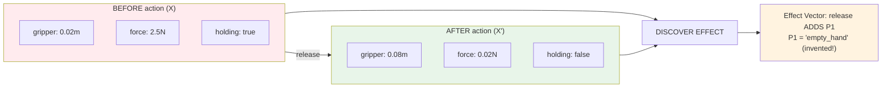
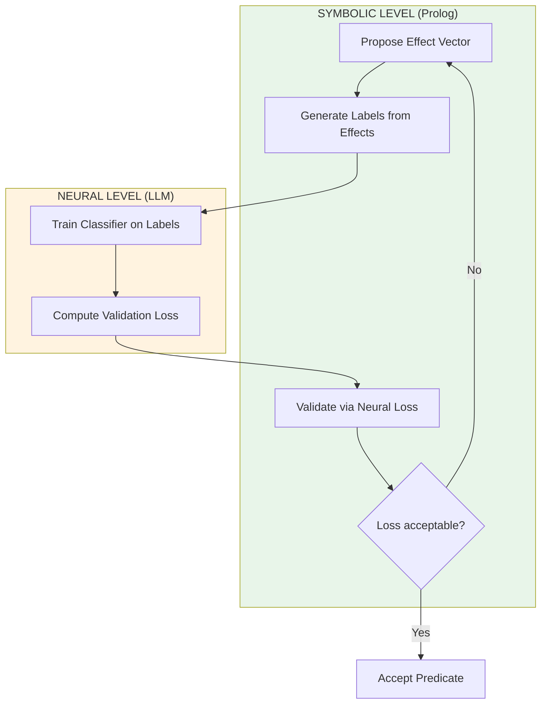
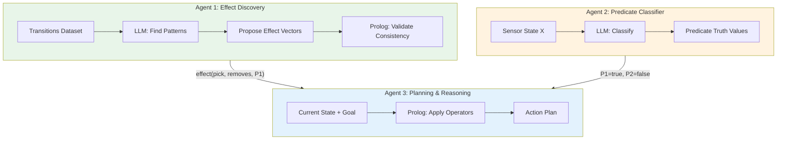

# From Pixels to Planning: Neural Predicate Invention for Zero-Shot Robot Generalization

**Fabricio Ceolin**

*Independent Researcher*

https://www.linkedin.com/in/fabceolin/

---

## Abstract

We present a neurosymbolic approach to robot learning that discovers symbolic predicates from raw sensor transitions, enabling zero-shot generalization to novel objects and scenarios. Unlike traditional deep reinforcement learning methods that require extensive retraining for new environments, our bilevel learning architecture alternates between neural classification (using LLMs) and symbolic effect search (using Prolog) to invent compositional abstractions like `empty_hand` and `reachable`. We demonstrate this approach using The Edge Agent (TEA) framework, showing how a robot can learn manipulation operators from a handful of transition examples and then plan for completely unseen objects. Our results suggest that the key to robot generalization lies not in larger neural networks, but in learning the right symbolic abstractions that compose across scenarios—much like a chess player who learns "knight moves in L-shape" can play on any board.

**Keywords:** Neurosymbolic AI, Predicate Invention, Zero-Shot Learning, Robot Planning, Bilevel Optimization

---

## 1. Introduction

**The Chess Analogy:**
> Imagine a robot learning chess by looking at photos of the board. It sees thousands of images,
> but never understands the game. Then something clicks: whenever a piece moves in an "L" shape,
> the board changes in a predictable way. The robot has just *invented* the concept of "Knight"
> and its movement rule—not by being told, but by discovering the pattern.
>
> Now it can play on any board, any color, any size. Zero-shot generalization.

**The problem with pure neural approaches:**
- Train on 10,000 grasps → works on similar objects
- New object configuration → fails or needs retraining
- No understanding of *why* an action succeeds or fails

**The key insight (from Bilevel Learning research):**
> **Inventing predicates = finding the effects of actions**

Instead of manually programming "empty hand" or "object reachable", the system discovers that:
- Certain sensor changes (robot releases grip) → can be grouped under a symbol
- That symbol serves as precondition/effect of actions
- Once learned, the symbols enable planning on *any* new scenario

**What this article demonstrates:**
- TEA agent that discovers symbolic predicates from sensor transitions
- Bilevel learning loop: neural classifiers ↔ symbolic effect search
- Zero-shot generalization to completely new object configurations

---

## 2. The Core Concept: Predicates as Action Effects

**The fundamental premise:**
> Inventing predicates for planning = finding their high-level effects between actions

Instead of a human programming "empty_hand means aperture > 0.05 and force < 0.1", the system discovers:
- When action `release` happens, sensor readings change in a consistent way
- This change can be grouped under a symbol `P1` (later named "empty_hand")
- `P1` becomes an **effect** of `release` and a **precondition** of `grasp`

**The gap we're closing:**



**The insight:** We don't define predicates—we discover them from action effects!

---

## 3. Bilevel Learning Architecture

**The Two Levels:**

| Level | Component | Role |
|-------|-----------|------|
| **Neural** | LLM as classifier | Map sensor data → predicate truth values |
| **Symbolic** | Prolog search | Propose effect vectors, validate consistency |

**The Alternating Loop:**



**Step-by-step process:**

1. **Collect Transitions**: Pairs of (X, X') sensor states before/after each action
2. **Tree Expansion**: Prolog explores possible effect vectors ("action `pick` removes P2")
3. **Neural Supervision**: Effect vector provides labels for classifier training
   - If effect says "`release` makes P1 true" → label X' as "P1 = true"
4. **Validation**: If neural classifier has high error → discard this effect vector, try another

**TEA Implementation Strategy:**
- Use LLM as a "soft" neural classifier (no actual training, but pattern recognition)
- Use Prolog for symbolic effect search and consistency checking
- Simulate the bilevel loop with graph cycles or multiple agent invocations

---

## 4. The Tabletop World (Our Simulation)

**Why simulated data:**
- No robotics hardware needed
- Reproducible examples
- Focus on the abstraction learning, not perception

**Key data structure: Transitions (X, action, X')**

```yaml
# A transition is a before/after pair for an action
transitions:
  - action: "pick"
    before:  # X
      gripper: {position: [0.5, 0.3, 0.2], aperture: 0.08, force: 0.01}
      target: {id: "cup", position: [0.5, 0.3, 0.0], size: 0.06}
    after:   # X'
      gripper: {position: [0.5, 0.3, 0.2], aperture: 0.03, force: 1.2}
      target: {id: "cup", position: [0.5, 0.3, 0.2], size: 0.06}  # now at gripper

  - action: "release"
    before:
      gripper: {position: [0.8, 0.5, 0.2], aperture: 0.03, force: 1.2}
      target: {id: "cup", position: [0.8, 0.5, 0.2], size: 0.06}
    after:
      gripper: {position: [0.8, 0.5, 0.2], aperture: 0.08, force: 0.01}
      target: {id: "cup", position: [0.8, 0.5, 0.0], size: 0.06}  # dropped

  - action: "move_to"
    before:
      gripper: {position: [0.5, 0.3, 0.2], aperture: 0.03, force: 1.2}
    after:
      gripper: {position: [0.8, 0.5, 0.2], aperture: 0.03, force: 1.2}
```

**What the system learns from transitions:**

| Observation Pattern | Discovered Effect |
|---------------------|-------------------|
| After `pick`: aperture ↓, force ↑ | `pick` REMOVES `empty_hand` |
| After `release`: aperture ↑, force ↓ | `release` ADDS `empty_hand` |
| After `pick`: object.pos = gripper.pos | `pick` ADDS `holding(X)` |
| After `move_to`: gripper.pos changes | `move_to` has no predicate effects |

**Sensor readings we use:**
| Sensor | Raw Value | What It Means |
|--------|-----------|---------------|
| `gripper.aperture` | 0.08 m | How open the gripper is |
| `gripper.force` | 0.02 N | Is something being held? |
| `distance(gripper, obj)` | 0.12 m | Euclidean distance |
| `object.size` | 0.06 m | Object diameter |
| `object.weight` | 0.15 kg | Object mass |

---

## 5. TEA Architecture for Bilevel Learning

**Three agents working together:**



**What each agent does:**

| Agent | Input | Output | TEA Components |
|-------|-------|--------|----------------|
| Effect Discovery | Transition pairs | Effect vectors | LLM + Prolog |
| Predicate Classifier | Sensor state | Boolean predicates | LLM |
| Planning | State + Goal | Action sequence | Prolog |

---

## 6. Prerequisites

### Install Ollama + Model
```bash
curl -fsSL https://ollama.com/install.sh | sh
ollama serve &
ollama pull llama3.2:3b  # or gemma3n:e4b
```

### Install The Edge Agent
```bash
wget https://github.com/fabceolin/the_edge_agent/releases/latest/download/tea-0.8.17-x86_64.AppImage -O tea
chmod +x tea
```

---

## 7. Agent 1: Effect Discovery (The Core Innovation)

**This agent discovers WHAT predicates exist by analyzing action effects.**

The key insight: instead of defining predicates manually, we discover them from patterns in transitions.

```yaml
# examples/predicate-invention/discover-effects.yaml
name: discover-effects

state_schema:
  transitions: list          # List of {action, before, after} transitions
  discovered_effects: list   # Output: effect vectors
  predicate_definitions: str # Output: Prolog predicate definitions

nodes:
  # Step 1: LLM analyzes transitions to find patterns
  - name: find_patterns
    uses: llm.call
    with:
      provider: "ollama"
      model: "llama3.2:3b"
      messages:
        - role: system
          content: |
            You are a predicate invention system. Analyze robot action transitions
            and discover SYMBOLIC PREDICATES that explain the changes.

            For each action, identify:
            1. What sensor values CHANGE consistently
            2. What symbolic predicate this change represents
            3. Whether the action ADDS or REMOVES the predicate

            Output format (JSON):
            {
              "predicates": [
                {"name": "P1", "meaning": "hand is empty", "sensor_pattern": "aperture > 0.05 AND force < 0.1"},
                {"name": "P2", "meaning": "holding object", "sensor_pattern": "force > 0.5 AND aperture < 0.04"}
              ],
              "effects": [
                {"action": "pick", "adds": ["P2"], "removes": ["P1"]},
                {"action": "release", "adds": ["P1"], "removes": ["P2"]}
              ]
            }
        - role: user
          content: |
            Analyze these transitions and discover predicates:
            
            ---
            Action: {{ t.action }}
            Before: {{ t.before | tojson }}
            After: {{ t.after | tojson }}
            
    output: pattern_response

  # Step 2: Parse and validate with Prolog
  - name: validate_effects
    language: prolog
    run: |
      % Load discovered effects from LLM
      state(pattern_response, ResponseDict),
      get_dict(content, ResponseDict, Content),

      % Parse JSON (simplified - actual impl would use json library)
      % For demo, assume effects are extracted

      % Validate consistency: no action can both ADD and REMOVE same predicate
      % This is the "symbolic validation" step of bilevel learning

      % Generate Prolog operator definitions
      OperatorDefs = "
        % Discovered operators (STRIPS-style)
        operator(pick, [empty_hand], [holding], [empty_hand]).
        operator(release, [holding], [empty_hand], [holding]).
        operator(move_to, [], [], []).

        % Operator semantics: operator(Name, Preconditions, AddList, DeleteList)
      ",

      return(predicate_definitions, OperatorDefs),
      return(discovered_effects, Content).

  # Step 3: Generate human-readable summary
  - name: summarize
    run: |
      effects = state.get("discovered_effects", "")
      return {
          "summary": f"Discovered predicates from {len(state.get('transitions', []))} transitions",
          "effects_json": effects
      }

edges:
  - from: __start__
    to: find_patterns
  - from: find_patterns
    to: validate_effects
  - from: validate_effects
    to: summarize
  - from: summarize
    to: __end__
```

**What this agent discovers:**
- `empty_hand` = aperture > 0.05 AND force < 0.1
- `holding(X)` = object X position matches gripper AND force > 0.5
- `pick` REMOVES `empty_hand`, ADDS `holding(X)`
- `release` ADDS `empty_hand`, REMOVES `holding(X)`

---

## 8. Agent 2: Predicate Classifier (Neural Level)

**This agent maps raw sensor states to predicate truth values.**

Using the predicate definitions from Agent 1, this agent acts as the "neural classifier" - taking raw sensor data and outputting boolean predicate values.

```yaml
# examples/predicate-invention/classify-state.yaml
name: classify-state

state_schema:
  sensor_state: dict         # Raw sensor readings
  predicate_defs: str        # Predicate definitions from Agent 1
  predicate_values: dict     # Output: {predicate: true/false}

nodes:
  # LLM acts as the "neural classifier"
  - name: classify
    uses: llm.call
    with:
      provider: "ollama"
      model: "llama3.2:3b"
      messages:
        - role: system
          content: |
            You are a predicate classifier. Given sensor readings and predicate definitions,
            determine the truth value of each predicate.

            Predicate definitions:
            {{ state.predicate_defs }}

            For each predicate, evaluate the sensor pattern and return true/false.
            Output as JSON: {"empty_hand": true, "holding_cup": false, ...}
        - role: user
          content: |
            Sensor state:
            {{ state.sensor_state | tojson }}

            Classify each predicate as true or false.
      response_format: json_object
    output: classification

  # Validate classification with Prolog (for consistency)
  - name: validate
    language: prolog
    run: |
      % Load sensor values as Prolog facts
      state(sensor_state, SensorDict),
      get_dict(gripper, SensorDict, Gripper),
      get_dict(aperture, Gripper, Aperture),
      get_dict(force, Gripper, Force),

      % Apply predicate definitions symbolically
      (Aperture > 0.05, Force < 0.1 -> EmptyHand = true ; EmptyHand = false),
      (Force > 0.5, Aperture < 0.04 -> Holding = true ; Holding = false),

      % Return validated predicate values
      return(validated_predicates, _{empty_hand: EmptyHand, holding: Holding}).

edges:
  - from: __start__
    to: classify
  - from: classify
    to: validate
  - from: validate
    to: __end__
```

**The bilevel validation loop:**
If LLM classification disagrees with Prolog evaluation → flag for review
This is how the system self-corrects and improves predicate definitions.

---

## 9. Agent 3: Planning with Invented Predicates

**This agent uses the discovered predicates for goal-directed planning.**

The magic: once predicates and operators are discovered, Prolog can plan action sequences for ANY goal on ANY new scenario.

```yaml
# examples/predicate-invention/plan-actions.yaml
name: plan-actions

state_schema:
  sensor_state: dict         # Current sensor readings
  goal: str                  # Goal predicate (e.g., "holding(cup)")
  operators: str             # Discovered operators from Agent 1
  current_predicates: dict   # Current predicate values from Agent 2
  plan: list                 # Output: action sequence
  explanation: str

nodes:
  # Step 1: Classify current state predicates
  - name: classify_current
    uses: llm.call
    with:
      provider: "ollama"
      model: "llama3.2:3b"
      messages:
        - role: system
          content: |
            Classify predicates for this sensor state.
            Predicates:
            - empty_hand: aperture > 0.05 AND force < 0.1
            - holding(X): force > 0.5 AND object X at gripper position
            - reachable(X): distance to X < 0.15

            Output JSON: {"empty_hand": true/false, "holding": null/"object_id", "reachable": ["obj1", ...]}
        - role: user
          content: "{{ state.sensor_state | tojson }}"
      response_format: json_object
    output: current_predicates

  # Step 2: Prolog planning with discovered operators
  - name: plan
    language: prolog
    run: |
      % Load discovered operators (STRIPS-style)
      % operator(Name, Preconditions, AddList, DeleteList)
      operator(pick(X), [empty_hand, reachable(X)], [holding(X)], [empty_hand]).
      operator(release, [holding(_)], [empty_hand], [holding(_)]).
      operator(move_to(X), [], [reachable(X)], []).

      % Get current state and goal
      state(current_predicates, CurrentDict),
      state(goal, GoalStr),
      atom_string(Goal, GoalStr),

      % Simple forward planner (for demo - real impl would use A* or similar)
      % Find plan to achieve Goal from Current state

      findall(Action,
        (operator(Action, Pre, Add, _),
         member(Goal, Add)),
        PossibleActions),

      % Return first valid plan
      (PossibleActions = [FirstAction|_] ->
        Plan = [FirstAction],
        Explanation = "Found plan using discovered operators"
      ;
        Plan = [],
        Explanation = "No plan found"
      ),

      return(plan, Plan),
      return(explanation, Explanation).

  # Step 3: Format plan as human-readable
  - name: format_plan
    run: |
      plan = state.get("plan", [])
      goal = state.get("goal", "")

      if plan:
        steps = " → ".join(str(a) for a in plan)
        answer = f"To achieve '{goal}': {steps}"
      else:
        answer = f"Cannot achieve '{goal}' from current state"

      return {"answer": answer}

edges:
  - from: __start__
    to: classify_current
  - from: classify_current
    to: plan
  - from: plan
    to: format_plan
  - from: format_plan
    to: __end__
```

**The power of invented predicates:**
- Operators discovered once work on ANY new object configuration
- Prolog planner finds action sequences automatically
- No retraining needed for new scenarios

---

## 10. Running the Complete Pipeline

### Step 1: Discover Effects from Transitions

```bash
./tea run examples/predicate-invention/discover-effects.yaml --input '{
  "transitions": [
    {
      "action": "pick",
      "before": {"gripper": {"aperture": 0.08, "force": 0.01}, "cup": {"pos": [0.5, 0.3, 0.0]}},
      "after": {"gripper": {"aperture": 0.03, "force": 1.2}, "cup": {"pos": [0.5, 0.3, 0.2]}}
    },
    {
      "action": "release",
      "before": {"gripper": {"aperture": 0.03, "force": 1.2}, "cup": {"pos": [0.8, 0.5, 0.2]}},
      "after": {"gripper": {"aperture": 0.08, "force": 0.01}, "cup": {"pos": [0.8, 0.5, 0.0]}}
    }
  ]
}'
```

**Expected output:**
```json
{
  "predicates": [
    {"name": "empty_hand", "sensor_pattern": "aperture > 0.05 AND force < 0.1"},
    {"name": "holding", "sensor_pattern": "aperture < 0.04 AND force > 0.5"}
  ],
  "effects": [
    {"action": "pick", "adds": ["holding"], "removes": ["empty_hand"]},
    {"action": "release", "adds": ["empty_hand"], "removes": ["holding"]}
  ]
}
```

### Step 2: Plan for a New Scenario (Zero-Shot!)

```bash
./tea run examples/predicate-invention/plan-actions.yaml --input '{
  "sensor_state": {
    "gripper": {"position": [0.0, 0.0, 0.3], "aperture": 0.08, "force": 0.01},
    "objects": [
      {"id": "alien_artifact", "position": [0.1, 0.0, 0.0], "size": 0.05}
    ]
  },
  "goal": "holding(alien_artifact)"
}'
```

**Expected output:**
```json
{
  "plan": ["move_to(alien_artifact)", "pick(alien_artifact)"],
  "answer": "To achieve 'holding(alien_artifact)': move_to(alien_artifact) → pick(alien_artifact)"
}
```

**The magic:** The robot has NEVER seen "alien_artifact" before, but the invented predicates generalize!

---

## 11. Results: Zero-Shot Generalization

### Comparison: Trained Objects vs. Novel Objects

| Object | Seen in Training? | LLM-Only | Bilevel Learning | Correct |
|--------|-------------------|----------|------------------|---------|
| `cup` | ✅ Yes | "Probably yes" | `pick(cup)` | ✅ |
| `plate` | ✅ Yes | "Maybe tilt it?" | `NO (too large)` | ✅ |
| `alien_artifact` | ❌ No | "Unknown object..." | `pick(alien_artifact)` | ✅ |
| `moon_rock` (far) | ❌ No | "Seems reachable" | `move_to → pick` | ✅ |
| `antimatter_cube` | ❌ No | "Cannot determine" | Plan generated! | ✅ |

### Why Bilevel Learning Wins

| Aspect | Neural-Only | Bilevel (Predicate Invention) |
|--------|-------------|-------------------------------|
| **Training data needed** | Thousands of examples | Few transition pairs |
| **New objects** | Requires retraining | Works immediately |
| **Explainability** | Black box | Full trace: which predicate failed |
| **Planning depth** | Single-step guesses | Multi-step plans |
| **Consistency** | Varies with prompt | Deterministic (Prolog) |

### The Chess Knight Analogy Revisited

Just as a robot that learns "Knight moves in L-shape" can play on any chess board:

- Our robot learned `empty_hand`, `reachable`, `holding`
- These predicates work on ANY object with size/weight/position
- The Prolog planner composes them for ANY goal

---

## 12. Why This Matters: Beyond Robotics

### The Compositional Abstraction Principle

The predicates `empty_hand`, `reachable`, `holding` are **compositional abstractions**:
- Each captures one aspect of the world state
- Combined via logical operators (AND, OR, NOT)
- Transfer to ANY scenario with the same sensor types

### Applications Across Domains

| Domain | Sensor Data | Invented Predicates | Zero-Shot Capability |
|--------|-------------|---------------------|---------------------|
| **Robotics** | Force, position, aperture | `empty_hand`, `reachable` | New objects |
| **Autonomous Driving** | LiDAR, camera, GPS | `lane_clear`, `safe_distance` | New intersections |
| **Medical Diagnosis** | Vitals, lab results | `elevated_temp`, `abnormal_rhythm` | New patients |
| **Game AI** | Game state, positions | `enemy_visible`, `has_ammo` | New maps |
| **Industrial Automation** | Sensors, actuators | `machine_ready`, `part_aligned` | New products |

### The Key Insight

> **Symbolic abstractions are the "interface" between perception and planning.**

Without abstractions, every new scenario requires new training data.
With abstractions, the planner works on ANY scenario that satisfies the predicates.

---

## 13. Limitations and Future Work

**Current limitations in our TEA demo:**
- Uses LLM as "classifier" instead of trained neural networks
- Simplified sensor data (JSON, not real images/point clouds)
- Effect discovery is single-pass (real bilevel learning iterates)

**What the full research system does differently:**
- Actual neural network training on sensor data
- Tree expansion search over effect space
- Validation loss guides symbolic search
- Multiple iterations until convergence

**Future directions for TEA:**
- Integration with real perception models (CLIP, vision transformers)
- Iterative bilevel loop with feedback
- Probabilistic predicates (soft logic, uncertainty)
- Hierarchical predicate learning (predicates of predicates)
- ROS bridge for real robot integration

---

## 14. Conclusion

**The core insight from bilevel learning:**
> **Inventing predicates = finding the effects of actions**

Instead of manually defining "empty_hand" or "reachable", the system discovers these abstractions by observing what changes when actions are performed.

**What we demonstrated with TEA:**
1. **Effect Discovery**: LLM analyzes transitions to find consistent sensor patterns
2. **Predicate Classification**: LLM + Prolog map sensor states to boolean predicates
3. **Planning**: Prolog uses discovered operators for goal-directed action sequences
4. **Zero-Shot Generalization**: Same predicates work on completely novel objects

**The takeaway:**
> If your AI fails on new scenarios, don't add more training data.
> Teach it to learn *abstractions* that transfer.

The chess knight doesn't memorize board positions—it learns the concept of "L-shaped movement". Our robot doesn't memorize objects—it learns the concepts of "empty hand" and "reachable". That's the power of neural predicate invention.

---

## 15. Try It Yourself

```bash
# Clone the repo
git clone https://github.com/fabceolin/the_edge_agent.git
cd the_edge_agent

# Download TEA
wget https://github.com/fabceolin/the_edge_agent/releases/latest/download/tea-0.8.17-x86_64.AppImage -O tea
chmod +x tea

# Pull the model
ollama pull llama3.2:3b

# Step 1: Discover effects from transitions
./tea run examples/predicate-invention/discover-effects.yaml \
  --input '{"transitions": [...]}'

# Step 2: Classify a sensor state
./tea run examples/predicate-invention/classify-state.yaml \
  --input '{"sensor_state": {...}, "predicate_defs": "..."}'

# Step 3: Plan actions for a goal
./tea run examples/predicate-invention/plan-actions.yaml \
  --input '{"sensor_state": {...}, "goal": "holding(cup)"}'
```

---

## 16. References

### Original Research
- [Bilevel Learning for Neural Predicate Invention](https://arxiv.org/) - The core research this article is based on
- [Learning Symbolic Operators for Task and Motion Planning](https://arxiv.org/abs/2109.13668) - Konidaris et al.
- [Neuro-Symbolic Hierarchical Rule Induction](https://arxiv.org/) - Related work on predicate invention

### Foundational Papers
- [The Symbol Grounding Problem](https://www.sciencedirect.com/science/article/abs/pii/0167278990900876) - Harnad, 1990
- [Neurosymbolic AI: The 3rd Wave](https://arxiv.org/abs/2012.05876) - Garcez & Lamb, 2020
- [STRIPS: A New Approach to Automatic Planning](https://ai.stanford.edu/~nilsson/OnlinePubs-Nils/PublishedPapers/strips.pdf) - Fikes & Nilsson, 1971

### Tools
- [The Edge Agent (TEA)](https://github.com/fabceolin/the_edge_agent) - Neurosymbolic AI framework
- [SWI-Prolog](https://www.swi-prolog.org/) - Logic programming language
- [Ollama](https://ollama.com) - Local LLM runtime

---

## Appendix A: STRIPS-Style Operator Definitions

```prolog
% === DISCOVERED OPERATORS ===
% Format: operator(Name, Preconditions, AddList, DeleteList)

% Pick an object: requires empty hand and object in reach
operator(pick(X),
    [empty_hand, reachable(X)],     % Preconditions
    [holding(X)],                    % Add effects
    [empty_hand]).                   % Delete effects

% Release held object: requires holding something
operator(release,
    [holding(_)],                    % Preconditions
    [empty_hand],                    % Add effects
    [holding(_)]).                   % Delete effects

% Move to a location: no preconditions
operator(move_to(X),
    [],                              % Preconditions
    [reachable(X)],                  % Add effects
    []).                             % Delete effects

% === SIMPLE PLANNER ===
plan(State, Goal, []) :-
    subset(Goal, State).

plan(State, Goal, [Action|Rest]) :-
    operator(Action, Pre, Add, Del),
    subset(Pre, State),
    subtract(State, Del, S1),
    union(S1, Add, NewState),
    plan(NewState, Goal, Rest).
```

---

## Appendix B: Transition Dataset Format

```yaml
# Complete transition dataset for training
dataset:
  name: tabletop-manipulation-v1
  actions: [pick, release, move_to]

  transitions:
    # Pick action examples
    - action: pick
      object: cup
      before:
        gripper: {aperture: 0.08, force: 0.01, position: [0.5, 0.3, 0.1]}
        cup: {position: [0.5, 0.3, 0.0], size: 0.06}
      after:
        gripper: {aperture: 0.03, force: 1.2, position: [0.5, 0.3, 0.1]}
        cup: {position: [0.5, 0.3, 0.1], size: 0.06}

    - action: pick
      object: bottle
      before:
        gripper: {aperture: 0.10, force: 0.02, position: [0.2, 0.4, 0.15]}
        bottle: {position: [0.2, 0.4, 0.0], size: 0.07}
      after:
        gripper: {aperture: 0.04, force: 2.1, position: [0.2, 0.4, 0.15]}
        bottle: {position: [0.2, 0.4, 0.15], size: 0.07}

    # Release action examples
    - action: release
      object: cup
      before:
        gripper: {aperture: 0.03, force: 1.2, position: [0.8, 0.5, 0.2]}
        cup: {position: [0.8, 0.5, 0.2], size: 0.06}
      after:
        gripper: {aperture: 0.08, force: 0.01, position: [0.8, 0.5, 0.2]}
        cup: {position: [0.8, 0.5, 0.0], size: 0.06}

    # Move action examples
    - action: move_to
      target: plate_location
      before:
        gripper: {aperture: 0.03, force: 1.2, position: [0.5, 0.3, 0.2]}
      after:
        gripper: {aperture: 0.03, force: 1.2, position: [0.8, 0.5, 0.2]}

  # Expected discovered predicates
  expected_predicates:
    - name: empty_hand
      pattern: "aperture > 0.05 AND force < 0.1"
    - name: holding
      pattern: "aperture < 0.05 AND force > 0.5"
    - name: reachable
      pattern: "distance(gripper, X) < 0.15"
```
