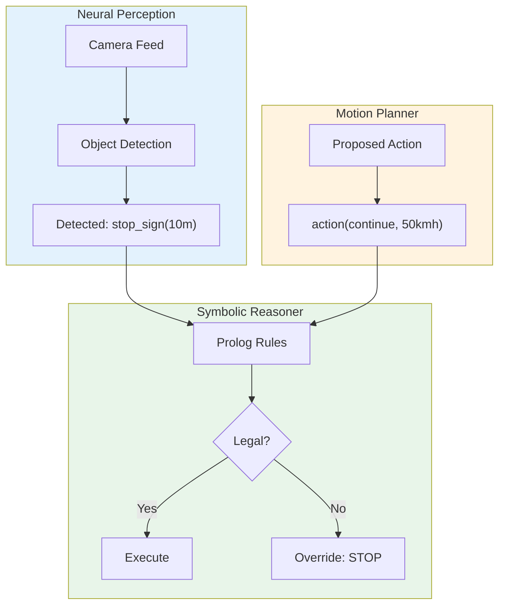
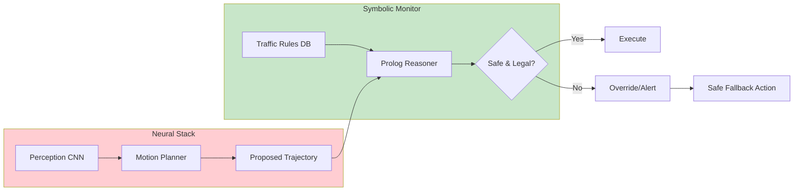

# Why Did the Tesla Brake for the Moon? Encoding Traffic Rules in Neurosymbolic AI

**Fabricio Ceolin**

*Independent Researcher*

https://www.linkedin.com/in/fabceolin/

---

## Abstract

Autonomous vehicles trained on millions of miles still make baffling errors—braking for the moon (mistaken for a yellow traffic light), confusing billboards with stop signs, or failing to recognize traffic officers in non-standard uniforms. These failures stem from a fundamental limitation: neural networks learn statistical patterns, not formal rules. This article presents a neurosymbolic approach using The Edge Agent (TEA) framework where traffic laws are encoded as Prolog rules that can be extracted from natural language driver's manuals, validated against driving decisions in real-time, and instantly swapped when crossing jurisdictional boundaries—no retraining required. We demonstrate how formal rule encoding catches violations that pattern-matching misses, while enabling transparent, auditable decision-making required by regulators.

**Keywords:** Autonomous Vehicles, Traffic Rules, Neurosymbolic AI, Prolog, Formal Verification, Jurisdiction Adaptation

---

## 1. Introduction

In 2021, Tesla owners reported a peculiar bug: their cars were braking for the **moon**, mistaking it for a yellow traffic light. In other incidents, vehicles confused billboards displaying red circles with stop signs, or failed to recognize police officers directing traffic because they weren't wearing the expected uniform.

These aren't edge cases — they're symptoms of a fundamental limitation: **neural networks learn patterns, not rules**.

This article demonstrates how **neurosymbolic AI** solves this problem by combining:
1. **LLMs** to extract formal traffic rules from driver's manuals
2. **Prolog** to reason about whether a maneuver is legal and safe
3. **Rule swapping** to adapt instantly to different jurisdictions

Using The Edge Agent (TEA), we'll build an autonomous driving validator that:
- Extracts rules from natural language manuals
- Validates driving decisions against formal specifications
- Swaps rule sets when crossing borders — no retraining needed

## 2. The Problem: Neural Networks Don't Know the Rules

### What Neural Networks Learn

A self-driving car trained on millions of miles learns:
- "Yellow circles in the sky at night = ignore" (usually)
- "Red octagons = stop" (usually)
- "Cars ahead slowing = brake" (usually)

But "usually" isn't good enough for safety-critical systems.

### Real Failures

| Incident | What Happened | Root Cause |
|----------|---------------|------------|
| **Moon braking** | Tesla braked for full moon | Yellow circle pattern matching |
| **Billboard confusion** | Car stopped for Coca-Cola ad | Red circle pattern matching |
| **Tunnel panic** | Vehicle confused by tunnel lighting | Training data gap |
| **Construction zone** | Ignored human flaggers | Not in training distribution |

### The Core Issue

```
Neural Network Training:
  Input: 10 million frames of "normal" driving
  Output: Statistical model of "what drivers do"

Missing: Explicit knowledge of traffic laws
```

A neural network that has never seen a sandstorm doesn't know to reduce speed. One trained in California doesn't know that Massachusetts allows right turns on red only at specific intersections. One trained in the US doesn't know that in the UK, you drive on the left.

## 3. The Neurosymbolic Solution

Our approach separates concerns:

| Component | Strength | Role |
|-----------|----------|------|
| **Neural Network** | Perception | "I see a red octagon 10m ahead" |
| **LLM** | Language understanding | Extract rules from driver's manual |
| **Prolog** | Formal reasoning | "Is this maneuver legal?" |



### The Key Insight

> The neural network is like a driver's **reflexes** — fast but fallible.
> The symbolic rules are like the **driver's manual** — explicit and verifiable.
> Together, they create a system with both agility and accountability.

## 4. Prerequisites

### Install Ollama and Model

```bash
# Install Ollama
curl -fsSL https://ollama.com/install.sh | sh

# Start server and pull model
ollama serve &
ollama pull llama3.2:1b
```

### Install The Edge Agent

```bash
# Download AppImage (includes Prolog)
wget https://github.com/fabceolin/the_edge_agent/releases/latest/download/tea-linux-x86_64.AppImage -O tea
chmod +x tea
```

## 5. The Agents

### Agent 1: Rule Extraction from Driver's Manual

First, we extract formal rules from natural language:

```yaml
# examples/traffic-rules/extract-rules.yaml
name: extract-traffic-rules

state_schema:
  manual_text: str
  jurisdiction: str
  extracted_rules: str

nodes:
  - name: extract
    uses: llm.call
    with:
      provider: "ollama"
      model: "llama3.2:1b"
      messages:
        - role: system
          content: |
            You are a traffic law extraction system. Convert driver's manual
            text into Prolog rules.

            Output format:
            ```prolog
            % Rule: description
            rule_name(Conditions) :- condition1, condition2.
            ```

            Use these predicates:
            - detected(Object, Distance) - object detected at distance
            - speed(Current) - current vehicle speed
            - signal(Color) - traffic signal color
            - zone(Type) - current zone (school, construction, residential)
            - weather(Condition) - weather condition
            - action(Type, Speed) - proposed action
            - legal(Action) - action is legal
            - violation(Action, Rule) - action violates rule

            Output ONLY Prolog rules, no other text.
        - role: user
          content: |
            Jurisdiction: {{ state.jurisdiction }}

            Manual text:
            {{ state.manual_text }}
    output: llm_response

  - name: format
    run: |
      content = state.get("llm_response", {}).get("content", "")
      # Extract code block if present
      if "```prolog" in content:
          start = content.find("```prolog") + 9
          end = content.find("```", start)
          content = content[start:end].strip()
      elif "```" in content:
          start = content.find("```") + 3
          end = content.find("```", start)
          content = content[start:end].strip()
      return {"extracted_rules": content}

edges:
  - from: __start__
    to: extract
  - from: extract
    to: format
  - from: format
    to: __end__
```

### Agent 2: Maneuver Validator

Now the core reasoning agent that validates driving decisions:

```yaml
# examples/traffic-rules/validate-maneuver.yaml
name: validate-maneuver

state_schema:
  # Perception inputs (from neural network)
  detected_objects: list    # [{"type": "stop_sign", "distance": 10}, ...]
  current_speed: float      # km/h
  current_zone: str         # "residential", "school", "highway"
  weather: str              # "clear", "rain", "fog", "sandstorm"
  signal_state: str         # "red", "yellow", "green", "none"

  # Proposed action (from motion planner)
  proposed_action: str      # "continue", "stop", "turn_right", "turn_left"
  proposed_speed: float     # km/h

  # Rule set
  jurisdiction: str         # "BR", "US_CA", "US_MA", "UK"
  traffic_rules: str        # Prolog rules for this jurisdiction

  # Output
  is_legal: bool
  violation: str
  recommendation: str

nodes:
  # Generate Prolog facts from perception
  - name: generate_facts
    run: |
      facts = []

      # Current state facts
      facts.append(f"speed({state['current_speed']}).")
      facts.append(f"zone({state['current_zone']}).")
      facts.append(f"weather({state['weather']}).")
      facts.append(f"signal({state['signal_state']}).")

      # Detected objects
      for obj in state.get('detected_objects', []):
          facts.append(f"detected({obj['type']}, {obj['distance']}).")

      # Proposed action
      facts.append(f"proposed(action({state['proposed_action']}, {state['proposed_speed']})).")

      return {"perception_facts": "\n".join(facts)}

  # Reason about legality
  - name: reason
    language: prolog
    run: |
      % Load perception facts
      state(perception_facts, FactsText),
      tea_load_code(FactsText),

      % Load jurisdiction-specific rules
      state(traffic_rules, RulesText),
      tea_load_code(RulesText),

      % Get proposed action
      proposed(Action),

      % Check if action is legal
      (legal(Action) ->
        (IsLegal = true, Violation = "none", Recommendation = "Proceed as planned")
      ;
        (IsLegal = false,
         % Find which rule is violated
         (violation(Action, Rule) ->
           (Violation = Rule,
            (recommended_action(RecAction) ->
              Recommendation = RecAction
            ;
              Recommendation = "Stop and reassess"
            ))
         ;
           (Violation = "unknown_violation", Recommendation = "Proceed with caution")
         ))
      ),

      return(is_legal, IsLegal),
      return(violation, Violation),
      return(recommendation, Recommendation).

  # Format output
  - name: format_output
    run: |
      is_legal = state.get("is_legal", False)
      violation = state.get("violation", "unknown")
      recommendation = state.get("recommendation", "")
      jurisdiction = state.get("jurisdiction", "unknown")

      if is_legal:
          status = f"LEGAL in {jurisdiction}"
      else:
          status = f"VIOLATION in {jurisdiction}: {violation}"

      return {
          "status": status,
          "recommendation": recommendation
      }

edges:
  - from: __start__
    to: generate_facts
  - from: generate_facts
    to: reason
  - from: reason
    to: format_output
  - from: format_output
    to: __end__
```

### Agent 3: Geographic Rule Swapper

The power of neurosymbolic: swap rules without retraining:

```yaml
# examples/traffic-rules/jurisdiction-swap.yaml
name: jurisdiction-aware-driver

state_schema:
  gps_location: dict        # {"lat": -23.5, "lon": -46.6}
  detected_objects: list
  current_speed: float
  proposed_action: str
  proposed_speed: float

  # Determined by location
  jurisdiction: str
  traffic_rules: str

  # Output
  is_legal: bool
  violation: str

nodes:
  # Determine jurisdiction from GPS
  - name: get_jurisdiction
    run: |
      lat = state["gps_location"]["lat"]
      lon = state["gps_location"]["lon"]

      # Simplified jurisdiction detection
      if -35 < lat < 5 and -75 < lon < -30:
          jurisdiction = "BR"
      elif 25 < lat < 50 and -130 < lon < -65:
          jurisdiction = "US"
      elif 50 < lat < 60 and -10 < lon < 2:
          jurisdiction = "UK"
      else:
          jurisdiction = "INTERNATIONAL"

      return {"jurisdiction": jurisdiction}

  # Load rules for jurisdiction
  - name: load_rules
    run: |
      jurisdiction = state["jurisdiction"]

      rules = {
          "BR": '''
% Brazilian Traffic Code (CTB) - Simplified
% Art. 61 - Speed limits by zone
max_speed(residential, 40).
max_speed(school, 30).
max_speed(highway, 110).

% Art. 44 - Stop sign rules
must_stop :- detected(stop_sign, D), D < 15.

% Art. 220 - Red light violation
must_stop :- signal(red).

% Weather adaptations
speed_reduction(rain, 0.8).
speed_reduction(fog, 0.5).
speed_reduction(sandstorm, 0.3).
speed_reduction(clear, 1.0).

% Check if speed is legal
legal_speed(S) :-
    zone(Z), max_speed(Z, Max),
    weather(W), speed_reduction(W, Factor),
    AdjustedMax is Max * Factor,
    S =< AdjustedMax.

% Main legality check
legal(action(continue, S)) :-
    \\+ must_stop,
    legal_speed(S).

legal(action(stop, _)) :- true.

% Violations
violation(action(continue, _), "must_stop_for_sign") :-
    detected(stop_sign, D), D < 15.
violation(action(continue, _), "must_stop_for_red") :-
    signal(red).
violation(action(continue, S), "speed_violation") :-
    \\+ legal_speed(S).

recommended_action("stop_immediately") :- must_stop.
recommended_action("reduce_speed") :- \\+ legal_speed(_).
''',

          "US": '''
% US Traffic Rules (Simplified - California)
max_speed(residential, 25).  % mph
max_speed(school, 15).
max_speed(highway, 65).

% Right turn on red (allowed in most US states)
right_on_red_allowed :- signal(red), \\+ detected(no_turn_on_red, _).

must_stop :- detected(stop_sign, D), D < 50.  % feet
must_stop :- signal(red), \\+ (proposed(action(turn_right, _)), right_on_red_allowed).

legal_speed(S) :-
    zone(Z), max_speed(Z, Max),
    S =< Max.

legal(action(continue, S)) :-
    \\+ must_stop,
    legal_speed(S).

legal(action(turn_right, S)) :-
    right_on_red_allowed,
    legal_speed(S).

legal(action(stop, _)) :- true.

violation(action(continue, _), "stop_sign_violation") :-
    detected(stop_sign, D), D < 50.
violation(action(continue, _), "red_light_violation") :-
    signal(red).
violation(action(continue, S), "speeding") :-
    \\+ legal_speed(S).

recommended_action("stop_completely") :- must_stop.
''',

          "UK": '''
% UK Highway Code (Simplified)
max_speed(residential, 30).  % mph
max_speed(school, 20).
max_speed(motorway, 70).

% UK: NO right turn on red (ever)
% UK: Drive on LEFT side

must_stop :- detected(stop_sign, D), D < 15.
must_stop :- signal(red).

% Zebra crossing rules (UK specific)
must_stop :- detected(zebra_crossing, D), D < 20, detected(pedestrian, _).

legal_speed(S) :-
    zone(Z), max_speed(Z, Max),
    S =< Max.

legal(action(continue, S)) :-
    \\+ must_stop,
    legal_speed(S).

legal(action(stop, _)) :- true.

% UK-specific violations
violation(action(turn_left, _), "no_turn_on_red_uk") :-
    signal(red).
violation(action(continue, _), "zebra_crossing_violation") :-
    detected(zebra_crossing, D), D < 20, detected(pedestrian, _).

recommended_action("stop_for_pedestrians") :-
    detected(zebra_crossing, _), detected(pedestrian, _).
'''
      }

      return {"traffic_rules": rules.get(jurisdiction, rules["BR"])}

  # Generate perception facts
  - name: generate_facts
    run: |
      facts = []
      facts.append(f"speed({state['current_speed']}).")
      facts.append(f"zone({state.get('current_zone', 'residential')}).")
      facts.append(f"weather({state.get('weather', 'clear')}).")
      facts.append(f"signal({state.get('signal_state', 'none')}).")

      for obj in state.get('detected_objects', []):
          facts.append(f"detected({obj['type']}, {obj['distance']}).")

      facts.append(f"proposed(action({state['proposed_action']}, {state['proposed_speed']})).")

      return {"perception_facts": "\n".join(facts)}

  # Reason
  - name: reason
    language: prolog
    run: |
      state(perception_facts, FactsText),
      tea_load_code(FactsText),

      state(traffic_rules, RulesText),
      tea_load_code(RulesText),

      proposed(Action),

      (legal(Action) ->
        (IsLegal = true, Violation = "none")
      ;
        (IsLegal = false,
         (violation(Action, V) -> Violation = V ; Violation = "unknown"))
      ),

      return(is_legal, IsLegal),
      return(violation, Violation).

  - name: format
    run: |
      j = state["jurisdiction"]
      legal = state.get("is_legal", False)
      v = state.get("violation", "none")

      if legal:
          msg = f"[{j}] Action is LEGAL"
      else:
          msg = f"[{j}] VIOLATION: {v}"

      return {"result": msg}

edges:
  - from: __start__
    to: get_jurisdiction
  - from: get_jurisdiction
    to: load_rules
  - from: load_rules
    to: generate_facts
  - from: generate_facts
    to: reason
  - from: reason
    to: format
  - from: format
    to: __end__
```

## 6. Running the Examples

### Example 1: Red Light in Brazil

```bash
./tea run examples/traffic-rules/validate-maneuver.yaml --input '{
  "detected_objects": [{"type": "traffic_light", "distance": 5}],
  "current_speed": 40,
  "current_zone": "residential",
  "weather": "clear",
  "signal_state": "red",
  "proposed_action": "continue",
  "proposed_speed": 40,
  "jurisdiction": "BR",
  "traffic_rules": "must_stop :- signal(red). legal(action(continue, _)) :- \\+ must_stop. violation(action(continue, _), red_light_violation) :- signal(red)."
}'
```

**Result:**
```json
{
  "is_legal": false,
  "violation": "red_light_violation",
  "recommendation": "Stop and reassess"
}
```

### Example 2: Right Turn on Red — US vs UK

**In California (legal):**
```bash
./tea run examples/traffic-rules/jurisdiction-swap.yaml --input '{
  "gps_location": {"lat": 37.7749, "lon": -122.4194},
  "detected_objects": [],
  "current_speed": 0,
  "signal_state": "red",
  "proposed_action": "turn_right",
  "proposed_speed": 10
}'
```

**Result:** `[US] Action is LEGAL`

**In London (illegal):**
```bash
./tea run examples/traffic-rules/jurisdiction-swap.yaml --input '{
  "gps_location": {"lat": 51.5074, "lon": -0.1278},
  "detected_objects": [],
  "current_speed": 0,
  "signal_state": "red",
  "proposed_action": "turn_left",
  "proposed_speed": 10
}'
```

**Result:** `[UK] VIOLATION: no_turn_on_red_uk`

### Example 3: Sandstorm Speed Reduction (Brazil)

```bash
./tea run examples/traffic-rules/validate-maneuver.yaml --input '{
  "detected_objects": [],
  "current_speed": 80,
  "current_zone": "highway",
  "weather": "sandstorm",
  "signal_state": "none",
  "proposed_action": "continue",
  "proposed_speed": 80,
  "jurisdiction": "BR",
  "traffic_rules": "max_speed(highway, 110). speed_reduction(sandstorm, 0.3). legal_speed(S) :- max_speed(highway, Max), speed_reduction(sandstorm, F), Adj is Max * F, S =< Adj. legal(action(continue, S)) :- legal_speed(S). violation(action(continue, S), excessive_speed_for_conditions) :- \\+ legal_speed(S)."
}'
```

**Result:**
```json
{
  "is_legal": false,
  "violation": "excessive_speed_for_conditions",
  "recommendation": "reduce_speed"
}
```

The adjusted max speed is 110 × 0.3 = 33 km/h. Driving at 80 km/h in a sandstorm violates safety rules.

## 7. Results Comparison

| Scenario | Neural-Only | Neurosymbolic | Correct |
|----------|-------------|---------------|---------|
| Moon at night | Brakes (false positive) | Ignores (not in rules) | Neurosymbolic |
| Red billboard | Stops (false positive) | Ignores (not traffic signal) | Neurosymbolic |
| Right on red (US) | Depends on training | Legal (rule says so) | Neurosymbolic |
| Right on red (UK) | Depends on training | Illegal (rule says so) | Neurosymbolic |
| Sandstorm | No knowledge | Speed reduction enforced | Neurosymbolic |
| New jurisdiction | Needs retraining | Swap rules instantly | Neurosymbolic |

## 8. Architecture Deep Dive

### The Reasonableness Monitor

The symbolic layer acts as a **safety monitor** that can override the neural planner:



### V2V Rule Sharing

Because rules are formal (RDF/Prolog), vehicles can share them:

```yaml
# Vehicle A detects construction zone
v2v_broadcast:
  type: "temporary_rule"
  location: {"lat": -23.55, "lon": -46.63, "radius": 500}
  rule: "max_speed(construction, 20). must_stop :- detected(flagger, D), D < 30."
  expires: "2024-12-20T18:00:00Z"

# Vehicle B receives and loads the rule automatically
```

### The Digital Driving Test

Before deployment, the AI takes a "driving test":

```yaml
# examples/traffic-rules/driving-test.yaml
name: driving-test

state_schema:
  test_scenarios: list
  traffic_rules: str
  score: int
  passed: bool

nodes:
  - name: run_test
    language: prolog
    run: |
      state(traffic_rules, Rules),
      tea_load_code(Rules),

      % Test scenarios
      Scenarios = [
        test(1, "stop_sign_ahead", action(stop, 0), should_be_legal),
        test(2, "red_light_continue", action(continue, 50), should_be_violation),
        test(3, "green_light_continue", action(continue, 50), should_be_legal),
        test(4, "school_zone_speeding", action(continue, 60), should_be_violation)
      ],

      % Run each test and count correct
      findall(1, (
        member(test(_, _, Action, Expected), Scenarios),
        ((legal(Action), Expected = should_be_legal) ;
         (violation(Action, _), Expected = should_be_violation))
      ), Correct),

      length(Correct, Score),
      length(Scenarios, Total),
      Passed = (Score >= Total * 0.8),  % 80% to pass

      return(score, Score),
      return(total, Total),
      return(passed, Passed).
```

## 9. Why This Matters

### Current State of AV Licensing

| Entity | Required Test | Formal Rules |
|--------|---------------|--------------|
| Human Driver | Written + Practical | Must know traffic code |
| Tesla Autopilot | None | Statistical patterns only |
| Waymo | Limited simulation | Proprietary |
| **Neurosymbolic AV** | Formal verification | Explicit, auditable rules |

### The Accountability Gap

When a human driver runs a red light, we can point to the rule they violated. When a neural network does the same, we can only say "the training data didn't generalize."

Neurosymbolic AI provides:
- **Explainability**: "I stopped because rule CTB-44 requires stopping at stop signs"
- **Auditability**: Rules can be inspected before deployment
- **Portability**: Update rules for new jurisdictions without retraining
- **Verification**: Formally prove behavior bounds

## 10. The Broader Pattern

This article demonstrates a general pattern for safety-critical AI:

1. **Identify formal specifications**: Traffic laws, medical protocols, financial regulations
2. **Extract rules from natural language**: LLM + structured output
3. **Encode as logic programs**: Prolog, RDF, OWL
4. **Validate actions before execution**: Symbolic reasoner as safety monitor
5. **Enable runtime adaptation**: Swap rule sets without retraining

### Other Applications

| Domain | Formal Specifications | Neurosymbolic Benefit |
|--------|----------------------|----------------------|
| **Medical AI** | Clinical protocols | Verify treatment plans against guidelines |
| **Financial AI** | Regulatory compliance | Audit trading decisions |
| **Industrial Robotics** | Safety standards (ISO) | Verify motion plans |
| **Legal AI** | Case law, statutes | Explain legal reasoning |

## 11. Conclusion

The question isn't whether neural networks can eventually learn all traffic rules from data — it's whether we should trust safety-critical systems that can't explain their decisions.

The neurosymbolic approach offers a different path:
- Neural networks for perception (what's in the scene)
- Symbolic rules for reasoning (what's legal and safe)
- LLMs for bridging natural language to formal logic

When your car brakes for the moon, you want to know why. When it crosses a border, you want it to know the new rules. When regulators audit it, you want to show them the logic.

**Neurosymbolic AI makes all of this possible.**

## 12. Try It Yourself

```bash
# Clone the examples
git clone https://github.com/fabceolin/the_edge_agent.git
cd the_edge_agent

# Download TEA
wget https://github.com/fabceolin/the_edge_agent/releases/latest/download/tea-linux-x86_64.AppImage -O tea
chmod +x tea

# Pull the model
ollama pull llama3.2:1b

# Run the jurisdiction-aware driver
./tea run examples/traffic-rules/jurisdiction-swap.yaml \
  --input '{"gps_location": {"lat": -23.5, "lon": -46.6}, "detected_objects": [{"type": "stop_sign", "distance": 10}], "current_speed": 40, "proposed_action": "continue", "proposed_speed": 40}'

# Extract rules from a manual
./tea run examples/traffic-rules/extract-rules.yaml \
  --input '{"jurisdiction": "BR", "manual_text": "At stop signs, vehicles must come to a complete stop before proceeding. Speed limit in residential areas is 40 km/h. In school zones, maximum speed is 30 km/h."}'
```

## 13. References

- [Tesla Moon Braking Incidents](https://www.reddit.com/r/TeslaModel3/comments/pj29w6/anyone_else_have_the_car_slam_on_the_brakes_when/) - User reports
- [Encoding Traffic Laws for Autonomous Vehicles](https://arxiv.org/abs/1901.04741) - MIT research
- [The Edge Agent (TEA)](https://github.com/fabceolin/the_edge_agent) - Neurosymbolic AI framework
- [CTB - Código de Trânsito Brasileiro](https://www.planalto.gov.br/ccivil_03/leis/l9503.htm) - Brazilian Traffic Code
- [UK Highway Code](https://www.gov.uk/guidance/the-highway-code) - UK traffic rules
- [California DMV Driver Handbook](https://www.dmv.ca.gov/portal/handbook/california-driver-handbook/) - US traffic rules
- [SWI-Prolog](https://www.swi-prolog.org/) - Logic programming language
