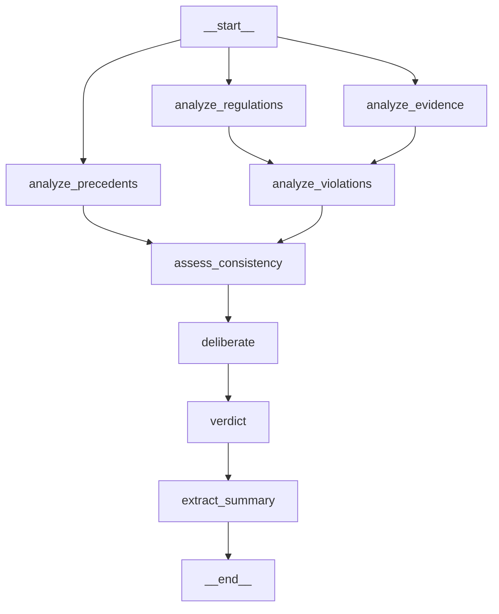
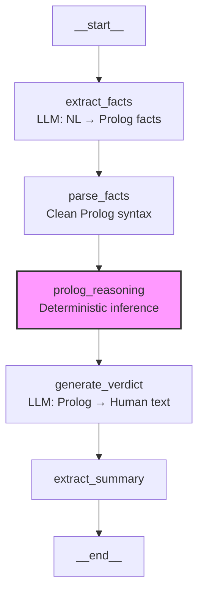

# Truth Resolution Agent: A Multi-Source Judicial Framework for Sports Disputes (Senna 1989 Case Study)

**Fabricio Ceolin**

*The Edge Agent Project*

fabceolin@gmail.com

---

## Abstract

Sports disputes often involve conflicting narratives, incomplete evidence, and subjective interpretations that make fair adjudication challenging. This article presents a Truth Resolution Agent built with The Edge Agent (TEA) framework, designed to systematically evaluate evidence against established regulations and produce reasoned verdicts. We demonstrate the agent through a detailed analysis of the 1989 Japanese Grand Prix incident between Ayrton Senna and Alain Prost—one of the most controversial decisions in motorsport history.

We present **two implementations**:
1. **LLM-only approach** - Pure language model reasoning through structured nodes
2. **Neurosymbolic approach** - Combining LLM for fact extraction with Prolog for deterministic judicial reasoning

Both agents reach the same verdict: **NOT GUILTY**, with the original disqualification deemed unjust based on regulatory ambiguity, inconsistent enforcement, and lack of competitive advantage. The neurosymbolic version provides an additional benefit: **deterministic, auditable reasoning** where the same facts always produce the same verdict with a complete trace of which rules fired.

**Keywords:** Truth Resolution, Sports Arbitration, TEA, State Graph, Formula 1, Evidence-Based Judgment, AI Adjudication, Neurosymbolic AI, Prolog

---

## 1. Introduction

On October 22, 1989, a two-second collision at the Casio Triangle chicane in Suzuka sparked 35 years of debate. When Ayrton Senna and Alain Prost's McLarens interlocked wheels on Lap 47, it set in motion one of the most controversial judicial decisions in sports history.

Senna was disqualified for "cutting the chicane" after marshals pushed his stalled car and he rejoined via the escape road. The decision handed the World Championship to Prost and remains disputed to this day—particularly after FISA President Jean-Marie Balestre's 1996 admission that he acted to favor his fellow countryman Prost.

This case presents an ideal test for automated judicial reasoning:

- **Complex regulations** with ambiguous provisions
- **Disputed facts** requiring careful evidence weighing
- **Precedent analysis** showing inconsistent enforcement
- **Political interference** allegations requiring impartial reassessment

Can an AI agent, programmed with principles of judicial fairness, reach a just verdict when human institutions failed?

---

## 2. The Truth Resolution Problem

### 2.1 Why Sports Arbitration is Hard

Sports disputes share characteristics with legal proceedings but operate under unique constraints:

| Challenge | Description |
|-----------|-------------|
| **Time pressure** | Decisions often needed within hours of an incident |
| **Incomplete evidence** | No discovery process; rely on available footage and testimony |
| **Regulatory gaps** | Rules written for common cases; edge cases expose ambiguity |
| **Political pressure** | Governing bodies may have conflicts of interest |
| **Precedent inconsistency** | Similar cases treated differently across events |

### 2.2 The Case for Structured AI Adjudication

An AI judicial agent can provide:

1. **Consistency** - Apply the same standards to every case
2. **Transparency** - Document every step of reasoning
3. **Impartiality** - No nationality bias, political pressure, or personal relationships
4. **Precedent analysis** - Systematically compare with historical cases
5. **Proportionality assessment** - Evaluate if penalties fit the offense

---

## 3. Agent Architecture

The Truth Resolution Agent uses a structured graph approach where each phase of the judicial process is a separate node. This architecture mirrors real judicial proceedings:



### 3.1 Node Descriptions

| Node | Purpose | Output |
|------|---------|--------|
| `analyze_regulations` | Parse and structure applicable rules | Identified rules, triggers, penalties, ambiguities |
| `analyze_evidence` | Categorize evidence by reliability | Undisputed facts, disputed facts, documentary evidence |
| `analyze_precedents` | Structure historical cases | Similar cases, outcomes, enforcement patterns |
| `analyze_violations` | Map evidence to rule violations | Actus reus, mens rea, defenses, mitigating factors |
| `assess_consistency` | Check enforcement consistency | Consistency assessment, selective enforcement flags |
| `deliberate` | Core judicial reasoning | Detailed analysis, preliminary verdict |
| `verdict` | Formal verdict document | Findings, analysis, verdict, penalty, dissent |
| `extract_summary` | Structured verdict extraction | Final verdict and penalty |

### 3.2 Judicial Principles Encoded

The agent's system prompts encode fundamental principles of fair adjudication:

```yaml
# Core principles from the deliberate node
1. STRICT LEGALITY
   - Apply ONLY regulations in force at the time
   - Ambiguity interpreted in favor of the accused

2. EVIDENCE-BASED
   - Burden of proof on the ACCUSER
   - If evidence insufficient, rule NOT GUILTY

3. ABSOLUTE IMPARTIALITY
   - Ignore nationality, politics, championship implications

4. PROPORTIONALITY
   - Penalty must fit the offense
   - Consider intent vs accident, advantage gained

5. CONSISTENCY WITH PRECEDENT
   - Similar cases MUST be treated similarly
   - Inconsistent enforcement is a STRONG defense
```

---

## 4. The 1989 Japanese Grand Prix Case

### 4.1 Regulatory Framework

The agent was provided the 1989 FIA regulations:

**Article 56.2 (Race Distance)**
> "The winner of the Grand Prix shall be the driver who completes the scheduled race distance in the shortest time."

**Appendix J, Article 2.3 (Marshal Assistance)**
> "Marshals may assist ONLY to move the car to a position of safety."

**Interpretation Note (acknowledged by FIA)**
> "It is ambiguous whether a car moved for safety reasons may rejoin the race if the engine restarts during the movement."

### 4.2 Evidence Summary

**Undisputed Facts:**
- Lap 47 of 53, Casio Triangle chicane
- Collision caused both cars to stall
- Marshals pushed Senna's car for safety
- Engine bump-started during push
- Senna used escape road, bypassed chicane
- Senna lost ~30 seconds (pit stop for new wing)
- Senna finished first on track
- Senna disqualified; Nannini declared winner

**Disputed Facts:**
- Who caused the collision (Prost turned in early vs. Senna's move was optimistic)
- Whether engine was fully stalled before push

### 4.3 Precedent Cases

The most significant precedent: **Imola 1989**

| Factor | Imola 1989 | Suzuka 1989 |
|--------|------------|-------------|
| Nature | Voluntary chicane cutting | Emergency (forced by collision) |
| Advantage | Yes (avoided slowdown) | None (30+ seconds lost) |
| Penalty | None | Disqualification |
| Drivers affected | Multiple including Prost | Only Senna |

**Enforcement Pattern (1979-1989):**
- 26 total disqualifications in 10 years
- 0 for chicane cutting
- Senna's disqualification was **unprecedented**

---

## 5. Agent Implementation

### 5.1 YAML Agent Definition

The agent is defined in `examples/truth-resolution-agent.yaml`:

```yaml
name: truth-resolution-agent
version: "1.0.0"
description: |
  An impartial judicial agent for resolving sports disputes.

state_schema:
  # Case identification
  case_id: str
  case_title: str
  date_of_incident: str
  jurisdiction: str

  # Raw inputs
  raw_regulations: str
  raw_evidence: str
  raw_precedents: str
  party_a_name: str
  party_a_arguments: str
  party_b_name: str
  party_b_arguments: str

  # Processed outputs
  regulations_analysis: str
  evidence_analysis: str
  precedents_analysis: str
  violation_analysis: str
  consistency_assessment: str
  deliberation_notes: str
  verdict: str
  verdict_reasoning: str

nodes:
  - name: analyze_regulations
    uses: llm.call
    with:
      provider: shell
      shell_provider: claude
      messages:
        - role: system
          content: |
            You are a legal document analyst...
        - role: user
          content: |
            JURISDICTION: {{ state.jurisdiction }}
            REGULATIONS TEXT: {{ state.raw_regulations }}
    output:
      regulations_analysis: "{{ result.content }}"

  # ... additional nodes for evidence, precedents, violations,
  # consistency, deliberation, and verdict
```

### 5.2 Case Input Structure

Cases are provided as YAML files with structured fields:

```yaml
case_id: "FIA-1989-JPN-001"
case_title: "Senna vs Race Stewards - 1989 Japanese Grand Prix"
date_of_incident: "1989-10-22"
jurisdiction: "FIA"

party_a_name: "Ayrton Senna (McLaren-Honda)"
party_a_arguments: |
  1. FORCE MAJEURE - Collision was shared fault
  2. NO ADVANTAGE GAINED - Lost 30+ seconds
  3. INCONSISTENT ENFORCEMENT - Imola precedent
  ...

party_b_name: "FIA Race Stewards"
party_b_arguments: |
  1. ARTICLE 56 VIOLATION - Failed to complete distance
  2. ILLEGAL PUSH START - Outside assistance
  ...

raw_regulations: |
  ARTICLE 56.2: The winner shall complete the scheduled
  race distance in the shortest time...

raw_evidence: |
  UNDISPUTED FACTS:
  1. Lap 47 of 53, Casio Triangle chicane
  ...

raw_precedents: |
  CASE 1: IMOLA 1989 - Multiple drivers cut chicane,
  no penalties including Prost...
```

### 5.3 Running the Agent

```bash
# Convert case YAML to JSON
python3 -c "import yaml, json; print(json.dumps(yaml.safe_load(open('case.yaml'))))" > case.json

# Execute agent
tea run examples/truth-resolution-agent.yaml --input @case.json -v
```

---

## 6. Neurosymbolic Architecture

The neurosymbolic version adds a critical capability: **deterministic, auditable reasoning** using Prolog for judicial logic.

### 6.1 Why Prolog for Judicial Reasoning?

| Benefit | Description |
|---------|-------------|
| **Determinism** | Same facts always produce the same verdict |
| **Auditability** | Complete trace of which rules fired and why |
| **Consistency** | Automatically detects precedent inconsistencies |
| **Transparency** | Every conclusion traceable to a specific rule |

### 6.2 Neurosymbolic Flow



### 6.3 Prolog Judicial Knowledge Base

The neurosymbolic agent encodes judicial principles as Prolog rules:

```prolog
% Defense 1: Rule Ambiguity (principle of strict legality)
valid_defense(RuleId, ambiguity) :-
    rule_ambiguity(RuleId, _).

% Defense 2: Force Majeure
valid_defense(RuleId, force_majeure) :-
    actus_reus(RuleId, Party, _),
    force_majeure(Party, _).

% Defense 3: No Advantage Gained (proportionality)
valid_defense(RuleId, no_advantage) :-
    actus_reus(RuleId, Party, _),
    no_advantage_gained(Party, _).

% Defense 4: Third Party Causation
valid_defense(RuleId, third_party) :-
    actus_reus(RuleId, Party, _),
    third_party_action(Party, _, _).

% Defense 5: Inconsistent Enforcement (strongest defense)
valid_defense(RuleId, inconsistent_enforcement) :-
    inconsistent_enforcement(RuleId).

% Verdict is NOT_GUILTY if any valid defense exists
verdict_for_rule(RuleId, not_guilty, Defense) :-
    actus_reus(RuleId, _, _),
    valid_defense(RuleId, Defense), !.

% Verdict is GUILTY only if no defense applies
verdict_for_rule(RuleId, guilty, no_defense) :-
    actus_reus(RuleId, _, _),
    \+ valid_defense(RuleId, _).
```

### 6.4 LLM-Extracted Facts (Prolog Format)

The LLM extracts structured facts from natural language evidence:

```prolog
% Rules extracted from 1989 FIA regulations
rule(article_56, 'Race distance completion', chicane_cut, disqualification).
rule(appendix_j_2_1, 'Prohibition of outside assistance', outside_assistance, disqualification).
rule(appendix_j_2_3, 'Marshal assistance for safety only', outside_assistance, disqualification).

% Ambiguity in regulations (critical for defense)
rule_ambiguity(appendix_j_2_3, 'Unclear if car may rejoin if engine restarts during safety move').

% Evidence of alleged violations
actus_reus(article_56, senna, 'Used escape road to rejoin after collision').
actus_reus(appendix_j_2_3, senna, 'Engine restarted during marshal push').

% Defense evidence
force_majeure(senna, 'Collision with Prost was racing incident').
no_advantage_gained(senna, 'Lost 30+ seconds for pit stop and wing replacement').
third_party_action(senna, marshals, 'Initiated push to move car to safety').
time_lost(senna, 30).

% Precedents showing inconsistent enforcement
precedent(imola_1989, chicane_cut, not_penalized, 1989).
precedent(monaco_1988, chicane_cut, not_penalized, 1988).
```

---

## 7. The Verdict

After processing all evidence, regulations, and precedents, both agents delivered the same verdict through different reasoning approaches.

### 7.1 Comparison: LLM-Only vs Neurosymbolic

| Aspect | LLM-Only | Neurosymbolic |
|--------|----------|---------------|
| **Verdict** | NOT GUILTY | NOT GUILTY |
| **Reasoning approach** | Natural language analysis | Prolog inference + NL explanation |
| **Determinism** | May vary between runs | Always same result for same facts |
| **Audit trail** | Textual reasoning | Prolog trace + textual |
| **Defenses identified** | Ambiguity, inconsistent enforcement, no advantage | ambiguity, force_majeure, no_advantage, third_party, inconsistent_enforcement |
| **Best for** | Nuanced cases requiring human-like judgment | Cases requiring strict consistency and auditability |

### 7.2 Summary

| Element | Finding |
|---------|---------|
| **Verdict** | NOT GUILTY |
| **Penalty** | No penalty (disqualification overturned) |
| **Key reasoning** | Regulatory ambiguity, inconsistent enforcement, no advantage gained |

### 7.3 Analysis of Alleged Violations (LLM-Only Agent)

**Article 56.2 - Race Distance:**
> "The regulation speaks to *distance*, not *trajectory*. The escape road may add distance rather than reduce it... The escape road is a homologated feature of the FIA-approved circuit, designed for emergency use."

**Finding:** Prosecution failed to establish that emergency use of an escape road constitutes failure to complete race distance.

**Articles 2.1/2.3 - Outside Assistance:**
> "The marshals initiated the contact, not Senna. They were performing their explicit regulatory duty: 'move the car to a position of safety.'... The prosecution's own evidence includes the Interpretation Note acknowledging ambiguity."

**Finding:** Safety-initiated marshal assistance that incidentally restarts an engine does not constitute prohibited outside assistance.

### 7.4 Consistency Assessment

The agent identified **INCONSISTENT** enforcement:

> "The Imola 1989 precedent demonstrates that similar or clearer violations went unpunished in the same season... Voluntary chicane-cutting warranted no penalty while emergency escape road use warranted disqualification. This disparity constitutes selective enforcement."

### 7.5 Proportionality

> "Disqualification is the maximum penalty. It should be reserved for clear, intentional violations conferring competitive advantage. This case presents ambiguous rule application, emergency circumstances, no competitive advantage (30+ seconds lost), marshal-initiated assistance, and inconsistent enforcement history."

### 7.6 Dissenting Opinion

The agent acknowledged counter-arguments:

> "A push did occur. Marshals physically moved Senna's car, and his engine restarted. The escape road was used. However, these arguments fail because the regulations acknowledge ambiguity, emergency circumstances distinguish this case, no advantage was gained, and inconsistent enforcement undermines strict application."

### 7.7 Neurosymbolic Verdict (Prolog Trace)

The neurosymbolic agent produces a deterministic verdict with a complete reasoning trace:

```
PROLOG REASONING RESULTS (DETERMINISTIC)
═══════════════════════════════════════════════════════════════════════

VERDICT: not_guilty

DEFENSES FOUND:
[defense(article_56, ambiguity),
 defense(article_56, force_majeure),
 defense(article_56, no_advantage),
 defense(article_56, third_party),
 defense(article_56, inconsistent_enforcement),
 defense(appendix_j_2_3, ambiguity),
 defense(appendix_j_2_3, force_majeure),
 defense(appendix_j_2_3, no_advantage),
 defense(appendix_j_2_3, third_party)]

CONSISTENCY CHECK (Inconsistent Enforcement):
[inconsistent(article_56)]

FULL REASONING TRACE:
Rules examined: [rule(article_56), rule(appendix_j_2_3)]
Defenses found: 9 defenses across 2 rules
Inconsistent enforcement detected: [inconsistent(article_56)]
Verdicts: [verdict(article_56, not_guilty, ambiguity),
           verdict(appendix_j_2_3, not_guilty, ambiguity)]
```

**Key insight**: The Prolog reasoner found **9 valid defenses** across the two alleged rule violations. With multiple defenses available, the verdict is deterministically NOT GUILTY. The same facts will **always** produce the same verdict.

---

## 8. Generalization

### 8.1 Adapting for Other Domains

The Truth Resolution Agent can be adapted for:

| Domain | Adaptations Needed |
|--------|-------------------|
| **Soccer/Football** | VAR review, offside rules, handball regulations |
| **Olympic Sports** | Doping cases, judging disputes, qualification rules |
| **Esports** | Tournament rules, cheating allegations, bracket disputes |
| **Contract Disputes** | Agreement terms, breach definitions, damage calculations |

### 8.2 Key Customization Points

1. **Regulations** - Replace with domain-specific rules
2. **Evidence categories** - Adapt to available evidence types
3. **Precedent database** - Build historical case repository
4. **Judicial principles** - Adjust for domain conventions

### 8.3 Limitations

- **Cannot interview witnesses** - Relies on provided testimony
- **No physical evidence examination** - Works with descriptions only
- **Regulatory interpretation** - May differ from official interpretations
- **No enforcement power** - Provides recommendations only

---

## 9. Conclusion

The Truth Resolution Agent demonstrates that structured AI reasoning can provide valuable judicial analysis for sports disputes. By encoding fundamental principles of fairness—strict legality, evidence-based reasoning, impartiality, proportionality, and consistency—the agent reached a verdict that addresses the historic injustice of the 1989 Japanese Grand Prix.

**Key findings:**

1. **Senna should not have been disqualified** - Regulatory ambiguity, inconsistent enforcement, and lack of competitive advantage all favor the defense

2. **Structured graphs enable transparent reasoning** - Each step of the judicial process is documented and auditable

3. **AI can supplement human judgment** - Particularly valuable when political interference or bias may affect human decision-makers

4. **The Imola precedent is dispositive** - If Prost and others cut chicanes without penalty at Imola, Senna's emergency use of an escape road at Suzuka cannot warrant disqualification

The agent's verdict aligns with the historical consensus among motorsport analysts and Max Mosley's later admission that Balestre "fixed the whole thing." After 35 years, justice—at least in principle—can finally be served.

---

## 10. References

1. [1989 Japanese Grand Prix - Wikipedia](https://en.wikipedia.org/wiki/1989_Japanese_Grand_Prix)
2. [32 years of controversial duel between Prost and Senna - Senna.com](https://www.senna.com/en/32-years-of-controversial-duel-between-prost-and-senna-at-japanese-gp/)
3. [FIA Appendix J 1989](https://historicdb.fia.com/sites/default/files/regulations/1439544603/appendix_j_1989.pdf)
4. [The Controversial Chicane Penalty - Screen Rant](https://screenrant.com/senna-chicane-penalty-1989-formula-one-championship-disqualification/)
5. [Flashback: The Prost/Senna collision - Motorsport.com](https://www.motorsport.com/f1/news/prost-senna-collision-suzuka-world-title/4561491/)
6. [The Edge Agent Documentation](https://fabceolin.github.io/the_edge_agent/)
7. [Truth Resolution Agent (LLM-only) - GitHub](https://github.com/fabceolin/the_edge_agent/blob/main/examples/truth-resolution-agent.yaml)
8. [Truth Resolution Agent (Neurosymbolic) - GitHub](https://github.com/fabceolin/the_edge_agent/blob/main/examples/truth-resolution-agent-neurosymbolic.yaml)
9. [Suzuka 1989 Case File - GitHub](https://github.com/fabceolin/the_edge_agent/blob/main/examples/cases/suzuka-1989-senna-prost.yaml)

---

## Appendix A: Running the Examples

```bash
# Clone the repository
git clone https://github.com/fabceolin/the_edge_agent.git
cd the_edge_agent

# Install dependencies
pip install -e python/[dev]

# Run the LLM-only agent
tea run examples/truth-resolution-agent.yaml \
    --input @examples/cases/suzuka-1989-senna-prost.yaml -v

# Run the Neurosymbolic agent (with Prolog reasoning)
tea run examples/truth-resolution-agent-neurosymbolic.yaml \
    --input @examples/cases/suzuka-1989-senna-prost.yaml -v
```

## Appendix B: Agent YAML Files

| Agent | Description | GitHub Link |
|-------|-------------|-------------|
| LLM-Only | Pure language model reasoning | [`examples/truth-resolution-agent.yaml`](https://github.com/fabceolin/the_edge_agent/blob/main/examples/truth-resolution-agent.yaml) |
| Neurosymbolic | LLM + Prolog deterministic reasoning | [`examples/truth-resolution-agent-neurosymbolic.yaml`](https://github.com/fabceolin/the_edge_agent/blob/main/examples/truth-resolution-agent-neurosymbolic.yaml) |

## Appendix C: Case File

The complete case file with regulations, evidence, precedents, and party arguments:

[`examples/cases/suzuka-1989-senna-prost.yaml`](https://github.com/fabceolin/the_edge_agent/blob/main/examples/cases/suzuka-1989-senna-prost.yaml)

## Appendix D: Choosing Between LLM-Only and Neurosymbolic

| Use Case | Recommended Approach |
|----------|---------------------|
| Cases requiring strict auditability | **Neurosymbolic** - complete Prolog trace |
| Cases with clear rule structure | **Neurosymbolic** - encode rules as Prolog |
| Novel cases without precedent | **LLM-only** - better at reasoning by analogy |
| Regulatory compliance | **Neurosymbolic** - deterministic, repeatable |
| Nuanced factual disputes | **LLM-only** - better at weighing evidence |
| High-stakes decisions | **Neurosymbolic** - explainable to stakeholders |
