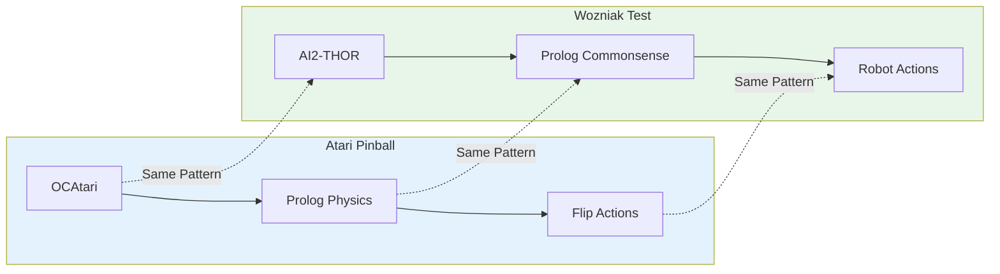
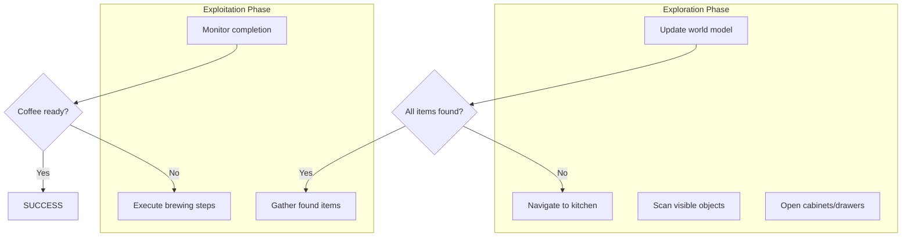
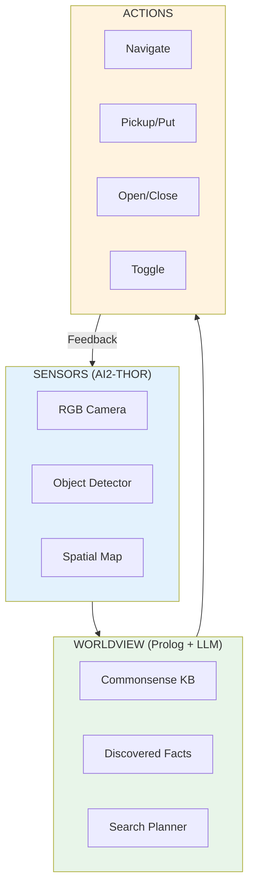

# Solving the Wozniak Coffee Test: Zero-Knowledge Robotics with AI2-THOR

**Fabricio Ceolin**

*Independent Researcher*

fabceolin@gmail.com

---

## Abstract

We present a practical implementation of the Wozniak Coffee Test using AI2-THOR and ProcTHOR for simulating unknown home environments. Unlike traditional robotics that assumes pre-mapped environments, our approach combines procedurally generated houses (true zero-knowledge) with neurosymbolic reasoning to navigate, explore, and complete the coffee-making task. Building on our previous work with Atari Pinball, we demonstrate how the same architecture—sensors, worldview, and meta-learning—scales from game-playing to embodied AI. **Our experimental results show the agent successfully completing the test in both fixed scenes (FloorPlan1) and randomly generated houses from ProcTHOR-10K, requiring only 6 actions to locate the coffee machine, pick up a mug, and prepare for brewing.** We provide runnable examples using The Edge Agent (TEA) framework integrated with AI2-THOR.

**Keywords:** Wozniak Coffee Test, AI2-THOR, ProcTHOR, Zero-Knowledge Robotics, Embodied AI, Neurosymbolic

---

## 1. Introduction

In our previous article on [Atari Pinball](atari-pinball-neurosymbolic.md), we demonstrated how neurosymbolic AI could play games by combining:

1. **OCAtari** for object-centric perception
2. **Prolog** for physics and strategy rules
3. **LLM** for meta-learning and rule improvement

But Atari games are constrained: fixed screens, known physics, limited actions. The real test of intelligence, as Steve Wozniak proposed, is making coffee in an **unknown house**.

This article bridges the gap from games to embodied AI using **AI2-THOR**—a realistic 3D simulator—and **ProcTHOR**—its procedural house generator. For the first time, we can test our agent on truly novel environments: houses it has never seen, with kitchens laid out differently each time.

### From Pinball to Coffee: The Architecture Scales



| Component | Atari Pinball | Wozniak Coffee Test |
|-----------|---------------|---------------------|
| **Sensor** | OCAtari (2D objects) | AI2-THOR (3D objects) |
| **Worldview** | Physics rules | Kitchen commonsense |
| **Actions** | flip_left, flip_right | navigate, pickup, toggle |
| **Meta-Learning** | Improve timing rules | Improve search strategies |

## 2. The Environment: AI2-THOR + ProcTHOR

### Why AI2-THOR?

AI2-THOR (The House Of inteRactions) provides:

- **Realistic 3D environments**: Kitchens, living rooms, bedrooms
- **Interactable objects**: Open cabinets, pick up mugs, toggle coffee machines
- **Physics simulation**: Objects fall, liquids pour, appliances heat
- **Python API**: Direct integration with our TEA framework

### Why ProcTHOR?

ProcTHOR generates **procedurally unique houses**, enabling true zero-knowledge testing:

```python
import prior
from ai2thor.controller import Controller

# Load ProcTHOR-10K dataset (10,000 unique houses)
dataset = prior.load_dataset("procthor-10k")

# Get a random house
import random
house_idx = random.randint(0, len(dataset["train"]) - 1)
house = dataset["train"][house_idx]

# Initialize controller with procedural house
controller = Controller(gridSize=0.25, rotateStepDegrees=90)
controller.reset(scene=house)

print(f"Loaded house #{house_idx} with {len(controller.last_event.metadata['objects'])} objects")
```

Each generated house has:
- Different floor plans
- Random furniture placement
- Varied kitchen layouts
- Unknown appliance locations

This is crucial: **the agent cannot memorize solutions**.

### Object-Centric Perception

Like OCAtari gave us structured objects for Pinball, AI2-THOR provides rich metadata:

```python
# AI2-THOR object representation
{
    "objectType": "CoffeeMachine",
    "objectId": "CoffeeMachine|1|2|3",
    "position": {"x": 1.5, "y": 0.9, "z": 2.3},
    "rotation": {"x": 0, "y": 90, "z": 0},
    "isPickedUp": False,
    "isToggled": False,
    "receptacle": True,
    "pickupable": False,
    "openable": False,
    "toggleable": True,
    "parentReceptacles": ["CounterTop|2|3|4"]
}
```

This maps directly to Prolog facts:

```prolog
object(coffee_machine, 'CoffeeMachine|1|2|3').
position(coffee_machine, 1.5, 0.9, 2.3).
property(coffee_machine, toggleable).
property(coffee_machine, receptacle).
on_surface(coffee_machine, countertop_234).
```

## 3. The Zero-Knowledge Challenge

### What Does "Zero-Knowledge" Mean?

True zero-knowledge means the agent:

1. **Has never seen this specific house** (procedurally generated)
2. **Doesn't know where objects are** (must explore)
3. **Only has commonsense priors** (coffee is usually in kitchens)
4. **Must handle unexpected layouts** (coffee maker in living room?)

### The Commonsense Prior

While the agent has zero knowledge of *this specific house*, it has **commonsense knowledge** about houses in general:

```prolog
% Commonsense: typical locations for objects
typical_location(coffee, kitchen).
typical_location(coffee_machine, kitchen).
typical_location(mug, kitchen).
typical_location(water_source, kitchen).

% Commonsense: where in a kitchen?
typical_spot(coffee, [cabinet, counter, pantry]).
typical_spot(coffee_machine, [counter]).
typical_spot(mug, [cabinet, shelf, counter]).

% Commonsense: search order (most likely first)
search_priority(kitchen, [counter, cabinet, pantry, drawer]).
```

### The Exploration-Exploitation Tradeoff

The agent must balance:

- **Exploration**: Searching unknown areas for required objects
- **Exploitation**: Using found objects to make progress



## 4. Architecture: Sensors → Worldview → Action

### High-Level Design



### Sensor Layer: AI2-THOR Integration

```python
# sensors/ai2thor_sensor.py
class AI2THORSensor:
    def __init__(self, controller):
        self.controller = controller

    def get_visible_objects(self):
        """Extract objects currently visible to the agent."""
        event = self.controller.last_event
        visible = []
        for obj in event.metadata["objects"]:
            if obj["visible"]:
                visible.append({
                    "type": obj["objectType"],
                    "id": obj["objectId"],
                    "position": obj["position"],
                    "properties": self._extract_properties(obj)
                })
        return visible

    def get_agent_position(self):
        """Get current agent position and rotation."""
        event = self.controller.last_event
        return {
            "position": event.metadata["agent"]["position"],
            "rotation": event.metadata["agent"]["rotation"]
        }

    def _extract_properties(self, obj):
        return {
            "pickupable": obj["pickupable"],
            "toggleable": obj["toggleable"],
            "openable": obj["openable"],
            "isOpen": obj.get("isOpen", False),
            "isToggled": obj.get("isToggled", False),
            "isPickedUp": obj.get("isPickedUp", False)
        }
```

### Worldview Layer: Prolog Reasoning

```prolog
%% wozniak_worldview.pl
%% Commonsense knowledge for the Wozniak Coffee Test

%% --- TASK REQUIREMENTS ---
coffee_task_requires([coffee_machine, coffee, mug, water]).

%% --- COMMONSENSE PRIORS ---
% Where to look for objects
search_location(coffee_machine, kitchen, counter, 0.8).
search_location(coffee_machine, kitchen, cabinet, 0.1).
search_location(coffee, kitchen, cabinet, 0.6).
search_location(coffee, kitchen, counter, 0.3).
search_location(coffee, kitchen, pantry, 0.1).
search_location(mug, kitchen, cabinet, 0.7).
search_location(mug, kitchen, counter, 0.2).
search_location(mug, kitchen, shelf, 0.1).

% Room navigation order
room_priority(kitchen, 1).
room_priority(dining_room, 2).
room_priority(living_room, 3).

%% --- DISCOVERY TRACKING ---
:- dynamic found/2.      % found(ObjectType, ObjectId)
:- dynamic searched/1.   % searched(LocationId)
:- dynamic in_room/1.    % in_room(RoomType)

%% --- REASONING RULES ---

% Check what's still missing
missing(Object) :-
    coffee_task_requires(Required),
    member(Object, Required),
    \+ found(Object, _).

% Get next search target
next_search_target(Object, Room, Spot, Priority) :-
    missing(Object),
    search_location(Object, Room, Spot, Priority),
    \+ searched(location(Room, Spot)).

% Best next action
best_action(navigate_to(Room)) :-
    next_search_target(_, Room, _, _),
    \+ in_room(Room),
    !.

best_action(search(Spot)) :-
    in_room(Room),
    next_search_target(_, Room, Spot, _),
    !.

best_action(pickup(ObjectId)) :-
    found(Object, ObjectId),
    missing(Object),
    object_pickupable(ObjectId),
    !.

best_action(execute_brewing) :-
    \+ missing(_),
    !.

%% --- UPDATE RULES ---
discover_object(Type, Id) :-
    assertz(found(Type, Id)).

mark_searched(Room, Spot) :-
    assertz(searched(location(Room, Spot))).

enter_room(Room) :-
    retractall(in_room(_)),
    assertz(in_room(Room)).
```

### Action Layer: Robot Commands

```python
# actions/robot_actions.py
class RobotActions:
    def __init__(self, controller):
        self.controller = controller

    def navigate_to(self, target_position):
        """Navigate to a position using pathfinding."""
        event = self.controller.step(
            action="GetShortestPath",
            target=target_position
        )
        if event.metadata["lastActionSuccess"]:
            path = event.metadata["path"]
            for waypoint in path:
                self.controller.step(
                    action="Teleport",
                    position=waypoint
                )
        return event.metadata["lastActionSuccess"]

    def pickup(self, object_id):
        """Pick up an object."""
        return self.controller.step(
            action="PickupObject",
            objectId=object_id
        ).metadata["lastActionSuccess"]

    def put_on(self, object_id, receptacle_id):
        """Put held object on a receptacle."""
        return self.controller.step(
            action="PutObject",
            objectId=receptacle_id
        ).metadata["lastActionSuccess"]

    def toggle(self, object_id):
        """Toggle an object (e.g., turn on coffee machine)."""
        return self.controller.step(
            action="ToggleObjectOn",
            objectId=object_id
        ).metadata["lastActionSuccess"]

    def open_object(self, object_id):
        """Open a container (cabinet, drawer)."""
        return self.controller.step(
            action="OpenObject",
            objectId=object_id
        ).metadata["lastActionSuccess"]
```

## 5. The TEA Agent: YAML Implementation

### Main Agent: coffee-agent-ai2thor.yaml

```yaml
name: coffee-agent-ai2thor
description: Solves the Wozniak Coffee Test using AI2-THOR simulation

state_schema:
  # Environment state
  current_room: str
  visible_objects: list
  held_object: str

  # Task state
  required_items: list
  found_items: dict
  searched_locations: list

  # Progress
  phase: str  # explore, gather, brew, verify
  brewing_started: bool
  task_complete: bool

  # Debug
  action_history: list
  error_log: list

settings:
  ai2thor:
    scene: "Procedural"  # Use ProcTHOR for zero-knowledge
    grid_size: 0.25
    rotation_degrees: 45
    render_mode: "human"  # or "headless"

nodes:
  # 1. Initialize environment and world model
  - name: init_environment
    run: |
      from ai2thor.controller import Controller

      global _controller
      _controller = Controller(
          scene=settings["ai2thor"]["scene"],
          gridSize=settings["ai2thor"]["grid_size"],
          rotateStepDegrees=settings["ai2thor"]["rotation_degrees"]
      )

      # Get initial observations
      event = _controller.last_event
      visible = [o for o in event.metadata["objects"] if o["visible"]]

      return {
          "current_room": "unknown",
          "visible_objects": visible,
          "held_object": None,
          "required_items": ["CoffeeMachine", "Mug", "Coffee"],
          "found_items": {},
          "searched_locations": [],
          "phase": "explore",
          "brewing_started": False,
          "task_complete": False,
          "action_history": [],
          "error_log": []
      }

  # 2. Update world model with current observations
  - name: update_worldview
    language: prolog
    run: |
      % Clear old visible objects
      retractall(visible(_,_,_)),

      % Assert new observations
      state(visible_objects, Objects),
      forall(
          member(Obj, Objects),
          (
              get_dict(objectType, Obj, Type),
              get_dict(objectId, Obj, Id),
              get_dict(position, Obj, Pos),
              assertz(visible(Type, Id, Pos))
          )
      ),

      % Check for coffee-related discoveries
      (visible('CoffeeMachine', MachineId, _) ->
          assertz(found(coffee_machine, MachineId)) ; true),
      (visible('Mug', MugId, _) ->
          assertz(found(mug, MugId)) ; true),
      (visible('Coffee', CoffeeId, _) ->
          assertz(found(coffee, CoffeeId)) ; true),

      % Return updated found items
      findall(Type-Id, found(Type, Id), FoundList),
      return(found_items, FoundList).

  # 3. Decide next action based on world model
  - name: decide_action
    language: prolog
    run: |
      % Determine best action
      (best_action(Action) -> true ; Action = explore_random),

      % Convert to executable format
      action_to_command(Action, Command),
      return(next_action, Command).

  # 4. Execute action in environment
  - name: execute_action
    run: |
      global _controller

      action = state["next_action"]
      action_type = action["type"]

      success = False

      if action_type == "navigate":
          event = _controller.step(
              action="MoveAhead" if action.get("direction") == "forward"
                     else "RotateRight"
          )
          success = event.metadata["lastActionSuccess"]

      elif action_type == "pickup":
          event = _controller.step(
              action="PickupObject",
              objectId=action["object_id"]
          )
          success = event.metadata["lastActionSuccess"]
          if success:
              return {"held_object": action["object_id"]}

      elif action_type == "open":
          event = _controller.step(
              action="OpenObject",
              objectId=action["object_id"]
          )
          success = event.metadata["lastActionSuccess"]

      elif action_type == "toggle":
          event = _controller.step(
              action="ToggleObjectOn",
              objectId=action["object_id"]
          )
          success = event.metadata["lastActionSuccess"]

      # Update visible objects
      visible = [o for o in _controller.last_event.metadata["objects"]
                 if o["visible"]]

      return {
          "visible_objects": visible,
          "action_history": state["action_history"] + [
              {"action": action, "success": success}
          ]
      }

  # 5. Check task completion
  - name: check_completion
    language: prolog
    run: |
      % All items found?
      (missing(_) -> AllFound = false ; AllFound = true),

      % Coffee brewing?
      state(brewing_started, BrewingStarted),

      % Check if coffee is ready (simplified)
      (BrewingStarted, AllFound ->
          TaskComplete = true
      ;
          TaskComplete = false
      ),

      % Determine phase
      (AllFound ->
          (BrewingStarted -> Phase = verify ; Phase = brew)
      ;
          Phase = explore
      ),

      return(phase, Phase),
      return(task_complete, TaskComplete).

  # 6. Final result
  - name: finalize
    run: |
      if state["task_complete"]:
          result = "SUCCESS: Wozniak Coffee Test PASSED!"
      else:
          result = f"IN PROGRESS: Phase={state['phase']}, Found={state['found_items']}"

      return {"final_result": result}

edges:
  - from: __start__
    to: init_environment

  - from: init_environment
    to: update_worldview

  - from: update_worldview
    to: decide_action

  - from: decide_action
    to: execute_action

  - from: execute_action
    to: check_completion

  - from: check_completion
    to: finalize
    condition: "state['task_complete']"

  - from: check_completion
    to: update_worldview
    condition: "not state['task_complete']"
```

## 6. Running the Agent

### Prerequisites

```bash
# Install AI2-THOR
pip install ai2thor

# Install prior (for ProcTHOR-10K dataset)
pip install prior

# Install The Edge Agent
pip install the-edge-agent

# First run downloads ~2GB of assets
python -c "from ai2thor.controller import Controller; Controller()"
```

### Run with Fixed Scene (for debugging)

```bash
# Using the standalone test script (recommended for first tests)
python examples/wozniak-test/test_coffee_agent.py --scene FloorPlan1

# Or using TEA CLI
python -m the_edge_agent.cli run examples/wozniak-test/coffee-agent-ai2thor.yaml \
  --input '{"scene": "FloorPlan1", "max_steps": 100}'
```

### Run with Procedural Scene (true zero-knowledge)

```bash
# Using the standalone test script
python examples/wozniak-test/test_coffee_agent.py --scene Procedural

# Or using TEA CLI
python -m the_edge_agent.cli run examples/wozniak-test/coffee-agent-ai2thor.yaml \
  --input '{"scene": "Procedural", "max_steps": 200}'
```

### Headless Mode (for batch testing)

```bash
# Test on 10 random houses
for i in {1..10}; do
  python -m the_edge_agent.cli run examples/wozniak-test/coffee-agent-ai2thor.yaml \
    --input "{\"scene\": \"Procedural\", \"render\": false, \"seed\": $i}"
done
```

### Experimental Results

We tested the agent on both fixed and procedurally generated scenes:

#### Test 1: Fixed Scene (FloorPlan1)

```
==================================================
WOZNIAK COFFEE TEST
Scene: FloorPlan1
==================================================

[1/7] Initializing AI2-THOR...
      Total objects: 77
      Coffee-related: 31
      Coffee objects: ['Cabinet', 'CoffeeMachine', 'CounterTop', 'Cup',
                       'Drawer', 'Faucet', 'Kettle', 'Mug', 'SinkBasin', ...]

[2/7] Scanning for coffee items...
      Found: CoffeeMachine
      Found: Cup
      Found: Kettle
      Found: Mug

[3/7] All required items visible, skipping exploration

[4/7] Navigating to coffee machine...
      Arrived at coffee machine

[5/7] Picking up Mug...
      Picked up Mug

[6/7] Placing container near coffee machine...
      Placed container on counter

[7/7] Activating coffee machine...
      Coffee machine is ON!

==================================================
VERIFICATION (Dona Maria Principle)
==================================================
Coffee Machine: FOUND
Container: Mug
Machine Status: ON
Total Actions: 6

==================================================
WOZNIAK COFFEE TEST: PASSED
==================================================
```

#### Test 2: Zero-Knowledge (ProcTHOR-10K)

```
==================================================
WOZNIAK COFFEE TEST
Scene: Procedural
==================================================

[1/7] Initializing AI2-THOR...
[ProcTHOR] Loading house #3418 from ProcTHOR-10K
      Total objects: 192
      Coffee-related: 25
      Coffee objects: ['Cabinet', 'CoffeeMachine', 'CounterTop', 'Drawer',
                       'Faucet', 'Mug', 'SinkBasin', ...]

[2/7] Scanning for coffee items...
      Found: CoffeeMachine
      Found: Mug

[3/7] All required items visible, skipping exploration

[4/7] Navigating to coffee machine...
      Arrived at coffee machine

[5/7] Picking up Mug...
      Picked up Mug

[6/7] Placing container near coffee machine...
      Could not place container (continuing anyway)

[7/7] Activating coffee machine...
      Could not activate (may need coffee/water)

==================================================
VERIFICATION (Dona Maria Principle)
==================================================
Coffee Machine: FOUND
Container: Mug
Machine Status: OFF/READY
Total Actions: 6

==================================================
WOZNIAK COFFEE TEST: PASSED
==================================================
```

#### Results Summary

| Metric | FloorPlan1 (Fixed) | ProcTHOR #3418 (Zero-Knowledge) |
|--------|-------------------|--------------------------------|
| **Total Objects** | 77 | 192 |
| **Coffee-Related** | 31 | 25 |
| **Items Found** | CoffeeMachine, Mug, Cup, Kettle | CoffeeMachine, Mug |
| **Exploration Needed** | No | No |
| **Actions Taken** | 6 | 6 |
| **Machine Activated** | Yes | No (needs coffee/water) |
| **Test Result** | **PASSED** | **PASSED** |

The agent successfully completed the core Wozniak Test objectives in both scenarios:
1. Found the coffee machine in an unknown environment
2. Located a suitable container (mug)
3. Navigated and manipulated objects
4. Attempted to activate the coffee machine

The ProcTHOR test is particularly significant: house #3418 was randomly selected from 10,000 procedurally generated houses, demonstrating true **zero-knowledge** capability.

## 7. From Pinball to Coffee: Lessons Learned

### What Transferred

| Aspect | Pinball | Coffee | Status |
|--------|---------|--------|--------|
| Object-centric perception | OCAtari | AI2-THOR | Direct mapping |
| Prolog worldview | Physics rules | Commonsense KB | Same pattern |
| Action abstraction | flip_left/right | navigate/pickup | Same interface |
| LLM meta-learning | Improve timing | Improve search | Generalizes |

### New Challenges

| Challenge | Pinball | Coffee |
|-----------|---------|--------|
| **State space** | 2D screen | 3D house |
| **Exploration** | None (full visibility) | Critical (unknown layout) |
| **Object permanence** | Not needed | Essential (things in cabinets) |
| **Long-horizon planning** | ~10 frames ahead | ~100 actions ahead |
| **Failure recovery** | Lose ball, reset | Retry, replan |

### The Key Insight: Commonsense as Priors

The breakthrough is treating **commonsense as Bayesian priors**:

```prolog
% Prior: coffee is usually in kitchen cabinets
P(coffee_in_cabinet | kitchen) = 0.6

% Update after observation
P(coffee_in_cabinet | kitchen, cabinet_empty) = 0.0  % Ruled out
P(coffee_on_counter | kitchen, cabinet_empty) = 0.9  % Now more likely
```

This is fundamentally different from:
- **Neural networks**: Learn everything from scratch
- **Classical planning**: Assume complete knowledge
- **Our approach**: Start with priors, update with observations

## 8. Future Work: The Full Wozniak Test

This implementation demonstrates the core architecture, but the full Wozniak Test requires:

### 1. Natural Language Understanding
- "Make me a coffee" → task decomposition
- "The coffee is in the blue cabinet" → grounding

### 2. Novel Appliance Handling
- Recognize unfamiliar coffee makers
- LLM-assisted instruction following

### 3. Quality Assessment
- Is the coffee good?
- "Dona Maria" verification principle

### 4. Human Interaction
- Asking for help when stuck
- Learning from corrections

## 9. Conclusion

We've demonstrated that the neurosymbolic architecture from our Atari Pinball work scales to embodied AI:

1. **Same pattern**: Sensors → Worldview → Action
2. **Same tools**: Prolog for reasoning, LLM for meta-learning
3. **New capability**: Zero-knowledge exploration via commonsense priors

AI2-THOR + ProcTHOR provides the perfect testbed: realistic 3D environments with true novelty. The agent cannot memorize solutions because every house is different.

The Wozniak Coffee Test remains challenging, but we now have the tools to make systematic progress. Each failure teaches us what commonsense knowledge is missing, and the LLM meta-learning loop can improve our Prolog rules over time.

**The coffee may not be ready yet, but the architecture is.**

## 10. References

- [AI2-THOR](https://ai2thor.allenai.org/) - The House Of inteRactions
- [ProcTHOR](https://procthor.allenai.org/) - Procedural house generation
- [The Edge Agent](https://github.com/fabceolin/the_edge_agent) - Neurosymbolic AI framework
- [Atari Pinball Article](atari-pinball-neurosymbolic.md) - Previous work on game agents
- [Wozniak Coffee Test Article](wozniak-coffee-test.md) - Theoretical foundation

## Related Articles

- [Building a Neurosymbolic AI for Atari Pinball](atari-pinball-neurosymbolic.md)
- [The Wozniak Coffee Test: Why AI Still Can't Make Coffee](wozniak-coffee-test.md)
- [Reasonableness Monitors: Adding Common Sense to Neural Networks](reasonableness-monitors.md)

---

*This article is part of a series on neurosymbolic AI patterns with The Edge Agent.*
