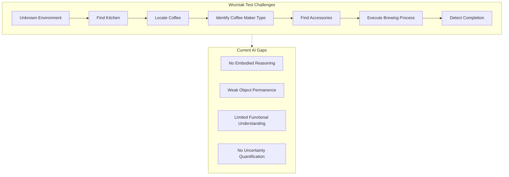
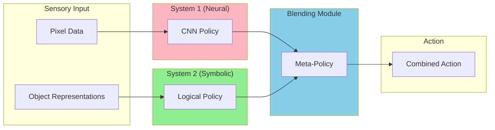
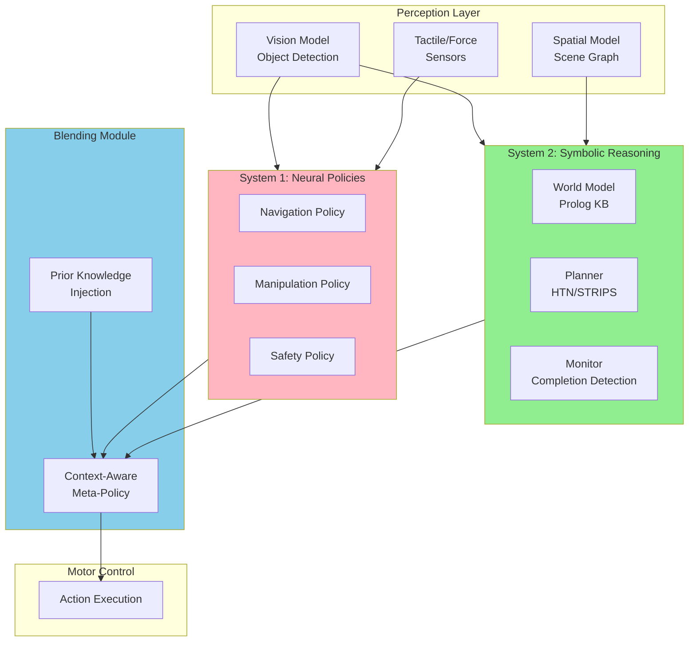
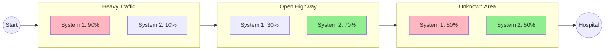

# The Wozniak Coffee Test: Why AI Still Can't Make Coffee in Your Kitchen

## Introduction

Steve Wozniak once proposed a deceptively simple benchmark for artificial intelligence: *An AI would be truly intelligent when it could walk into an unfamiliar house, find the coffee, locate the coffee maker, and brew a good cup of coffee.*

This "Wozniak Coffee Test" has remained unsolved for years — not because we lack powerful models, but because it exposes fundamental gaps in how AI systems reason about the world. Unlike the Turing Test, which measures conversational ability, Wozniak's test demands **embodied intelligence**: the ability to operate in novel environments with incomplete information, combine prior knowledge with real-time perception, and execute multi-step physical tasks.

This article proposes a **neurosymbolic architecture** for solving the Wozniak Coffee Test, inspired by Daniel Kahneman's dual-process theory and recent advances in neurosymbolic game-playing agents. We'll explore how combining neural perception (System 1) with symbolic reasoning (System 2) through a dynamic **Blending Module** could finally enable AI to make coffee in your kitchen.

## The Challenge: Why Can't AI Make Coffee?

Let's decompose the Wozniak Coffee Test into its fundamental challenges:

### 1. Absence of Initial Conditions

The AI enters an **unknown environment** with no prior mapping:
- Where is the kitchen?
- Where is the coffee stored?
- What type of coffee maker is available?
- Where are the cups, water, filters?

### 2. Commonsense World Models

The AI must have implicit models of:
- What a typical kitchen looks like
- Where coffee is usually stored (cabinet, counter, pantry)
- The functional relationships between objects (filter → coffee maker → water)
- The process of brewing coffee (steps, timing, completion criteria)

### 3. Object Recognition Under Uncertainty

The AI must identify:
- Coffee (ground, beans, pods?) among similar-looking substances
- Coffee maker (drip, French press, espresso, Keurig?)
- Filters (paper, metal mesh, built-in?)
- Related tools (kettle, grinder, measuring scoop)

### 4. Functional Reasoning

Understanding not just *what* objects are, but *how they work*:
- This knob controls the burner
- This button starts the brewing cycle
- This lever releases the water reservoir
- This light indicates "ready"

### 5. Completion Detection

Perhaps the hardest part — knowing when the coffee is "done":
- Drip coffee: Sound changes, dripping stops
- French press: Time-based (4 minutes)
- Espresso: Color and flow rate change
- As Wozniak noted: even "Dona Maria" checks before declaring it ready



## The Inspiration: Kahneman's Dual-Process Theory

Daniel Kahneman's research on human cognition describes two distinct modes of thinking:

### System 1: Fast, Intuitive, Automatic

- Processes sensory input instantly
- Pattern matching from experience
- Emotional reactions and reflexes
- "Hot" cognition — immediate responses

**Example**: Seeing a stove burner glowing red and instantly knowing "hot, don't touch."

### System 2: Slow, Deliberate, Logical

- Sequential reasoning and planning
- Mathematical calculation
- Conscious decision-making
- "Cold" cognition — analytical processing

**Example**: Calculating whether there's enough coffee for 6 cups given the bag's remaining weight.

### The Key Insight

Humans don't choose between systems — we **blend** them dynamically based on context:

| Situation | System 1 Weight | System 2 Weight |
|-----------|-----------------|-----------------|
| Hot oil splatters | 95% | 5% |
| Following a new recipe | 20% | 80% |
| Routine morning coffee | 70% | 30% |
| Coffee maker malfunction | 30% | 70% |

This dynamic blending is what current AI lacks — and what we need to solve the Wozniak Test.

## The Shindo Architecture: Neurosymbolic Game Agents

Recent work by Daiki Shindo on neurosymbolic agents for Atari games demonstrates a practical implementation of System 1/System 2 blending:

### Architecture Components



### System 1: Convolutional Neural Network

- Processes raw pixels
- Learns reactive policies (dodge enemies, time jumps)
- Fast inference (~1ms)
- Handles novel visual situations through generalization

### System 2: Differentiable Logic

- Operates on object-centric representations (coordinates, velocities)
- Implements explicit reasoning (count divers, plan routes)
- Slower but precise
- Handles compositional goals

### The Blending Module

The innovation is the **meta-policy** that dynamically allocates weight:

```python
# Pseudocode for blending
def blend(state, s1_action, s2_action):
    # Meta-policy estimates optimal blend ratio
    alpha = blending_network(state)  # 0.0 to 1.0

    # Weighted combination
    action = alpha * s1_action + (1 - alpha) * s2_action
    return action
```

### Results in Games

| Game | Challenge | System 1 Role | System 2 Role | Result |
|------|-----------|---------------|---------------|--------|
| **Kangaroo** | Save baby at top | Punch blocking monkeys | Plan route up ladders | Solves sparse reward |
| **Seaquest** | Rescue divers | Avoid enemies, collect divers | Count divers (6), surface for air | Optimal surfacing |

The key finding: **joint training** of all components (CNN, logic policy, blending module) via end-to-end gradient descent produces emergent behaviors that neither system alone could achieve.

## Proposed Architecture: Coffee Agent

We now apply these insights to the Wozniak Coffee Test. Here's a neurosymbolic architecture that could solve it:

### High-Level Design



### Component Details

#### Perception Layer

**Vision Model**: Object detection and recognition
- Pre-trained on household objects (ImageNet, COCO)
- Fine-tuned on kitchen-specific items
- Outputs: bounding boxes, object classes, confidence scores

**Spatial Model**: Scene understanding
- Constructs scene graphs (object relationships)
- Tracks object permanence (coffee is in cabinet even when door closed)
- Outputs: spatial predicates for System 2

**Tactile Sensors**: Physical feedback
- Force sensing for manipulation
- Temperature sensing for safety
- Outputs: continuous signals for System 1

#### System 1: Neural Policies

**Navigation Policy**: Move through environment
- Input: RGB-D image, current pose
- Output: velocity commands
- Training: imitation learning from human demonstrations

**Manipulation Policy**: Interact with objects
- Input: object pose, gripper state
- Output: end-effector trajectory
- Training: reinforcement learning with shaped rewards

**Safety Policy**: Prevent harm
- Input: full sensor state
- Output: override signals (stop, retract, alert)
- Training: safety constraints, adversarial scenarios

#### System 2: Symbolic Reasoning

**World Model** (Prolog Knowledge Base):

```prolog
% Commonsense knowledge about kitchens
typical_location(coffee, [cabinet, counter, pantry]).
typical_location(coffee_maker, [counter]).
typical_location(cups, [cabinet, dish_rack]).
typical_location(water_source, [sink, refrigerator]).

% Functional relationships
requires(coffee_maker, [coffee, water, filter, cup]).
requires(drip_coffee, [ground_coffee]).
requires(pod_coffee, [coffee_pod]).

% Process models
brewing_complete(drip) :-
    not(dripping),
    carafe_level(L), L > 0.

brewing_complete(french_press) :-
    elapsed_time(T), T >= 240.  % 4 minutes

brewing_complete(espresso) :-
    flow_stopped,
    shot_volume(V), V >= 30.  % 30ml minimum
```

**Planner** (Hierarchical Task Network):

```yaml
# HTN for coffee brewing
task: make_coffee
  subtasks:
    - find_kitchen:
        methods: [visual_search, ask_human, explore_systematically]
    - locate_coffee_maker:
        methods: [check_counter, check_cabinets, ask_human]
    - identify_coffee_maker_type:
        methods: [visual_classification, read_labels, functional_test]
    - gather_supplies:
        depends_on: [coffee_maker_type]
        subtasks: [find_coffee, find_filter, find_cup, get_water]
    - execute_brewing:
        depends_on: [coffee_maker_type, supplies_gathered]
    - monitor_completion:
        methods: [sensor_based, time_based, visual_inspection]
```

**Monitor**: Completion detection
- Tracks brewing state via sensors and vision
- Applies completion criteria from knowledge base
- Handles uncertainty ("check before declaring done")

#### Blending Module

**Meta-Policy Network**:

```python
class BlendingModule(nn.Module):
    def __init__(self):
        self.context_encoder = TransformerEncoder(...)
        self.blend_head = MLP(hidden_dim, 3)  # [nav, manip, safety] weights

    def forward(self, state, s1_actions, s2_plan):
        # Encode full context
        context = self.context_encoder(state)

        # Compute blend weights per action type
        weights = torch.softmax(self.blend_head(context), dim=-1)

        # Apply prior knowledge constraints
        if state.danger_detected:
            weights[2] = 0.9  # Override to safety

        return self.blend(s1_actions, s2_plan, weights)
```

**Prior Knowledge Injection**:

Users can inject commonsense rules:

```yaml
blending_rules:
  - condition: "danger_nearby OR hot_surface_detected"
    action: "prioritize_safety_policy"
    weight_override: {safety: 0.95}

  - condition: "navigating_unknown_space"
    action: "blend_exploration"
    weight_override: {navigation: 0.7, planning: 0.3}

  - condition: "manipulating_fragile_object"
    action: "prioritize_precision"
    weight_override: {manipulation: 0.4, planning: 0.6}

  - condition: "coffee_brewing_in_progress"
    action: "monitor_mode"
    weight_override: {monitoring: 0.8, safety: 0.2}
```

## Implementation with The Edge Agent

We've implemented two runnable agents that demonstrate these concepts. Unlike conceptual architectures, these actually execute and produce results.

### Agent 1: System 1/System 2 Blending Demo

This agent demonstrates Kahneman's dual-process theory in action — a delivery robot that dynamically blends reactive (System 1) and deliberative (System 2) decision-making based on danger level.

**File:** `examples/wozniak-test/system1-system2-blending.yaml`

**Key Components:**
- **System 1 Node** (Lua): Fast reactive responses to obstacles
- **System 2 Node** (Prolog): Deliberate route planning with constraints
- **Blending Module** (Lua): Context-aware weight allocation

```yaml
# Core blending logic (simplified)
- name: blend_systems
  language: lua
  run: |
    local danger = state.danger_level or 0.2

    -- Dynamic weight allocation based on context
    if danger > 0.7 then
      -- Emergency: 90% reactive, 10% planning
      s1_weight, s2_weight = 0.9, 0.1
    elseif danger > 0.4 then
      -- Moderate: 60% reactive, 40% planning
      s1_weight, s2_weight = 0.6, 0.4
    else
      -- Safe: 20% reactive, 80% planning
      s1_weight, s2_weight = 0.2, 0.8
    end

    return {blend_weights = {system1 = s1_weight, system2 = s2_weight}}
```

### Agent 2: Coffee Agent Simulation

This agent simulates the full Wozniak Coffee Test using symbolic reasoning. It demonstrates:
- **Commonsense Knowledge Base** (Prolog): Typical kitchen layouts, item locations
- **Uncertainty-Aware Search** (Lua): Probabilistic item finding
- **Process Execution** (Lua): Step-by-step brewing with failure handling
- **Dona Maria Verification** (Prolog): Completion confidence checking

**File:** `examples/wozniak-test/coffee-agent-simulation.yaml`

```yaml
name: coffee-agent-simulation
description: Simulates the Wozniak Coffee Test using symbolic reasoning

state_schema:
  kitchen_type: str
  coffee_maker_type: str
  world_model: dict
  search_results: dict
  brewing_state: dict
  verification: dict
  final_result: str

nodes:
  # Prolog: Commonsense knowledge base for kitchens
  - name: build_world_model
    language: prolog
    run: |
      % Typical locations for coffee-related items
      typical_location(coffee, [cabinet, counter, pantry]).
      typical_location(coffee_maker, [counter]).
      typical_location(cups, [cabinet, dish_rack]).

      % Coffee maker requirements
      requires(drip, [ground_coffee, filter, water, cup]).
      requires(pod, [coffee_pod, water, cup]).
      requires(french_press, [coarse_coffee, hot_water, cup]).

      % Process steps by coffee maker type
      process_steps(drip, [add_filter, add_coffee, add_water, press_start, wait, pour]).
      process_steps(pod, [insert_pod, place_cup, press_button, wait]).

      state(kitchen_type, KitchenType),
      state(coffee_maker_type, CoffeeMakerType),
      (requires(CoffeeMakerType, Reqs) -> true ; Reqs = []),
      (process_steps(CoffeeMakerType, Steps) -> true ; Steps = []),

      return(world_model, _{
        kitchen_type: KitchenType,
        required_items: Reqs,
        process_steps: Steps
      }).

  # Lua: Search for items using commonsense-guided exploration
  - name: search_items
    language: lua
    run: |
      local world = state.world_model or {}
      local required = world.required_items or {}
      -- Simulate finding items based on typical locations
      -- (Full implementation in examples/wozniak-test/)

  # Prolog: The "Dona Maria Principle" - verify before declaring done
  - name: verify_completion
    language: prolog
    run: |
      state(brewing_state, BrewState),
      (get_dict(status, BrewState, completed) ->
        Passed = true, Confidence = 0.95
      ;
        Passed = false, Confidence = 0.0
      ),
      return(verification, _{passed: Passed, confidence: Confidence}).

edges:
  - from: __start__
    to: build_world_model
  - from: build_world_model
    to: search_items
  # ... (see full file for complete edges)
```

The full implementations are available in the repository:
- [`examples/wozniak-test/system1-system2-blending.yaml`](https://github.com/fabceolin/the_edge_agent/blob/main/examples/wozniak-test/system1-system2-blending.yaml)
- [`examples/wozniak-test/coffee-agent-simulation.yaml`](https://github.com/fabceolin/the_edge_agent/blob/main/examples/wozniak-test/coffee-agent-simulation.yaml)

## Try It Yourself

### Prerequisites

```bash
# Install The Edge Agent (Python version for full Prolog support)
cd the_edge_agent/python
pip install -e .
```

### Example 1: System 1/System 2 Blending

Test how the blending weights change based on danger level:

**Low Danger (System 2 Dominant):**
```bash
python -m the_edge_agent.cli run examples/wozniak-test/system1-system2-blending.yaml \
  --input '{"scenario": "delivery", "danger_level": 0.2, "distance_to_goal": 500}'
```

**Output:**
```json
{
  "blend_weights": {"system1": 0.2, "system2": 0.8},
  "dominant_system": "System 2 (Deliberative)",
  "action": "execute_plan",
  "reasoning": "Following optimal plan"
}
```

**High Danger (System 1 Dominant):**
```bash
python -m the_edge_agent.cli run examples/wozniak-test/system1-system2-blending.yaml \
  --input '{"scenario": "delivery", "danger_level": 0.8, "distance_to_goal": 500}'
```

**Output:**
```json
{
  "blend_weights": {"system1": 0.9, "system2": 0.1},
  "dominant_system": "System 1 (Reactive)",
  "action": "evade",
  "direction": "swerve_right",
  "reasoning": "Obstacle detected at close range - reflex avoidance"
}
```

### Example 2: Coffee Agent Simulation

**Successful Brew (Modern Kitchen):**
```bash
python -m the_edge_agent.cli run examples/wozniak-test/coffee-agent-simulation.yaml \
  --input '{"kitchen_type": "modern", "coffee_maker_type": "drip"}'
```

**Output:**
```json
{
  "summary": {
    "kitchen_analyzed": "modern",
    "coffee_maker_used": "drip",
    "items_found": true,
    "brewing_completed": true,
    "verified": true,
    "confidence": 0.95,
    "wozniak_test": "PASSED"
  },
  "final_result": "SUCCESS: Coffee ready!\nConfidence: 95%\nVerification: High confidence - ready to serve"
}
```

**Failed Brew (Minimalist Kitchen):**
```bash
python -m the_edge_agent.cli run examples/wozniak-test/coffee-agent-simulation.yaml \
  --input '{"kitchen_type": "minimalist", "coffee_maker_type": "espresso"}'
```

**Output:**
```json
{
  "summary": {
    "kitchen_analyzed": "minimalist",
    "items_found": false,
    "wozniak_test": "NEEDS_IMPROVEMENT"
  },
  "final_result": "FAILED: Could not complete coffee\nReason: Missing items: cup"
}
```

This demonstrates realistic failure modes — in a minimalist kitchen with lower item-finding probability, the agent may fail to locate all necessary items, just as a human might struggle in an unfamiliar, sparsely organized kitchen.

## The Ambulance Driver Analogy

Think of this architecture like an **ambulance driver**:

| Component | Ambulance Driver | Coffee Agent |
|-----------|------------------|--------------|
| **System 1** | Reflexes: braking, swerving, throttle control | Reactive: obstacle avoidance, safety responses |
| **System 2** | Route planning: fastest path to hospital | Task planning: HTN decomposition, search strategies |
| **Blending** | Context switch: traffic → reflexes; open road → planning | Context switch: danger → safety; unknown → exploration |
| **Prior Knowledge** | "Hospitals have emergency entrances at rear" | "Coffee is usually in upper cabinets" |
| **Completion** | "Arrived when parked at ER and patient handed off" | "Done when cup has coffee and brewing stopped" |



## Key Innovations Required

To fully solve the Wozniak Test, several research advances are needed:

### 1. Robust Object-Centric Perception

Current limitation: Shindo's system requires "high-quality object representations."

Solution needed:
- Zero-shot object detection for novel items
- Functional affordance recognition ("this knob can be turned")
- Multi-modal fusion (vision + tactile + audio)

### 2. Commonsense Reasoning at Scale

Current limitation: Hand-coded knowledge bases don't scale.

Solution needed:
- Extract commonsense from LLMs into structured KB
- Learn spatial priors from embodied experience
- Transfer knowledge across environments

### 3. Deep Planning Under Uncertainty

Current limitation: No multi-step lookahead with unknown states.

Solution needed:
- Monte Carlo Tree Search with neural value estimates
- Robust planning that handles partial observability
- Recovery strategies when plans fail

### 4. Continuous Learning

Current limitation: Static policies don't adapt.

Solution needed:
- Online adaptation to new environments
- Few-shot learning of new appliances
- Human feedback integration

## Conclusion

The Wozniak Coffee Test remains unsolved because it requires the integration of capabilities that current AI systems handle in isolation:

| Capability | Current State | Required for Coffee Test |
|------------|---------------|--------------------------|
| **Object Recognition** | Good on known objects | Robust on novel kitchen items |
| **Spatial Reasoning** | Limited | Full 3D scene understanding |
| **Task Planning** | Works in simulation | Real-world uncertainty handling |
| **Manipulation** | Lab demonstrations | Reliable in unknown environments |
| **Commonsense** | Implicit in LLMs | Explicit, actionable knowledge |
| **System Blending** | Research prototypes | Production-ready meta-policies |

The neurosymbolic architecture presented here — combining neural perception and reactive policies (System 1) with symbolic reasoning and planning (System 2) through a dynamic Blending Module — provides a blueprint for solving this challenge.

The key insight from Kahneman's work is that **intelligence is not choosing between fast and slow thinking — it's knowing when to use each**. Current AI systems are either all System 1 (deep learning) or all System 2 (classical planning). The Wozniak Test demands their integration.

When an AI can finally make coffee in Dona Maria's kitchen — finding the coffee in her specific cabinet, using her particular coffee maker, and knowing when it's ready by the same subtle cues she uses — we'll have achieved something profound: not just artificial intelligence, but artificial **wisdom**.

## References

- Kahneman, D. (2011). *Thinking, Fast and Slow*. Farrar, Straus and Giroux.
- Shindo, D., et al. (2023). "Neurosymbolic Reinforcement Learning with Hybrid Action Spaces."
- Garcez, A., & Lamb, L. (2023). "Neurosymbolic AI: The 3rd Wave." *Artificial Intelligence Review*.
- The Edge Agent (TEA): https://github.com/fabceolin/the_edge_agent
- Wozniak Coffee Test: Multiple interviews and tech conference discussions.

## Appendix: Why "Dona Maria" Checks

The observation that even experienced humans "check before declaring done" reveals something profound about completion detection:

1. **Sensory uncertainty**: Visual, auditory, and olfactory cues all contribute
2. **Process variation**: Same coffee maker behaves differently each time
3. **Quality judgment**: "Done" isn't just "stopped" — it's "good coffee"
4. **Error recovery**: Checking allows catching problems early

Any robust coffee-making AI must incorporate this "final verification" step — acknowledging that completion is a judgment, not just a state transition.

```prolog
% The Dona Maria Principle
truly_complete(Task) :-
    mechanically_complete(Task),
    verified_by_inspection(Task),
    quality_acceptable(Task).

% Never skip the check
make_coffee_done :-
    brewing_stopped,
    \+ verified_complete,  % Haven't checked yet
    !,
    verify_completion.     % Do the "Dona Maria check"

make_coffee_done :-
    brewing_stopped,
    verified_complete,
    quality_check_passed.
```
