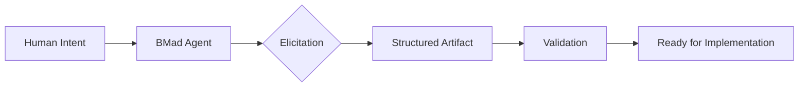
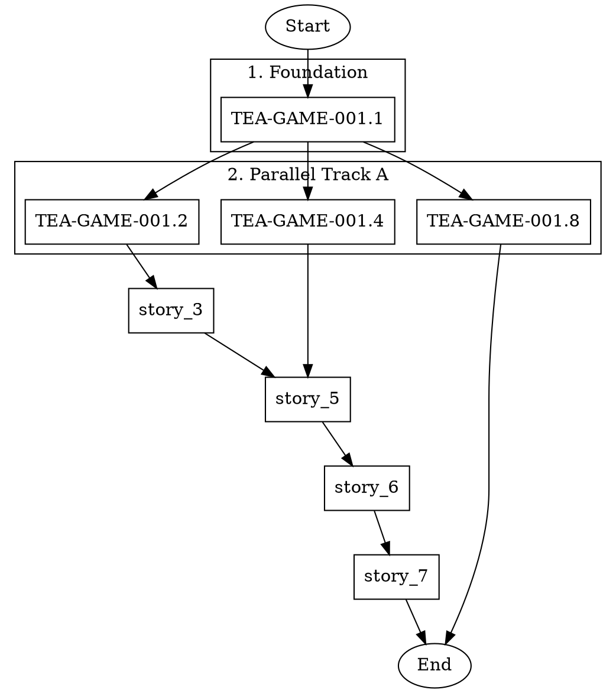
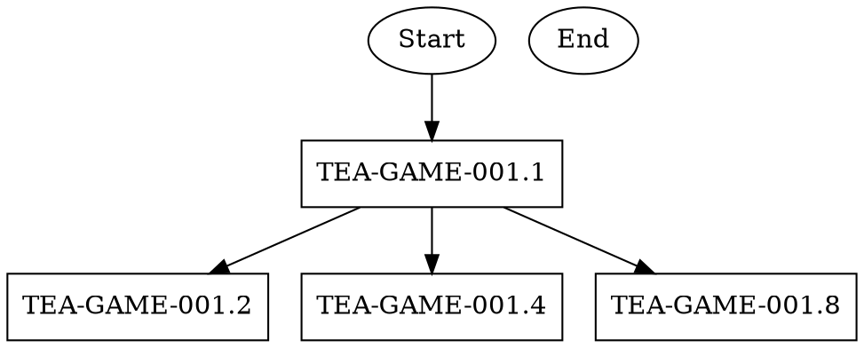

# Writing TEA Features with TEA: A Meta-Development Approach

**Fabricio Ceolin**

*Principal Engineer, The Edge Agent Project*

fabricio@rankellix.com

---

## Abstract

This article presents a meta-development methodology where The Edge Agent (TEA) orchestrates its own feature development. By combining BMad structured workflows for story creation with TEA-powered parallel execution, we achieve higher code quality and faster iteration cycles. The key insight is separating concerns: BMad agents excel at human-guided elicitation and documentation, while TEA excels at clean-context parallel execution. We demonstrate this approach using a real example—implementing an 8-story game feature epic—showing how dependency analysis enables 25% reduction in execution time through intelligent parallelization.

**Keywords:** TEA, BMad, Meta-Development, Parallel Execution, Story Validation, DOT Workflows

---

## Reproducibility

This article uses code from a specific commit in The Edge Agent repository. To follow along:

```bash
git clone https://github.com/fabceolin/the_edge_agent.git
cd the_edge_agent
git checkout 2f5bdbb4e70bd47bdc7f28022656d7a58b69a817
```

**Commit:** `2f5bdbb4e70bd47bdc7f28022656d7a58b69a817`

**Repository:** [github.com/fabceolin/the_edge_agent](https://github.com/fabceolin/the_edge_agent)

---

## 1. Introduction

When developing complex features for The Edge Agent, we face a paradox: the very tool we're building could help us build it better. This article explores how we leverage TEA to accelerate TEA development, creating a virtuous cycle of meta-improvement.

The traditional AI-assisted development workflow looks like this:

```
Human → AI Chat → Code → Review → Iterate
```

Each iteration carries context from previous attempts, accumulating cognitive debt. The AI's context window fills with failed approaches, abandoned directions, and incremental fixes.

What if we could guarantee clean context for each execution?

```
BMad: Create perfect story specifications
TEA:  Execute each story with fresh context
DOT:  Orchestrate parallel execution
```

This separation of concerns gives us the best of both worlds: BMad's human-in-the-loop elicitation produces high-quality specifications, while TEA's workflow engine guarantees isolated, reproducible execution.

### 1.1 The Problem with Context Accumulation

Consider developing a feature over multiple chat sessions:

| Session | Context State | Quality Impact |
|---------|---------------|----------------|
| 1 | Fresh context | High quality decisions |
| 2 | Previous mistakes loaded | May repeat patterns that failed |
| 3 | Accumulated corrections | Defensive coding, over-engineering |
| 4 | Context window pressure | Forgotten requirements, inconsistencies |

By Session 4, the AI is juggling too much history. It may remember that "we tried X and it failed" but forget *why* it failed, leading to suboptimal alternatives.

## 2. The BMad Method: Getting Stories Right

[BMad (Breakthrough Method for Agile AI-Driven Development)](https://github.com/bmad-code-org/BMAD-METHOD) provides the structured foundation for high-quality AI-assisted development.

### 2.1 What Makes BMad Different

Unlike traditional AI coding assistants that "do the thinking for you, producing average results," BMad positions AI agents as **expert guides** through structured workflows:



### 2.2 BMad Agent Roles

BMad deploys specialized agents for different concerns:

| Agent | Role | Key Contribution |
|-------|------|------------------|
| **PO (Sarah)** | Product Owner | Story refinement, acceptance criteria |
| **Architect** | System Design | Technical decisions, dependency analysis |
| **QA** | Quality Assurance | Test design, risk identification |
| **SM** | Scrum Master | Story validation, Definition of Ready |
| **Dev** | Developer | Implementation, code quality |

### 2.3 The One-Shot Advantage

BMad's elicitation process ensures stories are **complete before implementation begins**. This is critical because:

1. **No mid-implementation pivots** - Requirements are validated upfront
2. **Clear acceptance criteria** - The AI knows exactly what "done" looks like
3. **Dependency mapping** - Stories can be parallelized safely
4. **Test design included** - QA validates before code is written

Here's an example of BMad-produced story structure:

```yaml
# Story created by BMad PO Agent
name: TEA-GAME-001.1
title: Rust Game Engine Core
status: Draft

acceptance_criteria:
  - AC-1: GameSession struct with required fields
  - AC-2: GameRound struct with phrase and choices
  - AC-3: generate_username() returns random pattern
  - AC-4: calculate_score() implements weighted formula
  - AC-5: adjust_difficulty() uses rolling window
  - AC-6: Difficulty bounded to [0.1, 0.95]
  - AC-7: Unit tests for all calculations

tasks:
  - Create rust/src/games/mod.rs module
  - Implement GameSession and GameRound structs
  - Implement generate_username() with word lists
  # ... detailed subtasks
```

## 3. The Context Problem: Why TEA Instead of BMad Workflows

BMad agents run within a conversational context (Claude Code, Cursor, etc.). While this enables rich human interaction, it creates a problem for **autonomous parallel execution**.

### 3.1 BMad's Conversational Context

```
┌─────────────────────────────────────────────────────────┐
│                  CLAUDE CODE SESSION                     │
├─────────────────────────────────────────────────────────┤
│  Turn 1: /po *create-story TEA-GAME-001.1               │
│  Turn 2: [PO creates story, asks clarifying questions]  │
│  Turn 3: User provides answers                          │
│  Turn 4: [PO refines story]                             │
│  ...                                                     │
│  Turn 50: Context window filling up                     │
│  Turn 100: Earlier decisions forgotten                  │
└─────────────────────────────────────────────────────────┘
```

When running 8 stories sequentially in one session, context from Story 1 affects Story 8. This is sometimes desirable (learning from patterns) but often problematic (accumulated noise).

### 3.2 TEA's Clean Context Guarantee

TEA workflows execute in **isolated contexts**:

```
┌─────────────────────────────────────────────────────────┐
│                    TEA WORKFLOW                          │
├─────────────────────────────────────────────────────────┤
│  Node 1: Load story file (fresh context)                │
│  Node 2: Execute validation (isolated)                  │
│  Node 3: Write results (clean output)                   │
│  [Process terminates, context released]                 │
└─────────────────────────────────────────────────────────┘
```

Each story validation runs in a completely fresh subprocess:

```yaml
# bmad-story-validation.yaml
nodes:
  - name: run_qa_test_design
    uses: llm.call
    with:
      provider: shell
      shell_provider: claude
      model: claude
      messages:
        - role: user
          content: |
            CRITICAL: ACTIVATE PERSONA MODE.
            {{ state.agent_persona }}

            TASK: Perform *test-design for story {{ state.arg }}.
            {{ state.task_definition }}

            MODE: YOLO - Do NOT ask permission. Execute commands.
```

The `shell_provider: claude` spawns a fresh Claude Code instance for each node execution. No context bleeds between stories.

### 3.3 Comparison Table

| Aspect | BMad (Conversational) | TEA (Workflow) |
|--------|----------------------|----------------|
| **Context** | Accumulated across session | Fresh per execution |
| **Parallelization** | Sequential only | Parallel via DOT |
| **Human Interaction** | Rich, real-time | Pre-configured |
| **Best For** | Elicitation, refinement | Execution, validation |
| **Reproducibility** | Varies by session | Deterministic |

## 4. Parallelizing Story Validation with DOT

With BMad stories ready and TEA workflows defined, we can orchestrate parallel execution using DOT (Graphviz) graphs.

### 4.1 Dependency Analysis

Given an epic with 8 stories, the first step is mapping dependencies:

| Story | Depends On | Can Parallelize With |
|-------|------------|---------------------|
| 1. Rust Core | None | - |
| 2. DuckDB Schema | Story 1 | Stories 4, 8 |
| 3. Embeddings | Story 2 | - |
| 4. LLM Phrase Gen | Story 1 | Stories 2, 8 |
| 5. Game Engine | Stories 3, 4 | - |
| 6. WASM Port | Story 5 | - |
| 7. Browser UI | Story 6 | - |
| 8. Opik Integration | Story 1 | Stories 2, 4 |

### 4.2 The DOT Workflow



### 4.3 Visual Dependency Graph

```
                    ┌─────────────────┐
                    │     Start       │
                    └────────┬────────┘
                             │
                    ┌────────▼────────┐
                    │   Story 1       │  Phase 1
                    │ (Rust Core)     │
                    └────────┬────────┘
                             │
           ┌─────────────────┼─────────────────┐
           │                 │                 │
    ┌──────▼──────┐   ┌──────▼──────┐   ┌──────▼──────┐
    │  Story 2    │   │  Story 4    │   │  Story 8    │  Phase 2
    │  (DuckDB)   │   │  (LLM Gen)  │   │  (Opik)     │  PARALLEL
    └──────┬──────┘   └──────┬──────┘   └──────┬──────┘
           │                 │                 │
    ┌──────▼──────┐          │                 │
    │  Story 3    │          │                 │  Phase 3
    │ (Embeddings)│          │                 │
    └──────┬──────┘          │                 │
           │                 │                 │
           └────────┬────────┘                 │
                    │                          │
             ┌──────▼──────┐                   │
             │  Story 5    │                   │  Phase 4
             │ (GameEngine)│                   │
             └──────┬──────┘                   │
                    │                          │
             ┌──────▼──────┐                   │
             │  Story 6    │                   │  Phase 5
             │ (WASM Port) │                   │
             └──────┬──────┘                   │
                    │                          │
             ┌──────▼──────┐                   │
             │  Story 7    │                   │  Phase 6
             │ (Browser UI)│                   │
             └──────┬──────┘                   │
                    │                          │
                    └────────────┬─────────────┘
                                 │
                    ┌────────────▼────────────┐
                    │          End            │
                    └─────────────────────────┘
```

### 4.4 Efficiency Gain

| Metric | Sequential | Parallelized | Improvement |
|--------|------------|--------------|-------------|
| Total Phases | 8 | 6 | 25% reduction |
| Max Parallel | 1 | 3 | 3x throughput |
| Story 8 (Opik) | Waits for 1-7 | Runs with 2,4 | ~70% faster |

## 5. Setup: Configuring Claude Code as Backend

Before running TEA workflows that use Claude Code as the LLM backend, you need to configure your environment.

### 5.1 Prerequisites

1. **TEA Python** installed:
   ```bash
   cd python
   pip install -e .[dev]
   ```

2. **Claude Code CLI** installed and authenticated:
   ```bash
   # Install Claude Code (if not already installed)
   npm install -g @anthropic-ai/claude-code

   # Authenticate with your Anthropic API key
   claude auth
   ```

3. **BMad v4 (Required)** - The Ralphy workflows require BMad v4 story format:
   ```
   .bmad-core/
   ├── agents/
   │   ├── qa.md          # QA agent persona
   │   ├── sm.md          # Scrum Master agent persona
   │   ├── po.md          # Product Owner agent persona
   │   └── dev.md         # Developer agent persona
   ├── tasks/
   │   ├── test-design.md        # Test design task
   │   ├── validate-next-story.md # Story validation task
   │   └── qa-gate.md            # QA gate task
   ├── checklists/
   │   ├── story-draft-checklist.md
   │   └── po-master-checklist.md
   └── templates/
       └── story-tmpl.yaml       # Story template
   ```

   To verify BMad v4 is installed:
   ```bash
   # Check for .bmad-core directory
   ls -la .bmad-core/

   # Check for required task files
   ls .bmad-core/tasks/validate-next-story.md
   ```

   If you don't have BMad v4, see the [BMad Setup Guide](https://github.com/bmad-code-org/BMAD-METHOD) to initialize it.

### 5.2 The Shell Provider Configuration

TEA's `llm.call` action supports a `shell_provider` that spawns external CLI tools. For Claude Code:

```yaml
nodes:
  - name: run_validation
    uses: llm.call
    with:
      provider: shell           # Use shell-based LLM provider
      shell_provider: claude    # Spawn Claude Code CLI
      model: claude             # Model selection handled by Claude Code
      timeout: 600              # 10 minutes per node
      messages:
        - role: user
          content: |
            Your prompt here...
```

**How it works:**

1. TEA invokes `claude` CLI as a subprocess
2. The prompt is passed via stdin
3. Claude Code executes with fresh context (no history)
4. Output is captured and returned to TEA state

### 5.3 Environment Variables

Set these environment variables for optimal execution:

```bash
# Required: Anthropic API key (Claude Code will use this)
export ANTHROPIC_API_KEY="sk-ant-..."

# Optional: Control Claude Code behavior
export CLAUDE_CODE_AUTO_ACCEPT=1    # Auto-accept tool calls
export CLAUDE_CODE_NO_CONFIRM=1     # Skip confirmation prompts
```

### 5.4 Verify Setup

Test that Claude Code works as a shell provider:

```bash
# Simple test
echo "Say hello" | claude --print

# Test with TEA
tea-python run examples/workflows/bmad-story-validation.yaml \
    --input '{"arg": "docs/stories/TEA-GAME-001.1-rust-game-engine-core.md"}' \
    --dry-run
```

---

## 6. Execution: From DOT to Running Workflow

### 6.1 Generate YAML from DOT

```bash
# Convert DOT to executable YAML workflow
tea-python from dot examples/dot/tea-game-001-validation.dot \
    --use-node-commands \
    -o examples/dot/tea-game-001-validation.yaml
```

### 6.2 Execute the Workflow

```bash
# Run with extended timeout (15 hours for large epics)
tea-python run examples/dot/tea-game-001-validation.yaml \
    --input-timeout 54000
```

### 6.3 What Happens During Execution

```
┌──────────────────────────────────────────────────────────────┐
│  tea-python run tea-game-001-validation.yaml                 │
├──────────────────────────────────────────────────────────────┤
│                                                              │
│  [Phase 1]  Story 1 ─────────────────────────► Complete      │
│                                                              │
│  [Phase 2]  Story 2 ─────────────────────────►┐              │
│             Story 4 ─────────────────────────►├─► All Done   │
│             Story 8 ─────────────────────────►┘              │
│                                                              │
│  [Phase 3]  Story 3 ─────────────────────────► Complete      │
│                                                              │
│  [Phase 4]  Story 5 ─────────────────────────► Complete      │
│                                                              │
│  [Phase 5]  Story 6 ─────────────────────────► Complete      │
│                                                              │
│  [Phase 6]  Story 7 ─────────────────────────► Complete      │
│                                                              │
│  ═══════════════════════════════════════════════════════════ │
│  WORKFLOW COMPLETE: 8 stories validated, 6 phases            │
└──────────────────────────────────────────────────────────────┘
```

## 7. Ralphy Workflows: Validate and Develop

TEA now includes two production-ready workflows for the complete development cycle: **ralphy-validate** for story validation and **ralphy-develop** for autonomous implementation.

### 7.1 The Validate-Then-Develop Cycle

```
┌─────────────────────────────────────────────────────────────────┐
│                    RALPHY DEVELOPMENT CYCLE                     │
├─────────────────────────────────────────────────────────────────┤
│                                                                 │
│   ┌───────────────┐        ┌────────────────┐                   │
│   │  BMad Story   │───────►│ ralphy-validate │                  │
│   │  (Draft)      │        │ (Check structure)│                 │
│   └───────────────┘        └────────┬───────┘                   │
│                                     │                           │
│                            ┌────────▼────────┐                  │
│                            │   PASS / FAIL   │                  │
│                            └────────┬────────┘                  │
│                                     │                           │
│           ┌─────────────────────────┼─────────────────────────┐ │
│           │                         │                         │ │
│           ▼ (FAIL)                  ▼ (PASS)                  │ │
│   ┌───────────────┐        ┌────────────────┐                 │ │
│   │  Fix Story    │        │ ralphy-develop │                 │ │
│   │  (Manual/PO)  │        │ (Implement)    │                 │ │
│   └───────┬───────┘        └────────┬───────┘                 │ │
│           │                         │                         │ │
│           └─────────────────────────┼─────────────────────────┘ │
│                                     │                           │
│                            ┌────────▼────────┐                  │
│                            │   Tests + PR    │                  │
│                            └─────────────────┘                  │
│                                                                 │
└─────────────────────────────────────────────────────────────────┘
```

### 7.2 Step 1: Validate Stories (ralphy-validate)

Before developing, validate your stories to ensure they have the required BMad structure:

```bash
# Validate a single story
cd python && tea run ../examples/workflows/ralphy-validate.yaml \
  --input '{"source": "../docs/stories/TEA-EXAMPLE-001.1.md"}'

# Validate all stories in an epic
cd python && tea run ../examples/workflows/ralphy-validate.yaml \
  --input '{"source": "../docs/stories/TEA-EXAMPLE-001.*.md"}'

# Strict mode (fail on warnings) - recommended for CI
cd python && tea run ../examples/workflows/ralphy-validate.yaml \
  --input '{"source": "../docs/stories/*.md", "strict": true}'

# JSON output for automation
cd python && tea run ../examples/workflows/ralphy-validate.yaml \
  --input '{"source": "../docs/stories/*.md", "output_format": "json"}'
```

**What validation checks:**

| Check | Type | Description |
|-------|------|-------------|
| `## Status` | Error | Required section |
| `## Story` | Error | Required section |
| `## Acceptance Criteria` | Error | Required section with numbered items |
| `## Tasks / Subtasks` | Error | Required section with checkbox tasks |
| Valid status value | Warning | Must be: Draft, Ready, In Progress, Ready for Review, Done, Blocked, Deferred |
| Task-AC linkage | Warning | Tasks should reference ACs with `(AC: 1, 2)` |

**Example output:**

```
===============================================================================
                    RALPHY VALIDATE - Story Validation Report
===============================================================================
Stories: 3 | Passed: 2 | Failed: 1
Errors: 1 | Warnings: 3
===============================================================================

[PASS] TEA-EXAMPLE-001.1.md
  i Status: Ready
  i Acceptance Criteria: 5
  i Tasks: 0/8 (0.0%)
  ! Only 5/8 tasks have AC references

[FAIL] TEA-EXAMPLE-001.2.md
  i Status: Draft
  x Missing required section: ## Acceptance Criteria
===============================================================================
```

### 7.3 Step 2: Implement Tasks (ralphy-develop)

Once validation passes, use `ralphy-develop` to implement tasks autonomously:

```bash
# Basic development run (sequential mode, Claude engine)
cd python && tea run ../examples/workflows/ralphy-develop.yaml \
  --input '{"source": "../docs/stories/TEA-EXAMPLE-001.1.md"}'

# Parallel mode with git worktrees
cd python && tea run ../examples/workflows/ralphy-develop.yaml \
  --input '{
    "source": "../docs/stories/TEA-EXAMPLE-001.1.md",
    "mode": "parallel",
    "max_concurrency": 4
  }'

# Graph mode (respects task dependencies)
cd python && tea run ../examples/workflows/ralphy-develop.yaml \
  --input '{
    "source": "../docs/stories/TEA-EXAMPLE-001.1.md",
    "mode": "graph",
    "max_concurrency": 4
  }'

# With visual tmux output
cd python && tea run ../examples/workflows/ralphy-develop.yaml \
  --input '{
    "source": "../docs/stories/TEA-EXAMPLE-001.1.md",
    "mode": "parallel",
    "output_to_tmux": true,
    "tmux_session": "ralphy",
    "tmux_layout": "tiled"
  }'
```

**Execution modes:**

| Mode | Description | Best For |
|------|-------------|----------|
| `sequential` | Tasks run one at a time | Simple stories, debugging |
| `parallel` | Tasks run in isolated git worktrees | Independent tasks, speed |
| `graph` | Respects `depends_on` task dependencies | Complex stories with ordering |

**Configuration options:**

| Option | Type | Default | Description |
|--------|------|---------|-------------|
| `source` | string | *required* | Story file path or glob |
| `engine` | string | `claude` | AI engine (claude, codex, gemini, opencode, cursor) |
| `mode` | string | `sequential` | Execution mode |
| `max_concurrency` | int | `4` | Max parallel tasks |
| `create_prs` | bool | `true` | Create PRs for tasks |
| `run_tests` | bool | `true` | Run tests after each task |
| `output_to_tmux` | bool | `false` | Visual output to tmux panes |

### 7.4 Complete Workflow Script

Here's a script that combines both workflows:

```bash
#!/bin/bash
# develop-story.sh - Complete validation + development cycle

STORY_FILE="$1"

if [ -z "$STORY_FILE" ]; then
  echo "Usage: ./develop-story.sh <story-file>"
  exit 1
fi

echo "=== Step 1: Validating story ==="
cd python

# Validate first
tea run ../examples/workflows/ralphy-validate.yaml \
  --input "{\"source\": \"$STORY_FILE\", \"strict\": true}" \
  > /tmp/validation.log 2>&1

if grep -q 'FAIL' /tmp/validation.log; then
  echo "Validation FAILED. Please fix the story first."
  cat /tmp/validation.log
  exit 1
fi

echo "=== Step 2: Validation passed! Starting development ==="

# Develop
tea run ../examples/workflows/ralphy-develop.yaml \
  --input "{
    \"source\": \"$STORY_FILE\",
    \"engine\": \"claude\",
    \"mode\": \"sequential\",
    \"run_tests\": true,
    \"create_prs\": true
  }"

echo "=== Development complete ==="
```

### 7.5 Parallel Development with DOT

For complex epics, combine DOT orchestration with ralphy-develop:



## 8. Best Practices

### 8.1 When to Use Each Approach

| Scenario | Recommended Approach |
|----------|---------------------|
| Initial story creation | BMad PO agent (human elicitation) |
| Story refinement | BMad PO/Architect (interactive) |
| Story validation | `ralphy-validate` (automated) |
| Bulk validation | `ralphy-validate` with glob pattern |
| Task implementation | `ralphy-develop` (clean context) |
| Complex epic execution | DOT workflow + `ralphy-develop` |
| Debugging failures | BMad Dev agent (conversational) |
| QA review | BMad QA agent or `bmad-review` workflow |

### 8.2 Validate-Then-Develop Discipline

1. **Always validate before developing** - Catch structural issues early
2. **Use strict mode in CI** - Ensures consistent story quality
3. **Fix validation errors before implementation** - Don't waste AI tokens on bad stories
4. **Link tasks to ACs** - Improves traceability and validation coverage

### 8.3 DOT Workflow Guidelines

1. **Simple Labels** - Use story IDs, not descriptions
2. **Explicit Dependencies** - Every edge represents a real constraint
3. **Timeout Planning** - Use `--input-timeout 54000` (15 hours) for complex stories
4. **Cluster Phases** - Group parallel stories in `subgraph cluster_*` blocks

### 8.4 Context Isolation Principles

1. **Each story = one execution** - Never batch stories in one context
2. **State via files** - Stories communicate through file system, not memory
3. **Idempotent operations** - Re-running a story should produce same result
4. **Explicit inputs** - All dependencies declared in DOT edges

### 8.5 Execution Mode Selection

| Mode | When to Use |
|------|-------------|
| `sequential` | Simple stories, debugging, learning the workflow |
| `parallel` | Independent tasks, speed is priority |
| `graph` | Tasks have dependencies (`depends_on` field) |
| `output_to_tmux` | Monitoring AI agents, debugging, demos |

## 9. Conclusion

The meta-development approach—using TEA to build TEA—provides several key advantages:

1. **Quality through separation** - BMad ensures story quality; TEA ensures execution quality
2. **Validate-then-develop discipline** - `ralphy-validate` catches issues before `ralphy-develop` runs
3. **Parallelization through analysis** - Dependency graphs enable safe concurrent execution
4. **Clean context guarantee** - Each story executes in isolation
5. **Reproducibility** - DOT workflows and Ralphy commands are version-controlled and repeatable

The TEA-GAME-001 epic demonstrates this in practice: 8 stories, 6 phases, 25% efficiency gain through parallelization, zero context contamination.

**The Ralphy workflows are now production-ready:**

- `ralphy-validate.yaml` - Validates BMad v4 story structure before development
- `ralphy-develop.yaml` - Implements tasks autonomously with multiple AI engines and execution modes

As TEA continues to evolve, this meta-development cycle accelerates: better TEA enables better TEA development, which produces better TEA.

## 10. References

- [BMad Method v4](https://github.com/bmad-code-org/BMAD-METHOD) - Breakthrough Method for Agile AI-Driven Development (Required)
- [TEA Documentation](https://fabceolin.github.io/the_edge_agent/) - The Edge Agent official docs
- [Ralphy Workflows README](../../examples/workflows/README-ralphy.md) - Complete guide to ralphy-validate and ralphy-develop
- [DOT Workflow Guide](../shared/DOT_WORKFLOW_ORCHESTRATION_LLM_GUIDE.md) - DOT-to-YAML conversion guide
- [Graphviz DOT Language](https://graphviz.org/doc/info/lang.html) - DOT syntax reference
