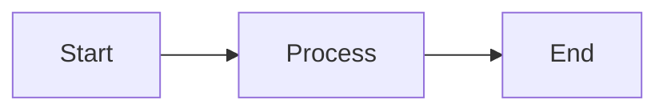
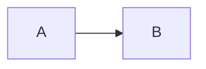

# Writing Articles for The Edge Agent Documentation

This guide explains how to write and publish articles for The Edge Agent documentation site.

## Overview

Articles are technical content published in the `docs/articles/` directory. They appear on the documentation website under the **Articles** section and follow a preprint-style format suitable for technical papers and tutorials.

## Quick Start

1. Create your article in `docs/articles/your-article-name.md`
2. Add the article to `docs/_toc.yml`
3. Build and preview locally
4. Submit a pull request

## Article Format

### File Location

All articles must be placed in:

```
docs/articles/your-article-name.md
```

Use kebab-case for filenames (e.g., `cloud-production-firebase.md`).

### Required Structure

Articles follow a preprint/academic format:

```markdown
# Article Title

**Author Name**

*Affiliation or Role*

email@example.com

---

## Abstract

A 3-5 sentence summary of the article covering:
- The problem being addressed
- The proposed solution
- Key results or benefits

**Keywords:** Keyword1, Keyword2, Keyword3

---

## 1. Introduction

Introduce the problem and motivation...

## 2. Section Title

Main content sections numbered sequentially...

## N. Conclusion

Summary and key takeaways...

## N+1. References

- [Reference 1](url) - Description
- [Reference 2](url) - Description
```

### Template

```markdown
# Your Article Title Here

**Your Name**

*Your Role/Affiliation*

your.email@example.com

---

## Abstract

Brief summary of your article. What problem does it solve? What approach do you take? What are the key results?

**Keywords:** Keyword1, Keyword2, Keyword3

---

## 1. Introduction

Why does this topic matter? What will readers learn?

## 2. Background (Optional)

Any prerequisite knowledge or context needed.

## 3. Main Content

Your primary content with:
- Code examples
- Diagrams (Mermaid supported)
- Step-by-step instructions

## 4. Implementation/Examples

Practical examples and code.

## 5. Best Practices (Optional)

Tips and recommendations.

## 6. Conclusion

Summary of key points and next steps.

## 7. References

- [The Edge Agent](https://github.com/fabceolin/the_edge_agent)
- Additional references...
```

## Adding to the Table of Contents

After creating your article, you **must** add it to `docs/_toc.yml` for it to appear on the site.

### Step 1: Open `_toc.yml`

```bash
# From repository root
vim docs/_toc.yml
# or
code docs/_toc.yml
```

### Step 2: Find the Articles Section

Look for:

```yaml
  - caption: Articles
    chapters:
      - file: articles/existing-article
        title: Existing Article Title
      # ... other articles
```

### Step 3: Add Your Article

Add a new entry at the end of the chapters list:

```yaml
  - caption: Articles
    chapters:
      # ... existing articles ...
      - file: articles/your-article-name    # No .md extension!
        title: Your Article Display Title
```

**Important:**
- Do NOT include the `.md` extension in the `file:` path
- The `title:` is what appears in the navigation menu
- Articles are displayed in the order they appear in `_toc.yml`

### Example

If you created `docs/articles/cloud-production-firebase.md`:

```yaml
  - caption: Articles
    chapters:
      - file: articles/serverless-ai-agents
        title: Serverless AI Agents
      - file: articles/cloud-production-firebase    # Add this
        title: Cloud Production with Firebase       # Add this
```

## Supported Features

### Code Blocks

Use fenced code blocks with language hints:

````markdown
```python
from the_edge_agent import YAMLEngine

engine = YAMLEngine()
graph = engine.load_from_file("agent.yaml")
```
````

### Mermaid Diagrams

Create diagrams using Mermaid syntax:

````markdown

````

### Admonitions

Use admonition blocks for notes and warnings:

```markdown
:::{note}
This is a note with important information.
:::

:::{warning}
This is a warning about potential issues.
:::

:::{tip}
This is a helpful tip.
:::
```

### Tables

Standard Markdown tables are supported:

```markdown
| Column 1 | Column 2 | Column 3 |
|----------|----------|----------|
| Value 1  | Value 2  | Value 3  |
```

### Math (LaTeX)

Use dollar signs for math:

```markdown
Inline math: $E = mc^2$

Block math:
$$
\sum_{i=1}^{n} x_i = x_1 + x_2 + ... + x_n
$$
```

## Building and Previewing

### Install Dependencies

```bash
cd docs
pip install -r requirements.txt
```

### Build the Documentation

```bash
# From docs/ directory
sphinx-build -b html . _build/html
```

### Preview Locally

```bash
# Open in browser
open _build/html/index.html

# Or use a local server
python -m http.server -d _build/html 8000
# Then visit http://localhost:8000
```

### Watch for Changes (Development)

```bash
# Install sphinx-autobuild
pip install sphinx-autobuild

# Auto-rebuild on changes
sphinx-autobuild . _build/html
```

## Style Guidelines

### Writing Style

1. **Be concise** - Get to the point quickly
2. **Use active voice** - "TEA processes the request" not "The request is processed by TEA"
3. **Include practical examples** - Show, don't just tell
4. **Explain the "why"** - Not just how to do something, but why it matters

### Code Examples

1. **Keep examples minimal** - Show only what's necessary
2. **Use realistic values** - Avoid "foo", "bar", "test123"
3. **Include comments** - Explain non-obvious code
4. **Test your code** - Ensure examples actually work

### Diagrams

1. **Use Mermaid** - It renders automatically
2. **Keep diagrams simple** - Focus on key concepts
3. **Use consistent styling** - Match existing documentation diagrams

## Checklist Before Submitting

- [ ] Article is in `docs/articles/` directory
- [ ] Filename uses kebab-case (e.g., `my-article.md`)
- [ ] Article follows the preprint format (Abstract, numbered sections)
- [ ] Added entry to `docs/_toc.yml`
- [ ] No `.md` extension in `_toc.yml` file path
- [ ] Built locally with `sphinx-build` to verify no errors
- [ ] All code examples are tested and working
- [ ] Diagrams render correctly
- [ ] Links are valid (internal and external)
- [ ] Spell-checked content

## Common Issues

### Article Not Appearing on Site

1. **Check `_toc.yml`** - Ensure entry is added correctly
2. **Verify filename** - Must match exactly (case-sensitive)
3. **No `.md` extension** - `_toc.yml` uses paths without extension
4. **Rebuild** - Run `sphinx-build` again

### Build Errors

```bash
# Common fix: check for syntax errors
sphinx-build -b html . _build/html 2>&1 | grep -i error
```

### Mermaid Not Rendering

Ensure your Mermaid block uses the correct fence:

````markdown

````

Not:

````markdown
```
flowchart LR
    A --> B
```
````

## Example: Complete Workflow

```bash
# 1. Create your article
cat > docs/articles/my-new-feature.md << 'EOF'
# My New Feature Guide

**Your Name**

*Role*

email@example.com

---

## Abstract

This article explains how to use the new feature...

**Keywords:** TEA, Feature, Tutorial

---

## 1. Introduction

...content...

## 2. References

- [TEA Documentation](https://fabceolin.github.io/the_edge_agent/)
EOF

# 2. Add to _toc.yml
# Edit docs/_toc.yml and add under Articles:
#   - file: articles/my-new-feature
#     title: My New Feature Guide

# 3. Build and preview
cd docs
sphinx-build -b html . _build/html
open _build/html/articles/my-new-feature.html

# 4. Commit and push
git add docs/articles/my-new-feature.md docs/_toc.yml
git commit -m "docs: add article on my new feature"
git push
```

## Questions?

If you have questions about writing documentation:

1. Check existing articles in `docs/articles/` for examples
2. Open an issue on GitHub
3. Ask in the project discussions
