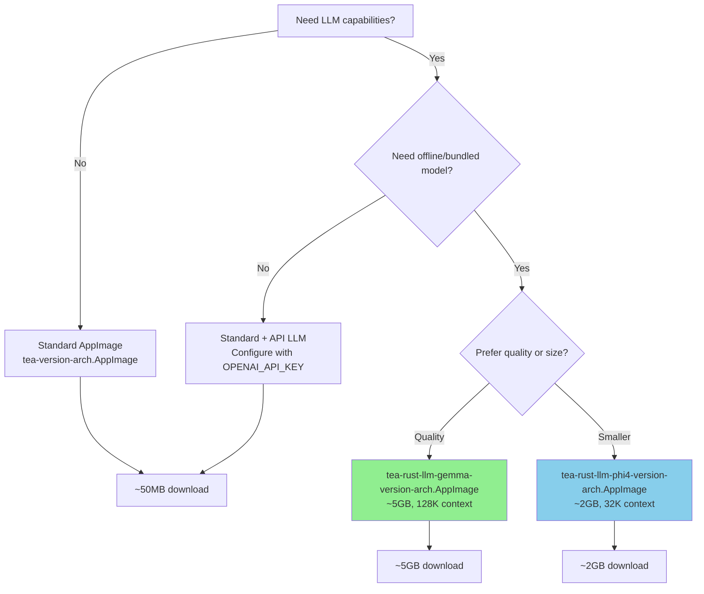
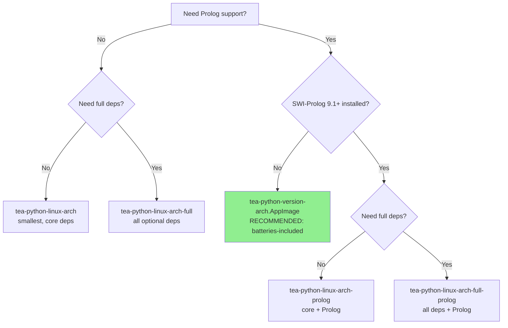
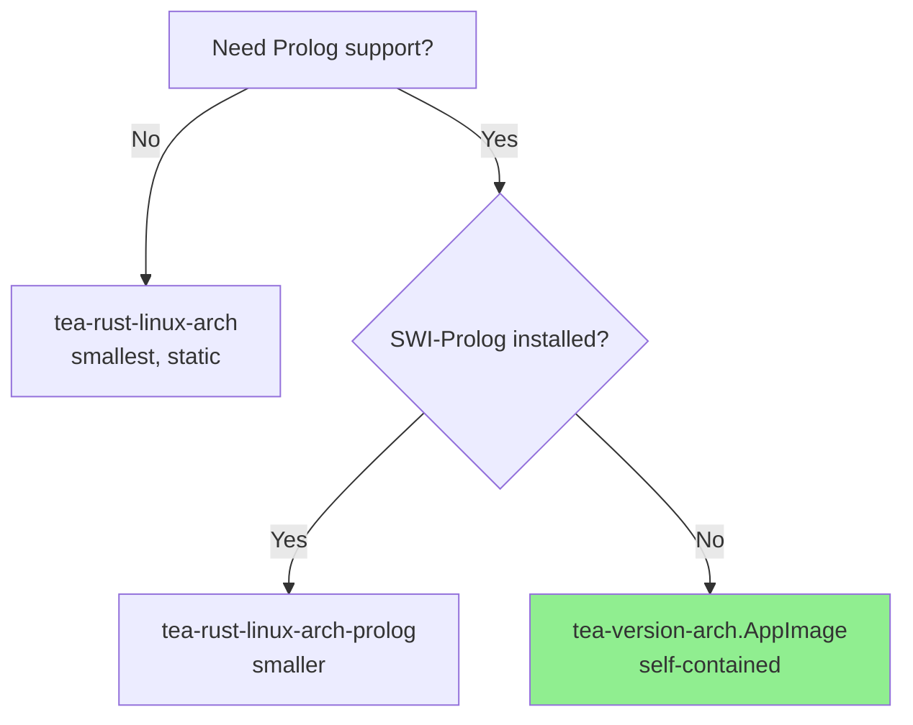

# Installation Guide

This guide covers all installation methods for The Edge Agent (tea).

## Quick Install

**Python (Recommended)** - Full features, 20+ built-in actions:
```bash
# Option 1: pip install (requires Python 3.10+)
pip install the-edge-agent
tea --version

# Option 2: AppImage (self-contained, includes Prolog)
VERSION=$(curl -s https://api.github.com/repos/fabceolin/the_edge_agent/releases/latest | grep -Po '"tag_name": "v\K[^"]+')
curl -L "https://github.com/fabceolin/the_edge_agent/releases/download/v${VERSION}/tea-python-${VERSION}-x86_64.AppImage" -o tea
chmod +x tea && sudo mv tea /usr/local/bin/
```

**Rust** - Minimal footprint, embedded/offline:
```bash
VERSION=$(curl -s https://api.github.com/repos/fabceolin/the_edge_agent/releases/latest | grep -Po '"tag_name": "v\K[^"]+')
curl -L "https://github.com/fabceolin/the_edge_agent/releases/download/v${VERSION}/tea-${VERSION}-x86_64.AppImage" -o tea
chmod +x tea && sudo mv tea /usr/local/bin/

# Verify installation
tea --version
```

## Pre-built Binaries

Pre-built binaries are available for all major platforms. No Python or Rust installation required!

**Latest Release:** [GitHub Releases](https://github.com/fabceolin/the_edge_agent/releases/latest)

### Platform Matrix

| Platform | Python CLI | Rust CLI |
|----------|-----------|----------|
| Linux x86_64 | `tea-python-linux-x86_64` | `tea-rust-linux-x86_64` |
| Linux ARM64 | `tea-python-linux-arm64` | `tea-rust-linux-arm64` |
| macOS Intel | `tea-python-darwin-x86_64` | `tea-rust-darwin-x86_64` |
| macOS Apple Silicon | `tea-python-darwin-arm64` | `tea-rust-darwin-arm64` |
| Windows | `tea-python-windows-x86_64.exe` | `tea-rust-windows-x86_64.exe` |

### Python Binary Variants

The Python implementation offers several binary variants optimized for different use cases:

| Binary | Prolog | Deps | Size (est.) | Description |
|--------|--------|------|-------------|-------------|
| `tea-python-linux-x86_64` | No | Core | ~15MB | Core features only (networkx, pyyaml, jinja2) |
| `tea-python-linux-x86_64-full` | No | Full | ~80MB | All optional deps (openai, numpy, chromadb, pandas, etc.) |
| `tea-python-linux-x86_64-prolog` | Yes* | Core | ~25MB | Core + janus-swi (Prolog support) |
| `tea-python-linux-x86_64-full-prolog` | Yes* | Full | ~90MB | All deps + janus-swi (Prolog support) |
| `tea-python-{version}-x86_64.AppImage` | Yes | Full | ~150MB | **Self-contained** with all libs + SWI-Prolog runtime |
| `tea-python-linux-arm64` | No | Core | ~15MB | Core features only |
| `tea-python-linux-arm64-full` | No | Full | ~80MB | All optional deps |
| `tea-python-linux-arm64-prolog` | Yes* | Core | ~25MB | Core + janus-swi |
| `tea-python-linux-arm64-full-prolog` | Yes* | Full | ~90MB | All deps + janus-swi |
| `tea-python-{version}-aarch64.AppImage` | Yes | Full | ~150MB | **Self-contained** with all libs + SWI-Prolog runtime |

*Requires SWI-Prolog 9.1+ installed on the system (`apt install swi-prolog-nox`)

**Full deps include:** openai, numpy, chromadb, requests, RestrictedPython, pycozo, pandas, s3fs, gcsfs, adlfs, lupa, kuzu

### Rust Binary Variants (Prolog Support)

For **neurosymbolic AI** with Prolog inference, additional binary variants are available:

| Binary | Prolog | Size (est.) | Description |
|--------|--------|-------------|-------------|
| `tea-rust-linux-x86_64` | No | ~15MB | Core features, statically linked (musl) |
| `tea-rust-linux-x86_64-prolog` | Yes* | ~18MB | With Prolog support, requires `libswipl.so` installed |
| `tea-{version}-x86_64.AppImage` | Yes | ~50MB | **Self-contained** Rust binary with all libs bundled |
| `tea-rust-linux-arm64` | No | ~15MB | Core features, statically linked (musl) |
| `tea-rust-linux-arm64-prolog` | Yes* | ~18MB | With Prolog support, requires `libswipl.so` installed |
| `tea-{version}-aarch64.AppImage` | Yes | ~50MB | **Self-contained** Rust binary with all libs bundled |

*Requires SWI-Prolog installed on the system (`apt install swi-prolog-nox`)

### LLM-Bundled Distributions

For **offline LLM inference** without network connectivity, LLM-bundled distributions include a pre-bundled GGUF model:

| Binary | Model | Size (est.) | Description |
|--------|-------|-------------|-------------|
| `tea-rust-llm-gemma-{version}-x86_64.AppImage` | Gemma 3n E4B | ~5GB | Rust + Gemma model (best quality) |
| `tea-rust-llm-gemma-{version}-aarch64.AppImage` | Gemma 3n E4B | ~5GB | Rust ARM64 + Gemma model |
| `tea-rust-llm-phi4-{version}-x86_64.AppImage` | Phi-4-mini Q3_K_S | ~2GB | Rust + Phi-4-mini (compact) |
| `tea-rust-llm-phi4-{version}-aarch64.AppImage` | Phi-4-mini Q3_K_S | ~2GB | Rust ARM64 + Phi-4-mini |
| `tea-python-llm-gemma-{version}-x86_64.AppImage` | Gemma 3n E4B | ~5GB | Python + Gemma model |
| `tea-python-llm-gemma-{version}-aarch64.AppImage` | Gemma 3n E4B | ~5GB | Python ARM64 + Gemma model |
| `tea-python-llm-phi4-{version}-x86_64.AppImage` | Phi-4-mini Q3_K_S | ~2GB | Python + Phi-4-mini |
| `tea-python-llm-phi4-{version}-aarch64.AppImage` | Phi-4-mini Q3_K_S | ~2GB | Python ARM64 + Phi-4-mini |

**Model Comparison:**

| Model | Context | Quality | Size | Best For |
|-------|---------|---------|------|----------|
| Gemma 3n E4B | 128K tokens | Higher | ~4.5GB | Complex reasoning, longer conversations |
| Phi-4-mini Q3_K_S | 32K tokens | Good | ~1.9GB | Quick responses, constrained storage |

#### Download and Run LLM AppImage

```bash
# Get latest version
VERSION=$(curl -s https://api.github.com/repos/fabceolin/the_edge_agent/releases/latest | grep -Po '"tag_name": "v\K[^"]+')

# Download Python LLM variant (recommended - full features)
curl -L "https://github.com/fabceolin/the_edge_agent/releases/download/v${VERSION}/tea-python-llm-gemma3-1b-${VERSION}-x86_64.AppImage" -o tea-llm.AppImage
chmod +x tea-llm.AppImage

# Or download Rust LLM variant (smaller size)
curl -L "https://github.com/fabceolin/the_edge_agent/releases/download/v${VERSION}/tea-rust-llm-phi4-${VERSION}-x86_64.AppImage" -o tea-llm.AppImage
chmod +x tea-llm.AppImage

# Run offline chat workflow
./tea-llm.AppImage run examples/llm/local-chat.yaml --input '{"question": "What is 2+2?"}'
```

#### Model Path Configuration

The LLM backend searches for models in this order:

| Priority | Source | Example |
|----------|--------|---------|
| 1 | `TEA_MODEL_PATH` environment variable | `TEA_MODEL_PATH=./models/custom.gguf` |
| 2 | `params.model_path` in action | `model_path: /path/to/model.gguf` |
| 3 | `settings.llm.model_path` in YAML | See example below |
| 4 | `$APPDIR/usr/share/models/` | AppImage bundled model (auto) |
| 5 | `~/.cache/tea/models/` | Default cache location |

**Using Environment Variable:**

```bash
# Set custom model path
export TEA_MODEL_PATH=/path/to/my-model.gguf
./tea-llm.AppImage run examples/llm/local-chat.yaml
```

**Using YAML Settings:**

```yaml
settings:
  llm:
    backend: local
    model_path: ~/.cache/tea/models/gemma-3n-E4B-it-Q4_K_M.gguf
    n_gpu_layers: 0  # 0 = CPU only, -1 = all layers on GPU
```

**Auto-Detection in AppImage:**

When using LLM-bundled AppImages, the model path is automatically detected from the bundled location (`$APPDIR/usr/share/models/`). No configuration needed.

### Which Binary Should I Use?

#### Distribution Selection Flowchart



**Python Implementation:**



**Rust Implementation:**



## AppImage Installation

AppImages are **self-contained** executables that bundle the tea binary, SWI-Prolog runtime, and all dependencies. No installation required!

### Python AppImage (Recommended for Full Features)

The Python AppImage includes ALL optional dependencies (openai, numpy, chromadb, pandas, etc.) plus janus-swi and the complete SWI-Prolog runtime. This is the **batteries-included** choice for neurosymbolic AI.

```bash
# Get latest version and download the Python AppImage
VERSION=$(curl -s https://api.github.com/repos/fabceolin/the_edge_agent/releases/latest | grep -Po '"tag_name": "v\K[^"]+')
curl -L "https://github.com/fabceolin/the_edge_agent/releases/download/v${VERSION}/tea-python-${VERSION}-x86_64.AppImage" -o tea-python.AppImage

# Make executable and run
chmod +x tea-python.AppImage
./tea-python.AppImage --version

# Verify it's the Python implementation
./tea-python.AppImage --impl
# Output: python

# Run a Prolog-enabled agent
./tea-python.AppImage run examples/prolog/simple-prolog-agent.yaml --input '{"value": 21}'
```

### Rust AppImage (Lighter Weight)

The Rust AppImage includes the Rust binary with SWI-Prolog support, optimized for smaller size and embedded environments.

```bash
# Get latest version and download the Rust AppImage
VERSION=$(curl -s https://api.github.com/repos/fabceolin/the_edge_agent/releases/latest | grep -Po '"tag_name": "v\K[^"]+')
curl -L "https://github.com/fabceolin/the_edge_agent/releases/download/v${VERSION}/tea-${VERSION}-x86_64.AppImage" -o tea.AppImage

# Make executable and run
chmod +x tea.AppImage
./tea.AppImage --version

# Verify it's the Rust implementation
./tea.AppImage --impl
# Output: rust

# Run a Prolog-enabled agent
./tea.AppImage run examples/prolog/simple-prolog-agent.yaml
```

AppImages work on any Linux distribution (Ubuntu, Fedora, Arch, Alpine, etc.) without installing SWI-Prolog or Python system-wide.

### AppImage Requirements

- **janus-swi**: Bundled (no system installation needed)
- **SWI-Prolog**: Bundled (no system installation needed)
- **Python**: Bundled in Python AppImage (no system installation needed)
- **FUSE**: Required to run AppImages natively. Most systems have it. If not:
  ```bash
  # Use --appimage-extract-and-run flag as workaround
  ./tea-python.AppImage --appimage-extract-and-run --version
  ```

## WASM LLM Package (Browser)

For running TEA YAML workflows with LLM inference **directly in the browser**, use the WASM LLM package. This enables completely offline AI inference without any server backend.

### WASM Release Assets

| Asset | Size | Description |
|-------|------|-------------|
| `tea-wasm-llm-{version}.tar.gz` | ~50 MB | WASM package + TypeScript wrapper |
| `microsoft_Phi-4-mini-instruct-Q3_K_S.gguf` | ~1.9 GB | Bundled LLM model |
| `manifest.json` | <1 KB | Model metadata |
| `SHA256SUMS.wasm` | <1 KB | Checksums for WASM assets |

### Installation

```bash
# Get latest version and download from GitHub Releases
VERSION=$(curl -s https://api.github.com/repos/fabceolin/the_edge_agent/releases/latest | grep -Po '"tag_name": "v\K[^"]+')
wget "https://github.com/fabceolin/the_edge_agent/releases/download/v${VERSION}/tea-wasm-llm-${VERSION}.tar.gz"
wget "https://github.com/fabceolin/the_edge_agent/releases/download/v${VERSION}/microsoft_Phi-4-mini-instruct-Q3_K_S.gguf"
wget "https://github.com/fabceolin/the_edge_agent/releases/download/v${VERSION}/manifest.json"

# Extract and organize
tar -xzf tea-wasm-llm-${VERSION}.tar.gz
mkdir -p models
mv microsoft_Phi-4-mini-instruct-Q3_K_S.gguf manifest.json models/
```

### Server Requirements

**CRITICAL:** Your web server MUST set these headers for SharedArrayBuffer support:

```text
Cross-Origin-Opener-Policy: same-origin
Cross-Origin-Embedder-Policy: require-corp
```

See `rust/tea-wasm-llm/README.md` for Nginx, Apache, and Caddy configuration examples.

### Basic Usage

```html
<script type="module">
import { initTeaLlm, executeLlmYaml, loadBundledModel } from './pkg/index.js';

// Load model (cached in IndexedDB after first download)
const modelData = await loadBundledModel({
    modelBasePath: './models',
    useCache: true,
    onProgress: (loaded, total) => console.log(`${(loaded/total*100).toFixed(1)}%`)
});

// Initialize with your LLM backend (e.g., wllama)
await initTeaLlm({}, async (paramsJson) => {
    const params = JSON.parse(paramsJson);
    // Call your LLM backend here
    return JSON.stringify({ content: '...' });
});

// Execute YAML workflow
const result = await executeLlmYaml(yamlString, { input: 'hello' });
</script>
```

For complete documentation, see `rust/tea-wasm-llm/README.md`.

## Python Installation

### From Source

```bash
cd python && pip install -e .
python -c "import the_edge_agent as tea; print(tea.__version__)"
```

### From Git

```bash
pip install git+https://github.com/fabceolin/the_edge_agent.git
```

After installation, the `tea` command will be available globally.

## Rust Installation

### From Source

```bash
cd rust && cargo build --release
./target/release/tea --help
```

## Verify Downloads

Each release includes `SHA256SUMS.txt` for verification:

```bash
# Download checksum file and binary
curl -L https://github.com/fabceolin/the_edge_agent/releases/latest/download/SHA256SUMS.txt -o SHA256SUMS.txt
curl -L https://github.com/fabceolin/the_edge_agent/releases/latest/download/tea-rust-linux-x86_64 -o tea-rust-linux-x86_64

# Verify (Linux)
sha256sum -c SHA256SUMS.txt --ignore-missing

# Verify (macOS)
shasum -a 256 -c SHA256SUMS.txt --ignore-missing
```

## Implementations

This is a **polyglot monorepo** with two implementations:

| Implementation | Status | Best For |
|----------------|--------|----------|
| **[Python](python/getting-started.md)** | **Production-ready (Recommended)** | Full feature set, 20+ built-in actions, neurosymbolic AI |
| **[Rust](rust/getting-started.md)** | Active development | Embedded, offline, resource-constrained environments |

**Python is the reference implementation** with the complete feature set including 20+ built-in actions (LLM, RAG, memory, web, observability). The **Rust implementation** provides a lighter-weight alternative for embedded scenarios with a subset of actions.

Both implementations share the same YAML agent syntax and can run the same agent configurations from the `examples/` directory.

## Repository Structure

```
the_edge_agent/
+-- python/          # Python implementation (full features)
+-- rust/            # Rust implementation (performance)
+-- examples/        # Shared YAML agents (works with both)
+-- docs/
    +-- shared/      # Language-agnostic docs (YAML reference)
    +-- python/      # Python-specific guides
    +-- rust/        # Rust-specific guides
```

## Next Steps

- [CLI Reference](shared/cli-reference.md) - Command-line usage
- [YAML Reference](shared/YAML_REFERENCE.md) - Agent configuration syntax
- [Python Getting Started](python/getting-started.md)
- [Rust Getting Started](rust/getting-started.md)
