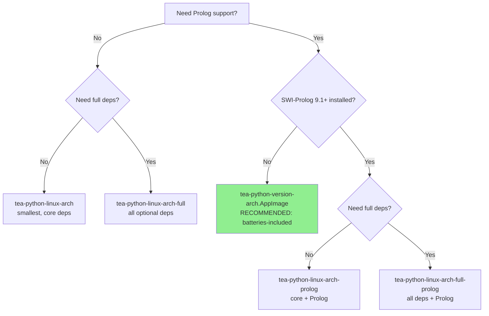
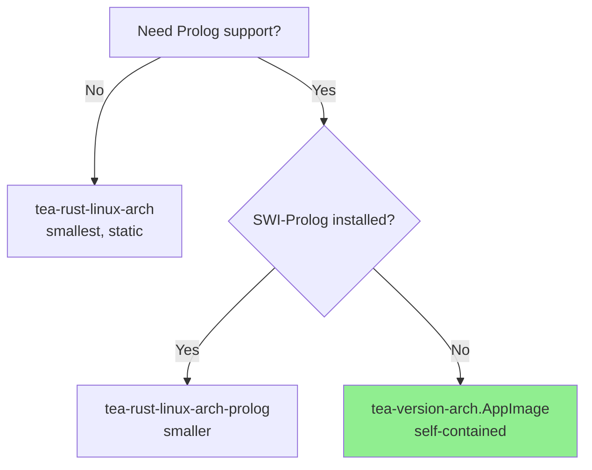

# Installation Guide

This guide covers all installation methods for The Edge Agent (tea).

## Quick Install

```bash
# Linux/macOS - Download and install Rust binary
curl -L https://github.com/fabceolin/the_edge_agent/releases/latest/download/tea-rust-linux-x86_64 -o tea
chmod +x tea
sudo mv tea /usr/local/bin/

# Verify installation
tea --version
```

## Pre-built Binaries

Pre-built binaries are available for all major platforms. No Python or Rust installation required!

**Latest Release:** [GitHub Releases](https://github.com/fabceolin/the_edge_agent/releases/latest)

### Platform Matrix

| Platform | Python CLI | Rust CLI |
|----------|-----------|----------|
| Linux x86_64 | `tea-python-linux-x86_64` | `tea-rust-linux-x86_64` |
| Linux ARM64 | `tea-python-linux-arm64` | `tea-rust-linux-arm64` |
| macOS Intel | `tea-python-darwin-x86_64` | `tea-rust-darwin-x86_64` |
| macOS Apple Silicon | `tea-python-darwin-arm64` | `tea-rust-darwin-arm64` |
| Windows | `tea-python-windows-x86_64.exe` | `tea-rust-windows-x86_64.exe` |

### Python Binary Variants

The Python implementation offers several binary variants optimized for different use cases:

| Binary | Prolog | Deps | Size (est.) | Description |
|--------|--------|------|-------------|-------------|
| `tea-python-linux-x86_64` | No | Core | ~15MB | Core features only (networkx, pyyaml, jinja2) |
| `tea-python-linux-x86_64-full` | No | Full | ~80MB | All optional deps (openai, numpy, chromadb, pandas, etc.) |
| `tea-python-linux-x86_64-prolog` | Yes* | Core | ~25MB | Core + janus-swi (Prolog support) |
| `tea-python-linux-x86_64-full-prolog` | Yes* | Full | ~90MB | All deps + janus-swi (Prolog support) |
| `tea-python-{version}-x86_64.AppImage` | Yes | Full | ~150MB | **Self-contained** with all libs + SWI-Prolog runtime |
| `tea-python-linux-arm64` | No | Core | ~15MB | Core features only |
| `tea-python-linux-arm64-full` | No | Full | ~80MB | All optional deps |
| `tea-python-linux-arm64-prolog` | Yes* | Core | ~25MB | Core + janus-swi |
| `tea-python-linux-arm64-full-prolog` | Yes* | Full | ~90MB | All deps + janus-swi |
| `tea-python-{version}-aarch64.AppImage` | Yes | Full | ~150MB | **Self-contained** with all libs + SWI-Prolog runtime |

*Requires SWI-Prolog 9.1+ installed on the system (`apt install swi-prolog-nox`)

**Full deps include:** openai, numpy, chromadb, requests, RestrictedPython, pycozo, pandas, s3fs, gcsfs, adlfs, lupa, kuzu

### Rust Binary Variants (Prolog Support)

For **neurosymbolic AI** with Prolog inference, additional binary variants are available:

| Binary | Prolog | Size (est.) | Description |
|--------|--------|-------------|-------------|
| `tea-rust-linux-x86_64` | No | ~15MB | Core features, statically linked (musl) |
| `tea-rust-linux-x86_64-prolog` | Yes* | ~18MB | With Prolog support, requires `libswipl.so` installed |
| `tea-{version}-x86_64.AppImage` | Yes | ~50MB | **Self-contained** Rust binary with all libs bundled |
| `tea-rust-linux-arm64` | No | ~15MB | Core features, statically linked (musl) |
| `tea-rust-linux-arm64-prolog` | Yes* | ~18MB | With Prolog support, requires `libswipl.so` installed |
| `tea-{version}-aarch64.AppImage` | Yes | ~50MB | **Self-contained** Rust binary with all libs bundled |

*Requires SWI-Prolog installed on the system (`apt install swi-prolog-nox`)

### Which Binary Should I Use?

**Python Implementation:**



**Rust Implementation:**



## AppImage Installation

AppImages are **self-contained** executables that bundle the tea binary, SWI-Prolog runtime, and all dependencies. No installation required!

### Python AppImage (Recommended for Full Features)

The Python AppImage includes ALL optional dependencies (openai, numpy, chromadb, pandas, etc.) plus janus-swi and the complete SWI-Prolog runtime. This is the **batteries-included** choice for neurosymbolic AI.

```bash
# Download the Python AppImage
curl -L https://github.com/fabceolin/the_edge_agent/releases/latest/download/tea-python-0.8.1-x86_64.AppImage -o tea-python.AppImage

# Make executable and run
chmod +x tea-python.AppImage
./tea-python.AppImage --version

# Verify it's the Python implementation
./tea-python.AppImage --impl
# Output: python

# Run a Prolog-enabled agent
./tea-python.AppImage run examples/prolog/simple-prolog-agent.yaml --input '{"value": 21}'
```

### Rust AppImage (Recommended for Performance)

The Rust AppImage includes the Rust binary with SWI-Prolog support, optimized for performance and smaller size.

```bash
# Download the Rust AppImage
curl -L https://github.com/fabceolin/the_edge_agent/releases/latest/download/tea-0.8.1-x86_64.AppImage -o tea.AppImage

# Make executable and run
chmod +x tea.AppImage
./tea.AppImage --version

# Verify it's the Rust implementation
./tea.AppImage --impl
# Output: rust

# Run a Prolog-enabled agent
./tea.AppImage run examples/prolog/simple-prolog-agent.yaml
```

AppImages work on any Linux distribution (Ubuntu, Fedora, Arch, Alpine, etc.) without installing SWI-Prolog or Python system-wide.

### AppImage Requirements

- **janus-swi**: Bundled (no system installation needed)
- **SWI-Prolog**: Bundled (no system installation needed)
- **Python**: Bundled in Python AppImage (no system installation needed)
- **FUSE**: Required to run AppImages natively. Most systems have it. If not:
  ```bash
  # Use --appimage-extract-and-run flag as workaround
  ./tea-python.AppImage --appimage-extract-and-run --version
  ```

## Python Installation

### From Source

```bash
cd python && pip install -e .
python -c "import the_edge_agent as tea; print(tea.__version__)"
```

### From Git

```bash
pip install git+https://github.com/fabceolin/the_edge_agent.git
```

After installation, the `tea` command will be available globally.

## Rust Installation

### From Source

```bash
cd rust && cargo build --release
./target/release/tea --help
```

## Verify Downloads

Each release includes `SHA256SUMS.txt` for verification:

```bash
# Download checksum file and binary
curl -L https://github.com/fabceolin/the_edge_agent/releases/latest/download/SHA256SUMS.txt -o SHA256SUMS.txt
curl -L https://github.com/fabceolin/the_edge_agent/releases/latest/download/tea-rust-linux-x86_64 -o tea-rust-linux-x86_64

# Verify (Linux)
sha256sum -c SHA256SUMS.txt --ignore-missing

# Verify (macOS)
shasum -a 256 -c SHA256SUMS.txt --ignore-missing
```

## Implementations

This is a **polyglot monorepo** with two implementations:

| Implementation | Status | Best For |
|----------------|--------|----------|
| **[Python](python/getting-started.md)** | Production-ready | Online edge computing, full feature set, 20+ built-in actions |
| **[Rust](rust/getting-started.md)** | Active development | Embedded offline systems, resource-constrained environments |

The **Python implementation** is optimized for online edge computing scenarios where network connectivity enables access to external APIs, LLM services, and cloud resources. The **Rust implementation** is designed for embedded offline systems where minimal footprint, deterministic execution, and operation without network dependencies are critical.

Both implementations share the same YAML agent syntax and can run the same agent configurations from the `examples/` directory.

## Repository Structure

```
the_edge_agent/
+-- python/          # Python implementation (full features)
+-- rust/            # Rust implementation (performance)
+-- examples/        # Shared YAML agents (works with both)
+-- docs/
    +-- shared/      # Language-agnostic docs (YAML reference)
    +-- python/      # Python-specific guides
    +-- rust/        # Rust-specific guides
```

## Next Steps

- [CLI Reference](shared/cli-reference.md) - Command-line usage
- [YAML Reference](shared/YAML_REFERENCE.md) - Agent configuration syntax
- [Python Getting Started](python/getting-started.md)
- [Rust Getting Started](rust/getting-started.md)
