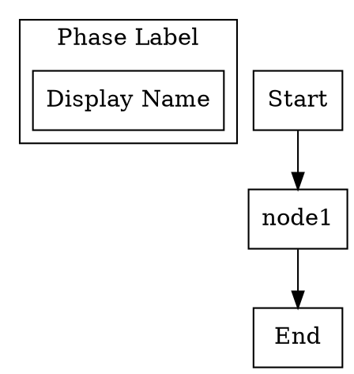
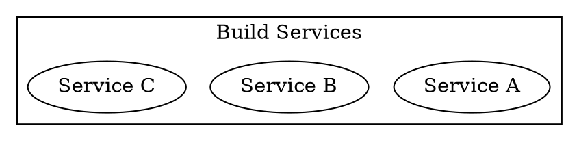
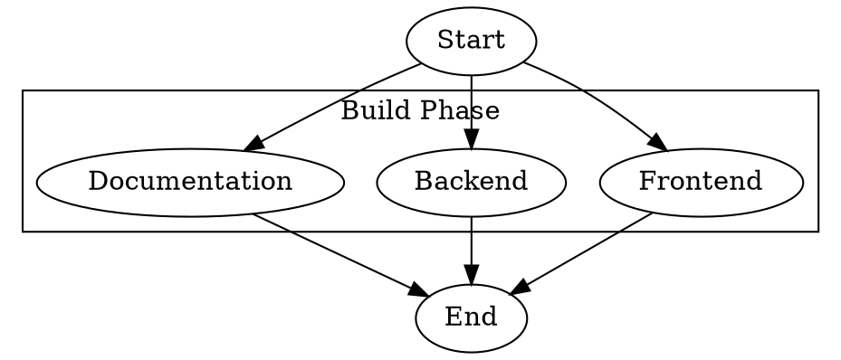
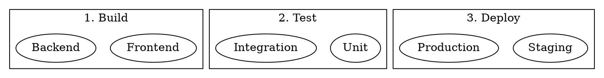
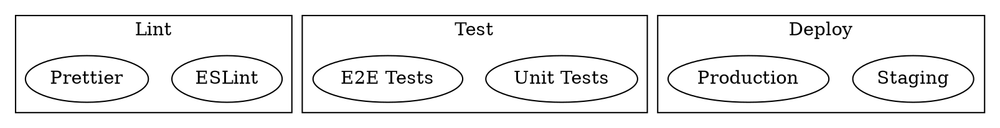
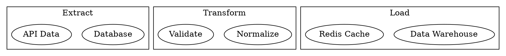
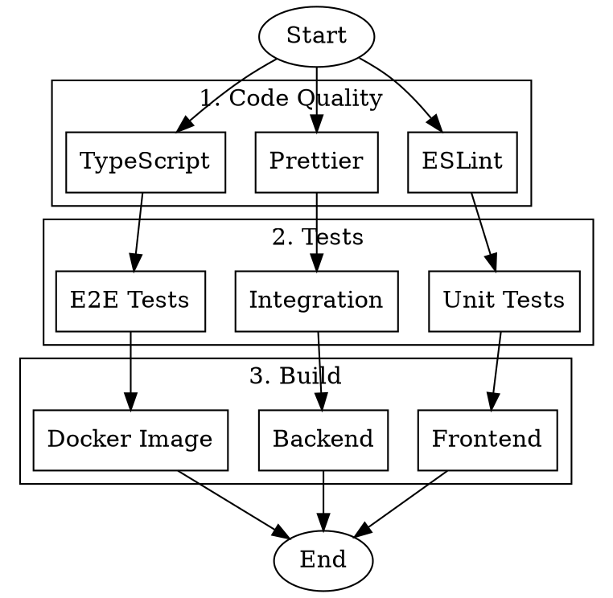

# DOT-to-YAML Generation Guide for LLMs

This document provides instructions for generating DOT (Graphviz) files that can be converted to TEA YAML workflows using the `tea from dot` command.

## Two Execution Modes

The TEA DOT-to-YAML converter supports **two mutually exclusive modes**:

| Mode | Flag | Use Case |
|------|------|----------|
| **Template Mode** | `--command "cmd {{ item }}"` | All nodes run same command with different items |
| **Per-Node Mode** | `--use-node-commands` | Each node has its own specific command |

**Important**: These modes cannot be combined. Choose one based on your workflow needs.

## Quick Reference

### Basic DOT Structure



### Key Attributes

| Attribute | Location | Purpose |
|-----------|----------|---------|
| `label` | Node | Display name for the task |
| `command` | Node | **TEA-TOOLS-002**: Shell command to execute for this specific node |
| `shape` | Node | Visual shape (box, ellipse, circle) |
| `label` | Cluster | Phase/group display name |

## Generating Parallel Workflows

### Pattern 1: Homogeneous Parallel (Same Command Template)

Use when all tasks in a phase run the same command with different arguments.



**CLI Usage:**
```bash
tea from dot workflow.dot -c "make build-{{ item }}"
```

### Pattern 2: Heterogeneous Parallel (Per-Node Commands)

Use when each task requires a different command. **ALL nodes must have a `command` attribute.**



**CLI Usage:**
```bash
tea from dot workflow.dot --use-node-commands
```

**Validation Rules for Per-Node Mode:**
- ALL nodes must have `command` attribute
- Exception: Nodes with shapes `ellipse`, `circle`, `point`, `doublecircle` (Start/End markers)
- Clear error message lists any nodes missing commands

## Multi-Phase Workflows

Create sequential phases that each execute in parallel internally:



## Command Attribute Best Practices

### 1. Use Full Commands
```dot
// Good: Complete command
node_a [label="Build", command="cd frontend && npm run build"];

// Avoid: Incomplete commands
node_a [label="Build", command="npm"];
```

### 2. Handle Paths and Variables
```dot
// Environment variables work
node_a [label="Deploy", command="kubectl apply -f $KUBE_DIR/"];

// Relative paths from working directory
node_b [label="Test", command="pytest tests/ -v"];
```

### 3. Multi-Step Commands
```dot
// Chain with && for sequential steps
node_a [label="Build & Test", command="npm run build && npm test"];

// Use semicolons to continue on failure
node_b [label="Cleanup", command="rm -rf dist; mkdir dist"];
```

### 4. Quotes in Commands
```dot
// Single quotes inside double quotes
node_a [label="Echo", command="echo 'Hello World'"];

// Escape double quotes
node_b [label="JSON", command="echo '{\"key\": \"value\"}'"];
```

## Generated YAML Structure

When converted with `--use-node-commands`, the DOT file produces this YAML structure:

```yaml
name: workflow-name
description: Generated from DOT diagram

nodes:
  - name: setup
    run: |
      # Initialize phase items and per-node command mapping
      state["phase1_items"] = ["Frontend", "Backend"]
      state["_phase1_commands"] = {
          "Frontend": "npm run build",
          "Backend": "cargo build"
      }
      return state

  - name: phase1_parallel
    type: dynamic_parallel
    items: "{{ state.phase1_items }}"
    item_var: item
    max_concurrency: 3
    fan_in: phase1_collect
    steps:
      - name: execute
        run: |
          import subprocess

          item = state.get("item", "")
          commands = state.get("_phase1_commands", {})
          cmd = commands.get(item)

          if not cmd:
              return {"item": item, "success": False, "error": "No command defined"}

          result = subprocess.run(
              cmd, shell=True, capture_output=True, text=True,
              executable='/bin/bash', timeout=300
          )
          return {
              "item": item,
              "success": result.returncode == 0,
              "stdout": result.stdout,
              "stderr": result.stderr
          }
    output: phase1_results

  - name: phase1_collect
    fan_in: true
    run: |
      # Collect results from parallel execution
      results = state.get("phase1_results", [])
      success_count = sum(1 for r in results if r.get("success", False))
      state["phase1_complete"] = True
      state["phase1_success_count"] = success_count
      return state

edges:
  - from: __start__
    to: setup
  - from: setup
    to: phase1_parallel
  - from: phase1_collect
    to: __end__
```

## CLI Reference

```bash
# Mode 1: Template mode - all nodes use same command template
tea from dot workflow.dot -c "make build-{{ item }}" -o output.yaml

# Mode 2: Per-node mode - each node has command attribute (TEA-TOOLS-002)
tea from dot workflow.dot --use-node-commands -o output.yaml

# ERROR: Cannot combine modes (mutually exclusive)
# tea from dot workflow.dot --use-node-commands -c "fallback"  # INVALID

# With tmux execution mode
tea from dot workflow.dot --use-node-commands --tmux -s my-session

# Validate output before writing
tea from dot workflow.dot --use-node-commands --validate

# Custom concurrency (default: 3)
tea from dot workflow.dot --use-node-commands -m 5

# Custom workflow name
tea from dot workflow.dot --use-node-commands -n "my-pipeline"
```

## Common Generation Patterns for LLMs

When generating DOT files programmatically, use these patterns:

### Build System Pattern
```dot
digraph build_system {
    subgraph cluster_build {
        label="Build";
        ${for each service in services}
        ${service.id} [label="${service.name}", command="${service.build_cmd}"];
        ${end for}
    }
}
```

### CI/CD Pipeline Pattern


### Data Processing Pattern


## Validation Checklist

Before submitting a DOT file for conversion:

### For Template Mode (`--command`)
1. [ ] All nodes have `label` attribute
2. [ ] Clusters have `label` attribute for phase naming
3. [ ] No circular dependencies exist
4. [ ] Each phase is wrapped in `subgraph cluster_*` block

### For Per-Node Mode (`--use-node-commands`)
1. [ ] All nodes have `label` attribute
2. [ ] **ALL nodes have `command` attribute** (except Start/End markers)
3. [ ] Start/End markers use `shape=ellipse` or `shape=circle`
4. [ ] Clusters have `label` attribute for phase naming
5. [ ] No circular dependencies exist
6. [ ] Commands don't contain unescaped special characters
7. [ ] Each phase is wrapped in `subgraph cluster_*` block

## Error Handling

| Error | Cause | Solution |
|-------|-------|----------|
| `DotParseError` | Invalid DOT syntax | Check DOT syntax, balanced brackets |
| `CircularDependencyError` | A -> B -> C -> A cycle | Remove cycles or redesign flow |
| `--use-node-commands and --command are mutually exclusive` | Both flags specified | Choose one mode only |
| `--command is required (or use --use-node-commands)` | Neither flag specified | Add `--command` or `--use-node-commands` |
| `ALL nodes to have command attribute. Missing: X, Y` | Missing command attrs | Add `command` attribute to listed nodes, or use `shape=ellipse` for markers |

## Complete Example: Multi-Phase CI/CD Pipeline

Here's a complete, valid DOT file for per-node commands mode:



**Convert to YAML:**
```bash
tea from dot cicd.dot --use-node-commands -o cicd.yaml --validate
```

**Key Points:**
1. `Start` and `End` use `shape=ellipse` so they don't require `command`
2. All other nodes have `command` attribute with their specific shell command
3. Phases are defined with `subgraph cluster_*` blocks
4. Edges define the execution flow between phases
