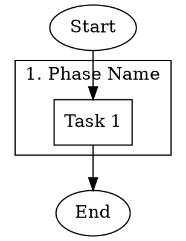
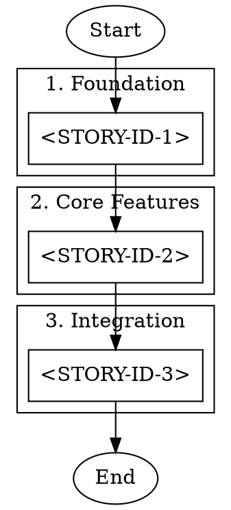
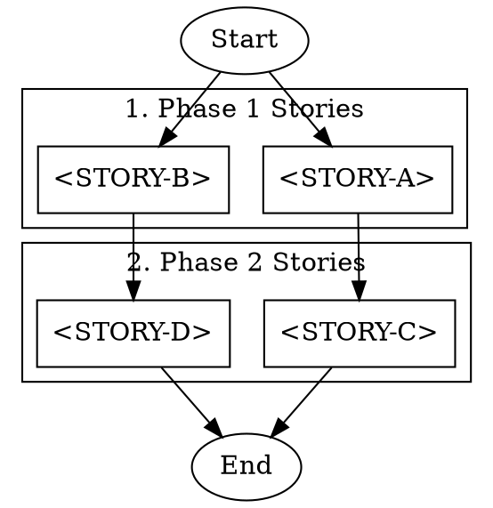
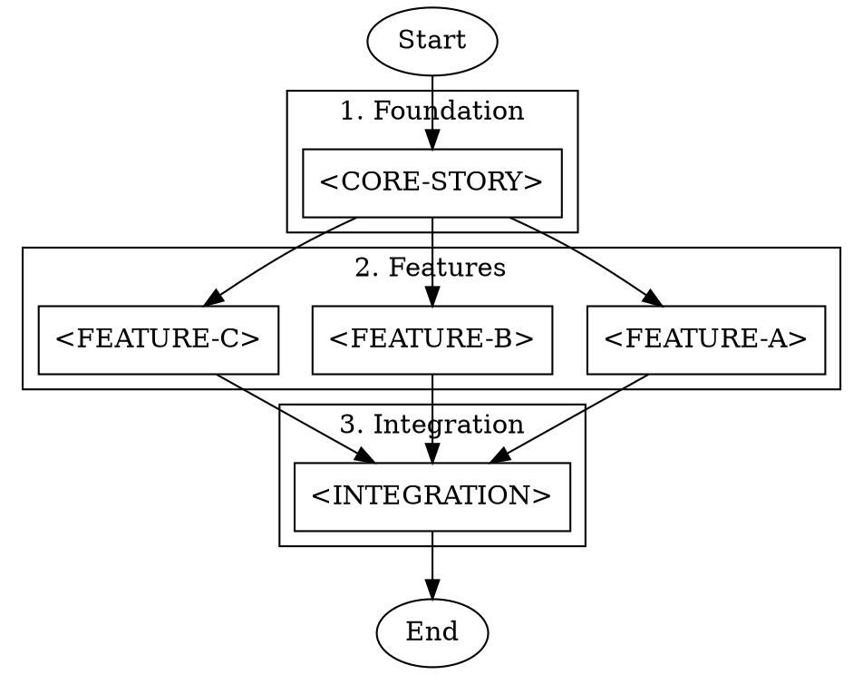
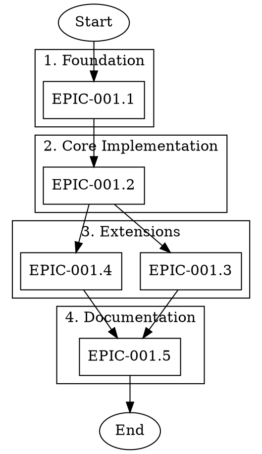

# DOT Workflow Orchestration Guide for LLMs

> **TEA Version**: 0.9.4 | **Primary CLI**: `tea-python`

This document provides instructions for generating DOT (Graphviz) files that orchestrate sequential and parallel execution of stories, tasks, or any workflow items using TEA agents.

## Use Case

When you need to:
- Implement multiple stories in a specific order
- Run development workflows with dependencies
- Orchestrate parallel tasks within sequential phases
- Generate executable YAML agents from visual diagrams

## File Location

**Standard location for DOT files:** `examples/dot/` (relative to TEA repository root)

All DOT workflow files should be saved in the `examples/dot/` directory within the TEA repository. This keeps workflow orchestration files organized and separate from documentation and source code.

### Repository Structure (Relative Paths)

```
<tea-repo-root>/
├── examples/
│   ├── dot/                          # DOT workflow files (save here)
│   │   ├── linear.dot
│   │   ├── parallel-phases.dot
│   │   └── ...
│   └── workflows/                    # YAML workflow agents
│       ├── bmad-story-development.yaml
│       ├── bmad-story-validation.yaml
│       └── ...
└── docs/
    └── stories/                      # Story files
        └── ...
```

### Key File Paths (Relative to TEA Root)

| File | Relative Path |
|------|---------------|
| BMAD Story Development | `examples/workflows/bmad-story-development.yaml` |
| BMAD Story Validation | `examples/workflows/bmad-story-validation.yaml` |
| DOT Files Directory | `examples/dot/` |
| Stories Directory | `docs/stories/` |

### Runtime Path Discovery (IMPORTANT)

**Before generating a DOT file, the LLM MUST use tools to discover actual paths:**

The project root (`PROJECT_ROOT`) can be:
- The `the_edge_agent` repository (when working on TEA itself)
- Any other project that uses TEA workflows (e.g., `spa-base`, custom projects)

1. **Find BMAD workflow files:**
   ```bash
   # Glob pattern to find BMAD workflows in any project
   **/bmad-story-development.yaml
   **/bmad-story-validation.yaml
   ```

2. **Extract PROJECT_ROOT from discovered path:**
   ```bash
   # If found: /home/user/myproject/the_edge_agent/examples/workflows/bmad-story-development.yaml
   # PROJECT_ROOT could be: /home/user/myproject/the_edge_agent
   # OR if the project has its own workflows:
   # /home/user/myproject/workflows/bmad-story-development.yaml
   # PROJECT_ROOT = /home/user/myproject
   ```

3. **Find story files in the project:**
   ```bash
   # Glob pattern to find stories (may be in different locations)
   **/docs/stories/*.md
   **/stories/*.md
   ```

4. **Use discovered absolute paths in DOT commands**

**Note:** Different projects may have different directory structures. Always discover paths dynamically.

**Naming convention:**
- Use lowercase with hyphens: `epic-name-workflow.dot`
- Include purpose in name: `tea-release-004-validation.dot`, `feature-x-development.dot`
- Generated YAML goes alongside: `examples/dot/my-workflow.yaml`

---

## Quick Start

### Step 1: Generate DOT File



### Step 2: Execute DOT Directly (Recommended)

**Two execution modes:**

#### Mode 1: Command Mode (nodes have `command` attribute)

```bash
# Execute DOT directly with tmux output
tea run --from-dot workflow.dot

# Or use the dedicated command with more options
tea run-from-dot workflow.dot --session my-session --max-parallel 3

# Preview execution plan without running
tea run --from-dot workflow.dot --dot-dry-run
```

#### Mode 2: Workflow Mode (run a workflow for each node)

When nodes don't have commands, use `--dot-workflow` to run a workflow for each node:

```bash
# Run a workflow for each node (node label becomes input)
tea run --from-dot stories.dot --dot-workflow bmad-story-development.yaml

# With additional input parameters
tea run --from-dot stories.dot \
    --dot-workflow dev.yaml \
    --dot-input '{"mode": "sequential"}'

# Using run-from-dot command
tea run-from-dot stories.dot -w bmad-story-development.yaml -i '{"mode": "sequential"}'
```

The node label is passed as `{"arg": "<node_label>"}` to the workflow.

#### Verbose Mode (see LLM output in real-time)

When workflows call `llm.call` with shell providers (e.g., Claude Code), use `TEA_SHELL_VERBOSE=1` to see the output in real-time:

```bash
# See Claude Code output while running
TEA_SHELL_VERBOSE=1 tea run --from-dot stories.dot --dot-workflow dev.yaml

# Or export for all commands
export TEA_SHELL_VERBOSE=1
tea run-from-dot stories.dot -w bmad-story-development.yaml
```

Monitor progress: `tmux attach -t tea-dot`

### Step 2b: Alternative - Generate YAML First

If you need YAML-specific features (checkpoints, interrupts):

```python
from the_edge_agent import dot_to_yaml
yaml_content = dot_to_yaml("workflow.dot", use_node_commands=True, output_path="workflow.yaml")
```

Then run:

```bash
tea run workflow.yaml
```

---

## DOT File Structure

### Required Elements

| Element | Purpose | Example |
|---------|---------|---------|
| `digraph name` | Graph container | `digraph story_implementation {}` |
| `Start` node | Entry point (ellipse shape) | `Start [label="Start", shape=ellipse];` |
| `End` node | Exit point (ellipse shape) | `End [label="End", shape=ellipse];` |
| `subgraph cluster_*` | Phase grouping | `subgraph cluster_build {}` |
| `command` attribute | Per-node command | `command="tea-python run ..."` |
| Edges | Execution order | `task_a -> task_b;` |

### Node Attributes

```dot
node_id [
    label="Display Name",           // Required: shown in output
    command="shell command here"    // Required: executed for this node
];
```

### Command Format for TEA Workflows

```dot
command="tea-python run <workflow.yaml> --input '{\"arg\": \"<value>\"}'"
```

**Escaping rules:**
- Use `\"` for quotes inside the command string
- The command is wrapped in double quotes in DOT format

---

## Patterns

### Pattern 1: Sequential Story Implementation

All stories execute one after another.



**Note:** Replace `<WORKFLOW_PATH>` and `<STORIES_PATH>` with actual paths discovered at runtime using Glob tools.

### Pattern 2: Parallel Stories Within Phases

Stories within the same phase run in parallel; phases run sequentially.



### Pattern 3: Mixed Dependencies

Some stories depend on specific predecessors.



---

## Command Templates

### Story Development Workflow

Use JSON input format with `arg` key:

```dot
command="tea-python run <WORKFLOW_PATH>  --input '{\"arg\": \"<STORIES_PATH>/<STORY-FILE>.md\"}'"
```

### Story Validation Workflow

```dot
command="tea-python run <VALIDATION_WORKFLOW_PATH>  --input '{\"arg\": \"<STORIES_PATH>/<STORY-FILE>.md\"}'"
```

### With Extended Timeout

For long-running workflows, add `--timeout` (in seconds). Default is 300s (5 minutes):

```dot
command="tea-python run <VALIDATION_WORKFLOW_PATH>  --input '{\"arg\": \"<STORIES_PATH>/<STORY-FILE>.md\"}'"
```

**Placeholder Reference:**
- `<WORKFLOW_PATH>` - Absolute path to bmad-story-development.yaml (discovered at runtime)
- `<VALIDATION_WORKFLOW_PATH>` - Absolute path to bmad-story-validation.yaml (discovered at runtime)
- `<STORIES_PATH>` - Absolute path to stories directory (discovered at runtime)
- `<STORY-FILE>` - Story filename without extension (e.g., `TEA-RELEASE-004.1-rust-llm-appimage`)

**Common timeout values:**
- `--timeout 600` - 10 minutes
- `--timeout 1800` - 30 minutes
- `--timeout 3600` - 1 hour
- `` - 15 hours (900 minutes) - recommended for complex workflows

### Custom Workflow with JSON Inputs

For JSON inputs, use single quotes around the JSON (but avoid nested quotes when possible):

```dot
command="echo simple_value | tea-python run my-workflow.yaml --input -"
```

Or use environment variables:

```dot
command="STORY_ID=STORY-001 tea-python run my-workflow.yaml"
```

### Shell Commands (Non-TEA)

```dot
command="npm run build && npm test"
command="cargo build --release"
command="pytest tests/ -v"
```

---

## Execution Commands

### Direct Execution (Recommended)

```bash
# Execute DOT directly with tmux output
tea run --from-dot workflow.dot

# Alternative: dedicated command with more options
tea run-from-dot workflow.dot --session my-session --max-parallel 3

# Preview execution plan (dry run)
tea run --from-dot workflow.dot --dot-dry-run
```

Monitor with: `tmux attach -t tea-dot`

### Programmatic YAML Generation (Alternative)

If you need YAML for checkpoints, interrupts, or other advanced features:

```python
from the_edge_agent import dot_to_yaml

# Generate with custom options
yaml_content = dot_to_yaml(
    "workflow.dot",
    use_node_commands=True,
    max_concurrency=5,
    workflow_name="my-pipeline",
    validate=True,
    output_path="workflow.yaml"
)
```

### Execute Generated Workflow

```bash
# Run the generated workflow
tea-python run workflow.yaml

# With extended timeout (900 minutes = 54000 seconds)
tea-python run workflow.yaml 

# With visual graph progress (shows ASCII workflow diagram with running/completed states)
tea-python run workflow.yaml  --show-graph

# Graph visualization only (no other output)
tea-python run workflow.yaml  --show-graph --quiet

# With streaming output (NDJSON mode - mutually exclusive with --show-graph)
tea-python run workflow.yaml  --stream

# With verbose logging
tea-python run workflow.yaml  -vv
```

**Note:** The `--show-graph` flag displays an ASCII visualization of the workflow structure, highlighting the currently executing node and marking completed nodes with ✓. This is especially useful for complex parallel workflows where you want to see progress at a glance. **Always combine with `` for long-running story workflows.**

### Alternative Tea Implementations

When you have multiple tea implementations (Python, Rust, or different versions), use the appropriate executable directly:

```bash
# Python implementation v0.9.4 (default)
tea-python run workflow.yaml

# Rust implementation
tea-rust run workflow.yaml
```

---

## LLM Generation Instructions

When asked to create a workflow orchestration DOT file:

### 0. Discover Paths (CRITICAL - Do This First!)

**Before generating any DOT file, use tools to discover actual paths:**

```bash
# Step 1: Find BMAD workflow files in the project
glob_pattern: "**/bmad-story-development.yaml"

# Step 2: Extract PROJECT_ROOT and WORKFLOW_PATH from the found path
# Example A (TEA repo): /home/user/project/the_edge_agent/examples/workflows/bmad-story-development.yaml
#   WORKFLOW_PATH = /home/user/project/the_edge_agent/examples/workflows/bmad-story-development.yaml
#
# Example B (Other project): /home/user/myapp/workflows/bmad-story-development.yaml
#   WORKFLOW_PATH = /home/user/myapp/workflows/bmad-story-development.yaml

# Step 3: Find story files in the project
glob_pattern: "**/docs/stories/*.md"
# OR
glob_pattern: "**/stories/*.md"

# Step 4: Store discovered paths for use in DOT commands
# WORKFLOW_PATH = <discovered workflow path>
# STORIES_PATH = <discovered stories directory>
```

**Store discovered WORKFLOW_PATH and STORIES_PATH for use in all commands.**

### 1. Identify Stories/Tasks

Extract the list of items to orchestrate:
- Story IDs (e.g., `TEA-PARALLEL-001.1`)
- File paths discovered in Step 0 (e.g., `<STORIES_PATH>/TEA-PARALLEL-001.1-executor-abstraction.md`)
- Dependencies between items

### 2. Determine Phase Structure

Group items into phases based on:
- Dependencies (items with no deps go in early phases)
- Logical grouping (related items in same phase)
- Parallelization opportunity (independent items in same phase run in parallel)

### 3. Generate DOT File

```dot
digraph <workflow_name> {
    rankdir=TB;
    node [shape=box];

    Start [label="Start", shape=ellipse];
    End [label="End", shape=ellipse];

    // For each phase:
    subgraph cluster_<phase_name> {
        label="<N>. <Phase Label>";
        // For each item in phase:
        <item_id> [label="<Display Name>", command="tea-python run <workflow>  --input '{\"arg\": \"<path>\"}'"];
    }

    // Define edges based on dependencies
    Start -> <first_items>;
    <item_a> -> <item_b>;
    <last_items> -> End;
}
```

### 4. Save DOT File

Save the DOT file to the standard location:

```bash
# Standard location
examples/dot/<workflow-name>.dot
```

### 5. Output Commands (REQUIRED)

**After generating the DOT file, ALWAYS output these commands with full discovered paths:**

#### Execute DOT Directly (Recommended):
```bash
tea run --from-dot <DOT_OUTPUT>/<filename>.dot
```

Or with options:
```bash
tea run-from-dot <DOT_OUTPUT>/<filename>.dot --session my-session --max-parallel 3
```

Monitor: `tmux attach -t tea-dot`

#### Alternative - Execute via YAML:
```bash
tea-python run <DOT_OUTPUT>/<filename>.yaml 
```

#### With Visual Progress (recommended for multi-story workflows):
```bash
tea-python run <DOT_OUTPUT>/<filename>.yaml  --show-graph
```

**Example with discovered paths:**
```bash
# Execute DOT directly (RECOMMENDED)
tea run --from-dot /home/user/project/docs/workflows/my-workflow.dot

# Or with custom session and monitoring
tea run-from-dot /home/user/project/docs/workflows/my-workflow.dot --session my-workflow

# Monitor progress
tmux attach -t tea-dot
```

---

## Complete Example: Epic Implementation

Given an epic with 5 stories and this dependency structure:
- 001.1 has no dependencies
- 001.2 depends on 001.1
- 001.3 depends on 001.2
- 001.4 depends on 001.3
- 001.5 depends on 001.4

### Step 1: Discover Paths

```bash
# LLM discovers workflow paths using Glob tool
Glob pattern: "**/bmad-story-development.yaml"
Result: /home/user/project/the_edge_agent/examples/workflows/bmad-story-development.yaml

# Store discovered paths
WORKFLOW_PATH = /home/user/project/the_edge_agent/examples/workflows/bmad-story-development.yaml

# Find stories directory
Glob pattern: "**/docs/stories/*.md"
Result: /home/user/project/the_edge_agent/docs/stories/...

# Store stories path
STORIES_PATH = /home/user/project/the_edge_agent/docs/stories

# DOT output directory (sibling to workflows or in examples/dot)
DOT_OUTPUT = /home/user/project/the_edge_agent/examples/dot
```

### Step 2: Generate DOT File



**Note:** The paths `/home/user/project/the_edge_agent/` are examples. The LLM MUST discover the actual path at runtime using tools.

### Step 3: Save DOT File

```bash
# Save DOT to discovered output directory (using discovered DOT_OUTPUT path)
Write to: /home/user/project/the_edge_agent/examples/dot/epic-implementation.dot
```

### Step 4: Output Commands (with discovered paths)

**After saving the DOT file, output these executable commands:**

```bash
# Execute DOT directly with tmux output (RECOMMENDED)
tea run --from-dot /home/user/project/the_edge_agent/examples/dot/epic-implementation.dot

# Alternative: dedicated command with more options
tea run-from-dot /home/user/project/the_edge_agent/examples/dot/epic-implementation.dot \
    --session epic-impl \
    --max-parallel 3

# Monitor execution in tmux
tmux attach -t tea-dot
```

**Note:** All paths in the output commands MUST be the actual discovered absolute paths, not placeholders.

---

## Best Practices

### Path Discovery (CRITICAL)
- **ALWAYS discover paths at runtime** using Glob or Bash tools
- **NEVER hardcode paths** like `/home/fabricio/...` in templates
- **Verify files exist** before including them in the DOT file
- **Store PROJECT_ROOT** (derived from discovered workflow path) and reuse it for all command paths

### Labels
- **Keep labels simple**: Use short IDs like `TEA-PARALLEL-001.1` instead of multi-line labels
- **Avoid special characters**: No newlines (`\n`), quotes, or special chars in labels
- Labels are used as dict keys and tmux window names

### Commands
- **Use absolute paths**: Discovered at runtime via `<WORKFLOW_PATH>` and `<STORIES_PATH>`
- **Use JSON input format**: `--input '{\"arg\": \"<path>\"}'` with proper escaping
- **Escape double quotes**: Use `\"` for quotes inside the command string
- **Test commands independently**: Run the command in a shell before embedding in DOT

### Example: Good vs Bad

```dot
// GOOD - absolute path discovered at runtime, simple label, with timeout
story_1 [label="STORY-001", command="tea-python run /discovered/path/the_edge_agent/examples/workflows/bmad-story-development.yaml  --input '{\"arg\": \"/discovered/path/the_edge_agent/docs/stories/STORY-001.md\"}'"];

// BAD - relative path (may not resolve correctly), multi-line label, no timeout
story_1 [label="STORY-001\nDescription", command="tea-python run examples/workflows/bmad-story-development.yaml --input '{\"arg\": \"docs/stories/STORY-001.md\"}'"];
```

---

## Validation Checklist

Before generating:

- [ ] All task nodes have `command` attribute
- [ ] Start/End nodes use `shape=ellipse` (no command needed)
- [ ] Each phase is wrapped in `subgraph cluster_*` block
- [ ] Edges define correct execution order
- [ ] No circular dependencies
- [ ] Labels contain only alphanumeric, `-`, `_`, `.` characters
- [ ] Commands use JSON input format with proper escaping: `'{\"arg\": \"<path>\"}'`
- [ ] File paths are correct and exist

---

## Error Handling

| Error | Cause | Solution |
|-------|-------|----------|
| `Missing command attribute` | Node without `command` | Add `command="..."` to node |
| `Circular dependency` | A -> B -> A | Redesign flow to remove cycle |
| `Invalid JSON in input` | Bad escaping | Use `'{\"key\": \"value\"}'` format |
| `File not found` | Wrong path | Verify story file paths exist |

---

## Related Documentation

- [DOT-to-YAML LLM Reference](./DOT_TO_YAML_LLM_REFERENCE.md) - General DOT conversion guide
- [YAML Reference](./YAML_REFERENCE.md) - TEA YAML workflow syntax
