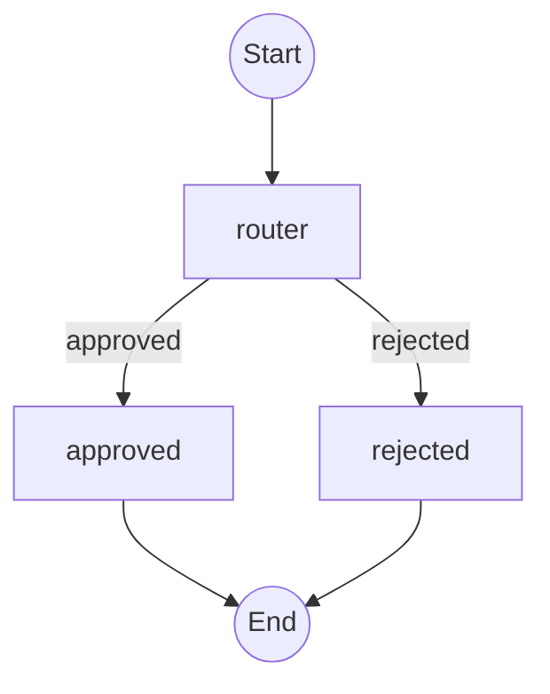

# TEA Experiment Framework Guide

The Edge Agent (TEA) provides a built-in experiment framework for systematically evaluating agents using [Comet Opik](https://www.comet.com/docs/opik/). This guide covers how to run experiments, create datasets, define custom metrics, and compare agent strategies.

## Prerequisites

Install TEA with experiment support:

```bash
pip install the-edge-agent[experiments]
# or
pip install the-edge-agent[opik]
```

## Quick Start

```python
from the_edge_agent.experiments import (
    run_tea_experiment,
    create_dataset_from_list,
    BaseTeaMetric,
)

# 1. Create a dataset
create_dataset_from_list(
    name="qa_test_cases",
    items=[
        {"input": {"question": "What is TEA?"}, "expected_output": {"answer": "The Edge Agent"}},
        {"input": {"question": "What is Python?"}, "expected_output": {"answer": "A programming language"}},
    ]
)

# 2. Define a custom metric
class AccuracyMetric(BaseTeaMetric):
    name = "accuracy"

    def score(self, output, expected_output=None, **kwargs):
        match = output.get("answer") == expected_output.get("answer")
        return self.make_result(1.0 if match else 0.0, "Exact match" if match else "No match")

# 3. Run experiment
result = run_tea_experiment(
    agent_yaml="qa_agent.yaml",
    dataset_name="qa_test_cases",
    metrics=[AccuracyMetric()],
    experiment_name="qa_agent_v1.0",
)

print(f"Experiment status: {result['status']}")
```

## Core Functions

### run_tea_experiment()

Run an Opik experiment on a TEA YAML agent.

```python
from the_edge_agent.experiments import run_tea_experiment

result = run_tea_experiment(
    agent_yaml="my_agent.yaml",          # Path to YAML agent
    dataset_name="test_cases",            # Opik dataset name
    metrics=[MyMetric()],                 # List of scoring metrics
    experiment_name="agent_v2.0",         # Experiment name
    experiment_config={"model": "gpt-4"}, # Optional metadata
    project_name="my-project",            # Optional Opik project
    variables={"api_key": "..."},         # Optional agent variables
)
```

**Returns:**
```python
{
    "experiment_name": "agent_v2.0",
    "status": "complete",  # or "error"
    "dataset_name": "test_cases",
    "metrics_count": 1,
    "error": "..."  # Only if status is "error"
}
```

### create_dataset_from_list()

Create an Opik dataset from a list of dictionaries.

```python
from the_edge_agent.experiments import create_dataset_from_list

dataset = create_dataset_from_list(
    name="my_dataset",
    items=[
        {
            "input": {"text": "Hello"},
            "expected_output": {"response": "Hi there!"},
            "metadata": {"category": "greeting"}  # Optional
        },
        # ... more items
    ],
    description="Test cases for greeting agent",
)
```

### create_dataset_from_fixtures()

Create a dataset from JSON fixture files in a directory.

```python
from the_edge_agent.experiments import create_dataset_from_fixtures

# Directory structure:
# fixtures/
#   case_001.json  # {"input": {...}, "expected_output": {...}}
#   case_002.json

dataset = create_dataset_from_fixtures(
    name="test_fixtures",
    fixtures_path="./fixtures/",
    input_transform=lambda x: {"input": x},  # Optional transform
)
```

### compare_strategies()

Run A/B comparison between two agent strategies.

```python
from the_edge_agent.experiments import compare_strategies

result = compare_strategies(
    strategy_a={
        "name": "optimized",
        "agent_yaml": "agent_v2.yaml",
        "settings": {"temperature": 0.3},
    },
    strategy_b={
        "name": "baseline",
        "agent_yaml": "agent_v1.yaml",
        "settings": {"temperature": 0.7},
    },
    dataset_name="eval_set",
    metrics=[AccuracyMetric(), LatencyMetric()],
    experiment_prefix="model_comparison",
)

print(f"Both completed: {result['both_completed']}")
print(f"Strategy A: {result['strategy_a_result']['status']}")
print(f"Strategy B: {result['strategy_b_result']['status']}")
```

## Creating Custom Metrics

Extend `BaseTeaMetric` to create domain-specific scoring metrics.

### Basic Metric

```python
from the_edge_agent.experiments import BaseTeaMetric

class MyMetric(BaseTeaMetric):
    name = "my_metric"  # Displayed in Opik UI

    def score(self, output, expected_output=None, **kwargs):
        # Your scoring logic here
        value = self._calculate_score(output, expected_output)
        reason = f"Score: {value:.2f}"
        return self.make_result(value, reason)

    def _calculate_score(self, output, expected) -> float:
        # Implementation
        return 0.85
```

### Using Scoring Helpers

TEA provides common scoring functions:

```python
from the_edge_agent.experiments import (
    BaseTeaMetric,
    jaccard_similarity,
    f1_score,
    completeness_score,
)

class ItemMatchMetric(BaseTeaMetric):
    name = "item_match"

    def score(self, output, expected_output=None, **kwargs):
        actual_items = set(output.get("items", []))
        expected_items = set(expected_output.get("items", []))

        # Use F1 score for set comparison
        score = f1_score(actual_items, expected_items)
        return self.make_result(score, f"F1: {score:.2f}")

class CompletenessMetric(BaseTeaMetric):
    name = "completeness"

    def score(self, output, expected_output=None, **kwargs):
        filled = len([v for v in output.values() if v])
        total = len(expected_output) if expected_output else 1

        score = completeness_score(filled, total)
        return self.make_result(score, f"{filled}/{total} fields filled")
```

### Scoring Helper Reference

| Function | Description | Example |
|----------|-------------|---------|
| `jaccard_similarity(set_a, set_b)` | Intersection over union | `jaccard_similarity({1,2,3}, {2,3,4})` → 0.5 |
| `f1_score(actual, expected)` | Harmonic mean of precision/recall | `f1_score({1,2}, {1,2,3})` → 0.8 |
| `completeness_score(filled, total)` | Ratio of filled to total | `completeness_score(8, 10)` → 0.8 |

## CLI Usage

Run experiments from the command line:

```bash
# Dry run (validate without executing)
tea-experiments --agent agent.yaml --dataset test_cases --dry-run

# Run experiment
tea-experiments --agent agent.yaml --dataset test_cases --version 2.0

# Save results to file
tea-experiments --agent agent.yaml --dataset test_cases --output results.json

# Specify project
tea-experiments --agent agent.yaml --dataset test_cases --project my-project
```

**Note:** Custom metrics require the Python API. The CLI runs experiments without metrics for basic validation.

### CLI Options

| Option | Short | Description |
|--------|-------|-------------|
| `--agent` | `-a` | Path to YAML agent file (required) |
| `--dataset` | `-d` | Opik dataset name (required) |
| `--version` | `-v` | Experiment version tag (default: 1.0) |
| `--project` | `-p` | Opik project name |
| `--dry-run` | | Validate without running |
| `--output` | `-o` | Save results to JSON file |
| `--verbose` | | Enable verbose logging |

## Configuration

### Environment Variables

| Variable | Description | Default |
|----------|-------------|---------|
| `OPIK_API_KEY` | API key for Opik Cloud | None |
| `OPIK_PROJECT_NAME` | Default project name | `the-edge-agent` |
| `OPIK_WORKSPACE` | Workspace name | User's default |
| `OPIK_URL_OVERRIDE` | Custom Opik URL (self-hosted) | None |

### YAML Configuration

Configure Opik in your agent's YAML settings:

```yaml
name: my-agent
settings:
  opik:
    project_name: my-project
    workspace: my-team
    api_key: ${OPIK_API_KEY}  # Environment variable expansion

# ... rest of agent configuration
```

### Configuration Precedence

1. Explicit function arguments
2. Environment variables
3. YAML agent settings
4. Default values

## A/B Comparison Workflow

1. **Define Strategies**: Create YAML agents for each variant
2. **Create Dataset**: Build a shared evaluation dataset
3. **Define Metrics**: Create metrics relevant to your domain
4. **Run Comparison**: Use `compare_strategies()`
5. **Analyze in Opik**: View side-by-side results in Opik UI

```python
# Full A/B comparison example
from the_edge_agent.experiments import (
    compare_strategies,
    create_dataset_from_list,
    BaseTeaMetric,
    f1_score,
)

# Create evaluation dataset
create_dataset_from_list(
    name="extraction_eval",
    items=[
        {"input": {"text": "..."}, "expected_output": {"entities": [...]}},
        # ... more test cases
    ]
)

# Define domain-specific metric
class EntityExtractionMetric(BaseTeaMetric):
    name = "entity_extraction"

    def score(self, output, expected_output=None, **kwargs):
        actual = set(output.get("entities", []))
        expected = set(expected_output.get("entities", []))
        return self.make_result(f1_score(actual, expected))

# Run comparison
result = compare_strategies(
    strategy_a={"name": "gpt4", "agent_yaml": "extractor_gpt4.yaml"},
    strategy_b={"name": "gpt35", "agent_yaml": "extractor_gpt35.yaml"},
    dataset_name="extraction_eval",
    metrics=[EntityExtractionMetric()],
    experiment_prefix="model_comparison_2024",
)

# Results appear in Opik with shared comparison_id for filtering
```

## Agent Graph Visualization

TEA automatically exports your agent's graph structure to Opik for visualization in the "Show Agent Graph" UI. This makes it easier to debug and understand agent execution flow.

### Automatic Graph Export

By default, `run_tea_experiment()` includes the agent's graph structure as a Mermaid diagram:

```python
result = run_tea_experiment(
    agent_yaml="my_agent.yaml",
    dataset_name="test_cases",
    metrics=[MyMetric()],
    experiment_name="agent_v1.0",
    # include_graph=True is the default
)
```

The graph appears in Opik's UI when viewing individual traces.

### Disabling Graph Export

If you don't need the graph visualization (e.g., for very large agents or performance-sensitive scenarios):

```python
result = run_tea_experiment(
    agent_yaml="my_agent.yaml",
    dataset_name="test_cases",
    metrics=[MyMetric()],
    experiment_name="agent_v1.0",
    include_graph=False,  # Disable graph export
)
```

### Direct Mermaid Generation

You can also generate Mermaid graphs directly from your agents:

```python
from the_edge_agent import StateGraph, YAMLEngine

# From StateGraph
graph = StateGraph({"value": int})
graph.add_node("process", run=lambda state: state)
graph.set_entry_point("process")
graph.set_finish_point("process")
graph.compile()

mermaid = graph.to_mermaid()
print(mermaid)
# Output:
# graph TD
#     __start__((Start))
#     process[process]
#     __end__((End))
#     __start__-->process
#     process-->__end__

# From YAMLEngine
engine = YAMLEngine()
engine.load_from_file("my_agent.yaml")
mermaid = engine.get_mermaid_graph()
```

### Mermaid Syntax

The generated Mermaid diagrams use:

- `((Start))` and `((End))` circles for start/end nodes
- `[node_name]` rectangles for regular nodes
- `-->` for simple edges
- `-->|label|` for conditional edges with labels
- `-->|parallel→fan_in|` for parallel execution edges

Example output:



### Special Character Handling

Node names with special characters are automatically escaped:
- Spaces, hyphens, dots → underscores in node IDs
- Brackets, parentheses → underscores in node IDs
- Original names preserved in display labels

## Graceful Degradation

When Opik is not installed, the module provides stub classes for type hints but raises `ImportError` when attempting to run experiments:

```python
# This works even without Opik
from the_edge_agent.experiments import jaccard_similarity
print(jaccard_similarity({1, 2}, {2, 3}))  # 0.333...

# This raises ImportError without Opik
from the_edge_agent.experiments import run_tea_experiment
run_tea_experiment(...)  # ImportError: Opik SDK not installed
```

## Best Practices

1. **Start with clear metrics**: Define what success looks like before running experiments
2. **Use descriptive experiment names**: Include version, date, or variant info
3. **Store experiment configs**: Pass metadata via `experiment_config` for reproducibility
4. **Create reusable datasets**: Share datasets across experiments for fair comparison
5. **Run multiple iterations**: Use version tags to track improvements over time

## Troubleshooting

### "Opik SDK not installed"

```bash
pip install opik>=1.9.0
# or
pip install the-edge-agent[experiments]
```

### "Dataset not found"

Create the dataset first using `create_dataset_from_list()` or `create_dataset_from_fixtures()`.

### Network errors

Check your `OPIK_API_KEY` and `OPIK_URL_OVERRIDE` settings. For self-hosted Opik, ensure the URL is correct.

## Related Documentation

- [Opik Documentation](https://www.comet.com/docs/opik/)
- [TEA YAML Reference](../shared/YAML_REFERENCE.md)
- [TEA Actions Reference](./actions-reference.md)
