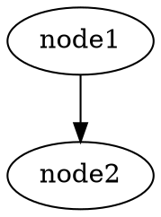

# Test Design: Story TEA-CLI-008

Date: 2026-01-28
Designer: Quinn (Test Architect)
Mode: YOLO (Streamlined)

## Test Strategy Overview

- Total test scenarios: 28
- Unit tests: 18 (64%)
- Integration tests: 8 (29%)
- E2E tests: 2 (7%)
- Priority distribution: P0: 10, P1: 12, P2: 6

## Test Scenarios by Acceptance Criteria

### Part A: `--fail-on-state` Feature (AC-1 through AC-6)

#### AC-1: New CLI option accepts `key=value` format

| ID | Level | Priority | Test | Justification |
|----|-------|----------|------|---------------|
| CLI-008-UNIT-001 | Unit | P0 | Parse valid `--fail-on-state "key=value"` format | Core input parsing logic |
| CLI-008-UNIT-002 | Unit | P1 | Parse `--fail-on-state` with underscore in key: `final_status=failed` | Common key format |
| CLI-008-UNIT-003 | Unit | P1 | Parse `--fail-on-state` with nested value: `result.status=error` | Dot notation support |
| CLI-008-UNIT-004 | Unit | P0 | Reject malformed input missing `=`: `--fail-on-state "noequals"` | Security: input validation |
| CLI-008-UNIT-005 | Unit | P1 | Reject empty key: `--fail-on-state "=value"` | Security: input validation |
| CLI-008-UNIT-006 | Unit | P1 | Reject empty value: `--fail-on-state "key="` | Security: input validation |

#### AC-2: Exit code 1 when state matches condition

| ID | Level | Priority | Test | Justification |
|----|-------|----------|------|---------------|
| CLI-008-UNIT-007 | Unit | P0 | Exit 1 when `state["final_status"] == "failed"` matches condition | Core functionality |
| CLI-008-UNIT-008 | Unit | P0 | Exit 0 when state value doesn't match condition | No false positive exits |
| CLI-008-UNIT-009 | Unit | P1 | Exit 0 when state key doesn't exist | Graceful handling of missing keys |

#### AC-3: Multiple `--fail-on-state` options (OR logic)

| ID | Level | Priority | Test | Justification |
|----|-------|----------|------|---------------|
| CLI-008-UNIT-010 | Unit | P0 | Exit 1 when first of two conditions matches | Multiple condition OR logic |
| CLI-008-UNIT-011 | Unit | P0 | Exit 1 when second of two conditions matches | Multiple condition OR logic |
| CLI-008-UNIT-012 | Unit | P1 | Exit 0 when neither of two conditions matches | Multiple conditions all fail |

#### AC-4: Clear message printed when `--fail-on-state` triggers

| ID | Level | Priority | Test | Justification |
|----|-------|----------|------|---------------|
| CLI-008-UNIT-013 | Unit | P1 | Output contains `"Exit condition matched: key=value"` on trigger | User feedback |

#### AC-5: Works with all output modes

| ID | Level | Priority | Test | Justification |
|----|-------|----------|------|---------------|
| CLI-008-INT-001 | Integration | P0 | `--fail-on-state` triggers in default output mode | TECH-001 risk mitigation |
| CLI-008-INT-002 | Integration | P0 | `--fail-on-state` triggers in `--stream` mode | TECH-001 risk mitigation |
| CLI-008-INT-003 | Integration | P0 | `--fail-on-state` triggers in `--show-graph` mode | TECH-001 risk mitigation |

#### AC-6: Behavior unchanged when option not provided

| ID | Level | Priority | Test | Justification |
|----|-------|----------|------|---------------|
| CLI-008-UNIT-014 | Unit | P2 | Exit 0 on normal completion without `--fail-on-state` | Regression prevention |

---

### Part B: `--from-dot` Exit Code Capture (AC-7 through AC-9)

#### AC-7: Capture actual exit code of executed command

| ID | Level | Priority | Test | Justification |
|----|-------|----------|------|---------------|
| CLI-008-UNIT-015 | Unit | P0 | Command exits 0 -> temp file contains "0" | Core exit code capture |
| CLI-008-UNIT-016 | Unit | P0 | Command exits 1 -> temp file contains "1" | Core exit code capture |
| CLI-008-UNIT-017 | Unit | P1 | Command exits 137 (SIGKILL) -> temp file contains "137" | Signal handling |

#### AC-8: Non-zero exit marks node as `success: False`

| ID | Level | Priority | Test | Justification |
|----|-------|----------|------|---------------|
| CLI-008-INT-004 | Integration | P0 | Node with exit code 1 marked `success: False` | Core failure detection |
| CLI-008-INT-005 | Integration | P1 | Node with exit code 0 marked `success: True` | Positive path |
| CLI-008-INT-006 | Integration | P1 | Missing exit code file marks node `success: False` | DATA-001 risk mitigation |

#### AC-9: Timeout detection unchanged

| ID | Level | Priority | Test | Justification |
|----|-------|----------|------|---------------|
| CLI-008-UNIT-018 | Unit | P2 | Timeout triggers `success: False` with "Timeout" error | Regression prevention |

---

### Part C: `--from-dot` Stop-on-Failure (AC-10 through AC-13)

#### AC-10: `--dot-stop-on-failure` stops execution after failed phase

| ID | Level | Priority | Test | Justification |
|----|-------|----------|------|---------------|
| CLI-008-INT-007 | Integration | P0 | Phase 1 failure with `--dot-stop-on-failure` skips Phase 2 | Core stop-on-failure |

#### AC-11: Summary shows failed nodes and skipped phases

| ID | Level | Priority | Test | Justification |
|----|-------|----------|------|---------------|
| CLI-008-UNIT-019 | Unit | P1 | Summary output includes "Failed: node_name" | User feedback |
| CLI-008-UNIT-020 | Unit | P1 | Summary output includes "Skipped phases: 2, 3" | User feedback |

#### AC-12: `--no-dot-stop-on-failure` continues all phases

| ID | Level | Priority | Test | Justification |
|----|-------|----------|------|---------------|
| CLI-008-INT-008 | Integration | P1 | Phase 1 failure with `--no-dot-stop-on-failure` runs Phase 2 | BUS-001 backward compat |

#### AC-13: Overall exit code 1 when any node failed

| ID | Level | Priority | Test | Justification |
|----|-------|----------|------|---------------|
| CLI-008-UNIT-021 | Unit | P1 | Any node failure results in exit code 1 | Consistent exit behavior |

---

### Part D: Documentation Updates (AC-14, AC-15)

| ID | Level | Priority | Test | Justification |
|----|-------|----------|------|---------------|
| CLI-008-UNIT-022 | Unit | P2 | DOT_WORKFLOW_ORCHESTRATION_LLM_GUIDE.md contains `--dot-stop-on-failure` | Doc verification |
| CLI-008-UNIT-023 | Unit | P2 | DOT_WORKFLOW_ORCHESTRATION_LLM_GUIDE.md contains `--fail-on-state` | Doc verification |
| CLI-008-UNIT-024 | Unit | P2 | dot-workflow-orchestration.md contains `--dot-stop-on-failure` | Doc verification |
| CLI-008-UNIT-025 | Unit | P2 | dot-workflow-orchestration.md contains `--fail-on-state` | Doc verification |

---

### Additional Scenarios from Risk Assessment & NFR Assessment

#### Reliability: Window Name Collision (TECH-002, OPS-001)

| ID | Level | Priority | Test | Justification |
|----|-------|----------|------|---------------|
| CLI-008-UNIT-026 | Unit | P1 | Two nodes "build" and "build-test" get unique window names | TECH-002 collision risk |
| CLI-008-UNIT-027 | Unit | P2 | Temp file uses unique identifier (run ID or timestamp) | OPS-001 race condition |

#### End-to-End Workflow Validation

| ID | Level | Priority | Test | Justification |
|----|-------|----------|------|---------------|
| CLI-008-E2E-001 | E2E | P1 | `bmad-full-cycle.yaml` exits non-zero when validation_failed node reached | Workflow integration |
| CLI-008-E2E-002 | E2E | P2 | `bmad-story-validation.yaml` exits non-zero when final_status=incomplete | Workflow integration |

---

## Risk Coverage

| Risk ID | Risk Description | Mitigating Tests |
|---------|------------------|------------------|
| TECH-001 | Three code paths need identical `--fail-on-state` logic | CLI-008-INT-001, CLI-008-INT-002, CLI-008-INT-003 |
| OPS-001 | Temp file race conditions | CLI-008-UNIT-027 |
| TECH-002 | tmux window name collision | CLI-008-UNIT-026 |
| BUS-001 | Breaking change: default=True | CLI-008-INT-008 |
| DATA-001 | Exit code file cleanup on crash | CLI-008-INT-006 |
| TECH-003 | Shell portability | (Documentation only, not testable in unit tests) |

---

## Recommended Execution Order

1. **P0 Unit tests** (fail fast on core logic)
   - CLI-008-UNIT-001, 004, 007, 008, 010, 011, 015, 016
2. **P0 Integration tests** (validate output mode branches)
   - CLI-008-INT-001, 002, 003, 004, 007
3. **P1 Unit tests** (secondary validation)
   - CLI-008-UNIT-002, 003, 005, 006, 009, 012, 013, 017, 019, 020, 021, 026
4. **P1 Integration tests**
   - CLI-008-INT-005, 006, 008
5. **P1 E2E tests**
   - CLI-008-E2E-001
6. **P2 tests** (nice-to-have, lower risk)
   - CLI-008-UNIT-014, 018, 022-025, 027
   - CLI-008-E2E-002

---

## Test Data & Environment Requirements

### Minimal Test YAML Workflows

**test_fail_state.yaml** - Sets specific final state for `--fail-on-state` testing:
```yaml
name: test-fail-state
state_schema:
  final_status: str
nodes:
  - name: set_status
    run: |
      return {"final_status": "{{ input.status }}"}
edges:
  - from: __start__
    to: set_status
  - from: set_status
    to: __end__
```

**test_error_workflow.yaml** - Raises exception for error exit testing:
```yaml
name: test-error
nodes:
  - name: fail
    run: |
      raise Exception("Intentional failure")
edges:
  - from: __start__
    to: fail
```

### DOT Files for `--from-dot` Testing

**test_phases.dot** - Two-phase DOT for stop-on-failure:


**test_parallel.dot** - Parallel nodes for collision testing:


### Environment Requirements

| Requirement | Purpose |
|-------------|---------|
| tmux installed | `--from-dot` tests |
| `/tmp` writable | Exit code file tests |
| Python 3.9+ | CLI tests |
| typer.testing.CliRunner | CLI unit test harness |

### Mocking Requirements

| Component | Mock Strategy |
|-----------|---------------|
| `subprocess.run` | Mock tmux commands for window creation/polling |
| `time.sleep` | Patch to 0 for faster tests |
| Temp file I/O | Use `tempfile.TemporaryDirectory` for isolation |

---

## Quality Checklist

- [x] Every AC has test coverage
- [x] Test levels are appropriate (not over-testing)
- [x] No duplicate coverage across levels
- [x] Priorities align with business risk
- [x] Test IDs follow naming convention
- [x] Scenarios are atomic and independent
- [x] Risks from risk profile are covered

---

## Gate YAML Block

```yaml
test_design:
  scenarios_total: 28
  by_level:
    unit: 18
    integration: 8
    e2e: 2
  by_priority:
    p0: 10
    p1: 12
    p2: 6
  coverage_gaps: []
  risk_coverage:
    - risk: TECH-001
      tests: [CLI-008-INT-001, CLI-008-INT-002, CLI-008-INT-003]
    - risk: OPS-001
      tests: [CLI-008-UNIT-027]
    - risk: TECH-002
      tests: [CLI-008-UNIT-026]
    - risk: BUS-001
      tests: [CLI-008-INT-008]
    - risk: DATA-001
      tests: [CLI-008-INT-006]
```

---

Test design matrix: docs/qa/assessments/TEA-CLI-008-test-design-20260128.md
P0 tests identified: 10
