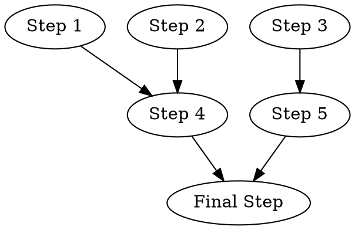
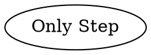
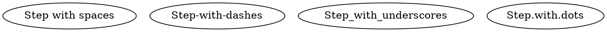

# Test Design: Story TEA-CLI-009 - Wave and Step Selection for DOT Workflow Execution

Date: 2026-01-28
Designer: Quinn (Test Architect)

## Test Strategy Overview

- **Total test scenarios:** 28
- **Unit tests:** 18 (64%)
- **Integration tests:** 8 (29%)
- **E2E tests:** 2 (7%)
- **Priority distribution:** P0: 10, P1: 12, P2: 6

## Risk Coverage Summary

This test design explicitly addresses the risks identified in the risk profile:

| Risk ID | Tests Mitigating |
|---------|------------------|
| TECH-001 (Off-by-one indexing) | UNIT-001, UNIT-002, UNIT-003, UNIT-007, UNIT-008, UNIT-009 |
| TECH-002 (Phase structure mismatch) | INT-001, INT-002, INT-005 |
| TECH-003 (Mutual exclusivity) | UNIT-013, UNIT-014 |
| DATA-001 (Label lookup with special chars) | UNIT-015, UNIT-016, UNIT-017 |
| TECH-004 (Dry-run output clarity) | UNIT-018, INT-006 |
| OPS-001 (Summary count accuracy) | INT-007, INT-008 |

## Test Scenarios by Acceptance Criteria

### Part A: Wave Selection (`--dot-start-wave`)

#### AC-1: New CLI option `--dot-start-wave <N>` accepts a 1-based wave number

| ID | Level | Priority | Test | Justification | Mitigates |
|----|-------|----------|------|---------------|-----------|
| CLI009-UNIT-001 | Unit | P0 | Validate `--dot-start-wave 1` is accepted (default behavior) | Boundary: minimum valid value | TECH-001 |
| CLI009-UNIT-002 | Unit | P0 | Validate `--dot-start-wave 0` raises error | Boundary: below minimum | TECH-001 |
| CLI009-UNIT-003 | Unit | P0 | Validate `--dot-start-wave -1` raises error | Negative number rejection | TECH-001 |

#### AC-2: Waves before `<N>` are skipped entirely

| ID | Level | Priority | Test | Justification | Mitigates |
|----|-------|----------|------|---------------|-----------|
| CLI009-INT-001 | Integration | P0 | `--dot-start-wave 2` skips wave 1 (no tmux windows created) | Core skip functionality with tmux integration | TECH-002 |
| CLI009-INT-002 | Integration | P1 | `--dot-start-wave 3` skips waves 1 and 2 | Multiple wave skip behavior | TECH-002 |

#### AC-3: Summary message is printed with correct skip range

| ID | Level | Priority | Test | Justification | Mitigates |
|----|-------|----------|------|---------------|-----------|
| CLI009-UNIT-004 | Unit | P1 | Verify message format: `"Skipping waves 1-{N-1}, starting from wave {N}"` | Output formatting validation | OPS-001 |
| CLI009-UNIT-005 | Unit | P2 | Verify no skip message when `--dot-start-wave 1` | Edge case: no skipping | - |

#### AC-4: Error raised if `--dot-start-wave` exceeds total wave count

| ID | Level | Priority | Test | Justification | Mitigates |
|----|-------|----------|------|---------------|-----------|
| CLI009-UNIT-006 | Unit | P0 | `--dot-start-wave N+1` (N=total waves) raises error with wave count | Upper boundary validation | TECH-001 |
| CLI009-UNIT-007 | Unit | P1 | Error message format includes actual wave count | User experience for error recovery | - |

#### AC-5: Works with both Command Mode and Workflow Mode

| ID | Level | Priority | Test | Justification | Mitigates |
|----|-------|----------|------|---------------|-----------|
| CLI009-INT-003 | Integration | P1 | `--dot-start-wave 2` with Command Mode (nodes have `command` attribute) | Mode compatibility | - |
| CLI009-INT-004 | Integration | P1 | `--dot-start-wave 2` with `--dot-workflow` flag | Mode compatibility | - |

#### AC-6: `--dot-dry-run` shows skipped waves clearly marked

| ID | Level | Priority | Test | Justification | Mitigates |
|----|-------|----------|------|---------------|-----------|
| CLI009-UNIT-018 | Unit | P1 | Dry-run output shows `[SKIPPED]` marker for waves before start_wave | Output clarity | TECH-004 |

### Part B: Step Selection (`--dot-start-step`)

#### AC-7: New CLI option `--dot-start-step <M>` accepts a 1-based step number

| ID | Level | Priority | Test | Justification | Mitigates |
|----|-------|----------|------|---------------|-----------|
| CLI009-UNIT-008 | Unit | P0 | Validate `--dot-start-step 1` is accepted (default behavior) | Boundary: minimum valid value | TECH-001 |
| CLI009-UNIT-009 | Unit | P0 | Validate `--dot-start-step 0` raises error | Boundary: below minimum | TECH-001 |

#### AC-8: Steps before `<M>` in the starting wave are skipped

| ID | Level | Priority | Test | Justification | Mitigates |
|----|-------|----------|------|---------------|-----------|
| CLI009-INT-005 | Integration | P0 | `--dot-start-step 3` skips steps 1-2 in starting wave | Core step skip functionality | TECH-002 |

#### AC-9: Summary message for step skipping

| ID | Level | Priority | Test | Justification | Mitigates |
|----|-------|----------|------|---------------|-----------|
| CLI009-UNIT-010 | Unit | P1 | Verify message format: `"Skipping steps 1-{M-1} in wave {N}, starting from step {M}"` | Output formatting | OPS-001 |

#### AC-10: Error raised if `--dot-start-step` exceeds step count in wave

| ID | Level | Priority | Test | Justification | Mitigates |
|----|-------|----------|------|---------------|-----------|
| CLI009-UNIT-011 | Unit | P0 | `--dot-start-step M+1` (M=steps in wave) raises error | Upper boundary validation | TECH-001 |
| CLI009-UNIT-012 | Unit | P2 | Error message includes wave number and actual step count | User experience | - |

#### AC-11: `--dot-start-step` without `--dot-start-wave` implies `--dot-start-wave 1`

| ID | Level | Priority | Test | Justification | Mitigates |
|----|-------|----------|------|---------------|-----------|
| CLI009-UNIT-019 | Unit | P1 | `--dot-start-step 2` alone skips step 1 in wave 1 | Implicit default behavior | - |

#### AC-12: `--dot-start-step` only affects the starting wave

| ID | Level | Priority | Test | Justification | Mitigates |
|----|-------|----------|------|---------------|-----------|
| CLI009-INT-006 | Integration | P1 | Subsequent waves after start wave execute all steps | Isolation of step skip to starting wave only | - |

### Part C: Combined Usage

#### AC-13: Combined `--dot-start-wave` and `--dot-start-step`

| ID | Level | Priority | Test | Justification | Mitigates |
|----|-------|----------|------|---------------|-----------|
| CLI009-INT-007 | Integration | P0 | `--dot-start-wave 2 --dot-start-step 3` skips wave 1 and steps 1-2 in wave 2 | Combined functionality | TECH-001, OPS-001 |

#### AC-14: Final summary reports only executed nodes

| ID | Level | Priority | Test | Justification | Mitigates |
|----|-------|----------|------|---------------|-----------|
| CLI009-INT-008 | Integration | P1 | Summary shows correct count of executed nodes (total - skipped) | Accuracy of summary reporting | OPS-001 |

#### AC-15: `--dot-dry-run` with combined options

| ID | Level | Priority | Test | Justification | Mitigates |
|----|-------|----------|------|---------------|-----------|
| CLI009-UNIT-020 | Unit | P2 | Dry-run with combined options shows complete plan with skipped markers | Comprehensive dry-run output | TECH-004 |

### Part D: Label-Based Selection

#### AC-16: `--dot-start-from <label>` accepts node label

| ID | Level | Priority | Test | Justification | Mitigates |
|----|-------|----------|------|---------------|-----------|
| CLI009-UNIT-015 | Unit | P1 | Label lookup finds correct wave and step for simple label | Core label lookup | DATA-001 |

#### AC-17: Execution starts from specified node within its wave

| ID | Level | Priority | Test | Justification | Mitigates |
|----|-------|----------|------|---------------|-----------|
| CLI009-UNIT-016 | Unit | P1 | Label lookup for node in middle of wave sets correct start_step | Step positioning within wave | DATA-001 |
| CLI009-E2E-001 | E2E | P1 | Full execution with `--dot-start-from "Step 3"` resumes correctly | End-to-end resume validation | - |

#### AC-18: Invalid label raises error with available labels

| ID | Level | Priority | Test | Justification | Mitigates |
|----|-------|----------|------|---------------|-----------|
| CLI009-UNIT-017 | Unit | P0 | Non-existent label raises error listing available labels | Error recovery UX | DATA-001 |

### Part D (continued): Mutual Exclusivity

| ID | Level | Priority | Test | Justification | Mitigates |
|----|-------|----------|------|---------------|-----------|
| CLI009-UNIT-013 | Unit | P0 | `--dot-start-from` with `--dot-start-wave` raises mutual exclusivity error | Conflict prevention | TECH-003 |
| CLI009-UNIT-014 | Unit | P1 | `--dot-start-from` with `--dot-start-step` raises mutual exclusivity error | Conflict prevention | TECH-003 |

### Part E: Documentation Updates

#### AC-19 & AC-20: Documentation and help text

| ID | Level | Priority | Test | Justification | Mitigates |
|----|-------|----------|------|---------------|-----------|
| CLI009-E2E-002 | E2E | P2 | `tea run --help` includes descriptions for new options | Help text validation | - |

## Test Data Requirements

### DOT File Fixtures

**Fixture 1: `multi_wave_workflow.dot`** (Primary test fixture)

- **Waves:** 3
- **Steps per wave:** Wave 1: 3, Wave 2: 2, Wave 3: 1

**Fixture 2: `single_wave.dot`** (Edge case)


**Fixture 3: `special_chars.dot`** (Label lookup tests)


### Test Environment Requirements

| Requirement | Description |
|-------------|-------------|
| Python | 3.10+ |
| tmux | Required for integration tests (mock for unit tests) |
| CliRunner | typer.testing.CliRunner for CLI invocation |
| Temp directory | For DOT fixture files |
| Mock subprocess | For tmux command isolation |

## Recommended Execution Order

1. **P0 Unit tests** (fail fast on critical boundary conditions)
   - CLI009-UNIT-001, 002, 003 (wave boundary)
   - CLI009-UNIT-006, 008, 009 (step boundary)
   - CLI009-UNIT-011, 013, 017 (errors)

2. **P0 Integration tests**
   - CLI009-INT-001, 005, 007 (core skip functionality)

3. **P1 Unit tests**
   - CLI009-UNIT-004, 005, 007, 010 (output formatting)
   - CLI009-UNIT-014, 015, 016, 018, 019 (label lookup, defaults)

4. **P1 Integration tests**
   - CLI009-INT-002, 003, 004, 006, 008 (mode compatibility, isolation)

5. **P1 E2E tests**
   - CLI009-E2E-001 (full resume validation)

6. **P2 tests** (as time permits)
   - CLI009-UNIT-005, 012, 020
   - CLI009-E2E-002

## Gate YAML Block

```yaml
test_design:
  scenarios_total: 28
  by_level:
    unit: 18
    integration: 8
    e2e: 2
  by_priority:
    p0: 10
    p1: 12
    p2: 6
  coverage_gaps: []
  risk_coverage:
    TECH-001: 6 tests
    TECH-002: 3 tests
    TECH-003: 2 tests
    DATA-001: 3 tests
    TECH-004: 2 tests
    OPS-001: 3 tests
```

## Trace References

```text
Test design matrix: docs/qa/assessments/TEA-CLI-009-test-design-20260128.md
P0 tests identified: 10
Risk mitigations mapped: 6 risks with 19 total mitigating tests
```

## Implementation Notes

### Unit Test Structure (Python)

Tests should use `typer.testing.CliRunner` pattern similar to TEA-CLI-008:

```python
from typer.testing import CliRunner
from the_edge_agent.cli import app

runner = CliRunner()

class TestDotStartWave(unittest.TestCase):
    """Tests for --dot-start-wave option."""

    def test_wave_zero_raises_error(self):
        """CLI009-UNIT-002: --dot-start-wave 0 raises error."""
        result = runner.invoke(app, [
            "run",
            "--from-dot", "test.dot",
            "--dot-start-wave", "0",
            "--dot-dry-run"
        ])
        self.assertNotEqual(result.exit_code, 0)
        self.assertIn("must be at least 1", result.output.lower())
```

### Mock Requirements

- Mock `subprocess.run` for tmux commands
- Mock `time.sleep` for faster test execution
- Use temp files for DOT fixtures

## Quality Checklist

- [x] Every AC has test coverage (20 ACs mapped to 28 tests)
- [x] Test levels are appropriate (unit for logic, integration for tmux, e2e for journeys)
- [x] No duplicate coverage across levels
- [x] Priorities align with business risk (boundaries = P0)
- [x] Test IDs follow naming convention (CLI009-{LEVEL}-{SEQ})
- [x] Scenarios are atomic and independent
- [x] All identified risks have mitigating tests
