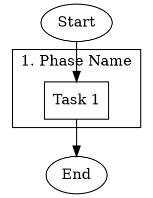
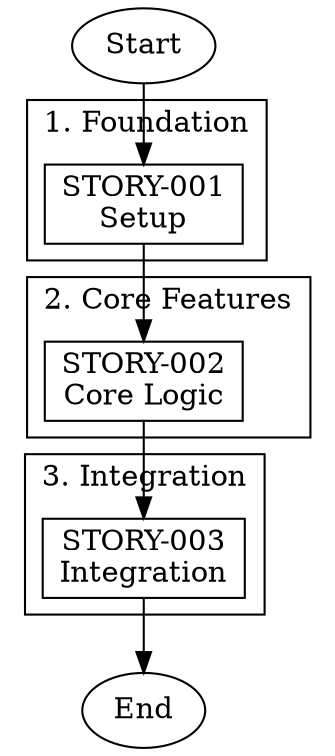
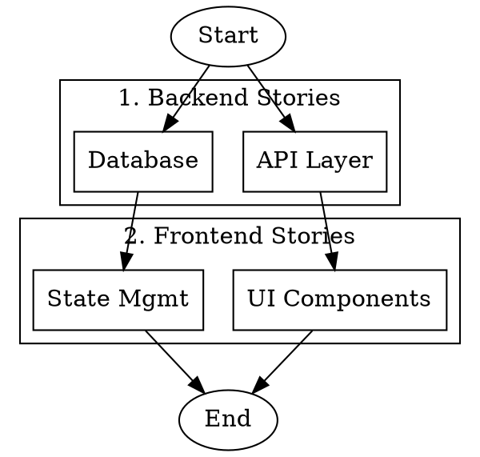
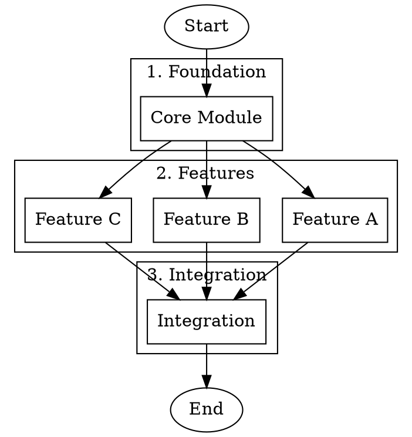
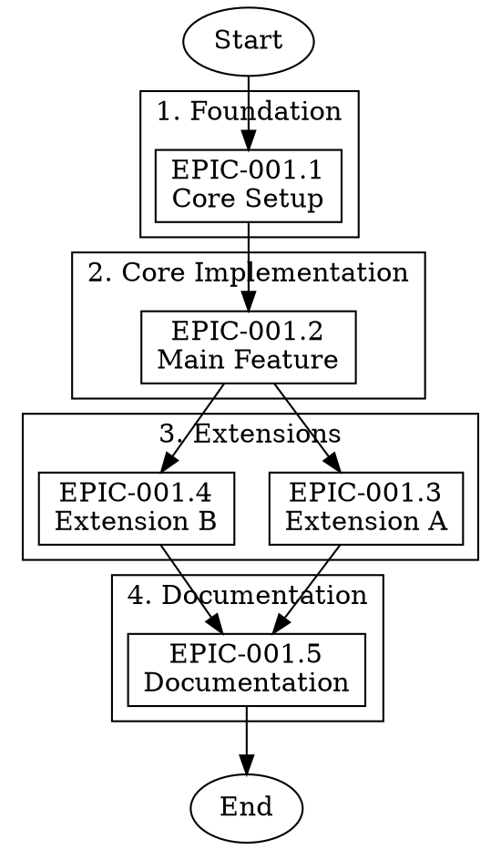

# DOT Workflow Orchestration Guide for LLMs

> **TEA Version**: 0.9.4 | **Primary CLI**: `tea-python`

This document provides instructions for generating DOT (Graphviz) files that orchestrate sequential and parallel execution of stories, tasks, or any workflow items using TEA agents.

## Use Case

When you need to:
- Implement multiple stories in a specific order
- Run development workflows with dependencies
- Orchestrate parallel tasks within sequential phases
- Generate executable YAML agents from visual diagrams

## Quick Start

### Step 1: Generate DOT File



### Step 2: Generate YAML Agent

```bash
tea-python from dot workflow.dot --use-node-commands -o workflow.yaml
```

### Step 3: Execute

```bash
tea-python run workflow.yaml
```

---

## DOT File Structure

### Required Elements

| Element | Purpose | Example |
|---------|---------|---------|
| `digraph name` | Graph container | `digraph story_implementation {}` |
| `Start` node | Entry point (ellipse shape) | `Start [label="Start", shape=ellipse];` |
| `End` node | Exit point (ellipse shape) | `End [label="End", shape=ellipse];` |
| `subgraph cluster_*` | Phase grouping | `subgraph cluster_build {}` |
| `command` attribute | Per-node command | `command="tea-python run ..."` |
| Edges | Execution order | `task_a -> task_b;` |

### Node Attributes

```dot
node_id [
    label="Display Name",           // Required: shown in output
    command="shell command here"    // Required: executed for this node
];
```

### Command Format for TEA Workflows

```dot
command="tea-python run <workflow.yaml> --input '{\"arg\": \"<value>\"}'"
```

**Escaping rules:**
- Use `\"` for quotes inside the command string
- The command is wrapped in double quotes in DOT format

---

## Patterns

### Pattern 1: Sequential Story Implementation

All stories execute one after another.



### Pattern 2: Parallel Stories Within Phases

Stories within the same phase run in parallel; phases run sequentially.



### Pattern 3: Mixed Dependencies

Some stories depend on specific predecessors.



---

## Command Templates

### Story Development Workflow

Use JSON input format with `arg` key:

```dot
command="tea-python run examples/workflows/bmad-story-development.yaml --input '{\"arg\": \"docs/stories/<STORY-ID>.md\"}'"
```

### Story Validation Workflow

```dot
command="tea-python run examples/workflows/bmad-story-validation.yaml --input '{\"arg\": \"docs/stories/<STORY-ID>.md\"}'"
```

### With Extended Timeout

For long-running workflows, add `--input-timeout` (in seconds). Default is 300s (5 minutes):

```dot
command="tea-python run examples/workflows/bmad-story-validation.yaml --input-timeout 54000 --input '{\"arg\": \"docs/stories/<STORY-ID>.md\"}'"
```

**Common timeout values:**
- `--input-timeout 600` - 10 minutes
- `--input-timeout 1800` - 30 minutes
- `--input-timeout 3600` - 1 hour
- `--input-timeout 54000` - 15 hours (900 minutes) - recommended for complex workflows

### Custom Workflow with JSON Inputs

For JSON inputs, use single quotes around the JSON (but avoid nested quotes when possible):

```dot
command="echo simple_value | tea-python run my-workflow.yaml --input -"
```

Or use environment variables:

```dot
command="STORY_ID=STORY-001 tea-python run my-workflow.yaml"
```

### Shell Commands (Non-TEA)

```dot
command="npm run build && npm test"
command="cargo build --release"
command="pytest tests/ -v"
```

---

## Generation Commands

### Basic Generation

```bash
# Generate YAML from DOT with per-node commands
tea-python from dot workflow.dot --use-node-commands -o workflow.yaml
```

### With Options

```bash
# Custom concurrency (default: 3)
tea-python from dot workflow.dot --use-node-commands -m 5 -o workflow.yaml

# Custom workflow name
tea-python from dot workflow.dot --use-node-commands -n "my-pipeline" -o workflow.yaml

# Validate before writing
tea-python from dot workflow.dot --use-node-commands --validate -o workflow.yaml
```

### Execute Generated Workflow

```bash
# Run the generated workflow
tea-python run workflow.yaml

# With extended timeout (900 minutes = 54000 seconds)
tea-python run workflow.yaml --input-timeout 54000

# With streaming output
tea-python run workflow.yaml --stream

# With verbose logging
tea-python run workflow.yaml -vv
```

### Alternative Tea Implementations

When you have multiple tea implementations (Python, Rust, or different versions), use the appropriate executable directly:

```bash
# Python implementation v0.9.4 (default)
tea-python run workflow.yaml

# Rust implementation
tea-rust run workflow.yaml
```

---

## LLM Generation Instructions

When asked to create a workflow orchestration DOT file:

### 1. Identify Stories/Tasks

Extract the list of items to orchestrate:
- Story IDs (e.g., `TEA-PARALLEL-001.1`)
- File paths (e.g., `docs/stories/TEA-PARALLEL-001.1-executor-abstraction.md`)
- Dependencies between items

### 2. Determine Phase Structure

Group items into phases based on:
- Dependencies (items with no deps go in early phases)
- Logical grouping (related items in same phase)
- Parallelization opportunity (independent items in same phase run in parallel)

### 3. Generate DOT File

```dot
digraph <workflow_name> {
    rankdir=TB;
    node [shape=box];

    Start [label="Start", shape=ellipse];
    End [label="End", shape=ellipse];

    // For each phase:
    subgraph cluster_<phase_name> {
        label="<N>. <Phase Label>";
        // For each item in phase:
        <item_id> [label="<Display Name>", command="tea-python run <workflow> --input-timeout 54000 --input '{\"arg\": \"<path>\"}'"];
    }

    // Define edges based on dependencies
    Start -> <first_items>;
    <item_a> -> <item_b>;
    <last_items> -> End;
}
```

### 4. Output Generation Command

Always include the command to generate the YAML:

```bash
tea-python from dot <filename>.dot --use-node-commands -o <filename>.yaml
```

---

## Complete Example: Epic Implementation

Given an epic with 5 stories and this dependency structure:
- 001.1 has no dependencies
- 001.2 depends on 001.1
- 001.3 depends on 001.2
- 001.4 depends on 001.3
- 001.5 depends on 001.4

### DOT File



### Generation Command

```bash
tea-python from dot epic_implementation.dot --use-node-commands -o epic_implementation.yaml
```

### Execution

```bash
# Execute workflow
tea-python run epic_implementation.yaml

# With extended timeout
tea-python run epic_implementation.yaml --input-timeout 54000
```

---

## Best Practices

### Labels
- **Keep labels simple**: Use short IDs like `TEA-PARALLEL-001.1` instead of multi-line labels
- **Avoid special characters**: No newlines (`\n`), quotes, or special chars in labels
- Labels are used as dict keys and tmux window names

### Commands
- **Use JSON input format**: `--input '{\"arg\": \"path/to/file.md\"}'` with proper escaping
- **Escape double quotes**: Use `\"` for quotes inside the command string
- **Test commands independently**: Run the command in a shell before embedding in DOT

### Example: Good vs Bad

```dot
// GOOD - simple label, JSON input format with timeout
story_1 [label="STORY-001", command="tea-python run workflow.yaml --input-timeout 54000 --input '{\"arg\": \"docs/story.md\"}'"];

// BAD - multi-line label, no timeout
story_1 [label="STORY-001\nDescription", command="tea-python run workflow.yaml --input '{\"arg\": \"docs/story.md\"}'"];
```

---

## Validation Checklist

Before generating:

- [ ] All task nodes have `command` attribute
- [ ] Start/End nodes use `shape=ellipse` (no command needed)
- [ ] Each phase is wrapped in `subgraph cluster_*` block
- [ ] Edges define correct execution order
- [ ] No circular dependencies
- [ ] Labels contain only alphanumeric, `-`, `_`, `.` characters
- [ ] Commands use JSON input format with proper escaping: `'{\"arg\": \"<path>\"}'`
- [ ] File paths are correct and exist

---

## Error Handling

| Error | Cause | Solution |
|-------|-------|----------|
| `Missing command attribute` | Node without `command` | Add `command="..."` to node |
| `Circular dependency` | A -> B -> A | Redesign flow to remove cycle |
| `Invalid JSON in input` | Bad escaping | Use `'{\"key\": \"value\"}'` format |
| `File not found` | Wrong path | Verify story file paths exist |

---

## Related Documentation

- [DOT-to-YAML LLM Reference](./DOT_TO_YAML_LLM_REFERENCE.md) - General DOT conversion guide
- [YAML Reference](./YAML_REFERENCE.md) - TEA YAML workflow syntax
