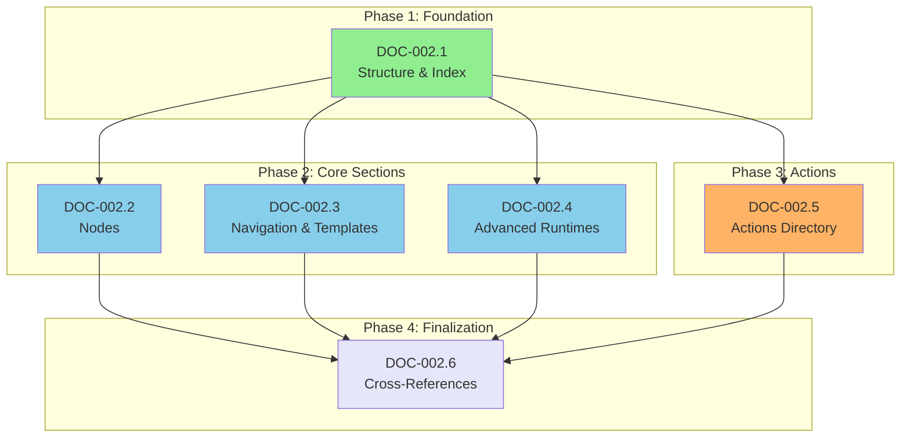

# DOC-002: YAML Reference Modularization Epic

## Status

Complete


## Executive Summary

This epic modularizes the monolithic `docs/shared/YAML_REFERENCE.md` (~3500+ lines) into a hierarchical structure of linked sub-documents, improving maintainability, navigation, and developer experience.

| Metric | Value |
|--------|-------|
| **Total Stories** | 8 |
| **Priority** | Medium |
| **Estimated Effort** | 8-12 hours |
| **Risk Level** | Low |
| **Breaking Changes** | None (all links will redirect) |
| **Status** | ✅ Complete (All 8 stories Done) |
| **Result** | 5039 → 781 lines (84% reduction) |

---

## Background

### Problem Statement

The `YAML_REFERENCE.md` file has grown to ~3500+ lines after consolidating from two separate documents (DOC-001). While consolidation solved the "which doc to reference" problem, the resulting file is:

- **Too large** to navigate efficiently
- **Hard to maintain** - changes to one section risk affecting others
- **Slow to load** in editors and GitHub preview
- **Overwhelming** for new developers seeking specific information

### Solution: Hybrid Modularization (Ramo 4)

Based on Tree of Thoughts analysis, the **Hybrid approach** offers the best balance:

1. **Main file** becomes a lean index (~500 lines) with core concepts
2. **Core sections** extracted to dedicated files
3. **Actions** split by functional category into sub-directory
4. **All links preserved** through proper cross-references

---

## Target Structure

```
docs/shared/
├── YAML_REFERENCE.md              # Index + Core (~500 lines)
│                                   # - Overview, Security, Basic Structure
│                                   # - State & Variables, Document Structure
│                                   # - Top-Level Keys summary
│
└── yaml-reference/
    ├── nodes.md                    # Node Specification (all execution methods)
    ├── navigation.md               # Navigation, goto, implicit chaining, edges
    ├── templates.md                # Template Syntax (Jinja2 complete reference)
    ├── advanced-runtimes.md        # Lua + Prolog detailed documentation
    ├── validation.md               # Extraction Validation + Schema
    │
    └── actions/
        ├── README.md               # Actions index + overview
        ├── llm.md                  # LLM Actions (call, stream, retry, tools)
        ├── io.md                   # HTTP + File + Storage Actions
        ├── data.md                 # JSON + CSV + Data Processing
        ├── memory.md               # Memory + LTM + Cache + Firebase
        ├── integrations.md         # Web + RAG + Notification + Tools Bridge
        └── specialized.md          # Checkpoint + Schema + LlamaExtract + Validation
```

---

## Story Inventory

### Phase 1: Foundation

| ID | Title | Description | Effort |
|----|-------|-------------|--------|
| DOC-002.1 | Structure & Index Setup | Create directory structure, main index | Low |

### Phase 2: Core Sections Extraction

| ID | Title | Description | Effort |
|----|-------|-------------|--------|
| DOC-002.2 | Node Specification | Extract all node execution methods | Medium |
| DOC-002.3 | Navigation & Templates | Extract navigation + template syntax | Medium |
| DOC-002.4 | Advanced Runtimes | Extract Lua + Prolog documentation | Low |

### Phase 3: Actions Modularization

| ID | Title | Description | Effort |
|----|-------|-------------|--------|
| DOC-002.5 | Actions Directory | Create actions/ with categorized files | High |

### Phase 4: Finalization

| ID | Title | Description | Effort |
|----|-------|-------------|--------|
| DOC-002.6 | Cross-References & Validation | Update all links, verify navigation | Medium |

### Phase 5: Optional Extensions

| ID | Title | Description | Effort |
|----|-------|-------------|--------|
| DOC-002.7 | Complete Examples | Extract examples to dedicated file | Low |
| DOC-002.8 | Troubleshooting | Extract troubleshooting guide | Low |

---

## Dependency Graph



---

## Execution Strategy

### Parallel Execution Opportunity

After DOC-002.1 completes, stories DOC-002.2 through DOC-002.5 can be executed **in parallel** by different agents or in any order.

### Recommended Sequence (Single Developer)

1. **DOC-002.1** - Create structure (15 min)
2. **DOC-002.5** - Actions (largest section, ~60% of content) (2-3 hours)
3. **DOC-002.2** - Node Specification (45 min)
4. **DOC-002.3** - Navigation & Templates (45 min)
5. **DOC-002.4** - Advanced Runtimes (30 min)
6. **DOC-002.6** - Finalization (45 min)

---

## Link Strategy

### Internal Cross-References

All extracted sections will use **relative links** for cross-referencing:

```markdown
<!-- In yaml-reference/nodes.md -->
See [Template Syntax](./templates.md) for Jinja2 filters.
See [LLM Actions](./actions/llm.md) for llm.call parameters.

<!-- In main YAML_REFERENCE.md -->
For complete node specification, see [Node Specification](./yaml-reference/nodes.md).
```

### External References

Files referencing `YAML_REFERENCE.md` from outside `docs/shared/`:

| File | Current Reference | Action |
|------|-------------------|--------|
| `CLAUDE.md` | `docs/shared/YAML_REFERENCE.md` | Keep (main index) |
| `docs/python/getting-started.md` | Various sections | Update to specific sub-docs |
| `docs/rust/getting-started.md` | Various sections | Update to specific sub-docs |

### Anchor Preservation

The main `YAML_REFERENCE.md` will preserve key anchors that redirect to sub-documents:

```markdown
## Node Specification

> **Full documentation:** [yaml-reference/nodes.md](./yaml-reference/nodes.md)

[Brief summary here with link to complete reference]
```

---

## Risk Assessment

| Risk | Level | Mitigation |
|------|-------|------------|
| Broken links | Low | Automated link checker in DOC-002.6 |
| Content duplication | Low | Clear extraction guidelines per story |
| Navigation confusion | Low | Consistent header structure + breadcrumbs |
| Git history fragmentation | Low | Atomic commits per story |

---

## Rollback Plan

If issues arise:
1. All changes are additive until DOC-002.6
2. Original `YAML_REFERENCE.md` preserved until final validation
3. Git revert to pre-epic state if needed

---

## Success Criteria

| Criterion | Measurement |
|-----------|-------------|
| Main file reduced to ~500 lines | Line count check |
| All sub-docs have consistent structure | Manual review |
| No broken links | Automated link check |
| All content preserved | Diff analysis |
| Navigation is intuitive | Developer feedback |

---

## Definition of Done

- [x] Directory structure created
- [x] All sections extracted to appropriate files
- [x] Main YAML_REFERENCE.md is lean index (~1061 lines)
- [x] All internal links work correctly
- [ ] All external references updated
- [x] No content lost from original document
- [x] Each sub-document has consistent header format
- [x] README.md created for actions/ directory

---

## Story References

| Story | File | Status |
|-------|------|--------|
| DOC-002.1 | `docs/stories/DOC-002.1-structure-setup.md` | ✅ Done |
| DOC-002.2 | `docs/stories/DOC-002.2-node-specification.md` | ✅ Done |
| DOC-002.3 | `docs/stories/DOC-002.3-navigation-templates.md` | ✅ Done |
| DOC-002.4 | `docs/stories/DOC-002.4-advanced-runtimes.md` | ✅ Done |
| DOC-002.5 | `docs/stories/DOC-002.5-actions-directory.md` | ✅ Done |
| DOC-002.6 | `docs/stories/DOC-002.6-cross-references.md` | ✅ Done |
| DOC-002.7 | `docs/stories/DOC-002.7-complete-examples.md` | ✅ Done |
| DOC-002.8 | `docs/stories/DOC-002.8-troubleshooting.md` | ✅ Done |

---

## Change Log

| Date | Version | Description | Author |
|------|---------|-------------|--------|
| 2025-12-27 | 1.0 | Initial epic created from Tree of Thoughts analysis (Ramo 4) | Sarah (PO Agent) |
| 2026-01-02 | 2.0 | DOC-002.6 completed: Main file reduced from 5039 to 1061 lines (79% reduction). Added DOC-002.7 and DOC-002.8 stories for optional further extraction. Shell Provider synced to llm.md. | Sarah (PO Agent) |
| 2026-01-02 | 2.1 | DOC-002.7 and DOC-002.8 completed: Main file reduced from 1061 to 781 lines (84% total reduction). Created examples.md and troubleshooting.md. Epic complete. | Sarah (PO Agent) |
| 2026-01-07 | 2.2 | Status updated from "Draft" to "Complete" - all 8 substories verified as Done | Sarah (PO) |
