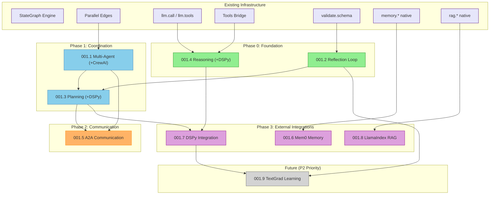

# Epic TEA-AGENT-001: Agentic Design Patterns - Built-in Primitives

## Status

**🔄 Partially Implemented**

_Status updated: 2026-01-13 - Core patterns implemented, some sub-stories in progress._

**Implemented Components:**
- `python/src/the_edge_agent/actions/agent_actions.py` - Agent coordination actions
- `python/src/the_edge_agent/actions/a2a_actions.py` - Agent-to-agent communication
- `python/src/the_edge_agent/a2a/` - A2A module (message queues, discovery)
- `rust/src/actions/planning.rs` - Rust planning actions
- `rust/src/actions/reasoning.rs` - Rust reasoning actions
- `rust/src/actions/reflection.rs` - Rust reflection actions
- `examples/multi-agent/` - Multi-agent examples
- `examples/planning/` - Planning examples

**QA Notes (2026-01-05):** QA Gate passed with 186 test scenarios, no blockers identified.

## Executive Summary

This epic implements 9 agentic design patterns as built-in primitives in The Edge Agent (both Python and Rust), based on the [Agentic Design Patterns](https://github.com/sarwarbeing-ai/Agentic_Design_Patterns) framework and industry best practices for composite agentic stacks. These patterns enable sophisticated multi-agent workflows without requiring users to manually wire complex graph topologies, with optional integrations for specialized external libraries (Mem0, DSPy, LlamaIndex, TextGrad).

| Metric | Value |
|--------|-------|
| **Total Stories** | 9 |
| **Target Patterns** | Multi-Agent, Reflection, Planning, Reasoning, A2A, Memory, Prompt Optimization, RAG, Learning |
| **Priority** | P0 (Critical for agentic workflows) |
| **Runtime Targets** | Python + Rust (feature parity when possible) |
| **Core Integration** | MCP, CrewAI, LangChain bridges |
| **External Libraries** | Mem0, DSPy, LlamaIndex, TextGrad (optional) |

---

## Epic Goal

Provide built-in agentic design pattern primitives that enable YAML agent developers to build production-grade multi-agent systems with reflection loops, planning capabilities, structured reasoning, and inter-agent communication without writing complex graph wiring code.

---

## Epic Description

### Business Context

The Edge Agent currently provides excellent low-level graph primitives (nodes, edges, parallel fan-out/fan-in, checkpoints) but lacks higher-level abstractions for common agentic patterns. Users must manually implement:

- Multi-agent coordination with specialized agents
- Self-correction loops with evaluation and retry
- Task decomposition and planning
- Structured reasoning (Chain-of-Thought, ReAct)
- Agent-to-agent messaging and delegation

This epic elevates these patterns to first-class built-in features, reducing YAML complexity and enabling best practices by default.

### Gap Analysis: Current State vs. Agentic Design Patterns Book

| Chapter | Pattern | Current State | Target State |
|---------|---------|---------------|--------------|
| **7** | Multi-Agent Collaboration | Manual parallel edges + custom fan-in | Built-in `agent.dispatch`, `agent.coordinate`, `agent.parallel` |
| **4** | Reflection/Self-Correction | Manual evaluate→correct edge loops | Built-in `reflection.loop` action with configurable evaluator |
| **6** | Planning | User-designed LLM prompts + parsing | Built-in `plan.decompose`, `plan.execute`, `plan.replan` |
| **17** | Reasoning Techniques | No structured reasoning support | Built-in `reason.cot`, `reason.react`, `reason.dspy.*` |
| **15** | Inter-Agent Communication | No agent messaging | Built-in `a2a.send`, `a2a.receive`, `a2a.broadcast` |
| **8** | Memory Management | Basic `memory.*` actions | Built-in `memory.mem0.*` with graph memory (Mem0) |
| **9** | Learning & Adaptation | No prompt optimization | Built-in `reason.dspy.*` for compiled prompts (DSPy) |
| **14** | RAG/Knowledge Retrieval | Basic `rag.*` actions | Built-in `rag.llamaindex.*` for agentic RAG |
| **N/A** | Gradient Learning | Not supported | Built-in `learn.textgrad.*` for prompt optimization (P2) |

### Architecture Overview

```
┌─────────────────────────────────────────────────────────────────────────────┐
│                        AGENTIC PATTERN PRIMITIVES                            │
│                     (New Built-in Actions & Node Types)                      │
├─────────────────────────────────────────────────────────────────────────────┤
│                                                                              │
│  ┌─────────────────┐  ┌─────────────────┐  ┌─────────────────┐              │
│  │  Multi-Agent    │  │   Reflection    │  │    Planning     │              │
│  │  Coordinator    │  │     Loop        │  │   Primitive     │              │
│  │                 │  │                 │  │                 │              │
│  │ agent.dispatch  │  │ reflection.loop │  │ plan.decompose  │              │
│  │ agent.coordinate│  │ reflection.eval │  │ plan.execute    │              │
│  │ agent.parallel  │  │ reflection.fix  │  │ plan.replan     │              │
│  └────────┬────────┘  └────────┬────────┘  └────────┬────────┘              │
│           │                    │                    │                        │
│           └────────────────────┴────────────────────┘                        │
│                               │                                              │
│                    ┌──────────┴──────────┐                                   │
│                    │  StateGraph Engine  │                                   │
│                    │  (Existing Core)    │                                   │
│                    └──────────┬──────────┘                                   │
│                               │                                              │
│  ┌─────────────────┐  ┌──────┴──────────┐  ┌─────────────────┐              │
│  │    Reasoning    │  │ Existing Actions│  │    A2A Comm     │              │
│  │   Techniques    │  │                 │  │                 │              │
│  │                 │  │ llm.call        │  │ a2a.send        │              │
│  │ reason.cot      │  │ llm.tools       │  │ a2a.receive     │              │
│  │ reason.react    │  │ memory.*        │  │ a2a.broadcast   │              │
│  │ reason.correct  │  │ web.*           │  │ a2a.delegate    │              │
│  └─────────────────┘  └─────────────────┘  └─────────────────┘              │
│                                                                              │
└─────────────────────────────────────────────────────────────────────────────┘

                                    │
                                    ▼
                    ┌─────────────────────────────┐
                    │  External Tool Bridges       │
                    │  (Integration Layer)         │
                    │                              │
                    │  tools.mcp   tools.crewai   │
                    │  tools.langchain            │
                    └─────────────────────────────┘
```

### Existing System Context

**Current Relevant Functionality:**
- `StateGraph` class - core graph execution engine
- `add_parallel_edge()` - parallel fan-out/fan-in
- `llm.call`, `llm.tools` - LLM integration
- `tools.mcp`, `tools.crewai`, `tools.langchain` - external tool bridges
- `retry.loop` action - basic retry with circuit breaker
- `validate.schema` - JSON schema validation

**Technology Stack:**
- Python 3.11+ with existing action framework
- Rust with existing YAML engine
- Jinja2/Tera template processing
- MCP, CrewAI, LangChain bridges (existing)

**Integration Points:**
- `actions/` directory - new action modules
- `yaml_engine.py` / `yaml.rs` - new node type handling
- `stategraph.py` / `stategraph.rs` - coordination primitives

---

## Stories

### Story 1: TEA-AGENT-001.1 - Multi-Agent Collaboration Primitives

**Status:** Draft

**Description:** Implement built-in primitives for multi-agent collaboration including coordinator patterns, agent dispatch, and parallel agent execution.

**Scope:**
- New actions: `agent.dispatch`, `agent.coordinate`, `agent.parallel`, `agent.sequential`
- Agent definition in YAML with specialized roles
- Coordinator pattern with consensus/voting aggregation
- Integration with existing parallel edge infrastructure

**YAML Syntax Preview:**

```yaml
name: multi-agent-research
settings:
  agents:
    researcher:
      system_prompt: "You are a research specialist..."
      model: gpt-4
    critic:
      system_prompt: "You are a critical reviewer..."
      model: gpt-4
    synthesizer:
      system_prompt: "You synthesize multiple perspectives..."
      model: gpt-4

nodes:
  - name: parallel_research
    action: agent.parallel
    with:
      agents: [researcher, critic]
      task: "{{ state.research_question }}"
      aggregation: collect  # or: vote, consensus, first

  - name: synthesize
    action: agent.dispatch
    with:
      agent: synthesizer
      task: "Synthesize these perspectives: {{ state.parallel_results | tojson }}"
```

**Acceptance Criteria:**
1. `agent.dispatch` executes single agent with task and returns result
2. `agent.parallel` executes multiple agents in parallel with configurable aggregation
3. `agent.sequential` chains agents with state threading
4. `agent.coordinate` implements coordinator pattern with retry on disagreement
5. Agent definitions support model, system_prompt, tools, and temperature
6. Integration with `tools.mcp`, `tools.crewai`, `tools.langchain` bridges
7. Python implementation complete with tests
8. Rust implementation complete with feature parity (when possible)

**Link:** `docs/stories/TEA-AGENT-001.1-multi-agent-collaboration.md`

---

### Story 2: TEA-AGENT-001.2 - Reflection Loop Primitive

**Status:** Draft

**Description:** Implement built-in reflection loop primitive that enables iterative self-correction with configurable evaluators.

**Scope:**
- New actions: `reflection.loop`, `reflection.evaluate`, `reflection.correct`
- Configurable evaluation strategies (LLM-based, schema-based, custom)
- Maximum iteration limits with circuit breaker
- Integration with existing `validate.schema` action

**YAML Syntax Preview:**

```yaml
nodes:
  - name: generate_with_reflection
    action: reflection.loop
    with:
      generator:
        action: llm.call
        prompt: "Generate a JSON response for: {{ state.request }}"
      evaluator:
        type: schema  # or: llm, custom
        schema:
          type: object
          required: [name, email]
      corrector:
        action: llm.call
        prompt: "Fix this JSON based on errors: {{ state.errors }}"
      max_iterations: 3
      on_failure: return_best  # or: raise, return_last
```

**Acceptance Criteria:**
1. `reflection.loop` executes generate→evaluate→correct cycle
2. Configurable evaluator types: `schema`, `llm`, `custom`
3. Maximum iteration limit with circuit breaker
4. State tracks iteration count, errors, and improvement history
5. On-failure strategies: `return_best`, `raise`, `return_last`
6. Python implementation complete with tests
7. Rust implementation complete with feature parity

**Link:** `docs/stories/TEA-AGENT-001.2-reflection-loop.md`

---

### Story 3: TEA-AGENT-001.3 - Planning & Decomposition Primitive

**Status:** Draft

**Description:** Implement built-in planning primitive that decomposes complex tasks into subtasks and executes them.

**Scope:**
- New actions: `plan.decompose`, `plan.execute`, `plan.replan`, `plan.status`
- Task dependency graph generation
- Parallel execution of independent subtasks
- Re-planning on subtask failure

**YAML Syntax Preview:**

```yaml
nodes:
  - name: plan_and_execute
    action: plan.decompose
    with:
      goal: "{{ state.user_goal }}"
      planner:
        model: gpt-4
        strategy: hierarchical  # or: flat, iterative
      executor:
        parallel: true  # Execute independent tasks in parallel
        max_concurrent: 3
      on_subtask_failure: replan  # or: skip, abort, retry

  - name: check_progress
    action: plan.status
    with:
      include_completed: false
```

**Acceptance Criteria:**
1. `plan.decompose` generates subtask list with dependencies
2. `plan.execute` runs subtasks respecting dependency order
3. Independent subtasks execute in parallel when `parallel: true`
4. `plan.replan` triggers re-planning when subtask fails
5. `plan.status` returns current progress and remaining tasks
6. Task state persists across checkpoints for resume
7. Python implementation complete with tests
8. Rust implementation complete with feature parity

**Link:** `docs/stories/TEA-AGENT-001.3-planning-primitive.md`

---

### Story 4: TEA-AGENT-001.4 - Reasoning Techniques Primitives

**Status:** Draft

**Description:** Implement built-in reasoning technique primitives including Chain-of-Thought, ReAct, and self-correction patterns.

**Scope:**
- New actions: `reason.cot`, `reason.react`, `reason.self_correct`, `reason.decompose`
- Structured output with reasoning traces
- ReAct pattern with thought→action→observation loop
- Integration with tool calling via `llm.tools`

**YAML Syntax Preview:**

```yaml
nodes:
  - name: solve_problem
    action: reason.cot
    with:
      problem: "{{ state.problem }}"
      model: gpt-4
      output_format:
        thinking: str  # Chain of thought
        answer: str    # Final answer
      few_shot_examples:
        - problem: "What is 2+2?"
          thinking: "I need to add 2 and 2. 2+2=4."
          answer: "4"

  - name: research_and_act
    action: reason.react
    with:
      goal: "{{ state.research_goal }}"
      tools:
        - web.search
        - web.scrape
      max_steps: 5
      output_format:
        thought: str
        action: str
        observation: str
        final_answer: str
```

**Acceptance Criteria:**
1. `reason.cot` implements Chain-of-Thought with structured output
2. `reason.react` implements ReAct loop with tool integration
3. `reason.self_correct` adds self-evaluation step after reasoning
4. `reason.decompose` breaks complex problems into sub-problems
5. Structured output preserves full reasoning trace
6. Integration with existing `llm.tools` action
7. Python implementation complete with tests
8. Rust implementation complete with feature parity

**Link:** `docs/stories/TEA-AGENT-001.4-reasoning-techniques.md`

---

### Story 5: TEA-AGENT-001.5 - Inter-Agent Communication (A2A)

**Status:** Draft

**Description:** Implement built-in inter-agent communication primitives for message passing, delegation, and shared memory.

**Scope:**
- New actions: `a2a.send`, `a2a.receive`, `a2a.broadcast`, `a2a.delegate`
- Message queue abstraction (in-memory default, pluggable backends)
- Shared memory space for agent coordination
- Agent discovery and capability advertisement

**YAML Syntax Preview:**

```yaml
name: coordinator-agent
settings:
  a2a:
    enabled: true
    namespace: research-team
    discovery: broadcast  # or: registry, static

nodes:
  - name: delegate_task
    action: a2a.delegate
    with:
      to: specialist-agent
      task: "{{ state.subtask }}"
      timeout: 60s
      on_timeout: fallback_local

  - name: gather_results
    action: a2a.receive
    with:
      from: [specialist-agent, reviewer-agent]
      timeout: 30s
      require_all: true

  - name: announce_completion
    action: a2a.broadcast
    with:
      namespace: research-team
      message:
        type: completion
        result: "{{ state.final_result }}"
```

**Acceptance Criteria:**
1. `a2a.send` sends message to specific agent
2. `a2a.receive` waits for messages with timeout
3. `a2a.broadcast` sends to all agents in namespace
4. `a2a.delegate` sends task and waits for result (request/response)
5. In-memory message queue for single-process execution
6. Shared state namespace for coordination
7. Python implementation complete with tests
8. Rust implementation: design document only (complex FFI)

**Link:** `docs/stories/TEA-AGENT-001.5-inter-agent-communication.md`

---

### Story 6: TEA-AGENT-001.6 - Mem0 Memory Integration

**Status:** Draft

**Description:** Integrate Mem0 as the universal memory layer for TEA agents, providing persistent user/session/agent memory with graph-based knowledge storage.

**Scope:**
- New actions: `memory.mem0.add`, `memory.mem0.search`, `memory.mem0.get_all`, `memory.mem0.update`, `memory.mem0.delete`
- Support for user_id, session_id, agent_id memory scopes
- Graph memory (Mem0g) for multi-hop reasoning
- Integration with existing TEA state management

**YAML Syntax Preview:**

```yaml
settings:
  memory:
    backend: mem0
    user_id: "{{ state.user_id }}"

nodes:
  - name: recall_context
    action: memory.mem0.search
    with:
      query: "{{ state.user_question }}"
      limit: 5

  - name: store_fact
    action: memory.mem0.add
    with:
      messages:
        - role: user
          content: "{{ state.user_input }}"
        - role: assistant
          content: "{{ state.response }}"
```

**Acceptance Criteria:**
1. `memory.mem0.add` stores messages with automatic fact extraction
2. `memory.mem0.search` retrieves relevant memories by semantic similarity
3. `memory.mem0.get_all` returns all memories for user/session/agent
4. `memory.mem0.update` modifies existing memory entries
5. `memory.mem0.delete` removes memories by ID
6. Graph memory enabled when `graph: true` in settings
7. Python implementation with `mem0ai` as optional dependency
8. Graceful fallback to native memory when Mem0 unavailable

**Link:** `docs/stories/TEA-AGENT-001.6-mem0-memory.md`

---

### Story 7: TEA-AGENT-001.7 - DSPy Prompt Optimization

**Status:** Draft

**Description:** Integrate DSPy for declarative prompt optimization, enabling compiled and optimized reasoning patterns.

**Scope:**
- New actions: `reason.dspy.cot`, `reason.dspy.react`, `reason.dspy.compile`, `reason.dspy.optimize`
- DSPy module wrapping for TEA actions
- Teleprompter integration for automatic prompt tuning
- Model-agnostic prompt compilation

**YAML Syntax Preview:**

```yaml
settings:
  dspy:
    enabled: true
    model: gpt-4

nodes:
  - name: optimized_reasoning
    action: reason.dspy.cot
    with:
      signature: "question -> answer"
      question: "{{ state.problem }}"

  - name: compile_prompts
    action: reason.dspy.compile
    with:
      module: cot
      trainset: "{{ state.examples }}"
      metric: exact_match
```

**Acceptance Criteria:**
1. `reason.dspy.cot` wraps DSPy ChainOfThought module
2. `reason.dspy.react` wraps DSPy ReAct module with tool integration
3. `reason.dspy.compile` compiles module with teleprompter
4. `reason.dspy.optimize` runs optimization against validation set
5. Compiled prompts persist across sessions
6. Python implementation with `dspy-ai` as optional dependency
7. Fallback to native `reason.*` actions when DSPy unavailable

**Link:** `docs/stories/TEA-AGENT-001.7-dspy-optimization.md`

---

### Story 8: TEA-AGENT-001.8 - LlamaIndex RAG Bridge

**Status:** Draft

**Description:** Integrate LlamaIndex for advanced RAG patterns including router queries, sub-question decomposition, and agentic retrieval.

**Scope:**
- New actions: `rag.llamaindex.query`, `rag.llamaindex.router`, `rag.llamaindex.subquestion`
- Query engine abstraction
- Router for dynamic retrieval strategy selection
- Sub-question decomposition for complex queries

**YAML Syntax Preview:**

```yaml
settings:
  llamaindex:
    index_path: "./vector_store"

nodes:
  - name: smart_retrieval
    action: rag.llamaindex.router
    with:
      query: "{{ state.question }}"
      engines:
        - type: vector
          description: "Semantic search over documents"
        - type: keyword
          description: "Exact keyword matching"
        - type: sql
          description: "Structured data queries"

  - name: complex_query
    action: rag.llamaindex.subquestion
    with:
      query: "Compare revenue of Apple and Google in 2024"
      parallel: true
```

**Acceptance Criteria:**
1. `rag.llamaindex.query` executes simple vector queries
2. `rag.llamaindex.router` selects optimal retrieval strategy
3. `rag.llamaindex.subquestion` decomposes and parallelizes complex queries
4. Index persistence and loading from state
5. Python implementation with `llama-index` as optional dependency
6. Integration with existing `rag.*` actions as fallback

**Link:** `docs/stories/TEA-AGENT-001.8-llamaindex-rag.md`

---

### Story 9: TEA-AGENT-001.9 - TextGrad Learning (P2)

**Status:** Draft (P2 - Future)

**Description:** Integrate TextGrad for gradient-based prompt optimization, enabling agents to improve their prompts based on feedback.

**Scope:**
- New actions: `learn.textgrad.optimize_prompt`, `learn.textgrad.feedback`
- Textual gradient computation
- Iterative prompt improvement
- Integration with reflection loop

**YAML Syntax Preview:**

```yaml
nodes:
  - name: improve_prompt
    action: learn.textgrad.optimize_prompt
    with:
      prompt_variable: "{{ state.system_prompt }}"
      loss_fn: "Evaluate response quality: {{ state.response }}"
      iterations: 3
```

**Acceptance Criteria:**
1. `learn.textgrad.optimize_prompt` improves prompt based on feedback
2. `learn.textgrad.feedback` computes textual gradients
3. Integration with reflection loop for runtime optimization
4. Python implementation with `textgrad` as optional dependency
5. Requires explicit opt-in due to computational cost

**Link:** `docs/stories/TEA-AGENT-001.9-textgrad-learning.md`

**Note:** This story is P2 priority and may be deferred to a future epic.

---

## Dependency Graph



### Dependency Matrix

| Story | Blocked By | Blocks | Can Parallelize With |
|-------|------------|--------|----------------------|
| **001.2 Reflection** | validate.schema | 001.3 Planning | 001.4 Reasoning |
| **001.4 Reasoning** | llm.tools | 001.3, 001.7 | 001.2 Reflection |
| **001.1 Multi-Agent** | Parallel Edges | 001.3, 001.5 | None |
| **001.3 Planning** | 001.1, 001.2 | 001.5, 001.7 | None |
| **001.5 A2A** | 001.1, 001.3 | None | 001.6, 001.8 |
| **001.6 Mem0** | memory.* native | None | 001.5, 001.7, 001.8 |
| **001.7 DSPy** | 001.4, 001.3 | 001.9 | 001.6, 001.8 |
| **001.8 LlamaIndex** | rag.* native | None | 001.5, 001.6, 001.7 |
| **001.9 TextGrad** | 001.7, 001.2 | None | None |

---

## Recommended Execution Order

### Sprint 1: Foundation (Week 1-2)

**Goal:** Establish reasoning and reflection primitives

| Order | Story | Rationale |
|-------|-------|-----------|
| 1 | **001.2 Reflection Loop** | Builds on existing validate.schema, enables self-correction |
| 2 | **001.4 Reasoning Techniques** | Builds on existing llm.tools, enables structured reasoning |

**Deliverable:** YAML agents can self-correct and use CoT/ReAct patterns.

### Sprint 2: Coordination (Week 3-4)

**Goal:** Multi-agent and planning capabilities

| Order | Story | Rationale |
|-------|-------|-----------|
| 3 | **001.1 Multi-Agent** | Foundation for complex agent workflows |
| 4 | **001.3 Planning** | Combines multi-agent with reflection |

**Deliverable:** YAML agents can coordinate multiple specialists and decompose tasks.

### Sprint 3: Communication (Week 5-6)

**Goal:** Full agent-to-agent communication

| Order | Story | Rationale |
|-------|-------|-----------|
| 5 | **001.5 A2A Communication** | Enables distributed agent systems |

**Deliverable:** YAML agents can communicate and delegate across processes.

### Sprint 4: External Integrations (Week 7-8)

**Goal:** Integrate industry-standard specialized libraries

| Order | Story | Rationale |
|-------|-------|-----------|
| 6 | **001.7 DSPy Integration** | Enhances 001.3 and 001.4 with compiled prompts |
| 7 | **001.6 Mem0 Memory** | Universal memory layer with graph knowledge |

**Deliverable:** YAML agents can use DSPy-optimized prompts and persistent memory.

### Sprint 5: Advanced RAG & Learning (Week 9-10)

**Goal:** Advanced retrieval and optional learning capabilities

| Order | Story | Rationale |
|-------|-------|-----------|
| 8 | **001.8 LlamaIndex RAG** | Router queries and sub-question decomposition |
| 9 | **001.9 TextGrad Learning** | P2 - defer if needed |

**Deliverable:** YAML agents have full agentic RAG and optional prompt learning.

---

## Compatibility Requirements

- [x] Existing YAML agents continue to work unchanged
- [x] Existing `llm.call`, `llm.tools` actions unchanged
- [x] Existing parallel edge behavior preserved
- [x] Existing checkpoint/interrupt behavior preserved
- [x] No breaking changes to StateGraph API
- [x] Optional feature flags for each primitive
- [x] Graceful degradation when dependencies unavailable

---

## Risk Assessment

| Risk | Likelihood | Impact | Mitigation |
|------|------------|--------|------------|
| Reflection infinite loops | Medium | High | Max iterations + circuit breaker |
| Multi-agent state conflicts | Medium | Medium | Deep copy per agent + merge strategy |
| Planning over-decomposition | Low | Medium | Max depth + token budget |
| A2A message loss | Medium | High | Acknowledgment + retry |
| Rust parity complexity | High | Medium | Design doc first, implement critical paths |
| Tool bridge compatibility | Medium | Medium | Abstract tool interface |

---

## Definition of Done

### Core Stories (001.1-001.5)
- [ ] TEA-AGENT-001.1 Multi-Agent completed with acceptance criteria
- [ ] TEA-AGENT-001.2 Reflection Loop completed with acceptance criteria
- [ ] TEA-AGENT-001.3 Planning completed with acceptance criteria
- [ ] TEA-AGENT-001.4 Reasoning completed with acceptance criteria
- [ ] TEA-AGENT-001.5 A2A Communication completed with acceptance criteria

### Integration Stories (001.6-001.8)
- [ ] TEA-AGENT-001.6 Mem0 Memory completed with acceptance criteria
- [ ] TEA-AGENT-001.7 DSPy Integration completed with acceptance criteria
- [ ] TEA-AGENT-001.8 LlamaIndex RAG completed with acceptance criteria

### Future Stories (P2)
- [ ] TEA-AGENT-001.9 TextGrad Learning (may defer to future epic)

### Quality Gates
- [ ] Python implementations complete with >90% test coverage
- [ ] Rust implementations complete where feasible
- [ ] All external integrations have graceful fallbacks when deps unavailable
- [ ] Integration tests with MCP/CrewAI/LangChain bridges
- [ ] Documentation updated (YAML_REFERENCE.md, getting-started)
- [ ] Example agents demonstrating each pattern
- [ ] No regressions in existing functionality
- [ ] Optional dependencies properly isolated in setup.py extras

---

## References

### Agentic Design Patterns Book
- [GitHub Repository](https://github.com/sarwarbeing-ai/Agentic_Design_Patterns)
- Chapter 4: Reflection
- Chapter 6: Planning
- Chapter 7: Multi-Agent Collaboration
- Chapter 15: Inter-Agent Communication
- Chapter 17: Reasoning Techniques

### Related TEA Stories
- TEA-BUILTIN-001.2: LLM Enhanced Actions (llm.tools foundation)
- TEA-BUILTIN-002.3: Tools Bridge Actions (MCP/CrewAI/LangChain)
- TD.13: Parallel Reliability Enhancement (parallel edge foundation)

---

## QA Results

**Review Date:** 2026-01-05
**Reviewer:** Quinn (Test Architect)
**Assessment Document:** `docs/qa/assessments/TEA-AGENT-001-test-design-20260105.md`

### Test Coverage Summary

| Metric | Value |
|--------|-------|
| **Total Test Scenarios** | 186 |
| **Unit Tests** | 98 (53%) |
| **Integration Tests** | 62 (33%) |
| **E2E Tests** | 26 (14%) |
| **P0 Critical Tests** | 82 |
| **P1 High Tests** | 68 |
| **P2/P3 Tests** | 36 |

**Coverage by Story:**
- 001.1 Multi-Agent: 50 scenarios
- 001.2 Reflection: 40 scenarios
- 001.3 Planning: 42 scenarios
- 001.4 Reasoning: 36 scenarios
- 001.5 A2A Communication: 18 scenarios

### Risk Areas Identified

| Risk | Likelihood | Impact | Mitigation Tests |
|------|------------|--------|------------------|
| **Reflection infinite loops** | Medium | High | 001.2-UNIT-005, 001.2-UNIT-025 (circuit breaker & raise strategy) |
| **Multi-agent state conflicts** | Medium | Medium | 001.1-UNIT-021 (deep copy), 001.1-INT-005 (ThreadPoolExecutor) |
| **Planning over-decomposition** | Low | Medium | 001.3-UNIT-005 (max_depth), 001.3-UNIT-022 (max_replans) |
| **A2A message loss** | Medium | High | 001.5-INT-002 (timeout), 001.5-INT-007 (fallback_local) |
| **Rust parity complexity** | High | Medium | E2E parity tests across all stories |
| **Tool bridge compatibility** | Medium | Medium | 001.1-INT-012/13/14/15 (MCP/CrewAI/LangChain) |

### Recommended Test Scenarios

**P0 Critical Path (Must Execute First):**
1. **001.1-E2E-001**: Multi-agent research workflow
2. **001.2-E2E-001**: JSON generation with schema reflection
3. **001.3-E2E-001**: Research planning workflow
4. **001.4-E2E-001**: CoT problem-solving workflow
5. **001.5-E2E-001**: Coordinator-worker workflow

**P0 Unit Tests (Fail Fast):**
- Agent registry validation (001.1-UNIT-001 to 003)
- Core action logic for dispatch, parallel, reflection loop
- Circuit breaker and max iteration limits
- State isolation verification (deep copy per agent)

**Integration Tests (Service Boundaries):**
- LLM service integration with correct parameters
- Tool bridge availability and error handling
- Checkpoint persistence across all patterns
- Action registry verification

### Concerns and Blockers

**CONCERNS:**
1. **Rust Parity Risk**: Story 001.5 (A2A) explicitly limits Rust to "design document only" due to complex FFI. Cross-runtime tests should validate Python-Rust interop carefully.
2. **LLM-as-Judge Reliability**: 001.2 LLM evaluator tests (001.2-INT-004/05) depend on LLM consistency. Consider mock-based deterministic tests for CI.
3. **Parallel Execution Race Conditions**: Multi-agent parallel tests (001.1-INT-005) should include stress tests under high concurrency.

**NO BLOCKERS IDENTIFIED**

### QA Gate Recommendation

**READY FOR DEVELOPMENT** - Test design is comprehensive with 186 scenarios covering all acceptance criteria. No coverage gaps identified. All epic-level risks have corresponding test mitigations.

---

## Change Log

| Date | Version | Description | Author |
|------|---------|-------------|--------|
| 2026-01-05 | 0.3 | **Sprint Change Proposal**: Expanded epic from 5 to 9 stories. Added Mem0 (001.6), DSPy (001.7), LlamaIndex (001.8), TextGrad (001.9) integration stories based on composite stack research. Updated dependency graph and execution order. | Sarah (PO) |
| 2026-01-05 | 0.2 | Added QA Results section with test design analysis | Quinn (QA) |
| 2026-01-04 | 0.1 | Initial epic draft from gap analysis | Sarah (PO) |
