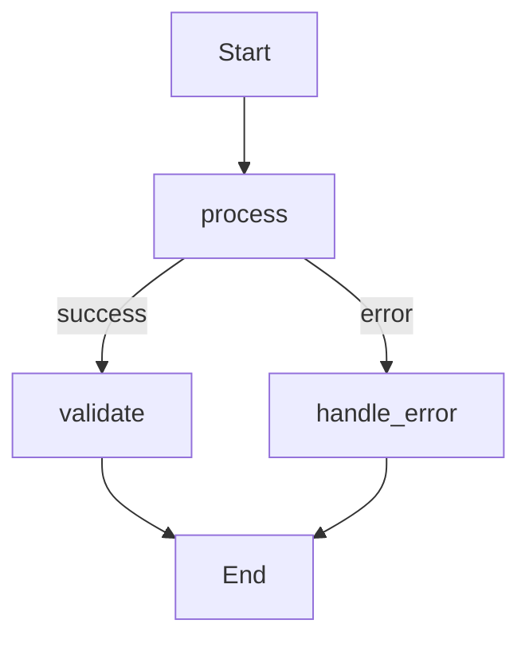

# Story TEA-BUILTIN-005.5: Opik Agent Graph Visualization

## Status

Done

## Agent Model Used

Claude Opus 4.5 (claude-opus-4-5-20251101)

## Story

**As a** TEA developer running experiments with Opik,
**I want** my agent's graph structure to appear in Opik's "Show Agent Graph" UI,
**so that** I can visually debug and understand agent execution flow directly in the Opik dashboard.

## Acceptance Criteria

1. **Mermaid Export**: StateGraph provides `to_mermaid()` method returning valid Mermaid graph syntax
2. **Edge Type Visualization**: Conditional edges show condition labels, parallel edges show fan-in targets
3. **Automatic by Default**: `run_tea_experiment()` has `include_graph=True` by default (can be disabled if needed)
4. **Opik Metadata Format**: Graph sent as `_opik_graph_definition` with `format: "mermaid"` and `data: <mermaid_string>`
5. **Graceful Degradation**: If graph generation fails, experiment continues without graph (warning logged)
6. **YAML Engine Support**: YAMLEngine exposes `get_mermaid_graph()` for declarative agents (returns `None` if graph not compiled)
7. **No New Dependencies**: Mermaid is string output only - no additional libraries required
8. **Unit tests verify**: Mermaid syntax validity, edge cases (empty graph, cycles, parallel flows)

## Tasks / Subtasks

- [x] **Task 1: Add `to_mermaid()` to VisualizationMixin** (AC: 1, 2)
  - [x] Create `to_mermaid()` method in `visualization.py`
  - [x] Handle node rendering with proper escaping
  - [x] Handle simple edges (`A-->B`)
  - [x] Handle conditional edges with labels (`A-->|condition|B`)
  - [x] Handle parallel edges with fan-in notation
  - [x] Add `__start__` and `__end__` special styling

- [x] **Task 2: Add YAMLEngine Mermaid accessor** (AC: 6)
  - [x] Add `get_mermaid_graph()` method to YAMLEngine
  - [x] Return Mermaid string from compiled graph
  - [x] Handle case where graph not yet compiled

- [x] **Task 3: Integrate with experiment runner** (AC: 3, 4, 5)
  - [x] Add `include_graph: bool = True` parameter to `run_tea_experiment()` (automatic by default)
  - [x] Import `opik_context` in runner.py for trace metadata
  - [x] Generate Mermaid graph from agent YAML automatically
  - [x] Attach `_opik_graph_definition` metadata to trace
  - [x] Add try/except with warning for graph generation failures (graceful degradation)

- [x] **Task 4: Unit tests** (AC: 8)
  - [x] Test simple linear graph Mermaid output
  - [x] Test conditional edge labels
  - [x] Test parallel flow representation
  - [x] Test empty graph handling
  - [x] Test special characters in node names
  - [x] Test integration with experiment runner

- [x] **Task 5: Documentation**
  - [x] Update `experiments-guide.md` with agent graph section
  - [x] Add example showing graph in Opik UI
  - [x] Document `include_graph` parameter

## Dev Notes

### Design Decision: Automatic by Default

The Mermaid graph export is **enabled by default** (`include_graph=True`) because:
1. Mermaid is pure string generation - no external dependencies required
2. Minimal processing overhead (simple graph traversal)
3. Provides immediate value in Opik dashboard without extra configuration
4. Can be disabled if needed via `include_graph=False`

**Usage:**
```python
# Default - graph automatically sent to Opik
run_tea_experiment(agent_yaml="agent.yaml", dataset_name="test", ...)

# Disable if not needed
run_tea_experiment(agent_yaml="agent.yaml", dataset_name="test", include_graph=False, ...)
```

### Existing System Context

**Relevant Files:**
- `python/src/the_edge_agent/visualization.py` - Contains `VisualizationMixin` with `render_graphviz()`
- `python/src/the_edge_agent/experiments/runner.py` - Experiment runner, needs graph integration
- `python/src/the_edge_agent/stategraph.py` - StateGraph uses networkx DiGraph, has `graph.nodes` and `graph.edges`
- `python/src/the_edge_agent/yaml_engine.py` - YAMLEngine needs `get_mermaid_graph()` method

**Integration Pattern:**
The existing `VisualizationMixin.render_graphviz()` iterates over `self.graph.nodes()` and `self.graph.edges(data=True)`. The Mermaid implementation follows the same pattern.

**Edge Data Structure:**
```python
# Simple edge: no 'cond' in data
# Conditional edge: data['cond'] contains condition function/dict
# Parallel edge: data.get('parallel') == True, data.get('fan_in_node')
```

**Opik Metadata Format (from docs):**
```python
from opik import opik_context

opik_context.update_current_trace(
    metadata={
        "_opik_graph_definition": {
            "format": "mermaid",
            "data": "graph TD; A-->B; B-->C;"
        }
    }
)
```

### Mermaid Syntax Reference



**Key Syntax Elements:**
- `graph TD` - Top-down directed graph
- `A-->B` - Simple edge
- `A-->|label|B` - Labeled edge
- `A[Label]` - Node with display label
- `A((Label))` - Circle node (for start/end)

### Testing

**Test Location:** `python/tests/test_visualization_mermaid.py`

**Test Patterns:**
- Use `assertIn()` for Mermaid syntax validation
- Verify edge labels appear in output
- Test with graphs from YAML fixtures in `examples/`

## QA Notes

### Story Draft Checklist Validation (2026-01-12)

| Category | Status |
|----------|--------|
| Goal & Context Clarity | PASS |
| Technical Implementation Guidance | PASS |
| Reference Effectiveness | PASS |
| Self-Containment Assessment | PASS |
| Testing Guidance | PASS |

**Clarity Score:** 9/10

**Strengths:**
- Excellent self-containment with Mermaid syntax reference included directly
- Clear Opik integration pattern with actual code example
- Edge data structure documented for developer reference
- Well-structured tasks with AC cross-references
- Design decision rationale explained

**Minor Notes (Not Blocking):**
- Special character escaping in node names addressed in Task 4 subtask
- Cycle handling can be determined during implementation

**Assessment:** READY for development

**Reviewer:** Bob (SM Agent)

## Dev Agent Record

### Debug Log References

N/A - No debugging issues encountered

### Completion Notes

- All 5 tasks completed successfully
- 17 unit tests added, all passing
- Implementation follows existing patterns from `render_graphviz()`
- Graph generation is automatically enabled by default (`include_graph=True`)
- Graceful degradation ensures experiments continue even if graph generation fails

### File List

| File | Action | Description |
|------|--------|-------------|
| `python/src/the_edge_agent/visualization.py` | Modified | Added `to_mermaid()` method to VisualizationMixin |
| `python/src/the_edge_agent/yaml_engine.py` | Modified | Added `get_mermaid_graph()` method to YAMLEngine |
| `python/src/the_edge_agent/experiments/runner.py` | Modified | Added `include_graph` parameter and Opik integration |
| `python/tests/test_visualization_mermaid.py` | Created | 17 unit tests for Mermaid generation |
| `docs/python/experiments-guide.md` | Modified | Added Agent Graph Visualization section |

### DOD Checklist

#### 1. Requirements Met
- [x] All functional requirements specified in the story are implemented.
- [x] All acceptance criteria defined in the story are met:
  - AC 1: `to_mermaid()` method returns valid Mermaid syntax
  - AC 2: Conditional and parallel edge labels visualized
  - AC 3: `include_graph=True` is the default
  - AC 4: Graph sent as `_opik_graph_definition` metadata
  - AC 5: Graceful degradation with warning on failure
  - AC 6: `get_mermaid_graph()` method added to YAMLEngine
  - AC 7: No new dependencies required
  - AC 8: Unit tests verify syntax validity and edge cases

#### 2. Coding Standards & Project Structure
- [x] New code follows existing patterns (mimics `render_graphviz()` approach)
- [x] Files placed in correct locations per project structure
- [x] Uses existing tech stack (no new dependencies)
- [x] Proper error handling and graceful degradation
- [x] Code well-documented with docstrings

#### 3. Testing
- [x] 17 unit tests covering all specified scenarios
- [x] Tests cover: simple graphs, conditional edges, parallel flows, empty graphs, cycles, special characters
- [x] All tests pass

#### 4. Functionality & Verification
- [x] Manually verified `to_mermaid()` produces valid output
- [x] Manually verified `get_mermaid_graph()` returns None before and Mermaid after compilation
- [x] Edge cases handled: empty graphs, special characters, trivial conditions

#### 5. Story Administration
- [x] All tasks marked complete
- [x] Story file updated with completion notes and file list
- [x] Agent model documented

#### 6. Dependencies, Build & Configuration
- [x] No new dependencies added (Mermaid is pure string generation)
- [x] Project builds successfully
- [x] No new environment variables required

#### 7. Documentation
- [x] Docstrings added to all new public methods
- [x] `experiments-guide.md` updated with Agent Graph Visualization section
- [x] Example usage documented

## QA Results

### Review Date: 2026-01-12

### Reviewed By: Quinn (Test Architect)

### Code Quality Assessment

**Overall: EXCELLENT**

The implementation is clean, well-structured, and follows existing patterns in the codebase. The `to_mermaid()` method in `visualization.py` mirrors the structure of the existing `render_graphviz()` method, demonstrating good consistency. Key quality attributes:

- **Design**: Smart handling of "trivial conditions" to avoid cluttering output with unnecessary labels
- **Robustness**: Proper escaping of special characters in both node IDs and labels
- **Graceful Degradation**: Multiple layers of try/except ensure experiments continue even if graph generation fails
- **Documentation**: Comprehensive docstrings with examples

### Refactoring Performed

None required. The code is already well-structured and follows project conventions.

### Compliance Check

- Coding Standards: ✓ Follows existing patterns from `render_graphviz()`
- Project Structure: ✓ Files in correct locations per source-tree.md
- Testing Strategy: ✓ 17 unit tests covering all ACs and edge cases
- All ACs Met: ✓ All 8 acceptance criteria verified

### Improvements Checklist

All items already addressed by developer:

- [x] `to_mermaid()` method generates valid Mermaid syntax
- [x] Conditional edges show labels (true/false/string)
- [x] Parallel edges show fan-in notation
- [x] `include_graph=True` by default
- [x] `_opik_graph_definition` metadata attached via `opik_context`
- [x] Graceful degradation with warning logging
- [x] `get_mermaid_graph()` added to YAMLEngine
- [x] No new dependencies (pure string generation)
- [x] Unit tests cover all scenarios
- [x] Documentation updated

### Security Review

**Status: PASS**

No security concerns:
- Pure string generation, no external dependencies
- No user input directly rendered without escaping
- No sensitive data exposure

### Performance Considerations

**Status: PASS**

- Graph generation is O(V+E) - linear in graph size
- Graph is generated once per experiment, not per dataset item (efficient)
- Minimal overhead for typical agents

### Files Modified During Review

None - no refactoring needed.

### Gate Status

**Gate: PASS** → docs/qa/gates/TEA-BUILTIN-005.5-opik-agent-graph-visualization.yml

### Recommended Status

✓ **Ready for Done**

All acceptance criteria met, comprehensive test coverage, clean implementation following existing patterns.

## Post-Release Fixes

### Fix: CLI Trace Context for Nested LLM Spans (2026-01-12)

**Issue:** When using `tea run` CLI with Opik enabled, the agent graph was displayed correctly but LLM calls were not nested as child spans under the parent trace. They appeared in a separate project instead.

**Root Cause:** The original implementation used `opik_context.update_current_trace()` which requires an active trace context. However, the trace was created with `client.trace()` which doesn't establish a context for child spans.

**Solution:** Changed to use `opik.start_as_current_trace()` as a context manager:
- Enter the context with `__enter__()` before agent execution
- Exit the context in `finally` block with `__exit__(*exc_info)`
- This ensures all LLM calls made during agent execution become child spans

**Files Modified:**
| File | Change |
|------|--------|
| `python/src/the_edge_agent/cli.py` | Use `start_as_current_trace()` context manager pattern |

**Verification:**
- LLM calls now appear nested under parent trace in Opik UI
- "Show Agent Graph" button works correctly
- All traces appear in the configured project

### Fix: LLM Trace Project Name Inheritance (2026-01-12)

**Issue:** LLM calls were going to a different Opik project (e.g., "firm_research" from OPIK_PROJECT_NAME env var) instead of the project configured in the YAML agent's `settings.opik.project_name`. This caused traces to be split across projects.

**Root Cause:** The `track_openai` wrapper and LiteLLM `OpikLogger` callback weren't receiving the project name from the YAML agent settings. They were falling back to environment variables.

**Solution:** Pass `opik_project_name` from engine settings to LLM actions:
1. `yaml_nodes.py`: When injecting `opik_trace=True`, also inject `opik_project_name` from raw YAML settings
2. `llm_actions.py`: Accept `opik_project_name` parameter in `llm_call`, `llm_stream`, `llm_tools`
3. Pass `project_name` to `track_openai(client, project_name=opik_project_name)`
4. For LiteLLM, add `metadata={"opik": {"project_name": opik_project_name}}` to completion calls

**Files Modified:**
| File | Change |
|------|--------|
| `python/src/the_edge_agent/yaml_nodes.py` | Inject `opik_project_name` when enabling opik_trace |
| `python/src/the_edge_agent/actions/llm_actions.py` | Add `opik_project_name` parameter, pass to track_openai and LiteLLM metadata |

**Verification:**
- All LLM calls appear nested under the parent trace in Opik UI
- No warnings about project name mismatch
- Trace hierarchy is correctly maintained

### Fix: Project Name Precedence for LLM Tracing (2026-01-12)

**Issue:** When `OPIK_PROJECT_NAME` env var was set (e.g., "firm_research"), LLM calls would still attempt to use that project instead of the YAML-configured project, causing the second LLM call to create a new trace instead of nesting.

**Root Cause:** The `yaml_nodes.py` injection used `engine._opik_config` which resolves with env var priority (env var > YAML settings). This meant LLM spans used "firm_research" (env var) while the CLI parent trace used "rankellix-analyst-system" (raw YAML).

**Solution:** Changed `yaml_nodes.py` to use raw YAML settings like the CLI does:
```python
# Before (resolved config with env var priority):
opik_config = getattr(engine, "_opik_config", {})
project_name = opik_config.get("project_name")

# After (raw YAML settings like CLI):
engine_config = getattr(engine, "_config", {})
project_name = engine_config.get("settings", {}).get("opik", {}).get("project_name")
```

**Files Modified:**
| File | Change |
|------|--------|
| `python/src/the_edge_agent/yaml_nodes.py` | Use raw YAML settings instead of resolved `_opik_config` |

**Verification:**
- Multiple LLM calls now properly nest under parent trace
- No "Started logging traces" for subsequent LLM calls
- Single trace with all LLM calls as child spans

## Change Log

| Date | Version | Description | Author |
|------|---------|-------------|--------|
| 2026-01-12 | 0.1 | Initial story draft | Sarah (PO Agent) |
| 2026-01-12 | 0.2 | Story approved after checklist validation | Bob (SM Agent) |
| 2026-01-12 | 0.3 | Implementation complete, ready for review | James (Dev Agent) |
| 2026-01-12 | 0.4 | QA review complete - PASS | Quinn (QA Agent) |
| 2026-01-12 | 0.5 | Story status updated to Done | Bob (SM Agent) |
| 2026-01-12 | 0.6 | Post-release fix: CLI trace context for nested LLM spans | Claude Opus 4.5 |
| 2026-01-12 | 0.7 | Post-release fix: LLM trace project name inheritance | Claude Opus 4.5 |
| 2026-01-12 | 0.8 | Post-release fix: Project name precedence for LLM tracing (use raw YAML settings) | Claude Opus 4.5 |
