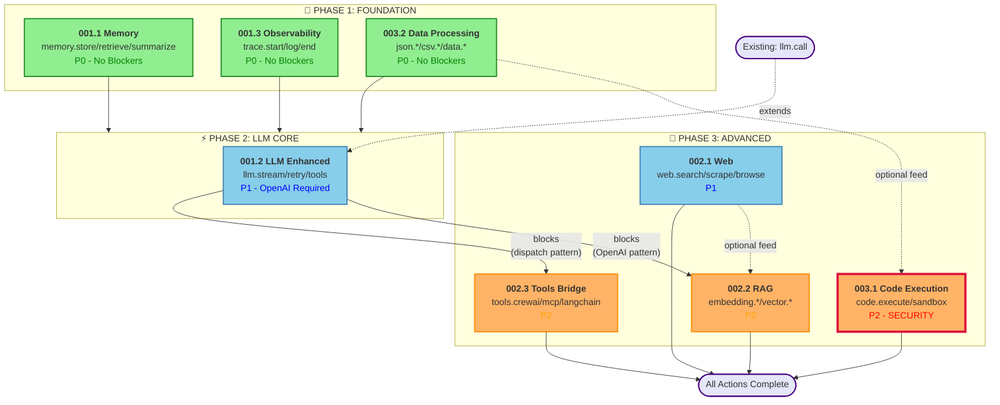
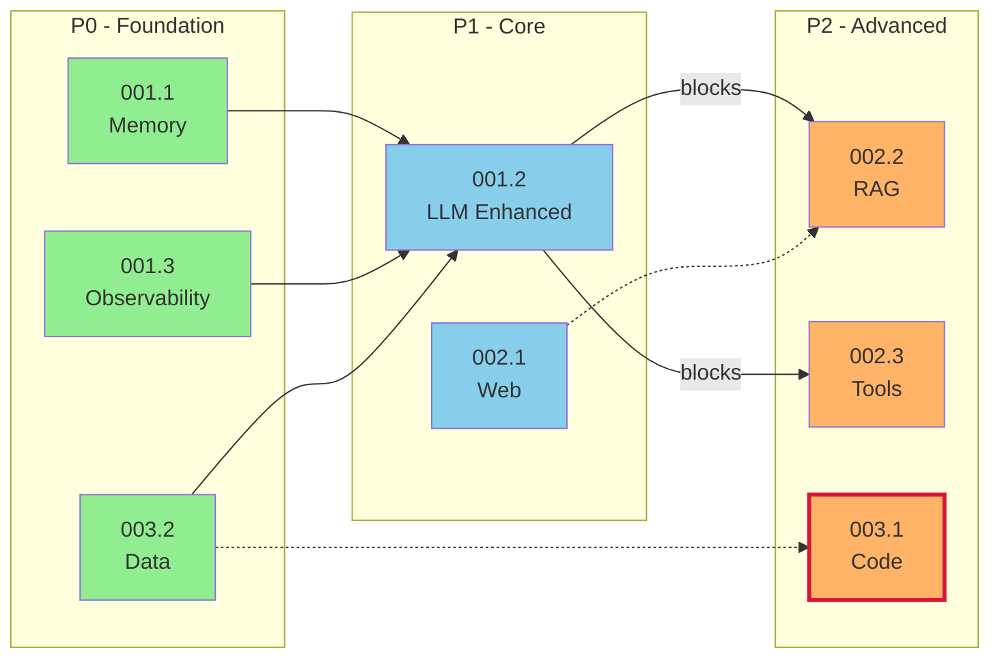
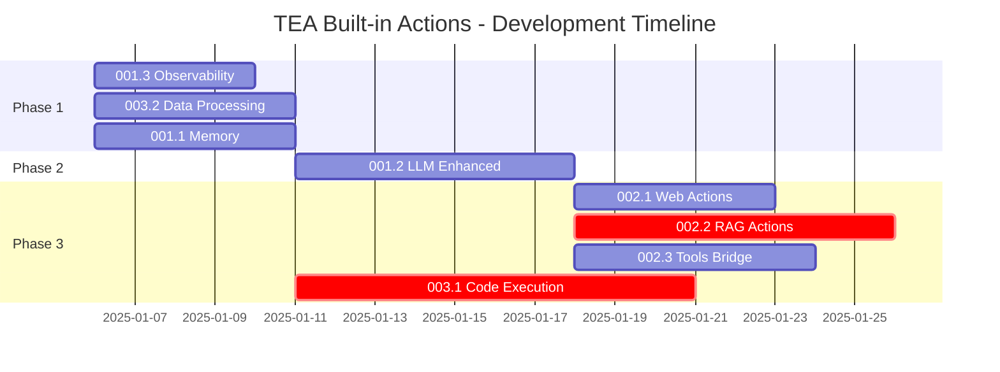

# TEA Built-in Actions Epic Overview

## Status

Obsolete

> **Note:** This epic planning document is now obsolete. Core implementation (8 of 11 original stories) is complete. The scope has since expanded beyond this overview with additional stories for Neo4j, DuckDB, LanceDB, and model2vec integrations. Refer to individual `TEA-BUILTIN-*` stories for current status.

## Executive Summary

This document provides a comprehensive overview of the 11 user stories for implementing built-in actions in The Edge Agent (tea) YAML engine. These actions enable YAML agent developers to build production-grade LLM agents without writing Python code.

| Metric | Value |
|--------|-------|
| **Total Stories** | 11 |
| **Total Actions** | 40+ |
| **Priority Tiers** | P0 (3), P1 (6), P2 (2) |
| **Estimated Effort** | 13-16 person-weeks |
| **External Dependencies** | OpenAI (required), 15+ optional |

---

## Story Inventory

### P0 - Core Built-in Actions (Critical Path)

| ID | Title | Actions | Risk | Effort |
|----|-------|---------|------|--------|
| TEA-BUILTIN-001.1 | Memory Actions | `memory.store`, `memory.retrieve`, `memory.summarize` | Low | Medium |
| TEA-BUILTIN-001.2 | LLM Enhanced Actions | `llm.stream`, `llm.retry`, `llm.tools` | Medium | High |
| TEA-BUILTIN-001.3 | Observability Actions | `trace.start`, `trace.log`, `trace.end` | Low | Medium |

### P1 - Integration Actions

| ID | Title | Actions | Risk | Effort |
|----|-------|---------|------|--------|
| TEA-BUILTIN-001.4 | Long-Term Memory + Graph | `ltm.*`, `graph.*` with CozoDB (local/Datalog) + **Bighorn** (cloud-native/Cypher, S3/GCS direct I/O) | Medium | High |
| TEA-BUILTIN-001.5 | Cloud-Native LTM Backends | Turso, Firestore, PostgreSQL, Litestream backends for LTM | Medium | High |
| TEA-BUILTIN-002.1 | Web Actions | `web.search`, `web.scrape`, `web.browse` | Medium | High |
| TEA-BUILTIN-002.2 | RAG Actions | `embedding.create`, `vector.store`, `vector.query` | Medium | High |
| TEA-BUILTIN-002.3 | Tools Bridge Actions | `tools.crewai`, `tools.mcp`, `tools.langchain`, `tools.discover` | High | High |
| TEA-BUILTIN-004.1 | Remote Storage Actions (fsspec) | `file.read` (20+ backends), `file.write`, `storage.list`, `storage.exists`, `storage.delete`, `storage.copy`, `storage.info`, `storage.mkdir`, `storage.native` | Low | Medium |

### P2 - Extended Actions

| ID | Title | Actions | Risk | Effort |
|----|-------|---------|------|--------|
| TEA-BUILTIN-003.1 | Code Execution Actions | `code.execute`, `code.sandbox` | **Critical** | High |
| TEA-BUILTIN-003.2 | Data Processing Actions | `json.parse`, `json.transform`, `json.stringify`, `csv.parse`, `csv.stringify`, `data.validate`, `data.merge`, `data.filter` | Low | Medium |

---

## Dependency Graph

```
┌─────────────────────────────────────────────────────────────────────────────┐
│                           PHASE 1: FOUNDATION                               │
│                        (No External Dependencies)                           │
├─────────────────────────────────────────────────────────────────────────────┤
│                                                                             │
│  ┌─────────────────┐  ┌─────────────────┐  ┌─────────────────┐             │
│  │ TEA-BUILTIN-    │  │ TEA-BUILTIN-    │  │ TEA-BUILTIN-    │             │
│  │ 001.1           │  │ 001.3           │  │ 003.2           │             │
│  │ Memory Actions  │  │ Observability   │  │ Data Processing │             │
│  │                 │  │ Actions         │  │ Actions         │             │
│  │ [No Blockers]   │  │ [No Blockers]   │  │ [No Blockers]   │             │
│  │ stdlib + opt    │  │ stdlib only     │  │ stdlib only     │             │
│  └────────┬────────┘  └─────────────────┘  └─────────────────┘             │
│           │                                                                 │
│           │ memory.summarize uses llm.call                                  │
│           ▼                                                                 │
├─────────────────────────────────────────────────────────────────────────────┤
│                           PHASE 2: LLM CORE                                 │
│                      (Requires OpenAI API Key)                              │
├─────────────────────────────────────────────────────────────────────────────┤
│                                                                             │
│           ┌─────────────────────────────────────────┐                       │
│           │ TEA-BUILTIN-001.2                       │                       │
│           │ LLM Enhanced Actions                    │                       │
│           │                                         │                       │
│           │ • llm.stream  (streaming responses)     │                       │
│           │ • llm.retry   (resilience)              │                       │
│           │ • llm.tools   (function calling)        │◄── Establishes        │
│           │                                         │    action dispatch    │
│           │ [Extends existing llm.call]             │    pattern            │
│           └──────────────┬──────────────────────────┘                       │
│                          │                                                  │
│           ┌──────────────┼──────────────┐                                   │
│           │              │              │                                   │
│           ▼              ▼              ▼                                   │
├─────────────────────────────────────────────────────────────────────────────┤
│                           PHASE 3: ADVANCED                                 │
│                    (Various Optional Dependencies)                          │
├─────────────────────────────────────────────────────────────────────────────┤
│                                                                             │
│  ┌─────────────────┐  ┌─────────────────┐  ┌─────────────────┐             │
│  │ TEA-BUILTIN-    │  │ TEA-BUILTIN-    │  │ TEA-BUILTIN-    │             │
│  │ 002.1           │  │ 002.2           │  │ 003.1           │             │
│  │ Web Actions     │  │ RAG Actions     │  │ Code Execution  │             │
│  │                 │  │                 │  │                 │             │
│  │ [requests, bs4] │  │ [OpenAI embed]  │  │ [RestrictedPy]  │             │
│  │ [opt: playwright│  │ [opt: chroma]   │  │ [SECURITY!]     │             │
│  └─────────────────┘  └─────────────────┘  └─────────────────┘             │
│                                                                             │
│                          │                                                  │
│                          ▼                                                  │
│           ┌─────────────────────────────────────────┐                       │
│           │ TEA-BUILTIN-002.3                       │                       │
│           │ Tools Bridge Actions                    │                       │
│           │                                         │                       │
│           │ [Depends on llm.tools dispatch pattern] │                       │
│           │ [All bridges optional]                  │                       │
│           └─────────────────────────────────────────┘                       │
│                                                                             │
└─────────────────────────────────────────────────────────────────────────────┘
```

### Visual Dependency Diagram (Mermaid)



### Simplified Dependency View



### Development Timeline (Gantt)



---

## Dependency Matrix

| Story | Blocked By | Blocks | Can Parallelize With |
|-------|------------|--------|----------------------|
| **001.1 Memory** | None | 001.4, 002.2 (optional) | 001.3, 003.2 |
| **001.2 LLM Enhanced** | None | 001.1, 002.2, 002.3 | 001.3, 003.2 |
| **001.3 Observability** | None | None | 001.1, 001.2, 003.2 |
| **001.4 Long-Term Memory** | 001.1, 002.2 | 001.5 | 002.1, 003.1, 004.1 |
| **001.5 Cloud-Native LTM** | 001.4 | None | 002.1, 003.1, 004.1 |
| **002.1 Web** | None | 002.2 (optional) | 002.2, 003.1, 004.1 |
| **002.2 RAG** | 001.2 | 001.4 | 002.1, 003.1, 004.1 |
| **002.3 Tools Bridge** | 001.2 | None | 004.1 |
| **003.1 Code Execution** | None | None | 002.1, 002.2, 004.1 |
| **003.2 Data Processing** | None | None | 001.1, 001.3, 001.2, 004.1 |
| **004.1 Remote Storage** | None | None | All others (no blocking deps) |

---

## Prerequisites Summary

### Required for All Development

| Prerequisite | Purpose | Setup |
|--------------|---------|-------|
| Python >=3.9 | Runtime | System |
| pytest | Testing | `pip install pytest` |
| OpenAI API Key | LLM actions | https://platform.openai.com |

### Per-Story Prerequisites

| Story | Required | Optional |
|-------|----------|----------|
| **001.1 Memory** | None | `OPENAI_API_KEY`, Redis |
| **001.2 LLM Enhanced** | `OPENAI_API_KEY`, `openai>=1.0.0` | None |
| **001.3 Observability** | None | None |
| **001.4 Long-Term Memory** | `pycozo[embedded]>=0.7.0` (CozoDB), `kuzu` (Bighorn) | `OPENAI_API_KEY` (for embeddings), AWS/GCS credentials (for Bighorn cloud I/O) |
| **002.1 Web** | `requests`, `beautifulsoup4`, `lxml` | `SERPER_API_KEY`, Playwright |
| **002.2 RAG** | `OPENAI_API_KEY` | `numpy`, `chromadb` |
| **002.3 Tools Bridge** | None | `crewai`, `mcp`, `langchain` |
| **003.1 Code Execution** | `RestrictedPython` | `py_mini_racer`, `E2B_API_KEY` |
| **003.2 Data Processing** | None | `jmespath`, `jsonschema` |
| **001.5 Cloud-Native LTM** | None | `libsql-client` (Turso), `firebase-admin` (Firestore), `psycopg[pool]` (PostgreSQL) |
| **004.1 Remote Storage** | `fsspec` | `s3fs` (S3), `gcsfs` (GCS/Firebase), `adlfs` (Azure) |

### API Keys Required

| Key | Required For | Free Tier |
|-----|--------------|-----------|
| `OPENAI_API_KEY` | LLM, Embeddings, Memory summarize | Yes (limited) |
| `SERPER_API_KEY` | Web search (Serper provider) | Yes (2500/month) |
| `E2B_API_KEY` | Cloud code execution | Yes (limited) |

---

## Risk Assessment

| Story | Risk Level | Primary Risk | Mitigation |
|-------|------------|--------------|------------|
| **001.1 Memory** | Low | TTL implementation complexity | Use monotonic time |
| **001.2 LLM Enhanced** | Medium | Streaming integration with StateGraph | Incremental rollout |
| **001.3 Observability** | Low | Thread safety in parallel execution | Use threading locks |
| **001.4 Long-Term Memory** | Low | CozoDB Datalog learning curve | SQLite storage (stable), query limits |
| **002.1 Web** | Medium | Rate limiting, robots.txt compliance | Per-domain rate limiter |
| **002.2 RAG** | Medium | Embedding dimension mismatches | Validate at store time |
| **002.3 Tools Bridge** | High | External library API changes | Version pinning |
| **003.1 Code Execution** | **Critical** | Sandbox escape, security vulnerabilities | Security tests, default OFF |
| **003.2 Data Processing** | Low | Large file memory issues | Streaming generators |
| **001.5 Cloud-Native LTM** | Medium | Search parity across backends, connection pooling | Backend abstraction layer, feature detection |
| **004.1 Remote Storage** | Low | fsspec API changes | Battle-tested library, version pinning |

---

## Recommended Execution Order

### Sprint 1: Foundation (Week 1-2)

**Goal**: Establish core infrastructure with zero external dependencies

| Order | Story | Rationale |
|-------|-------|-----------|
| 1 | **003.2 Data Processing** | Lowest risk, stdlib only, enables data manipulation |
| 2 | **001.3 Observability** | No dependencies, enables debugging for other stories |
| 3 | **001.1 Memory** | Foundation for stateful agents |

**Deliverable**: Basic YAML agents can manipulate data, trace execution, and maintain state.

### Sprint 2: LLM Core (Week 3-4)

**Goal**: Production-ready LLM capabilities

| Order | Story | Rationale |
|-------|-------|-----------|
| 4 | **001.2 LLM Enhanced** | Unblocks RAG and Tools Bridge |

**Deliverable**: YAML agents have streaming, retries, and tool calling.

### Sprint 3: Integration (Week 5-7)

**Goal**: Connect to external data sources

| Order | Story | Rationale |
|-------|-------|-----------|
| 5 | **002.1 Web** | Independent, enables research agents |
| 6 | **002.2 RAG** | Depends on 001.2, enables knowledge agents |
| 7 | **002.3 Tools Bridge** | Depends on 001.2, maximum ecosystem leverage |

**Deliverable**: YAML agents can search web, query knowledge bases, use external tools.

### Sprint 4: Advanced (Week 8-10)

**Goal**: Code execution with security hardening

| Order | Story | Rationale |
|-------|-------|-----------|
| 8 | **003.1 Code Execution** | Highest risk, requires security review |

**Deliverable**: YAML agents can safely execute generated code.

---

## Feature Flags

Each story implements a feature flag for gradual rollout:

```python
engine = YAMLEngine(
    # P0 - Core
    enable_memory=True,           # 001.1
    enable_llm_enhanced=True,     # 001.2
    enable_tracing=True,          # 001.3

    # P1 - Integration
    enable_web=True,              # 002.1
    enable_rag=True,              # 002.2
    enable_tools_bridge=True,     # 002.3

    # P2 - Extended
    enable_code_execution=False,  # 003.1 - Default OFF for security
    enable_data_processing=True,  # 003.2
)
```

---

## Integration Points

All stories integrate via `_setup_builtin_actions()` in `src/the_edge_agent/yaml_engine.py`:

```
yaml_engine.py
├── _setup_builtin_actions()     # Lines 623-786
│   ├── llm.call (existing)
│   ├── llm.stream (001.2)
│   ├── llm.retry (001.2)
│   ├── llm.tools (001.2)
│   ├── memory.store (001.1)
│   ├── memory.retrieve (001.1)
│   ├── memory.summarize (001.1)
│   ├── trace.start (001.3)
│   ├── trace.log (001.3)
│   ├── trace.end (001.3)
│   ├── web.search (002.1)
│   ├── web.scrape (002.1)
│   ├── web.browse (002.1)
│   ├── embedding.create (002.2)
│   ├── vector.store (002.2)
│   ├── vector.query (002.2)
│   ├── tools.crewai (002.3)
│   ├── tools.mcp (002.3)
│   ├── tools.langchain (002.3)
│   ├── tools.discover (002.3)
│   ├── code.execute (003.1)
│   ├── code.sandbox (003.1)
│   ├── json.parse (003.2)
│   ├── json.transform (003.2)
│   ├── json.stringify (003.2)
│   ├── csv.parse (003.2)
│   ├── csv.stringify (003.2)
│   ├── data.validate (003.2)
│   ├── data.merge (003.2)
│   └── data.filter (003.2)
```

---

## Testing Strategy

### Test Categories per Story

| Category | Purpose | Required |
|----------|---------|----------|
| **Unit Tests** | Individual action functionality | All stories |
| **Integration Tests** | Action in YAML workflow context | All stories |
| **Security Tests** | Sandbox escape prevention | 003.1 only |

### Test Coverage Targets

| Story | Unit | Integration | Security |
|-------|------|-------------|----------|
| 001.1 Memory | 8 tests | 4 tests | - |
| 001.2 LLM Enhanced | 9 tests | 4 tests | - |
| 001.3 Observability | 12 tests | 4 tests | - |
| 001.4 Long-Term Memory | 24 tests | 4 tests | - |
| 002.1 Web | 10 tests | 3 tests | - |
| 002.2 RAG | 11 tests | 3 tests | - |
| 002.3 Tools Bridge | 15 tests | 3 tests | - |
| 003.1 Code Execution | 12 tests | 3 tests | **7 tests** |
| 003.2 Data Processing | 18 tests | 3 tests | - |

---

## Success Metrics

| Metric | Target | Measurement |
|--------|--------|-------------|
| **Test Coverage** | >90% | pytest-cov |
| **All Tests Pass** | 100% | CI pipeline |
| **No Security Vulnerabilities** | 0 critical | Security audit |
| **Documentation Complete** | All actions documented | Manual review |
| **Performance Regression** | <5% | Benchmark suite |

---

## Rollback Strategy

Each story includes a 4-step rollback procedure:

1. **Immediate Rollback**: Comment out action registrations
2. **State Cleanup**: Story-specific cleanup steps
3. **Verification**: Run existing test suite
4. **Gradual Rollout**: Use feature flags for re-enablement

**Critical Note**: Code Execution (003.1) has enhanced rollback with security incident response.

---

## Document References

| Story | File |
|-------|------|
| TEA-BUILTIN-001.1 | `docs/stories/TEA-BUILTIN-001.1.memory-actions.md` |
| TEA-BUILTIN-001.2 | `docs/stories/TEA-BUILTIN-001.2.llm-enhanced-actions.md` |
| TEA-BUILTIN-001.3 | `docs/stories/TEA-BUILTIN-001.3.observability-actions.md` |
| TEA-BUILTIN-001.4 | `docs/stories/TEA-BUILTIN-001.4.long-term-memory.md` |
| TEA-BUILTIN-001.5 | `docs/stories/TEA-BUILTIN-001.5.cloud-native-ltm.md` |
| TEA-BUILTIN-002.1 | `docs/stories/TEA-BUILTIN-002.1.web-actions.md` |
| TEA-BUILTIN-002.2 | `docs/stories/TEA-BUILTIN-002.2.rag-actions.md` |
| TEA-BUILTIN-002.3 | `docs/stories/TEA-BUILTIN-002.3.tools-bridge-actions.md` |
| TEA-BUILTIN-003.1 | `docs/stories/TEA-BUILTIN-003.1.code-execution-actions.md` |
| TEA-BUILTIN-003.2 | `docs/stories/TEA-BUILTIN-003.2.data-processing-actions.md` |
| TEA-BUILTIN-004.1 | `docs/stories/TEA-BUILTIN-004.1.remote-storage-actions.md` |

---

## Change Log

| Date | Version | Description | Author |
|------|---------|-------------|--------|
| 2025-12-06 | 1.0 | Initial epic overview | Sarah (PO Agent) |
| 2025-12-06 | 1.1 | Added Mermaid diagrams (flowchart, simplified, gantt) | Sarah (PO Agent) |
| 2025-12-07 | 1.2 | Added TEA-BUILTIN-001.4 Long-Term Memory (SQLite + Kuzu) | Sarah (PO Agent) |
| 2025-12-07 | 1.3 | Added TEA-BUILTIN-004.1 Remote Storage Actions (S3, GCS, Firebase, Azure) | Sarah (PO Agent) |
| 2025-12-07 | 1.4 | Added TEA-BUILTIN-001.5 Cloud-Native LTM Backends (Turso, Firestore, PostgreSQL) | Sarah (PO Agent) |
| 2025-12-07 | 1.5 | Refactored TEA-BUILTIN-004.1 to use fsspec (reduced complexity, risk Low, effort Medium) | Sarah (PO Agent) |
| 2026-01-08 | 1.6 | Marked Obsolete - 8/11 core stories complete, scope expanded beyond original plan | Sarah (PO Agent) |
