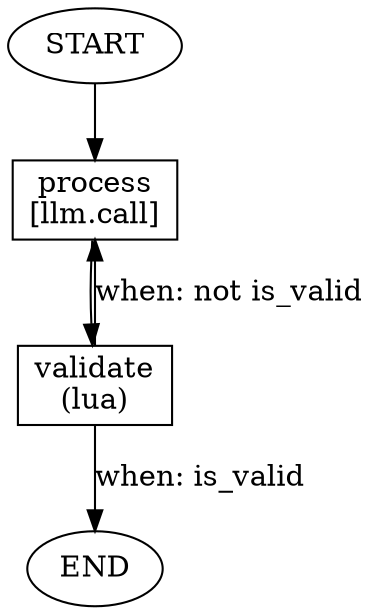

# TEA-CLI-004: CLI Parity Alignment (Python <-> Rust)

## Story Overview

| Field | Value |
|-------|-------|
| **ID** | TEA-CLI-004 |
| **Type** | Story |
| **Priority** | High |
| **Estimated Effort** | 13 points |
| **Status** | Draft |
| **Parent Epic** | TEA-MONO-001 |
| **Depends On** | TEA-CLI-001 (Python CLI), TEA-RUST-013 (Rust CLI) |
| **Blocks** | TEA-RELEASE-001 (Release Pipeline) |
| **Python Files** | `python/src/the_edge_agent/cli.py` |
| **Rust Files** | `rust/src/bin/tea.rs` |

## Description

**As a** workflow author using The Edge Agent,
**I want** both Python and Rust CLIs to have identical interfaces and capabilities,
**So that** I can switch between runtimes without relearning commands or rewriting scripts.

## Background

### Current State

The Python (`tea-agent`) and Rust (`tea`) CLIs have **divergent interfaces**:

| Aspect | Python (`tea-agent`) | Rust (`tea`) |
|--------|---------------------|--------------|
| **Structure** | Flat command + flags | Subcommands (`run`, `resume`, `validate`, `inspect`) |
| **State input** | `--state` / `--state-file` | `--input` (accepts `@file.json`) |
| **Actions plugin** | `--actions-module`, `--actions-file` | Not supported |
| **Secrets** | Not supported | `--secrets`, `--secrets-env` |
| **Streaming** | Not supported | `--stream` (NDJSON) |
| **Validation** | Not supported | `tea validate` subcommand |
| **Inspection** | Not supported | `tea inspect --format dot/json/text` |
| **Interrupt control** | Via YAML only | `--interrupt-before`, `--interrupt-after` |
| **Auto-continue** | `--auto-continue` | Not supported |
| **Verbosity** | Not supported | `-v`, `-vv`, `-q` |
| **Resume** | `--resume <file>` flag | `resume` subcommand with `--workflow` |

### Problem

Users face friction when:
- Switching between Python and Rust implementations
- Writing cross-platform automation scripts
- Following documentation that applies to one CLI but not the other
- Expecting consistent behavior in CI/CD pipelines

### Solution

Align both CLIs to a **unified interface** by:
1. Adopting subcommand structure in Python (matching Rust)
2. Adding missing features to each implementation
3. Ensuring identical flag names and behaviors

## Target Interface (Unified)

After this story, both CLIs will have:
- **Same binary name**: `tea` (not `tea-agent`)
- **Same subcommands**: `run`, `resume`, `validate`, `inspect`
- **Same arguments**: identical names and behavior
- **Implementation identifier**: `--impl` flag to show runtime

```bash
# Run workflow
tea run workflow.yaml --input '{"key": "value"}'
tea run workflow.yaml --input @state.json
tea run workflow.yaml --secrets '{"api_key": "sk-123"}'
tea run workflow.yaml --secrets @secrets.json
tea run workflow.yaml --secrets-env TEA_SECRET_
tea run workflow.yaml --stream
tea run workflow.yaml --interrupt-before node1,node2
tea run workflow.yaml --auto-continue
tea run workflow.yaml -v  # verbose
tea run workflow.yaml -q  # quiet

# Resume from checkpoint
tea resume checkpoint.pkl --workflow workflow.yaml --input '{"update": "value"}'

# Validate workflow
tea validate workflow.yaml
tea validate workflow.yaml --detailed

# Inspect workflow
tea inspect workflow.yaml
tea inspect workflow.yaml --format json
tea inspect workflow.yaml --format dot

# Actions plugin (Python only, Rust planned for future)
tea run workflow.yaml --actions-module my_package.actions
tea run workflow.yaml --actions-file ./dev_actions.py

# Version and implementation info
tea --version              # Output: tea 0.1.0
tea --version --impl       # Output: tea 0.1.0 (python) or tea 0.1.0 (rust)
tea --impl                 # Output: python or rust
```

## Gap Analysis

### Features to Add to Python (from Rust)

| Feature | Priority | Complexity | Description |
|---------|----------|------------|-------------|
| Subcommand structure | P0 | High | Migrate to `run`, `resume`, `validate`, `inspect` |
| `--secrets` / `--secrets-env` | P0 | Medium | Support secrets injection |
| `--stream` NDJSON output | P1 | Medium | Stream events as JSON lines |
| `--interrupt-before/after` | P1 | Low | CLI flags for interrupt points |
| `tea validate` command | P1 | Medium | Validate YAML without execution |
| `tea inspect` command | P1 | Medium | Inspect workflow structure |
| `--format dot/json/text` | P1 | Medium | Multiple output formats for inspect |
| `-v`, `-vv`, `-q` verbosity | P2 | Low | Logging verbosity control |
| `--input @file.json` syntax | P0 | Low | File reference for input |

### Features to Add to Rust (from Python)

| Feature | Priority | Complexity | Description |
|---------|----------|------------|-------------|
| `--auto-continue` | P1 | Low | Skip interactive prompts at interrupts |
| `--actions-module` | P2 | High | Load actions from Rust crate (future) |
| `--actions-file` | P2 | High | Load actions from Rust dylib (future) |
**Note**: Actions plugin system for Rust is complex (requires dynamic loading) and is out of scope for this story. Marked as future work.

**Known Gap (Out of Scope)**: The Rust implementation **parses but does not process** the YAML `imports:` section. This will be addressed in **TEA-RUST-034** after this story is complete.

## Acceptance Criteria

### Binary Naming and Implementation Flag

- [ ] **AC-1**: Python binary is renamed from `tea-agent` to `tea`
- [ ] **AC-2**: Both binaries show implementation with `--impl` flag (outputs `python` or `rust`)
- [ ] **AC-3**: `tea --version` outputs version without implementation (e.g., `tea 0.1.0`)
- [ ] **AC-4**: `tea --version --impl` outputs version with implementation (e.g., `tea 0.1.0 (python)`)
- [ ] **AC-5**: Old `tea-agent` command shows deprecation warning and suggests using `tea`

### Python: Subcommand Migration

- [ ] **AC-6**: `tea run workflow.yaml` executes workflow (new subcommand)
- [ ] **AC-7**: `tea workflow.yaml` still works (backwards compatibility, deprecated warning)
- [ ] **AC-8**: `tea resume checkpoint.pkl --workflow workflow.yaml` resumes execution
- [ ] **AC-9**: `tea validate workflow.yaml` validates without execution
- [ ] **AC-10**: `tea inspect workflow.yaml` shows workflow structure
- [ ] **AC-11**: `tea inspect --format dot` outputs Graphviz DOT format
- [ ] **AC-12**: `tea inspect --format json` outputs JSON format

### Python: New Flags

- [ ] **AC-13**: `--input` accepts JSON string or `@file.json`
- [ ] **AC-14**: `--secrets` accepts JSON string or `@file.json`
- [ ] **AC-15**: `--secrets-env PREFIX_` loads secrets from environment variables
- [ ] **AC-16**: `--stream` outputs events as NDJSON (one JSON object per line)
- [ ] **AC-17**: `--interrupt-before node1,node2` sets interrupt points before nodes
- [ ] **AC-18**: `--interrupt-after node1,node2` sets interrupt points after nodes
- [ ] **AC-19**: `-v`, `-vv`, `-vvv` increases logging verbosity
- [ ] **AC-20**: `-q` / `--quiet` suppresses non-error output

### Rust: New Flags

- [ ] **AC-21**: `--auto-continue` skips interactive prompts at interrupts
- [ ] **AC-22**: `--impl` flag outputs `rust`

### Rust: Stub Flags (Not Implemented)

- [ ] **AC-29**: `--actions-module` flag exists but outputs "not implemented (Python only)" and exits with code 1
- [ ] **AC-30**: `--actions-file` flag exists but outputs "not implemented (Python only)" and exits with code 1

### Backwards Compatibility

- [ ] **AC-23**: Python `--state` flag is aliased to `--input` with deprecation warning
- [ ] **AC-24**: Python `--state-file` flag is aliased to `--input @file` with deprecation warning
- [ ] **AC-25**: Python `--resume` flag works but shows deprecation warning (use `resume` subcommand)

### Documentation

- [ ] **AC-26**: README updated with unified CLI reference
- [ ] **AC-27**: Both CLIs show identical `--help` structure
- [ ] **AC-28**: Migration guide for existing Python CLI users

## Technical Design

### Python CLI Refactoring

#### New Structure with Click/Typer

Migrate from `argparse` to `typer` for cleaner subcommand support:

```python
# python/src/the_edge_agent/cli.py
import typer
import json
import sys
from pathlib import Path
from typing import Optional, List
from enum import Enum

from the_edge_agent import YAMLEngine, __version__

# Implementation identifier
IMPLEMENTATION = "python"

app = typer.Typer(
    name="tea",
    help="The Edge Agent - Lightweight State Graph Workflow Engine",
    no_args_is_help=True,
)

class OutputFormat(str, Enum):
    text = "text"
    json = "json"
    dot = "dot"


def parse_input(value: Optional[str]) -> dict:
    """Parse input from JSON string or @file.json."""
    if value is None:
        return {}
    if value.startswith("@"):
        path = Path(value[1:])
        return json.loads(path.read_text())
    return json.loads(value)


def parse_secrets(
    secrets: Optional[str],
    secrets_env: Optional[str]
) -> dict:
    """Parse secrets from JSON/file and/or environment variables."""
    result = {}

    if secrets:
        if secrets.startswith("@"):
            result.update(json.loads(Path(secrets[1:]).read_text()))
        else:
            result.update(json.loads(secrets))

    if secrets_env:
        import os
        for key, value in os.environ.items():
            if key.startswith(secrets_env):
                secret_key = key[len(secrets_env):].lower()
                if secret_key:
                    result[secret_key] = value

    return result


@app.command()
def run(
    file: Path = typer.Argument(..., help="Path to workflow YAML file"),
    input: Optional[str] = typer.Option(None, "--input", "-i", help="Initial state as JSON or @file.json"),
    secrets: Optional[str] = typer.Option(None, "--secrets", help="Secrets as JSON or @file.json"),
    secrets_env: Optional[str] = typer.Option(None, "--secrets-env", help="Load secrets from env vars with prefix"),
    stream: bool = typer.Option(False, "--stream", "-s", help="Output events as NDJSON"),
    checkpoint_dir: Optional[Path] = typer.Option(None, "--checkpoint-dir", "-c", help="Checkpoint directory"),
    interrupt_before: Optional[str] = typer.Option(None, "--interrupt-before", help="Nodes to interrupt before"),
    interrupt_after: Optional[str] = typer.Option(None, "--interrupt-after", help="Nodes to interrupt after"),
    auto_continue: bool = typer.Option(False, "--auto-continue", help="Skip interactive prompts"),
    actions_module: Optional[List[str]] = typer.Option(None, "--actions-module", help="Python module for actions"),
    actions_file: Optional[List[str]] = typer.Option(None, "--actions-file", help="Python file for actions"),
    verbose: int = typer.Option(0, "--verbose", "-v", count=True, help="Increase verbosity"),
    quiet: bool = typer.Option(False, "--quiet", "-q", help="Suppress non-error output"),
    # Deprecated aliases
    state: Optional[str] = typer.Option(None, "--state", hidden=True),
    state_file: Optional[Path] = typer.Option(None, "--state-file", hidden=True),
):
    """Execute a workflow."""
    # Handle deprecated flags
    if state:
        typer.echo("Warning: --state is deprecated, use --input", err=True)
        input = input or state
    if state_file:
        typer.echo("Warning: --state-file is deprecated, use --input @file.json", err=True)
        input = input or f"@{state_file}"

    # ... rest of implementation


@app.command()
def resume(
    checkpoint: Path = typer.Argument(..., help="Path to checkpoint file"),
    workflow: Path = typer.Option(..., "--workflow", "-w", help="Original workflow YAML"),
    input: Optional[str] = typer.Option(None, "--input", "-i", help="State updates as JSON or @file.json"),
    secrets: Optional[str] = typer.Option(None, "--secrets", help="Secrets as JSON or @file.json"),
    secrets_env: Optional[str] = typer.Option(None, "--secrets-env", help="Load secrets from env vars"),
    stream: bool = typer.Option(False, "--stream", "-s", help="Output as NDJSON"),
    auto_continue: bool = typer.Option(False, "--auto-continue", help="Skip interactive prompts"),
):
    """Resume execution from a checkpoint."""
    # ... implementation


@app.command()
def validate(
    file: Path = typer.Argument(..., help="Path to workflow YAML file"),
    detailed: bool = typer.Option(False, "--detailed", help="Show detailed info"),
):
    """Validate a workflow without execution."""
    # ... implementation


@app.command()
def inspect(
    file: Path = typer.Argument(..., help="Path to workflow YAML file"),
    format: OutputFormat = typer.Option(OutputFormat.text, "--format", "-f", help="Output format"),
):
    """Inspect workflow structure."""
    # ... implementation


def version_callback(ctx: typer.Context, value: bool):
    if value:
        show_impl = ctx.params.get("show_impl", False)
        if show_impl:
            typer.echo(f"tea {__version__} ({IMPLEMENTATION})")
        else:
            typer.echo(f"tea {__version__}")
        raise typer.Exit()


def impl_callback(value: bool):
    if value:
        typer.echo(IMPLEMENTATION)
        raise typer.Exit()


@app.callback()
def main(
    version: bool = typer.Option(None, "--version", callback=version_callback, is_eager=True),
    show_impl: bool = typer.Option(False, "--impl", callback=impl_callback, is_eager=True,
                                    help="Show implementation (python/rust)"),
):
    """The Edge Agent - Lightweight State Graph Workflow Engine."""
    pass


# Backwards compatibility: allow `tea workflow.yaml` (deprecated)
def legacy_main():
    """Legacy entry point for backwards compatibility."""
    if len(sys.argv) > 1 and not sys.argv[1].startswith("-") and sys.argv[1] not in ["run", "resume", "validate", "inspect"]:
        # Looks like legacy invocation: tea workflow.yaml
        typer.echo("Warning: Direct file argument is deprecated. Use 'tea run workflow.yaml'", err=True)
        sys.argv.insert(1, "run")
    app()


if __name__ == "__main__":
    legacy_main()
```

### Rust: Add --auto-continue, --impl, and Stub Flags

```rust
// In rust/src/bin/tea.rs

/// Implementation identifier
const IMPLEMENTATION: &str = "rust";

/// The Edge Agent - Lightweight State Graph Workflow Engine
#[derive(Parser, Debug)]
#[command(name = "tea")]
#[command(author, version, about, long_about = None)]
struct Cli {
    #[command(subcommand)]
    command: Option<Commands>,

    /// Increase verbosity (-v, -vv, -vvv)
    #[arg(short, long, action = clap::ArgAction::Count, global = true)]
    verbose: u8,

    /// Suppress non-error output
    #[arg(short, long, global = true)]
    quiet: bool,

    /// Show implementation (python/rust)
    #[arg(long, global = true)]
    r#impl: bool,
}

#[derive(Subcommand, Debug)]
enum Commands {
    Run {
        /// Path to workflow YAML file
        file: PathBuf,

        // ... existing fields

        /// Skip interactive prompts at interrupts (auto-continue)
        #[arg(long)]
        auto_continue: bool,

        /// [NOT IMPLEMENTED] Python module for actions (Python only)
        #[arg(long, value_name = "MODULE")]
        actions_module: Option<Vec<String>>,

        /// [NOT IMPLEMENTED] Python file for actions (Python only)
        #[arg(long, value_name = "FILE")]
        actions_file: Option<Vec<String>>,
    },

    Resume {
        // ... existing fields

        /// Skip interactive prompts at interrupts (auto-continue)
        #[arg(long)]
        auto_continue: bool,
    },
    // ...
}

fn main() -> Result<()> {
    let cli = Cli::parse();

    // Handle --impl flag
    if cli.r#impl {
        println!("{}", IMPLEMENTATION);
        return Ok(());
    }

    match &cli.command {
        Some(Commands::Run { actions_module, actions_file, .. }) => {
            // Check for not-implemented flags
            if actions_module.is_some() {
                eprintln!("Error: --actions-module is not implemented (Python only)");
                eprintln!("Hint: Use 'tea-py' or the Python implementation for action plugins");
                std::process::exit(1);
            }
            if actions_file.is_some() {
                eprintln!("Error: --actions-file is not implemented (Python only)");
                eprintln!("Hint: Use 'tea-py' or the Python implementation for action plugins");
                std::process::exit(1);
            }
            // ... rest of run implementation
        }
        // ...
    }

    Ok(())
}
```

### NDJSON Streaming Format

Both CLIs will emit events in this format when `--stream` is used:

```jsonl
{"type":"start","workflow":"my-workflow","timestamp":"2025-12-21T10:00:00Z"}
{"type":"node_start","node":"process","timestamp":"2025-12-21T10:00:01Z"}
{"type":"node_complete","node":"process","state":{"result":"done"},"timestamp":"2025-12-21T10:00:02Z"}
{"type":"interrupt","node":"review","state":{"result":"done"},"checkpoint":"review_1234.pkl"}
{"type":"complete","state":{"result":"done"},"timestamp":"2025-12-21T10:00:03Z"}
```

### DOT Format Output

For `tea inspect --format dot`:



## Tasks / Subtasks

### Phase 0: Binary Unification (P0)

- [ ] **Task 1**: Rename Python binary from `tea-agent` to `tea` (AC-1)
  - [ ] Update `pyproject.toml` entry point
  - [ ] Add `tea-agent` as deprecated alias with warning (AC-5)
- [ ] **Task 2**: Add `--impl` flag to Python CLI (AC-2, AC-4)
- [ ] **Task 3**: Add `--impl` flag to Rust CLI (AC-2, AC-22)
- [ ] **Task 4**: Ensure `--version` output matches format (AC-3, AC-4)

### Phase 1: Python Subcommand Migration (P0)

- [ ] **Task 5**: Add `typer` dependency to `pyproject.toml`
- [ ] **Task 6**: Refactor CLI to use subcommands (AC-6, AC-8, AC-9, AC-10)
  - [ ] Create `run` command
  - [ ] Create `resume` command
  - [ ] Create `validate` command
  - [ ] Create `inspect` command
- [ ] **Task 7**: Add backwards compatibility layer (AC-7, AC-23, AC-24, AC-25)
- [ ] **Task 8**: Implement `--input @file.json` syntax (AC-13)

### Phase 2: Python New Features (P0/P1)

- [ ] **Task 9**: Implement secrets support (AC-14, AC-15)
  - [ ] Parse `--secrets` flag
  - [ ] Parse `--secrets-env` flag
  - [ ] Inject secrets into YAMLEngine
- [ ] **Task 10**: Implement NDJSON streaming (AC-16)
- [ ] **Task 11**: Implement CLI interrupt control (AC-17, AC-18)
- [ ] **Task 12**: Implement inspect formats (AC-11, AC-12)
- [ ] **Task 13**: Implement verbosity control (AC-19, AC-20)

### Phase 3: Rust Enhancement (P1)

- [ ] **Task 14**: Add `--auto-continue` flag to Rust CLI (AC-21)
- [ ] **Task 15**: Add stub flags `--actions-module` and `--actions-file` with "not implemented" error (AC-29, AC-30)

### Phase 4: Documentation (P1)

- [ ] **Task 16**: Update README with unified CLI reference (AC-26)
- [ ] **Task 17**: Ensure `--help` output is consistent (AC-27)
- [ ] **Task 18**: Write migration guide for Python CLI users (AC-28)

### Phase 5: Testing

- [ ] **Task 19**: Add CLI integration tests for Python subcommands
- [ ] **Task 20**: Add CLI integration tests for Rust `--auto-continue`, `--impl`, and stub flags
- [ ] **Task 21**: Test backwards compatibility with deprecated flags
- [ ] **Task 22**: Cross-runtime parity tests (same commands, same outputs)

## Dev Notes

### Testing

| Test Type | Location | Description |
|-----------|----------|-------------|
| Unit | `python/tests/test_cli.py` | CLI argument parsing |
| Integration | `python/tests/test_cli_integration.py` | End-to-end CLI execution |
| Parity | `tests/cli_parity/` | Same inputs, same outputs (Python vs Rust) |

### Dependency Addition

Add to `python/pyproject.toml`:

```toml
[project]
dependencies = [
    # ... existing
    "typer>=0.9.0",
]
```

### Breaking Changes

None - all existing commands continue to work with deprecation warnings.

## Out of Scope

- Rust actions plugin system (`--actions-module`, `--actions-file`) - requires dynamic library loading, planned for future story
- Shell completion generation (`--install-completion`) - future enhancement
- Configuration file support (`--config tea.toml`) - future enhancement

## Related Stories

- **TEA-CLI-001**: Original Python CLI (being enhanced)
- **TEA-RUST-013**: Original Rust CLI (being enhanced)
- **TEA-RUST-034**: External imports support for Rust (follow-up story, depends on this)
- **TEA-RELEASE-001**: Release pipeline (blocked by this story for consistent UX)

## Changelog

| Date | Version | Changes | Author |
|------|---------|---------|--------|
| 2025-12-21 | 1.3 | Added stub flags for Rust (`--actions-module`, `--actions-file`) with "not implemented" error | Sarah (PO Agent) |
| 2025-12-21 | 1.2 | Unified binary name to `tea`, added `--impl` flag for implementation ID | Sarah (PO Agent) |
| 2025-12-21 | 1.1 | Moved YAML imports to out-of-scope (TEA-RUST-034 follow-up) | Sarah (PO Agent) |
| 2025-12-21 | 1.0 | Initial story creation with bidirectional gap analysis | Sarah (PO Agent) |
