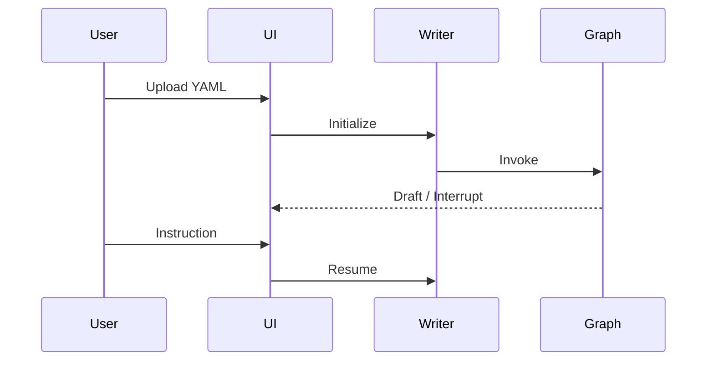

# Story TEA-KIROKU-004: Interview Mode Configuration

## Status: Blocked

## Dependencies

| Story | Title | Status | Blocking |
|-------|-------|--------|----------|
| TEA-CLI-005c | [Interactive Mode - Python Parity](TEA-CLI-005c-interactive-python-parity.md) | Approved | Yes |

> **Note:** This story requires `--interactive` CLI flag from TEA-CLI-005. Implementation can proceed for YAML configuration (Task 1) but CLI integration (Tasks 2-6) is blocked until TEA-CLI-005c is complete.

## Story

**As a** researcher using TEA,
**I want** to interact with the Kiroku agent via interview mode in the terminal,
**so that** I can guide the document writing process without needing a web UI.

## Acceptance Criteria

1. **AC1:** `tea run --interactive kiroku-document-writer.yaml` inicia sessão interativa (depends on TEA-CLI-005)
2. **AC2:** Cada interrupt point exibe mensagem contextual explicando o que o usuário deve fazer
3. **AC3:** Input vazio (Enter) avança para próximo estado quando apropriado
4. **AC4:** Draft atual é exibido após cada etapa de geração LLM
5. **AC5:** Comando especial `/save [filename]` exporta draft atual para arquivo
6. **AC6:** Comando especial `/status` mostra estado atual do workflow
7. **AC7:** Comando especial `/references` mostra lista de referências para review
8. **AC8:** Sessão pode ser interrompida com Ctrl+C e resumida posteriormente (checkpoint)

## Tasks / Subtasks

- [ ] **Task 1: Configurar interview mode no YAML** (AC: 1)
  - [ ] Adicionar seção `settings.interview` no agent YAML
  - [ ] Definir prompts por estado
  - [ ] Configurar display de output

- [ ] **Task 2: Implementar mensagens contextuais** (AC: 2)
  - [ ] Mapear cada interrupt point para mensagem explicativa
  - [ ] suggest_title_review: "Review the suggested titles..."
  - [ ] topic_sentence_manual_review: "Review the topic sentences..."
  - [ ] writer_manual_reviewer: "Review the draft..."
  - [ ] reflection_manual_review: "Add additional feedback..."
  - [ ] generate_citations (pre): "Review the references below..."

- [ ] **Task 3: Configurar comportamento de input vazio** (AC: 3)
  - [ ] Documentar que Enter vazio = "aceito, próximo passo"
  - [ ] Validar que edges condicionais tratam instruction vazia

- [ ] **Task 4: Configurar display de draft** (AC: 4)
  - [ ] Após nodes que geram draft, exibir conteúdo
  - [ ] Usar formatação Markdown no terminal (rich/markdown)
  - [ ] Truncar se muito longo (mostrar primeiras 50 linhas + "...")

- [ ] **Task 5: Implementar comandos especiais** (AC: 5, 6, 7)
  - [ ] `/save [filename]` - salva draft atual
  - [ ] `/status` - mostra node atual e estado
  - [ ] `/references` - mostra lista de referências
  - [ ] `/help` - lista comandos disponíveis

- [ ] **Task 6: Testar checkpoint e resume** (AC: 8)
  - [ ] Interromper sessão no meio
  - [ ] Resumir com mesmo checkpoint ID
  - [ ] Validar estado preservado

## Dev Notes

### Provider Configuration

Uses same providers as TEA-KIROKU-003:
- **LLM:** Azure OpenAI (see story 003 for env vars)
- **Web Search:** Perplexity (see story 003 for env vars)

### Source Documentation

Referência original: `/home/fabricio/src/kiroku.claudionor/docs/overview.md`

**Human-in-the-Loop Design** (conforme `overview.md`):
> Kiroku is explicitly designed to pause execution at critical checkpoints:
> - Title review
> - Topic sentence (outline) review
> - Draft revision
> - Reflection and critique
> - Reference confirmation
>
> These pauses allow users to steer the writing process without overriding the agent autonomy.

**Interaction Flow** (conforme `kiroku_app.md`):


### Interview Mode Configuration

```yaml
settings:
  interview:
    enabled: true
    prompts:
      suggest_title_review: |
        === Title Suggestions ===
        {{ state.draft }}

        Please review the suggested titles above.
        - Type your feedback to request changes
        - Press Enter to accept and continue

      topic_sentence_manual_review: |
        === Topic Sentence Outline ===
        {{ state.plan }}

        Please review the outline above.
        - Type your feedback to request changes
        - Press Enter to accept and continue to drafting

      writer_manual_reviewer: |
        === Current Draft ===
        {{ state.draft | truncate(2000) }}

        Please review the draft.
        - Type your feedback to request changes
        - Press Enter to continue to reflection
        - Or wait for automatic reflection after {{ state.max_revisions - state.revision_number }} more revisions

      reflection_manual_review: |
        === AI Reflection ===
        {{ state.critique }}

        Add any additional feedback for the next revision.
        - Type additional instructions
        - Press Enter to apply reflection and regenerate draft

      generate_citations_pre: |
        === References for Review ===
        {{ state.references }}

        Review the references above.
        - Type numbers to remove (e.g., "1,3,5")
        - Press Enter to keep all and continue

    commands:
      save:
        description: "Save current draft to file"
        handler: file.write
      status:
        description: "Show current workflow status"
      references:
        description: "Show references list"
      help:
        description: "Show available commands"
```

### User Experience Flow

```
$ tea run --interactive kiroku-document-writer.yaml --input paper-spec.yaml

🚀 Starting Kiroku Document Writer...
📋 Loaded spec: paper-spec.yaml

[1/13] Generating title suggestions...
━━━━━━━━━━━━━━━━━━━━━━━━━━━━━━━━━━━━━━

=== Title Suggestions ===

Original: My Paper Title

Suggested alternatives:
1. "A Novel Approach to Machine Learning"
2. "Rethinking Neural Networks for Edge Computing"
...

Please review the suggested titles above.
- Type your feedback to request changes
- Press Enter to accept and continue

> I prefer option 2 but make it shorter

[1/13] Revising title...
━━━━━━━━━━━━━━━━━━━━━━━━━━━━━━━━━━━━━━

=== Title Suggestions ===

"Edge-Optimized Neural Networks"

Please review. Press Enter to accept.

> [Enter]

[2/13] Searching the web for relevant content...
━━━━━━━━━━━━━━━━━━━━━━━━━━━━━━━━━━━━━━
...
```

### Testing

**Test scenario:**
1. Start interview mode
2. Go through 2-3 interrupt points
3. Use /save command
4. Use /status command
5. Ctrl+C to interrupt
6. Resume with checkpoint
7. Complete workflow

## Change Log

| Date | Version | Description | Author |
|------|---------|-------------|--------|
| 2024-12-27 | 0.1 | Initial story creation | Sarah (PO Agent) |
| 2024-12-27 | 0.2 | Added Human-in-the-Loop design and interaction flow from overview.md and kiroku_app.md | Sarah (PO Agent) |
| 2024-12-28 | 0.3 | Changed `--interview` to `--interactive` for CLI-005 alignment; added dependency on TEA-CLI-005c; status changed to Blocked | James (Dev Agent) |

## Dev Agent Record

_To be filled during implementation_

## QA Results

### Test Design Assessment - 2024-12-27

**Reviewer:** Quinn (Test Architect)

**Test Design Document:** `docs/qa/assessments/TEA-KIROKU-004-test-design-20251227.md`

#### Test Strategy Summary

| Metric | Value |
|--------|-------|
| Total Scenarios | 22 |
| Unit Tests | 6 (27%) |
| Integration Tests | 10 (45%) |
| E2E Tests | 6 (27%) |
| P0 (Critical) | 6 |
| P1 (High) | 10 |
| P2 (Medium) | 6 |

#### AC Coverage

| AC | Tests | Key Scenarios |
|----|-------|---------------|
| AC1 (--interactive starts) | 3 | CLI integration, session init |
| AC2 (Contextual messages) | 5 | Each interrupt point message |
| AC3 (Empty input advances) | 3 | Empty/whitespace handling |
| AC4 (Draft display) | 3 | Output after generation, truncation |
| AC5 (/save command) | 3 | Command recognition, file creation |
| AC6 (/status command) | 2 | Progress display |
| AC7 (/references command) | 1 | References list display |
| AC8 (Ctrl+C resume) | 2 | Signal handling, checkpoint restore |

#### Special Commands Tested

| Command | Test Coverage |
|---------|---------------|
| `/save [filename]` | Recognition, file creation, content |
| `/status` | Recognition, progress display |
| `/references` | References list display |
| `/help` | Available commands list |
| `Ctrl+C` | Graceful exit, checkpoint save |

#### Risk Mitigations

- Mock terminal for stdin/stdout testing
- Signal handler tests for Ctrl+C
- UTF-8 encoding validation

#### Recommendations

1. Use pexpect or similar for terminal simulation
2. Test long-running sessions for memory leaks
3. Verify Markdown rendering in various terminals
