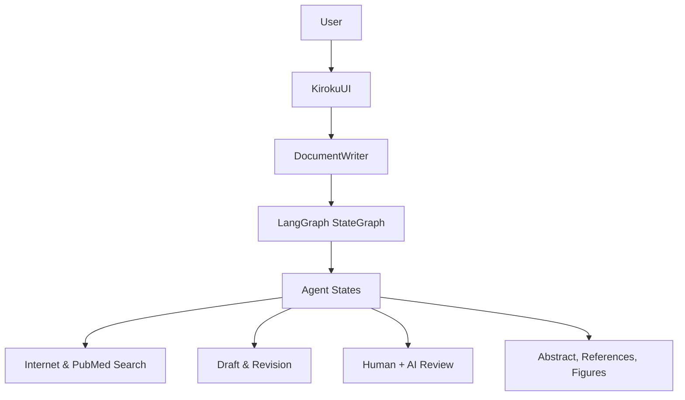

# Epic: TEA-KIROKU - Kiroku Document Writer Migration

## Status: Complete

## Target Implementation

- **Runtime:** TEA Python (`python/src/the_edge_agent/`)
- **Node Language:** Python (via `run:` blocks em YAML)
- **Interface:** CLI Interactive Mode (`tea run --interactive`)
- **NO Web UI** - Gradio será completamente substituído

## Epic Goal

Migrar o Kiroku Document Writer (sistema de escrita acadêmica com LangGraph) para TEA YAML Agents (Python), utilizando **100% built-ins** e adicionando novas actions genéricas que beneficiam o ecossistema TEA como um todo.

## Epic Description

### Existing System Context

**Sistema Original (Kiroku):** (conforme `overview.md`)

> Kiroku is an interactive, multi-agent document writing system designed to assist
> researchers and writers in producing structured academic and technical documents.

**Arquitetura em 3 camadas:**
1. **UI Layer** - Gradio-based UI for human-in-the-loop reviews
2. **Orchestration Layer** - DocumentWriter + LangGraph StateGraph
3. **Agent Layer** - Individual writing, review, and research states

**Human-in-the-Loop Design:**
- Title review
- Topic sentence (outline) review
- Draft revision
- Reflection and critique
- Reference confirmation

**Outputs automáticos:**
- Markdown document
- HTML version
- DOCX (via Pandoc)
- Planning notes
- Review instruction logs

**Localização do código fonte:**
- Repositório: `/home/fabricio/src/kiroku.claudionor/`
- Documentação: `/home/fabricio/src/kiroku.claudionor/docs/`
  - `overview.md` - Arquitetura geral
  - `agents.states.md` - Estados e nodes
  - `agents.pubmed.md` - Integração PubMed
  - `kiroku_app.md` - Orquestração
- Código principal: `kiroku_app.py`, `agents/states.py`, `agents/prompts.py`

### Technology Stack

| Componente | Original | TEA Target |
|------------|----------|------------|
| Workflow Engine | LangGraph StateGraph | TEA YAMLEngine |
| LLM Integration | LangChain ChatOpenAI | `llm.call` built-in |
| Web Search | Tavily API | `web.search` built-in |
| Academic Search | PubMedAPIWrapper | **Novo:** `academic.pubmed`, `academic.arxiv` |
| Citations | GenerateCitations state | **Novo:** `text.insert_citations` |
| UI | Gradio (KirokuUI) | TEA Interview Mode |
| State Persistence | LangGraph MemorySaver | TEA Checkpointer |

### AgentState Schema Categories

Conforme `agents.states.md`, o estado é organizado em:

| Categoria | Campos | Descrição |
|-----------|--------|-----------|
| **Metadata** | title, hypothesis, area_of_paper, type_of_document | Input do usuário |
| **Planning** | section_names, number_of_paragraphs, plan | Estrutura do documento |
| **Drafting** | draft, sentences_per_paragraph | Conteúdo gerado |
| **Review** | critique, review_instructions, review_topic_sentences | Feedback |
| **Research** | content, references, cache | Dados externos |
| **Control** | revision_number, max_revisions, number_of_queries | Runtime |

### Enhancement Details

**O que será adicionado ao TEA:**

1. **Novas Built-in Actions (genéricas e reutilizáveis):**
   - `academic.pubmed` - Busca na API PubMed/NCBI
   - `academic.arxiv` - Busca na API ArXiv
   - `text.insert_citations` - Inserção automática de citações em texto

2. **YAML Agent Template:**
   - Workflow completo do Kiroku em YAML declarativo
   - Prompts parametrizados via Jinja2
   - Configuração para interview mode

3. **Documentação:**
   - Guia de migração LangGraph → TEA
   - Exemplo de agente acadêmico

### Success Criteria

- [ ] Kiroku funciona 100% via `tea run --interactive kiroku.yaml`
- [ ] Todas as 13 etapas do workflow original funcionam
- [ ] Human-in-the-loop funciona via interview mode
- [ ] Novas built-ins são genéricas e documentadas
- [ ] Nenhum código Python custom necessário para o usuário final

---

## Stories

### TEA-KIROKU-001: Academic Research Built-in Actions

**Goal:** Criar built-ins genéricas para pesquisa acadêmica (PubMed, ArXiv)

**Scope:**
- `academic.pubmed` - Search e fetch de artigos
- `academic.arxiv` - Search e fetch de papers
- Tratamento de erros e rate limiting
- Documentação completa

**Acceptance Criteria:**
1. Action `academic.pubmed` busca artigos por query e retorna metadados estruturados
2. Action `academic.arxiv` busca papers por ID ou query
3. Resultados incluem: título, autores, abstract, URL, DOI
4. Rate limiting implementado (respeita APIs públicas)
5. Testes unitários com >90% cobertura
6. Documentação em `docs/python/actions-reference.md`

---

### TEA-KIROKU-002: Citation Insertion Built-in Action

**Goal:** Criar built-in para inserção automática de citações em texto Markdown

**Scope:**
- `text.insert_citations` - Insere referências numeradas em texto
- Suporta formatos: APA, IEEE, Vancouver
- Gera seção References automaticamente

**Acceptance Criteria:**
1. Action recebe `draft` (texto) e `references` (lista)
2. Identifica pontos de citação e insere números [1], [2], etc.
3. Gera seção "## References" formatada
4. Suporta pelo menos formato IEEE (default)
5. Testes com casos reais de artigos acadêmicos
6. Documentação com exemplos

---

### TEA-KIROKU-003: Core Kiroku YAML Workflow

**Goal:** Implementar o workflow completo do Kiroku em YAML declarativo

**Scope:**
- State schema com todos os campos necessários
- 13 nodes mapeados para actions built-in
- Edges condicionais (título opcional, citações opcionais)
- Interrupt points para human-in-the-loop
- Prompt templates em Jinja2

**Nodes a implementar:**
1. `suggest_title` → `llm.call`
2. `suggest_title_review` → `llm.call` + interrupt
3. `internet_search` → `web.search`
4. `topic_sentence_writer` → `llm.call`
5. `topic_sentence_manual_review` → `llm.call` + interrupt
6. `paper_writer` → `llm.call`
7. `writer_manual_reviewer` → `llm.call` + interrupt
8. `reflection_reviewer` → `llm.call`
9. `reflection_manual_review` → interrupt only
10. `write_abstract` → `llm.call`
11. `generate_references` → `llm.call`
12. `generate_citations` → `text.insert_citations`
13. `generate_figure_captions` → `llm.call`

**Acceptance Criteria:**
1. YAML válido e executável via `tea run kiroku.yaml`
2. Todos os 13 nodes funcionam corretamente
3. Edges condicionais funcionam (skip title, skip citations)
4. State é preservado entre interrupções
5. Prompts originais preservados (traduzidos para Jinja2)
6. Testes end-to-end com cenário completo

---

### TEA-KIROKU-004: Interview Mode Configuration

**Goal:** Configurar interview mode para substituir Gradio UI

**Scope:**
- Mensagens de prompt contextuais por estado
- Validação de input do usuário
- Exibição do draft atual
- Opção de save/export

**Acceptance Criteria:**
1. `tea run --interactive kiroku.yaml` inicia sessão interativa (depends on TEA-CLI-005)
2. Mensagens claras indicam o que o usuário deve fazer
3. Input vazio avança para próximo estado (quando apropriado)
4. Draft é exibido após cada etapa de geração
5. Comando `/save` exporta documentos (md, html)
6. Comando `/references` mostra lista de referências para review

---

### TEA-KIROKU-005: Integration Testing & Documentation

**Goal:** Validar migração completa e documentar o processo

**Scope:**
- Testes de integração end-to-end
- Comparação de output: original vs TEA
- Guia de migração LangGraph → TEA
- Exemplo pronto para uso

**Acceptance Criteria:**
1. Teste E2E com paper real passa
2. Output TEA é equivalente ao output LangGraph
3. Documentação em `docs/examples/kiroku-migration.md`
4. Arquivo `examples/academic/kiroku-document-writer.yaml` funcional
5. README atualizado com novo caso de uso

---

## Compatibility Requirements

- [x] APIs existentes do TEA permanecem inalteradas
- [x] Novas actions seguem padrão de registro existente
- [x] YAML syntax é compatível com spec atual
- [x] Interview mode usa CLI existente
- [ ] Performance: geração de paper < 5 minutos (excluindo wait de usuário)

## Risk Mitigation

| Risk | Probability | Impact | Mitigation |
|------|-------------|--------|------------|
| PubMed API rate limiting | Medium | Medium | Implementar exponential backoff |
| Prompts LangChain ≠ prompts OpenAI | Low | Low | Testar e ajustar formato |
| Interview mode limitado | Low | Medium | Documentar limitações vs Gradio |
| Estado muito grande | Low | Low | Usar LTM para content |

**Rollback Plan:**
- Novas actions são adicionais (não quebram nada existente)
- YAML agent é arquivo separado (pode ser removido sem impacto)
- Documentação é incremental

## Definition of Done

- [ ] Todas as 5 stories completadas com ACs atendidos
- [ ] Testes passando (unit + integration)
- [ ] Documentação completa
- [ ] Exemplo funcional em `examples/academic/`
- [ ] Code review aprovado
- [ ] QA gate passed

---

## Story Manager Handoff

"Please develop detailed user stories for this brownfield epic. Key considerations:

- This is an enhancement to TEA (The Edge Agent) running Python 3.10+
- Integration points: `actions/` registry, `yaml_engine.py`, CLI interview mode
- Existing patterns to follow: See `llm_actions.py`, `web_actions.py` for action patterns
- Critical compatibility requirements: All existing tests must pass
- Each story must include verification that existing functionality remains intact

The epic should maintain system integrity while delivering a complete academic document writing agent that showcases TEA's capabilities."

---

## Change Log

| Date | Version | Description | Author |
|------|---------|-------------|--------|
| 2024-12-27 | 0.1 | Initial epic creation | Sarah (PO Agent) |
| 2024-12-27 | 0.2 | Updated with clarifications from revised Kiroku docs (overview.md, agents.states.md, agents.pubmed.md, kiroku_app.md) | Sarah (PO Agent) |
| 2024-12-28 | 0.3 | Changed `--interview` to `--interactive` for TEA-CLI-005 alignment | James (Dev Agent) |
| 2025-12-27 | 1.0 | All 8 substories (KIROKU-001 through KIROKU-008) completed and marked Done | James (Dev Agent) |
| 2026-01-07 | 1.1 | Status updated from "Draft" to "Complete" - epic implementation verified | Sarah (PO) |
