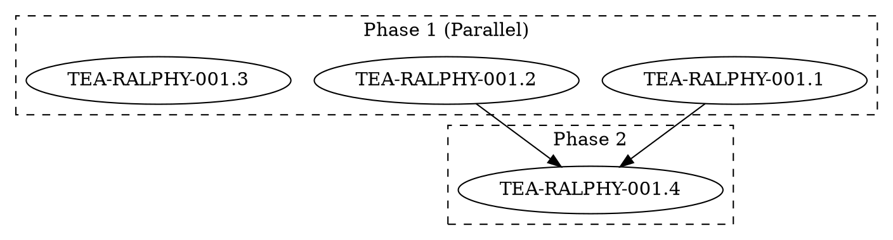

# Story TEA-RALPHY-001.10: Dynamic Dependency Analysis & DOT Generation

## Status
Draft

## Epic Reference
[TEA-RALPHY-001: Autonomous AI Coding Loop](./TEA-RALPHY-001-autonomous-coding-loop.md)

## Dependencies

### Direct Dependencies
- TEA-RALPHY-001.1 (Python `markdown.parse` Action)
- TEA-RALPHY-001.4 (BMad Story Task Extraction)

### Transitive Dependencies
- TEA-RALPHY-001.0 (md-graph-parser shared crate) - via 001.1

## Story

**As a** workflow developer,
**I want** an LLM to analyze story dependencies and generate an optimal DOT orchestration graph,
**So that** I can automatically maximize parallel execution across multiple stories.

## Acceptance Criteria

1. Accept multiple files via glob pattern or explicit list
2. Use LLM to analyze each file and extract dependencies
3. Generate DOT file with clusters for parallel phases
4. Maximize parallelization based on dependency graph
5. Output DOT file compatible with `tea from dot --use-node-commands`
6. Support the DOT_WORKFLOW_ORCHESTRATION_LLM_GUIDE.md format

## Tasks / Subtasks

- [ ] Create `ralphy.analyze_dependencies` action (AC: 2)
  - [ ] Read each story file
  - [ ] Extract `## Dependencies` section
  - [ ] Use LLM to infer implicit dependencies from content
  - [ ] Return dependency graph as adjacency list
- [ ] Create `ralphy.generate_dot` action (AC: 3, 4, 5)
  - [ ] Topological sort of dependency graph
  - [ ] Group independent stories into parallel phases
  - [ ] Generate DOT with `subgraph cluster_*` structure
  - [ ] Include `command` attributes per node
- [ ] Create meta-workflow YAML (AC: 1, 6)
  - [ ] Accept `files` list or `glob_pattern`
  - [ ] Chain: glob -> analyze -> generate DOT -> `tea from dot` -> execute
- [ ] Integration with existing DOT guide

## Dev Notes

### Input Formats

```yaml
# Option 1: Explicit file list
initial_state:
  files:
    - docs/stories/TEA-RALPHY-001.1.md
    - docs/stories/TEA-RALPHY-001.2.md

# Option 2: Glob pattern (resolved at runtime)
initial_state:
  glob_pattern: "docs/stories/TEA-RALPHY-*.md"

# Option 3: GitHub Issues
initial_state:
  source: "github:owner/repo"
  labels: ["ready-for-dev"]
```

### Dependency Analysis Prompt

```yaml
- name: analyze_dependencies
  uses: llm.call
  with:
    provider: shell
    shell_provider: claude
    messages:
      - role: user
        content: |
          Analyze these story files and identify dependencies between them.

          Files:
          
          === {{ file.path }} ===
          {{ file.content }}
          

          Output a JSON dependency graph:
          {
            "nodes": ["STORY-1", "STORY-2", ...],
            "edges": [
              {"from": "STORY-1", "to": "STORY-2", "reason": "STORY-2 uses API from STORY-1"}
            ]
          }

          Rules:
          - A story depends on another if it uses code/APIs defined there
          - Foundation/setup stories should have no dependencies
          - Identify implicit dependencies from content, not just explicit ## Dependencies
  output: dependency_graph
```

### DOT Generation Template

```yaml
- name: generate_dot
  run: |
    from the_edge_agent.actions.dot_generator import generate_parallel_dot

    dot_content = generate_parallel_dot(
        nodes=state["dependency_graph"]["nodes"],
        edges=state["dependency_graph"]["edges"],
        workflow_path=state["workflow_path"],
        stories_path=state["stories_path"],
    )
    return {"dot_content": dot_content, "dot_path": "generated-workflow.dot"}
```

### Full Meta-Workflow

```yaml
name: ralphy-meta-orchestrator
description: Analyze dependencies and generate optimal parallel workflow

nodes:
  - name: resolve_files
    run: |
      import glob
      if "glob_pattern" in state:
          files = glob.glob(state["glob_pattern"])
      else:
          files = state.get("files", [])
      return {"files": files}

  - name: read_files
    run: |
      contents = []
      for f in state["files"]:
          with open(f) as fp:
              contents.append({"path": f, "content": fp.read()})
      return {"file_contents": contents}

  - name: analyze_dependencies
    uses: llm.call
    with:
      provider: shell
      shell_provider: claude
      messages:
        - role: user
          content: |
            {{ include('prompts/analyze-dependencies.md') }}

            Files: {{ state.file_contents | tojson }}
    output: dependency_graph

  - name: generate_dot
    uses: ralphy.generate_dot
    with:
      graph: "{{ state.dependency_graph }}"
      workflow_template: "bmad-story-development.yaml"
    output: dot_file

  - name: convert_to_yaml
    run: |
      import subprocess
      result = subprocess.run([
          "tea", "from", "dot", state["dot_file"],
          "--use-node-commands", "-o", "generated-workflow.yaml"
      ], capture_output=True, text=True)
      return {"yaml_path": "generated-workflow.yaml"}

  - name: execute_workflow
    run: |
      import subprocess
      subprocess.run(["tea", "run", state["yaml_path"]], check=True)
      return {"status": "completed"}

edges:
  - from: __start__
    to: resolve_files
  - from: resolve_files
    to: read_files
  - from: read_files
    to: analyze_dependencies
  - from: analyze_dependencies
    to: generate_dot
  - from: generate_dot
    to: convert_to_yaml
  - from: convert_to_yaml
    to: execute_workflow
  - from: execute_workflow
    to: __end__
```

### Source Tree

```
python/src/the_edge_agent/
├── actions/
│   ├── __init__.py              # MODIFY: Add ralphy_actions import
│   └── ralphy_actions.py        # NEW: ralphy.* actions
└── ...

examples/workflows/
├── ralphy-meta-orchestrator.yaml  # NEW: Meta-orchestrator workflow
└── prompts/
    └── analyze-dependencies.md    # NEW: LLM prompt for analysis
```

### DOT Output Format



### DOT Generator Implementation

```python
# python/src/the_edge_agent/actions/ralphy_actions.py

def generate_parallel_dot(
    nodes: List[str],
    edges: List[Dict[str, str]],
    workflow_template: str = "bmad-story-development.yaml",
    stories_path: str = "docs/stories",
    **kwargs
) -> str:
    """
    Generate DOT file with parallel phases from dependency graph.

    Args:
        nodes: List of story IDs
        edges: List of {"from": str, "to": str} dependency edges
        workflow_template: YAML workflow to invoke for each story
        stories_path: Path to story files

    Returns:
        DOT file content as string
    """
    from collections import defaultdict

    # Build adjacency list
    deps = defaultdict(set)
    for edge in edges:
        deps[edge["to"]].add(edge["from"])

    # Topological sort with phase grouping
    phases = []
    remaining = set(nodes)
    completed = set()

    while remaining:
        # Find nodes with all dependencies satisfied
        ready = [n for n in remaining if deps[n].issubset(completed)]
        if not ready:
            raise ValueError("Circular dependency detected")

        phases.append(ready)
        completed.update(ready)
        remaining -= set(ready)

    # Generate DOT
    lines = [
        "digraph workflow {",
        "    rankdir=TB;",
        "    compound=true;",
        "",
    ]

    for i, phase in enumerate(phases, 1):
        lines.append(f"    // Phase {i}" + (" (Parallel)" if len(phase) > 1 else ""))
        lines.append(f"    subgraph cluster_phase_{i} {{")
        lines.append(f'        label="Phase {i}";')
        lines.append("        style=dashed;")
        lines.append("")

        for node in phase:
            story_file = f"{stories_path}/{node}.md"
            cmd = f'tea run {workflow_template} --input \'{{"story": "{node}"}}\''
            lines.append(f'        "{node}" [command="{cmd}"];')

        lines.append("    }")
        lines.append("")

    # Add edges
    lines.append("    // Edges")
    for edge in edges:
        lines.append(f'    "{edge["from"]}" -> "{edge["to"]}";')

    lines.append("}")
    return "\n".join(lines)
```

## Testing

```bash
# Test with explicit files
tea run examples/workflows/ralphy-meta-orchestrator.yaml \
  --input '{"files": ["docs/stories/TEA-RALPHY-001.1.md", "docs/stories/TEA-RALPHY-001.2.md"]}'

# Test with glob
tea run examples/workflows/ralphy-meta-orchestrator.yaml \
  --input '{"glob_pattern": "docs/stories/TEA-RALPHY-*.md"}'
```

**Test Location:** `python/tests/test_ralphy_actions.py`

```python
import pytest
from the_edge_agent.actions.ralphy_actions import generate_parallel_dot

def test_generate_parallel_dot_simple():
    """Test DOT generation with simple dependency chain."""
    nodes = ["A", "B", "C"]
    edges = [
        {"from": "A", "to": "B"},
        {"from": "B", "to": "C"},
    ]

    dot = generate_parallel_dot(nodes, edges)

    assert "cluster_phase_1" in dot
    assert "cluster_phase_2" in dot
    assert "cluster_phase_3" in dot
    assert '"A" -> "B"' in dot
    assert '"B" -> "C"' in dot

def test_generate_parallel_dot_parallel():
    """Test DOT generation with parallel nodes."""
    nodes = ["A", "B", "C"]
    edges = [
        {"from": "A", "to": "C"},
        {"from": "B", "to": "C"},
    ]

    dot = generate_parallel_dot(nodes, edges)

    # A and B should be in same phase
    assert dot.count("cluster_phase") == 2

def test_circular_dependency_error():
    """Test that circular dependencies raise error."""
    nodes = ["A", "B"]
    edges = [
        {"from": "A", "to": "B"},
        {"from": "B", "to": "A"},
    ]

    with pytest.raises(ValueError, match="Circular dependency"):
        generate_parallel_dot(nodes, edges)
```

### Test Cases

| Test Case | Description | AC |
|-----------|-------------|-----|
| test_glob_pattern | Accept glob pattern input | 1 |
| test_explicit_files | Accept file list input | 1 |
| test_llm_analysis | LLM extracts dependencies | 2 |
| test_cluster_generation | DOT has parallel clusters | 3 |
| test_maximize_parallelism | Independent nodes grouped | 4 |
| test_tea_from_dot | Output works with tea CLI | 5 |
| test_dot_guide_format | Follows DOT guide format | 6 |

## Change Log

| Date | Version | Description | Author |
|------|---------|-------------|--------|
| 2025-01-17 | 0.1 | Extracted from epic TEA-RALPHY-001 | Sarah (PO) |
| 2025-01-18 | 0.2 | Added transitive dependency on 001.0 (md-graph-parser) | Sarah (PO) |

---

## Dev Agent Record

### Agent Model Used

_To be filled by development agent_

### Debug Log References

_To be filled by development agent_

### Completion Notes List

_To be filled by development agent_

### File List

_To be filled by development agent_

---

## QA Results

_To be filled by QA agent after implementation review_
