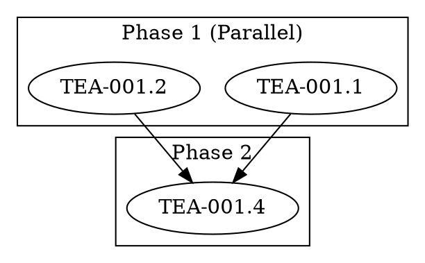

# Story TEA-RALPHY-002.1: Dependency Analyzer Agent

## Status
Done

## Epic Reference
[TEA-RALPHY-002: Minimal Ralphy](./TEA-RALPHY-002-minimal-ralphy.md)

## Story

**As a** workflow developer,
**I want** an agent that analyzes files and generates a DOT orchestration graph,
**So that** I can automatically parallelize task execution based on dependencies.

## Acceptance Criteria

1. Agent accepts `source` input as glob pattern or file list
2. Agent reads all matching files
3. Agent uses LLM (configurable: claude, codex, etc.) to analyze dependencies
4. Agent outputs valid DOT to stdout (for piping)
5. DOT includes `command` attribute on each node
6. DOT groups independent files into parallel clusters (phases)
7. Agent supports configurable execution command template

## Input Schema

```yaml
# Required
source: str | List[str]  # Glob pattern or list of file paths

# Optional
engine: str              # LLM engine for execution commands (default: claude)
command_template: str    # Override command template (default: claude -p "Implement {file}")
analyze_engine: str      # LLM engine for dependency analysis (default: same as engine)
```

## Output

DOT graph to stdout:



## Tasks / Subtasks

- [ ] Create `examples/agents/dependency-analyzer.yaml` (AC: 1-7)
  - [ ] Node: `resolve_files` - expand glob pattern to file list
  - [ ] Node: `read_files` - read content of all files
  - [ ] Node: `analyze_dependencies` - LLM call to identify dependencies
  - [ ] Node: `generate_dot` - convert dependency graph to DOT format
  - [ ] Node: `output_dot` - print DOT to stdout
- [ ] Create `examples/prompts/analyze-dependencies.md` prompt template
- [ ] Add unit tests for glob resolution and DOT generation
- [ ] Add integration test with sample story files

## Agent Implementation

```yaml
# examples/agents/dependency-analyzer.yaml
name: dependency-analyzer
description: Analyzes file dependencies and generates DOT orchestration graph

state_schema:
  source: str
  engine: str
  command_template: str
  files: list
  file_contents: list
  dependency_graph: dict
  dot_content: str

initial_state:
  engine: claude
  command_template: "claude -p 'Implement {file}' --dangerously-skip-permissions"

nodes:
  - name: resolve_files
    run: |
      import glob
      source = state.get("source", "")

      # Handle glob pattern vs explicit list
      if isinstance(source, str):
          if "*" in source or "?" in source:
              files = sorted(glob.glob(source, recursive=True))
          else:
              files = [source]
      else:
          files = list(source)

      if not files:
          raise ValueError(f"No files matched source: {source}")

      return {"files": files}

  - name: read_files
    run: |
      import os
      contents = []
      for f in state["files"]:
          if os.path.exists(f):
              with open(f) as fp:
                  contents.append({
                      "path": f,
                      "name": os.path.basename(f),
                      "content": fp.read()
                  })
          else:
              print(f"Warning: File not found: {f}", file=__import__('sys').stderr)

      return {"file_contents": contents}

  - name: analyze_dependencies
    uses: llm.call
    with:
      provider: shell
      shell_provider: "{{ state.engine }}"
      messages:
        - role: user
          content: |
            Analyze these files and identify dependencies between them.
            A file depends on another if it:
            - References code, APIs, or features defined in the other file
            - Has an explicit "Dependencies" section listing the other file
            - Builds upon or extends functionality from the other file

            FILES:
            
            === {{ file.path }} ===
            {{ file.content }}

            

            Output a JSON object with this exact structure:
            {
              "nodes": ["file1.md", "file2.md", ...],
              "edges": [
                {"from": "file1.md", "to": "file2.md", "reason": "file2 uses API from file1"}
              ]
            }

            Rules:
            - Use the filename (basename) as node identifier
            - "from" is the dependency, "to" is the dependent
            - Files with no dependencies should still appear in nodes
            - If uncertain about a dependency, include it (safer to serialize than parallelize incorrectly)

            Output ONLY the JSON, no explanation.
    output: dependency_graph

  - name: generate_dot
    run: |
      import json
      from collections import defaultdict

      # Parse LLM response
      graph_str = state.get("dependency_graph", "{}")
      if isinstance(graph_str, str):
          # Handle potential markdown code blocks
          if "```json" in graph_str:
              graph_str = graph_str.split("```json")[1].split("```")[0]
          elif "```" in graph_str:
              graph_str = graph_str.split("```")[1].split("```")[0]
          graph = json.loads(graph_str.strip())
      else:
          graph = graph_str

      nodes = graph.get("nodes", [])
      edges = graph.get("edges", [])

      # Build file path mapping (name -> path)
      file_paths = {f["name"]: f["path"] for f in state["file_contents"]}

      # Build adjacency list for dependency tracking
      deps = defaultdict(set)
      for edge in edges:
          deps[edge["to"]].add(edge["from"])

      # Topological sort with phase grouping
      phases = []
      remaining = set(nodes)
      completed = set()

      while remaining:
          # Find nodes with all dependencies satisfied
          ready = [n for n in remaining if deps[n].issubset(completed)]
          if not ready:
              # Circular dependency - just take remaining
              ready = list(remaining)

          phases.append(ready)
          completed.update(ready)
          remaining -= set(ready)

      # Generate DOT
      engine = state.get("engine", "claude")
      cmd_template = state.get("command_template", "claude -p 'Implement {file}' --dangerously-skip-permissions")

      lines = [
          "digraph workflow {",
          "    rankdir=TB;",
          "    compound=true;",
          "",
      ]

      for i, phase in enumerate(phases, 1):
          parallel_label = " (Parallel)" if len(phase) > 1 else ""
          lines.append(f"    // Phase {i}{parallel_label}")
          lines.append(f"    subgraph cluster_phase_{i} {{")
          lines.append(f'        label="Phase {i}";')
          lines.append("        style=dashed;")
          lines.append("")

          for node in phase:
              # Get full file path for command
              file_path = file_paths.get(node, node)

              # Generate command - escape quotes for DOT attribute
              cmd = cmd_template.replace("{file}", file_path)
              cmd_escaped = cmd.replace('"', '\\"')

              # Create safe node ID (remove special chars)
              node_id = node.replace(".", "_").replace("-", "_").replace(" ", "_")

              lines.append(f'        "{node_id}" [label="{node}", command="{cmd_escaped}"];')

          lines.append("    }")
          lines.append("")

      # Add edges
      if edges:
          lines.append("    // Dependencies")
          for edge in edges:
              from_id = edge["from"].replace(".", "_").replace("-", "_").replace(" ", "_")
              to_id = edge["to"].replace(".", "_").replace("-", "_").replace(" ", "_")
              lines.append(f'    "{from_id}" -> "{to_id}";')

      lines.append("}")

      return {"dot_content": "\n".join(lines)}

  - name: output_dot
    run: |
      # Print DOT to stdout for piping
      print(state["dot_content"])
      return {"_output": "dot"}

edges:
  - from: __start__
    to: resolve_files
  - from: resolve_files
    to: read_files
  - from: read_files
    to: analyze_dependencies
  - from: analyze_dependencies
    to: generate_dot
  - from: generate_dot
    to: output_dot
  - from: output_dot
    to: __end__
```

## Prompt Template

```markdown
<!-- examples/prompts/analyze-dependencies.md -->
# Dependency Analysis Prompt

Analyze the provided files and identify dependencies between them.

## Definition of Dependency

A file B depends on file A if:
- B references code, APIs, or features defined in A
- B has an explicit "Dependencies" section listing A
- B builds upon or extends functionality from A
- B cannot be implemented without A being completed first

## Input Format

You will receive multiple files with their content.

## Output Format

Output a JSON object with this exact structure:
```json
{
  "nodes": ["file1.md", "file2.md", ...],
  "edges": [
    {"from": "file1.md", "to": "file2.md", "reason": "file2 uses API from file1"}
  ]
}
```

## Rules

1. Use the filename (basename) as node identifier
2. "from" is the dependency, "to" is the dependent (A -> B means B depends on A)
3. Files with no dependencies should still appear in nodes list
4. If uncertain about a dependency, include it (safer to serialize than parallelize incorrectly)
5. Look for explicit ## Dependencies sections in the files
6. Look for imports, API calls, or references to other files

Output ONLY the JSON, no explanation or markdown formatting.
```

## Testing

**Test Location:** `python/tests/test_dependency_analyzer.py`

```python
import pytest
import tempfile
import os
from pathlib import Path

class TestDependencyAnalyzer:
    def test_glob_resolution(self):
        """Test that glob patterns resolve to file list."""
        # Create temp files
        with tempfile.TemporaryDirectory() as tmpdir:
            (Path(tmpdir) / "test1.md").write_text("# Test 1")
            (Path(tmpdir) / "test2.md").write_text("# Test 2")
            (Path(tmpdir) / "other.txt").write_text("# Other")

            # Test glob
            import glob
            files = glob.glob(f"{tmpdir}/*.md")
            assert len(files) == 2

    def test_dot_generation_structure(self):
        """Test DOT output has correct structure."""
        # Mock dependency graph
        graph = {
            "nodes": ["A.md", "B.md", "C.md"],
            "edges": [
                {"from": "A.md", "to": "C.md", "reason": "C uses A"},
                {"from": "B.md", "to": "C.md", "reason": "C uses B"},
            ]
        }

        # Expected: A and B in phase 1 (parallel), C in phase 2
        # This would be tested via the generate_dot node

    def test_circular_dependency_handling(self):
        """Test graceful handling of circular dependencies."""
        graph = {
            "nodes": ["A.md", "B.md"],
            "edges": [
                {"from": "A.md", "to": "B.md"},
                {"from": "B.md", "to": "A.md"},
            ]
        }
        # Should not hang - takes remaining nodes

    def test_empty_source_error(self):
        """Test error when no files match source."""
        # Should raise ValueError
```

### Test Cases

| Test Case | Description | AC |
|-----------|-------------|-----|
| test_glob_pattern | Glob pattern expands correctly | 1 |
| test_file_list | Explicit file list works | 1 |
| test_file_reading | All files are read | 2 |
| test_llm_analysis | LLM extracts dependencies | 3 |
| test_dot_to_stdout | DOT printed to stdout | 4 |
| test_command_attribute | Nodes have command attr | 5 |
| test_parallel_clustering | Independent files in same cluster | 6 |
| test_custom_template | Command template is used | 7 |

## Dev Notes

### Shell Provider for LLM

The agent uses `llm.call` with `provider: shell` which invokes the CLI of the specified engine:

```yaml
uses: llm.call
with:
  provider: shell
  shell_provider: claude  # or codex, gemini, etc.
```

This means the engine must be installed and available in PATH:
- `claude` - Anthropic Claude CLI
- `codex` - OpenAI Codex CLI
- `gemini` - Google Gemini CLI

### DOT Node IDs

DOT node IDs must be valid identifiers. The agent sanitizes filenames:
- `TEA-001.1.md` → `TEA_001_1_md`
- The `label` attribute preserves the original name for display

### Error Handling

- If no files match the glob, raise `ValueError`
- If a file doesn't exist, print warning to stderr and skip
- If LLM returns invalid JSON, attempt to extract from markdown code blocks

## Change Log

| Date | Version | Description | Author |
|------|---------|-------------|--------|
| 2025-01-22 | 0.1 | Initial story creation | Winston (Architect) |

---

## Dev Agent Record

### Agent Model Used

_To be filled by development agent_

### Debug Log References

_To be filled by development agent_

### Completion Notes List

_To be filled by development agent_

### File List

_To be filled by development agent_

---

## QA Results

_To be filled by QA agent after implementation review_
