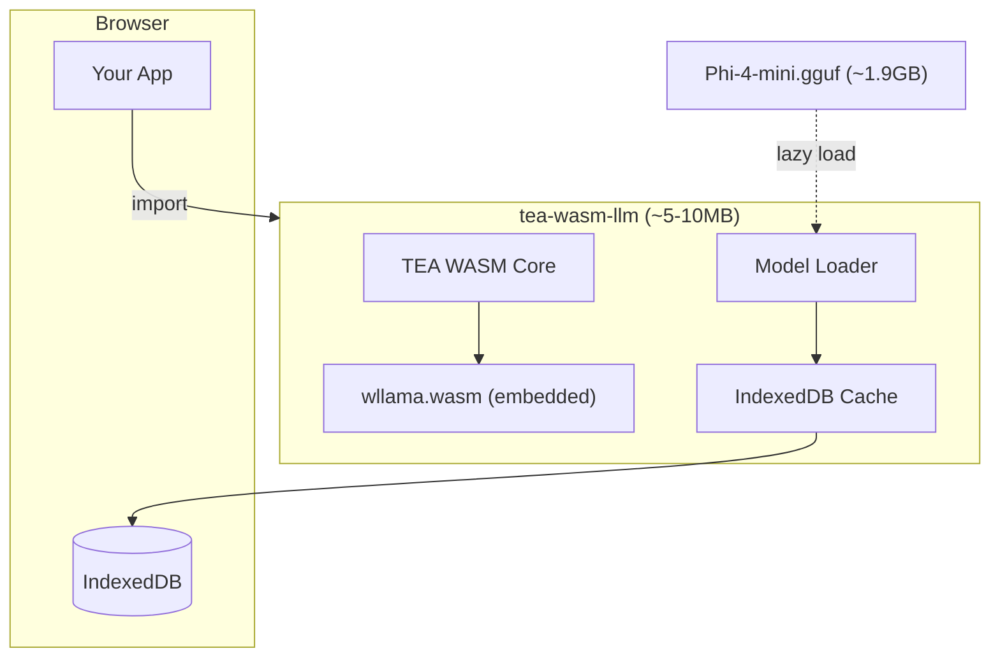

# Story TEA-RELEASE-004.3d: WASM Bundled LLM (Batteries Included)

## Status

Draft

## Story

**As a** developer building browser-based TEA applications,
**I want** a self-contained WASM package with wllama engine bundled internally,
**So that** I can use local LLM inference with a single import and zero external npm dependencies.

## Story Context

**Existing System Integration:**

- Integrates with: TEA-RELEASE-004.3a (WASM LLM Core), TEA-RELEASE-004.3b (Model Caching)
- Technology: Rust + wasm-pack + wasm-bindgen + wllama (embedded)
- Refactors pattern: From callback bridge to embedded wllama engine
- Touch points: `rust/tea-wasm-llm/`, build process, JS wrapper

**Dependencies:**
- TEA-RELEASE-004.3a (Done) - provides base WASM infrastructure
- TEA-RELEASE-004.3b (Done) - provides IndexedDB model caching

## Problem Statement

### Current Architecture (Callback Bridge)

```
┌─────────────────────────────────────────────────────────────┐
│                    Browser/Host Page                         │
│                                                              │
│  ┌─────────────┐    ┌─────────────┐    ┌─────────────────┐  │
│  │   wllama    │◄───│  JS Bridge  │◄───│  tea-wasm-llm   │  │
│  │  (npm pkg)  │    │  (callback) │    │   (Rust WASM)   │  │
│  │  EXTERNAL   │    │             │    │   ~100KB        │  │
│  └─────────────┘    └─────────────┘    └─────────────────┘  │
│        ▲                                                     │
│        │ User must install @wllama/wllama via npm            │
└─────────────────────────────────────────────────────────────┘
```

**Problems:**
1. User needs to install `@wllama/wllama` as separate npm dependency
2. User must write boilerplate to wire up the callback handler
3. Multiple moving parts = more failure points
4. Inconsistent with AppImage philosophy ("batteries included")

### Target Architecture (Bundled)

```
┌─────────────────────────────────────────────────────────────┐
│                    Browser/Host Page                         │
│                                                              │
│  ┌─────────────────────────────────────────────────────────┐│
│  │           tea-wasm-llm-bundled (~5-10MB)                ││
│  │  ┌─────────────────┐  ┌──────────────────────────────┐  ││
│  │  │  wllama.wasm    │  │  TEA Workflow Engine         │  ││
│  │  │  (embedded)     │◄─│  + Model Loader              │  ││
│  │  │  llama.cpp WASM │  │  + IndexedDB Cache           │  ││
│  │  └─────────────────┘  └──────────────────────────────┘  ││
│  └─────────────────────────────────────────────────────────┘│
│                           │                                  │
│                           ▼ lazy load                        │
│  ┌─────────────────────────────────────────────────────────┐│
│  │  Phi-4-mini.gguf (~1.9GB) → IndexedDB cache            ││
│  └─────────────────────────────────────────────────────────┘│
└─────────────────────────────────────────────────────────────┘

Usage: import { initLlm, chat } from 'tea-wasm-llm';
       await initLlm();  // Loads model from cache or downloads
       const response = await chat("Hello!");
```

**Benefits:**
1. Single import, zero external dependencies
2. No callback boilerplate - "it just works"
3. Consistent with AppImage philosophy
4. Fewer failure points

## Acceptance Criteria

### Functional Requirements

1. **AC-1**: Single WASM bundle includes wllama engine internally
2. **AC-2**: `initLlm()` initializes LLM without external callback registration
3. **AC-3**: `chat(prompt)` generates completions using embedded wllama
4. **AC-4**: `embed(text)` generates embeddings using embedded wllama
5. **AC-5**: Model lazy-loads from configured URL on first use
6. **AC-6**: IndexedDB cache from 004.3b continues to work

### Build Requirements

7. **AC-7**: wllama WASM files embedded as static assets or loaded internally
8. **AC-8**: Build produces single distributable package
9. **AC-9**: Package size ~5-10MB (excluding model)
10. **AC-10**: ES module build for browser usage

### Quality Requirements

11. **AC-11**: Zero npm peer dependencies for LLM functionality
12. **AC-12**: Existing tests continue to pass
13. **AC-13**: E2E test with real model works in browser
14. **AC-14**: Backward compatible API (old callback pattern still works)

### Demo App Requirements

15. **AC-15**: Demo app hosted on GitHub Pages with working LLM chat
16. **AC-16**: Demo works with multi-threading via COOP/COEP service worker
17. **AC-17**: Demo shows model loading progress and cache status
18. **AC-18**: Demo includes YAML workflow execution example

### Documentation Requirements

19. **AC-19**: Article in `docs/articles/` following preprint format
20. **AC-20**: Article includes link to live demo
21. **AC-21**: Article added to `docs/_toc.yml`

## Tasks / Subtasks

- [ ] Task 1: Research wllama bundling approaches (AC: 7)
  - [ ] Option A: Compile llama.cpp to WASM directly in tea-wasm-llm
  - [ ] Option B: Include pre-built wllama.wasm as static asset
  - [ ] Option C: Use wasm-bindgen to call wllama from Rust
  - [ ] Document chosen approach with rationale

- [ ] Task 2: Embed wllama engine in tea-wasm-llm (AC: 1, 7, 8)
  - [ ] Add wllama WASM files to build
  - [ ] Create internal LLM engine module that loads wllama
  - [ ] Remove requirement for external callback registration
  - [ ] Handle single-thread vs multi-thread detection internally

- [ ] Task 3: Create simplified API (AC: 2, 3, 4, 5)
  - [ ] Implement `initLlm(config?)` - initializes engine + loads model
  - [ ] Implement `chat(prompt, options?)` - generate completion
  - [ ] Implement `embed(text)` - generate embeddings
  - [ ] Implement `chatStream(prompt, onToken)` - streaming generation
  - [ ] Use model-loader.ts and model-cache.ts from 004.3b

- [ ] Task 4: Update build process (AC: 8, 9, 10)
  - [ ] Update Cargo.toml with any new dependencies
  - [ ] Update build.sh to include wllama assets
  - [ ] Verify package size is reasonable (~5-10MB)
  - [ ] Generate TypeScript definitions

- [ ] Task 5: Maintain backward compatibility (AC: 14)
  - [ ] Keep `set_llm_handler()` API working for custom handlers
  - [ ] Document migration path from callback to bundled API
  - [ ] Add deprecation notice to callback API

- [ ] Task 6: Add tests and documentation (AC: 11, 12, 13)
  - [ ] Unit tests for new API functions
  - [ ] E2E test with Phi-4-mini model
  - [ ] Update README with new usage examples
  - [ ] Verify zero npm peer dependencies

- [ ] Task 7: Create Demo App for GitHub Pages (AC: 15, 16, 17, 18)
  - [ ] Create `docs/wasm-demo/` directory (Sphinx static content)
  - [ ] Implement `index.html` with chat UI and progress indicators
  - [ ] Implement `app.js` with tea-wasm-llm integration
  - [ ] Add `coi-serviceworker.js` for COOP/COEP headers on GitHub Pages
  - [ ] Add model loading progress bar with cache status
  - [ ] Add YAML workflow execution demo tab
  - [ ] Update `docs/conf.py` to include wasm-demo in `html_extra_path`
  - [ ] Add demo README with local testing instructions

- [ ] Task 8: Write Article for Demo (AC: 19, 20, 21)
  - [ ] Create `docs/articles/wasm-llm-browser-inference.md` following preprint format
  - [ ] Include Abstract, Introduction, Architecture, Usage, Conclusion sections
  - [ ] Add link to live demo: `[Try the Demo](../wasm-demo/index.html)`
  - [ ] Include code examples for API usage
  - [ ] Add Mermaid architecture diagram
  - [ ] Add entry to `docs/_toc.yml` under Articles section
  - [ ] Verify article builds with `sphinx-build`

## Dev Notes

### Approach Comparison

| Approach | Pros | Cons |
|----------|------|------|
| **A: Compile llama.cpp directly** | Full control, optimized | Complex build, maintenance |
| **B: Embed pre-built wllama.wasm** | Simple, reuse wllama | Larger bundle, version sync |
| **C: Call wllama via wasm-bindgen** | Clean separation | Still needs external wllama |

**Recommended: Option B** - Embed pre-built wllama.wasm files as static assets, loaded internally via JavaScript interop.

### Target API (TypeScript)

```typescript
// New simplified API
import { initLlm, chat, embed, chatStream } from 'tea-wasm-llm';

// Initialize (downloads/caches model on first call)
await initLlm({
  modelUrl: './models/Phi-4-mini-Q3_K_S.gguf',  // or HuggingFace URL
  onProgress: (loaded, total) => console.log(`${loaded}/${total}`),
});

// Simple chat
const response = await chat("Explain quantum computing", {
  maxTokens: 100,
  temperature: 0.7,
});
console.log(response.content);

// Streaming
await chatStream("Write a poem", (token) => {
  process.stdout.write(token);
});

// Embeddings
const embedding = await embed("Hello world");
console.log(embedding.vector);  // Float32Array
```

### Internal Architecture

```
rust/tea-wasm-llm/
├── src/
│   ├── lib.rs              # WASM entry point
│   ├── llm.rs              # LLM callback bridge (deprecated, kept for compat)
│   ├── engine.rs           # NEW: Internal wllama engine wrapper
│   └── api.rs              # NEW: Simplified public API
├── js/
│   ├── index.ts            # Updated exports
│   ├── model-loader.ts     # From 004.3b
│   ├── model-cache.ts      # From 004.3b
│   └── wllama-loader.ts    # NEW: Internal wllama initialization
├── assets/
│   ├── wllama-single.wasm  # NEW: Pre-built wllama (single-thread)
│   └── wllama-multi.wasm   # NEW: Pre-built wllama (multi-thread)
└── pkg/                    # Build output

docs/
├── wasm-demo/              # Demo app (Sphinx static content)
│   ├── index.html          # Main demo page with chat UI
│   ├── app.js              # Demo application logic
│   ├── style.css           # Demo styling
│   ├── coi-serviceworker.js # COOP/COEP headers workaround
│   └── README.md           # Demo instructions
├── articles/
│   └── wasm-llm-browser-inference.md  # Article about the demo
└── conf.py                 # Add wasm-demo to html_extra_path
```

### Migration Path

```typescript
// OLD (callback bridge) - still works but deprecated
import { Wllama } from '@wllama/wllama';
import { set_llm_handler, execute_yaml } from 'tea-wasm-llm';

const wllama = new Wllama(CONFIG);
await wllama.loadModel(...);
set_llm_handler(async (params) => { ... });

// NEW (batteries included) - recommended
import { initLlm, executeLlmYaml } from 'tea-wasm-llm';

await initLlm({ modelUrl: '...' });
const result = await executeLlmYaml(yaml, state);
```

### wllama Integration Details

wllama (https://github.com/ngxson/wllama) provides:
- `wllama.wasm` - llama.cpp compiled to WebAssembly
- Single-thread and multi-thread builds
- Model loading from URL or File
- Streaming completion support

We will:
1. Download wllama WASM files during build
2. Include them as static assets in the package
3. Load them internally via JavaScript interop
4. Expose simplified Rust/WASM API

### File Size Estimates

| Component | Size |
|-----------|------|
| tea-wasm-llm.wasm (Rust) | ~500KB |
| wllama-single.wasm | ~3MB |
| wllama-multi.wasm | ~4MB |
| JavaScript/TypeScript | ~100KB |
| **Total Package** | **~5-8MB** |
| Model (lazy load) | ~1.9GB |

### Demo App Architecture

The demo app validates the "batteries included" approach and serves as a reference implementation.

#### GitHub Pages + COOP/COEP Challenge

GitHub Pages doesn't support custom HTTP headers. Multi-threading in wllama requires:
```
Cross-Origin-Opener-Policy: same-origin
Cross-Origin-Embedder-Policy: require-corp
```

**Solution:** Use [coi-serviceworker](https://github.com/nicepkg/vite-plugin-cross-origin-isolation) to inject headers via Service Worker.

#### Demo UI Wireframe

```
┌─────────────────────────────────────────────────────────┐
│  🧠 TEA WASM LLM Demo                          [GitHub] │
├─────────────────────────────────────────────────────────┤
│  Status: ✅ Ready | Threading: Multi | Cache: 1.9GB    │
├──────────────────────┬──────────────────────────────────┤
│  [Chat] [YAML Demo]  │                                  │
├──────────────────────┴──────────────────────────────────┤
│  ┌─────────────────────────────────────────────────┐    │
│  │ User: Hello!                                    │    │
│  │ Assistant: Hello! How can I help you today?    │    │
│  └─────────────────────────────────────────────────┘    │
│  ┌─────────────────────────────────────────────────┐    │
│  │ Type message...                          [Send] │    │
│  └─────────────────────────────────────────────────┘    │
├─────────────────────────────────────────────────────────┤
│  [Clear Cache] [Download Model] [View Console]          │
└─────────────────────────────────────────────────────────┘
```

#### Demo index.html Structure

```html
<!DOCTYPE html>
<html>
<head>
  <title>TEA WASM LLM Demo</title>
  <!-- COOP/COEP Service Worker for multi-threading -->
  <script src="coi-serviceworker.js"></script>
  <link rel="stylesheet" href="style.css">
</head>
<body>
  <div id="app">
    <header>
      <h1>🧠 TEA WASM LLM Demo</h1>
      <div id="status">Loading...</div>
    </header>
    <main>
      <div id="chat-container">
        <div id="messages"></div>
        <form id="chat-form">
          <input type="text" id="input" placeholder="Type message...">
          <button type="submit">Send</button>
        </form>
      </div>
    </main>
    <footer>
      <button id="clear-cache">Clear Cache</button>
      <button id="run-yaml">Run YAML Demo</button>
    </footer>
  </div>
  <script type="module" src="app.js"></script>
</body>
</html>
```

#### Demo app.js Core Logic

```javascript
import { initLlm, chat, chatStream } from '../pkg/tea_wasm_llm.js';

// Initialize with progress tracking
await initLlm({
  modelUrl: 'https://huggingface.co/bartowski/microsoft_Phi-4-mini-instruct-GGUF/resolve/main/microsoft_Phi-4-mini-instruct-Q3_K_S.gguf',
  onProgress: (loaded, total) => {
    const pct = Math.round((loaded / total) * 100);
    document.getElementById('status').textContent = `Loading model: ${pct}%`;
  },
  onReady: () => {
    document.getElementById('status').textContent = '✅ Ready';
  }
});

// Chat handler
document.getElementById('chat-form').onsubmit = async (e) => {
  e.preventDefault();
  const input = document.getElementById('input');
  const prompt = input.value;
  input.value = '';

  // Show user message
  addMessage('user', prompt);

  // Stream response
  let response = '';
  await chatStream(prompt, (token) => {
    response += token;
    updateLastMessage('assistant', response);
  });
};
```

#### Deployment

The demo is deployed automatically via the existing Sphinx documentation workflow:

1. Demo files in `docs/wasm-demo/` are copied to `docs/_build/html/wasm-demo/`
2. The existing GitHub Actions workflow deploys `docs/_build/html/` to GitHub Pages
3. Demo accessible at: `https://fabceolin.github.io/the_edge_agent/wasm-demo/`

**Note:** The WASM package (`pkg/`) needs to be built and copied to `docs/wasm-demo/pkg/` before the docs build. This can be added to the existing docs workflow:

```yaml
# Add to .github/workflows/docs.yaml (existing workflow)
- name: Build WASM package
  run: |
    cd rust/tea-wasm-llm
    wasm-pack build --target web --release
    cp -r pkg ../../../docs/wasm-demo/
```

#### Local Testing

```bash
# Serve with COOP/COEP headers for multi-threading
cd docs/wasm-demo
npx serve --cors -p 8080

# Or use Python with custom headers
python3 -c "
from http.server import HTTPServer, SimpleHTTPRequestHandler
class Handler(SimpleHTTPRequestHandler):
    def end_headers(self):
        self.send_header('Cross-Origin-Opener-Policy', 'same-origin')
        self.send_header('Cross-Origin-Embedder-Policy', 'require-corp')
        super().end_headers()
HTTPServer(('', 8080), Handler).serve_forever()
"
```

### Article Template

The article follows the preprint format defined in `docs/guides/writing-articles.md`.

#### Article Structure: `docs/articles/wasm-llm-browser-inference.md`

```markdown
# Browser-Based LLM Inference with TEA WASM

**The Edge Agent Team**

*Open Source Project*

https://github.com/fabceolin/the_edge_agent

---

## Abstract

This article presents TEA WASM LLM, a batteries-included WebAssembly package
for running large language models directly in the browser. We describe the
architecture that bundles the wllama engine internally, eliminating external
npm dependencies. The package provides a simple API (`initLlm`, `chat`, `embed`)
and leverages IndexedDB for model caching, enabling offline-capable LLM inference
with a single import.

**Keywords:** WebAssembly, LLM, Browser, wllama, Offline AI, TEA

---

## 1. Introduction

Running LLMs in the browser enables privacy-preserving AI applications...

[Try the Live Demo](../wasm-demo/index.html)

## 2. Architecture

### 2.1 Batteries-Included Design



### 2.2 Comparison with Callback Bridge

| Aspect | Callback Bridge | Batteries Included |
|--------|-----------------|-------------------|
| Dependencies | @wllama/wllama npm | None |
| Setup code | ~20 lines | ~3 lines |
| Failure points | Multiple | Single |

## 3. Quick Start

### 3.1 Installation

```html
<script type="module">
import { initLlm, chat } from './pkg/tea_wasm_llm.js';

await initLlm({
  modelUrl: 'https://huggingface.co/.../Phi-4-mini-Q3_K_S.gguf'
});

const response = await chat("Hello!");
console.log(response.content);
</script>
```

### 3.2 API Reference

| Function | Description |
|----------|-------------|
| `initLlm(config)` | Initialize engine and load model |
| `chat(prompt, options)` | Generate completion |
| `chatStream(prompt, callback)` | Stream tokens |
| `embed(text)` | Generate embeddings |

## 4. Demo Application

A live demo is available at: [TEA WASM LLM Demo](../wasm-demo/index.html)

Features:
- Chat interface with Phi-4-mini
- Model loading progress indicator
- Cache status display
- YAML workflow execution

## 5. Browser Compatibility

| Browser | Single-thread | Multi-thread |
|---------|---------------|--------------|
| Chrome 90+ | ✅ | ✅ (with COOP/COEP) |
| Firefox 90+ | ✅ | ✅ (with COOP/COEP) |
| Safari 15+ | ✅ | ❌ |
| Edge 90+ | ✅ | ✅ (with COOP/COEP) |

## 6. Conclusion

TEA WASM LLM provides a simple, batteries-included solution for browser-based
LLM inference. The bundled architecture eliminates dependency management while
IndexedDB caching enables efficient repeated use.

## 7. References

- [The Edge Agent](https://github.com/fabceolin/the_edge_agent)
- [wllama - llama.cpp for WebAssembly](https://github.com/ngxson/wllama)
- [llama.cpp](https://github.com/ggerganov/llama.cpp)
- [WebAssembly](https://webassembly.org/)
```

#### Adding to `_toc.yml`

```yaml
# docs/_toc.yml
  - caption: Articles
    chapters:
      # ... existing articles ...
      - file: articles/wasm-llm-browser-inference
        title: Browser-Based LLM Inference
```

#### Sphinx Configuration

```python
# docs/conf.py
# Add wasm-demo to static content that gets copied to _build/html/
html_extra_path = ['wasm-demo']
```

## Definition of Done

- [ ] Single import provides full LLM functionality
- [ ] No external npm dependencies required for LLM
- [ ] `initLlm()` + `chat()` API works end-to-end
- [ ] Model caching from 004.3b still works
- [ ] Package size under 10MB (excluding model)
- [ ] E2E test passes with Phi-4-mini
- [ ] Backward compatible with callback API
- [ ] Documentation updated
- [ ] Demo app deployed to GitHub Pages
- [ ] Demo works with multi-threading (COOP/COEP service worker)
- [ ] Demo shows model loading progress and cache status
- [ ] Article published in `docs/articles/`
- [ ] Article links to live demo
- [ ] Article added to `_toc.yml` and builds with Sphinx

## Risk and Compatibility Check

**Primary Risk:** wllama WASM loading complexity inside another WASM module

**Mitigation:**
- Use JavaScript interop layer for wllama loading
- wllama is mature and well-tested
- Fallback to callback pattern if bundling fails

**Technical Risks:**

| Risk | Probability | Impact | Mitigation |
|------|-------------|--------|------------|
| WASM-in-WASM loading issues | Medium | High | JS interop layer handles wllama loading |
| Package size too large | Low | Medium | Single-thread only option (~4MB) |
| Multi-threading detection | Low | Medium | Reuse existing SharedArrayBuffer detection |
| Breaking existing users | Low | High | Keep callback API, mark deprecated |

**Rollback:** Keep callback pattern as fallback; new API is additive

## Compatibility Verification

- [ ] No breaking changes to existing APIs
- [ ] Database changes: None (uses existing IndexedDB)
- [ ] UI changes: None
- [ ] Performance impact: Slightly larger initial download, same runtime

## Change Log

| Date | Version | Description | Author |
|------|---------|-------------|--------|
| 2026-01-09 | 0.1 | Initial draft - Hybrid bundled architecture | Sarah (PO Agent) |
| 2026-01-09 | 0.2 | Added Demo App (Task 7, AC 15-18), Testing section, fixed wllama URL | Sarah (PO Agent) |
| 2026-01-09 | 0.3 | Added Article (Task 8, AC 19-21), moved demo to docs/wasm-demo/, added article template | Sarah (PO Agent) |

---

## Testing

### Test Scenarios

| ID | Scenario | Type | Priority |
|----|----------|------|----------|
| 3d-UNIT-001 | `initLlm()` initializes without callback | Unit | P0 |
| 3d-UNIT-002 | `chat()` returns valid response | Unit | P0 |
| 3d-UNIT-003 | `embed()` returns vector | Unit | P1 |
| 3d-UNIT-004 | `chatStream()` fires token callbacks | Unit | P1 |
| 3d-UNIT-005 | Backward compat: `set_llm_handler()` still works | Unit | P0 |
| 3d-INT-001 | wllama WASM loads internally | Integration | P0 |
| 3d-INT-002 | Model loads from URL with progress | Integration | P0 |
| 3d-INT-003 | IndexedDB cache hit skips download | Integration | P1 |
| 3d-INT-004 | Multi-threading detected with SharedArrayBuffer | Integration | P1 |
| 3d-E2E-001 | Full chat flow in browser | E2E | P0 |
| 3d-E2E-002 | Demo app loads on GitHub Pages | E2E | P0 |
| 3d-E2E-003 | YAML workflow executes in demo | E2E | P1 |
| 3d-DOC-001 | Article builds with Sphinx without errors | Doc | P0 |
| 3d-DOC-002 | Demo link in article resolves correctly | Doc | P1 |
| 3d-DOC-003 | Mermaid diagrams render in article | Doc | P2 |

### Test Tools

- **Unit/Integration:** Vitest with fake-indexeddb
- **E2E:** Playwright with Chrome (COOP/COEP headers)
- **Demo validation:** Manual + GitHub Actions

## References

- TEA-RELEASE-004.3a: WASM LLM Core Package
- TEA-RELEASE-004.3b: WASM Model Loading and Caching
- wllama: https://github.com/ngxson/wllama
- llama.cpp: https://github.com/ggerganov/llama.cpp
- coi-serviceworker: https://github.com/nicepkg/vite-plugin-cross-origin-isolation
