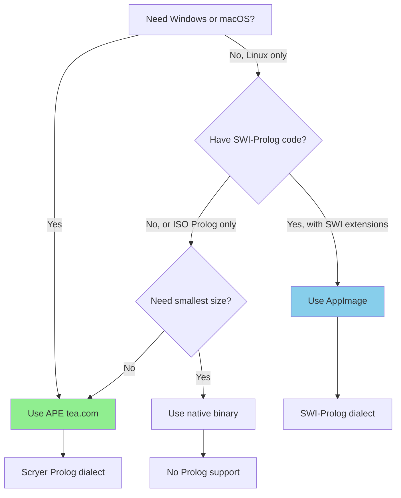

# TEA-RELEASE-005.5: Documentation & Migration Guide

## Story Overview

| Field | Value |
|-------|-------|
| **ID** | TEA-RELEASE-005.5 |
| **Type** | Story |
| **Priority** | Medium |
| **Estimated Effort** | 3 points |
| **Status** | Draft |
| **Parent Epic** | TEA-RELEASE-005 |
| **Depends On** | TEA-RELEASE-005.1 (syntax differences known) |
| **Files to Create** | `docs/shared/scryer-migration.md`, `docs/shared/ape-platform-notes.md` |
| **Files to Modify** | `docs/installation.md`, `README.md` |

## Story

**As a** user migrating from SWI-Prolog AppImage,
**I want** clear documentation on APE distribution and Scryer Prolog syntax,
**So that** I can adopt the universal binary with minimal friction.

## Background

### Documentation Needs

Users adopting the APE distribution need:

1. **Installation instructions** for `tea.com` on all platforms
2. **Migration guide** from SWI-Prolog to Scryer Prolog syntax
3. **Decision flowchart** for choosing between APE and AppImage
4. **Troubleshooting** for platform-specific issues

### Target Audience

| Audience | Primary Need |
|----------|--------------|
| New users | Quick start with universal binary |
| Existing SWI-Prolog users | Migration guide |
| Windows users | First-class TEA experience |
| CI/CD engineers | Single binary for pipelines |

## Acceptance Criteria

- [ ] **AC-1**: `docs/installation.md` updated with APE download instructions
- [ ] **AC-2**: APE section covers Windows, Linux, macOS installation
- [ ] **AC-3**: `docs/shared/scryer-migration.md` created with SWI → Scryer guide
- [ ] **AC-4**: Common predicate compatibility table included
- [ ] **AC-5**: Decision flowchart: when to use APE vs AppImage
- [ ] **AC-6**: `README.md` updated with universal binary section
- [ ] **AC-7**: Troubleshooting section for Windows Defender/Gatekeeper
- [ ] **AC-8**: Examples updated with Scryer-compatible syntax (where needed)

## Technical Design

### Installation.md Updates

```markdown
## Universal Binary (APE) - Recommended

The Edge Agent is available as an **Actually Portable Executable (APE)** - a single
binary that runs on Windows, Linux, and macOS without modification.

### Quick Install

**Linux / macOS:**
```bash
curl -L https://github.com/fabceolin/the_edge_agent/releases/latest/download/tea.com -o tea
chmod +x tea
sudo mv tea /usr/local/bin/
tea --version
```

**Windows (PowerShell):**
```powershell
Invoke-WebRequest -Uri "https://github.com/fabceolin/the_edge_agent/releases/latest/download/tea.com" -OutFile "tea.exe"
.\tea.exe --version
# Optionally move to a directory in your PATH
```

### APE vs AppImage

| Feature | APE (`tea.com`) | AppImage |
|---------|-----------------|----------|
| **Platforms** | Windows, Linux, macOS | Linux only |
| **Prolog** | Scryer (ISO) | SWI-Prolog |
| **Single file** | Yes | Yes |
| **LLM bundled** | `tea-llm.com` variant | `tea-llm-*.AppImage` |

**Use APE when:**
- You need cross-platform support
- You're starting fresh (no existing SWI-Prolog code)
- You want a single binary for CI/CD

**Use AppImage when:**
- You have existing SWI-Prolog code with SWI-specific predicates
- You only need Linux support
- You require SWI-Prolog extensions
```

### Scryer Migration Guide

```markdown
# Migrating from SWI-Prolog to Scryer Prolog

This guide helps you migrate TEA YAML agents from SWI-Prolog to Scryer Prolog
for use with the APE (Actually Portable Executable) distribution.

## Overview

| Aspect | SWI-Prolog | Scryer Prolog |
|--------|------------|---------------|
| Standard | SWI extensions | ISO Prolog |
| Implementation | C | Rust |
| Threading | Multi-threaded | Single-threaded |

## Predicate Compatibility

### Fully Compatible (No Changes Needed)

| Predicate | Notes |
|-----------|-------|
| `member/2` | Standard list membership |
| `append/3` | List concatenation |
| `length/2` | List length |
| `findall/3` | Collect solutions |
| `assertz/1`, `retract/1` | Dynamic predicates |
| `is/2` | Arithmetic evaluation |
| `=../2` | Univ operator |
| `functor/3` | Term inspection |

### Requires Syntax Changes

| SWI-Prolog | Scryer Prolog | Notes |
|------------|---------------|-------|
| `nb_setval(Key, Val)` | Use state predicates | Global variables not available |
| `nb_getval(Key, Val)` | Use state predicates | Global variables not available |
| `format("~w~n", [X])` | `format("~w~n", [X])` | Same syntax, check format codes |
| `succ(X, Y)` | `Y is X + 1` | Use arithmetic |
| `plus(X, Y, Z)` | `Z is X + Y` | Use arithmetic |

### Not Available in Scryer

| SWI Predicate | Alternative |
|---------------|-------------|
| `thread_create/3` | Not available (single-threaded) |
| `prolog_flag/2` | Limited flags available |
| `use_foreign_library/1` | Not available (no FFI) |
| `nb_setval/nb_getval` | Use TEA state instead |

## Migration Examples

### Example 1: Global State

**SWI-Prolog (before):**
```prolog
init_counter :-
    nb_setval(counter, 0).

increment :-
    nb_getval(counter, N),
    N1 is N + 1,
    nb_setval(counter, N1).
```

**Scryer Prolog (after):**
```prolog
% Use TEA's state management instead
increment(State, NewState) :-
    get_state(State, counter, N),
    N1 is N + 1,
    set_state(State, counter, N1, NewState).
```

### Example 2: Factorial

**Both (no changes needed):**
```prolog
factorial(0, 1) :- !.
factorial(N, F) :-
    N > 0,
    N1 is N - 1,
    factorial(N1, F1),
    F is N * F1.
```

## YAML Agent Changes

### Settings Section

**SWI-Prolog AppImage:**
```yaml
settings:
  prolog:
    backend: swi  # or omit (default)
```

**Scryer APE:**
```yaml
settings:
  prolog:
    backend: scryer
```

## Testing Your Migration

1. Run with `--features scryer` to test locally
2. Compare outputs between SWI and Scryer
3. Check for predicate availability errors

```bash
# Test with Scryer backend
tea.com run your-agent.yaml --input '{}'
```

## Getting Help

If you encounter issues migrating:
1. Check the [Scryer Prolog documentation](https://github.com/mthom/scryer-prolog)
2. Open an issue on [TEA GitHub](https://github.com/fabceolin/the_edge_agent/issues)
```

### Decision Flowchart

```markdown
## Choosing Your Distribution


```

## Tasks / Subtasks

- [ ] **Task 1: Update installation.md** (AC: 1, 2)
  - [ ] Add APE section at top (recommended)
  - [ ] Add Windows PowerShell instructions
  - [ ] Add macOS instructions with xattr workaround
  - [ ] Add APE vs AppImage comparison table

- [ ] **Task 2: Create migration guide** (AC: 3, 4)
  - [ ] Create `docs/shared/scryer-migration.md`
  - [ ] Add predicate compatibility table
  - [ ] Add migration examples
  - [ ] Document state management differences

- [ ] **Task 3: Add decision flowchart** (AC: 5)
  - [ ] Create Mermaid diagram
  - [ ] Add to installation.md
  - [ ] Explain trade-offs

- [ ] **Task 4: Update README** (AC: 6)
  - [ ] Add "Universal Binary" section
  - [ ] Update download links
  - [ ] Add APE badge

- [ ] **Task 5: Troubleshooting section** (AC: 7)
  - [ ] Windows Defender workaround
  - [ ] macOS Gatekeeper workaround
  - [ ] Common error messages

- [ ] **Task 6: Update examples** (AC: 8)
  - [ ] Review Prolog examples for SWI-specific syntax
  - [ ] Create Scryer-compatible variants where needed
  - [ ] Add `backend: scryer` setting to examples

## Dev Notes

### Documentation Standards

- Use Mermaid for diagrams (renders in GitHub)
- Include copy-paste ready commands
- Test all commands before documenting

### Example Files to Review

| File | Action Needed |
|------|---------------|
| `examples/prolog/simple-prolog-agent.yaml` | Verify Scryer compatible |
| `examples/prolog/factorial-agent.yaml` | Verify Scryer compatible |
| `examples/prolog/list-processing.yaml` | Check for SWI extensions |

### Testing

| Test Type | Method |
|-----------|--------|
| Documentation | Manual review |
| Commands | Execute on fresh system |
| Examples | Run with both backends |

## Change Log

| Date | Version | Changes | Author |
|------|---------|---------|--------|
| 2026-01-11 | 1.0 | Initial story creation | Sarah (PO Agent) |

