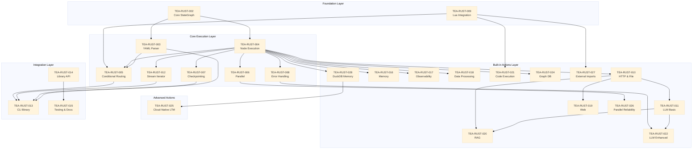

# TEA-RUST-001: Migrate The Edge Agent to Pure Rust with Lua Scripting

## Epic Overview

| Field | Value |
|-------|-------|
| **ID** | TEA-RUST-001 |
| **Type** | Epic |
| **Priority** | High |
| **Estimated Effort** | 24-30 weeks (includes built-in actions + LTM/Graph + Cloud-Native + Parallel Reliability + External Imports + DuckDB Memory Layer) |
| **Status** | Draft |

## Description

**As a** developer deploying autonomous workflows to edge computing environments,
**I want** The Edge Agent rewritten in Rust with Lua scripting support,
**So that** I get a single static binary with true parallelism, minimal resource footprint, and resilient unattended execution.

## Background

The Edge Agent (tea) is currently a Python library (~3K LOC) implementing a state graph workflow engine inspired by LangGraph. The migration to Rust will:

- Eliminate Python runtime dependencies
- Enable true parallel execution (no GIL)
- Produce a small (~5-10MB) static binary suitable for edge deployment
- Support autonomous operation without human intervention

**Target deployment:** Embedded Linux systems running autonomously, requiring robust error handling and recovery mechanisms.

---

## Scope

### In Scope

- Static graph execution from YAML configuration
- Node execution with built-in actions (Rust-native)
- Lua 5.4 integration for custom logic and eval expressions
- Conditional edge routing (Lua expressions)
- Parallel fan-out/fan-in execution (rayon)
- Checkpoint persistence (serde + bincode)
- Interrupt before/after with resume capability
- `invoke()` and `stream()` execution modes
- Template variable substitution (`{{ state.key }}`, `{{ variables.key }}`)
- CLI binary for standalone execution
- Library crate for embedding in other Rust projects
- Configurable retry/fallback error handling
- LLM integration (Ollama, OpenAI-compatible APIs)
- Linux x86_64 and aarch64 targets

### Out of Scope

- Dynamic graph mutation at runtime
- Python API or bindings (PyO3)
- Backward compatibility with pickle checkpoints
- Python `exec()`/`eval()` support
- macOS / Windows support
- Non-OpenAI-compatible LLM APIs (Anthropic native, etc.)
- Tools Bridge actions (CrewAI, MCP, LangChain) - Python ecosystem dependent

---

## Acceptance Criteria

### Graph Execution

- [ ] **AC-1**: GIVEN a valid YAML workflow file, WHEN loaded by the Rust engine, THEN an immutable StateGraph is constructed

- [ ] **AC-2**: GIVEN a compiled StateGraph, WHEN `invoke()` is called with initial state, THEN:
  - **(a)** Nodes execute in topological order respecting edge dependencies
  - **(b)** For sequential edges: source node completes before target node starts
  - **(c)** For conditional edges: only the branch matching the condition executes
  - **(d)** For parallel edges: all branches execute concurrently, results merge at fan-in node
  - **(e)** Final state contains all accumulated state updates from executed nodes
  - **(f)** Node execution order is deterministic for the same input state

- [ ] **AC-3**: GIVEN a compiled StateGraph, WHEN `stream()` is called with initial state, THEN an iterator yields events for each node execution

### Parallel Execution

- [ ] **AC-4**: GIVEN parallel edges defined in YAML, WHEN execution reaches fan-out node, THEN:
  - **(a)** Branches receive deep copies of state at fan-out point
  - **(b)** Branches execute concurrently via rayon thread pool
  - **(c)** At fan-in, branch results are available via `parallel_results` parameter
  - **(d)** Fan-in node is responsible for merge strategy (no implicit merge)
  - **(e)** If no fan-in node defined, branches merge with last-write-wins per key

- [ ] **AC-5**: GIVEN a parallel branch fails, WHEN retry policy is configured, THEN branch retries up to max_retries before failing

### Parallel Execution Reliability (TD.13)

- [ ] **AC-47**: GIVEN `ParallelConfig` with `timeout_seconds` configured, WHEN parallel flow exceeds timeout, THEN flow is marked with `timeout: true` in `ParallelFlowResult`

- [ ] **AC-48**: GIVEN `RetryPolicy` with `max_retries`, `base_delay`, `backoff_multiplier` configured, WHEN transient failure occurs, THEN retry with exponential backoff up to max_retries

- [ ] **AC-49**: GIVEN `CircuitBreakerConfig` with `failure_threshold` and `reset_timeout`, WHEN failures exceed threshold, THEN circuit opens and subsequent requests fail fast

- [ ] **AC-50**: GIVEN `ParallelFlowResult` structure, WHEN accessing result fields, THEN dict-like access (`.get()`, `["key"]`) works for backwards compatibility

- [ ] **AC-51**: GIVEN `ParallelFlowCallback` protocol implemented, WHEN parallel flow lifecycle events occur, THEN callbacks invoked with `ParallelFlowContext`

- [ ] **AC-52**: GIVEN circuit breaker is OPEN, WHEN `reset_timeout` elapses, THEN circuit transitions to HALF_OPEN and allows test request

### Checkpointing

- [ ] **AC-6**: GIVEN `interrupt_before` configured for a node, WHEN execution reaches that node, THEN execution stops and checkpoint is saved

- [ ] **AC-7**: GIVEN a saved checkpoint, WHEN `invoke()` is called with checkpoint path and state updates, THEN execution resumes with merged state

### Lua Integration

- [ ] **AC-8**: GIVEN a Lua condition expression, WHEN evaluated against current state, THEN:
  - **(a)** Lua expression has access to `state` table (read-only copy)
  - **(b)** Expression MUST return a string matching a defined edge target name
  - **(c)** If return value matches no edge target, `RoutingError::NoMatchingEdge` is raised
  - **(d)** If expression returns `nil`, default edge (if defined) is selected
  - **(e)** If expression errors, `RoutingError::ConditionEvaluation` is raised with Lua error message

- [ ] **AC-9**: GIVEN inline Lua code in a node, WHEN node executes, THEN Lua script runs with state access and returns updated state

### Error Handling

- [ ] **AC-10**: GIVEN a node fails with transient error, WHEN retry policy allows retries, THEN node retries with exponential backoff up to max_retries

- [ ] **AC-11**: GIVEN a node exhausts retries, WHEN fallback node is configured, THEN execution continues to fallback node

- [ ] **AC-12**: GIVEN a node exhausts retries with no fallback, WHEN error_policy is "continue", THEN execution skips to next node with error logged to state

- [ ] **AC-13**: GIVEN unattended execution mode, WHEN any unrecoverable error occurs, THEN checkpoint is saved and process exits with non-zero code

### LLM Actions

- [ ] **AC-14**: GIVEN `llm.call` action with Ollama provider, WHEN node executes, THEN request is sent to local Ollama instance and response stored in state

- [ ] **AC-15**: GIVEN `llm.call` action with OpenAI-compatible provider, WHEN node executes with api_base and api_key, THEN request is sent to specified endpoint and response stored in state

- [ ] **AC-16**: GIVEN LLM request fails, WHEN retry policy is configured, THEN request retries with backoff before falling back

### Built-in Actions (Rust Native)

- [ ] **AC-23**: GIVEN `memory.store` action, WHEN executed with key/value/ttl, THEN data is stored in memory backend with TTL enforcement

- [ ] **AC-24**: GIVEN `memory.retrieve` action, WHEN executed with key, THEN stored value is returned (or default if expired/missing)

- [ ] **AC-25**: GIVEN `trace.start`/`trace.log`/`trace.end` actions, WHEN executed, THEN spans are created, events logged, and exported via configured exporter

- [ ] **AC-26a**: GIVEN valid JSON string input, WHEN `json.parse` executes, THEN output contains parsed `serde_json::Value` equivalent

- [ ] **AC-26b**: GIVEN invalid JSON string input, WHEN `json.parse` executes, THEN `ActionError::InvalidInput` is returned with parse error location

- [ ] **AC-26c**: GIVEN parsed JSON and JMESPath expression, WHEN `json.transform` executes, THEN output matches JMESPath specification (jmespath-rs crate, compatible with jmespath.org/specification.html)

- [ ] **AC-26d**: GIVEN invalid JMESPath expression, WHEN `json.transform` executes, THEN `ActionError::InvalidInput` is returned with expression error

- [ ] **AC-26e**: GIVEN `serde_json::Value` input, WHEN `json.stringify` executes, THEN output is valid JSON string with optional `pretty` parameter for formatted output

- [ ] **AC-26f**: All JSON actions (`json.parse`, `json.transform`, `json.stringify`) MUST handle UTF-8 encoded strings per RFC 8259

- [ ] **AC-27**: GIVEN `csv.parse`/`csv.stringify` actions, WHEN executed, THEN CSV data is parsed/serialized with configurable delimiters and headers

- [ ] **AC-28**: GIVEN `data.validate` action with JSON Schema, WHEN executed, THEN data is validated and errors are returned with paths

- [ ] **AC-29**: GIVEN `data.merge`/`data.filter` actions, WHEN executed, THEN dicts are merged (deep/shallow) and lists are filtered by predicates

- [ ] **AC-30**: GIVEN `web.scrape`/`web.crawl` actions, WHEN executed with Firecrawl API key, THEN content is fetched and returned as LLM-ready markdown

- [ ] **AC-31**: GIVEN `web.search` action, WHEN executed with Perplexity API key, THEN search results are returned

- [ ] **AC-32**: GIVEN `embedding.create` action, WHEN executed, THEN embeddings are generated via OpenAI or Ollama provider

- [ ] **AC-33**: GIVEN `vector.store`/`vector.query` actions, WHEN executed, THEN documents are stored with embeddings and semantic search returns ranked results

- [ ] **AC-34**: GIVEN `code.execute` action is DISABLED by default, WHEN enabled and executed with Lua code, THEN code runs in Lua sandbox (not RestrictedPython)

### Long-Term Memory Actions (Rust Native - DuckDB)

*Note: Merged from TEA-RUST-023 into TEA-RUST-028. Uses DuckDB FTS instead of SQLite FTS5.*

- [ ] **AC-35**: GIVEN `ltm.store` action, WHEN executed with key/value/metadata, THEN data is persisted to DuckDB with FTS indexing

- [ ] **AC-36**: GIVEN `ltm.retrieve` action, WHEN executed with key, THEN stored value and metadata are returned (or default if not found)

- [ ] **AC-37**: GIVEN `ltm.search` action, WHEN executed with query text, THEN DuckDB full-text search returns matching entries ranked by relevance

- [ ] **AC-38**: GIVEN `graph.store_entity` action, WHEN executed with entity_id/type/properties, THEN entity is stored in graph database with optional embedding

- [ ] **AC-39**: GIVEN `graph.store_relation` action, WHEN executed with source/target/type, THEN relationship edge is created in graph database

- [ ] **AC-40**: GIVEN `graph.query` action, WHEN executed with query pattern, THEN graph traversal returns matching entities and relations

- [ ] **AC-41**: GIVEN `graph.retrieve_context` action, WHEN executed with entity_id or embedding, THEN N-hop subgraph context is returned

### Cloud-Native LTM Backends (Rust Native)

- [ ] **AC-42**: GIVEN `ltm_backend="turso"` configuration, WHEN LTM actions execute, THEN data is stored/retrieved via Turso/libSQL with FTS5 support

- [ ] **AC-43**: GIVEN `ltm_backend="d1"` configuration, WHEN LTM actions execute, THEN data is stored/retrieved via Cloudflare D1 REST API

- [ ] **AC-44**: GIVEN `ltm_backend="postgres"` configuration, WHEN LTM actions execute, THEN data is stored/retrieved via PostgreSQL with `tsvector` full-text search

- [ ] **AC-45**: GIVEN `ltm_backend="blob-sqlite"` configuration, WHEN LTM actions execute, THEN SQLite file is downloaded from blob storage, modified locally, and uploaded with distributed locking

- [ ] **AC-46**: GIVEN cloud-native backend configured, WHEN backend dependency is missing, THEN informative error with installation instructions is returned

### External Action Imports (YE.6)

- [ ] **AC-53**: GIVEN `imports:` section in YAML with `path:` entries, WHEN loading YAML, THEN Lua modules loaded from relative file paths

- [ ] **AC-54**: GIVEN `imports:` section with `namespace:` prefix, WHEN actions registered, THEN actions accessible via `namespace.action_name`

- [ ] **AC-55**: GIVEN external module loaded, WHEN module has `register_actions(registry, engine)` function, THEN actions registered in engine's action registry

- [ ] **AC-56**: GIVEN circular import attempted (same module twice), WHEN `_load_imports()` runs, THEN module loaded once and duplicate skipped

### Unified DuckDB Memory Layer (TEA-RUST-028)

*Consolidates TEA-RUST-023 (LTM) + query engine + vector search + sessions + context + local blob storage.*

#### Query Engine & Resilience

- [ ] **AC-57**: GIVEN `QueryEngine` trait definition, WHEN DuckDB backend configured, THEN SQL queries execute with circuit breaker and connection pooling

- [ ] **AC-58**: GIVEN `catalog.register_table` action, WHEN executed with table schema, THEN table metadata stored in DuckDB catalog

- [ ] **AC-59**: GIVEN `memory.grep` action, WHEN executed with pattern, THEN LIKE-based search returns matching entries from DuckDB

- [ ] **AC-60**: GIVEN `memory.sql_query` action, WHEN executed with SELECT query, THEN query validated via SQL sandbox and executed

- [ ] **AC-61**: GIVEN `VectorIndex` trait definition, WHEN DuckDB VSS backend configured, THEN vector similarity search uses HNSW index

- [ ] **AC-62**: GIVEN `CircuitBreaker` with failure tracking, WHEN DuckDB connection fails, THEN circuit opens after threshold and rejects requests

- [ ] **AC-63**: GIVEN `ConnectionPool` for DuckDB, WHEN concurrent queries execute, THEN connections reused with health checks

#### Session Management (DuckDB-based)

- [ ] **AC-66**: GIVEN `session.create` action, WHEN executed with TTL, THEN session record created in DuckDB with expiration timestamp

- [ ] **AC-67**: GIVEN `session.end` action, WHEN executed, THEN session marked as archived in DuckDB (soft delete for analytics)

- [ ] **AC-68**: GIVEN `session.get` action, WHEN executed with session_id, THEN session metadata returned from DuckDB

- [ ] **AC-69**: GIVEN `session.list` action, WHEN executed with filters, THEN matching sessions returned with pagination

#### Context Assembly (Local backends)

- [ ] **AC-70**: GIVEN `context.assemble` action, WHEN executed with scope config, THEN context assembled from DuckDB (metadata) + local files (blobs)

- [ ] **AC-71**: GIVEN relevance ranking in context assembly, WHEN multiple sources match, THEN results ranked by (VSS similarity * 0.7) + (priority * 0.3)

#### Local Blob Storage

- [ ] **AC-72**: GIVEN `memory.file_store` action, WHEN executed with path/content, THEN file written to local filesystem with metadata in DuckDB

- [ ] **AC-73**: GIVEN `memory.file_retrieve` action, WHEN executed with path, THEN file content read from local filesystem

- [ ] **AC-74**: GIVEN `memory.file_list` action, WHEN executed with pattern, THEN matching files listed from DuckDB metadata

### Conditional Start Edges (YE.7 in TEA-RUST-003)

- [ ] **AC-64**: GIVEN `when` condition on `__start__` edge in YAML, WHEN graph parsed, THEN conditional edge routing applied (not ignored)

- [ ] **AC-65**: GIVEN multiple conditional edges from `__start__`, WHEN graph invoked with state, THEN correct path selected based on condition evaluation

### CLI

- [ ] **AC-17**: GIVEN `tea` CLI binary, WHEN run with `tea run workflow.yaml --input '{"key": "value"}'`, THEN workflow executes and outputs final state as JSON

- [ ] **AC-18**: GIVEN `tea` CLI binary, WHEN run with `tea run workflow.yaml --stream`, THEN workflow outputs each event as newline-delimited JSON

- [ ] **AC-19**: GIVEN `tea` CLI binary, WHEN run with `tea resume checkpoint.bin --input '{"update": "value"}'`, THEN execution resumes from checkpoint with merged state

- [ ] **AC-20**: GIVEN `tea` CLI binary, WHEN run with `tea validate workflow.yaml`, THEN YAML is parsed and validated without execution

### Library

- [ ] **AC-21**: GIVEN `the_edge_agent` crate as dependency, WHEN `StateGraph::from_yaml()` is called, THEN graph can be used in Rust application

- [ ] **AC-22**: GIVEN library usage, WHEN custom actions are registered via ActionsRegistry, THEN custom Rust functions can be called from YAML nodes

---

## Technical Architecture

### Core Crates

| Component | Crate | Purpose |
|-----------|-------|---------|
| Graph engine | `petgraph` | DiGraph data structure |
| YAML parsing | `serde_yaml` | Configuration loading |
| Templates | `tera` | `{{ variable }}` syntax |
| Lua runtime | `mlua` | Scripting and eval |
| Parallelism | `rayon` | Thread pool |
| Channels | `crossbeam` | Streaming events |
| Serialization | `serde`, `bincode` | Checkpoints |
| HTTP client | `reqwest` | Actions, LLM calls |
| CLI | `clap` | Command-line interface |
| Logging | `tracing` | Observability |

### Key Design Decisions

| Decision | Rationale |
|----------|-----------|
| Static graphs only | Simpler, immutable after parse |
| Lua 5.4 (not LuaJIT) | Modern features, simpler build |
| rayon over tokio | Simpler for CPU-bound graph traversal |
| reqwest blocking | Avoid async complexity |
| No Python interop | Clean break, no FFI overhead |
| bincode checkpoints | Compact binary, no pickle |
| musl static linking | Zero runtime dependencies |

### Build Targets

- `x86_64-unknown-linux-musl` (static binary)
- `aarch64-unknown-linux-musl` (ARM64 edge devices)

---

## Error Handling Configuration

```yaml
# Global defaults
error_policy:
  max_retries: 3
  backoff_base_ms: 1000
  backoff_max_ms: 30000
  jitter: true
  on_failure: checkpoint_and_exit  # or: continue, fallback

nodes:
  fetch_data:
    action: http.get
    config:
      url: "{{ variables.api_url }}"
    retry:
      max_retries: 5  # Override global
    fallback: use_cached_data  # Node to run on failure

  use_cached_data:
    action: file.read
    config:
      path: "/var/cache/last_data.json"
```

---

## CLI Interface

### Commands

| Command | Description |
|---------|-------------|
| `tea run <file>` | Execute a workflow |
| `tea resume <checkpoint>` | Resume from checkpoint |
| `tea validate <file>` | Validate YAML without execution |
| `tea inspect <file>` | Show graph structure |

### Flags

| Flag | Description |
|------|-------------|
| `--input, -i` | Initial state as JSON string or @file.json |
| `--stream, -s` | Output events as NDJSON |
| `--checkpoint-dir, -c` | Directory for checkpoint files |
| `--config, -C` | Config overrides as JSON |
| `--verbose, -v` | Increase log verbosity |
| `--quiet, -q` | Suppress non-error output |

---

## Sub-Stories

| ID | Title | Points |
|----|-------|--------|
| TEA-RUST-002 | Core StateGraph with petgraph | 5 |
| TEA-RUST-003 | YAML parser and tera template engine | 5 |
| TEA-RUST-004 | Node execution and edge traversal | 3 |
| TEA-RUST-005 | Conditional routing with Lua expressions | 3 |
| TEA-RUST-006 | Parallel fan-out/fan-in with rayon | 5 |
| TEA-RUST-007 | Checkpoint persistence and interrupt handling | 3 |
| TEA-RUST-008 | Error handling with retry and fallback | 5 |
| TEA-RUST-009 | Lua integration via mlua | 5 |
| TEA-RUST-010 | Built-in actions - HTTP and file operations | 3 |
| TEA-RUST-011 | Built-in actions - LLM (Ollama, OpenAI-compatible) | 5 |
| TEA-RUST-012 | Stream iterator implementation | 2 |
| TEA-RUST-013 | CLI binary with clap | 3 |
| TEA-RUST-014 | Library crate public API | 2 |
| TEA-RUST-015 | Testing suite and documentation | 5 |
| TEA-RUST-016 | Built-in actions - Memory (store, retrieve, summarize) | 3 |
| TEA-RUST-017 | Built-in actions - Observability (trace start, log, end) | 3 |
| TEA-RUST-018 | Built-in actions - Data Processing (json.*, csv.*, data.*) | 5 |
| TEA-RUST-019 | Built-in actions - Web (scrape, crawl, search via APIs) | 3 |
| TEA-RUST-020 | Built-in actions - RAG (embedding, vector store/query) | 5 |
| TEA-RUST-021 | Built-in actions - Code Execution (Lua sandbox) | 5 |
| TEA-RUST-022 | LLM Enhanced actions (call with retry, stream, tools) | 5 |
| ~~TEA-RUST-023~~ | ~~Built-in actions - Long-Term Memory (ltm.*, SQLite/FTS5)~~ | ~~5~~ | *Merged into TEA-RUST-028* |
| TEA-RUST-024 | Built-in actions - Graph Database (graph.*, CozoDB native Rust) | 5 |
| TEA-RUST-025 | Built-in actions - Cloud-Native LTM (Turso, D1, PostgreSQL, Blob-SQLite) | 8 |
| TEA-RUST-026 | Parallel Execution Reliability (timeout, retry, circuit breaker) | 5 |
| TEA-RUST-027 | External Action Module Imports (Lua modules, namespacing) | 3 |
| TEA-RUST-028 | **Unified DuckDB Memory Layer** (ltm.*, session.*, context.*, memory.*, local blob) | 8 |

### Sub-Story Dependencies



### Dependency Summary

| Story | Depends On | Blocks | Can Parallelize With |
|-------|------------|--------|---------------------|
| **TEA-RUST-002** | - | 003, 004 | 009 |
| **TEA-RUST-009** | - | 005, 021, 027 | 002 |
| **TEA-RUST-003** | 002 | 005, 013 | 004 |
| **TEA-RUST-004** | 002 | 005-008, 010, 012, 016-018, 024, 028 | 003 |
| **TEA-RUST-005** | 003, 004, 009 | 013 | 006, 007, 008 |
| **TEA-RUST-006** | 004 | 026 | 005, 007, 008 |
| **TEA-RUST-007** | 004 | 013 | 005, 006, 008 |
| **TEA-RUST-008** | 004 | 022 | 005, 006, 007 |
| **TEA-RUST-012** | 004 | 013 | 005-008, 010 |
| **TEA-RUST-010** | 004 | 011, 019, 020 | 016-018 |
| **TEA-RUST-011** | 010 | 020, 022 | 016-019 |
| **TEA-RUST-016** | 004 | - | 010, 017, 018, 024 |
| **TEA-RUST-017** | 004 | - | 010, 016, 018, 024 |
| **TEA-RUST-018** | 004 | - | 010, 016, 017, 024 |
| **TEA-RUST-019** | 010 | - | 011, 016-018 |
| **TEA-RUST-020** | 010, 011 | - | 019, 022 |
| **TEA-RUST-021** | 009 | - | 010-020, 022 |
| **TEA-RUST-022** | 008, 011 | - | 019, 020, 021 |
| **TEA-RUST-024** | 004 | - | 016-022, 028 |
| **TEA-RUST-026** | 006 | - | All actions |
| **TEA-RUST-027** | 009 | - | All actions |
| **TEA-RUST-028** | 004 | 025 | 016-024, 026, 027 |
| **TEA-RUST-025** | 028 | - | - |
| **TEA-RUST-013** | 003, 005, 007, 012 | 014 | - |
| **TEA-RUST-014** | 013 | 015 | - |
| **TEA-RUST-015** | 014 | - | - |

### Critical Path

The longest dependency chain determines minimum project duration:

```
002 → 004 → 010 → 011 → 022 → 013 → 014 → 015
         ↓
        028 → 025
```

### Parallelization Opportunities

| Phase | Weeks | Parallel Tracks |
|-------|-------|-----------------|
| **1: Foundation** | 1-3 | Track A: 002 (StateGraph) ∥ Track B: 009 (Lua) |
| **2: Core** | 4-6 | Track A: 003→005 ∥ Track B: 004→006/007/008 |
| **3: Actions** | 7-14 | Track A: 010→011→022 ∥ Track B: 016,017,018 ∥ Track C: 021 ∥ Track D: 028→025 |
| **4: Integration** | 15-18 | Track A: 013→014→015 |

---

## Built-in Actions Migration

The Python implementation includes 27+ built-in actions across 8 categories. This section details the Rust migration strategy for each.

### Migration Strategy by Category

#### P0 - Core Actions (Migrate in Phase 1)

| Action Category | Python Implementation | Rust Implementation | Complexity |
|-----------------|----------------------|---------------------|------------|
| **Memory Actions** | `InMemoryBackend` with TTL | `HashMap` with `Instant` for TTL | Low |
| | `memory.store/retrieve` | Direct Rust implementation | Low |
| | `memory.summarize` | Uses `llm.call` internally | Medium |
| **Observability** | `TraceContext` with exporters | `tracing` crate integration | Low |
| | `trace.start/log/end` | Native Rust spans | Low |
| **Data Processing** | stdlib `json`, `csv` | `serde_json`, `csv` crates | Low |
| | `json.parse/transform/stringify` | `serde_json` + `jmespath` | Low |
| | `csv.parse/stringify` | `csv` crate | Low |
| | `data.validate` | `jsonschema` optional | `jsonschema` crate | Medium |
| | `data.merge/filter` | Pure Python | Pure Rust | Low |
| **Long-Term Memory** | `SQLiteBackend` with FTS5 | `rusqlite` with FTS5 | Low |
| | `ltm.store/retrieve/delete` | Direct Rust implementation | Low |
| | `ltm.search` | FTS5 full-text search | `rusqlite` FTS5 | Low |

#### P1 - Integration Actions (Migrate in Phase 2)

| Action Category | Python Implementation | Rust Implementation | Complexity |
|-----------------|----------------------|---------------------|------------|
| **LLM Enhanced** | OpenAI Python SDK | `reqwest` HTTP calls | Medium |
| | `llm.call` | Completion + retry logic | `reqwest` + `backoff` crate | Medium |
| | `llm.stream` | Streaming response | `reqwest` + `futures-util` | Medium |
| | `llm.tools` | Function calling dispatch | Action registry dispatch | Medium |
| **Web Actions** | Firecrawl/Perplexity APIs | `reqwest` HTTP calls | Low |
| | `web.scrape/crawl/search` | External API delegation | Same pattern in Rust | Low |
| **RAG Actions** | OpenAI/Ollama embeddings | `reqwest` HTTP calls | Medium |
| | `embedding.create` | Provider abstraction | Rust trait for providers | Medium |
| | `vector.store/query` | `InMemoryVectorStore` | Rust native vector store | Medium |

#### P2 - Advanced Actions (Migrate in Phase 3)

| Action Category | Python Implementation | Rust Implementation | Complexity |
|-----------------|----------------------|---------------------|------------|
| **Code Execution** | RestrictedPython sandbox | **Lua sandbox** (mlua) | High |
| | `code.execute/sandbox` | Lua 5.4 scripting | Different paradigm |
| **Graph Database** | CozoDB via `pycozo` | **CozoDB native Rust** (`cozo` crate) | Medium |
| | `graph.store_entity/relation` | Same Datalog operations | Low |
| | `graph.query` | Datalog queries | Same Datalog queries | Low |
| | `graph.retrieve_context` | HNSW + N-hop traversal | Same (native Rust) | Low |
| **Cloud-Native LTM** | Multiple Python backends | Native Rust implementations | Medium |
| | Turso via `libsql-client` | `libsql` crate (native Rust) | Low |
| | D1 via HTTP (httpx/requests) | `reqwest` HTTP client | Low |
| | PostgreSQL via `psycopg` | `sqlx` with compile-time checks | Medium |
| | Blob SQLite (download-lock-upload) | `rusqlite` + `object_store` | Medium |

#### Excluded from Rust Migration

| Action Category | Reason for Exclusion |
|-----------------|---------------------|
| **Tools Bridge** (`tools.crewai`, `tools.mcp`, `tools.langchain`) | Deeply tied to Python ecosystem. Users needing these should use Python version. |
| **Bighorn Graph Backend** | KuzuDB fork with Python bindings only. Use CozoDB (native Rust) for graph in Rust version. |
| **Litestream Backend** | Requires separate daemon process. Not suitable for single static binary deployment. |
| **Firestore Backend** | No native Rust SDK. Would require maintaining custom HTTP client. Low priority. |

### Built-in Actions Rust Crate Structure

```
src/
├── actions/
│   ├── mod.rs           # Action registry and trait definitions
│   ├── memory.rs        # memory.store, memory.retrieve, memory.summarize
│   ├── ltm/
│   │   ├── mod.rs       # LTM backend trait and factory
│   │   ├── sqlite.rs    # SQLiteBackend (rusqlite + FTS5)
│   │   ├── turso.rs     # TursoBackend (libsql crate)
│   │   ├── d1.rs        # D1Backend (reqwest + Cloudflare API)
│   │   ├── postgres.rs  # PostgresBackend (sqlx)
│   │   └── blob.rs      # BlobSQLiteBackend (object_store + distributed lock)
│   ├── graph.rs         # graph.store_entity, graph.store_relation, graph.query, graph.retrieve_context (cozo crate)
│   ├── trace.rs         # trace.start, trace.log, trace.end (uses tracing crate)
│   ├── data.rs          # json.*, csv.*, data.* actions
│   ├── web.rs           # web.scrape, web.crawl, web.search
│   ├── rag.rs           # embedding.create, vector.store, vector.query
│   ├── llm.rs           # llm.call (with retry), llm.stream, llm.tools
│   └── code.rs          # code.execute (Lua sandbox)
```

### Key Migration Decisions

#### 1. Memory Actions

**Python**: `InMemoryBackend` with `time.monotonic()` for TTL, `threading.Lock` for thread safety.

**Rust**:
```rust
use std::collections::HashMap;
use std::time::{Duration, Instant};
use parking_lot::RwLock;

struct MemoryEntry {
    value: serde_json::Value,
    expires_at: Option<Instant>,
}

struct InMemoryBackend {
    data: RwLock<HashMap<String, MemoryEntry>>,
}
```

#### 2. Observability Actions

**Python**: Custom `TraceContext` with thread-local span stacks.

**Rust**: Use the established `tracing` ecosystem:
```rust
use tracing::{span, Level, event};
use tracing_subscriber::fmt;

// trace.start -> span!
// trace.log -> event!
// trace.end -> span exit
```

#### 3. Data Processing Actions

**Python**: `json`, `csv` stdlib, optional `jmespath`, `jsonschema`.

**Rust**:
- `serde_json` for JSON parsing/serialization
- `csv` crate for CSV operations
- `jmespath` crate for JMESPath expressions
- `jsonschema` crate for validation

#### 4. Web Actions

**Python**: HTTP calls to Firecrawl and Perplexity APIs via `requests`.

**Rust**: Same pattern with `reqwest`:
```rust
use reqwest::blocking::Client;

fn web_scrape(url: &str, api_key: &str) -> Result<ScrapeResult, ActionError> {
    let client = Client::new();
    let resp = client.post("https://api.firecrawl.dev/v1/scrape")
        .bearer_auth(api_key)
        .json(&ScrapeRequest { url, formats: vec!["markdown"] })
        .send()?;
    // ...
}
```

#### 5. RAG Actions

**Python**: `OpenAIEmbeddingProvider`, `OllamaEmbeddingProvider`, `InMemoryVectorStore`.

**Rust**:
```rust
trait EmbeddingProvider {
    fn embed(&self, texts: &[&str]) -> Result<Vec<Vec<f32>>, ActionError>;
    fn dimensions(&self) -> usize;
}

struct InMemoryVectorStore {
    collections: HashMap<String, Vec<Document>>,
}

impl InMemoryVectorStore {
    fn cosine_similarity(a: &[f32], b: &[f32]) -> f32 {
        // SIMD-optimized with ndarray or nalgebra
    }
}
```

#### 6. Code Execution Actions

**Python**: RestrictedPython bytecode transformation.

**Rust**: **Lua sandbox** via `mlua`:
```rust
use mlua::{Lua, Result};

fn code_execute(code: &str, timeout: Duration) -> Result<ExecutionResult> {
    let lua = Lua::new();
    // Sandbox: remove dangerous globals
    lua.scope(|scope| {
        // Set timeout via custom hook
        lua.set_hook(mlua::HookTriggers::every_line(), move |_lua, _debug| {
            // Check timeout
            Ok(())
        });
        lua.load(code).exec()
    })
}
```

**Key Difference**: Python `code.execute` runs Python; Rust `code.execute` runs Lua. This is a breaking change but provides true sandboxing without GIL concerns.

#### 7. Long-Term Memory Actions

**Python**: `SQLiteBackend` with FTS5 via `sqlite3` stdlib, thread-local connections.

**Rust**: `rusqlite` crate with FTS5 extension:
```rust
use rusqlite::{Connection, params};
use parking_lot::Mutex;

struct SQLiteBackend {
    conn: Mutex<Connection>,
}

impl SQLiteBackend {
    fn new(path: &str) -> Result<Self, rusqlite::Error> {
        let conn = Connection::open(path)?;
        conn.execute_batch("
            PRAGMA journal_mode=WAL;
            CREATE TABLE IF NOT EXISTS ltm_store (
                key TEXT PRIMARY KEY,
                value TEXT NOT NULL,
                metadata TEXT,
                created_at TEXT DEFAULT CURRENT_TIMESTAMP
            );
            CREATE VIRTUAL TABLE IF NOT EXISTS ltm_fts USING fts5(key, value, metadata);
        ")?;
        Ok(Self { conn: Mutex::new(conn) })
    }

    fn search(&self, query: &str, limit: usize) -> Result<Vec<Entry>, rusqlite::Error> {
        let conn = self.conn.lock();
        let mut stmt = conn.prepare("
            SELECT key, value, metadata FROM ltm_fts WHERE ltm_fts MATCH ?1 LIMIT ?2
        ")?;
        // ...
    }
}
```

**Key Advantage**: Native Rust with same SQLite/FTS5 semantics - no breaking changes.

#### 8. Graph Database Actions

**Python**: CozoDB via `pycozo` Python bindings with SQLite storage backend.

**Rust**: CozoDB native Rust crate (`cozo`) - this is the actual implementation that `pycozo` wraps:
```rust
use cozo::{DbInstance, DataValue, NamedRows};

struct CozoBackend {
    db: DbInstance,
}

impl CozoBackend {
    fn new(path: &str) -> Result<Self, cozo::Error> {
        let db = DbInstance::new("sqlite", path, "")?;
        // Initialize schema - same Datalog as Python version
        db.run_script(r#"
            :create entity {
                id: String =>
                type: String,
                properties: String,
                embedding: [Float]?,
                created_at: Float default now()
            }
        "#, Default::default())?;
        db.run_script(r#"
            :create relation {
                from_id: String,
                to_id: String,
                rel_type: String =>
                properties: String?,
                created_at: Float default now()
            }
        "#, Default::default())?;
        Ok(Self { db })
    }

    fn query(&self, datalog: &str, params: BTreeMap<String, DataValue>) -> Result<NamedRows, cozo::Error> {
        self.db.run_script(datalog, params)
    }
}
```

**Key Advantage**: CozoDB is written in Rust - `pycozo` is just Python bindings. Using native Rust means:
- Same Datalog query language (no breaking changes)
- Same SQLite storage backend
- Same HNSW vector indexing
- Better performance (no Python FFI overhead)
- Smaller binary (no Python runtime)

### Rust Crate Dependencies for Built-in Actions

| Crate | Purpose | Used By |
|-------|---------|---------|
| `serde_json` | JSON parsing/serialization | data.*, web.*, rag.* |
| `csv` | CSV parsing/writing | csv.* |
| `jmespath` | JMESPath expressions | json.transform |
| `jsonschema` | JSON Schema validation | data.validate |
| `reqwest` (blocking) | HTTP client | web.*, rag.*, llm.*, d1 |
| `tracing` | Structured logging | trace.* |
| `mlua` | Lua scripting | code.* |
| `parking_lot` | Fast RwLock/Mutex | memory.*, ltm.* |
| `rusqlite` | SQLite with FTS5 | ltm.sqlite, ltm.blob |
| `cozo` | Graph DB with Datalog + HNSW | graph.* |
| `libsql` | Turso/libSQL native client | ltm.turso |
| `sqlx` | PostgreSQL with compile-time checks | ltm.postgres |
| `object_store` | S3/GCS/Azure blob storage | ltm.blob |

### Feature Flags for Optional Actions

```toml
[features]
default = ["memory", "trace", "data", "ltm-sqlite"]
memory = []
trace = ["tracing", "tracing-subscriber"]
data = ["serde_json", "csv"]
web = ["reqwest"]
rag = ["reqwest"]
llm = ["reqwest"]
code = ["mlua"]
ltm-sqlite = ["rusqlite"]
ltm-turso = ["libsql"]
ltm-d1 = ["reqwest"]
ltm-postgres = ["sqlx"]
ltm-blob = ["rusqlite", "object_store"]
ltm-all = ["ltm-sqlite", "ltm-turso", "ltm-d1", "ltm-postgres", "ltm-blob"]
graph = ["cozo"]
all = ["memory", "trace", "data", "web", "rag", "llm", "code", "ltm-all", "graph"]
```

### Action Compatibility Matrix

| Action | Python Behavior | Rust Behavior | Breaking Changes |
|--------|----------------|---------------|------------------|
| `memory.store/retrieve` | In-memory with TTL | Same | None |
| `memory.summarize` | Uses OpenAI | Same | None |
| `trace.*` | Custom exporters | `tracing` ecosystem | Exporter config differs |
| `json.*` | stdlib json | `serde_json` | Non-strict mode removed |
| `csv.*` | stdlib csv | `csv` crate | Same behavior |
| `data.validate` | `jsonschema` lib | `jsonschema` crate | Same behavior |
| `data.merge/filter` | Pure Python | Pure Rust | None |
| `web.*` | Firecrawl/Perplexity | Same APIs | None |
| `embedding.create` | OpenAI/Ollama | Same APIs | None |
| `vector.*` | In-memory store | Same | None |
| `llm.*` | OpenAI Python SDK | `reqwest` | None |
| `code.execute` | **RestrictedPython** | **Lua sandbox** | **Different language** |
| `ltm.*` (sqlite) | SQLite + FTS5 | `rusqlite` + FTS5 | None |
| `ltm.*` (turso) | libsql-client | `libsql` crate | None |
| `ltm.*` (d1) | HTTP API | `reqwest` HTTP | None |
| `ltm.*` (postgres) | psycopg | `sqlx` | None |
| `ltm.*` (blob) | download-lock-upload | `object_store` + lock | None |
| `ltm.*` (firestore) | firebase-admin | **Not migrated** | **Not available** |
| `ltm.*` (litestream) | Daemon + SQLite | **Not migrated** | **Not available** |
| `graph.*` (cozo) | CozoDB (pycozo) | CozoDB (native Rust) | None |
| `graph.*` (bighorn) | Kuzu (Cypher) | **Not migrated** | **Not available** |
| `tools.*` | CrewAI/MCP/LangChain | **Not migrated** | **Not available** |

---

## Parallel Execution Reliability (TEA-RUST-026)

### Python Implementation (TD.13)

The Python implementation includes comprehensive parallel reliability features:

- **ParallelConfig**: Timeout, fail-fast, retry policy, circuit breaker configuration
- **ParallelFlowResult**: Rich result wrapper with success/error/timing/retry metadata
- **RetryPolicy**: Exponential backoff with configurable delays and exception filtering
- **CircuitBreaker**: CLOSED → OPEN → HALF_OPEN state machine with failure threshold
- **CancellationToken**: Cooperative cancellation via `threading.Event`
- **ParallelFlowCallback**: Protocol for lifecycle event callbacks

### Rust Implementation

```rust
use std::time::{Duration, Instant};
use std::sync::{Arc, RwLock};
use std::collections::HashMap;

#[derive(Clone, Debug)]
pub struct ParallelConfig {
    pub timeout: Option<Duration>,
    pub fail_fast: bool,
    pub retry_policy: Option<RetryPolicy>,
    pub circuit_breaker: Option<CircuitBreakerConfig>,
}

#[derive(Clone, Debug)]
pub struct RetryPolicy {
    pub max_retries: u32,
    pub base_delay: Duration,
    pub max_delay: Duration,
    pub backoff_multiplier: f64,
    pub retry_on: Option<Vec<String>>,  // Exception type names
}

#[derive(Clone, Debug)]
pub struct CircuitBreakerConfig {
    pub failure_threshold: u32,
    pub reset_timeout: Duration,
    pub half_open_max_calls: u32,
}

#[derive(Clone, Debug)]
pub enum CircuitState {
    Closed,
    Open { opened_at: Instant },
    HalfOpen { test_calls: u32 },
}

pub struct CircuitBreaker {
    config: CircuitBreakerConfig,
    state: RwLock<CircuitState>,
    failure_count: RwLock<u32>,
}

impl CircuitBreaker {
    pub fn allow_request(&self) -> bool {
        let mut state = self.state.write().unwrap();
        match &*state {
            CircuitState::Closed => true,
            CircuitState::Open { opened_at } => {
                if opened_at.elapsed() >= self.config.reset_timeout {
                    *state = CircuitState::HalfOpen { test_calls: 0 };
                    true
                } else {
                    false
                }
            }
            CircuitState::HalfOpen { test_calls } => {
                *test_calls < self.config.half_open_max_calls
            }
        }
    }

    pub fn record_success(&self) {
        let mut state = self.state.write().unwrap();
        if matches!(&*state, CircuitState::HalfOpen { .. }) {
            *state = CircuitState::Closed;
        }
        *self.failure_count.write().unwrap() = 0;
    }

    pub fn record_failure(&self) {
        let mut failure_count = self.failure_count.write().unwrap();
        *failure_count += 1;

        let mut state = self.state.write().unwrap();
        if matches!(&*state, CircuitState::HalfOpen { .. }) {
            *state = CircuitState::Open { opened_at: Instant::now() };
        } else if *failure_count >= self.config.failure_threshold {
            *state = CircuitState::Open { opened_at: Instant::now() };
        }
    }
}

#[derive(Clone, Debug)]
pub struct ParallelFlowResult {
    pub branch: String,
    pub success: bool,
    pub state: Option<serde_json::Value>,
    pub error: Option<String>,
    pub error_type: Option<String>,
    pub timeout: bool,
    pub timing_ms: f64,
    pub retry_count: u32,
    pub circuit_state: Option<String>,
}

// Dict-like access for backwards compatibility
impl ParallelFlowResult {
    pub fn get(&self, key: &str) -> Option<serde_json::Value> {
        match key {
            "success" => Some(serde_json::json!(self.success)),
            "state" => self.state.clone(),
            "error" => self.error.as_ref().map(|e| serde_json::json!(e)),
            "timeout" => Some(serde_json::json!(self.timeout)),
            "timing_ms" => Some(serde_json::json!(self.timing_ms)),
            _ => None,
        }
    }
}
```

### Key Design Decisions

| Decision | Rationale |
|----------|-----------|
| `RwLock` for circuit breaker state | Reader-writer lock allows concurrent reads, exclusive writes |
| `rayon` timeout via `thread::spawn` + channel | rayon doesn't have built-in timeout; use channel with `recv_timeout` |
| Retry delay via `std::thread::sleep` | Simple blocking approach; async would use `tokio::time::sleep` |
| `ParallelFlowResult.get()` for BC | Mimics Python dict-like access pattern |

---

## External Action Module Imports (TEA-RUST-027)

### Python Implementation (YE.6)

The Python implementation supports external action imports via YAML:

```yaml
imports:
  - path: ./actions/custom.py
    namespace: custom
  - package: tea_actions_slack
    namespace: slack
```

### Rust Implementation

For Rust, external actions will be loaded as **Lua modules** instead of Python modules:

```rust
use mlua::{Lua, Result, Table};
use std::path::Path;
use std::collections::HashMap;

pub struct ActionRegistry {
    actions: HashMap<String, ActionFn>,
    lua: Lua,
    loaded_modules: HashSet<String>,
}

impl ActionRegistry {
    /// Load actions from a Lua file with namespace prefix
    pub fn load_from_path(&mut self, path: &Path, namespace: &str) -> Result<()> {
        let abs_path = path.canonicalize()?;
        let module_key = abs_path.to_string_lossy().to_string();

        // Circular import detection
        if self.loaded_modules.contains(&module_key) {
            return Ok(());  // Already loaded, skip
        }

        let code = std::fs::read_to_string(path)?;
        let module: Table = self.lua.load(&code).eval()?;

        // Module must return table with register_actions function
        let register_fn: mlua::Function = module.get("register_actions")?;
        let local_registry: Table = self.lua.create_table()?;

        register_fn.call::<_, ()>(local_registry.clone())?;

        // Apply namespace prefix
        for pair in local_registry.pairs::<String, mlua::Function>() {
            let (name, func) = pair?;
            let full_name = if namespace.is_empty() {
                name
            } else {
                format!("{}.{}", namespace, name)
            };
            self.register_lua_action(&full_name, func)?;
        }

        self.loaded_modules.insert(module_key);
        Ok(())
    }
}
```

### Lua Module Contract

External Lua modules must follow this pattern:

```lua
-- my_actions.lua
local M = {}

function M.register_actions(registry)
    -- Register action functions
    registry.my_action = function(state, params)
        -- Implementation
        return { result = "value", success = true }
    end

    registry.another_action = function(state, params)
        return { result = params.input, success = true }
    end
end

-- Optional metadata
M.__tea_actions__ = {
    version = "1.0.0",
    description = "My custom Lua actions",
    actions = { "my_action", "another_action" }
}

return M
```

### YAML Syntax (Rust Version)

```yaml
name: my-agent

imports:
  # Local Lua file (relative to YAML file)
  - path: ./actions/custom.lua
    namespace: custom

  # Built-in action set (bundled with tea binary)
  - builtin: web
    namespace: web

nodes:
  - name: process
    uses: custom.transform
    with:
      data: "{{ state.input }}"
```

### Key Differences from Python

| Aspect | Python | Rust |
|--------|--------|------|
| Module language | Python | Lua |
| Import syntax | `path:` (Python file) | `path:` (Lua file) |
| Package imports | `package:` (pip packages) | `builtin:` (bundled sets) |
| Contract function | `register_actions(registry, engine)` | `M.register_actions(registry)` |
| Access to engine | Full engine reference | Limited via Lua globals |

---

## Unified DuckDB Memory Layer (TEA-RUST-028)

*Consolidates TEA-RUST-023 (LTM with SQLite) into a unified DuckDB-based memory layer. Single embedded database for all agent memory needs.*

### Architecture

```
Rust Unified Memory Layer
┌─────────────────────────────────────────────────────────┐
│                    Actions Layer                         │
├───────────┬───────────┬───────────┬───────────┬─────────┤
│  ltm.*    │ memory.*  │ session.* │ context.* │catalog.*│
└─────┬─────┴─────┬─────┴─────┬─────┴─────┬─────┴────┬────┘
      │           │           │           │          │
      └───────────┴───────────┴─────┬─────┴──────────┘
                                    ▼
                            ┌─────────────┐
                            │   DuckDB    │  ← Single embedded DB
                            │  (unified)  │
                            ├─────────────┤
                            │ • LTM store │
                            │ • FTS search│
                            │ • VSS/HNSW  │
                            │ • Sessions  │
                            │ • Metadata  │
                            │ • Catalog   │
                            └──────┬──────┘
                                   │
                            ┌──────▼──────┐
                            │ Local Files │  ← Blob storage
                            │ (filesystem)│
                            └─────────────┘
```

### Why DuckDB Over SQLite?

| Capability | SQLite | DuckDB | Decision |
|------------|--------|--------|----------|
| Full-text search | FTS5 | FTS extension | Both work |
| Vector similarity | ❌ | VSS (HNSW) | **DuckDB** |
| Analytical queries | Row-based | Columnar | **DuckDB** |
| JSON functions | Basic | Rich | **DuckDB** |
| Parquet support | ❌ | Native | **DuckDB** |
| Single binary | Yes | Yes | Tie |

**Conclusion**: One database (DuckDB) handles everything. No need for SQLite.

### Rust Implementation

```rust
use duckdb::{Connection, Result};
use parking_lot::{Mutex, RwLock};
use std::time::{Duration, Instant};
use std::path::PathBuf;

/// Unified memory layer using DuckDB for all storage needs
pub struct UnifiedMemoryLayer {
    db: Arc<Mutex<Connection>>,
    blob_root: PathBuf,
    circuit_breaker: CircuitBreaker,
    sql_sandbox: SqlSandbox,
}

impl UnifiedMemoryLayer {
    pub fn new(db_path: &str, blob_root: PathBuf) -> Result<Self, Error> {
        let conn = Connection::open(db_path)?;

        // Load extensions
        conn.execute_batch("
            INSTALL fts; LOAD fts;
            INSTALL vss; LOAD vss;
        ")?;

        // Initialize schema
        conn.execute_batch("
            -- LTM storage (replaces SQLite FTS5)
            CREATE TABLE IF NOT EXISTS ltm_store (
                key VARCHAR PRIMARY KEY,
                value JSON NOT NULL,
                metadata JSON,
                embedding FLOAT[1536],
                created_at TIMESTAMP DEFAULT current_timestamp,
                updated_at TIMESTAMP DEFAULT current_timestamp
            );

            -- Sessions table
            CREATE TABLE IF NOT EXISTS sessions (
                session_id VARCHAR PRIMARY KEY,
                status VARCHAR DEFAULT 'active',
                metadata JSON,
                created_at TIMESTAMP DEFAULT current_timestamp,
                expires_at TIMESTAMP,
                archived_at TIMESTAMP
            );

            -- File metadata (blobs stored on filesystem)
            CREATE TABLE IF NOT EXISTS file_metadata (
                path VARCHAR PRIMARY KEY,
                content_hash VARCHAR,
                content_type VARCHAR,
                byte_size INTEGER,
                metadata JSON,
                embedding FLOAT[1536],
                created_at TIMESTAMP DEFAULT current_timestamp,
                updated_at TIMESTAMP DEFAULT current_timestamp
            );

            -- Catalog tables
            CREATE TABLE IF NOT EXISTS catalog_tables (
                name VARCHAR PRIMARY KEY,
                schema JSON,
                created_at TIMESTAMP DEFAULT current_timestamp
            );
        ")?;

        Ok(Self {
            db: Arc::new(Mutex::new(conn)),
            blob_root,
            circuit_breaker: CircuitBreaker::new(Default::default()),
            sql_sandbox: SqlSandbox::new(),
        })
    }

    // LTM actions
    pub fn ltm_store(&self, key: &str, value: Value, metadata: Option<Value>) -> Result<()> { ... }
    pub fn ltm_retrieve(&self, key: &str) -> Result<Option<LtmEntry>> { ... }
    pub fn ltm_search(&self, query: &str, limit: usize) -> Result<Vec<LtmEntry>> { ... }

    // Session actions
    pub fn session_create(&self, ttl: Duration) -> Result<String> { ... }
    pub fn session_end(&self, session_id: &str) -> Result<()> { ... }
    pub fn session_get(&self, session_id: &str) -> Result<Option<Session>> { ... }

    // File actions (metadata in DuckDB, content on filesystem)
    pub fn file_store(&self, path: &str, content: &[u8], metadata: Option<Value>) -> Result<()> {
        let full_path = self.blob_root.join(path);
        std::fs::create_dir_all(full_path.parent().unwrap())?;
        std::fs::write(&full_path, content)?;

        let hash = sha256(content);
        let db = self.db.lock();
        db.execute(
            "INSERT OR REPLACE INTO file_metadata (path, content_hash, byte_size, metadata)
             VALUES (?, ?, ?, ?)",
            params![path, hash, content.len(), metadata]
        )?;
        Ok(())
    }

    pub fn file_retrieve(&self, path: &str) -> Result<Vec<u8>> {
        let full_path = self.blob_root.join(path);
        Ok(std::fs::read(full_path)?)
    }

    // Context assembly
    pub fn context_assemble(&self, config: ContextConfig) -> Result<AssembledContext> {
        // 1. Query relevant files from DuckDB metadata
        // 2. Optionally use VSS for semantic relevance
        // 3. Read file contents from filesystem
        // 4. Rank by (similarity * 0.7) + (priority * 0.3)
        // 5. Return assembled context within token limit
        ...
    }

    // Vector search
    pub fn vector_search(&self, embedding: &[f32], table: &str, k: usize) -> Result<Vec<SearchResult>> {
        let db = self.db.lock();
        let results = db.prepare(&format!(
            "SELECT *, array_cosine_similarity(embedding, ?1) as score
             FROM {} WHERE embedding IS NOT NULL
             ORDER BY score DESC LIMIT ?2",
            table
        ))?.query_map(params![embedding, k], ...)?;
        Ok(results)
    }
}
```

### Rust Crate Dependencies

| Crate | Purpose | Used By |
|-------|---------|---------|
| `duckdb` | Unified embedded database | All memory operations |
| `sqlparser` | SQL validation | SqlSandbox |
| `parking_lot` | Fast RwLock/Mutex | ConnectionPool, CircuitBreaker |
| `sha2` | Content hashing | File deduplication |

### Actions Summary

| Action | Storage | Description |
|--------|---------|-------------|
| `ltm.store` | DuckDB | Store key-value with optional embedding |
| `ltm.retrieve` | DuckDB | Get value by key |
| `ltm.search` | DuckDB FTS | Full-text search |
| `session.create` | DuckDB | Create session with TTL |
| `session.end` | DuckDB | Archive session (soft delete) |
| `session.get` | DuckDB | Get session metadata |
| `session.list` | DuckDB | List sessions with filters |
| `memory.grep` | DuckDB | LIKE-based search |
| `memory.sql_query` | DuckDB | Sandboxed SQL query |
| `memory.vector_search` | DuckDB VSS | Semantic similarity search |
| `memory.file_store` | Filesystem + DuckDB | Store file, index metadata |
| `memory.file_retrieve` | Filesystem | Read file content |
| `memory.file_list` | DuckDB | List files by pattern |
| `context.assemble` | DuckDB + Filesystem | Assemble context from multiple sources |
| `catalog.*` | DuckDB | Table/schema management |

### Feature Flags

```toml
[features]
default = ["memory"]
memory = ["duckdb"]
memory-vss = ["duckdb", "duckdb/bundled"]  # Includes VSS extension for vector search
```

---

## Risks

### High

| Risk | Mitigation |
|------|------------|
| Error handling edge cases in parallel execution | Comprehensive test suite, property-based testing |
| LLM provider API differences despite "OpenAI-compatible" claims | Adapter layer with provider-specific quirks |
| Code execution language change (Python→Lua) | Clear documentation, migration guide |

### Medium

| Risk | Mitigation |
|------|------------|
| Lua syntax migration for existing Python users | Migration guide with examples |
| musl static linking with mlua (Lua C library) | Vendor Lua source, test cross-compilation early |

### Low

| Risk | Mitigation |
|------|------------|
| petgraph API learning curve | Well-documented, established crate |
| tera template syntax differences from Python | Document differences, provide compatibility layer if needed |

---

## Success Metrics

| Metric | Target |
|--------|--------|
| Binary size | < 15MB |
| Startup time | < 50ms |
| Throughput vs Python | 10x+ improvement |
| Runtime dependencies | Zero (static binary) |
| Test coverage | All Python test scenarios passing |

---

## Dependencies

| Type | Dependency |
|------|------------|
| External | None (greenfield Rust project) |
| Runtime (optional) | Ollama for local LLM |
| Runtime (optional) | Firecrawl API key for web.scrape/crawl |
| Runtime (optional) | Perplexity API key for web.search |
| Runtime (optional) | OpenAI API key for embedding.create, llm.* |

## Python TEA-BUILTIN Stories Reference

The following Python built-in action stories have been implemented and inform this Rust migration:

| Story ID | Title | Status | Rust Migration Story |
|----------|-------|--------|---------------------|
| TEA-BUILTIN-001.1 | Memory Actions | ✅ Done | TEA-RUST-016 |
| TEA-BUILTIN-001.2 | LLM Enhanced Actions | ✅ Done | TEA-RUST-022 |
| TEA-BUILTIN-001.3 | Observability Actions | ✅ Done | TEA-RUST-017 |
| TEA-BUILTIN-001.4 | LTM & Graph Actions + Bighorn Extension | 🔄 In Progress | TEA-RUST-028 (LTM), TEA-RUST-024 (Graph) |
| TEA-BUILTIN-001.5 | Cloud-Native LTM Backends | 📝 Draft | TEA-RUST-025 |
| TEA-BUILTIN-002.1 | Web Actions | ✅ Done | TEA-RUST-019 |
| TEA-BUILTIN-002.2 | RAG Actions | ✅ Done | TEA-RUST-020 |
| TEA-BUILTIN-002.3 | Tools Bridge Actions | ✅ Done | **Not migrated** |
| TEA-BUILTIN-003.1 | Code Execution Actions | ✅ Done | TEA-RUST-021 (Lua) |
| TEA-BUILTIN-003.2 | Data Processing Actions | ✅ Done | TEA-RUST-018 |
| TD.13 | Parallel Execution Reliability | ✅ Done | TEA-RUST-026 |
| YE.6 | External Action Module Imports | ✅ Done | TEA-RUST-027 (Lua modules) |
| YE.7 | Conditional Start Edges | ✅ Done | TEA-RUST-003 (YAML parser) |
| TEA-BUILTIN-001.2.1 | LLM Retry Consolidation | ✅ Done | TEA-RUST-022 (llm.call with max_retries) |
| TEA-BUILTIN-005 | Comet Opik Integration | 📝 Draft | **Not migrated** (Python SDK only) |
| TEA-BUILTIN-006 | Firebase Agent Memory Layer | ✅ Approved | **Partial** - TEA-RUST-028 (DuckDB parts) |
| TEA-BUILTIN-007 | PostgreSQL & S3 Backends | 📝 Draft | TEA-RUST-025 (PostgreSQL, S3) |
| TEA-YAML-001 | Jinja2 Template Engine | 📝 Draft | TEA-RUST-003 (Tera templates) |

### Python TEA-CLI Stories Reference

The following Python CLI stories have been implemented (not migrated to Rust - Rust has native CLI):

| Story ID | Title | Status | Rust Equivalent |
|----------|-------|--------|-----------------|
| TEA-CLI-001 | tea-agent CLI Executable | ✅ Done | TEA-RUST-013 (native Rust CLI) |
| TEA-CLI-002 | CLI Actions Module Loading | ✅ Done | TEA-RUST-027 (Lua modules) |
| TEA-CLI-003 | Interactive Interrupt Support | ✅ Done | TEA-RUST-007/013 (native implementation) |

**Note**: Python CLI features inform Rust CLI design but are not directly migrated. Rust CLI uses `clap` and native checkpointing.

**Not Migrated to Rust**:
- **Tools Bridge Actions** (TEA-BUILTIN-002.3) - Python-specific libraries (CrewAI, LangChain, MCP)
- **Bighorn Graph Backend** (TEA-BUILTIN-001.4 extension) - KuzuDB fork with Python bindings only
- **Litestream Backend** (TEA-BUILTIN-001.5) - Requires daemon process, not suitable for static binary
- **Comet Opik Integration** (TEA-BUILTIN-005) - Python SDK only, no Rust SDK available
- **Firebase Backends** (TEA-BUILTIN-006 partial) - FirestoreMetadataStore, GCSBlobStorage require firebase-admin SDK (Python only)
- **Session/Context Actions** (TEA-BUILTIN-006 partial) - Depend on Firebase backends for metadata storage

**Partially Migrated** (TEA-BUILTIN-006):
- ✅ **DuckDB QueryEngine**: `duckdb-rs` crate, SQL sandbox, CircuitBreaker, ConnectionPool
- ✅ **DuckDB VSS Index**: Vector similarity search with HNSW
- ✅ **catalog.* actions**: DuckLake catalog operations (portable)
- ✅ **memory.grep/sql_query**: DuckDB-based search (portable)
- ❌ **memory.cloud_***: GCS/Firestore backends (not portable)
- ❌ **session.*/context.***: Firestore metadata dependency (not portable)

**Key Advantages**:
- **CozoDB**: Native Rust crate (`cozo`) - identical Datalog semantics, better performance
- **Turso/libSQL**: Native Rust crate (`libsql`) - SQLite-compatible, edge-native
- **PostgreSQL**: Excellent Rust support via `sqlx` with compile-time query verification
- **DuckDB**: Native Rust crate (`duckdb-rs`) - same SQL semantics, VSS extension support
- **S3-Compatible Storage**: `object_store` or `aws-sdk-s3` crate for S3/MinIO/Wasabi

---

## Change Log

| Date | Version | Description | Author |
|------|---------|-------------|--------|
| 2025-12-06 | 1.0 | Initial draft - core graph execution, Lua integration, checkpointing | Sarah (PO Agent) |
| 2025-12-07 | 2.0 | Major update: Added built-in actions migration plan (27+ actions across 8 categories). Added 7 new sub-stories (TEA-RUST-016 to TEA-RUST-022). Updated effort estimate to 16-20 weeks. Added Python TEA-BUILTIN reference table. Documented breaking changes (code.execute: Python→Lua, tools.* not migrated). | Sarah (PO Agent) |
| 2025-12-07 | 3.0 | Added TEA-BUILTIN-001.4 Long-Term Memory & Graph actions. Added TEA-RUST-023 (LTM with rusqlite/FTS5) and TEA-RUST-024 (Graph with native CozoDB Rust crate). Updated effort to 18-24 weeks. Added AC-35 to AC-41 for ltm.* and graph.* actions. CozoDB uses native Rust - same Datalog semantics as Python version. | Sarah (PO Agent) |
| 2025-12-07 | 4.0 | Added TEA-BUILTIN-001.4 Bighorn extension (excluded from Rust - Python-only) and TEA-BUILTIN-001.5 Cloud-Native LTM Backends. Added TEA-RUST-025 (Turso, D1, PostgreSQL, Blob-SQLite). Updated effort to 20-26 weeks. Added AC-42 to AC-46 for cloud-native backends. Excluded: Bighorn, Litestream, Firestore (no native Rust SDK). Added libsql, sqlx, object_store crates. | Sarah (PO Agent) |
| 2025-12-13 | 5.0 | Added TD.13 Parallel Execution Reliability features (TEA-RUST-026). Added AC-47 to AC-52 for ParallelConfig, RetryPolicy, CircuitBreaker, ParallelFlowResult, ParallelFlowCallback. Added YE.6 External Action Module Imports (TEA-RUST-027). Added AC-53 to AC-56 for Lua module imports with namespacing. Added detailed Rust implementation sections for both features. Updated effort to 22-28 weeks. | Sarah (PO Agent) |
| 2025-12-17 | 6.0 | Updated for TEA-BUILTIN-001.2.1 (llm.retry deprecated, consolidated into llm.call with max_retries). Added TEA-CLI stories reference section (TEA-CLI-001/002/003). Minor documentation alignment. | Sarah (PO Agent) |
| 2025-12-20 | 7.0 | Major update: Added 5 new Python stories to reference table: TEA-BUILTIN-005 (Opik - not migrated), TEA-BUILTIN-006 (Firebase Memory - partial), TEA-BUILTIN-007 (PostgreSQL/S3), TEA-YAML-001 (Jinja2→Tera), YE.7 (Conditional Start Edges). Added detailed "Partially Migrated" and "Not Migrated" sections clarifying Firebase vs DuckDB portability. | Sarah (PO Agent) |
| 2025-12-20 | 7.1 | **Architecture consolidation**: Merged TEA-RUST-023 (SQLite LTM) into TEA-RUST-028 (Unified DuckDB Memory Layer). Single embedded database (DuckDB) for all memory: LTM, sessions, context, file metadata, vector search. Added AC-66 to AC-74 for session management, context assembly, and local blob storage. Updated TEA-RUST-028 to 8 story points. Rationale: DuckDB has FTS + VSS + Parquet + columnar analytics - no need for separate SQLite. Local filesystem for blob storage (no S3/GCS). | Sarah (PO Agent) |
| 2025-12-20 | 7.2 | **SM Review - AC Clarifications & Dependencies**: Expanded AC-2 (execution order) with 6 sub-criteria for topological order, sequential/conditional/parallel edge behavior, and determinism. Expanded AC-4 (parallel execution) with 5 sub-criteria for state copying, fan-in behavior, and merge strategy. Expanded AC-8 (Lua conditions) with 5 sub-criteria for state access, return types, and error handling. Split AC-26 into AC-26a through AC-26f for JSON actions with specific error handling and RFC 8259 compliance. Added Sub-Story Dependencies section with Mermaid graph, dependency summary table, critical path analysis, and parallelization opportunities by phase. | Bob (SM Agent) |
