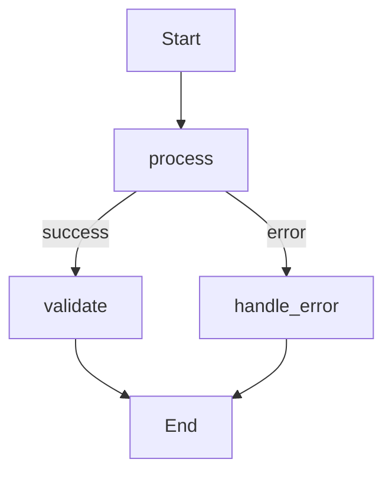

# Epic TEA-RUST-044: Opik Feature Parity for Rust Runtime

## Status

Draft

## Story Files

| Story | File | Status |
|-------|------|--------|
| TEA-RUST-044.1 | [Mermaid Graph Export](./TEA-RUST-044.1.mermaid-graph-export.md) | Draft |
| TEA-RUST-044.2 | [Trace Context Propagation](./TEA-RUST-044.2.trace-context-propagation.md) | Draft |
| TEA-RUST-044.3 | [Experiment Framework](./TEA-RUST-044.3.experiment-framework.md) | Draft |
| TEA-RUST-044.4 | [WASM Demo Graph Visualization](./TEA-RUST-044.4.wasm-demo-graph-visualization.md) | Draft |

## Epic Goal

Bring the Rust implementation of The Edge Agent to feature parity with Python's Opik integration, enabling graph visualization, experiment framework support, and proper trace context propagation for multi-LLM agent workflows.

## Epic Description

### Existing System Context

**Current Rust Opik Implementation (TEA-OBS-002 - Done):**
- `OpikHandler` struct in `rust/src/engine/observability.rs` (lines 654-893)
- REST API integration with fire-and-forget semantics
- Batch event sending with configurable batch size
- YAML configuration parsing for `settings.opik` section
- WASM callback bridge in `rust/tea-wasm-llm/src/opik.rs`
- Auto-registration when `settings.opik` is present in YAML
- Graceful degradation when `OPIK_API_KEY` is missing

**Current Python Opik Implementation (TEA-BUILTIN-005.* - Complete):**
- OpikExporter backend (005.1) - TraceExporter protocol implementation
- Native LLM instrumentation (005.2) - `track_openai` wrapper integration
- Opik configuration layer (005.3) - Environment variable hierarchy
- Experiment framework (005.4) - `run_tea_experiment()`, metrics, datasets
- Mermaid graph visualization (005.5) - `to_mermaid()` method, Opik dashboard integration
- Trace context propagation (005.6) - Parent-child span nesting for multi-LLM agents

**Technology Stack:**
- Rust 1.70+ with tokio async runtime
- wasm-bindgen for WASM builds
- reqwest for HTTP client (native Rust)
- serde for JSON serialization
- networkx-equivalent graph structures via petgraph

**Integration Points:**
- `rust/src/engine/observability.rs` - Handler registry, event dispatch
- `rust/src/graph/visualization.rs` - Graph rendering (needs `to_mermaid()`)
- `rust/src/graph/stategraph.rs` - Graph traversal, node execution
- `rust/tea-wasm-llm/src/lib.rs` - WASM LLM execution entry points
- `rust/tea-wasm-llm/src/opik.rs` - WASM Opik callback bridge

### Enhancement Details

**What's Being Added:**

1. **Mermaid Graph Export** - Add `to_mermaid()` method to StateGraph for workflow visualization in Opik dashboard's "Show Agent Graph" feature

2. **Trace Context Propagation** - Ensure multi-LLM agent workflows properly nest all LLM calls as child spans under the parent trace (matching Python's TEA-BUILTIN-005.6 fix)

3. **Experiment Framework Foundation** - Add basic experiment runner infrastructure that can evaluate agents against datasets and calculate metrics

**How It Integrates:**
- Mermaid export follows existing `render_graphviz()` pattern from Python's `VisualizationMixin`
- Trace context uses Rust's existing async context propagation patterns
- Experiment framework integrates with existing YamlEngine execution infrastructure

**Success Criteria:**
- Rust agents can export Mermaid graphs that appear in Opik's "Show Agent Graph" UI
- Multi-LLM Rust agents have all spans nested under parent trace (no orphan traces)
- Basic experiment evaluation works for simple agents with custom metrics
- WASM demo can display trace timeline with graph visualization

## Architectural Decision: Implementation Approach

### Python Reference Patterns to Port

| Python Feature | Python Location | Rust Target |
|----------------|-----------------|-------------|
| `to_mermaid()` | `visualization.py:VisualizationMixin` | `rust/src/graph/visualization.rs` |
| `get_mermaid_graph()` | `yaml_engine.py:YAMLEngine` | `rust/src/engine/yaml_builder.rs` |
| Context propagation | `parallel_executors.py:ThreadExecutor` | `rust/src/engine/parallel.rs` |
| Wrapper span pattern | `cli.py` | `rust/src/engine/runner.rs` |
| Experiment runner | `experiments/runner.py` | `rust/src/experiments/` (new module) |

### Implementation Priorities

**Phase 1 (Story 44.1):** Mermaid graph export - Immediate visual value in Opik dashboard
**Phase 2 (Story 44.2):** Trace context propagation - Essential for multi-LLM agent debugging
**Phase 3 (Story 44.3):** Experiment framework foundation - Enables systematic agent evaluation

## Stories

### Story 1: Mermaid Graph Export for Rust StateGraph (TEA-RUST-044.1)

**Title:** Add Mermaid Graph Export to Rust StateGraph

**Description:** Implement `to_mermaid()` method for Rust's StateGraph that generates valid Mermaid diagram syntax, matching Python's implementation in `visualization.py`. This enables Opik dashboard's "Show Agent Graph" feature for Rust-executed agents.

**Scope:**
- Add `to_mermaid()` method to graph visualization module
- Handle node rendering with proper escaping
- Handle edge types: simple, conditional (with labels), parallel (with fan-in)
- Add `__start__` and `__end__` special node styling
- Export Mermaid string via `get_mermaid_graph()` from YAML engine
- Integrate with `OpikHandler` to send graph as `_opik_graph_definition` metadata

**Acceptance Criteria:**
1. `StateGraph::to_mermaid()` returns valid Mermaid `graph TD` syntax
2. Conditional edges show condition labels (`A-->|condition|B`)
3. Parallel edges show fan-in target notation
4. Special nodes (`__start__`, `__end__`) have appropriate styling
5. Graph available via `YamlEngine::get_mermaid_graph()`
6. Unit tests verify Mermaid syntax for various graph topologies
7. No new dependencies required (pure string generation)

**Estimated Complexity:** Low-Medium (1-2 days)

**Dependencies:** None

---

### Story 2: Trace Context Propagation for Multi-LLM Rust Agents (TEA-RUST-044.2)

**Title:** Fix Trace Context Loss in Multi-LLM Rust Agent Execution

**Description:** Port Python's trace context propagation fixes (TEA-BUILTIN-005.6) to Rust, ensuring all LLM calls within a single agent execution appear as child spans under the parent Opik trace. This involves proper async context propagation and potentially a wrapper span pattern.

**Scope:**
- Investigate current Rust async context behavior during node execution
- Implement context propagation through `tokio::spawn` boundaries if needed
- Add wrapper span pattern in execution runner to prevent trace popping
- Ensure `OpikHandler` correctly associates spans with parent trace
- Add debug logging for trace context verification

**Acceptance Criteria:**
1. All LLM calls in multi-LLM agents appear nested under parent trace
2. No orphan traces created for secondary LLM calls
3. Trace context remains valid throughout agent execution
4. Debug logging shows consistent trace IDs across LLM calls
5. Fix is backward compatible with single-LLM agents
6. Unit tests verify context propagation through execution boundaries

**Estimated Complexity:** Medium-High (2-3 days)

**Dependencies:** TEA-RUST-044.1 (for testing with graph visualization)

---

### Story 3: Basic Experiment Framework for Rust (TEA-RUST-044.3)

**Title:** Implement Basic Experiment Runner for Rust Agents

**Description:** Create foundational experiment infrastructure for Rust that enables systematic agent evaluation against datasets with custom metrics. This provides a Rust-native path to the same evaluation capabilities as Python's `run_tea_experiment()`.

**Scope:**
- New module: `rust/src/experiments/`
- `run_experiment()` function for YAML agent evaluation
- Dataset loading from JSON fixtures
- `Metric` trait for custom scoring functions
- Built-in metrics: `ExactMatch`, `ContainsMatch`, `NumericTolerance`
- Result aggregation and reporting
- Integration with `OpikHandler` for trace correlation

**Acceptance Criteria:**
1. `run_experiment(agent_yaml, dataset, metrics)` executes evaluation loop
2. Dataset loading from JSON fixtures works
3. Custom `Metric` implementations can be plugged in
4. Results include per-item scores and aggregate statistics
5. Experiments are traced to Opik (if enabled)
6. Graceful handling of evaluation errors (don't crash on single failure)
7. Unit tests cover experiment lifecycle and metric calculation

**Estimated Complexity:** Medium (2-3 days)

**Dependencies:** TEA-RUST-044.1, TEA-RUST-044.2

---

### Story 4: WASM Demo Opik Tab Enhancement (TEA-RUST-044.4)

**Title:** Add Graph Visualization to WASM Demo Opik Tab

**Description:** Enhance the existing WASM demo's Opik tracing tab (from TEA-OBS-002) to display the agent's Mermaid graph alongside the trace timeline. This provides a visual debugging experience matching the Opik dashboard.

**Scope:**
- Add Mermaid rendering to WASM demo using client-side library
- Display graph in Opik tab alongside trace timeline
- Show graph updates as workflow executes
- Style to match Opik dashboard aesthetics
- Handle graphs that fail to generate gracefully

**Acceptance Criteria:**
1. WASM demo Opik tab shows Mermaid graph for executed agent
2. Graph renders correctly for linear, conditional, and parallel workflows
3. Graph styling matches Opik dashboard theme
4. Graceful fallback if graph generation fails
5. Demo loads Mermaid library dynamically (not bundled if not needed)

**Estimated Complexity:** Low (1 day)

**Dependencies:** TEA-RUST-044.1

---

## Compatibility Requirements

- [x] Existing `OpikHandler` REST API integration unchanged
- [x] Existing WASM callback bridge unchanged
- [x] Existing `settings.opik` YAML configuration format unchanged
- [x] Existing event handler registry unchanged
- [x] No breaking changes to graph execution APIs
- [x] Performance impact negligible when features disabled

## Risk Mitigation

**Primary Risk:** Async context propagation in Rust differs significantly from Python's contextvars

**Mitigation:**
- Use `tokio::task_local!` macro for task-local storage
- Consider `tracing` crate's span propagation patterns
- Test thoroughly with various async executor configurations
- Implement wrapper span as fallback if native propagation is complex

**Rollback Plan:**
1. Mermaid export is additive - simply don't call `to_mermaid()` if issues
2. Context propagation changes isolated to execution runner
3. Experiment framework in separate module - can be disabled entirely
4. WASM demo enhancements don't affect core functionality

## Definition of Done

- [ ] Story 44.1 (Mermaid export) completed with all ACs met
- [ ] Story 44.2 (Context propagation) completed with all ACs met
- [ ] Story 44.3 (Experiment framework) completed with all ACs met
- [ ] Story 44.4 (WASM demo enhancement) completed with all ACs met
- [ ] All existing Rust tests pass (no regressions)
- [ ] New unit tests added for each feature
- [ ] WASM build successful with new features
- [ ] Documentation updated (Rust development guide, YAML reference)
- [ ] Cross-runtime parity verified: same YAML produces equivalent Opik output in Python and Rust

## Technical Notes

### Mermaid Syntax Reference (from Python)



**Key Syntax Elements:**
- `graph TD` - Top-down directed graph
- `A-->B` - Simple edge
- `A-->|label|B` - Labeled edge
- `A[Label]` - Node with display label
- `A((Label))` - Circle node (for start/end)

### Rust Async Context Patterns

```rust
// Option 1: tokio task_local
tokio::task_local! {
    static TRACE_CONTEXT: RefCell<Option<TraceContext>>;
}

// Option 2: tracing crate integration
#[instrument(fields(trace_id = %trace_id))]
async fn execute_node(&self, node: &Node) -> Result<State, Error> {
    // ...
}
```

### Opik Trace Metadata Format

```rust
// Graph sent as _opik_graph_definition metadata
let metadata = serde_json::json!({
    "_opik_graph_definition": {
        "format": "mermaid",
        "data": mermaid_string
    }
});
```

## Story Manager Handoff

Please develop detailed user stories for this brownfield epic. Key considerations:

- This is an enhancement to an existing Rust system with tokio async runtime
- Integration points: `observability.rs`, `stategraph.rs`, `yaml_builder.rs`
- Existing patterns to follow: Python's `visualization.py`, `experiments/runner.py`
- Critical compatibility requirements: Existing Opik REST API integration must remain unchanged
- Each story must include verification that existing observability functionality remains intact

The epic should maintain system integrity while delivering Python-Rust Opik feature parity.

## Change Log

| Date | Version | Description | Author |
|------|---------|-------------|--------|
| 2026-01-13 | 0.1 | Initial epic draft based on Python implementation analysis | Sarah (PO Agent) |

