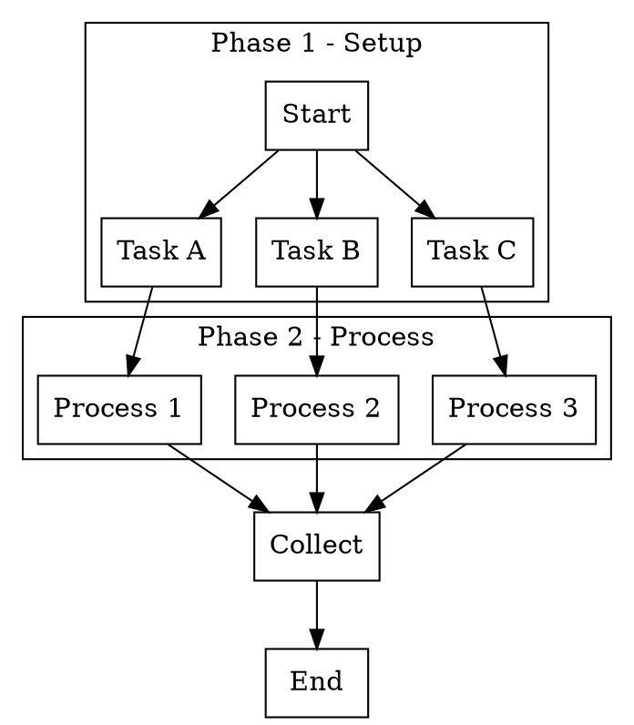

# Story TEA-TOOLS-001: DOT-to-YAML Agent Generator

## Status

**Completed**

## Story Context

### Existing System Integration

- **Integrates with:** Existing `tea` CLI (`python/src/the_edge_agent/cli.py`)
- **Technology:** Typer nested subcommand (`tea from dot`)
- **Follows pattern:** `tea schema merge` nested command structure, `tea inspect --format dot`
- **Touch points:**
  - Modify `python/src/the_edge_agent/cli.py` - Add `from` subcommand group
  - New file `python/src/the_edge_agent/dot_parser.py` - Parser module
  - New directory `examples/dot/` - Example DOT inputs
  - Updates to `docs/guides/` - Documentation references

### Current State

The project has:
- `tea` CLI with subcommands: `run`, `resume`, `validate`, `inspect`, `schema`
- `tea inspect --format dot` outputs DOT format (symmetry with input)
- `dynamic_parallel` node type for parallel execution
- `fan_in: true` pattern for collecting parallel results
- No automated way to generate YAML from visual workflow diagrams

### Scope Clarification

**In Scope:**
- DOT/Graphviz syntax parsing (nodes, edges, subgraphs)
- YAML generation with `dynamic_parallel` + `fan_in` patterns
- Integration as `tea from dot` subcommand
- Optional tmux window pattern for subprocess execution

**Out of Scope (Future Enhancements):**
- Other converters (`tea from mermaid`, `tea from plantuml`)
- Visual editor integration
- Per-node command attributes (see **TEA-TOOLS-002**)

## Story

**As a** TEA workflow developer,
**I want** a CLI command that converts DOT/Graphviz diagrams into TEA YAML agent definitions with parallel execution,
**so that** I can visually design complex parallel workflows and automatically generate the corresponding TEA agent configuration.

## Acceptance Criteria

1. **DOT Parsing**: Script parses DOT/Graphviz syntax including:
   - Nodes: `A [label="Label"]`, `B [shape=circle]`
   - Edges: `A -> B`, `A -> B [label="condition"]`
   - Subgraphs: `subgraph cluster_Phase1 { ... }` for phase grouping
   - Uses `pydot` library for robust parsing

2. **Subgraph-to-Phase Mapping**: Subgraphs (clusters) in DOT are converted to sequential phases:
   - Each `subgraph cluster_*` becomes a `dynamic_parallel` node with `fan_in`
   - Phase 1 completes before Phase 2 starts
   - Nodes within a subgraph execute in parallel

3. **Command Template**: Generated YAML includes configurable command execution:
   - Command template accepts `{{ item }}` placeholder (uses node label)
   - Default: Uses `subprocess.run()` with `executable='/bin/bash'`
   - Optional `--tmux`: Generates tmux window pattern for visual monitoring

4. **Fan-Out/Fan-In Structure**: Generated YAML correctly implements:
   - `dynamic_parallel` nodes with `items`, `item_var`, `max_concurrency`
   - `fan_in: true` collector nodes for each parallel phase
   - Proper edge definitions from source to parallel and fan_in to next phase

5. **CLI Interface**: Integrated as `tea from dot` subcommand:
   - `tea from dot input.dot` - Positional argument for input file
   - `--output/-o`: Output YAML path (default: stdout)
   - `--command/-c`: Command template to execute per item (required)
   - `--max-concurrency/-m`: Max parallel executions (default: 3)
   - `--name/-n`: Workflow name (default: derived from graph name or filename)
   - `--tmux`: Generate tmux-based execution (optional, default: subprocess)
   - `--session/-s`: Tmux session name (only with `--tmux`)
   - `--validate`: Validate generated YAML before output

6. **Output Format**: Generates valid TEA YAML that:
   - Passes `tea validate` without errors
   - Follows patterns from `parallel-workflow-orchestration.md`
   - Includes descriptive comments for each generated section

7. **Error Handling**: Script provides clear error messages for:
   - Invalid DOT syntax (pydot parse errors)
   - Missing required edges (no path to end)
   - Circular dependencies within phases

## Tasks / Subtasks

- [x] **Task 1: DOT Parser Module** (AC: 1, 7)
  - [x] Create `python/src/the_edge_agent/dot_parser.py`
  - [x] Add `pydot` to dependencies in `setup.py`
  - [x] Implement `parse_dot(file_path)` using pydot
  - [x] Extract node definitions (id, label, shape)
  - [x] Extract edge definitions (source, target, label)
  - [x] Extract subgraph clusters (name, contained nodes)
  - [x] Add validation for circular dependencies

- [x] **Task 2: Graph Analysis** (AC: 2, 4)
  - [x] Build internal graph representation from pydot graph
  - [x] Detect parallel branches (nodes with same source)
  - [x] Group nodes by cluster subgraph for phase detection
  - [x] Identify fan-out points (single node to multiple targets)
  - [x] Identify fan-in points (multiple sources to single target)
  - [x] Determine phase ordering from subgraph dependencies

- [x] **Task 3: YAML Generator** (AC: 3, 4, 6)
  - [x] Create `generate_yaml()` function in `dot_parser.py`
  - [x] Generate `dynamic_parallel` nodes for each parallel group
  - [x] Generate `fan_in: true` nodes for result collection
  - [x] Generate subprocess execution steps with command template
  - [x] Optional: Generate tmux-based execution when `--tmux` flag
  - [x] Generate proper `edges` section respecting phase order

- [x] **Task 4: CLI Integration** (AC: 5)
  - [x] Add `from_app = typer.Typer()` in `cli.py`
  - [x] Register with `app.add_typer(from_app, name="from")`
  - [x] Implement `@from_app.command("dot")` subcommand
  - [x] Add positional `file` argument for input
  - [x] Add `--output/-o`, `--command/-c`, `--max-concurrency/-m` options
  - [x] Add `--name/-n`, `--tmux`, `--session/-s`, `--validate` options
  - [x] Wire up to `dot_parser.generate_yaml()`

- [x] **Task 5: Testing** (AC: 1-7)
  - [x] Create `python/tests/test_dot_parser.py`
  - [x] Unit tests for parser (nodes, edges, subgraphs)
  - [x] Unit tests for YAML generator
  - [x] Integration tests for CLI command
  - [x] Validate generated YAML with `tea validate`
  - [x] Create example DOT files in `examples/dot/`

- [x] **Task 6: Documentation** (AC: 6)
  - [x] Add docstrings to `dot_parser.py`
  - [x] Update CLI help with usage examples
  - [ ] Update `running-workflows-tmux.md` to reference `tea from dot`
  - [x] Add example DOT files under `examples/dot/`

## Dev Notes

### Relevant Source Files

| File | Purpose |
|------|---------|
| `python/src/the_edge_agent/cli.py` | **Modify**: Add `from` subcommand group |
| `python/src/the_edge_agent/dot_parser.py` | **New**: Parser and generator module |
| `docs/guides/parallel-workflow-orchestration.md` | Reference patterns for dynamic_parallel, fan_in |
| `docs/guides/running-workflows-tmux.md` | Tmux execution patterns (optional mode) |
| `examples/yaml/dynamic_parallel_steps_mode.yaml` | Example parallel YAML structure |

### DOT Syntax Reference



### Expected YAML Output Pattern

```yaml
name: generated-workflow
description: Generated from Mermaid diagram

nodes:
  - name: setup
    run: |
      return {"phase1_items": ["Task A", "Task B", "Task C"]}

  - name: phase1_parallel
    type: dynamic_parallel
    items: "{{ state.phase1_items }}"
    item_var: task
    max_concurrency: 3
    fan_in: phase1_collect
    steps:
      - name: execute
        run: |
          import subprocess
          task = state.get("task")
          cmd = f"<USER_COMMAND_TEMPLATE>"
          result = subprocess.run(cmd, shell=True, capture_output=True,
                                  text=True, executable='/bin/bash')
          return {"task": task, "success": result.returncode == 0}
    output: phase1_results

  - name: phase1_collect
    fan_in: true
    run: |
      results = state.get("phase1_results", [])
      return {"phase1_complete": True}

  # ... Phase 2 follows same pattern ...

edges:
  - from: __start__
    to: setup
  - from: setup
    to: phase1_parallel
  - from: phase1_collect
    to: phase2_parallel
  # ...
```

### Key Implementation Notes

1. **Subprocess Pattern**: Always use `executable='/bin/bash'` when commands include `source`
2. **JSON Escaping**: Build JSON strings in Python, not in YAML templates
3. **Result Handling**: Extract data from `ParallelFlowResult` objects before returning to state
4. **Phase Ordering**: Ensure fan_in of Phase N connects to start of Phase N+1

### Testing

| Location | Pattern |
|----------|---------|
| `python/tests/test_dot_parser.py` | Unit and integration tests |
| `examples/dot/*.dot` | Test DOT input files |

**Test Framework**: pytest
**Validation**: Generated YAML must pass `tea validate <file>`
**Dependency**: `pydot` (add to setup.py extras or core deps)

### Example Usage

```bash
# Basic: Generate YAML from DOT with subprocess execution
tea from dot workflow.dot -c "tea run sub-workflow.yaml --input '{{ item }}'" -o output.yaml

# With tmux for visual monitoring (optional)
tea from dot workflow.dot -c "tea run sub-workflow.yaml" --tmux -s my-session -o output.yaml

# Validate before output
tea from dot workflow.dot -c "echo {{ item }}" --validate

# Pipe to stdout
tea from dot workflow.dot -c "process {{ item }}" | tea validate -

# Round-trip: inspect existing YAML as DOT, modify, regenerate
tea inspect existing.yaml --format dot > workflow.dot
# Edit workflow.dot visually...
tea from dot workflow.dot -c "tea run task.yaml" -o new-workflow.yaml
```

## Definition of Done

- [x] `tea from dot` subcommand works
- [x] `python/src/the_edge_agent/dot_parser.py` exists
- [x] `pydot` added to dependencies
- [x] Parses DOT with nodes, edges, cluster subgraphs
- [x] Generates valid TEA YAML with `dynamic_parallel` + `fan_in`
- [x] Cluster subgraphs converted to sequential phases
- [x] All CLI flags work: `-o`, `-c`, `-m`, `-n`, `--tmux`, `--validate`
- [x] Generated YAML passes `tea validate`
- [x] Unit tests in `python/tests/test_dot_parser.py`
- [x] Example DOT files in `examples/dot/`
- [x] `tea from --help` shows usage examples

## Risk and Compatibility Check

### Minimal Risk Assessment

**Primary Risk:** DOT syntax variations or complex graphs may produce unexpected YAML

**Mitigation:**
- Use `pydot` library for robust parsing (well-tested)
- Clear error messages for unsupported patterns
- Document supported DOT patterns (clusters, basic edges)
- Round-trip with `tea inspect --format dot` for validation

**Rollback:** Remove `from_app` registration from `cli.py` and delete `dot_parser.py`

### Compatibility Verification

- [x] No breaking changes to existing CLI commands
- [x] No breaking changes to existing YAML Engine
- [x] Generated YAML follows existing patterns
- [x] Works with current `tea run` command
- [x] New dependency `pydot` is well-maintained and lightweight

## Validation Checklist

### Scope Validation

- [x] Story can be completed in one development session (~4-6 hours)
- [x] Integration approach is straightforward (standalone script)
- [x] Follows existing patterns (Typer CLI, YAML structure)
- [x] Clear test cases from acceptance criteria

### Clarity Check

- [x] Story requirements are unambiguous
- [x] Input/output formats clearly specified
- [x] Success criteria are testable
- [x] Rollback approach is simple

## Change Log

| Date | Version | Description | Author |
|------|---------|-------------|--------|
| 2026-01-06 | 0.1 | Initial draft (Mermaid) | Sarah (PO) |
| 2026-01-06 | 0.2 | Changed to DOT/Graphviz, integrated into tea CLI | Sarah (PO) |
| 2026-01-06 | 1.0 | **Approved** | Sarah (PO) |
| 2026-01-06 | 1.1 | **Completed** - Implementation verified, DoD checked | Sarah (PO) |
| 2026-01-06 | 1.2 | Added reference to TEA-TOOLS-002 (per-node commands extension) | James (Dev) |

## Dev Agent Record

### Agent Model Used

Claude Opus 4.5 (claude-opus-4-5-20251101)

### Debug Log References

- All 20 unit tests pass: `pytest tests/test_dot_parser.py -v` (1.54s)
- CLI integration verified: `tea from dot --help` displays all options
- YAML validation confirmed: `tea from dot examples/dot/parallel-phases.dot -c "echo {{ item }}" --validate`

### Completion Notes List

1. **Parser Implementation**: Created comprehensive DOT parser using `pydot` library with support for:
   - Node extraction (id, label, shape, attributes)
   - Edge extraction (source, target, label, attributes)
   - Cluster subgraph detection and phase mapping
   - Circular dependency validation via DFS

2. **Graph Analysis**: Implemented `analyze_graph()` function that:
   - Detects fan-out/fan-in patterns automatically
   - Handles both explicit clusters and implicit parallel branches
   - Maps cluster subgraphs to sequential phases

3. **YAML Generator**: Created `generate_yaml()` with:
   - `dynamic_parallel` node generation with configurable `max_concurrency`
   - `fan_in: true` collector nodes for each phase
   - Subprocess execution (default) with `/bin/bash` and 300s timeout
   - Optional tmux window-based execution for visual monitoring
   - Header comments documenting source and configuration

4. **CLI Integration**: Added `tea from dot` as nested Typer subcommand with:
   - All required flags: `-o`, `-c`, `-m`, `-n`, `--tmux`, `-s`, `--validate`
   - Comprehensive help with 4 usage examples
   - Proper error handling for missing files and invalid DOT

5. **Testing**: Created 20 tests covering:
   - DOT parsing (nodes, edges, clusters, shapes, labels)
   - Graph analysis (phases, start/end detection, cycles)
   - YAML generation (subprocess, tmux, custom names)
   - Integration tests with example DOT files

6. **Minor Gap**: Documentation update to `running-workflows-tmux.md` not completed (marked as unchecked in Task 6)

### File List

| File | Action | Lines |
|------|--------|-------|
| `python/src/the_edge_agent/dot_parser.py` | **Created** | 868 |
| `python/src/the_edge_agent/cli.py` | **Modified** | +50 (lines 1063-1112) |
| `python/setup.py` | **Modified** | +1 (line 41: pydot>=2.0.0) |
| `python/tests/test_dot_parser.py` | **Created** | 432 |
| `examples/dot/parallel-phases.dot` | **Created** | ~30 |
| `examples/dot/simple-parallel.dot` | **Created** | ~20 |
| `examples/dot/linear.dot` | **Created** | ~15 |

## QA Results

_To be filled by QA agent_
