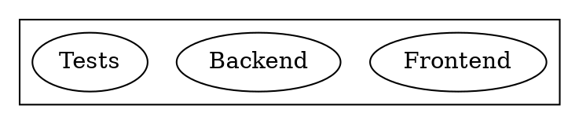
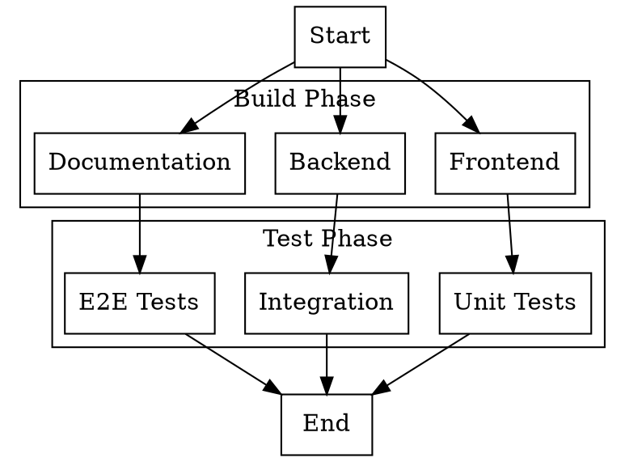

# Story TEA-TOOLS-002: Per-Node Command Attributes

## Status

**Ready for Review**

## Story Context

### Existing System Integration

- **Extends:** TEA-TOOLS-001 (`tea from dot` command)
- **Modifies:** `python/src/the_edge_agent/dot_parser.py`
- **Touch points:**
  - Modify DOT parser to extract `command` attribute
  - Modify YAML generator to support per-item commands
  - Update CLI to support `--use-node-commands` flag
  - Add example DOT files demonstrating per-node commands

### Current State

TEA-TOOLS-001 implemented `tea from dot` with a **single command template** applied uniformly to all nodes:

```bash
tea from dot workflow.dot -c "echo {{ item }}"
```

This works for **homogeneous** parallel tasks (same operation, different data) but fails for **heterogeneous** workflows where each node needs a different command.

### Problem Statement

Users designing workflows in DOT/Graphviz want to specify different commands for different nodes:



Currently, there's no way to express this. Users must either:
- Use node labels as commands (loses descriptive names)
- Write a dispatcher script (extra complexity)
- Write YAML manually (defeats purpose of generator)

### Scope Clarification

**In Scope:**
- Parse `command` attribute from DOT nodes
- Generate YAML with per-item command dispatch
- **Two mutually exclusive modes**: `--command` template mode OR `--use-node-commands` mode
- Backward compatible with TEA-TOOLS-001 behavior (when using `--command`)

**Out of Scope:**
- Per-node environment variables
- Per-node timeout configuration
- Complex command interpolation beyond `{{ item }}`
- Mixed mode (some nodes with commands, some without) - removed for clarity

## Story

**As a** TEA workflow developer,
**I want** to specify different commands for each node in my DOT diagram using a `command` attribute,
**so that** I can generate YAML workflows with heterogeneous parallel tasks without writing a dispatcher script.

## Acceptance Criteria

1. **Command Attribute Parsing**: DOT parser extracts `command` attribute from nodes:
   ```dot
   A [label="Build Frontend", command="npm run build"];
   B [label="Build Backend", command="cargo build"];
   ```

2. **Per-Node YAML Generation**: Generated YAML executes the node-specific command:
   - Each item in `dynamic_parallel` uses its own command
   - Node label is still available as `{{ item }}` for logging/identification
   - Command can reference `{{ item }}` for the label if needed

3. **Strict Validation**: When using `--use-node-commands`:
   - ALL nodes MUST have `command` attribute (except Start/End markers with ellipse/circle shape)
   - Error clearly lists missing nodes if any lack commands
   - No fallback to `--command` template (mutually exclusive modes)

4. **CLI Flag**: New `--use-node-commands` flag enables per-node mode:
   ```bash
   tea from dot workflow.dot --use-node-commands -o output.yaml
   # Note: --command and --use-node-commands are mutually exclusive
   ```

5. **Backward Compatibility**: Without `--use-node-commands`, behavior matches TEA-TOOLS-001 exactly.

6. **Mutually Exclusive Modes**: Clear separation of concerns:
   - **Template mode** (`--command`): All nodes use same command template with `{{ item }}`
   - **Per-node mode** (`--use-node-commands`): Each node has its own `command` attribute

7. **Generated YAML Structure**: Output uses command dispatch pattern:
   ```yaml
   steps:
     - name: execute
       run: |
         item = state.get("item", "")
         commands = state.get("_commands", {})
         cmd = commands.get(item, "{{ fallback_command }}")
         # ... execute cmd
   ```

## Tasks / Subtasks

- [x] **Task 1: Parser Enhancement** (AC: 1)
  - [x] Modify `_extract_attributes()` to capture `command` attribute
  - [x] Add `command: Optional[str]` field to `DotNode` dataclass
  - [x] Store command in node during `parse_dot_string()`
  - [x] Add unit tests for command attribute extraction

- [x] **Task 2: AnalyzedGraph Enhancement** (AC: 2, 6)
  - [x] Add `node_commands: Dict[str, str]` to `AnalyzedGraph`
  - [x] Populate node_commands mapping (label -> command)
  - [x] Handle nodes without command attribute (None values)
  - [x] Add unit tests for command mapping

- [x] **Task 3: YAML Generator Enhancement** (AC: 2, 7)
  - [x] Add `use_node_commands: bool` parameter to `generate_yaml()`
  - [x] Create `_generate_dispatch_execution_code()` function
  - [x] Generate setup node that populates `_commands` dict in state
  - [x] Modify parallel node execution to lookup command per item
  - [x] Add unit tests for dispatch code generation

- [x] **Task 4: CLI Enhancement** (AC: 4, 5)
  - [x] Add `--use-node-commands` flag to `from_app.command("dot")`
  - [x] Pass flag to `dot_to_yaml()` function
  - [x] Validate: error if `--use-node-commands` without any commands
  - [x] Update help text with examples

- [x] **Task 5: Strict Validation** (AC: 3, 6)
  - [x] Validate ALL nodes have `command` attribute when using `--use-node-commands`
  - [x] Exclude Start/End markers (ellipse/circle shapes) from command requirement
  - [x] Clear error message listing nodes missing commands
  - [x] Add unit tests for validation scenarios

- [x] **Task 6: Examples & Documentation** (AC: 1-7)
  - [x] Create `examples/dot/per-node-commands.dot` (heterogeneous-commands)
  - [x] Create `examples/dot/mixed-commands.dot`
  - [x] Create `docs/shared/DOT_TO_YAML_LLM_REFERENCE.md` (LLM guide)
  - [x] Add docstrings to new functions

## Dev Notes

### Relevant Source Files

| File | Purpose |
|------|---------|
| `python/src/the_edge_agent/dot_parser.py` | **Modify**: Add command attribute support |
| `python/src/the_edge_agent/cli.py` | **Modify**: Add `--use-node-commands` flag |
| `python/tests/test_dot_parser.py` | **Modify**: Add tests for new functionality |
| `docs/stories/TEA-TOOLS-001.dot-to-yaml-generator.md` | Reference implementation |

### DOT Syntax for Command Attribute



### Expected Generated YAML Pattern

```yaml
name: heterogeneous-build

nodes:
  - name: setup
    run: |
      # Initialize items and command mapping
      state["build_items"] = ["Frontend", "Backend", "Documentation"]
      state["_build_commands"] = {
          "Frontend": "cd frontend && npm run build",
          "Backend": "cd backend && cargo build --release",
          "Documentation": "mkdocs build"
      }
      return state

  - name: build_parallel
    type: dynamic_parallel
    items: "{{ state.build_items }}"
    item_var: item
    max_concurrency: 3
    fan_in: build_collect
    steps:
      - name: execute
        run: |
          import subprocess

          item = state.get("item", "")
          commands = state.get("_build_commands", {})
          cmd = commands.get(item)

          if not cmd:
              return {"item": item, "success": False, "error": "No command defined"}

          try:
              result = subprocess.run(
                  cmd,
                  shell=True,
                  capture_output=True,
                  text=True,
                  executable='/bin/bash',
                  timeout=300
              )
              return {
                  "item": item,
                  "success": result.returncode == 0,
                  "stdout": result.stdout,
                  "stderr": result.stderr
              }
          except Exception as e:
              return {"item": item, "success": False, "error": str(e)}
    output: build_results

  - name: build_collect
    fan_in: true
    run: |
      results = state.get("build_results", [])
      success_count = sum(1 for r in results if r.get("success", False))
      state["build_complete"] = True
      state["build_success_count"] = success_count
      return state

# ... similar for test phase ...
```

### Key Implementation Notes

1. **Command Storage**: Store commands in state as `_<phase>_commands` dict to avoid pollution
2. **Label as Key**: Use node label (not id) as command lookup key for user clarity
3. **Mutually Exclusive Modes**: `--command` and `--use-node-commands` cannot be used together
4. **Strict Validation**: ALL nodes must have `command` attribute when using `--use-node-commands`
5. **Shape Exclusion**: Nodes with shapes `ellipse`, `circle`, `point`, `doublecircle` (Start/End markers) are excluded from command requirement
6. **Quoting**: Commands may contain quotes; use proper escaping in generated YAML

### Testing

| Location | Pattern |
|----------|---------|
| `python/tests/test_dot_parser.py` | Unit tests for parser changes |
| `examples/dot/per-node-commands.dot` | Example with per-node commands (build pipeline) |
| `examples/dot/mixed-commands.dot` | Example with all nodes having commands (validation pipeline) |

**Test Scenarios:**
1. All nodes have `command` attribute (`--use-node-commands` mode)
2. No per-node commands (`--command` template mode - TEA-TOOLS-001 behavior)
3. `--use-node-commands` with missing commands (error case)
4. `--use-node-commands` AND `--command` both specified (error case)
5. Start/End marker nodes (ellipse shape) excluded from command requirement
6. Commands with special characters (quotes, pipes, etc.)

## Definition of Done

- [x] `command` attribute extracted from DOT nodes
- [x] `--use-node-commands` CLI flag works
- [x] Per-node command dispatch in generated YAML
- [x] Mutually exclusive: `--command` and `--use-node-commands` cannot be combined
- [x] Strict validation: ALL nodes must have `command` attribute (except Start/End markers)
- [x] Backward compatible (without `--use-node-commands`, TEA-TOOLS-001 behavior unchanged)
- [x] Unit tests for all new functionality
- [x] Example DOT files in `examples/dot/`
- [x] CLI help updated with new flag examples

## Risk and Compatibility Check

### Minimal Risk Assessment

**Primary Risk:** Generated dispatch code adds complexity vs. uniform template

**Mitigation:**
- Keep dispatch pattern simple (dict lookup)
- Preserve backward compatibility behind flag
- Clear error messages for missing commands

**Rollback:** Remove `--use-node-commands` flag and revert parser changes

### Compatibility Verification

- [x] Without `--use-node-commands`, behavior identical to TEA-TOOLS-001
- [x] Generated YAML passes `tea validate`
- [x] Works with existing `--tmux` and `--validate` flags
- [x] No breaking changes to existing DOT files

## Change Log

| Date | Version | Description | Author |
|------|---------|-------------|--------|
| 2026-01-06 | 0.1 | Initial draft | Sarah (PO) |
| 2026-01-06 | 1.0 | **Approved** - Validation passed (8/10 readiness) | Sarah (PO) |
| 2026-01-06 | 1.1 | **Implementation Complete** - All tasks done, 34 tests pass | James (Dev) |
| 2026-01-06 | 1.2 | **Simplified** - Removed fallback logic, mutually exclusive modes | James (Dev) |

## Dev Agent Record

### Agent Model Used

Claude Opus 4.5 (claude-opus-4-5-20251101)

### Debug Log References

- All 34 tests in `test_dot_parser.py` pass
- CLI `tea from dot --help` correctly shows `--use-node-commands` flag

### Completion Notes List

1. Added `command: Optional[str]` attribute to `DotNode` dataclass
2. Created `_get_command_attr()` helper function for command extraction
3. Added `node_commands: Dict[str, str]` to `AnalyzedGraph` (label -> command mapping)
4. Created dispatch execution code generators:
   - `_generate_dispatch_subprocess_execution_code()`
   - `_generate_dispatch_tmux_execution_code()`
5. Updated `generate_yaml()` to support `use_node_commands` parameter
6. Updated `dot_to_yaml()` to support `use_node_commands` parameter
7. Added `--use-node-commands` CLI flag to `tea from dot` command
8. Created example DOT files demonstrating per-node commands
9. Created LLM reference guide for DOT file generation
10. **v1.2 Simplification**: Made `--command` and `--use-node-commands` mutually exclusive
11. **v1.2 Strict validation**: ALL nodes must have `command` attribute (except Start/End markers with ellipse/circle/point/doublecircle shapes)

### File List

**Modified:**
- `python/src/the_edge_agent/dot_parser.py` - Parser, analyzer, generator with per-node command support
- `python/src/the_edge_agent/cli.py` - CLI with `--use-node-commands` flag
- `python/tests/test_dot_parser.py` - 34 tests including 15 new tests for TEA-TOOLS-002

**Created:**
- `examples/dot/per-node-commands.dot` - Build pipeline with heterogeneous per-node commands
- `examples/dot/mixed-commands.dot` - Validation pipeline with all nodes having commands
- `docs/shared/DOT_TO_YAML_LLM_REFERENCE.md` - LLM guide for DOT file generation

## QA Results

_To be filled by QA agent_
