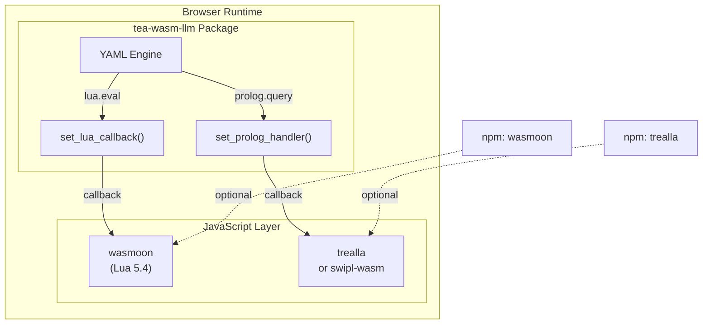

# Story TEA-WASM-002: Lua and Prolog JS Bridge Callbacks

## Status

Draft

## Story

**As a** developer building browser-based TEA workflows with advanced scripting,
**I want** Lua and Prolog runtime support via JavaScript bridges,
**So that** I can use `lua.eval` and `prolog.query` actions in WASM workflows just like in native TEA.

## Story Context

**Existing System Integration:**

- Integrates with: TEA-RELEASE-004.3d (WASM Bundled LLM), TEA-WASM-001 (Feasibility Spike)
- Technology: Rust WASM + wasm-bindgen + wasmoon (Lua) + trealla/swipl-wasm (Prolog)
- Pattern: JS callback bridge (same as LLM integration)
- Touch points: `rust/tea-wasm-llm/`, JS wrapper layer, YAML engine

**Dependencies:**
- TEA-RELEASE-004.3d (Done) - provides WASM LLM infrastructure with callback pattern
- TEA-WASM-001 (Done) - spike validated JS bridge approach

## Problem Statement

### Current State

The WASM package supports LLM inference via wllama, but lacks Lua and Prolog runtimes. Native TEA supports:

```yaml
nodes:
  - name: validate
    action: lua.eval
    with:
      code: |
        return state.value > 0 and state.value < 100
```

This fails in WASM because `mlua` (Lua) and `swipl` (Prolog) crates require native C bindings.

### Spike Findings (TEA-WASM-001)

The feasibility spike confirmed that JS bridges work for scripting runtimes:

| Runtime | WASM Solution | Bundle Size | Notes |
|---------|---------------|-------------|-------|
| Lua | [wasmoon](https://github.com/ceifa/wasmoon) | ~200KB | Full Lua 5.4, maintained |
| Prolog | [trealla](https://github.com/trealla-prolog/trealla) | ~500KB | Lightweight, fast |
| Prolog | [swipl-wasm](https://npmjs.com/package/swipl-wasm) | ~5-10MB | Full SWI-Prolog, CLP(FD) |

### Target Architecture



**Usage (with Lua):**
```javascript
import { LuaFactory } from 'wasmoon';
import { initTeaLlm, set_lua_callback, executeLlmYaml } from 'tea-wasm-llm';

// Initialize Lua engine
const lua = await (new LuaFactory()).createEngine();

// Register Lua handler
set_lua_callback(async (code, stateJson) => {
    const state = JSON.parse(stateJson);
    lua.global.set('state', state);
    const result = await lua.doString(code);
    return JSON.stringify({ result });
});

// Now lua.eval works in YAML workflows
await executeLlmYaml(yamlContent, initialState);
```

**Usage (with Prolog):**
```javascript
import { Prolog } from 'trealla';
import { set_prolog_handler } from 'tea-wasm-llm';

const pl = new Prolog();

set_prolog_handler(async (queryJson) => {
    const { code, facts } = JSON.parse(queryJson);
    if (facts) await pl.consultText(facts);
    const results = await pl.queryOnce(code);
    return JSON.stringify(results);
});
```

## Acceptance Criteria

### Lua Integration

1. **AC-1**: Export `set_lua_callback(handler: Function)` from tea-wasm-llm
2. **AC-2**: `lua.eval` action invokes the registered callback
3. **AC-3**: Callback receives `(code: string, stateJson: string)` parameters
4. **AC-4**: Result from callback is merged into workflow state
5. **AC-5**: Clear error if `lua.eval` called without registered callback

### Prolog Integration

6. **AC-6**: Export `set_prolog_handler(handler: Function)` from tea-wasm-llm
7. **AC-7**: `prolog.query` action invokes the registered handler
8. **AC-8**: Handler receives `(queryJson: string)` with code and optional facts
9. **AC-9**: Query results are returned as JSON array of bindings
10. **AC-10**: Clear error if `prolog.query` called without registered handler

### API Design

11. **AC-11**: Both callbacks are optional (package works without them)
12. **AC-12**: Type declarations (.d.ts) include callback signatures
13. **AC-13**: README documents wasmoon and trealla integration examples

### Testing

14. **AC-14**: Unit test for Lua callback invocation
15. **AC-15**: Unit test for Prolog handler invocation
16. **AC-16**: Integration test with real wasmoon in Playwright
17. **AC-17**: Integration test with real trealla in Playwright

## Technical Design

### Rust WASM Exports

```rust
// rust/tea-wasm-llm/src/lib.rs

static LUA_CALLBACK: Mutex<Option<js_sys::Function>> = Mutex::new(None);
static PROLOG_HANDLER: Mutex<Option<js_sys::Function>> = Mutex::new(None);

#[wasm_bindgen]
pub fn set_lua_callback(callback: js_sys::Function) {
    *LUA_CALLBACK.lock().unwrap() = Some(callback);
}

#[wasm_bindgen]
pub fn set_prolog_handler(handler: js_sys::Function) {
    *PROLOG_HANDLER.lock().unwrap() = Some(handler);
}

#[wasm_bindgen]
pub fn clear_lua_callback() {
    *LUA_CALLBACK.lock().unwrap() = None;
}

#[wasm_bindgen]
pub fn clear_prolog_handler() {
    *PROLOG_HANDLER.lock().unwrap() = None;
}
```

### YAML Engine Integration

The YAML engine needs to detect `lua.eval` and `prolog.query` actions and route to callbacks:

```rust
async fn execute_action(action: &str, params: &Value, state: &Value) -> Result<Value> {
    match action {
        "lua.eval" => call_lua_callback(params, state).await,
        "prolog.query" => call_prolog_handler(params, state).await,
        "llm.call" => call_llm_handler(params, state).await,
        _ => Err(anyhow!("Unknown action: {}", action)),
    }
}
```

### TypeScript Declarations

```typescript
// js/index.d.ts

export type LuaCallback = (code: string, stateJson: string) => Promise<string>;
export type PrologHandler = (queryJson: string) => Promise<string>;

export function set_lua_callback(callback: LuaCallback): void;
export function set_prolog_handler(handler: PrologHandler): void;
export function clear_lua_callback(): void;
export function clear_prolog_handler(): void;
```

## Tasks

### Task 1: Rust Callback Infrastructure
- [ ] Add `set_lua_callback` and `clear_lua_callback` exports
- [ ] Add `set_prolog_handler` and `clear_prolog_handler` exports
- [ ] Implement async invocation pattern (same as LLM handler)

### Task 2: YAML Engine Integration
- [ ] Detect `lua.eval` action in YAML engine
- [ ] Detect `prolog.query` action in YAML engine
- [ ] Route to appropriate callbacks with proper error handling

### Task 3: TypeScript Layer
- [ ] Add type declarations for callbacks
- [ ] Export functions from `js/index.ts`
- [ ] Document callback signatures

### Task 4: Documentation
- [ ] Update README with Lua integration example
- [ ] Update README with Prolog integration example
- [ ] Add example YAML workflow using both

### Task 5: Testing
- [ ] Unit tests for callback registration/clearing
- [ ] Playwright test with wasmoon
- [ ] Playwright test with trealla

## Definition of Done

- [ ] All acceptance criteria pass
- [ ] TypeScript declarations are complete
- [ ] Playwright tests pass in CI
- [ ] README documents usage with examples
- [ ] No regressions in existing LLM functionality

## Out of Scope

1. **Bundling wasmoon/trealla** - These remain optional npm dependencies
2. **Native Lua/Prolog in WASM** - We use JS bridges, not native WASM compilation
3. **Full Prolog CLP(FD)** - Trealla is recommended for size; swipl-wasm is optional

## Open Questions

1. Should we provide a "batteries included" variant that bundles wasmoon/trealla?
2. Should Prolog facts be persistable to IndexedDB?
3. Should we support streaming results for large Prolog queries?

## References

- [wasmoon - Lua 5.4 in WASM](https://github.com/ceifa/wasmoon)
- [trealla - Lightweight Prolog](https://github.com/trealla-prolog/trealla)
- [swipl-wasm - Full SWI-Prolog](https://www.npmjs.com/package/swipl-wasm)
- [TEA-WASM-001 Feasibility Spike](./TEA-WASM-001.wasm-feasibility-spike.md)
- [WASM Feasibility Report](../rust/wasm-feasibility.md)
