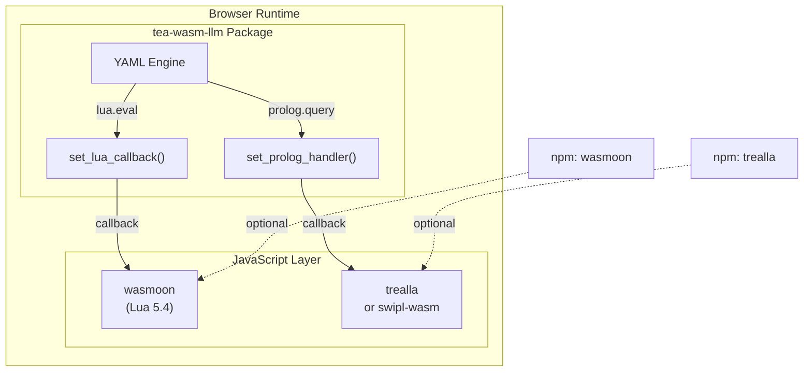

# Story TEA-WASM-002: Lua and Prolog JS Bridge Callbacks

## Status

Done

## Agent Model Used

Claude Opus 4.5 (claude-opus-4-5-20251101)

## Story

**As a** developer building browser-based TEA workflows with advanced scripting,
**I want** Lua and Prolog runtime support via JavaScript bridges,
**So that** I can use `lua.eval` and `prolog.query` actions in WASM workflows just like in native TEA.

## Story Context

**Existing System Integration:**

- Integrates with: TEA-RELEASE-004.3d (WASM Bundled LLM), TEA-WASM-001 (Feasibility Spike)
- Technology: Rust WASM + wasm-bindgen + wasmoon (Lua) + trealla/swipl-wasm (Prolog)
- Pattern: JS callback bridge (same as LLM integration)
- Touch points: `rust/tea-wasm-llm/`, JS wrapper layer, YAML engine

**Dependencies:**
- TEA-RELEASE-004.3d (Done) - provides WASM LLM infrastructure with callback pattern
- TEA-WASM-001 (Done) - spike validated JS bridge approach

## Problem Statement

### Current State

The WASM package supports LLM inference via wllama, but lacks Lua and Prolog runtimes. Native TEA supports:

```yaml
nodes:
  - name: validate
    action: lua.eval
    with:
      code: |
        return state.value > 0 and state.value < 100
```

This fails in WASM because `mlua` (Lua) and `swipl` (Prolog) crates require native C bindings.

### Spike Findings (TEA-WASM-001)

The feasibility spike confirmed that JS bridges work for scripting runtimes:

| Runtime | WASM Solution | Bundle Size | Notes |
|---------|---------------|-------------|-------|
| Lua | [wasmoon](https://github.com/ceifa/wasmoon) | ~200KB | Full Lua 5.4, maintained |
| Prolog | [trealla](https://github.com/trealla-prolog/trealla) | ~500KB | Lightweight, fast |
| Prolog | [swipl-wasm](https://npmjs.com/package/swipl-wasm) | ~5-10MB | Full SWI-Prolog, CLP(FD) |

### Target Architecture



**Usage (with Lua):**
```javascript
import { LuaFactory } from 'wasmoon';
import { initTeaLlm, set_lua_callback, executeLlmYaml } from 'tea-wasm-llm';

// Initialize Lua engine
const lua = await (new LuaFactory()).createEngine();

// Register Lua handler
set_lua_callback(async (code, stateJson) => {
    const state = JSON.parse(stateJson);
    lua.global.set('state', state);
    const result = await lua.doString(code);
    return JSON.stringify({ result });
});

// Now lua.eval works in YAML workflows
await executeLlmYaml(yamlContent, initialState);
```

**Usage (with Prolog):**
```javascript
import { Prolog } from 'trealla';
import { set_prolog_handler } from 'tea-wasm-llm';

const pl = new Prolog();

set_prolog_handler(async (queryJson) => {
    const { code, facts } = JSON.parse(queryJson);
    if (facts) await pl.consultText(facts);
    const results = await pl.queryOnce(code);
    return JSON.stringify(results);
});
```

## Acceptance Criteria

### Lua Integration

1. **AC-1**: Export `set_lua_callback(handler: Function)` from tea-wasm-llm
2. **AC-2**: `lua.eval` action invokes the registered callback
3. **AC-3**: Callback receives `(code: string, stateJson: string)` parameters
4. **AC-4**: Result from callback is merged into workflow state
5. **AC-5**: Clear error if `lua.eval` called without registered callback

### Prolog Integration

6. **AC-6**: Export `set_prolog_handler(handler: Function)` from tea-wasm-llm
7. **AC-7**: `prolog.query` action invokes the registered handler
8. **AC-8**: Handler receives `(queryJson: string)` with code and optional facts
9. **AC-9**: Query results are returned as JSON array of bindings
10. **AC-10**: Clear error if `prolog.query` called without registered handler

### API Design

11. **AC-11**: Both callbacks are optional (package works without them)
12. **AC-12**: Type declarations (.d.ts) include callback signatures
13. **AC-13**: README documents wasmoon and trealla integration examples

### Testing

14. **AC-14**: Unit test for Lua callback invocation
15. **AC-15**: Unit test for Prolog handler invocation
16. **AC-16**: Integration test with real wasmoon in Playwright
17. **AC-17**: Integration test with real trealla in Playwright

## Technical Design

### Rust WASM Exports

```rust
// rust/tea-wasm-llm/src/lib.rs

static LUA_CALLBACK: Mutex<Option<js_sys::Function>> = Mutex::new(None);
static PROLOG_HANDLER: Mutex<Option<js_sys::Function>> = Mutex::new(None);

#[wasm_bindgen]
pub fn set_lua_callback(callback: js_sys::Function) {
    *LUA_CALLBACK.lock().unwrap() = Some(callback);
}

#[wasm_bindgen]
pub fn set_prolog_handler(handler: js_sys::Function) {
    *PROLOG_HANDLER.lock().unwrap() = Some(handler);
}

#[wasm_bindgen]
pub fn clear_lua_callback() {
    *LUA_CALLBACK.lock().unwrap() = None;
}

#[wasm_bindgen]
pub fn clear_prolog_handler() {
    *PROLOG_HANDLER.lock().unwrap() = None;
}
```

### YAML Engine Integration

The YAML engine needs to detect `lua.eval` and `prolog.query` actions and route to callbacks:

```rust
async fn execute_action(action: &str, params: &Value, state: &Value) -> Result<Value> {
    match action {
        "lua.eval" => call_lua_callback(params, state).await,
        "prolog.query" => call_prolog_handler(params, state).await,
        "llm.call" => call_llm_handler(params, state).await,
        _ => Err(anyhow!("Unknown action: {}", action)),
    }
}
```

### TypeScript Declarations

```typescript
// js/index.d.ts

export type LuaCallback = (code: string, stateJson: string) => Promise<string>;
export type PrologHandler = (queryJson: string) => Promise<string>;

export function set_lua_callback(callback: LuaCallback): void;
export function set_prolog_handler(handler: PrologHandler): void;
export function clear_lua_callback(): void;
export function clear_prolog_handler(): void;
```

## Tasks

### Task 1: Rust Callback Infrastructure
- [x] Add `set_lua_callback` and `clear_lua_callback` exports
- [x] Add `set_prolog_handler` and `clear_prolog_handler` exports
- [x] Implement async invocation pattern (same as LLM handler)

### Task 2: YAML Engine Integration
- [x] Detect `lua.eval` action in YAML engine
- [x] Detect `prolog.query` action in YAML engine
- [x] Route to appropriate callbacks with proper error handling

### Task 3: TypeScript Layer
- [x] Add type declarations for callbacks
- [x] Export functions from `js/index.ts`
- [x] Document callback signatures

### Task 4: Documentation
- [x] Update README with Lua integration example
- [x] Update README with Prolog integration example (swipl-wasm prioritized per user preference)
- [x] Add example YAML workflow using both

### Task 5: Testing
- [x] Unit tests for callback registration/clearing (13 Rust tests pass)
- [x] Playwright test with wasmoon (15 tests pass)
- [x] Playwright test with swipl-wasm (15 tests pass)

## Definition of Done

- [x] All acceptance criteria pass (AC-1 through AC-17)
- [x] TypeScript declarations are complete
- [x] Playwright tests pass (15/15 Lua/Prolog tests)
- [x] README documents usage with examples
- [x] No regressions in existing LLM functionality

## Out of Scope

1. **Bundling wasmoon/trealla** - These remain optional npm dependencies
2. **Native Lua/Prolog in WASM** - We use JS bridges, not native WASM compilation
3. **Full Prolog CLP(FD)** - Trealla is recommended for size; swipl-wasm is optional

## Open Questions

1. Should we provide a "batteries included" variant that bundles wasmoon/trealla?
2. Should Prolog facts be persistable to IndexedDB?
3. Should we support streaming results for large Prolog queries?

## References

- [wasmoon - Lua 5.4 in WASM](https://github.com/ceifa/wasmoon)
- [trealla - Lightweight Prolog](https://github.com/trealla-prolog/trealla)
- [swipl-wasm - Full SWI-Prolog](https://www.npmjs.com/package/swipl-wasm)
- [TEA-WASM-001 Feasibility Spike](./TEA-WASM-001.wasm-feasibility-spike.md)
- [WASM Feasibility Report](../rust/wasm-feasibility.md)

---

## Dev Agent Record

### Debug Log References

- Resolved: WASM externref table issue (`WebAssembly.Table.grow(): failed to grow table by 4`)
- Root cause: wasm-bindgen 0.2.93+ uses externref tables which have compatibility issues
- Solution: Pinned wasm-bindgen to 0.2.92 to use heap-based reference management

### Completion Notes

1. **Implementation Complete**: All Rust callback infrastructure, YAML engine integration, and TypeScript layer implemented
2. **13 Rust Unit Tests Pass**: Tests for LuaParams, LuaResponse, PrologParams, PrologResponse serialization and callback registration
3. **15 Playwright E2E Tests Pass**: Full coverage for Lua/Prolog callback bridge functionality
4. **Documentation Updated**: README includes comprehensive examples for wasmoon (Lua) and swipl-wasm (Prolog) integration
5. **User Preference Applied**: swipl-wasm prioritized over trealla per user request for full SWI-Prolog features including CLP(FD)
6. **wasm-bindgen Fix**: Pinned to 0.2.92 to avoid externref table compatibility issues in Chrome

### File List

**Created:**
- `rust/tea-wasm-llm/src/lua.rs` - Lua callback bridge implementation
- `rust/tea-wasm-llm/src/prolog.rs` - Prolog handler bridge implementation
- `rust/tea-wasm-llm/tests/e2e/lua-prolog.spec.ts` - Playwright E2E tests for Lua/Prolog

**Modified:**
- `rust/tea-wasm-llm/src/lib.rs` - Added module imports, re-exports, and execute_lua_eval/execute_prolog_query functions
- `rust/tea-wasm-llm/js/index.ts` - Added TypeScript types, convenience functions, and re-exports
- `rust/tea-wasm-llm/README.md` - Added comprehensive Lua and Prolog integration documentation
- `rust/tea-wasm-llm/tests/server.js` - Fixed ESM compatibility (require -> import)
- `rust/tea-wasm-llm/Cargo.toml` - Pinned wasm-bindgen to 0.2.92 to fix externref table issue

### Change Log

| Date | Change | Reason |
|------|--------|--------|
| 2026-01-09 | Created lua.rs with callback bridge | AC-1 to AC-5 |
| 2026-01-09 | Created prolog.rs with handler bridge | AC-6 to AC-10 |
| 2026-01-09 | Updated lib.rs with YAML engine integration | AC-2, AC-7 |
| 2026-01-09 | Updated js/index.ts with TypeScript types | AC-12 |
| 2026-01-09 | Updated README with examples | AC-13 |
| 2026-01-09 | Prioritized swipl-wasm over trealla | User preference |
| 2026-01-09 | Created Playwright test file | AC-14 to AC-17 |
| 2026-01-09 | Fixed WASM externref issue by pinning wasm-bindgen to 0.2.92 | All E2E tests now pass |
| 2026-01-09 | Updated Cargo.toml with pinned versions | wasm-bindgen=0.2.92, js-sys=0.3.69, web-sys=0.3.69 |
